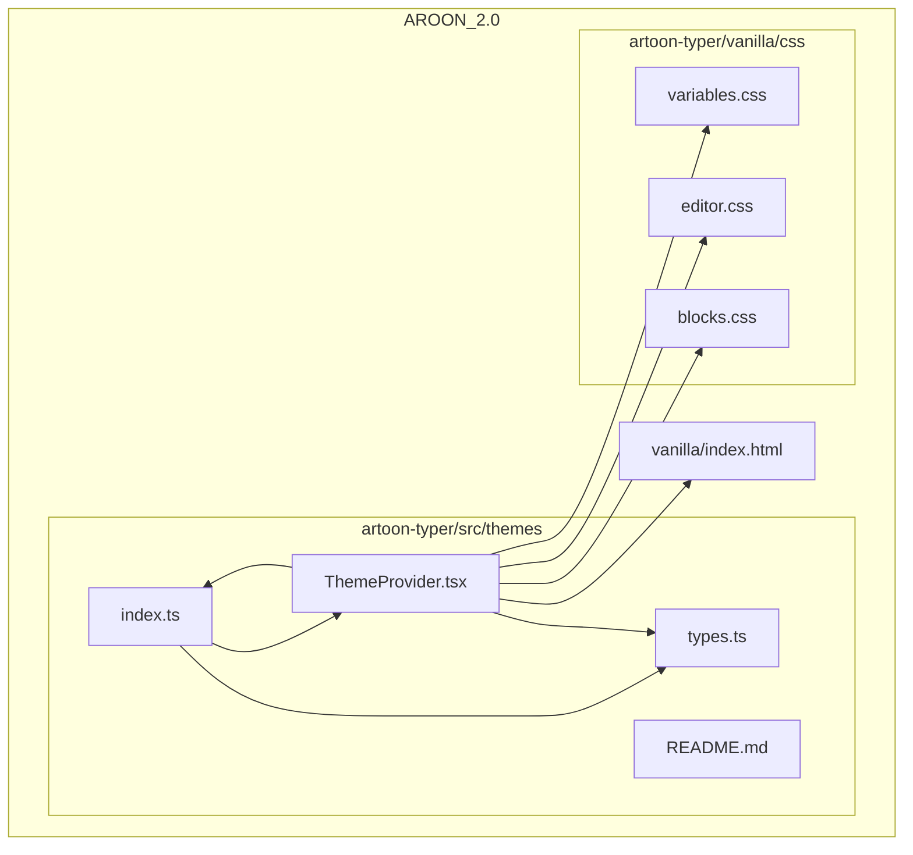
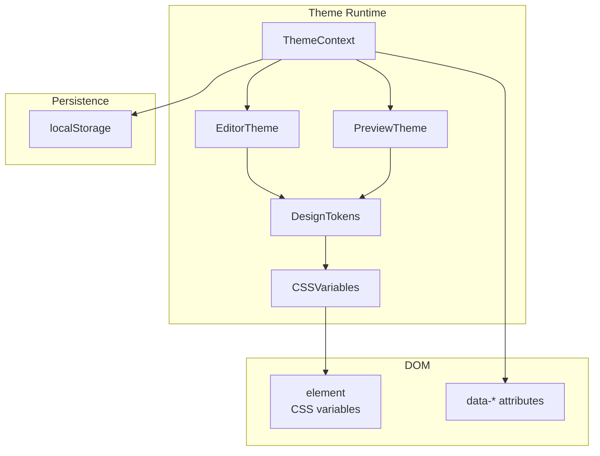
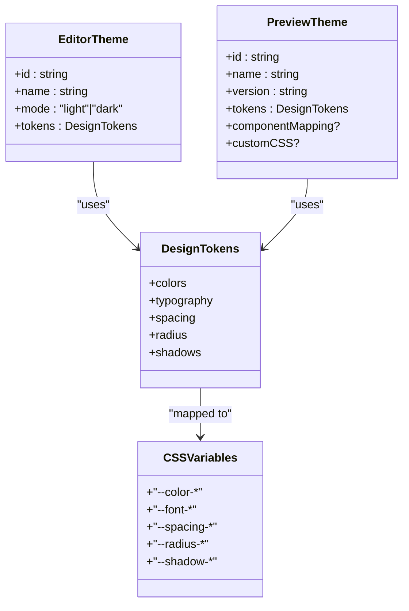
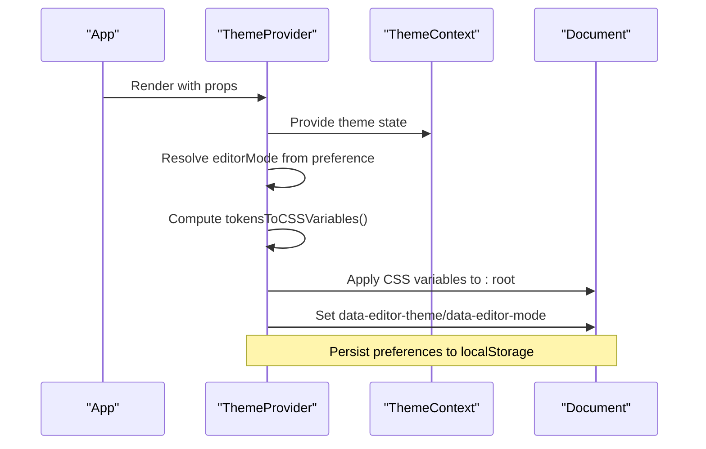
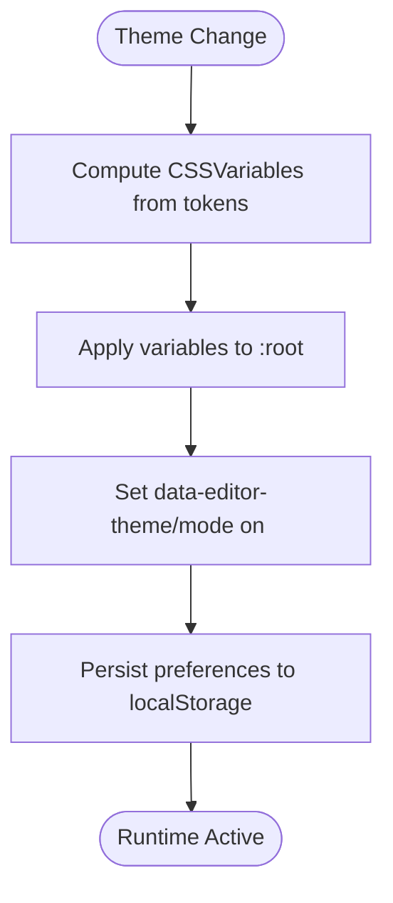
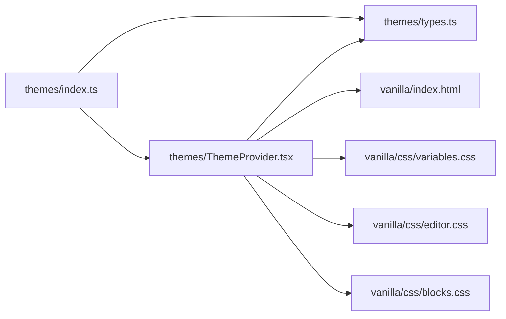

# Theme System

<cite>
**Referenced Files in This Document**
- [index.ts](file://artoon-typer/src/themes/index.ts)
- [types.ts](file://artoon-typer/src/themes/types.ts)
- [ThemeProvider.tsx](file://artoon-typer/src/themes/ThemeProvider.tsx)
- [README.md](file://artoon-typer/src/themes/README.md)
- [vanilla/css/variables.css](file://artoon-typer/vanilla/css/variables.css)
- [vanilla/css/editor.css](file://artoon-typer/vanilla/css/editor.css)
- [vanilla/css/blocks.css](file://artoon-typer/vanilla/css/blocks.css)
- [vanilla/index.html](file://artoon-typer/vanilla/index.html)
</cite>

## Table of Contents
1. [Introduction](#introduction)
2. [Project Structure](#project-structure)
3. [Core Components](#core-components)
4. [Architecture Overview](#architecture-overview)
5. [Detailed Component Analysis](#detailed-component-analysis)
6. [Dependency Analysis](#dependency-analysis)
7. [Performance Considerations](#performance-considerations)
8. [Troubleshooting Guide](#troubleshooting-guide)
9. [Conclusion](#conclusion)
10. [Appendices](#appendices)

## Introduction
This document explains the ARTOON HTML theme system, focusing on its dual-theme architecture that separates editor interface theming from content preview theming. It covers the design token model, CSS variable-based theming, built-in theme variants, and practical guidance for creating and applying custom themes. It also documents the CSS architecture, responsive design considerations, accessibility features, theme inheritance patterns, and integration with external styling systems.

## Project Structure
The theme system resides in the ARTOON-TYPER package under the themes directory. It exports a dual-theme API for editor and preview modes, provides a React context provider to manage theme state and persistence, and defines a comprehensive design token model mapped to CSS variables.

**Diagram sources**
- [index.ts:1-40](file://artoon-typer/src/themes/index.ts#L1-L40)
- [types.ts:1-383](file://artoon-typer/src/themes/types.ts#L1-L383)
- [ThemeProvider.tsx:1-268](file://artoon-typer/src/themes/ThemeProvider.tsx#L1-L268)
- [README.md:1-366](file://artoon-typer/src/themes/README.md#L1-L366)
- [vanilla/css/variables.css](file://artoon-typer/vanilla/css/variables.css)
- [vanilla/css/editor.css](file://artoon-typer/vanilla/css/editor.css)
- [vanilla/css/blocks.css](file://artoon-typer/vanilla/css/blocks.css)
- [vanilla/index.html](file://artoon-typer/vanilla/index.html)

**Section sources**
- [index.ts:1-40](file://artoon-typer/src/themes/index.ts#L1-L40)
- [README.md:1-366](file://artoon-typer/src/themes/README.md#L1-L366)

## Core Components
- Dual theme types and tokens:
  - Design tokens define semantic color scales, typography scales, spacing, border radii, and shadows.
  - EditorTheme and PreviewTheme encapsulate metadata and tokens for the editor UI and content presentation respectively.
  - CSSVariables represent the flattened CSS variable mapping derived from tokens.
- ThemeProvider:
  - Manages editor preference (light/dark/system), resolves effective editor mode, and applies CSS variables to the document root.
  - Manages preview theme selection, supports custom preview themes, and persists preferences in localStorage.
  - Provides a React context with convenient setters and toggles for theme switching.
- Public exports:
  - Centralized re-exports for types, editor themes, preview themes, and the provider/hook.

Key capabilities:
- System preference detection and live updates via media queries.
- Persistence of user preferences across sessions.
- Seamless integration with HTML rendering pipeline for content themes.

**Section sources**
- [types.ts:18-112](file://artoon-typer/src/themes/types.ts#L18-L112)
- [types.ts:154-163](file://artoon-typer/src/themes/types.ts#L154-L163)
- [types.ts:172-190](file://artoon-typer/src/themes/types.ts#L172-L190)
- [types.ts:243-309](file://artoon-typer/src/themes/types.ts#L243-L309)
- [types.ts:314-382](file://artoon-typer/src/themes/types.ts#L314-L382)
- [ThemeProvider.tsx:106-250](file://artoon-typer/src/themes/ThemeProvider.tsx#L106-L250)
- [index.ts:9-39](file://artoon-typer/src/themes/index.ts#L9-L39)

## Architecture Overview
The theme system follows a dual-layer design:
- Editor Theme Layer: Controls the editing interface (light/dark) and injects CSS variables scoped to the editor.
- Preview Theme Layer: Controls how rendered content appears (Minimal, Blog, Documentation, Academic) and can be customized per document or globally.

**Diagram sources**
- [ThemeProvider.tsx:106-250](file://artoon-typer/src/themes/ThemeProvider.tsx#L106-L250)
- [types.ts:154-190](file://artoon-typer/src/themes/types.ts#L154-L190)
- [types.ts:314-382](file://artoon-typer/src/themes/types.ts#L314-L382)

## Detailed Component Analysis

### Theme Types and Design Tokens
Design tokens form the semantic foundation for both editor and preview themes. They include:
- Color scales: primary, secondary, success, warning, error; text palettes; background palettes; border palettes.
- Typography scales: font families for headings/body/code; font sizes; font weights; line heights.
- Spacing, radius, and shadow scales.

These tokens are converted to CSS variables for runtime application.

**Diagram sources**
- [types.ts:18-112](file://artoon-typer/src/themes/types.ts#L18-L112)
- [types.ts:154-163](file://artoon-typer/src/themes/types.ts#L154-L163)
- [types.ts:172-190](file://artoon-typer/src/themes/types.ts#L172-L190)
- [types.ts:243-309](file://artoon-typer/src/themes/types.ts#L243-L309)

**Section sources**
- [types.ts:18-112](file://artoon-typer/src/themes/types.ts#L18-L112)
- [types.ts:243-309](file://artoon-typer/src/themes/types.ts#L243-L309)
- [types.ts:314-382](file://artoon-typer/src/themes/types.ts#L314-L382)

### ThemeProvider: State Management and CSS Injection
The ThemeProvider manages:
- Editor theme state: preference resolution, system preference listener, and CSS variable application to the document root.
- Preview theme state: theme selection, custom theme support, and persistence.
- Context value: exposes getters, setters, and toggles for theme manipulation.

**Diagram sources**
- [ThemeProvider.tsx:106-250](file://artoon-typer/src/themes/ThemeProvider.tsx#L106-L250)

**Section sources**
- [ThemeProvider.tsx:50-100](file://artoon-typer/src/themes/ThemeProvider.tsx#L50-L100)
- [ThemeProvider.tsx:106-250](file://artoon-typer/src/themes/ThemeProvider.tsx#L106-L250)

### Built-in Theme Variants
The system ships with predefined preview themes and editor themes:
- Editor themes: light and dark modes.
- Preview themes: minimal, blog, documentation, academic.

These are exported and selectable via the context API.

**Section sources**
- [index.ts:23-35](file://artoon-typer/src/themes/index.ts#L23-L35)
- [README.md:34-109](file://artoon-typer/src/themes/README.md#L34-L109)

### Creating and Applying Custom Themes
- Preview themes can be defined as custom objects conforming to PreviewTheme and applied via setCustomPreviewTheme.
- Editor themes are resolved by mode; custom editor themes can be integrated by extending the editor theme registry and updating getEditorTheme accordingly.

Practical steps:
- Define a PreviewTheme object with tokens and optional customCSS.
- Use setCustomPreviewTheme to activate it.
- Persist user choice using localStorage keys managed by the provider.

**Section sources**
- [README.md:173-218](file://artoon-typer/src/themes/README.md#L173-L218)
- [ThemeProvider.tsx:160-175](file://artoon-typer/src/themes/ThemeProvider.tsx#L160-L175)

### CSS Architecture and Variable Mapping
The design token model maps directly to CSS variables attached to the document root. This enables:
- Consistent theming across components.
- Easy overrides via downstream CSS.
- Theming of both editor UI and rendered content.

**Diagram sources**
- [types.ts:314-382](file://artoon-typer/src/themes/types.ts#L314-L382)
- [ThemeProvider.tsx:63-72](file://artoon-typer/src/themes/ThemeProvider.tsx#L63-L72)
- [ThemeProvider.tsx:207-216](file://artoon-typer/src/themes/ThemeProvider.tsx#L207-L216)

**Section sources**
- [types.ts:314-382](file://artoon-typer/src/themes/types.ts#L314-L382)
- [ThemeProvider.tsx:63-72](file://artoon-typer/src/themes/ThemeProvider.tsx#L63-L72)
- [ThemeProvider.tsx:207-216](file://artoon-typer/src/themes/ThemeProvider.tsx#L207-L216)

### Responsive Design and Accessibility Considerations
- Responsive design is achieved through modular CSS files for variables, editor UI, and block rendering. These can be combined and scoped to achieve responsive layouts.
- Accessibility is supported by semantic color roles (text, background, borders) and sufficient contrast ensured by the token model. Authors can further refine contrast and sizing via custom themes.

Integration points:
- Use preview themes to adjust typography and spacing for readability.
- Apply customCSS in PreviewTheme for advanced layout tweaks while maintaining accessibility guidelines.

**Section sources**
- [README.md:222-250](file://artoon-typer/src/themes/README.md#L222-L250)
- [vanilla/css/variables.css](file://artoon-typer/vanilla/css/variables.css)
- [vanilla/css/editor.css](file://artoon-typer/vanilla/css/editor.css)
- [vanilla/css/blocks.css](file://artoon-typer/vanilla/css/blocks.css)

### Theme Inheritance and Composition
- Token-based design enables composition: derive new themes by overriding specific token values while inheriting others.
- Preview themes can include componentMapping and customCSS for specialized rendering and layout adjustments.
- Editor themes are resolved by mode; adding new editor themes requires extending the editor theme registry and ensuring tokens are mapped to CSS variables.

**Section sources**
- [types.ts:172-190](file://artoon-typer/src/themes/types.ts#L172-L190)
- [types.ts:314-382](file://artoon-typer/src/themes/types.ts#L314-L382)
- [README.md:173-218](file://artoon-typer/src/themes/README.md#L173-L218)

### Integration with External Styling Systems
- The provider injects CSS variables at the document root, allowing downstream CSS to consume them.
- Preview themes can include customCSS for global overrides, enabling integration with external frameworks or libraries.
- The separation of editor and preview themes allows independent styling of the editing surface and rendered output.

**Section sources**
- [ThemeProvider.tsx:63-72](file://artoon-typer/src/themes/ThemeProvider.tsx#L63-L72)
- [types.ts:186-189](file://artoon-typer/src/themes/types.ts#L186-L189)
- [README.md:203-212](file://artoon-typer/src/themes/README.md#L203-L212)

## Dependency Analysis
The theme system is cohesive and low-coupled:
- index.ts re-exports types, editor/preview theme APIs, and the provider/hook.
- ThemeProvider depends on types and theme registries to compute and apply CSS variables.
- Vanilla CSS demonstrates how CSS variables are consumed by UI and block styles.

**Diagram sources**
- [index.ts:1-40](file://artoon-typer/src/themes/index.ts#L1-L40)
- [types.ts:1-383](file://artoon-typer/src/themes/types.ts#L1-L383)
- [ThemeProvider.tsx:1-268](file://artoon-typer/src/themes/ThemeProvider.tsx#L1-L268)
- [vanilla/index.html](file://artoon-typer/vanilla/index.html)
- [vanilla/css/variables.css](file://artoon-typer/vanilla/css/variables.css)
- [vanilla/css/editor.css](file://artoon-typer/vanilla/css/editor.css)
- [vanilla/css/blocks.css](file://artoon-typer/vanilla/css/blocks.css)

**Section sources**
- [index.ts:1-40](file://artoon-typer/src/themes/index.ts#L1-L40)
- [ThemeProvider.tsx:106-250](file://artoon-typer/src/themes/ThemeProvider.tsx#L106-L250)

## Performance Considerations
- CSS variable application is O(n) with respect to the number of variables; the current set is bounded and efficient.
- ThemeProvider computes variables and applies them only when tokens change, minimizing unnecessary DOM writes.
- Using localStorage for persistence avoids repeated computation of preferences on each render.

Recommendations:
- Keep token sets minimal and reuse values across themes.
- Prefer CSS variable overrides for small tweaks rather than frequent theme recomputation.

[No sources needed since this section provides general guidance]

## Troubleshooting Guide
Common issues and resolutions:
- Theme not changing:
  - Verify editorPreference is set and persisted; check localStorage keys.
  - Confirm CSS variables are applied to the document root.
- Preview theme not sticking:
  - Ensure setPreviewTheme is called with a valid theme ID or setCustomPreviewTheme is used for custom themes.
  - Check that customCSS does not introduce conflicts.
- System preference not detected:
  - Confirm media query listeners are active and browser supports the required APIs.

**Section sources**
- [ThemeProvider.tsx:178-201](file://artoon-typer/src/themes/ThemeProvider.tsx#L178-L201)
- [ThemeProvider.tsx:207-216](file://artoon-typer/src/themes/ThemeProvider.tsx#L207-L216)
- [README.md:270-287](file://artoon-typer/src/themes/README.md#L270-L287)

## Conclusion
The ARTOON theme system provides a robust, token-driven approach to dual theming. By separating editor and preview concerns, it offers flexibility and maintainability. The design token model, CSS variable mapping, and React context provider enable easy customization, persistence, and integration with external styling systems.

[No sources needed since this section summarizes without analyzing specific files]

## Appendices

### Practical Examples Index
- Using ThemeProvider in an app and consuming the theme context.
- Switching editor themes and selecting preview themes.
- Defining and applying a custom preview theme with customCSS.

**Section sources**
- [README.md:112-169](file://artoon-typer/src/themes/README.md#L112-L169)
- [README.md:291-330](file://artoon-typer/src/themes/README.md#L291-L330)
- [README.md:173-218](file://artoon-typer/src/themes/README.md#L173-L218)