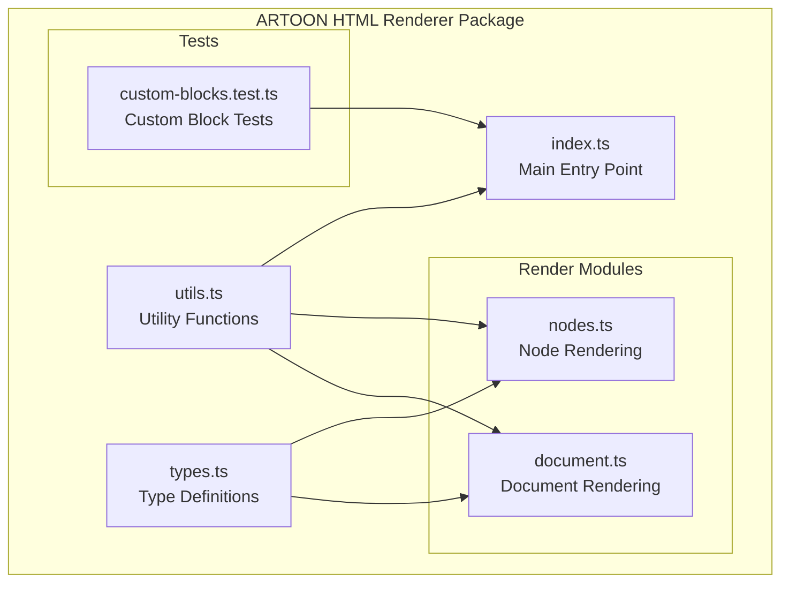
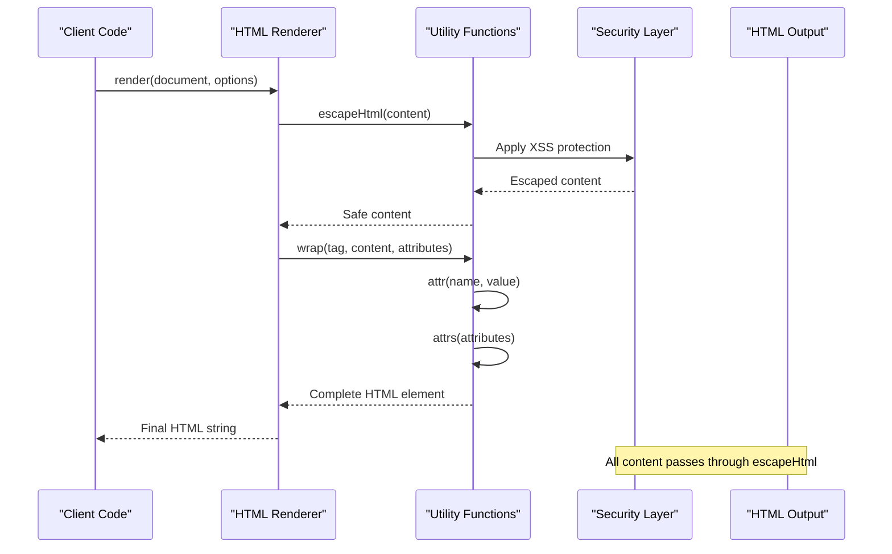
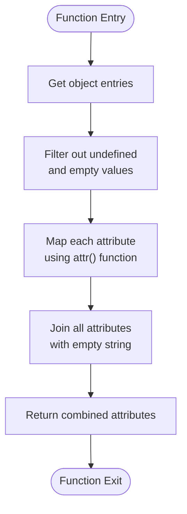
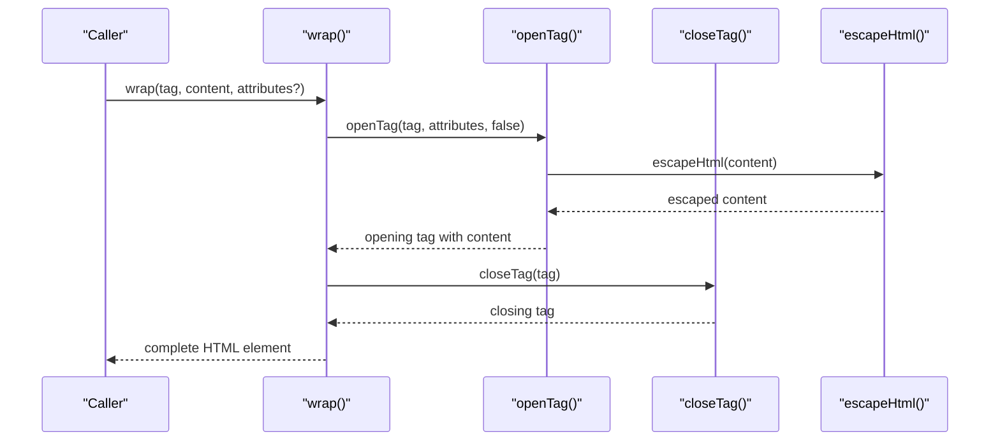
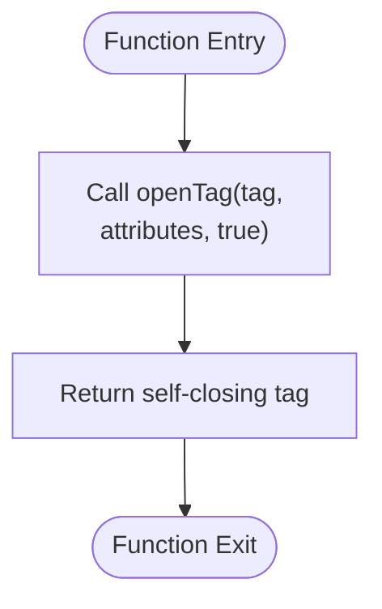
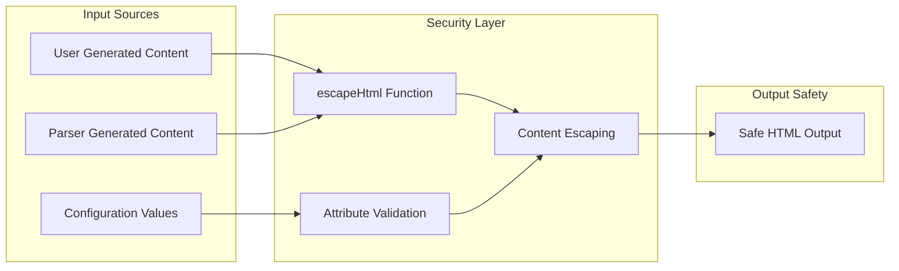
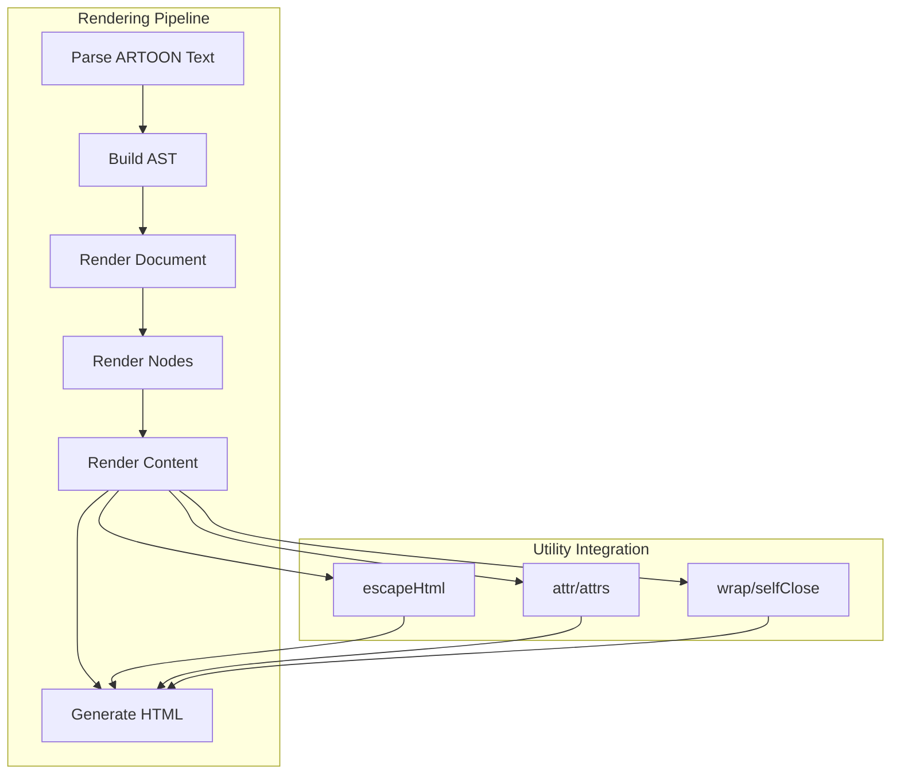

# Utility Functions

<cite>
**Referenced Files in This Document**
- [utils.ts](file://artoon-renderer-html/src/utils.ts)
- [index.ts](file://artoon-renderer-html/src/index.ts)
- [nodes.ts](file://artoon-renderer-html/src/render/nodes.ts)
- [document.ts](file://artoon-renderer-html/src/render/document.ts)
- [types.ts](file://artoon-renderer-html/src/types.ts)
- [custom-blocks.test.ts](file://artoon-renderer-html/tests/custom-blocks.test.ts)
</cite>

## Table of Contents
1. [Introduction](#introduction)
2. [Project Structure](#project-structure)
3. [Core Components](#core-components)
4. [Architecture Overview](#architecture-overview)
5. [Detailed Component Analysis](#detailed-component-analysis)
6. [Security Considerations](#security-considerations)
7. [Performance Analysis](#performance-analysis)
8. [Usage Patterns and Examples](#usage-patterns-and-examples)
9. [Integration with Rendering Pipeline](#integration-with-rendering-pipeline)
10. [Troubleshooting Guide](#troubleshooting-guide)
11. [Conclusion](#conclusion)

## Introduction

The HTML renderer utility functions in the ARTOON project provide essential building blocks for safe and efficient HTML generation. These utilities form the foundation of the HTML rendering pipeline, handling everything from content escaping to element construction and attribute management. The utilities are designed with security-first principles and performance optimization in mind, ensuring robust HTML output while maintaining flexibility for complex rendering scenarios.

## Project Structure

The HTML renderer utilities are organized within the `artoon-renderer-html` package, which serves as a specialized renderer for converting ARTOON documents to HTML format. The utility functions are strategically placed in the `src/utils.ts` file and are exported through the main entry point.



**Diagram sources**
- [utils.ts:1-80](file://artoon-renderer-html/src/utils.ts#L1-L80)
- [index.ts:1-57](file://artoon-renderer-html/src/index.ts#L1-L57)
- [nodes.ts:1-755](file://artoon-renderer-html/src/render/nodes.ts#L1-L755)
- [document.ts:1-132](file://artoon-renderer-html/src/render/document.ts#L1-L132)

**Section sources**
- [utils.ts:1-80](file://artoon-renderer-html/src/utils.ts#L1-L80)
- [index.ts:1-57](file://artoon-renderer-html/src/index.ts#L1-L57)

## Core Components

The HTML renderer utilities consist of five primary functions that work together to provide comprehensive HTML generation capabilities:

### escapeHtml Function
The `escapeHtml` function provides essential XSS protection by converting HTML special characters to their corresponding HTML entities. This function is the cornerstone of the renderer's security model, ensuring that user-generated content cannot inject malicious scripts or break the HTML structure.

### Attribute Management Functions
The `attr` and `attrs` functions handle attribute creation and management. They provide a consistent way to add attributes to HTML elements while automatically applying content escaping and filtering out undefined or empty values.

### Element Construction Functions
The `wrap`, `openTag`, `closeTag`, and `selfClose` functions provide a complete toolkit for element construction. These functions work together to create well-formed HTML elements with proper attribute handling and content wrapping.

**Section sources**
- [utils.ts:6-71](file://artoon-renderer-html/src/utils.ts#L6-L71)

## Architecture Overview

The utility functions integrate seamlessly into the broader HTML rendering architecture, serving as the foundational layer for all HTML generation operations.



**Diagram sources**
- [utils.ts:6-71](file://artoon-renderer-html/src/utils.ts#L6-L71)
- [nodes.ts:30](file://artoon-renderer-html/src/render/nodes.ts#L30)
- [document.ts:5](file://artoon-renderer-html/src/render/document.ts#L5)

The architecture ensures that every piece of content flowing through the renderer is properly escaped, preventing XSS vulnerabilities while maintaining rendering flexibility.

**Section sources**
- [nodes.ts:30](file://artoon-renderer-html/src/render/nodes.ts#L30)
- [document.ts:5](file://artoon-renderer-html/src/render/document.ts#L5)

## Detailed Component Analysis

### escapeHtml Function

The `escapeHtml` function implements comprehensive HTML entity encoding to prevent cross-site scripting attacks. It systematically converts all HTML special characters to their safe equivalents.

```mermaid
flowchart TD
Start([Function Entry]) --> ValidateInput["Validate Input String"]
ValidateInput --> CheckEmpty{"Is String Empty?"}
CheckEmpty --> |Yes| ReturnEmpty["Return Empty String"]
CheckEmpty --> |No| ProcessAmp["Replace '&' with '&amp;'"]
ProcessAmp --> ProcessLt["Replace '<' with '&lt;'"]
ProcessLt --> ProcessGt["Replace '>' with '&gt;'"]
ProcessGt --> ProcessQuote["Replace '\"' with '&quot;'"]
ProcessQuote --> ProcessApos["Replace ''' with '&#39;'"]
ProcessApos --> ReturnResult["Return Escaped String"]
ReturnEmpty --> End([Function Exit])
ReturnResult --> End
```

**Diagram sources**
- [utils.ts:6-12](file://artoon-renderer-html/src/utils.ts#L6-L12)

**Security Implementation**: The function escapes five critical HTML characters:
- Ampersand (&) → &amp;
- Less than (<) → &lt;
- Greater than (>) → &gt;
- Double quote (") → &quot;
- Single quote (') → &#39;

**Performance Characteristics**: O(n) time complexity where n is the length of the input string. The function performs five sequential string replacement operations, making it linearly proportional to input size.

**Usage Pattern**: Called automatically by all element construction functions and directly by content rendering functions.

**Section sources**
- [utils.ts:6-13](file://artoon-renderer-html/src/utils.ts#L6-L13)

### attr Function

The `attr` function creates individual HTML attributes with proper escaping and validation.

```mermaid
flowchart TD
Start([Function Entry]) --> ValidateValue["Check attribute value"]
ValidateValue --> IsUndefined{"Value is undefined<br/>or empty?"}
IsUndefined --> |Yes| ReturnEmpty["Return empty string"]
IsUndefined --> |No| EscapeValue["Escape attribute value<br/>using escapeHtml"]
EscapeValue --> FormatAttr["Format as ' name=\"value\"'"]
FormatAttr --> ReturnResult["Return formatted attribute"]
ReturnEmpty --> End([Function Exit])
ReturnResult --> End
```

**Diagram sources**
- [utils.ts:18-21](file://artoon-renderer-html/src/utils.ts#L18-L21)

**Validation Logic**: Automatically filters out undefined and empty values, ensuring clean HTML output without extraneous whitespace.

**Security Features**: All attribute values pass through the `escapeHtml` function, preventing attribute injection attacks.

**Performance**: O(n) where n is the length of the attribute value, plus constant overhead for string formatting.

**Section sources**
- [utils.ts:18-21](file://artoon-renderer-html/src/utils.ts#L18-L21)

### attrs Function

The `attrs` function handles batch attribute processing for multiple attributes.



**Diagram sources**
- [utils.ts:26-31](file://artoon-renderer-html/src/utils.ts#L26-L31)

**Processing Pipeline**:
1. Converts object to key-value pairs
2. Filters out invalid values (undefined, empty string)
3. Applies `attr()` function to each valid pair
4. Concatenates all formatted attributes

**Performance**: O(n + m) where n is the total length of all attribute values and m is the number of attributes processed.

**Section sources**
- [utils.ts:26-31](file://artoon-renderer-html/src/utils.ts#L26-L31)

### wrap Function

The `wrap` function provides the primary mechanism for creating complete HTML elements with content and attributes.



**Diagram sources**
- [utils.ts:55-61](file://artoon-renderer-html/src/utils.ts#L55-L61)
- [utils.ts:36-43](file://artoon-renderer-html/src/utils.ts#L36-L43)
- [utils.ts:48-50](file://artoon-renderer-html/src/utils.ts#L48-L50)

**Implementation Pattern**: Uses composition with other utility functions (`openTag`, `closeTag`, `escapeHtml`) to ensure consistent behavior and security.

**Flexibility**: Supports optional attributes parameter, allowing for both simple and complex element construction.

**Section sources**
- [utils.ts:55-61](file://artoon-renderer-html/src/utils.ts#L55-L61)

### selfClose Function

The `selfClose` function specializes in creating self-closing HTML elements for void elements.



**Diagram sources**
- [utils.ts:66-71](file://artoon-renderer-html/src/utils.ts#L66-L71)

**Void Element Support**: Specifically designed for HTML void elements (img, br, hr, meta, etc.) that cannot contain content.

**Attribute Handling**: Inherits all attribute processing logic from `openTag`, ensuring consistent escaping and validation.

**Section sources**
- [utils.ts:66-71](file://artoon-renderer-html/src/utils.ts#L66-L71)

## Security Considerations

### XSS Prevention Strategy

The utility functions implement a comprehensive XSS prevention strategy through automatic content escaping:



**Diagram sources**
- [utils.ts:6-12](file://artoon-renderer-html/src/utils.ts#L6-L12)
- [utils.ts:18-21](file://artoon-renderer-html/src/utils.ts#L18-L21)

### Security Features Implemented

1. **Automatic Content Escaping**: All user-provided content passes through `escapeHtml` before rendering
2. **Attribute Injection Prevention**: `attr` and `attrs` functions ensure attribute values are properly escaped
3. **Input Validation**: Functions filter out undefined and empty values to prevent malformed HTML
4. **Consistent Security Model**: Every rendering path goes through the same security functions

### Security Testing Evidence

The custom blocks tests demonstrate comprehensive XSS protection:

- Attribute values with quotes are properly escaped: `"test &quot;quoted&quot; value"`
- Field values containing HTML entities are safely escaped
- Special characters in block names and field values are handled correctly

**Section sources**
- [custom-blocks.test.ts:261-285](file://artoon-renderer-html/tests/custom-blocks.test.ts#L261-L285)

## Performance Analysis

### Complexity Analysis

| Function | Time Complexity | Space Complexity | Notes |
|----------|----------------|------------------|-------|
| `escapeHtml` | O(n) | O(n) | Linear to input length |
| `attr` | O(m) | O(m) | m = length of value |
| `attrs` | O(n + m) | O(n + m) | n = total chars, m = num attrs |
| `wrap` | O(n + m) | O(n + m) | n = content length, m = attrs |
| `selfClose` | O(m) | O(m) | m = attribute values |

### Performance Optimizations

1. **Single Pass Escaping**: `escapeHtml` performs all replacements in a single pass
2. **Early Filtering**: `attrs` filters out invalid values before processing
3. **String Concatenation**: Efficient use of template literals and string concatenation
4. **Minimal Memory Allocation**: Functions avoid unnecessary intermediate arrays

### Performance Impact Assessment

The utility functions have minimal performance impact on overall rendering:

- **CPU Overhead**: Negligible compared to parsing and rendering operations
- **Memory Usage**: Proportional to content size, with minimal overhead
- **Scalability**: Linear performance characteristics scale well with content size

## Usage Patterns and Examples

### Basic Element Construction

The utilities work together to provide flexible element construction patterns:

```mermaid
graph TB
subgraph "Element Construction Patterns"
Pattern1[Simple Element<br/>wrap('div', 'content')]
Pattern2[Element with Attributes<br/>wrap('a', 'link', {href: 'url'})]
Pattern3[Self-Closing Element<br/>selfClose('img', {src: 'image.jpg'})]
Pattern4[Complex Composition<br/>wrap('div', wrap('p', 'text'))]
end
Pattern1 --> Pattern4
Pattern2 --> Pattern4
Pattern3 --> Pattern4
```

### Advanced Attribute Handling

The attribute system supports complex scenarios:

- **Dynamic Attributes**: Attributes computed at runtime
- **Conditional Attributes**: Only included when values are present
- **Mixed Content**: Combination of static and dynamic attributes
- **Custom Attribute Mapping**: Integration with custom block systems

### Content Escaping Scenarios

The escaping system handles various content types:

- **Plain Text**: Standard character escaping
- **HTML Markup**: Prevents injection of script tags
- **Quotes and Special Characters**: Proper entity conversion
- **International Characters**: Unicode preservation with safety

**Section sources**
- [custom-blocks.test.ts:232-315](file://artoon-renderer-html/tests/custom-blocks.test.ts#L232-L315)

## Integration with Rendering Pipeline

### Renderer Integration Points

The utility functions are integrated throughout the rendering pipeline:



**Diagram sources**
- [nodes.ts:30](file://artoon-renderer-html/src/render/nodes.ts#L30)
- [document.ts:5](file://artoon-renderer-html/src/render/document.ts#L5)

### Function Dependencies

The utilities have strategic dependencies within the rendering system:

- **nodes.ts**: Imports all utility functions for element construction
- **document.ts**: Uses `escapeHtml` and `wrap` for document metadata
- **types.ts**: Defines the HTML mapping system that drives utility usage

**Section sources**
- [nodes.ts:30](file://artoon-renderer-html/src/render/nodes.ts#L30)
- [document.ts:5](file://artoon-renderer-html/src/render/document.ts#L5)

## Troubleshooting Guide

### Common Issues and Solutions

#### Issue: Unexpected Empty Attributes
**Symptom**: Attributes not appearing in generated HTML
**Cause**: Attribute values were undefined or empty
**Solution**: Ensure all attribute values are defined and non-empty

#### Issue: Content Not Escaping
**Symptom**: Raw HTML appears in output
**Cause**: Content bypassed escaping functions
**Solution**: Verify all content passes through `escapeHtml`

#### Issue: Malformed HTML Tags
**Symptom**: Self-closing tags missing `/`
**Cause**: Using `openTag` incorrectly
**Solution**: Use `selfClose` for void elements or set `selfClosing=true`

### Debugging Strategies

1. **Trace Function Calls**: Monitor which utility functions are being called
2. **Validate Input**: Check that all inputs are properly sanitized
3. **Test Edge Cases**: Verify behavior with empty strings and special characters
4. **Review Integration Points**: Ensure all rendering paths use utilities consistently

### Performance Monitoring

- **Monitor Escape Operations**: Track frequency of `escapeHtml` calls
- **Attribute Processing**: Measure `attrs` function performance with large attribute sets
- **Memory Usage**: Watch for memory leaks in repeated rendering operations

## Conclusion

The HTML renderer utility functions in ARTOON provide a robust, secure, and efficient foundation for HTML generation. Through careful design and comprehensive security measures, these utilities ensure that user-generated content remains safe while maintaining flexibility for complex rendering scenarios.

The modular architecture allows for easy maintenance and extension, while the consistent API design enables seamless integration throughout the rendering pipeline. The emphasis on security-first development, combined with performance optimization, makes these utilities suitable for production environments handling diverse content types.

Key strengths include comprehensive XSS protection, flexible attribute handling, and efficient string processing. The utilities serve as both building blocks for the renderer and potential standalone tools for other HTML generation tasks within the ARTOON ecosystem.