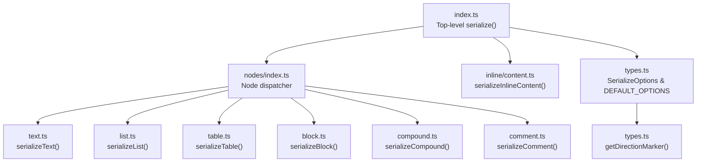
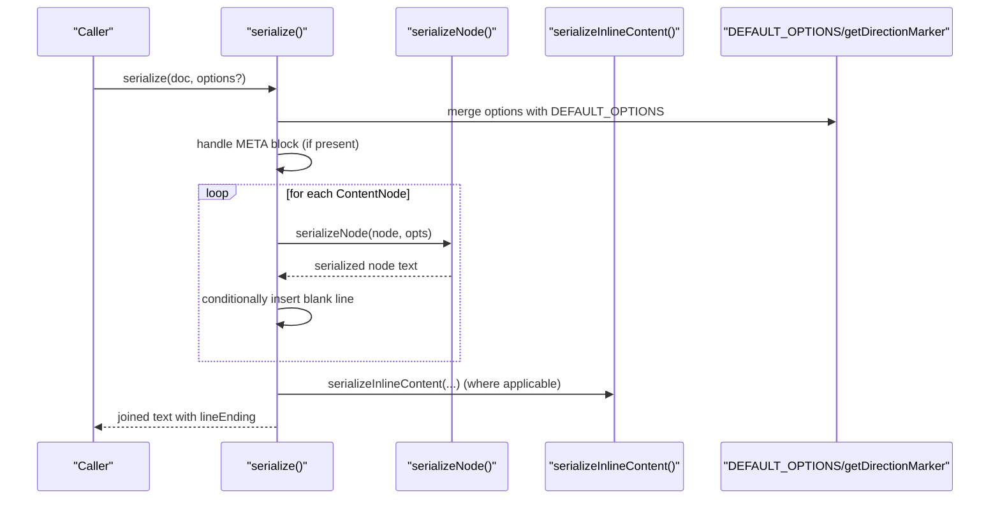
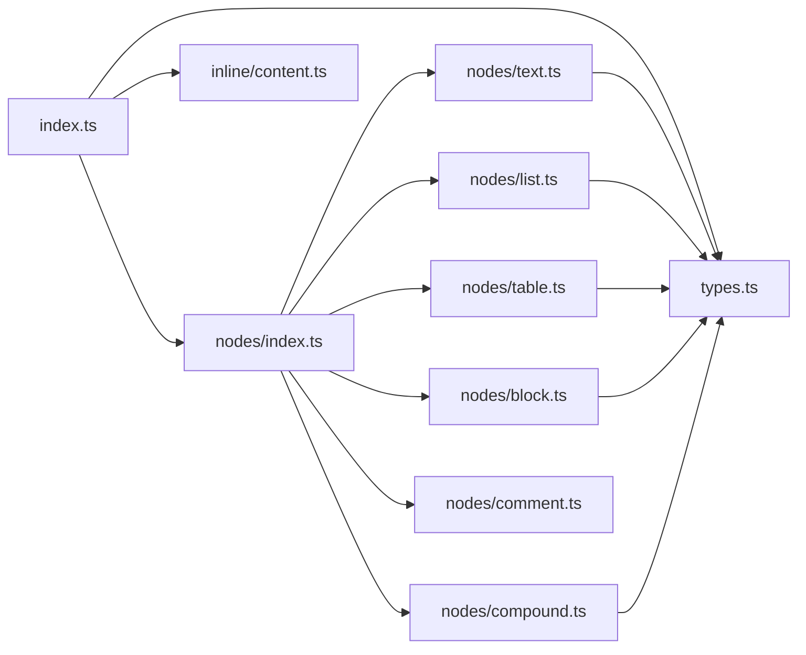

# Formatting Options and Customization

<cite>
**Referenced Files in This Document**
- [index.ts](file://artoon-serializer/src/index.ts)
- [types.ts](file://artoon-serializer/src/types.ts)
- [nodes/index.ts](file://artoon-serializer/src/nodes/index.ts)
- [block.ts](file://artoon-serializer/src/nodes/block.ts)
- [text.ts](file://artoon-serializer/src/nodes/text.ts)
- [list.ts](file://artoon-serializer/src/nodes/list.ts)
- [table.ts](file://artoon-serializer/src/nodes/table.ts)
- [compound.ts](file://artoon-serializer/src/nodes/compound.ts)
- [comment.ts](file://artoon-serializer/src/nodes/comment.ts)
- [content.ts](file://artoon-serializer/src/inline/content.ts)
- [serialize.test.ts](file://artoon-serializer/tests/serialize.test.ts)
- [README.md](file://artoon-serializer/README.md)
- [package.json](file://artoon-serializer/package.json)
</cite>

## Table of Contents
1. [Introduction](#introduction)
2. [Project Structure](#project-structure)
3. [Core Components](#core-components)
4. [Architecture Overview](#architecture-overview)
5. [Detailed Component Analysis](#detailed-component-analysis)
6. [Dependency Analysis](#dependency-analysis)
7. [Performance Considerations](#performance-considerations)
8. [Troubleshooting Guide](#troubleshooting-guide)
9. [Conclusion](#conclusion)
10. [Appendices](#appendices)

## Introduction
This document explains the formatting options and customization capabilities of the ARTOON Serializer package. It focuses on how to configure serialization for different output formats and use cases, details the DEFAULT_OPTIONS and how to override them, and documents the getDirectionMarker utility’s role in serialization. It also covers performance implications of formatting choices and best practices for large document serialization.

## Project Structure
The serializer package exposes a top-level serialize function and re-exports node-specific serializers. Formatting behavior is controlled via SerializeOptions passed through the serialization pipeline.

**Diagram sources**
- [index.ts:17-59](file://artoon-serializer/src/index.ts#L17-L59)
- [nodes/index.ts:32-78](file://artoon-serializer/src/nodes/index.ts#L32-L78)
- [text.ts:12-18](file://artoon-serializer/src/nodes/text.ts#L12-L18)
- [list.ts:17-30](file://artoon-serializer/src/nodes/list.ts#L17-L30)
- [table.ts:16-38](file://artoon-serializer/src/nodes/table.ts#L16-L38)
- [block.ts:15-60](file://artoon-serializer/src/nodes/block.ts#L15-L60)
- [compound.ts:20-54](file://artoon-serializer/src/nodes/compound.ts#L20-L54)
- [comment.ts:11-14](file://artoon-serializer/src/nodes/comment.ts#L11-L14)
- [content.ts:8-10](file://artoon-serializer/src/inline/content.ts#L8-L10)
- [types.ts:6-31](file://artoon-serializer/src/types.ts#L6-L31)

**Section sources**
- [index.ts:17-59](file://artoon-serializer/src/index.ts#L17-L59)
- [nodes/index.ts:32-78](file://artoon-serializer/src/nodes/index.ts#L32-L78)
- [types.ts:6-31](file://artoon-serializer/src/types.ts#L6-L31)

## Core Components
- SerializeOptions: Controls line endings, blank lines between elements, and comment preservation.
- DEFAULT_OPTIONS: Provides sensible defaults for all options.
- serialize(): Top-level function that orchestrates META block handling, content iteration, and blank-line insertion.
- getDirectionMarker(): Utility that maps direction to a marker used in output.

Key behaviors:
- blankLinesBetween controls whether blank lines are inserted between content nodes.
- preserveComments controls whether comment nodes are included in the output.
- lineEnding determines the newline sequence used when joining lines.
- Direction markers are applied consistently across text, lists, tables, and compound nodes.

**Section sources**
- [types.ts:6-31](file://artoon-serializer/src/types.ts#L6-L31)
- [index.ts:17-59](file://artoon-serializer/src/index.ts#L17-L59)

## Architecture Overview
The serialization pipeline converts an ARTOONDocument AST to text using configurable options. The process:
- Merge user options with DEFAULT_OPTIONS.
- Optionally serialize a META block first.
- Iterate content nodes, skipping comments if preserveComments is false.
- Serialize each node via a dispatcher and append blank lines when blankLinesBetween is enabled.
- Join lines using the configured lineEnding.

**Diagram sources**
- [index.ts:17-59](file://artoon-serializer/src/index.ts#L17-L59)
- [nodes/index.ts:32-78](file://artoon-serializer/src/nodes/index.ts#L32-L78)
- [content.ts:8-10](file://artoon-serializer/src/inline/content.ts#L8-L10)
- [types.ts:20-31](file://artoon-serializer/src/types.ts#L20-L31)

## Detailed Component Analysis

### SerializeOptions and DEFAULT_OPTIONS
SerializeOptions define three formatting controls:
- lineEnding: Newline sequence for joining lines.
- blankLinesBetween: Whether to insert blank lines between content nodes.
- preserveComments: Whether to include comment nodes in the output.

DEFAULT_OPTIONS sets:
- lineEnding to Unix-style newline.
- blankLinesBetween to true.
- preserveComments to true.

These defaults ensure readable, structured output while maintaining compatibility across platforms.

**Section sources**
- [types.ts:6-24](file://artoon-serializer/src/types.ts#L6-L24)

### serialize() Function
Responsibilities:
- Merge user-provided options with DEFAULT_OPTIONS.
- Serialize META block if present (handling both BlockNode and DocumentMeta forms).
- Iterate content nodes, respecting preserveComments.
- Insert blank lines between nodes when blankLinesBetween is true.
- Join all lines using the configured lineEnding.

Behavioral notes:
- META block serialization occurs before content and is followed by a blank line when blankLinesBetween is true.
- Comments are skipped unless preserveComments is true.
- Blank lines are not added after the last node.

**Section sources**
- [index.ts:17-59](file://artoon-serializer/src/index.ts#L17-L59)

### Direction Marker and getDirectionMarker
Direction markers are used to indicate left-to-right (LTR) or right-to-left (RTL) contexts in output:
- getDirectionMarker(direction) returns '>' for RTL and '<' for LTR.
- Applied consistently in text, list, table, and compound serializers.

This ensures proper directional semantics for mixed-content documents and aligns with ARTOON’s bidirectional support.

**Section sources**
- [types.ts:26-31](file://artoon-serializer/src/types.ts#L26-L31)
- [text.ts:12-18](file://artoon-serializer/src/nodes/text.ts#L12-L18)
- [list.ts:17-30](file://artoon-serializer/src/nodes/list.ts#L17-L30)
- [table.ts:16-38](file://artoon-serializer/src/nodes/table.ts#L16-L38)
- [compound.ts:20-54](file://artoon-serializer/src/nodes/compound.ts#L20-L54)
- [block.ts:67-70](file://artoon-serializer/src/nodes/block.ts#L67-L70)

### Node Serializers and Formatting
- serializeText: Uses getDirectionMarker and serializeInlineContent to produce directionalized text lines.
- serializeList: Emits flat per-item lines with depth prefixes derived from item nesting; direction marker applied per item.
- serializeTable: Produces a directionalized table header and rows; joins lines with configured lineEnding.
- serializeBlock: Handles special cases for code/meta/custom blocks; applies lineEnding to internal lines.
- serializeCompound: Serializes compound containers (figure/details) with directionalized children and content.
- serializeComment: Produces directionalized comment lines.

These serializers rely on DEFAULT_OPTIONS when no explicit options are provided, ensuring consistent behavior unless overridden.

**Section sources**
- [text.ts:12-18](file://artoon-serializer/src/nodes/text.ts#L12-L18)
- [list.ts:17-58](file://artoon-serializer/src/nodes/list.ts#L17-L58)
- [table.ts:16-55](file://artoon-serializer/src/nodes/table.ts#L16-L55)
- [block.ts:15-60](file://artoon-serializer/src/nodes/block.ts#L15-L60)
- [compound.ts:20-82](file://artoon-serializer/src/nodes/compound.ts#L20-L82)
- [comment.ts:11-14](file://artoon-serializer/src/nodes/comment.ts#L11-L14)

### Inline Content Serialization
serializeInlineContent concatenates inline items without separators, delegating to serializeInlineComponent for inline components. This preserves component semantics and attributes during serialization.

**Section sources**
- [content.ts:8-115](file://artoon-serializer/src/inline/content.ts#L8-L115)

### Configuration Examples and Use Cases
Below are practical examples of configuring the serializer for different scenarios. Replace the placeholder values with your desired options.

- Minimal output (no blank lines):
  - Set blankLinesBetween to false.
  - Useful for compact exports or round-tripping strict equality checks.

- Windows-compatible line endings:
  - Set lineEnding to '\r\n'.
  - Ensures compatibility with Windows editors and tools.

- Excluding comments:
  - Set preserveComments to false.
  - Useful for production-ready outputs or when comments are not needed.

- Mixed-direction documents:
  - Direction markers are automatically applied per node via getDirectionMarker.
  - No manual configuration required; direction is inferred from node metadata.

- Custom META block handling:
  - META blocks are serialized with directionalized fields and no content.
  - Direction is preserved per field.

These behaviors are validated by tests demonstrating blank-line insertion, comment filtering, and custom line endings.

**Section sources**
- [serialize.test.ts:35-90](file://artoon-serializer/tests/serialize.test.ts#L35-L90)
- [serialize.test.ts:91-125](file://artoon-serializer/tests/serialize.test.ts#L91-L125)
- [serialize.test.ts:154-180](file://artoon-serializer/tests/serialize.test.ts#L154-L180)
- [README.md:95-126](file://artoon-serializer/README.md#L95-L126)

## Dependency Analysis
The serializer depends on the ARTOON AST types and integrates inline content serialization. The primary dependency chain is:

**Diagram sources**
- [index.ts:4-8](file://artoon-serializer/src/index.ts#L4-L8)
- [nodes/index.ts:3-27](file://artoon-serializer/src/nodes/index.ts#L3-L27)
- [text.ts:3-5](file://artoon-serializer/src/nodes/text.ts#L3-L5)
- [list.ts:4-7](file://artoon-serializer/src/nodes/list.ts#L4-L7)
- [table.ts:3-6](file://artoon-serializer/src/nodes/table.ts#L3-L6)
- [block.ts:3-5](file://artoon-serializer/src/nodes/block.ts#L3-L5)
- [compound.ts:3-6](file://artoon-serializer/src/nodes/compound.ts#L3-L6)
- [comment.ts:3-4](file://artoon-serializer/src/nodes/comment.ts#L3-L4)
- [content.ts:3](file://artoon-serializer/src/inline/content.ts#L3)

**Section sources**
- [package.json:14-16](file://artoon-serializer/package.json#L14-L16)
- [index.ts:4-8](file://artoon-serializer/src/index.ts#L4-L8)

## Performance Considerations
- Blank lines: Enabling blankLinesBetween adds extra string concatenations and array pushes. For very large documents, disabling blankLinesBetween can reduce memory churn and improve throughput.
- Comments: Disabling preserveComments avoids processing comment nodes, reducing overhead in documents with many comments.
- Line endings: Using '\r\n' introduces longer strings than '\n'; choose based on target platform needs.
- Direction markers: getDirectionMarker is a constant-time operation; negligible performance impact.
- Inline content: serializeInlineContent iterates inline arrays; keep inline structures reasonable for optimal performance.

Best practices:
- Prefer DEFAULT_OPTIONS for typical use cases.
- Disable blankLinesBetween and preserveComments when generating compact or machine-oriented outputs.
- Use '\n' for cross-platform compatibility unless Windows-specific line endings are required.

[No sources needed since this section provides general guidance]

## Troubleshooting Guide
Common issues and resolutions:
- Unexpected blank lines: Verify blankLinesBetween setting. It inserts blank lines between nodes but not after the last node.
- Comments appearing unexpectedly: Ensure preserveComments is set to false if comments should be omitted.
- Incorrect line endings: Confirm lineEnding matches the target platform. '\r\n' is Windows-specific.
- Direction markers not applied: Direction markers are derived from node metadata via getDirectionMarker. Ensure nodes carry correct direction values.

Validation references:
- Blank lines and comment filtering are demonstrated in tests.
- Custom line endings are covered in tests.
- Mixed-direction outputs are validated in tests.

**Section sources**
- [serialize.test.ts:35-90](file://artoon-serializer/tests/serialize.test.ts#L35-L90)
- [serialize.test.ts:91-125](file://artoon-serializer/tests/serialize.test.ts#L91-L125)
- [serialize.test.ts:154-180](file://artoon-serializer/tests/serialize.test.ts#L154-L180)

## Conclusion
The ARTOON Serializer provides flexible formatting controls through SerializeOptions and DEFAULT_OPTIONS, enabling tailored outputs for various use cases. Direction markers are consistently applied via getDirectionMarker, and the pipeline efficiently handles comments, blank lines, and line endings. For large documents, consider tuning formatting options to balance readability and performance.

[No sources needed since this section summarizes without analyzing specific files]

## Appendices

### API Reference: serialize()
- Purpose: Convert an ARTOONDocument AST to ARTOON text.
- Signature: serialize(doc, options?)
- Options: blankLinesBetween, preserveComments, lineEnding.
- Returns: Serialized text string.

**Section sources**
- [index.ts:17-59](file://artoon-serializer/src/index.ts#L17-L59)
- [README.md:29-38](file://artoon-serializer/README.md#L29-L38)

### API Reference: serializeNode()
- Purpose: Serialize a single ContentNode.
- Signature: serializeNode(node, options?)

**Section sources**
- [index.ts:68](file://artoon-serializer/src/index.ts#L68)
- [README.md:40-49](file://artoon-serializer/README.md#L40-L49)

### API Reference: serializeInlineContent()
- Purpose: Serialize an array of inline content items.
- Signature: serializeInlineContent(content)

**Section sources**
- [index.ts:76](file://artoon-serializer/src/index.ts#L76)
- [README.md:51-59](file://artoon-serializer/README.md#L51-L59)

### DEFAULT_OPTIONS and Overrides
- DEFAULT_OPTIONS: lineEnding='\n', blankLinesBetween=true, preserveComments=true.
- Override: Pass a partial options object to serialize(); missing keys are filled by DEFAULT_OPTIONS.

**Section sources**
- [types.ts:20-24](file://artoon-serializer/src/types.ts#L20-L24)
- [index.ts:21](file://artoon-serializer/src/index.ts#L21)

### Direction Marker Utility
- getDirectionMarker(direction): Maps 'rtl' to '>' and 'ltr' to '<'.
- Used across text, list, table, compound, and block serializers.

**Section sources**
- [types.ts:29-31](file://artoon-serializer/src/types.ts#L29-L31)
- [text.ts:13](file://artoon-serializer/src/nodes/text.ts#L13)
- [list.ts:21](file://artoon-serializer/src/nodes/list.ts#L21)
- [table.ts:20](file://artoon-serializer/src/nodes/table.ts#L20)
- [compound.ts:24](file://artoon-serializer/src/nodes/compound.ts#L24)
- [block.ts:68](file://artoon-serializer/src/nodes/block.ts#L68)