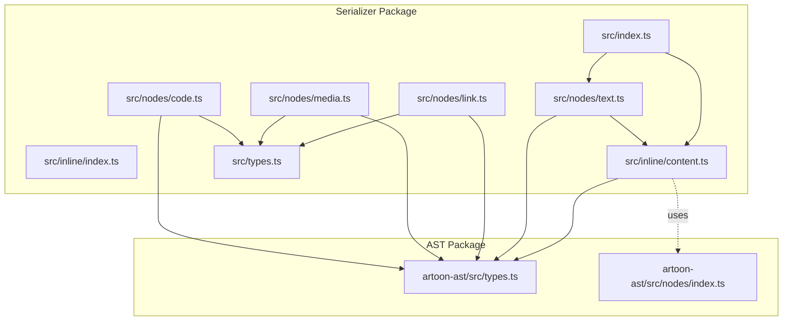
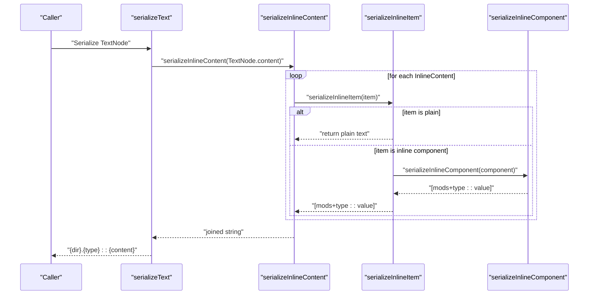
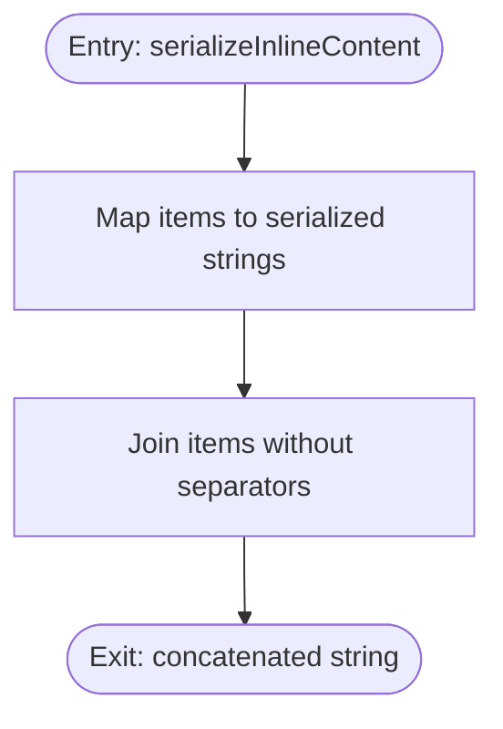
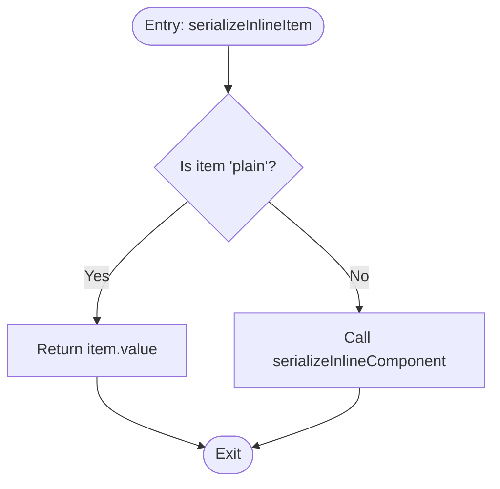
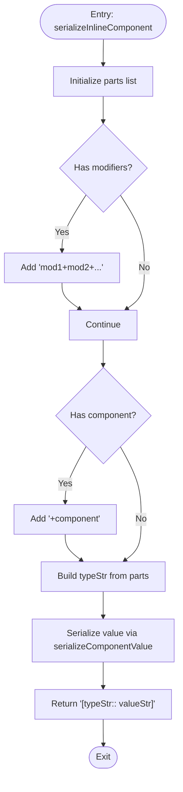
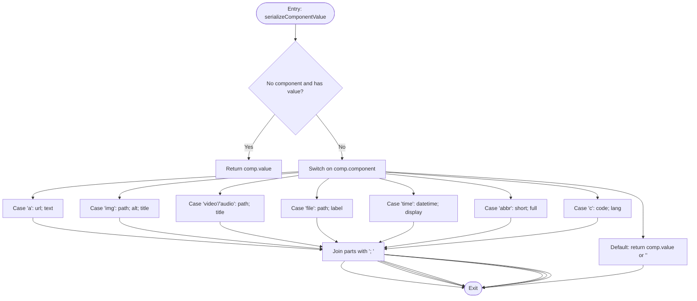
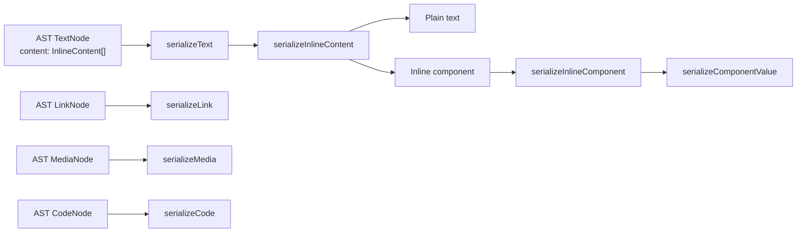
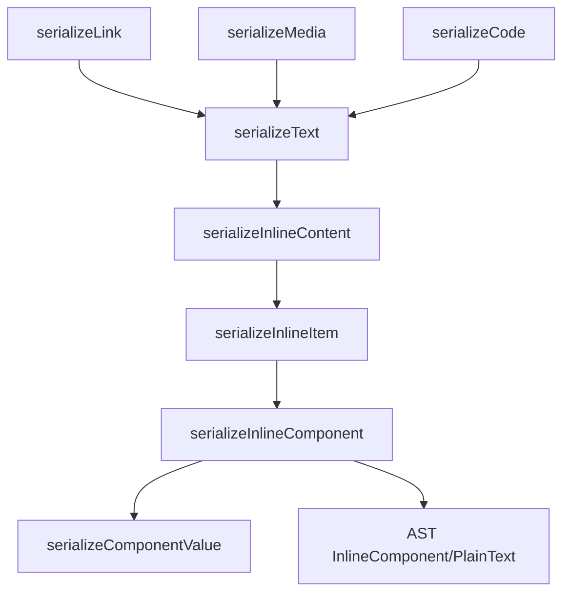

# Inline Content Serialization

<cite>
**Referenced Files in This Document**
- [index.ts](file://artoon-serializer/src/index.ts)
- [content.ts](file://artoon-serializer/src/inline/content.ts)
- [index.ts](file://artoon-serializer/src/inline/index.ts)
- [types.ts](file://artoon-serializer/src/types.ts)
- [text.ts](file://artoon-serializer/src/nodes/text.ts)
- [link.ts](file://artoon-serializer/src/nodes/link.ts)
- [media.ts](file://artoon-serializer/src/nodes/media.ts)
- [code.ts](file://artoon-serializer/src/nodes/code.ts)
- [types.ts](file://artoon-ast/src/types.ts)
- [index.ts](file://artoon-ast/src/nodes/index.ts)
- [inline.test.ts](file://artoon-serializer/tests/inline.test.ts)
</cite>

## Table of Contents
1. [Introduction](#introduction)
2. [Project Structure](#project-structure)
3. [Core Components](#core-components)
4. [Architecture Overview](#architecture-overview)
5. [Detailed Component Analysis](#detailed-component-analysis)
6. [Dependency Analysis](#dependency-analysis)
7. [Performance Considerations](#performance-considerations)
8. [Troubleshooting Guide](#troubleshooting-guide)
9. [Conclusion](#conclusion)

## Introduction
This document explains inline content serialization in the ARTOON Serializer package. It focuses on how inline formatting marks, plain text, and inline components (links, images, media, code, abbreviations, time) are serialized. It also documents the serializeInlineContent function, how it integrates with block serializers, and provides guidance on handling complex inline formatting, nested scenarios, and escaping special characters. Performance considerations and optimization techniques for large inline content are included.

## Project Structure
The ARTOON Serializer package organizes inline serialization under the inline module and integrates with node serializers for text, links, media, and code. The AST types define the inline content model used by the serializer.

**Diagram sources**
- [index.ts:1-95](file://artoon-serializer/src/index.ts#L1-L95)
- [content.ts:1-115](file://artoon-serializer/src/inline/content.ts#L1-L115)
- [index.ts:1-4](file://artoon-serializer/src/inline/index.ts#L1-L4)
- [types.ts:1-32](file://artoon-serializer/src/types.ts#L1-L32)
- [text.ts:1-19](file://artoon-serializer/src/nodes/text.ts#L1-L19)
- [link.ts:1-31](file://artoon-serializer/src/nodes/link.ts#L1-L31)
- [media.ts:1-37](file://artoon-serializer/src/nodes/media.ts#L1-L37)
- [code.ts:1-21](file://artoon-serializer/src/nodes/code.ts#L1-L21)
- [types.ts:1-539](file://artoon-ast/src/types.ts#L1-L539)
- [index.ts:1-258](file://artoon-ast/src/nodes/index.ts#L1-L258)

**Section sources**
- [index.ts:1-95](file://artoon-serializer/src/index.ts#L1-L95)
- [content.ts:1-115](file://artoon-serializer/src/inline/content.ts#L1-L115)
- [types.ts:1-32](file://artoon-serializer/src/types.ts#L1-L32)
- [types.ts:1-539](file://artoon-ast/src/types.ts#L1-L539)

## Core Components
- serializeInlineContent: Converts an array of InlineContent (plain text or inline components) into a serialized string by joining items without extra separators.
- serializeInlineItem: Dispatches to plain text or inline component serialization.
- serializeInlineComponent: Serializes inline components with optional modifiers and a typed component identifier, building bracketed content with attributes and values.
- serializeComponentValue: Handles per-component serialization rules for links, images, media, files, time, abbreviations, and code spans.

Integration points:
- Text nodes: serializeText delegates inline content serialization to serializeInlineContent.
- Link nodes: serializeLink handles standalone links; inline links are handled via serializeInlineComponent.
- Media nodes: serializeMedia handles standalone media; inline media are handled via serializeInlineComponent.
- Code nodes: serializeCode handles standalone inline code; inline code is handled via serializeInlineComponent.

**Section sources**
- [content.ts:8-115](file://artoon-serializer/src/inline/content.ts#L8-L115)
- [text.ts:12-18](file://artoon-serializer/src/nodes/text.ts#L12-L18)
- [link.ts:12-30](file://artoon-serializer/src/nodes/link.ts#L12-L30)
- [media.ts:15-36](file://artoon-serializer/src/nodes/media.ts#L15-L36)
- [code.ts:11-20](file://artoon-serializer/src/nodes/code.ts#L11-L20)

## Architecture Overview
The inline serialization pipeline converts AST inline content into ARTOON’s bracketed syntax. The flow is straightforward: iterate items, serialize each item, and join the results.

**Diagram sources**
- [text.ts:12-18](file://artoon-serializer/src/nodes/text.ts#L12-L18)
- [content.ts:8-48](file://artoon-serializer/src/inline/content.ts#L8-L48)

**Section sources**
- [text.ts:12-18](file://artoon-serializer/src/nodes/text.ts#L12-L18)
- [content.ts:8-48](file://artoon-serializer/src/inline/content.ts#L8-L48)

## Detailed Component Analysis

### serializeInlineContent
- Purpose: Convert an array of InlineContent into a single string by serializing each item and concatenating results.
- Behavior:
  - Iterates over the input array and calls serializeInlineItem for each element.
  - Joins results with no separator between items.
- Complexity:
  - Time: O(n) where n is the total number of inline items.
  - Space: O(m) for the output string length m.

**Diagram sources**
- [content.ts:8-10](file://artoon-serializer/src/inline/content.ts#L8-L10)

**Section sources**
- [content.ts:8-10](file://artoon-serializer/src/inline/content.ts#L8-L10)

### serializeInlineItem
- Purpose: Dispatch serialization to plain text or inline component.
- Behavior:
  - If item.type is 'plain', return item.value.
  - Otherwise, delegate to serializeInlineComponent.

**Diagram sources**
- [content.ts:15-21](file://artoon-serializer/src/inline/content.ts#L15-L21)

**Section sources**
- [content.ts:15-21](file://artoon-serializer/src/inline/content.ts#L15-L21)

### serializeInlineComponent
- Purpose: Serialize an inline component with optional modifiers and a component type.
- Behavior:
  - Build a list of parts: optional modifiers joined by '+', optional component type prefixed by '+'.
  - Construct the bracketed content: [typeStr:: valueStr].
- Output format: [mods+type:: value].

**Diagram sources**
- [content.ts:26-48](file://artoon-serializer/src/inline/content.ts#L26-L48)

**Section sources**
- [content.ts:26-48](file://artoon-serializer/src/inline/content.ts#L26-L48)

### serializeComponentValue
- Purpose: Serialize the value portion of an inline component according to its type.
- Supported components:
  - Link (a): url; text (text optional).
  - Image (img): path; alt; title.
  - Video/audio: path; title.
  - File (file): path; label.
  - Time (time): datetime; display.
  - Abbreviation (abbr): short; full.
  - Code span (c): code; lang (optional).
- Behavior:
  - For links, supports both url/href and text/value semantics.
  - For code spans, supports code and lang attributes.
  - For other components, joins attributes with '; '.
  - If only modifiers are present and value exists, returns value directly.

**Diagram sources**
- [content.ts:53-114](file://artoon-serializer/src/inline/content.ts#L53-L114)

**Section sources**
- [content.ts:53-114](file://artoon-serializer/src/inline/content.ts#L53-L114)

### Integration with Block Serializers
- Text nodes: serializeText wraps inline content with direction and type markers, delegating inline serialization to serializeInlineContent.
- Link nodes: serializeLink handles standalone links; inline links are represented as components and serialized via serializeInlineComponent.
- Media nodes: serializeMedia handles standalone media; inline media are represented as components and serialized via serializeInlineComponent.
- Code nodes: serializeCode handles standalone inline code; inline code is represented as a component and serialized via serializeInlineComponent.

**Diagram sources**
- [text.ts:12-18](file://artoon-serializer/src/nodes/text.ts#L12-L18)
- [content.ts:8-114](file://artoon-serializer/src/inline/content.ts#L8-L114)
- [link.ts:12-30](file://artoon-serializer/src/nodes/link.ts#L12-L30)
- [media.ts:15-36](file://artoon-serializer/src/nodes/media.ts#L15-L36)
- [code.ts:11-20](file://artoon-serializer/src/nodes/code.ts#L11-L20)

**Section sources**
- [text.ts:12-18](file://artoon-serializer/src/nodes/text.ts#L12-L18)
- [link.ts:12-30](file://artoon-serializer/src/nodes/link.ts#L12-L30)
- [media.ts:15-36](file://artoon-serializer/src/nodes/media.ts#L15-L36)
- [code.ts:11-20](file://artoon-serializer/src/nodes/code.ts#L11-L20)

### Handling Bold, Italic, Strikethrough, Code Spans, and Other Inline Formatting
- Bold, italic, strikethrough, underline, mark, subscript, superscript are supported as modifiers.
- Modifiers are combined with a '+' separator and applied to inline components or plain text segments.
- Example patterns:
  - [s:: text]: strikethrough
  - [e:: text]: emphasis (italic)
  - [u:: text]: underline
  - [d:: text]: deleted (strikethrough)
  - [mark:: text]: highlight
  - [sub:: text]: subscript
  - [sup:: text]: superscript
- Code spans are represented as [c:: code] or [c:: code; lang].

**Section sources**
- [content.ts:26-48](file://artoon-serializer/src/inline/content.ts#L26-L48)
- [content.ts:105-114](file://artoon-serializer/src/inline/content.ts#L105-L114)
- [types.ts:24-25](file://artoon-ast/src/types.ts#L24-L25)

### Serialization of Inline Links, Images, and Other Inline Components
- Links: [a:: url; text] with optional text; supports url or href attribute names.
- Images: [img:: path; alt; title]
- Video/Audio: [video:: path; title] and [audio:: path; title]
- Files: [file:: path; label]
- Time: [time:: datetime; display]
- Abbreviation: [abbr:: short; full]
- Code spans: [c:: code] or [c:: code; lang]

**Section sources**
- [content.ts:62-114](file://artoon-serializer/src/inline/content.ts#L62-L114)
- [link.ts:12-30](file://artoon-serializer/src/nodes/link.ts#L12-L30)
- [media.ts:15-36](file://artoon-serializer/src/nodes/media.ts#L15-L36)
- [code.ts:11-20](file://artoon-serializer/src/nodes/code.ts#L11-L20)

### Complex Inline Formatting Scenarios and Nested Formatting
- Mixed content: plain text interleaved with inline components and modifiers.
- Multiple modifiers: [s+e+mark:: text] demonstrates combining multiple formatting marks.
- Modifier with component: [s+a:: url; text] applies a modifier to a link component.
- Nested components: inline links, images, and code spans can appear within text content.

Validation and examples are covered in tests.

**Section sources**
- [inline.test.ts:15-190](file://artoon-serializer/tests/inline.test.ts#L15-L190)

### Proper Escaping of Special Characters
- The serializer does not escape special characters inside values; consumers should ensure values are safe for the target context.
- When composing values programmatically, escape sequences or quoting should be applied externally to prevent misinterpretation by parsers or downstream processors.

**Section sources**
- [content.ts:53-114](file://artoon-serializer/src/inline/content.ts#L53-L114)

## Dependency Analysis
- serializeInlineContent depends on:
  - serializeInlineItem for dispatching.
  - serializeInlineComponent for component serialization.
  - serializeComponentValue for per-component value construction.
- serializeInlineComponent depends on:
  - AST InlineComponent and PlainText types for input shape.
- Integration:
  - serializeText uses serializeInlineContent to render inline content inside text nodes.
  - Standalone serializers (link, media, code) operate independently but follow the same bracketed syntax pattern.

**Diagram sources**
- [content.ts:8-114](file://artoon-serializer/src/inline/content.ts#L8-L114)
- [text.ts:12-18](file://artoon-serializer/src/nodes/text.ts#L12-L18)
- [link.ts:12-30](file://artoon-serializer/src/nodes/link.ts#L12-L30)
- [media.ts:15-36](file://artoon-serializer/src/nodes/media.ts#L15-L36)
- [code.ts:11-20](file://artoon-serializer/src/nodes/code.ts#L11-L20)
- [types.ts:104-123](file://artoon-ast/src/types.ts#L104-L123)

**Section sources**
- [content.ts:8-114](file://artoon-serializer/src/inline/content.ts#L8-L114)
- [text.ts:12-18](file://artoon-serializer/src/nodes/text.ts#L12-L18)
- [link.ts:12-30](file://artoon-serializer/src/nodes/link.ts#L12-L30)
- [media.ts:15-36](file://artoon-serializer/src/nodes/media.ts#L15-L36)
- [code.ts:11-20](file://artoon-serializer/src/nodes/code.ts#L11-L20)
- [types.ts:104-123](file://artoon-ast/src/types.ts#L104-L123)

## Performance Considerations
- Time complexity:
  - serializeInlineContent runs in O(n) over the number of inline items.
  - serializeInlineComponent and serializeComponentValue run in O(1) per component.
- Memory:
  - Output string grows linearly with total content length.
  - Intermediate arrays for parts are bounded by the number of attributes/modifiers.
- Recommendations:
  - Prefer streaming or chunked processing for very large documents to reduce peak memory.
  - Avoid unnecessary intermediate allocations by reusing buffers when integrating with larger pipelines.
  - Minimize repeated conversions by caching computed values when serializing the same content multiple times.

[No sources needed since this section provides general guidance]

## Troubleshooting Guide
- Unexpected output order:
  - Ensure InlineContent order is preserved; the serializer concatenates items in sequence.
- Missing text in components:
  - For links and code spans, ensure value or required attributes are set; fallbacks apply when missing.
- Mixed content not rendering:
  - Verify that plain text items and inline components alternate correctly; the serializer expects alternating InlineContent entries.
- Direction markers:
  - Confirm direction is correctly mapped to '<' or '>' when using standalone serializers.

**Section sources**
- [inline.test.ts:7-190](file://artoon-serializer/tests/inline.test.ts#L7-L190)
- [types.ts:29-31](file://artoon-serializer/src/types.ts#L29-L31)

## Conclusion
The ARTOON Serializer’s inline content pipeline provides a robust, extensible mechanism for converting AST inline content into ARTOON syntax. With clear separation between plain text and inline components, standardized bracketed syntax, and integration with block serializers, it supports complex inline formatting, mixed content, and various inline components. Following the outlined patterns ensures correctness and maintainability, while the performance characteristics guide efficient handling of large documents.