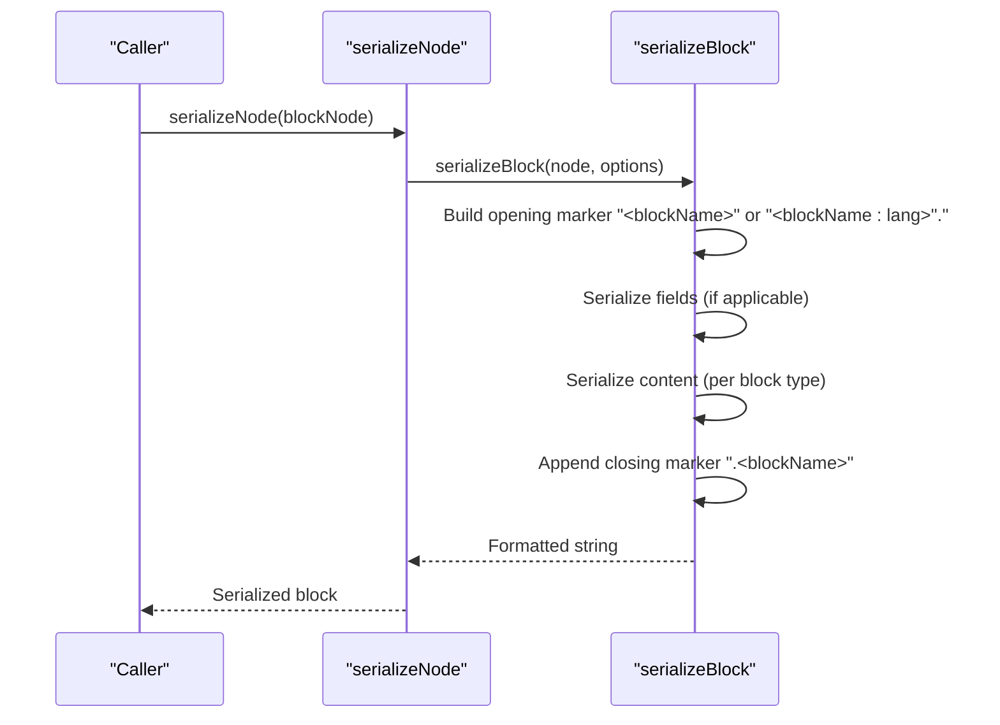
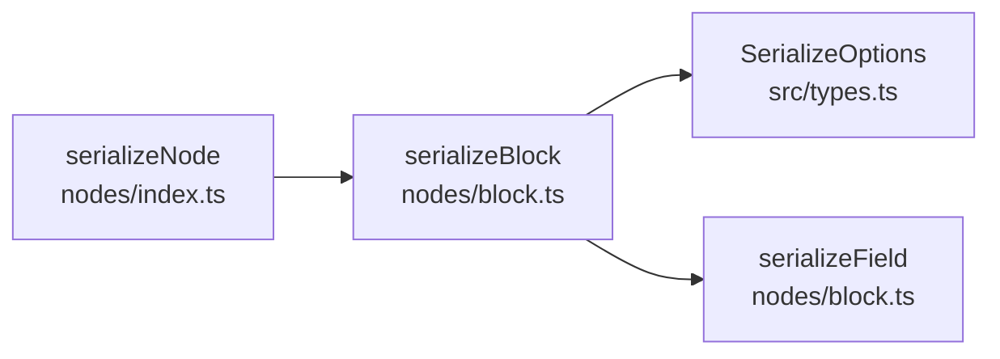

# Block Serializer

<cite>
**Referenced Files in This Document**
- [block.ts](file://artoon-serializer/src/nodes/block.ts)
- [index.ts](file://artoon-serializer/src/nodes/index.ts)
- [types.ts](file://artoon-serializer/src/types.ts)
- [block.test.ts](file://artoon-serializer/tests/block.test.ts)
- [01-meta-block.artoon](file://artoon-examples/test-blocks/01-meta-block.artoon)
- [02-code-block.artoon](file://artoon-examples/test-blocks/02-code-block.artoon)
- [03-alert-block.artoon](file://artoon-examples/test-blocks/03-alert-block.artoon)
- [06-success-block.artoon](file://artoon-examples/test-blocks/06-success-block.artoon)
- [07-error-block.artoon](file://artoon-examples/test-blocks/07-error-block.artoon)
- [08-warning-block.artoon](file://artoon-examples/test-blocks/08-warning-block.artoon)
- [09-quote-block.artoon](file://artoon-examples/test-blocks/09-quote-block.artoon)
- [12-section-block.artoon](file://artoon-examples/test-blocks/12-section-block.artoon)
</cite>

## Table of Contents
1. [Introduction](#introduction)
2. [Project Structure](#project-structure)
3. [Core Components](#core-components)
4. [Architecture Overview](#architecture-overview)
5. [Detailed Component Analysis](#detailed-component-analysis)
6. [Dependency Analysis](#dependency-analysis)
7. [Performance Considerations](#performance-considerations)
8. [Troubleshooting Guide](#troubleshooting-guide)
9. [Conclusion](#conclusion)

## Introduction
This document describes the block node serializer used to convert structured block nodes (code blocks, meta blocks, and custom blocks) into the ARTOON text format. It explains the block syntax pattern with opening and closing markers, how different block types serialize content, and how fields are represented with direction indicators. It also covers line ending handling, edge cases such as empty content and nested content, and field ordering.

## Project Structure
The block serialization logic is implemented in the serializer package and exercised via dedicated tests and example documents.

```mermaid
graph TB
subgraph "Serializer Package"
A["nodes/index.ts<br/>Node dispatcher"]
B["nodes/block.ts<br/>Block serializer"]
C["src/types.ts<br/>Serialization options"]
end
subgraph "Tests"
T1["tests/block.test.ts<br/>Block serialization tests"]
end
subgraph "Examples"
E1["test-blocks/01-meta-block.artoon"]
E2["test-blocks/02-code-block.artoon"]
E3["test-blocks/03-alert-block.artoon"]
E4["test-blocks/06-success-block.artoon"]
E5["test-blocks/07-error-block.artoon"]
E6["test-blocks/08-warning-block.artoon"]
E7["test-blocks/09-quote-block.artoon"]
E8["test-blocks/12-section-block.artoon"]
end
A --> B
A --> C
T1 --> B
T1 --> C
E1 -. "Reference format" .-> B
E2 -. "Reference format" .-> B
E3 -. "Reference format" .-> B
E4 -. "Reference format" .-> B
E5 -. "Reference format" .-> B
E6 -. "Reference format" .-> B
E7 -. "Reference format" .-> B
E8 -. "Reference format" .-> B
```

**Diagram sources**
- [index.ts:1-91](file://artoon-serializer/src/nodes/index.ts#L1-L91)
- [block.ts:1-71](file://artoon-serializer/src/nodes/block.ts#L1-L71)
- [types.ts:1-32](file://artoon-serializer/src/types.ts#L1-L32)
- [block.test.ts:1-112](file://artoon-serializer/tests/block.test.ts#L1-L112)
- [01-meta-block.artoon:1-61](file://artoon-examples/test-blocks/01-meta-block.artoon#L1-L61)
- [02-code-block.artoon:1-100](file://artoon-examples/test-blocks/02-code-block.artoon#L1-L100)
- [03-alert-block.artoon:1-56](file://artoon-examples/test-blocks/03-alert-block.artoon#L1-L56)
- [06-success-block.artoon:1-56](file://artoon-examples/test-blocks/06-success-block.artoon#L1-L56)
- [07-error-block.artoon:1-62](file://artoon-examples/test-blocks/07-error-block.artoon#L1-L62)
- [08-warning-block.artoon:1-55](file://artoon-examples/test-blocks/08-warning-block.artoon#L1-L55)
- [09-quote-block.artoon:1-49](file://artoon-examples/test-blocks/09-quote-block.artoon#L1-L49)
- [12-section-block.artoon:1-58](file://artoon-examples/test-blocks/12-section-block.artoon#L1-L58)

**Section sources**
- [index.ts:1-91](file://artoon-serializer/src/nodes/index.ts#L1-L91)
- [block.ts:1-71](file://artoon-serializer/src/nodes/block.ts#L1-L71)
- [types.ts:1-32](file://artoon-serializer/src/types.ts#L1-L32)

## Core Components
- Block serializer: Implements the block syntax with opening and closing markers, content handling per block type, and field serialization with direction indicators.
- Node dispatcher: Routes content nodes to the appropriate serializer, including the block serializer.
- Serialization options: Provides line ending control and other formatting preferences.

Key behaviors:
- Opening marker: <blockName> or <blockName:language>.
- Content serialization:
  - Code blocks: serialize raw content.
  - Meta blocks: serialize only fields; ignore content.
  - Custom blocks: serialize fields followed by content.
- Closing marker: .<blockName>.

**Section sources**
- [block.ts:15-60](file://artoon-serializer/src/nodes/block.ts#L15-L60)
- [index.ts:32-78](file://artoon-serializer/src/nodes/index.ts#L32-L78)
- [types.ts:6-24](file://artoon-serializer/src/types.ts#L6-L24)

## Architecture Overview
The block serializer participates in the overall serialization pipeline. The dispatcher selects the block serializer for block nodes, which then formats the output according to the block type rules.

**Diagram sources**
- [index.ts:32-78](file://artoon-serializer/src/nodes/index.ts#L32-L78)
- [block.ts:15-60](file://artoon-serializer/src/nodes/block.ts#L15-L60)

## Detailed Component Analysis

### Block Serialization Format
- Opening marker:
  - Without language: <blockName>.
  - With language: <blockName:language>.
- Fields:
  - Serialized as direction-indicated field lines.
  - Direction indicator is either "<" for ltr or ">" for rtl.
- Content:
  - Code blocks: raw content as-is.
  - Meta blocks: no content; only fields are serialized.
  - Custom blocks: fields first, then content if present and non-empty after trimming.
- Closing marker: .<blockName>.

Line endings:
- Controlled by serialization options; defaults to LF.

Edge cases handled:
- Empty content: custom blocks with empty content omit the content line.
- Nested content: custom blocks can contain nested ARTOON constructs; the serializer treats content as raw text and does not re-parse it.
- Field ordering: fields are emitted in the order they appear in the node’s fields array.

Examples from repository:
- Meta block fields with RTL direction indicators.
- Code blocks with language attributes.
- Custom blocks with mixed content and nested structures.

**Section sources**
- [block.ts:15-60](file://artoon-serializer/src/nodes/block.ts#L15-L60)
- [block.test.ts:7-111](file://artoon-serializer/tests/block.test.ts#L7-L111)
- [01-meta-block.artoon:1-11](file://artoon-examples/test-blocks/01-meta-block.artoon#L1-L11)
- [02-code-block.artoon:16-24](file://artoon-examples/test-blocks/02-code-block.artoon#L16-L24)
- [03-alert-block.artoon:16-19](file://artoon-examples/test-blocks/03-alert-block.artoon#L16-L19)
- [06-success-block.artoon:16-19](file://artoon-examples/test-blocks/06-success-block.artoon#L16-L19)
- [07-error-block.artoon:16-19](file://artoon-examples/test-blocks/07-error-block.artoon#L16-L19)
- [08-warning-block.artoon:16-19](file://artoon-examples/test-blocks/08-warning-block.artoon#L16-L19)
- [09-quote-block.artoon:16-20](file://artoon-examples/test-blocks/09-quote-block.artoon#L16-L20)
- [12-section-block.artoon:16-41](file://artoon-examples/test-blocks/12-section-block.artoon#L16-L41)

### Field Serialization with Direction Indicators
- Each field is serialized with a direction marker:
  - "<" for left-to-right content.
  - ">" for right-to-left content.
- The format includes a standardized field label and value separator.

Validation evidence:
- Tests demonstrate RTL direction markers in meta blocks.
- Examples show meta blocks with multiple fields.

**Section sources**
- [block.ts:67-70](file://artoon-serializer/src/nodes/block.ts#L67-L70)
- [block.test.ts:47-69](file://artoon-serializer/tests/block.test.ts#L47-L69)
- [01-meta-block.artoon:2-10](file://artoon-examples/test-blocks/01-meta-block.artoon#L2-L10)

### Content Handling Per Block Type
- Code blocks:
  - Serialize raw content.
  - Language attribute appears in the opening marker.
- Meta blocks:
  - Serialize only fields; ignore content.
- Custom blocks:
  - Serialize fields first, then content if non-empty after trimming.

Validation evidence:
- Tests cover code blocks with and without language, meta blocks with fields, and custom blocks with content.
- Examples include custom blocks with nested content and various child elements.

**Section sources**
- [block.ts:30-54](file://artoon-serializer/src/nodes/block.ts#L30-L54)
- [block.test.ts:7-111](file://artoon-serializer/tests/block.test.ts#L7-L111)
- [02-code-block.artoon:16-24](file://artoon-examples/test-blocks/02-code-block.artoon#L16-L24)
- [01-meta-block.artoon:1-11](file://artoon-examples/test-blocks/01-meta-block.artoon#L1-L11)
- [03-alert-block.artoon:16-19](file://artoon-examples/test-blocks/03-alert-block.artoon#L16-L19)
- [12-section-block.artoon:16-41](file://artoon-examples/test-blocks/12-section-block.artoon#L16-L41)

### Line Ending Handling
- The serializer respects the configured line ending from serialization options.
- Defaults to LF if not specified.

**Section sources**
- [block.ts:19-59](file://artoon-serializer/src/nodes/block.ts#L19-L59)
- [types.ts:7-8](file://artoon-serializer/src/types.ts#L7-L8)

### Edge Cases
- Empty content:
  - Custom blocks with empty content produce only opening and closing markers without an intermediate content line.
- Nested content:
  - Content is treated as raw text; nested ARTOON constructs are not re-parsed.
- Field ordering:
  - Fields are emitted in the order they appear in the node’s fields array.

**Section sources**
- [block.ts:51-53](file://artoon-serializer/src/nodes/block.ts#L51-L53)
- [block.test.ts:94-111](file://artoon-serializer/tests/block.test.ts#L94-L111)

## Dependency Analysis
The block serializer depends on:
- AST node types (BlockNode) to determine block characteristics.
- Serialization options for line ending control.
- Internal field serializer for emitting direction-aware field lines.

**Diagram sources**
- [block.ts:15-70](file://artoon-serializer/src/nodes/block.ts#L15-L70)
- [index.ts:32-78](file://artoon-serializer/src/nodes/index.ts#L32-L78)
- [types.ts:6-32](file://artoon-serializer/src/types.ts#L6-L32)

**Section sources**
- [block.ts:3-70](file://artoon-serializer/src/nodes/block.ts#L3-L70)
- [index.ts:32-78](file://artoon-serializer/src/nodes/index.ts#L32-L78)
- [types.ts:6-32](file://artoon-serializer/src/types.ts#L6-L32)

## Performance Considerations
- The serializer builds output incrementally using an array of lines and joins at the end, minimizing intermediate string allocations.
- Field emission iterates over the fields array once, with constant-time per-field operations.
- Content handling for code blocks avoids parsing and simply emits raw text.

[No sources needed since this section provides general guidance]

## Troubleshooting Guide
Common issues and resolutions:
- Unexpected content in meta blocks:
  - Meta blocks intentionally omit content; ensure content is placed outside meta blocks or use a custom block if content is required.
- Incorrect language attribute:
  - Verify the block’s language property is set; the opening marker reflects the language only when present.
- Field ordering confusion:
  - Fields are emitted in the order they appear in the node’s fields array; adjust the node’s field array if order matters.
- Empty custom block output:
  - Confirm whether the content is truly empty or whitespace-only; content is omitted when trimmed to an empty string.
- Line ending mismatches:
  - Set the desired line ending in serialization options to align with target environments.

**Section sources**
- [block.ts:30-59](file://artoon-serializer/src/nodes/block.ts#L30-L59)
- [types.ts:7-8](file://artoon-serializer/src/types.ts#L7-L8)
- [block.test.ts:94-111](file://artoon-serializer/tests/block.test.ts#L94-L111)

## Conclusion
The block serializer implements a precise and extensible format for ARTOON block components. It supports code blocks with language attributes, meta blocks with direction-aware fields, and custom blocks with ordered fields and content. By adhering to the documented syntax and leveraging the provided options, developers can reliably serialize and round-trip block content while handling edge cases predictably.