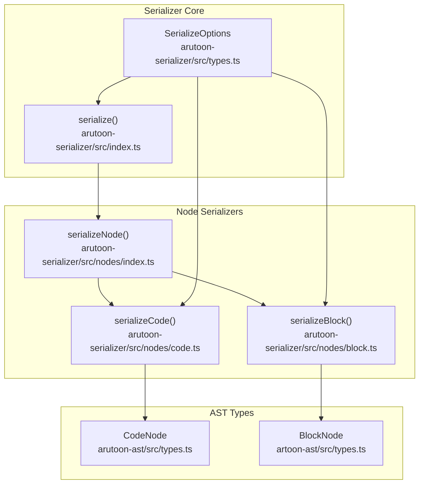
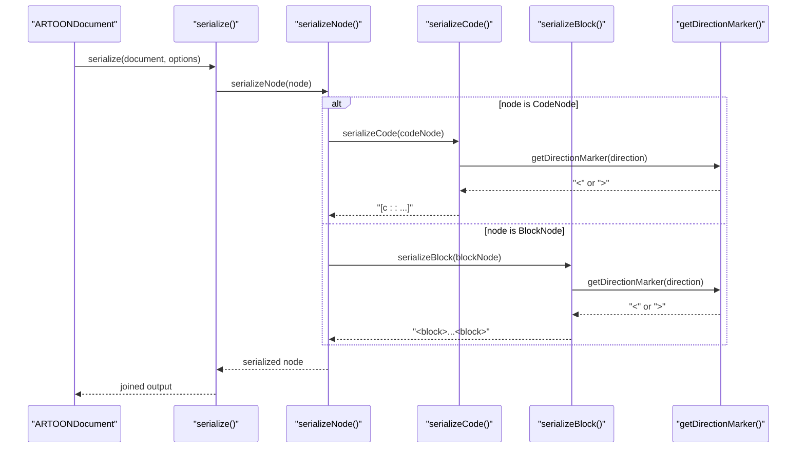
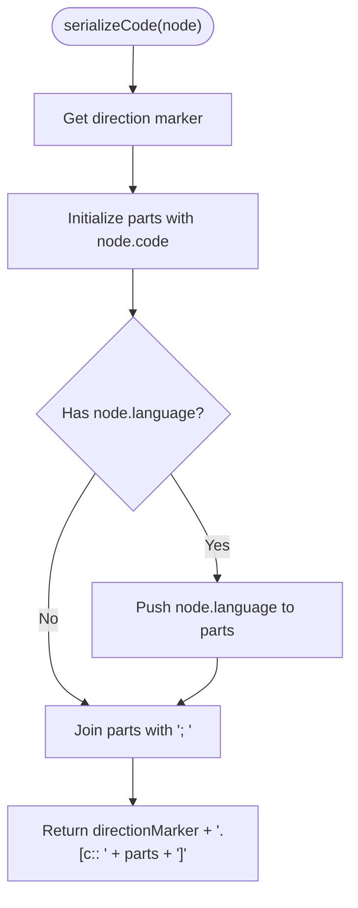
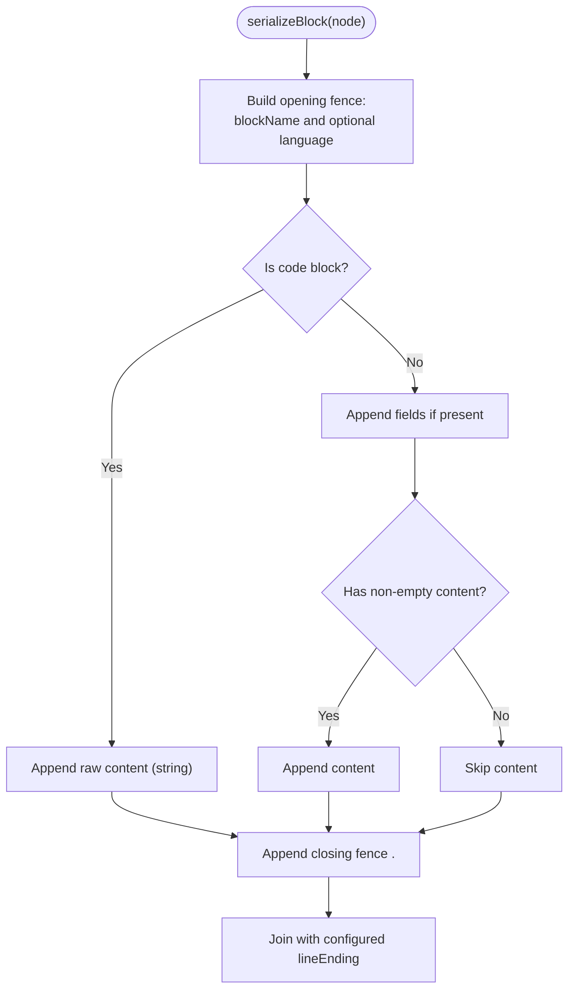
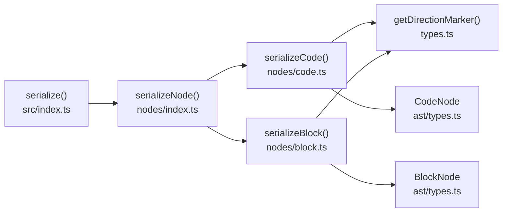

# Code Serializer

<cite>
**Referenced Files in This Document**
- [code.ts](file://artoon-serializer/src/nodes/code.ts)
- [index.ts](file://artoon-serializer/src/nodes/index.ts)
- [block.ts](file://artoon-serializer/src/nodes/block.ts)
- [index.ts](file://artoon-serializer/src/index.ts)
- [types.ts](file://artoon-serializer/src/types.ts)
- [types.ts](file://artoon-ast/src/types.ts)
- [code.test.ts](file://artoon-serializer/tests/code.test.ts)
- [serialize.test.ts](file://artoon-serializer/tests/serialize.test.ts)
- [02-code-block.artoon](file://artoon-examples/test-blocks/02-code-block.artoon)
- [test-code-block-simple.artoon](file://artoon-examples/test-code-block-simple.artoon)
</cite>

## Table of Contents
1. [Introduction](#introduction)
2. [Project Structure](#project-structure)
3. [Core Components](#core-components)
4. [Architecture Overview](#architecture-overview)
5. [Detailed Component Analysis](#detailed-component-analysis)
6. [Dependency Analysis](#dependency-analysis)
7. [Performance Considerations](#performance-considerations)
8. [Troubleshooting Guide](#troubleshooting-guide)
9. [Conclusion](#conclusion)

## Introduction
This document explains how code-related nodes are serialized in the ARTOON system. It focuses on:
- How inline code nodes are serialized with direction markers and optional language hints
- How block code nodes are serialized with fences and preserved content
- Differences between inline code and fenced code blocks
- Handling of code fences, indentation, and whitespace
- Edge cases such as empty content, RTL/LTR directionality, and nested content behavior
- Examples drawn from tests and real-world examples

## Project Structure
The code serialization logic spans several modules:
- Node dispatch and serializers live under artoon-serializer/src/nodes
- The main serialize function lives under artoon-serializer/src
- Direction markers and options are defined under artoon-serializer/src/types
- AST types (including CodeNode and BlockNode) are defined under artoon-ast/src
- Tests validate behavior for inline code and block code serialization

**Diagram sources**
- [index.ts:17-59](file://artoon-serializer/src/index.ts#L17-L59)
- [types.ts:6-24](file://artoon-serializer/src/types.ts#L6-L24)
- [index.ts:32-78](file://artoon-serializer/src/nodes/index.ts#L32-L78)
- [code.ts:11-20](file://artoon-serializer/src/nodes/code.ts#L11-L20)
- [block.ts:15-60](file://artoon-serializer/src/nodes/block.ts#L15-L60)
- [types.ts:339-344](file://artoon-ast/src/types.ts#L339-L344)
- [types.ts:290-298](file://artoon-ast/src/types.ts#L290-L298)

**Section sources**
- [index.ts:17-59](file://artoon-serializer/src/index.ts#L17-L59)
- [types.ts:6-24](file://artoon-serializer/src/types.ts#L6-L24)
- [index.ts:32-78](file://artoon-serializer/src/nodes/index.ts#L32-L78)
- [code.ts:11-20](file://artoon-serializer/src/nodes/code.ts#L11-L20)
- [block.ts:15-60](file://artoon-serializer/src/nodes/block.ts#L15-L60)
- [types.ts:339-344](file://artoon-ast/src/types.ts#L339-L344)
- [types.ts:290-298](file://artoon-ast/src/types.ts#L290-L298)

## Core Components
- Inline code serializer: transforms a CodeNode into an inline code expression with optional language hint and direction marker.
- Block code serializer: transforms a BlockNode flagged as code into a fenced block with preserved raw content.
- Direction marker helper: maps 'rtl'/'ltr' to '<' or '>' for proper direction-aware output.
- Main serialize function: orchestrates document-level serialization, including META blocks and blank-line separation.

Key behaviors:
- Inline code: always emits a single line with direction marker, code content, and optional language separated by semicolon.
- Block code: emits opening fence with optional language, raw content, and closing fence; does not re-parse content.
- Direction: both inline and block serializers honor direction via markers.

**Section sources**
- [code.ts:11-20](file://artoon-serializer/src/nodes/code.ts#L11-L20)
- [block.ts:15-60](file://artoon-serializer/src/nodes/block.ts#L15-L60)
- [types.ts:29-31](file://artoon-serializer/src/types.ts#L29-L31)
- [index.ts:17-59](file://artoon-serializer/src/index.ts#L17-L59)

## Architecture Overview
The serialization pipeline routes nodes to specialized serializers. Inline code nodes go to serializeCode; block nodes are routed to serializeBlock, which handles code blocks differently from other block types.

**Diagram sources**
- [index.ts:17-59](file://artoon-serializer/src/index.ts#L17-L59)
- [index.ts:32-78](file://artoon-serializer/src/nodes/index.ts#L32-L78)
- [code.ts:11-20](file://artoon-serializer/src/nodes/code.ts#L11-L20)
- [block.ts:15-60](file://artoon-serializer/src/nodes/block.ts#L15-L60)
- [types.ts:29-31](file://artoon-serializer/src/types.ts#L29-L31)

## Detailed Component Analysis

### Inline Code Serializer
Purpose:
- Serialize CodeNode into an inline code expression with optional language hint and direction marker.

Behavior:
- Direction marker is derived from node.direction and prepended to the inline code expression.
- The code content is included as-is.
- If node.language exists, it is appended after the code, separated by a semicolon.
- Output is a single line.

Edge cases covered by tests:
- Basic inline code with LTR direction
- Inline code with language hint
- Inline code with RTL direction

**Diagram sources**
- [code.ts:11-20](file://artoon-serializer/src/nodes/code.ts#L11-L20)
- [types.ts:29-31](file://artoon-serializer/src/types.ts#L29-L31)

**Section sources**
- [code.ts:11-20](file://artoon-serializer/src/nodes/code.ts#L11-L20)
- [code.test.ts:7-46](file://artoon-serializer/tests/code.test.ts#L7-L46)

### Block Code Serializer
Purpose:
- Serialize BlockNode flagged as code into a fenced block with preserved raw content.

Behavior:
- Opening fence: <blockName> or <blockName:language>.
- Content: raw content string is emitted as-is; no parsing or transformation occurs.
- Closing fence: .<blockName>.
- Direction marker is applied to the fence lines when emitting fields or content in other contexts; however, raw content is not direction-marked.

Edge cases:
- Empty content string: emits only the opening and closing fences with a blank line between.
- Language present: included in the opening fence.
- Non-code blocks: handled differently (fields/meta/custom); code blocks are distinguished by node.isCode or blockName === 'code'.

**Diagram sources**
- [block.ts:15-60](file://artoon-serializer/src/nodes/block.ts#L15-L60)

**Section sources**
- [block.ts:15-60](file://artoon-serializer/src/nodes/block.ts#L15-L60)
- [02-code-block.artoon:16-24](file://artoon-examples/test-blocks/02-code-block.artoon#L16-L24)
- [test-code-block-simple.artoon:5-10](file://artoon-examples/test-code-block-simple.artoon#L5-L10)

### Direction Handling
- Direction markers:
  - getDirectionMarker maps 'rtl' to '>' and 'ltr' to '<'.
  - Applied to inline code expressions and block fences.
- Inline code: direction marker precedes the inline code expression.
- Block code: direction marker is used when emitting fields or content; raw code content remains unmarked.

**Section sources**
- [types.ts:29-31](file://artoon-serializer/src/types.ts#L29-L31)
- [code.ts:12-12](file://artoon-serializer/src/nodes/code.ts#L12-L12)
- [block.ts:67-69](file://artoon-serializer/src/nodes/block.ts#L67-L69)

### Differences Between Inline Code and Fenced Code Blocks
- Inline code:
  - Single-line output with direction marker and optional language hint.
  - No fences; content is treated as literal text.
- Fenced code blocks:
  - Multi-line output with opening and closing fences.
  - Raw content is preserved; no ARTOON parsing inside the block.
  - Language can be specified in the opening fence.

Validation via examples:
- Inline code examples in tests confirm single-line, direction-aware output with optional language.
- Fenced code blocks in examples demonstrate multi-line content with language-specific fences.

**Section sources**
- [code.test.ts:7-46](file://artoon-serializer/tests/code.test.ts#L7-L46)
- [02-code-block.artoon:16-24](file://artoon-examples/test-blocks/02-code-block.artoon#L16-L24)
- [test-code-block-simple.artoon:5-10](file://artoon-examples/test-code-block-simple.artoon#L5-L10)

### Handling of Code Fences, Indentation, and Whitespace
- Fences:
  - Opening fence: <blockName> or <blockName:language>.
  - Closing fence: .<blockName>.
- Indentation and whitespace:
  - Raw content is emitted verbatim; indentation and spacing are preserved.
  - No automatic alignment or trimming is performed.
- Line endings:
  - Controlled by SerializeOptions.lineEnding; defaults to '\n'.

**Section sources**
- [block.ts:23-27](file://artoon-serializer/src/nodes/block.ts#L23-L27)
- [block.ts:59-59](file://artoon-serializer/src/nodes/block.ts#L59-L59)
- [types.ts:7-8](file://artoon-serializer/src/types.ts#L7-L8)

### Special Characters and Preservation of Original Structure
- Inline code:
  - Code content is included as-is; no escaping is applied by the serializer.
- Block code:
  - Content is emitted as a raw string; special characters and structure are preserved.
- Comments:
  - Not part of code serialization; controlled by global options and ignored for code nodes.

**Section sources**
- [code.ts:14-14](file://artoon-serializer/src/nodes/code.ts#L14-L14)
- [block.ts:32-34](file://artoon-serializer/src/nodes/block.ts#L32-L34)
- [serialize.test.ts:91-125](file://artoon-serializer/tests/serialize.test.ts#L91-L125)

### Edge Cases
- Empty code blocks:
  - Fenced code block with empty content still emits opening and closing fences with a blank line between.
- Nested content:
  - Inline code nodes are atomic; they do not parse nested ARTOON syntax.
  - Block code content is raw and not re-parsed.
- Mixed directionality:
  - Direction markers are applied consistently per node; inline code and block fences reflect the node’s direction.

**Section sources**
- [block.ts:32-34](file://artoon-serializer/src/nodes/block.ts#L32-L34)
- [code.test.ts:34-45](file://artoon-serializer/tests/code.test.ts#L34-L45)

## Dependency Analysis
Relationships among components:
- serialize() depends on serializeNode() and options.
- serializeNode() dispatches to serializeCode() for CodeNode and serializeBlock() for BlockNode.
- serializeCode() depends on getDirectionMarker().
- serializeBlock() depends on getDirectionMarker() and handles raw content distinctly.

**Diagram sources**
- [index.ts:17-59](file://artoon-serializer/src/index.ts#L17-L59)
- [index.ts:32-78](file://artoon-serializer/src/nodes/index.ts#L32-L78)
- [code.ts:11-20](file://artoon-serializer/src/nodes/code.ts#L11-L20)
- [block.ts:15-60](file://artoon-serializer/src/nodes/block.ts#L15-L60)
- [types.ts:29-31](file://artoon-serializer/src/types.ts#L29-L31)
- [types.ts:339-344](file://artoon-ast/src/types.ts#L339-L344)
- [types.ts:290-298](file://artoon-ast/src/types.ts#L290-L298)

**Section sources**
- [index.ts:17-59](file://artoon-serializer/src/index.ts#L17-L59)
- [index.ts:32-78](file://artoon-serializer/src/nodes/index.ts#L32-L78)
- [code.ts:11-20](file://artoon-serializer/src/nodes/code.ts#L11-L20)
- [block.ts:15-60](file://artoon-serializer/src/nodes/block.ts#L15-L60)
- [types.ts:29-31](file://artoon-serializer/src/types.ts#L29-L31)
- [types.ts:339-344](file://artoon-ast/src/types.ts#L339-L344)
- [types.ts:290-298](file://artoon-ast/src/types.ts#L290-L298)

## Performance Considerations
- Inline code serialization is O(1) with minimal allocations.
- Block code serialization is O(n) in the length of the raw content string.
- Direction marker lookup is constant-time.
- Blank-line insertion is linear in the number of nodes.

## Troubleshooting Guide
Common issues and resolutions:
- Unexpected language in inline code:
  - Confirm node.language presence; inline code includes language only when provided.
- Missing language in fenced code:
  - Ensure node.language is set on the BlockNode; otherwise, the opening fence omits language.
- Direction mismatch:
  - Verify node.direction; direction markers are applied consistently.
- Whitespace changes:
  - Raw content is preserved; if indentation appears incorrect, check the source content string.
- Comments interfering with output:
  - Adjust preserveComments option; comments are not part of code serialization.

**Section sources**
- [code.test.ts:7-46](file://artoon-serializer/tests/code.test.ts#L7-L46)
- [serialize.test.ts:91-125](file://artoon-serializer/tests/serialize.test.ts#L91-L125)
- [block.ts:23-27](file://artoon-serializer/src/nodes/block.ts#L23-L27)

## Conclusion
The ARTOON code serializers provide two complementary mechanisms:
- Inline code: compact, direction-aware, and language-hint aware
- Fenced code blocks: robust, raw-content preserving, and language-specified

Together, they ensure accurate reproduction of code content while respecting directionality and structure.