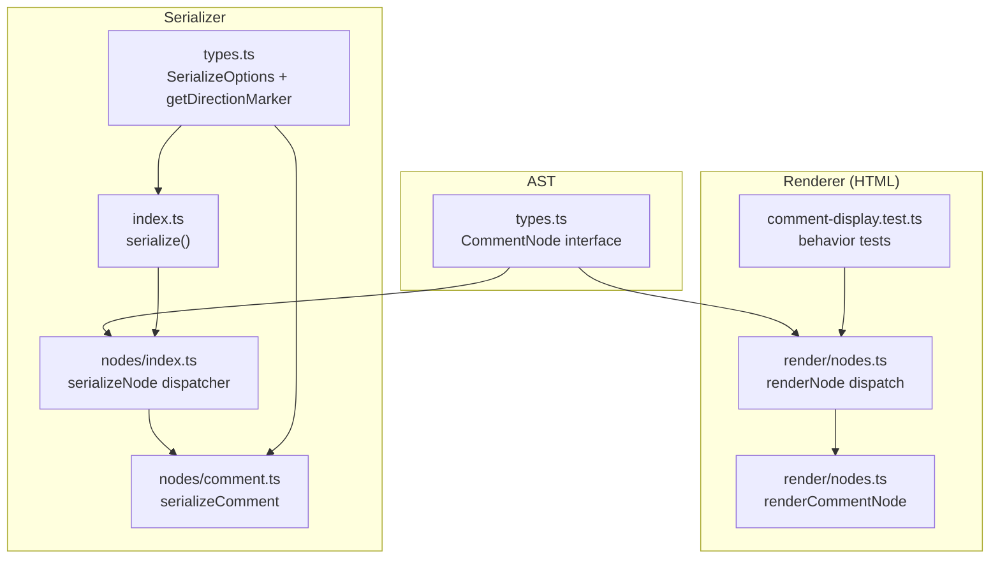
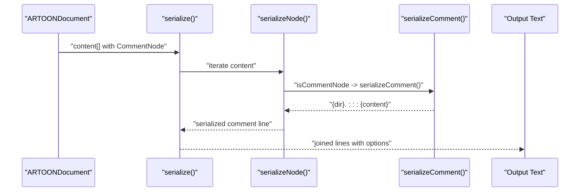
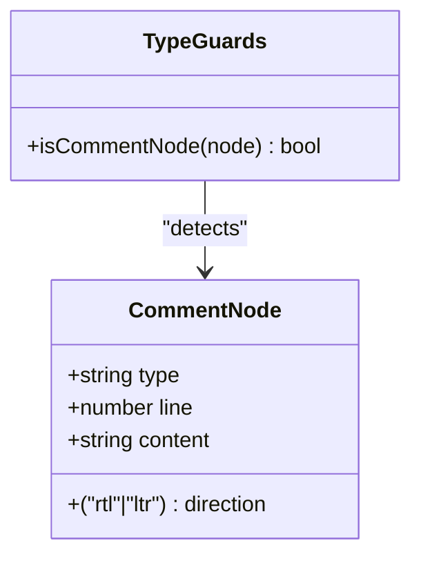
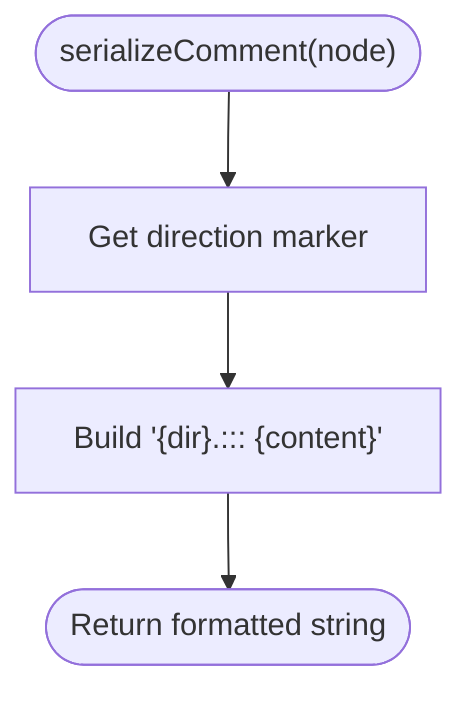
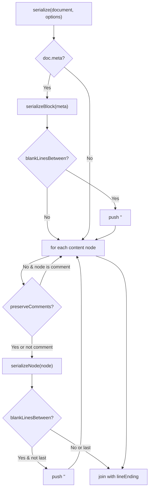
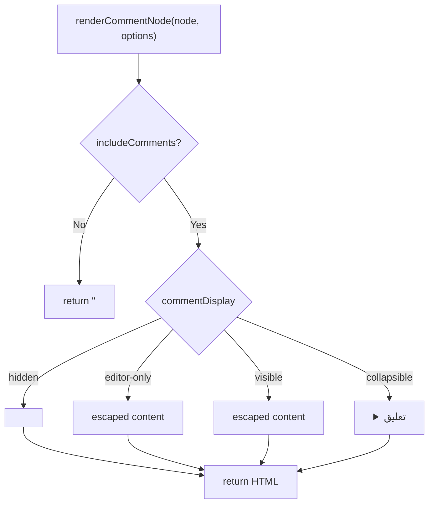
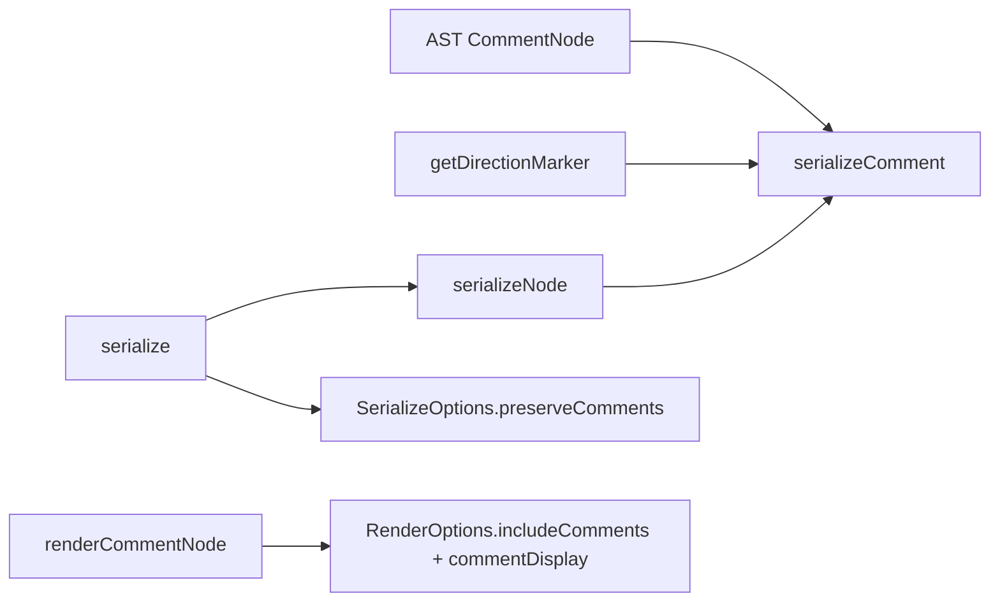

# Comment Serializer

<cite>
**Referenced Files in This Document**
- [comment.ts](file://artoon-serializer/src/nodes/comment.ts)
- [index.ts](file://artoon-serializer/src/nodes/index.ts)
- [index.ts](file://artoon-serializer/src/index.ts)
- [types.ts](file://artoon-serializer/src/types.ts)
- [types.ts](file://artoon-ast/src/types.ts)
- [comment.test.ts](file://artoon-serializer/tests/comment.test.ts)
- [comment-display.test.ts](file://artoon-renderer-html/tests/comment-display.test.ts)
- [nodes.ts](file://artoon-renderer-html/src/render/nodes.ts)
</cite>

## Table of Contents
1. [Introduction](#introduction)
2. [Project Structure](#project-structure)
3. [Core Components](#core-components)
4. [Architecture Overview](#architecture-overview)
5. [Detailed Component Analysis](#detailed-component-analysis)
6. [Dependency Analysis](#dependency-analysis)
7. [Performance Considerations](#performance-considerations)
8. [Troubleshooting Guide](#troubleshooting-guide)
9. [Conclusion](#conclusion)

## Introduction
This document explains how comment nodes are serialized in ARTOON documents and how they interact with other document elements. It covers the comment syntax, content handling, preservation of structure, and visibility across output formats. It also documents edge cases such as empty comments, content escaping, and positioning within documents.

## Project Structure
The comment serialization pipeline spans three layers:
- AST definition: describes the CommentNode shape and type guards.
- Serializer: converts CommentNode instances into ARTOON text format.
- Renderer (HTML): renders comments into HTML depending on configuration.

**Diagram sources**
- [types.ts:347-358](file://artoon-ast/src/types.ts#L347-L358)
- [index.ts:32-78](file://artoon-serializer/src/nodes/index.ts#L32-L78)
- [comment.ts:11-14](file://artoon-serializer/src/nodes/comment.ts#L11-L14)
- [index.ts:17-59](file://artoon-serializer/src/index.ts#L17-L59)
- [types.ts:6-31](file://artoon-serializer/src/types.ts#L6-L31)
- [nodes.ts:37-57](file://artoon-renderer-html/src/render/nodes.ts#L37-L57)
- [nodes.ts:712-739](file://artoon-renderer-html/src/render/nodes.ts#L712-L739)
- [comment-display.test.ts:1-260](file://artoon-renderer-html/tests/comment-display.test.ts#L1-L260)

**Section sources**
- [types.ts:347-358](file://artoon-ast/src/types.ts#L347-L358)
- [index.ts:32-78](file://artoon-serializer/src/nodes/index.ts#L32-L78)
- [comment.ts:11-14](file://artoon-serializer/src/nodes/comment.ts#L11-L14)
- [index.ts:17-59](file://artoon-serializer/src/index.ts#L17-L59)
- [types.ts:6-31](file://artoon-serializer/src/types.ts#L6-L31)
- [nodes.ts:37-57](file://artoon-renderer-html/src/render/nodes.ts#L37-L57)
- [nodes.ts:712-739](file://artoon-renderer-html/src/render/nodes.ts#L712-L739)
- [comment-display.test.ts:1-260](file://artoon-renderer-html/tests/comment-display.test.ts#L1-L260)

## Core Components
- CommentNode AST interface defines the canonical structure for comments, including direction and content.
- The serializer’s comment node dispatcher routes content nodes to the appropriate serializer; comments are handled by serializeComment.
- The serializeComment function produces ARTOON text with direction markers and the comment content.
- The serializer’s top-level serialize function iterates document content, optionally skipping comments based on options.
- The HTML renderer supports multiple comment display modes controlled by options.

Key behaviors:
- Comments are serialized with a direction marker followed by the comment delimiter and content.
- Comments can be preserved or omitted during ARTOON serialization via options.
- In HTML rendering, comments can be hidden, visible, editor-only, or collapsible, with optional custom tags.

**Section sources**
- [types.ts:347-358](file://artoon-ast/src/types.ts#L347-L358)
- [index.ts:72-74](file://artoon-serializer/src/nodes/index.ts#L72-L74)
- [comment.ts:11-14](file://artoon-serializer/src/nodes/comment.ts#L11-L14)
- [index.ts:43-46](file://artoon-serializer/src/index.ts#L43-L46)
- [types.ts:6-15](file://artoon-serializer/src/types.ts#L6-L15)
- [nodes.ts:712-739](file://artoon-renderer-html/src/render/nodes.ts#L712-L739)

## Architecture Overview
The comment serialization architecture connects AST nodes to text and HTML outputs.

**Diagram sources**
- [index.ts:40-56](file://artoon-serializer/src/index.ts#L40-L56)
- [index.ts:72-74](file://artoon-serializer/src/nodes/index.ts#L72-L74)
- [comment.ts:11-14](file://artoon-serializer/src/nodes/comment.ts#L11-L14)

## Detailed Component Analysis

### CommentNode AST and Type Guards
- CommentNode is defined with type discriminators, direction, and content.
- Type guards enable safe detection of comment nodes during serialization.

**Diagram sources**
- [types.ts:347-358](file://artoon-ast/src/types.ts#L347-L358)
- [types.ts:504-510](file://artoon-ast/src/types.ts#L504-L510)

**Section sources**
- [types.ts:347-358](file://artoon-ast/src/types.ts#L347-L358)
- [types.ts:504-510](file://artoon-ast/src/types.ts#L504-L510)

### Serializer: serializeComment
- Purpose: Convert a CommentNode into ARTOON text.
- Output pattern: direction marker, delimiter, and content.
- Direction marker is derived from getDirectionMarker based on node.direction.

**Diagram sources**
- [comment.ts:11-14](file://artoon-serializer/src/nodes/comment.ts#L11-L14)
- [types.ts:29-31](file://artoon-serializer/src/types.ts#L29-L31)

**Section sources**
- [comment.ts:11-14](file://artoon-serializer/src/nodes/comment.ts#L11-L14)
- [types.ts:29-31](file://artoon-serializer/src/types.ts#L29-L31)

### Serializer: serializeNode and serialize
- serializeNode dispatches to serializeComment for comment nodes.
- serialize iterates document content, respects preserveComments option, and applies blank-line spacing.

**Diagram sources**
- [index.ts:26-58](file://artoon-serializer/src/index.ts#L26-L58)
- [index.ts:32-78](file://artoon-serializer/src/nodes/index.ts#L32-L78)

**Section sources**
- [index.ts:26-58](file://artoon-serializer/src/index.ts#L26-L58)
- [index.ts:32-78](file://artoon-serializer/src/nodes/index.ts#L32-L78)

### HTML Renderer: renderCommentNode
- Behavior depends on includeComments and commentDisplay options.
- Modes:
  - hidden: emits HTML comments.
  - editor-only: renders a visible element with a class for editor-only visibility.
  - visible: renders a visible element with a class.
  - collapsible: renders a details element with a summary.
- Supports custom tag selection and automatic HTML escaping of content.

**Diagram sources**
- [nodes.ts:712-739](file://artoon-renderer-html/src/render/nodes.ts#L712-L739)
- [comment-display.test.ts:18-172](file://artoon-renderer-html/tests/comment-display.test.ts#L18-L172)

**Section sources**
- [nodes.ts:712-739](file://artoon-renderer-html/src/render/nodes.ts#L712-L739)
- [comment-display.test.ts:18-172](file://artoon-renderer-html/tests/comment-display.test.ts#L18-L172)

### Examples and Edge Cases

- Example: RTL comment serialization
  - Input: CommentNode with direction rtl and content.
  - Output: Direction marker for RTL followed by delimiter and content.
  - Reference: [comment.test.ts:7-18](file://artoon-serializer/tests/comment.test.ts#L7-L18)

- Example: LTR comment serialization
  - Input: CommentNode with direction ltr and content.
  - Output: Direction marker for LTR followed by delimiter and content.
  - Reference: [comment.test.ts:20-31](file://artoon-serializer/tests/comment.test.ts#L20-L31)

- Example: Empty comment
  - Input: CommentNode with empty content.
  - Output: Delimiter and a single space after the delimiter.
  - Reference: [comment.test.ts:33-44](file://artoon-serializer/tests/comment.test.ts#L33-L44)

- Example: HTML comment rendering (hidden mode)
  - Input: CommentNode rendered with includeComments true and default hidden mode.
  - Output: HTML comment with escaped content.
  - Reference: [comment-display.test.ts:18-42](file://artoon-renderer-html/tests/comment-display.test.ts#L18-L42)

- Example: HTML editor-only mode
  - Input: CommentNode with includeComments true and editor-only mode.
  - Output: A visible element with a class for editor-only visibility and escaped content.
  - Reference: [comment-display.test.ts:44-78](file://artoon-renderer-html/tests/comment-display.test.ts#L44-L78)

- Example: HTML visible mode with custom tag
  - Input: CommentNode with includeComments true, visible mode, and custom tag.
  - Output: A visible element with a class and custom tag, containing escaped content.
  - Reference: [comment-display.test.ts:80-114](file://artoon-renderer-html/tests/comment-display.test.ts#L80-L114)

- Example: HTML collapsible mode
  - Input: CommentNode with includeComments true and collapsible mode.
  - Output: A details element with a summary and escaped content.
  - Reference: [comment-display.test.ts:116-150](file://artoon-renderer-html/tests/comment-display.test.ts#L116-L150)

- Example: Multiple comments
  - Input: Document with multiple comment nodes.
  - Output: Multiple comments rendered according to selected mode.
  - Reference: [comment-display.test.ts:174-212](file://artoon-renderer-html/tests/comment-display.test.ts#L174-L212)

**Section sources**
- [comment.test.ts:7-44](file://artoon-serializer/tests/comment.test.ts#L7-L44)
- [comment-display.test.ts:18-150](file://artoon-renderer-html/tests/comment-display.test.ts#L18-L150)
- [comment-display.test.ts:174-212](file://artoon-renderer-html/tests/comment-display.test.ts#L174-L212)

## Dependency Analysis
- serializeComment depends on:
  - CommentNode from AST.
  - getDirectionMarker from serializer types.
- serializeNode dispatches to serializeComment when encountering a comment node.
- serialize uses serializeNode and respects preserveComments to include or exclude comments.
- HTML renderer’s renderCommentNode depends on includeComments and commentDisplay options.

**Diagram sources**
- [comment.ts:3-4](file://artoon-serializer/src/nodes/comment.ts#L3-L4)
- [types.ts:29-31](file://artoon-serializer/src/types.ts#L29-L31)
- [index.ts:72-74](file://artoon-serializer/src/nodes/index.ts#L72-L74)
- [index.ts:43-46](file://artoon-serializer/src/index.ts#L43-L46)
- [nodes.ts:712-739](file://artoon-renderer-html/src/render/nodes.ts#L712-L739)

**Section sources**
- [comment.ts:3-4](file://artoon-serializer/src/nodes/comment.ts#L3-L4)
- [types.ts:29-31](file://artoon-serializer/src/types.ts#L29-L31)
- [index.ts:72-74](file://artoon-serializer/src/nodes/index.ts#L72-L74)
- [index.ts:43-46](file://artoon-serializer/src/index.ts#L43-L46)
- [nodes.ts:712-739](file://artoon-renderer-html/src/render/nodes.ts#L712-L739)

## Performance Considerations
- Comment serialization is O(n) in content length per comment node.
- Direction marker lookup is O(1).
- Preserving or omitting comments is controlled by a single boolean flag, avoiding extra passes.
- HTML rendering escapes content for safety; consider caching escaped strings if repeated in large documents.

## Troubleshooting Guide
- Comments not appearing in ARTOON output:
  - Verify preserveComments is true in SerializeOptions.
  - Confirm the node is indeed a comment node (type discriminator).
  - References: [index.ts:43-46](file://artoon-serializer/src/index.ts#L43-L46), [index.ts:72-74](file://artoon-serializer/src/nodes/index.ts#L72-L74)

- Unexpected direction marker:
  - Ensure node.direction is either 'rtl' or 'ltr'.
  - References: [types.ts:29-31](file://artoon-serializer/src/types.ts#L29-L31), [comment.ts](file://artoon-serializer/src/nodes/comment.ts#L12)

- HTML comments not hidden:
  - Ensure includeComments is true and commentDisplay is 'hidden'.
  - References: [nodes.ts:717-725](file://artoon-renderer-html/src/render/nodes.ts#L717-L725), [comment-display.test.ts:18-42](file://artoon-renderer-html/tests/comment-display.test.ts#L18-L42)

- Escaped content in HTML:
  - This is expected and safe; content is HTML-escaped automatically.
  - References: [nodes.ts](file://artoon-renderer-html/src/render/nodes.ts#L721), [comment-display.test.ts:36-41](file://artoon-renderer-html/tests/comment-display.test.ts#L36-L41)

- Empty comment rendering:
  - An empty comment still renders the delimiter and a trailing space.
  - References: [comment.test.ts:33-44](file://artoon-serializer/tests/comment.test.ts#L33-L44)

## Conclusion
Comment serialization in ARTOON is straightforward and robust:
- ARTOON text output uses a concise syntax with direction-aware markers.
- Comments can be preserved or omitted during serialization via options.
- In HTML, comments offer multiple display modes with safe content handling and optional customization.
- The design cleanly separates concerns between AST, serializer, and renderer, enabling predictable behavior across formats.