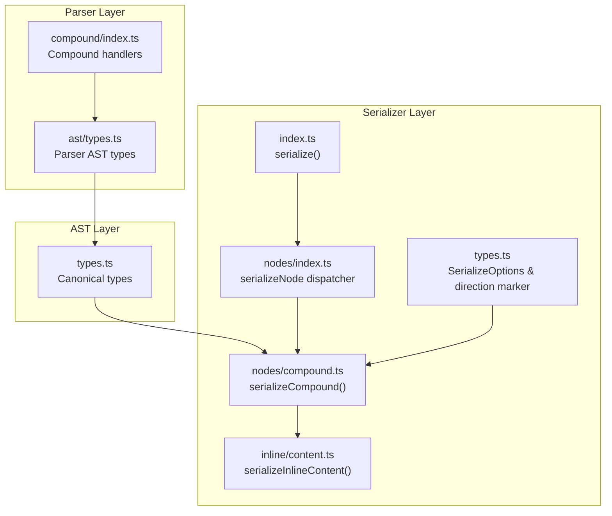
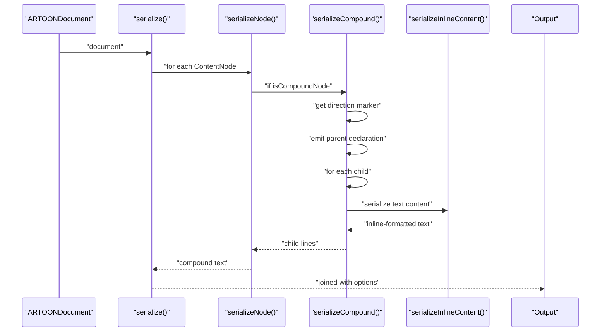
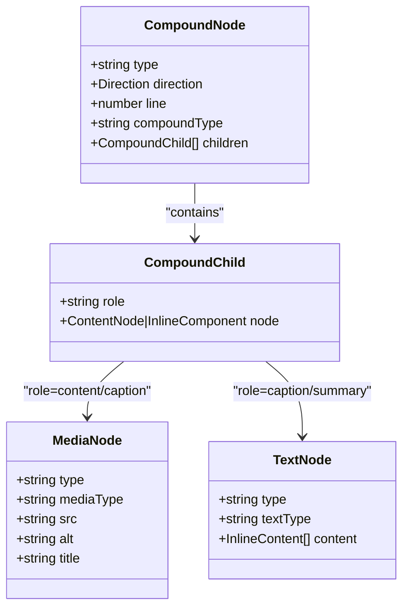
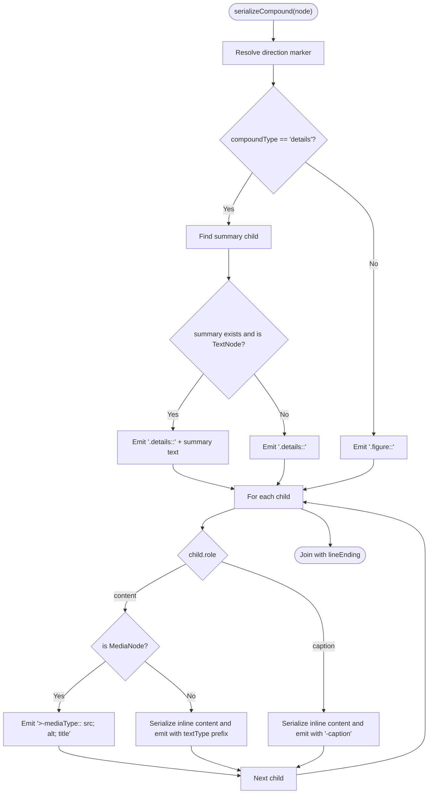
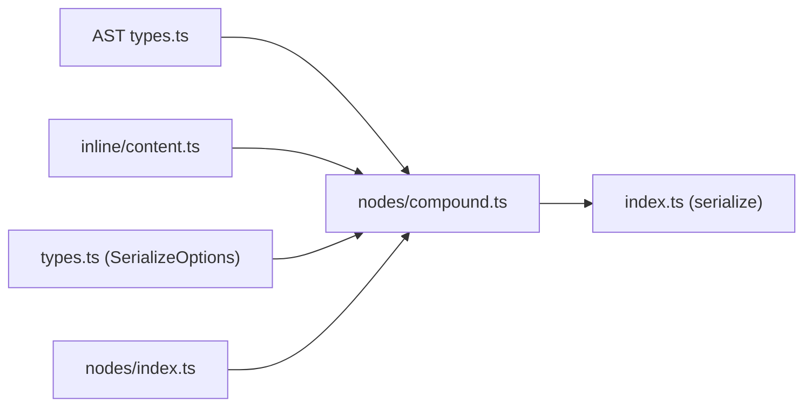

# Compound Serializer

<cite>
**Referenced Files in This Document**
- [compound.ts](file://artoon-serializer/src/nodes/compound.ts)
- [index.ts](file://artoon-serializer/src/nodes/index.ts)
- [types.ts](file://artoon-serializer/src/types.ts)
- [index.ts](file://artoon-serializer/src/index.ts)
- [content.ts](file://artoon-serializer/src/inline/content.ts)
- [compound.test.ts](file://artoon-serializer/tests/compound.test.ts)
- [compound.ts](file://artoon-parser/src/compound/index.ts)
- [types.ts](file://artoon-ast/src/types.ts)
- [index.ts](file://artoon-parser/src/ast/types.ts)
- [test-compound-blocks.artoon](file://artoon-examples/test-compound-blocks.artoon)
- [complete-syntax-showcase.artoon](file://artoon-examples/complete-syntax-showcase.artoon)
</cite>

## Table of Contents
1. [Introduction](#introduction)
2. [Project Structure](#project-structure)
3. [Core Components](#core-components)
4. [Architecture Overview](#architecture-overview)
5. [Detailed Component Analysis](#detailed-component-analysis)
6. [Dependency Analysis](#dependency-analysis)
7. [Performance Considerations](#performance-considerations)
8. [Troubleshooting Guide](#troubleshooting-guide)
9. [Conclusion](#conclusion)
10. [Appendices](#appendices)

## Introduction
This document explains how compound node serialization works in the ARTOON system. Compound components are complex, nested structures composed of a parent component (figure or details) and child elements. The serializer converts AST nodes representing figures and details into ARTOON text syntax while preserving directionality, nested content, and inline formatting. The documentation covers syntax rules, nested content handling, structural formatting, integration with other node types, and edge cases such as deeply nested compounds, empty content, and formatting variations.

## Project Structure
The compound serialization pipeline spans three layers:
- Parser layer: validates and constructs compound nodes with child roles and types.
- AST layer: defines the canonical CompoundNode, CompoundChild, and related types.
- Serializer layer: transforms AST nodes into ARTOON text, handling direction markers, child serialization, and inline content.

**Diagram sources**
- [compound.ts:1-170](file://artoon-parser/src/compound/index.ts#L1-L170)
- [types.ts:1-258](file://artoon-parser/src/ast/types.ts#L1-L258)
- [types.ts:1-539](file://artoon-ast/src/types.ts#L1-L539)
- [compound.ts:1-92](file://artoon-serializer/src/nodes/compound.ts#L1-L92)
- [index.ts:1-91](file://artoon-serializer/src/nodes/index.ts#L1-L91)
- [content.ts:1-115](file://artoon-serializer/src/inline/content.ts#L1-L115)
- [types.ts:1-32](file://artoon-serializer/src/types.ts#L1-L32)
- [index.ts:1-95](file://artoon-serializer/src/index.ts#L1-L95)

**Section sources**
- [compound.ts:1-170](file://artoon-parser/src/compound/index.ts#L1-L170)
- [types.ts:1-258](file://artoon-parser/src/ast/types.ts#L1-L258)
- [types.ts:1-539](file://artoon-ast/src/types.ts#L1-L539)
- [compound.ts:1-92](file://artoon-serializer/src/nodes/compound.ts#L1-L92)
- [index.ts:1-91](file://artoon-serializer/src/nodes/index.ts#L1-L91)
- [content.ts:1-115](file://artoon-serializer/src/inline/content.ts#L1-L115)
- [types.ts:1-32](file://artoon-serializer/src/types.ts#L1-L32)
- [index.ts:1-95](file://artoon-serializer/src/index.ts#L1-L95)

## Core Components
- CompoundNode and CompoundChild: The AST representation of compound structures with typed roles and child nodes.
- serializeCompound(): The primary serializer for compound nodes, emitting figure and details syntax with direction markers and child serialization.
- serializeNode(): Dispatches to specific serializers based on node type, including compound.
- serializeInlineContent(): Serializes inline content arrays into bracketed inline syntax.
- SerializeOptions: Controls line endings, blank-line spacing, and comment preservation.

Key responsibilities:
- Direction handling: Uses direction markers to prefix compound declarations and child lines.
- Child role mapping: Translates roles (content, caption, summary) into appropriate child syntax.
- Inline formatting: Preserves inline marks and components within text children.

**Section sources**
- [types.ts:248-272](file://artoon-ast/src/types.ts#L248-L272)
- [compound.ts:20-92](file://artoon-serializer/src/nodes/compound.ts#L20-L92)
- [index.ts:32-78](file://artoon-serializer/src/nodes/index.ts#L32-L78)
- [content.ts:8-21](file://artoon-serializer/src/inline/content.ts#L8-L21)
- [types.ts:6-31](file://artoon-serializer/src/types.ts#L6-L31)

## Architecture Overview
The compound serialization flow integrates with the broader serialization pipeline. The main serializer iterates over document content, dispatches to node-specific serializers, and applies global formatting options. Compound serialization handles both figure and details variants, with distinct child handling rules.

**Diagram sources**
- [index.ts:17-59](file://artoon-serializer/src/index.ts#L17-L59)
- [index.ts:32-78](file://artoon-serializer/src/nodes/index.ts#L32-L78)
- [compound.ts:20-54](file://artoon-serializer/src/nodes/compound.ts#L20-L54)
- [content.ts:8-21](file://artoon-serializer/src/inline/content.ts#L8-L21)

**Section sources**
- [index.ts:17-59](file://artoon-serializer/src/index.ts#L17-L59)
- [index.ts:32-78](file://artoon-serializer/src/nodes/index.ts#L32-L78)
- [compound.ts:20-54](file://artoon-serializer/src/nodes/compound.ts#L20-L54)
- [content.ts:8-21](file://artoon-serializer/src/inline/content.ts#L8-L21)

## Detailed Component Analysis

### CompoundNode Data Model
CompoundNode encapsulates:
- type: canonical discriminator for compound nodes.
- compoundType: figure or details.
- children: array of CompoundChild entries with role and node.
- direction: inherited from base node for line prefixing.

CompoundChild roles:
- content: primary content for figure (media).
- caption: descriptive text for figure.
- summary: introductory text for details.

**Diagram sources**
- [types.ts:248-272](file://artoon-ast/src/types.ts#L248-L272)
- [types.ts:258-262](file://artoon-ast/src/types.ts#L258-L262)
- [types.ts:307-315](file://artoon-ast/src/types.ts#L307-L315)
- [types.ts:132-137](file://artoon-ast/src/types.ts#L132-L137)

**Section sources**
- [types.ts:248-272](file://artoon-ast/src/types.ts#L248-L272)
- [types.ts:258-262](file://artoon-ast/src/types.ts#L258-L262)
- [types.ts:307-315](file://artoon-ast/src/types.ts#L307-L315)
- [types.ts:132-137](file://artoon-ast/src/types.ts#L132-L137)

### Compound Serialization Logic
serializeCompound() implements:
- Direction marker resolution via getDirectionMarker().
- Parent declaration emission:
  - details: emits summary text inline if present.
  - figure: emits the parent declaration and serializes children.
- Child serialization:
  - Media nodes: emits mediaType with attributes (src; alt; title).
  - Text nodes: serializes inline content and applies role-specific prefixes.
- Output formatting: joins lines using configured line ending.

**Diagram sources**
- [compound.ts:20-92](file://artoon-serializer/src/nodes/compound.ts#L20-L92)
- [content.ts:8-21](file://artoon-serializer/src/inline/content.ts#L8-L21)
- [types.ts:29-31](file://artoon-serializer/src/types.ts#L29-L31)

**Section sources**
- [compound.ts:20-92](file://artoon-serializer/src/nodes/compound.ts#L20-L92)
- [content.ts:8-21](file://artoon-serializer/src/inline/content.ts#L8-L21)
- [types.ts:29-31](file://artoon-serializer/src/types.ts#L29-L31)

### Parser Integration and Validation
The parser enforces compound structure and child validity:
- COMPOUND_CHILDREN defines allowed children per compound type.
- validateCompoundChild() checks semantic validity and suggests corrections.
- buildCompoundNode() creates AST nodes with componentType and children.
- getRequiredChildren() specifies mandatory children (e.g., summary for details).
- shouldCloseCompound() determines when compound parsing should finalize.

These rules ensure the AST fed to the serializer adheres to structural constraints.

**Section sources**
- [compound.ts:15-145](file://artoon-parser/src/compound/index.ts#L15-L145)
- [compound.ts:96-122](file://artoon-parser/src/compound/index.ts#L96-L122)
- [index.ts:98-104](file://artoon-parser/src/ast/types.ts#L98-L104)

### Inline Content Handling
serializeInlineContent() converts InlineContent[] to bracketed inline syntax:
- Plain text is emitted as-is.
- Inline components are bracketed with optional modifiers and attributes.
- Media and link attributes are serialized in specific order to match ARTOON expectations.

This ensures inline formatting (marks, links, images, etc.) remains intact during compound serialization.

**Section sources**
- [content.ts:8-115](file://artoon-serializer/src/inline/content.ts#L8-L115)

### Examples and Test Coverage
Representative examples demonstrate:
- Figure with image and caption in RTL/LTR contexts.
- Details with summary and nested content (lists, tables, code).
- Nested details and mixed content around compounds.

These examples validate correct serialization of nested structures and role-based child emission.

**Section sources**
- [compound.test.ts:7-136](file://artoon-serializer/tests/compound.test.ts#L7-L136)
- [test-compound-blocks.artoon:1-110](file://artoon-examples/test-compound-blocks.artoon#L1-L110)
- [complete-syntax-showcase.artoon:176-285](file://artoon-examples/complete-syntax-showcase.artoon#L176-L285)

## Dependency Analysis
Compound serialization depends on:
- AST types for node shape and roles.
- Inline serializer for text content formatting.
- Direction utilities for line prefixing.
- Node dispatcher for polymorphic serialization.

**Diagram sources**
- [types.ts:248-272](file://artoon-ast/src/types.ts#L248-L272)
- [content.ts:8-21](file://artoon-serializer/src/inline/content.ts#L8-L21)
- [types.ts:6-31](file://artoon-serializer/src/types.ts#L6-L31)
- [index.ts:32-78](file://artoon-serializer/src/nodes/index.ts#L32-L78)
- [index.ts:17-59](file://artoon-serializer/src/index.ts#L17-L59)

**Section sources**
- [types.ts:248-272](file://artoon-ast/src/types.ts#L248-L272)
- [content.ts:8-21](file://artoon-serializer/src/inline/content.ts#L8-L21)
- [types.ts:6-31](file://artoon-serializer/src/types.ts#L6-L31)
- [index.ts:32-78](file://artoon-serializer/src/nodes/index.ts#L32-L78)
- [index.ts:17-59](file://artoon-serializer/src/index.ts#L17-L59)

## Performance Considerations
- Linear pass over children: O(n) per compound node.
- Inline serialization cost scales with content length; avoid unnecessary reprocessing.
- Direction marker computation is constant-time per node.
- Blank-line insertion is controlled by options; disabling reduces join overhead.

## Troubleshooting Guide
Common issues and resolutions:
- Missing summary in details: The parser requires a summary child; ensure presence or adjust structure.
- Invalid child types: validateCompoundChild() reports semantic errors; align child types with allowed lists.
- Empty compound content: Figures may serialize without children; details should include summary.
- Direction mismatch: Verify direction markers and child prefixes are consistent with node direction.
- Inline formatting loss: Confirm serializeInlineContent() receives InlineContent[] and not raw text.

Validation and examples:
- Unit tests cover figure and details scenarios.
- Example documents illustrate nested compounds and mixed content.

**Section sources**
- [compound.ts:63-84](file://artoon-parser/src/compound/index.ts#L63-L84)
- [compound.ts:136-145](file://artoon-parser/src/compound/index.ts#L136-L145)
- [compound.test.ts:7-136](file://artoon-serializer/tests/compound.test.ts#L7-L136)
- [test-compound-blocks.artoon:1-110](file://artoon-examples/test-compound-blocks.artoon#L1-L110)

## Conclusion
Compound serialization in ARTOON preserves hierarchical structure and inline formatting while enforcing semantic rules. The serializer’s role-based child handling, direction-aware formatting, and integration with the inline content pipeline produce robust, readable ARTOON syntax. Adhering to parser-defined constraints and leveraging the provided examples ensures reliable serialization of complex compound components.

## Appendices

### Compound Syntax Reference
- Figure declaration: direction-prefixed ".figure::" followed by child lines.
- Details declaration: direction-prefixed ".details:: summary text", followed by content lines.
- Child prefixes:
  - Media: direction-prefixed ".-mediaType:: src; alt; title"
  - Caption: direction-prefixed ".-caption:: text"
  - Text: direction-prefixed ".textType:: text"
- Direction markers:
  - RTL: ">"
  - LTR: "<"

**Section sources**
- [compound.ts:20-92](file://artoon-serializer/src/nodes/compound.ts#L20-L92)
- [types.ts:29-31](file://artoon-serializer/src/types.ts#L29-L31)