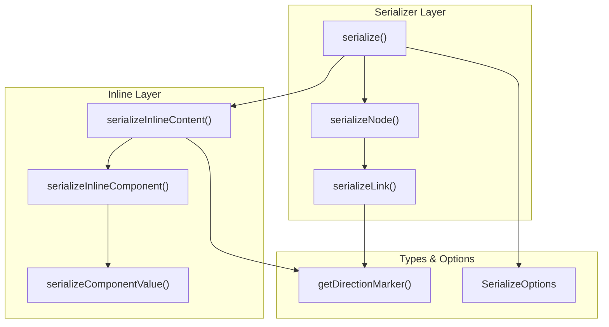
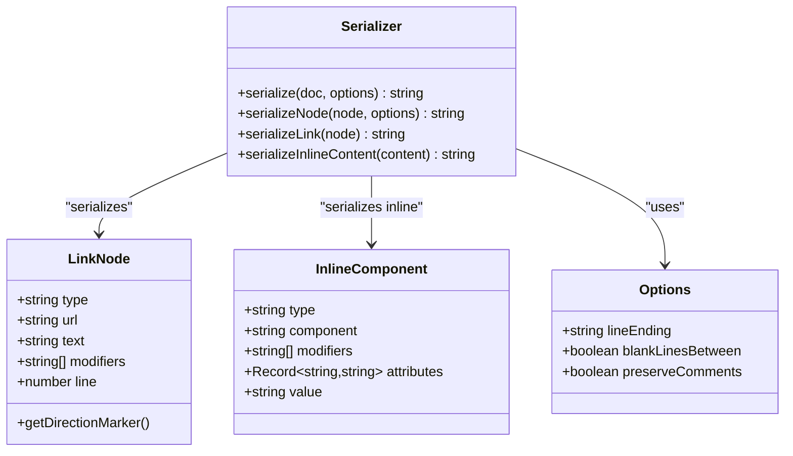
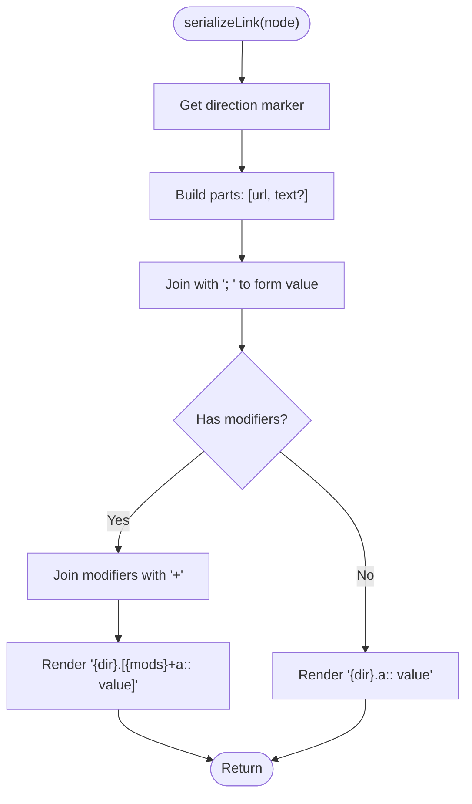
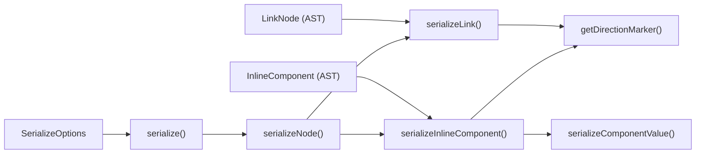

# Link Serializer

<cite>
**Referenced Files in This Document**
- [link.ts](file://artoon-serializer/src/nodes/link.ts)
- [index.ts](file://artoon-serializer/src/nodes/index.ts)
- [types.ts](file://artoon-serializer/src/types.ts)
- [index.ts](file://artoon-serializer/src/index.ts)
- [content.ts](file://artoon-serializer/src/inline/content.ts)
- [converter.ts](file://artoon-parser/src/inline/converter.ts)
- [InlineParser.ts](file://artoon-typer/src/inline/InlineParser.ts)
- [types.ts](file://artoon-ast/src/types.ts)
- [link.test.ts](file://artoon-serializer/tests/link.test.ts)
- [inline.test.ts](file://artoon-serializer/tests/inline.test.ts)
- [10-INLINE-INTEGRATION.md](file://Core%20Invariants/10-INLINE-INTEGRATION.md)
</cite>

## Table of Contents
1. [Introduction](#introduction)
2. [Project Structure](#project-structure)
3. [Core Components](#core-components)
4. [Architecture Overview](#architecture-overview)
5. [Detailed Component Analysis](#detailed-component-analysis)
6. [Dependency Analysis](#dependency-analysis)
7. [Performance Considerations](#performance-considerations)
8. [Troubleshooting Guide](#troubleshooting-guide)
9. [Conclusion](#conclusion)

## Introduction
This document explains how link nodes are serialized in the ARTOON ecosystem. It covers:
- How links are represented in both block-level and inline contexts
- URL handling, anchor text preservation, and formatting rules
- Different link types (internal references, external URLs, mailto links)
- Link attributes, URL encoding, and escaping rules
- Edge cases such as empty links, malformed URLs, and content formatting
- Examples of serializing various link formats and nested content

## Project Structure
The link serialization logic spans three layers:
- Block-level link serialization via the dedicated node serializer
- Inline link serialization via the inline content serializer
- Shared direction markers and serialization options



**Diagram sources**
- [index.ts:17-59](file://artoon-serializer/src/index.ts#L17-L59)
- [index.ts:32-78](file://artoon-serializer/src/nodes/index.ts#L32-L78)
- [link.ts:12-30](file://artoon-serializer/src/nodes/link.ts#L12-L30)
- [content.ts:8-115](file://artoon-serializer/src/inline/content.ts#L8-L115)
- [types.ts:29-31](file://artoon-serializer/src/types.ts#L29-L31)

**Section sources**
- [index.ts:17-59](file://artoon-serializer/src/index.ts#L17-L59)
- [index.ts:32-78](file://artoon-serializer/src/nodes/index.ts#L32-L78)
- [link.ts:12-30](file://artoon-serializer/src/nodes/link.ts#L12-L30)
- [content.ts:8-115](file://artoon-serializer/src/inline/content.ts#L8-L115)
- [types.ts:29-31](file://artoon-serializer/src/types.ts#L29-L31)

## Core Components
- Block-level link serializer: transforms a LinkNode into a block-level ARTOON link line with optional modifiers and direction markers.
- Inline link serializer: transforms an InlineComponent of type 'a' into an inline ARTOON component with attributes mapped to url and text.
- Direction marker: selects the appropriate directional prefix based on node direction.
- Serialization options: controls line endings, blank-line separation, and comment preservation.

Key behaviors:
- Direction marker is derived from node direction and prefixes the output appropriately.
- For block-level links, the format is: direction dot modifier(s)+a:: url; text
- For inline links, the format is: [modifier(s)+a:: url; text]
- Modifiers are joined with '+' and placed before the component type.
- URL and text are separated by '; ' in both contexts.

**Section sources**
- [link.ts:12-30](file://artoon-serializer/src/nodes/link.ts#L12-L30)
- [content.ts:61-73](file://artoon-serializer/src/inline/content.ts#L61-L73)
- [types.ts:29-31](file://artoon-serializer/src/types.ts#L29-L31)
- [index.ts:17-59](file://artoon-serializer/src/index.ts#L17-L59)

## Architecture Overview
The serialization pipeline routes content nodes to specialized serializers. Links are handled differently depending on whether they appear as block-level nodes or inline components.

```mermaid
sequenceDiagram
participant S as "serialize()"
participant SN as "serializeNode()"
participant SL as "serializeLink()"
participant SI as "serializeInlineContent()"
participant SC as "serializeComponentValue()"
S->>SN : "content[i]"
SN-->>SL : "LinkNode"
SL-->>S : "Block-level link text"
S->>SI : "InlineContent[]"
SI->>SC : "InlineComponent {component : 'a'}"
SC-->>SI : "[a : : url; text]"
SI-->>S : "Inline link text"
```

**Diagram sources**
- [index.ts:40-56](file://artoon-serializer/src/index.ts#L40-L56)
- [index.ts:60-62](file://artoon-serializer/src/nodes/index.ts#L60-L62)
- [link.ts:12-30](file://artoon-serializer/src/nodes/link.ts#L12-L30)
- [content.ts:53-73](file://artoon-serializer/src/inline/content.ts#L53-L73)

## Detailed Component Analysis

### Block-Level Link Serialization
Block-level links are represented as standalone lines with direction markers and optional modifiers.

Rules:
- Direction marker: '<' for LTR, '>' for RTL.
- Modifiers: joined with '+' and placed before 'a'.
- Value composition: url; text (only if text exists).
- Output pattern: {dir}.{modifiers}+a:: {url}[; {text}]

Edge cases:
- Empty text: omitted from value.
- No modifiers: simple form without brackets.
- Direction: selected via getDirectionMarker.

Validation and examples are covered in unit tests.

**Section sources**
- [link.ts:12-30](file://artoon-serializer/src/nodes/link.ts#L12-L30)
- [link.test.ts:7-80](file://artoon-serializer/tests/link.test.ts#L7-L80)

### Inline Link Serialization
Inline links are embedded within text and represented as inline components.

Rules:
- Component type: 'a'.
- Attributes mapping: url and text are extracted from attributes.
- Value composition mirrors block-level: url; text (only if text exists).
- Modifiers: supported and rendered before the component type.
- Output pattern: [modifier(s)+a:: url; text]

Parsing and conversion:
- Parser converts tokens to InlineComponent with attributes.url and attributes.text.
- Converter maps arrays of attributes to attribute records for 'a' as [url, text].

**Section sources**
- [content.ts:61-73](file://artoon-serializer/src/inline/content.ts#L61-L73)
- [converter.ts:150-154](file://artoon-parser/src/inline/converter.ts#L150-L154)
- [inline.test.ts:43-66](file://artoon-serializer/tests/inline.test.ts#L43-L66)

### Direction and Modifiers
- Direction marker: getDirectionMarker maps 'rtl' to '>' and 'ltr' to '<'.
- Modifiers: applied to both block-level and inline links; order is preserved as provided.

**Section sources**
- [types.ts:29-31](file://artoon-serializer/src/types.ts#L29-L31)
- [10-INLINE-INTEGRATION.md:186-201](file://Core%20Invariants/10-INLINE-INTEGRATION.md#L186-L201)

### URL Handling and Anchor Text Preservation
- URL extraction: block serializer reads node.url; inline serializer reads attributes.url or href.
- Anchor text: block serializer reads node.text; inline serializer reads attributes.text or value.
- Both contexts join url and text with '; ' when text is present.

**Section sources**
- [link.ts:16-20](file://artoon-serializer/src/nodes/link.ts#L16-L20)
- [content.ts:67-68](file://artoon-serializer/src/inline/content.ts#L67-L68)
- [converter.ts:150-154](file://artoon-parser/src/inline/converter.ts#L150-L154)

### Link Types and Special Cases
- External URLs: supported via url attribute; no special prefix required.
- Internal references: can be modeled as url values; the serializer treats them uniformly.
- Mailto links: treated as url values; no special handling beyond standard URL serialization.

Note: The serializer does not enforce URL validity or perform encoding; it preserves the values as provided.

**Section sources**
- [link.ts:16-20](file://artoon-serializer/src/nodes/link.ts#L16-L20)
- [content.ts:67-68](file://artoon-serializer/src/inline/content.ts#L67-L68)

### Attribute Mapping and Conversion
- Parser to AST: converter maps token attributes to InlineComponent attributes for 'a' as [url, text].
- AST to text: inline serializer reconstructs [a:: url; text] from attributes.

**Section sources**
- [converter.ts:150-154](file://artoon-parser/src/inline/converter.ts#L150-L154)
- [content.ts:61-73](file://artoon-serializer/src/inline/content.ts#L61-L73)

### Nested Content Within Links
- Inline links accept modifiers; modifiers are rendered before the component type.
- Mixed inline content: plain text and other inline components interleave around links.

**Section sources**
- [10-INLINE-INTEGRATION.md:186-201](file://Core%20Invariants/10-INLINE-INTEGRATION.md#L186-L201)
- [inline.test.ts:177-189](file://artoon-serializer/tests/inline.test.ts#L177-L189)

### Proper Syntax Preservation
- Modifiers order: preserved as provided.
- Direction markers: applied consistently.
- Value separator: '; ' separates url and text in both contexts.

**Section sources**
- [link.ts:23-26](file://artoon-serializer/src/nodes/link.ts#L23-L26)
- [content.ts:43-47](file://artoon-serializer/src/inline/content.ts#L43-L47)

## Architecture Overview



**Diagram sources**
- [types.ts:324-330](file://artoon-ast/src/types.ts#L324-L330)
- [content.ts:26-48](file://artoon-serializer/src/inline/content.ts#L26-L48)
- [index.ts:17-59](file://artoon-serializer/src/index.ts#L17-L59)
- [types.ts:6-24](file://artoon-serializer/src/types.ts#L6-L24)

## Detailed Component Analysis

### Block-Level Link Flow


**Diagram sources**
- [link.ts:12-30](file://artoon-serializer/src/nodes/link.ts#L12-L30)

**Section sources**
- [link.ts:12-30](file://artoon-serializer/src/nodes/link.ts#L12-L30)
- [link.test.ts:7-80](file://artoon-serializer/tests/link.test.ts#L7-L80)

### Inline Link Flow
```mermaid
sequenceDiagram
participant IC as "InlineComponent {component : 'a'}"
participant SVC as "serializeComponentValue()"
participant SIC as "serializeInlineComponent()"
participant SICN as "serializeInlineContent()"
SICN->>SIC : "Iterate items"
SIC->>IC : "InlineComponent"
SIC->>SVC : "Extract attributes.url/text"
SVC-->>SIC : "Compose 'url; text'"
SIC-->>SICN : "[modifier(s)+a : : url; text]"
```

**Diagram sources**
- [content.ts:26-73](file://artoon-serializer/src/inline/content.ts#L26-L73)

**Section sources**
- [content.ts:26-73](file://artoon-serializer/src/inline/content.ts#L26-L73)
- [inline.test.ts:43-66](file://artoon-serializer/tests/inline.test.ts#L43-L66)

### Parser Integration for Links
- Parser extracts href/title and maps them to attributes for inline links.
- Editor integration ensures attributes use url/text for consistency with serializer expectations.

**Section sources**
- [converter.ts:234-249](file://artoon-parser/src/inline/converter.ts#L234-L249)
- [InlineParser.ts:230-236](file://artoon-typer/src/inline/InlineParser.ts#L230-L236)

## Dependency Analysis



**Diagram sources**
- [types.ts:324-330](file://artoon-ast/src/types.ts#L324-L330)
- [link.ts:12-30](file://artoon-serializer/src/nodes/link.ts#L12-L30)
- [content.ts:26-73](file://artoon-serializer/src/inline/content.ts#L26-L73)
- [types.ts:29-31](file://artoon-serializer/src/types.ts#L29-L31)
- [index.ts:17-59](file://artoon-serializer/src/index.ts#L17-L59)
- [index.ts:32-78](file://artoon-serializer/src/nodes/index.ts#L32-L78)

**Section sources**
- [types.ts:324-330](file://artoon-ast/src/types.ts#L324-L330)
- [link.ts:12-30](file://artoon-serializer/src/nodes/link.ts#L12-L30)
- [content.ts:26-73](file://artoon-serializer/src/inline/content.ts#L26-L73)
- [types.ts:29-31](file://artoon-serializer/src/types.ts#L29-L31)
- [index.ts:17-59](file://artoon-serializer/src/index.ts#L17-L59)
- [index.ts:32-78](file://artoon-serializer/src/nodes/index.ts#L32-L78)

## Performance Considerations
- String concatenation and array joins are linear in the number of parts and modifiers.
- Direction marker lookup is O(1).
- Inline serialization iterates over InlineContent items; complexity scales with content length.
- Recommendations:
  - Avoid unnecessary intermediate allocations by reusing buffers when extending to larger documents.
  - Keep modifier arrays small; excessive modifiers increase string sizes.

[No sources needed since this section provides general guidance]

## Troubleshooting Guide
Common issues and resolutions:
- Unexpected direction marker:
  - Verify node.direction is set to 'rtl' or 'ltr'.
- Missing text in inline links:
  - Ensure attributes.text or value is populated when constructing InlineComponent.
- Malformed URLs:
  - The serializer does not validate URLs; ensure upstream parsing produces valid values.
- Empty links:
  - Block serializer omits text when missing; inline serializer writes only url when text is absent.
- Escaping and encoding:
  - The serializer does not perform URL encoding; ensure inputs are properly encoded before serialization.

**Section sources**
- [link.ts:16-20](file://artoon-serializer/src/nodes/link.ts#L16-L20)
- [content.ts:67-73](file://artoon-serializer/src/inline/content.ts#L67-L73)
- [link.test.ts:22-34](file://artoon-serializer/tests/link.test.ts#L22-L34)
- [inline.test.ts:43-53](file://artoon-serializer/tests/inline.test.ts#L43-L53)

## Conclusion
The ARTOON link serializer supports both block-level and inline link representations with consistent direction markers, modifier ordering, and value formatting. It preserves URL and anchor text fidelity and integrates with the broader serialization pipeline. For robustness, ensure upstream parsing and editing produce valid attribute sets and consider encoding URLs externally when required.