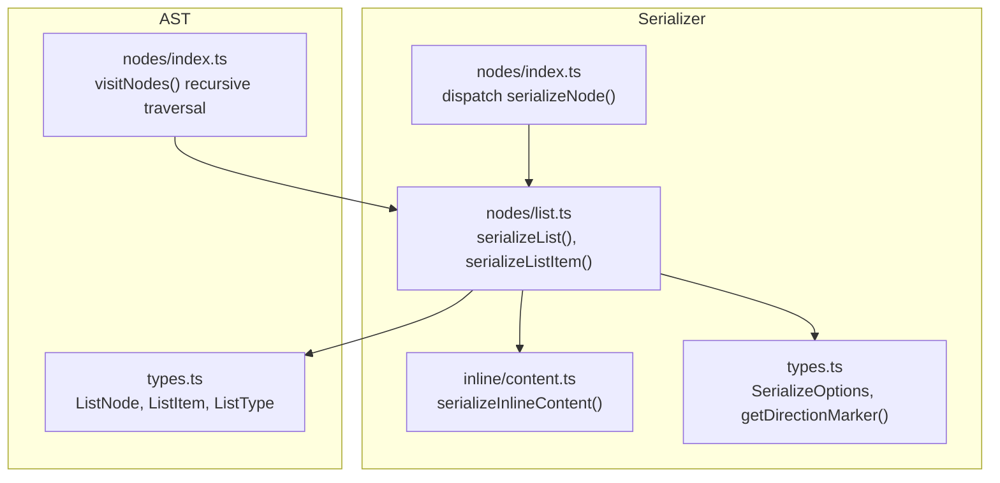
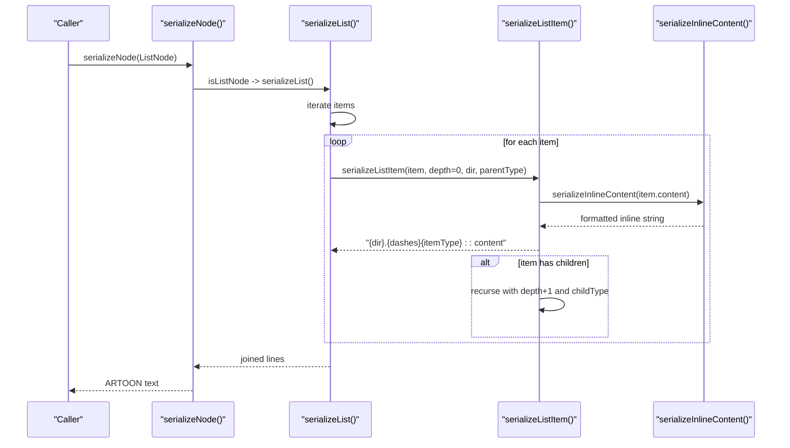
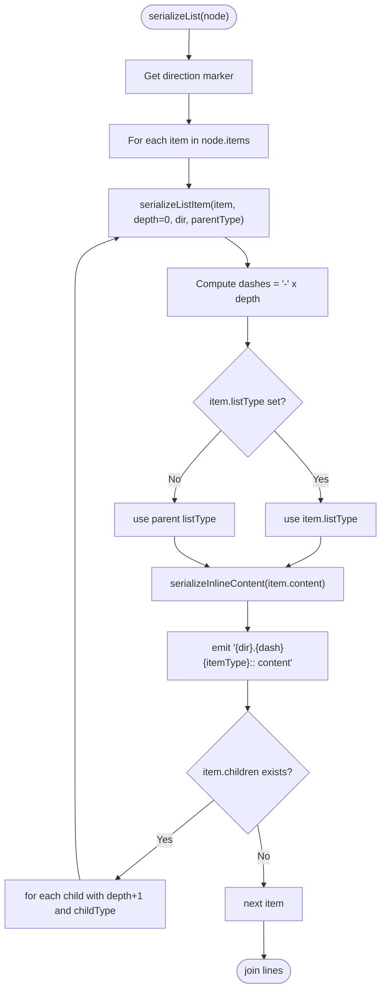
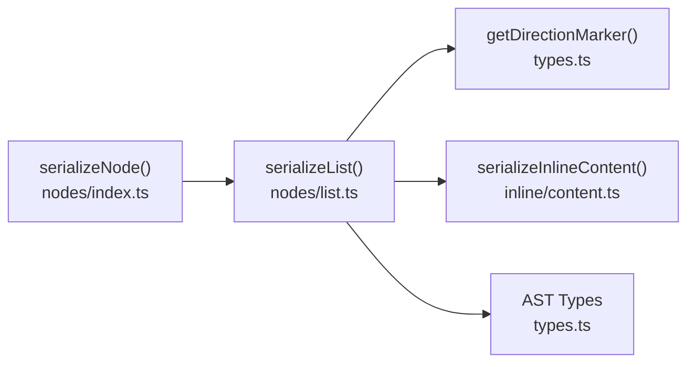

# List Serializer

<cite>
**Referenced Files in This Document**
- [list.ts](file://artoon-serializer/src/nodes/list.ts)
- [index.ts](file://artoon-serializer/src/nodes/index.ts)
- [types.ts](file://artoon-serializer/src/types.ts)
- [content.ts](file://artoon-serializer/src/inline/content.ts)
- [index.ts](file://artoon-serializer/src/nodes/index.ts)
- [list.test.ts](file://artoon-serializer/tests/list.test.ts)
- [types.ts](file://artoon-ast/src/types.ts)
- [index.ts](file://artoon-ast/src/nodes/index.ts)
- [lists-showcase.artoon](file://artoon-examples/lists-showcase.artoon)
</cite>

## Table of Contents
1. [Introduction](#introduction)
2. [Project Structure](#project-structure)
3. [Core Components](#core-components)
4. [Architecture Overview](#architecture-overview)
5. [Detailed Component Analysis](#detailed-component-analysis)
6. [Dependency Analysis](#dependency-analysis)
7. [Performance Considerations](#performance-considerations)
8. [Troubleshooting Guide](#troubleshooting-guide)
9. [Conclusion](#conclusion)
10. [Appendices](#appendices)

## Introduction
This document explains the list node serializers in ARTOON, focusing on how ordered lists (ol), unordered lists (ul), and definition lists (dl) are serialized. It covers list item syntax, bullet point handling, nested list structures, indentation via depth prefixes, marker preservation, and content formatting within list items. It also documents examples, edge cases, and best practices for robust serialization.

## Project Structure
The list serialization pipeline resides in the serializer module and integrates with the AST and inline content serializers.

**Diagram sources**
- [index.ts:32-78](file://artoon-serializer/src/nodes/index.ts#L32-L78)
- [list.ts:17-59](file://artoon-serializer/src/nodes/list.ts#L17-L59)
- [content.ts:8-115](file://artoon-serializer/src/inline/content.ts#L8-L115)
- [types.ts:6-31](file://artoon-serializer/src/types.ts#L6-L31)
- [types.ts:178-216](file://artoon-ast/src/types.ts#L178-L216)
- [index.ts:128-164](file://artoon-ast/src/nodes/index.ts#L128-L164)

**Section sources**
- [index.ts:32-78](file://artoon-serializer/src/nodes/index.ts#L32-L78)
- [list.ts:17-59](file://artoon-serializer/src/nodes/list.ts#L17-L59)
- [content.ts:8-115](file://artoon-serializer/src/inline/content.ts#L8-L115)
- [types.ts:6-31](file://artoon-serializer/src/types.ts#L6-L31)
- [types.ts:178-216](file://artoon-ast/src/types.ts#L178-L216)
- [index.ts:128-164](file://artoon-ast/src/nodes/index.ts#L128-L164)

## Core Components
- List serializer entry points:
  - serializeList(): Serializes a ListNode into flat per-item ARTOON lines.
  - serializeListItem(): Recursively serializes items with depth-based prefixes.
- Inline content serializer:
  - serializeInlineContent(): Renders ListItem.content into formatted text.
- Options and direction markers:
  - SerializeOptions: Controls line endings and formatting.
  - getDirectionMarker(): Converts 'rtl'/'ltr' to '>'/'<'.

Key behaviors:
- Each list item is emitted as a standalone line with its own type and depth prefix.
- Depth is indicated by a dash prefix per nesting level.
- Item-level listType can override parent listType for mixed-type lists at the same nesting level.
- Nested items are rendered immediately after their parent’s content.

**Section sources**
- [list.ts:17-59](file://artoon-serializer/src/nodes/list.ts#L17-L59)
- [content.ts:8-115](file://artoon-serializer/src/inline/content.ts#L8-L115)
- [types.ts:6-31](file://artoon-serializer/src/types.ts#L6-L31)
- [types.ts:178-216](file://artoon-ast/src/types.ts#L178-L216)

## Architecture Overview
The serializer dispatches nodes and routes list nodes to the list serializer. The list serializer iterates items, computes depth prefixes, resolves item-level listType, and delegates inline content rendering.

**Diagram sources**
- [index.ts:32-78](file://artoon-serializer/src/nodes/index.ts#L32-L78)
- [list.ts:17-59](file://artoon-serializer/src/nodes/list.ts#L17-L59)
- [content.ts:8-115](file://artoon-serializer/src/inline/content.ts#L8-L115)

## Detailed Component Analysis

### List Serialization Logic
- serializeList():
  - Computes direction marker from node.direction.
  - Iterates ListNode.items and emits each item via serializeListItem().
  - Joins lines using options.lineEnding.
- serializeListItem():
  - Builds depth prefix as '-' repeated by depth.
  - Chooses item.listType if present, else falls back to parent listType.
  - Serializes inline content and emits a single line with the pattern: "{dir}.{dashes}{itemType}:: {content}".
  - Recurses into item.children with depth+1 and childType (or resolved item.listType).

**Diagram sources**
- [list.ts:17-59](file://artoon-serializer/src/nodes/list.ts#L17-L59)
- [content.ts:8-115](file://artoon-serializer/src/inline/content.ts#L8-L115)

**Section sources**
- [list.ts:17-59](file://artoon-serializer/src/nodes/list.ts#L17-L59)

### Inline Content Formatting Within List Items
- serializeInlineContent():
  - Iterates InlineContent[] and joins results.
  - For plain text, emits raw value.
  - For inline components, builds bracketed syntax with optional modifiers and component type, then serializes component-specific attributes/values.

This ensures that rich inline content (links, code, abbreviations, timestamps, etc.) inside list items is preserved during serialization.

**Section sources**
- [content.ts:8-115](file://artoon-serializer/src/inline/content.ts#L8-L115)

### AST Types and Contracts for Lists
- ListNode:
  - listType: 'ul' | 'ol' | 'dl'
  - items: ListItem[]
- ListItem:
  - itemType: 'li' | 'dt' | 'dd'
  - listType?: 'ul' | 'ol' | 'dl' (overrides parent at item level)
  - childListType?: 'ul' | 'ol' | 'dl' (overrides parent for nested children)
  - children?: ListItem[] (v2.0: direct array, not wrapped ListNode)
- Recursive traversal:
  - visitNodes() supports visiting nested ListItem[] recursively.

These contracts enable mixed-type lists at the same nesting level and precise nested structure handling.

**Section sources**
- [types.ts:178-216](file://artoon-ast/src/types.ts#L178-L216)
- [index.ts:128-164](file://artoon-ast/src/nodes/index.ts#L128-L164)

### Examples and Behavior Verified by Tests
- Unordered lists (ul):
  - Each item emits with itemType 'li' and parent listType 'ul'.
- Ordered lists (ol):
  - Each item emits with itemType 'li' and parent listType 'ol'.
- Definition lists (dl):
  - Items emit with itemType 'dt'/'dd' and parent listType 'dl'.
- Nested lists:
  - Single dash (-) for one level deep, double dash (--) for two levels, and so forth.
- Mixed-type lists:
  - Item-level listType can differ from parent, enabling combinations at the same nesting level.

These behaviors are validated by unit tests.

**Section sources**
- [list.test.ts:7-121](file://artoon-serializer/tests/list.test.ts#L7-L121)

### Practical Examples from the Showcase
The lists showcase demonstrates:
- Simple unordered and ordered lists.
- Rich inline formatting within items (modifiers, links, code, abbreviations, timestamps).
- Multi-level nesting up to four levels.
- Mixed content and language usage (Arabic and English).

Use this file as a reference for expected output patterns and formatting.

**Section sources**
- [lists-showcase.artoon:1-457](file://artoon-examples/lists-showcase.artoon#L1-L457)

## Dependency Analysis
- serializeNode() dispatches to serializeList() for ListNode.
- serializeList() depends on:
  - getDirectionMarker() for RTL/LTR markers.
  - serializeInlineContent() for item content formatting.
  - AST types for ListNode and ListItem contracts.

**Diagram sources**
- [index.ts:32-78](file://artoon-serializer/src/nodes/index.ts#L32-L78)
- [list.ts:17-59](file://artoon-serializer/src/nodes/list.ts#L17-L59)
- [types.ts:29-31](file://artoon-serializer/src/types.ts#L29-L31)
- [content.ts:8-115](file://artoon-serializer/src/inline/content.ts#L8-L115)
- [types.ts:178-216](file://artoon-ast/src/types.ts#L178-L216)

**Section sources**
- [index.ts:32-78](file://artoon-serializer/src/nodes/index.ts#L32-L78)
- [list.ts:17-59](file://artoon-serializer/src/nodes/list.ts#L17-L59)
- [types.ts:29-31](file://artoon-serializer/src/types.ts#L29-L31)
- [content.ts:8-115](file://artoon-serializer/src/inline/content.ts#L8-L115)
- [types.ts:178-216](file://artoon-ast/src/types.ts#L178-L216)

## Performance Considerations
- Time complexity:
  - serializeList(): O(N) over total number of items across all nesting levels, since each item is visited once.
  - serializeListItem(): O(M) per item where M is the number of inline content elements; recursion depth equals nesting levels.
- Space complexity:
  - Proportional to output size plus recursion stack depth.
- Recommendations:
  - Prefer flattening nested structures at parse time to minimize deep recursion when possible.
  - Avoid excessive inline components per item to reduce stringify overhead.

[No sources needed since this section provides general guidance]

## Troubleshooting Guide
Common issues and resolutions:
- Unexpected listType in output:
  - Verify item.listType vs parent listType. Item-level listType takes precedence at that nesting level.
- Incorrect nesting depth:
  - Ensure item.children is a ListItem[] (v2.0 contract). Misconfigured children can lead to missing or incorrect nesting.
- Empty list items:
  - serializeInlineContent() will produce empty content for empty arrays. Confirm whether empty items should be omitted or represented differently in your workflow.
- Mixed content formatting:
  - serializeInlineContent() preserves inline components and modifiers. If formatting appears incorrect, check inline component attributes and modifier ordering.
- Direction markers:
  - getDirectionMarker() maps 'rtl' to '>' and 'ltr' to '<'. Confirm node.direction is set correctly.

Validation references:
- Unit tests demonstrate expected outputs for ul, ol, dl, nested lists, and multi-level nesting.
- AST contracts define item-level listType and children structure.

**Section sources**
- [list.test.ts:7-121](file://artoon-serializer/tests/list.test.ts#L7-L121)
- [types.ts:178-216](file://artoon-ast/src/types.ts#L178-L216)

## Conclusion
The ARTOON list serializer produces flat, item-level output with explicit depth prefixes and preserves inline formatting. It supports all list types, nested structures, mixed-type lists at the same nesting level, and direction-aware markers. By leveraging the AST contracts and inline serializer, it ensures robust and predictable serialization for diverse list scenarios.

[No sources needed since this section summarizes without analyzing specific files]

## Appendices

### Syntax Reference for Serialized Lists
- Direction marker:
  - '>' for RTL, '<' for LTR.
- Item pattern:
  - "{dir}.{dashes}{itemType}:: {content}"
  - dashes = '-' repeated by nesting depth.
- Examples:
  - RTL unordered item: ">li:: content"
  - One-level nested: "-li:: content"
  - Two-level nested: "--li:: content"
  - Definition term: "dt:: term"
  - Definition description: "dd:: description"

**Section sources**
- [list.ts:17-59](file://artoon-serializer/src/nodes/list.ts#L17-L59)
- [content.ts:8-115](file://artoon-serializer/src/inline/content.ts#L8-L115)