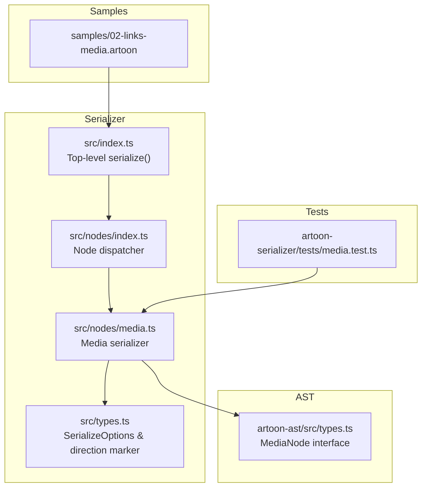
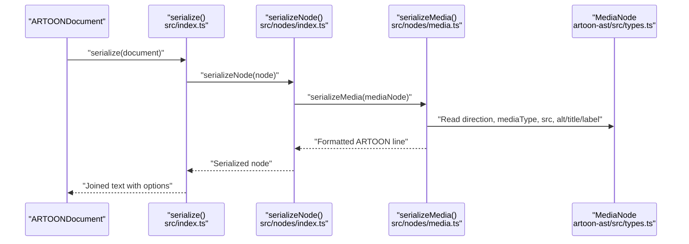
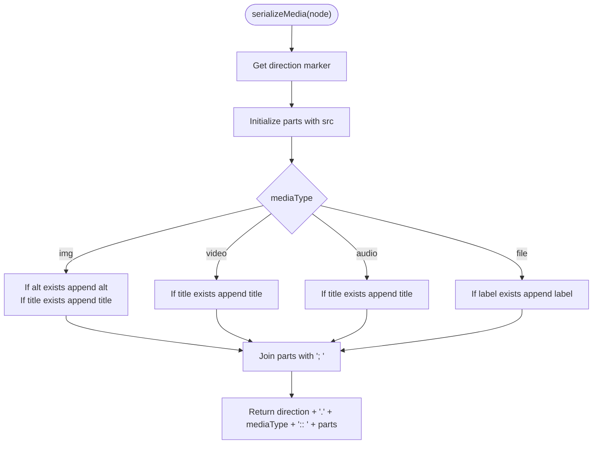
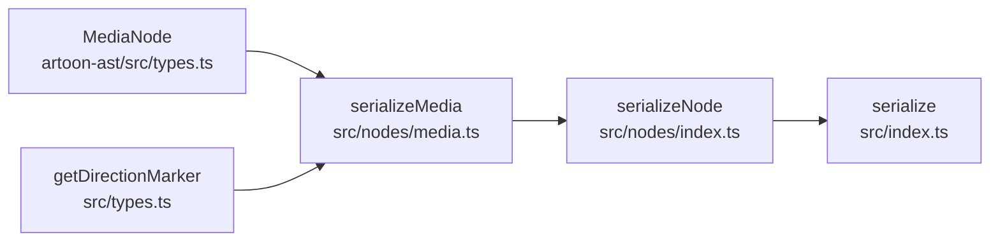

# Media Serializer

<cite>
**Referenced Files in This Document**
- [media.ts](file://artoon-serializer/src/nodes/media.ts)
- [index.ts](file://artoon-serializer/src/nodes/index.ts)
- [index.ts](file://artoon-serializer/src/index.ts)
- [types.ts](file://artoon-serializer/src/types.ts)
- [types.ts](file://artoon-ast/src/types.ts)
- [media.test.ts](file://artoon-serializer/tests/media.test.ts)
- [02-links-media.artoon](file://_ARCHIVE/samples-archive/samples/02-links-media.artoon)
- [01-SYNTAX-STRUCTURE.md](file://Core Invariants/01-SYNTAX-STRUCTURE.md)
- [04-INLINE-SEMANTICS.md](file://Core Invariants/04-INLINE-SEMANTICS.md)
</cite>

## Table of Contents
1. [Introduction](#introduction)
2. [Project Structure](#project-structure)
3. [Core Components](#core-components)
4. [Architecture Overview](#architecture-overview)
5. [Detailed Component Analysis](#detailed-component-analysis)
6. [Dependency Analysis](#dependency-analysis)
7. [Performance Considerations](#performance-considerations)
8. [Troubleshooting Guide](#troubleshooting-guide)
9. [Conclusion](#conclusion)
10. [Appendices](#appendices)

## Introduction
This document explains how media nodes are serialized in the ARTOON system. It covers the ARTOON media syntax, supported media types (images, videos, audio, files), attribute handling (alt text, title, label), direction markers, and how media nodes integrate into the document structure. It also documents formatting rules, edge cases (missing alt/title/label, direction handling), and provides examples derived from the repository’s serializer, AST types, and test suite.

## Project Structure
The media serialization pipeline resides in the serializer package and interacts with the AST types. The key files are:
- Serializer node dispatcher and media serializer
- Top-level serializer that orchestrates document serialization
- AST types that define the MediaNode interface
- Tests validating media serialization behavior
- Sample ARTOON files demonstrating media syntax in practice

**Diagram sources**
- [index.ts:17-59](file://artoon-serializer/src/index.ts#L17-L59)
- [index.ts:32-78](file://artoon-serializer/src/nodes/index.ts#L32-L78)
- [media.ts:15-36](file://artoon-serializer/src/nodes/media.ts#L15-L36)
- [types.ts:29-31](file://artoon-serializer/src/types.ts#L29-L31)
- [types.ts:307-315](file://artoon-ast/src/types.ts#L307-L315)
- [media.test.ts:1-97](file://artoon-serializer/tests/media.test.ts#L1-L97)
- [02-links-media.artoon:1-65](file://_ARCHIVE/samples-archive/samples/02-links-media.artoon#L1-L65)

**Section sources**
- [index.ts:17-59](file://artoon-serializer/src/index.ts#L17-L59)
- [index.ts:32-78](file://artoon-serializer/src/nodes/index.ts#L32-L78)
- [media.ts:15-36](file://artoon-serializer/src/nodes/media.ts#L15-L36)
- [types.ts:307-315](file://artoon-ast/src/types.ts#L307-L315)
- [media.test.ts:1-97](file://artoon-serializer/tests/media.test.ts#L1-L97)
- [02-links-media.artoon:1-65](file://_ARCHIVE/samples-archive/samples/02-links-media.artoon#L1-L65)

## Core Components
- MediaNode interface defines the canonical shape for media content, including direction, media type, and optional attributes.
- Media serializer converts a MediaNode into ARTOON syntax, applying direction markers and formatting attributes per media type.
- Node dispatcher routes content nodes to their respective serializers.
- Top-level serializer coordinates document serialization, including optional blank-line separation and comment handling.

Key behaviors:
- Direction marker is applied at the start of the line based on the node’s direction.
- Media syntax follows the pattern: direction marker + dot + media type + double-colon + space + semicolon-separated parts.
- Attribute inclusion depends on media type:
  - img: src; alt; title
  - video/audio: src; title
  - file: src; label

**Section sources**
- [types.ts:307-315](file://artoon-ast/src/types.ts#L307-L315)
- [media.ts:15-36](file://artoon-serializer/src/nodes/media.ts#L15-L36)
- [index.ts:56-58](file://artoon-serializer/src/nodes/index.ts#L56-L58)
- [index.ts:40-56](file://artoon-serializer/src/index.ts#L40-L56)

## Architecture Overview
The serialization flow for media nodes:

**Diagram sources**
- [index.ts:17-59](file://artoon-serializer/src/index.ts#L17-L59)
- [index.ts:32-78](file://artoon-serializer/src/nodes/index.ts#L32-L78)
- [media.ts:15-36](file://artoon-serializer/src/nodes/media.ts#L15-L36)
- [types.ts:307-315](file://artoon-ast/src/types.ts#L307-L315)

## Detailed Component Analysis

### MediaNode Interface and Attributes
MediaNode encapsulates:
- type: canonical discriminator
- mediaType: img | video | audio | file
- src: required file path or URL
- alt: optional alt text (images)
- title: optional title (images and audio/video)
- label: optional label (files)
- direction: rtl or ltr
- line: source line number

Formatting rules:
- Direction marker is prepended to the line.
- Parts are separated by semicolons in order of appearance.

Edge cases:
- Missing alt/title/label are omitted from the serialized output.
- Direction defaults to the appropriate marker based on node.direction.

**Section sources**
- [types.ts:307-315](file://artoon-ast/src/types.ts#L307-L315)
- [types.ts:29-31](file://artoon-serializer/src/types.ts#L29-L31)

### Media Serializer Implementation
Responsibilities:
- Compute direction marker from node.direction.
- Build parts array starting with src.
- Append attributes depending on mediaType.
- Join parts with semicolons and prepend direction marker.

Behavioral notes:
- Images include alt and title when provided.
- Audio/video include title when provided.
- Files include label when provided.
- No extra whitespace around semicolons; parts are joined directly.

**Diagram sources**
- [media.ts:15-36](file://artoon-serializer/src/nodes/media.ts#L15-L36)

**Section sources**
- [media.ts:15-36](file://artoon-serializer/src/nodes/media.ts#L15-L36)

### Node Dispatcher Integration
The dispatcher routes nodes to their serializers. For media nodes, it calls serializeMedia directly.

Implications:
- Ensures consistent dispatch across all node types.
- Media nodes bypass higher-level formatting and serialize to a single line.

**Section sources**
- [index.ts:56-58](file://artoon-serializer/src/nodes/index.ts#L56-L58)

### Top-Level Serializer Options
The top-level serializer supports:
- Blank lines between elements
- Line ending control
- Comment preservation

These options influence how media lines appear in the final document but do not change media syntax itself.

**Section sources**
- [index.ts:17-59](file://artoon-serializer/src/index.ts#L17-L59)
- [types.ts:6-24](file://artoon-serializer/src/types.ts#L6-L24)

### Examples from Tests and Samples
Examples demonstrate:
- Image with all attributes (src; alt; title)
- Image with only src
- Image with src and alt
- Video with src and title
- Audio with src and title
- File with src and label

Sample ARTOON file demonstrates real-world usage of media syntax in context.

**Section sources**
- [media.test.ts:7-21](file://artoon-serializer/tests/media.test.ts#L7-L21)
- [media.test.ts:23-50](file://artoon-serializer/tests/media.test.ts#L23-L50)
- [media.test.ts:52-80](file://artoon-serializer/tests/media.test.ts#L52-L80)
- [media.test.ts:82-95](file://artoon-serializer/tests/media.test.ts#L82-L95)
- [02-links-media.artoon:28-64](file://_ARCHIVE/samples-archive/samples/02-links-media.artoon#L28-L64)

## Dependency Analysis
Relationships:
- serializeMedia depends on MediaNode interface and direction marker utility.
- Node dispatcher depends on isMediaNode guard and serializeMedia.
- Top-level serializer depends on node dispatcher and options.

Potential issues:
- If direction is not set, the default marker is computed from the direction value.
- Missing attributes are simply omitted; there is no fallback placeholder.

**Diagram sources**
- [types.ts:307-315](file://artoon-ast/src/types.ts#L307-L315)
- [media.ts:15-36](file://artoon-serializer/src/nodes/media.ts#L15-L36)
- [types.ts:29-31](file://artoon-serializer/src/types.ts#L29-L31)
- [index.ts:56-58](file://artoon-serializer/src/nodes/index.ts#L56-L58)
- [index.ts:17-59](file://artoon-serializer/src/index.ts#L17-L59)

**Section sources**
- [types.ts:307-315](file://artoon-ast/src/types.ts#L307-L315)
- [media.ts:15-36](file://artoon-serializer/src/nodes/media.ts#L15-L36)
- [types.ts:29-31](file://artoon-serializer/src/types.ts#L29-L31)
- [index.ts:56-58](file://artoon-serializer/src/nodes/index.ts#L56-L58)
- [index.ts:17-59](file://artoon-serializer/src/index.ts#L17-L59)

## Performance Considerations
- The media serializer performs constant-time operations (direction marker lookup, conditional checks, join).
- Memory usage is proportional to the number of parts included (at most four for images).
- No streaming or chunking is implemented; the entire document is serialized into memory.

[No sources needed since this section provides general guidance]

## Troubleshooting Guide
Common issues and resolutions:
- Missing alt text for images
  - Symptom: alt not included in output.
  - Resolution: Provide alt when creating the MediaNode.
  - Evidence: Tests show images with and without alt produce different outputs.

- Missing title for audio/video
  - Symptom: title not included in output.
  - Resolution: Provide title when creating the MediaNode.
  - Evidence: Tests show audio/video with and without title produce different outputs.

- Missing label for files
  - Symptom: label not included in output.
  - Resolution: Provide label when creating the MediaNode.
  - Evidence: Test demonstrates file serialization with and without label.

- Direction handling
  - Symptom: Unexpected direction marker.
  - Resolution: Ensure node.direction is set to rtl or ltr.
  - Evidence: Direction marker is computed from node.direction.

- Broken media links
  - Symptom: Serialized path appears unchanged.
  - Resolution: The serializer treats src as a literal path; validation occurs elsewhere.
  - Evidence: Serializer does not alter or validate src.

- Alt/title/label formatting
  - Symptom: Extra spaces or unexpected separators.
  - Resolution: Attributes are joined with "; " and no extra spaces are added.
  - Evidence: Implementation joins parts directly.

**Section sources**
- [media.test.ts:7-21](file://artoon-serializer/tests/media.test.ts#L7-L21)
- [media.test.ts:23-50](file://artoon-serializer/tests/media.test.ts#L23-L50)
- [media.test.ts:52-80](file://artoon-serializer/tests/media.test.ts#L52-L80)
- [media.test.ts:82-95](file://artoon-serializer/tests/media.test.ts#L82-L95)
- [media.ts:15-36](file://artoon-serializer/src/nodes/media.ts#L15-L36)

## Conclusion
The media serializer produces deterministic, compact ARTOON syntax for images, videos, audio, and files. It preserves directionality, omits missing attributes gracefully, and integrates seamlessly with the broader serialization pipeline. Tests and samples confirm expected behavior across typical and edge cases.

[No sources needed since this section summarizes without analyzing specific files]

## Appendices

### Media Syntax Reference
- Direction marker precedes the media type.
- Syntax: direction . mediaType :: space separated parts
- Parts order:
  - img: src; alt; title
  - video/audio: src; title
  - file: src; label

**Section sources**
- [media.ts:10-13](file://artoon-serializer/src/nodes/media.ts#L10-L13)
- [media.test.ts:7-21](file://artoon-serializer/tests/media.test.ts#L7-L21)
- [media.test.ts:52-80](file://artoon-serializer/tests/media.test.ts#L52-L80)
- [media.test.ts:82-95](file://artoon-serializer/tests/media.test.ts#L82-L95)

### Related Syntax and Semantics
- Inline semantics clarify that media nodes are content-bearing elements distinct from inline text.
- General syntax structure and direction handling are documented in core invariants.

**Section sources**
- [04-INLINE-SEMANTICS.md:203-228](file://Core Invariants/04-INLINE-SEMANTICS.md#L203-L228)
- [01-SYNTAX-STRUCTURE.md](file://Core Invariants/01-SYNTAX-STRUCTURE.md)