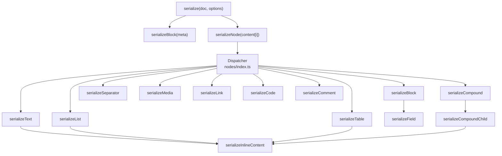
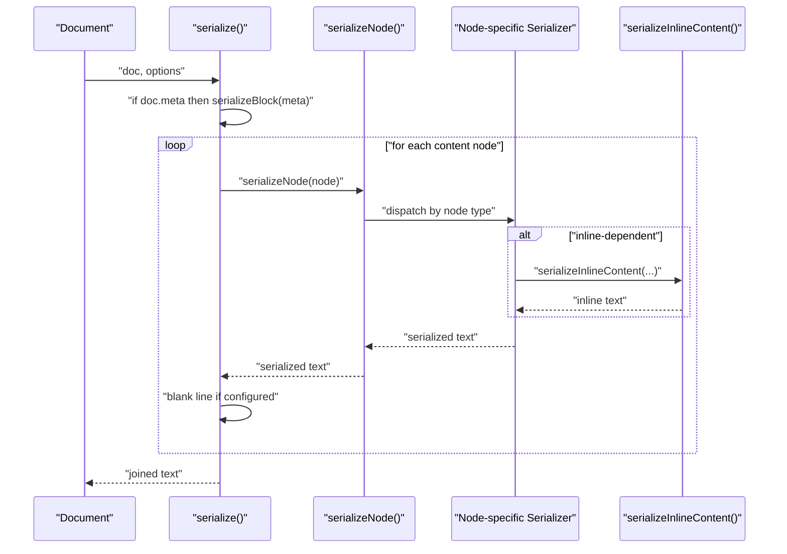
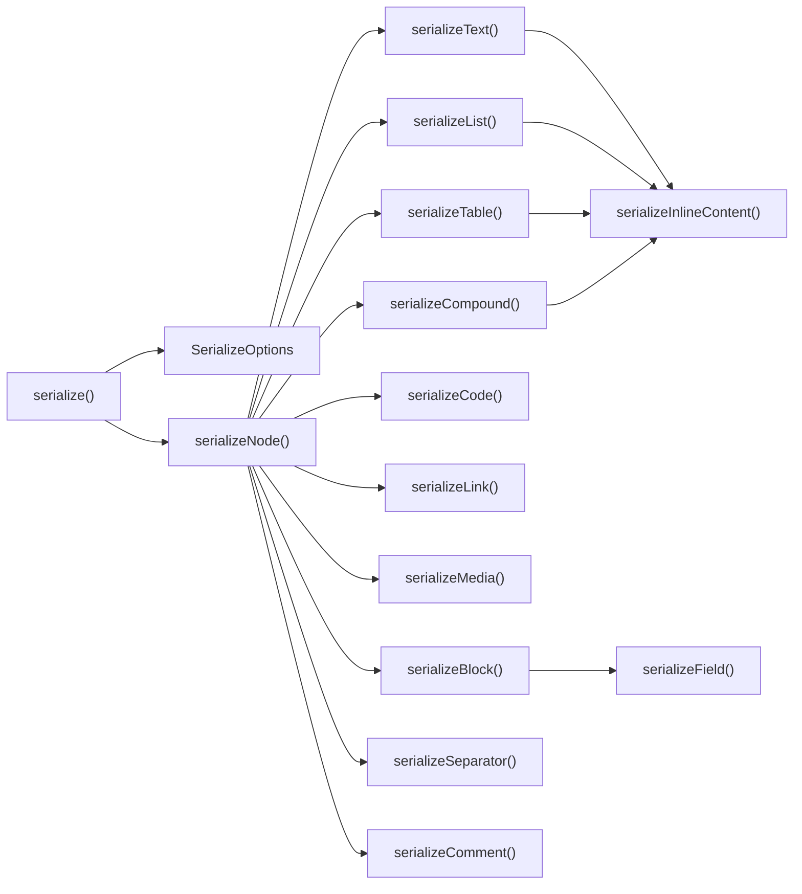

# Node Serializers

<cite>
**Referenced Files in This Document**
- [index.ts](file://artoon-serializer/src/index.ts)
- [types.ts](file://artoon-serializer/src/types.ts)
- [nodes/index.ts](file://artoon-serializer/src/nodes/index.ts)
- [nodes/block.ts](file://artoon-serializer/src/nodes/block.ts)
- [nodes/code.ts](file://artoon-serializer/src/nodes/code.ts)
- [nodes/list.ts](file://artoon-serializer/src/nodes/list.ts)
- [nodes/table.ts](file://artoon-serializer/src/nodes/table.ts)
- [nodes/text.ts](file://artoon-serializer/src/nodes/text.ts)
- [nodes/separator.ts](file://artoon-serializer/src/nodes/separator.ts)
- [nodes/comment.ts](file://artoon-serializer/src/nodes/comment.ts)
- [nodes/link.ts](file://artoon-serializer/src/nodes/link.ts)
- [nodes/media.ts](file://artoon-serializer/src/nodes/media.ts)
- [nodes/compound.ts](file://artoon-serializer/src/nodes/compound.ts)
- [inline/index.ts](file://artoon-serializer/src/inline/index.ts)
- [inline/content.ts](file://artoon-serializer/src/inline/content.ts)
</cite>

## Table of Contents
1. [Introduction](#introduction)
2. [Project Structure](#project-structure)
3. [Core Components](#core-components)
4. [Architecture Overview](#architecture-overview)
5. [Detailed Component Analysis](#detailed-component-analysis)
6. [Dependency Analysis](#dependency-analysis)
7. [Performance Considerations](#performance-considerations)
8. [Troubleshooting Guide](#troubleshooting-guide)
9. [Conclusion](#conclusion)

## Introduction
This document provides comprehensive documentation for all node serializers in the ARTOON Serializer package. It explains how each node type is serialized, including formatting rules, indentation handling, content structure, and how nested content, attributes, and formatting options are handled. Special cases such as empty content, direction markers, and formatting preservation are covered. The document also describes the relationship between different node types and their serialization order.

## Project Structure
The ARTOON Serializer converts an ARTOON AST into human-readable ARTOON text. The main entry point orchestrates META block handling and iterates over content nodes, delegating to specific serializers via a dispatcher. Inline content is handled separately and embedded within block and text serializers.

**Diagram sources**
- [index.ts:17-59](file://artoon-serializer/src/index.ts#L17-L59)
- [nodes/index.ts:32-78](file://artoon-serializer/src/nodes/index.ts#L32-L78)
- [inline/content.ts:8-21](file://artoon-serializer/src/inline/content.ts#L8-L21)

**Section sources**
- [index.ts:17-59](file://artoon-serializer/src/index.ts#L17-L59)
- [nodes/index.ts:32-78](file://artoon-serializer/src/nodes/index.ts#L32-L78)

## Core Components
- serialize(doc, options): Top-level serializer that handles META blocks and iterates content nodes. Supports options for line endings, blank lines between elements, and comment preservation.
- serializeNode(node, options): Dispatches to the appropriate serializer based on node type.
- serializeInlineContent(items): Serializes inline content arrays into a single string, embedding inline components and plain text.

Key behaviors:
- Direction markers: All serializers use direction-aware markers derived from the getDirectionMarker helper.
- Blank lines: Controlled by options.blankLinesBetween; inserted between content nodes except after META when applicable.
- Comments: Controlled by options.preserveComments; comments are skipped during serialization unless enabled.

**Section sources**
- [index.ts:17-59](file://artoon-serializer/src/index.ts#L17-L59)
- [types.ts:6-24](file://artoon-serializer/src/types.ts#L6-L24)
- [types.ts:29-31](file://artoon-serializer/src/types.ts#L29-L31)
- [nodes/index.ts:32-78](file://artoon-serializer/src/nodes/index.ts#L32-L78)
- [inline/index.ts:1-4](file://artoon-serializer/src/inline/index.ts#L1-L4)
- [inline/content.ts:8-21](file://artoon-serializer/src/inline/content.ts#L8-L21)

## Architecture Overview
The serializer pipeline follows a clear separation of concerns:
- Document-level orchestration: serialize handles META and content iteration.
- Node dispatch: serializeNode routes to specialized serializers.
- Inline composition: serializeInlineContent composes inline components and plain text.
- Formatting and direction: Direction markers and line endings are consistently applied.

**Diagram sources**
- [index.ts:17-59](file://artoon-serializer/src/index.ts#L17-L59)
- [nodes/index.ts:32-78](file://artoon-serializer/src/nodes/index.ts#L32-L78)
- [inline/content.ts:8-21](file://artoon-serializer/src/inline/content.ts#L8-L21)

## Detailed Component Analysis

### Text Nodes
- Purpose: Serialize paragraph-like and heading-like text blocks.
- Output pattern: Direction marker, text type, and inline content separated by ::.
- Behavior:
  - Uses direction marker derived from node.direction.
  - Emits inline content via serializeInlineContent.
  - No extra blank lines are injected by the serializer itself.

Formatting rules:
- Single-line output per text node.
- Direction marker placement at the start.

Edge cases:
- Empty inline content: Serialized as an empty string segment; consumers should handle visibility.
- Direction: Left-to-right or right-to-left affects the leading marker.

**Section sources**
- [nodes/text.ts:12-18](file://artoon-serializer/src/nodes/text.ts#L12-L18)
- [inline/content.ts:8-21](file://artoon-serializer/src/inline/content.ts#L8-L21)
- [types.ts:29-31](file://artoon-serializer/src/types.ts#L29-L31)

### List Nodes
- Purpose: Serialize unordered, ordered, and description lists.
- Output pattern: One line per list item with depth indicated by dashes and the item’s list type.
- Behavior:
  - Iterates items and recursively serializes nested children with increased depth.
  - Uses direction marker and item-level listType when available, otherwise falls back to parent listType.
  - Inline content is serialized per item.

Formatting rules:
- Depth is indicated by a dash prefix per nesting level.
- Each item is emitted on its own line.

Edge cases:
- Mixed list types: Item-level listType overrides parent type for that item.
- Empty items: Serialized as empty inline content; downstream consumers decide rendering.

**Section sources**
- [nodes/list.ts:17-58](file://artoon-serializer/src/nodes/list.ts#L17-L58)
- [inline/content.ts:8-21](file://artoon-serializer/src/inline/content.ts#L8-L21)
- [types.ts:29-31](file://artoon-serializer/src/types.ts#L29-L31)

### Table Nodes
- Purpose: Serialize tabular content with optional headers.
- Output pattern: Container line followed by header rows and data rows.
- Behavior:
  - Emits a table container line with direction marker.
  - Serializes headers and rows using a shared row serializer.
  - Cells are serialized as inline content.

Formatting rules:
- Header rows use th::; data rows use tr::.
- Cell values are joined with semicolon separators.

Edge cases:
- Missing headers: Omitted when not present.
- Direction: Applied to the table container line.

**Section sources**
- [nodes/table.ts:16-55](file://artoon-serializer/src/nodes/table.ts#L16-L55)
- [inline/content.ts:8-21](file://artoon-serializer/src/inline/content.ts#L8-L21)
- [types.ts:29-31](file://artoon-serializer/src/types.ts#L29-L31)

### Block Nodes
- Purpose: Serialize code blocks, meta blocks, and custom blocks.
- Output pattern: Start line, content, end line.
- Behavior:
  - Start line includes block name and optional language.
  - Code blocks emit raw content as-is.
  - Meta blocks emit only fields (hidden fields) and ignore content.
  - Custom blocks emit fields followed by content when present.

Formatting rules:
- Hidden fields are emitted with direction markers and a standardized prefix.
- End line mirrors the start line with reversed angle brackets.

Edge cases:
- Empty content: Code blocks with empty content produce an empty line between start and end; custom blocks omit empty content lines.
- Language: Present in start line for code and custom blocks.

**Section sources**
- [nodes/block.ts:15-70](file://artoon-serializer/src/nodes/block.ts#L15-L70)

### Compound Nodes
- Purpose: Serialize composite structures like figures and details.
- Output pattern:
  - Figure: Container line followed by child elements indented with a dash prefix.
  - Details: Container line with inline summary, followed by child content.
- Behavior:
  - For details: Extracts summary from children with role summary; content children are serialized normally.
  - For figures: Serializes each child with a dash prefix; media and text roles are supported.

Formatting rules:
- Dash prefix indicates nesting level for child elements.
- Media children use a dash prefix and media type; text children use their text type.

Edge cases:
- Missing summary: Emits an empty details container line.
- Mixed children: Non-supported child types are ignored.

**Section sources**
- [nodes/compound.ts:20-82](file://artoon-serializer/src/nodes/compound.ts#L20-L82)

### Separator Nodes
- Purpose: Serialize line breaks, horizontal rules, and soft breaks.
- Output pattern: Direction marker followed by separator type.
- Behavior:
  - Uses a single separatorType; falls back to legacy separators[0] if needed.
  - Does not include :: because separators have no content.

Formatting rules:
- Single-line output without content.

Edge cases:
- Legacy compatibility: Backward-compatible fallback to legacy separators array.

**Section sources**
- [nodes/separator.ts:14-22](file://artoon-serializer/src/nodes/separator.ts#L14-L22)

### Comment Nodes
- Purpose: Serialize comments.
- Output pattern: Direction marker, triple colon, and comment content.
- Behavior:
  - Straightforward emission of comment text.

Formatting rules:
- Single-line output with no content separator.

**Section sources**
- [nodes/comment.ts:11-14](file://artoon-serializer/src/nodes/comment.ts#L11-L14)

### Link Nodes
- Purpose: Serialize links with optional modifiers and text.
- Output pattern: Direction marker, optional modifiers, link type, and value.
- Behavior:
  - Value is constructed from URL and optional text, separated by semicolon.
  - Modifiers are joined with plus signs and included in square brackets.

Formatting rules:
- Simple link: dir.a:: url; text
- With modifiers: dir.[mod1+mod2+a:: url; text]

Edge cases:
- Missing text: Only URL is emitted.
- Empty modifiers: Emits simple link form.

**Section sources**
- [nodes/link.ts:12-30](file://artoon-serializer/src/nodes/link.ts#L12-L30)

### Media Nodes
- Purpose: Serialize images, videos, audio, and files.
- Output pattern: Direction marker, media type, and value parts.
- Behavior:
  - Value parts vary by media type: path; alt; title for images; path; title for video/audio; path; label for files.

Formatting rules:
- Semicolon-separated parts.
- Optional parts omitted when missing.

Edge cases:
- Missing optional fields: Only required parts are emitted.

**Section sources**
- [nodes/media.ts:15-36](file://artoon-serializer/src/nodes/media.ts#L15-L36)

### Inline Code Nodes
- Purpose: Serialize inline code with optional language.
- Output pattern: Direction marker, inline code component with optional language.
- Behavior:
  - Code value and optional language are joined with a semicolon inside the component.

Formatting rules:
- Single inline component with code content.

Edge cases:
- Missing language: Emits only the code value.

**Section sources**
- [nodes/code.ts:11-20](file://artoon-serializer/src/nodes/code.ts#L11-L20)

### Inline Content Composition
- Purpose: Compose inline content arrays into a single string.
- Behavior:
  - Iterates inline items; plain text is emitted as-is.
  - Inline components are emitted as bracketed constructs with modifiers and attributes.

Formatting rules:
- Modifiers are joined with plus signs; component type is appended if present.
- Component values are built from attributes or fallback values depending on component type.

Edge cases:
- Empty arrays: Produce empty string.
- Unsupported components: Fallback to value if present.

**Section sources**
- [inline/content.ts:8-21](file://artoon-serializer/src/inline/content.ts#L8-L21)
- [inline/content.ts:26-48](file://artoon-serializer/src/inline/content.ts#L26-L48)
- [inline/content.ts:53-114](file://artoon-serializer/src/inline/content.ts#L53-L114)

## Dependency Analysis
The serializer relies on a small set of core dependencies:
- Direction marker derivation from options.
- Inline content composition for nodes that embed inline markup.
- Node-type checks from the AST module to route serialization.

**Diagram sources**
- [index.ts:17-59](file://artoon-serializer/src/index.ts#L17-L59)
- [nodes/index.ts:32-78](file://artoon-serializer/src/nodes/index.ts#L32-L78)
- [inline/content.ts:8-21](file://artoon-serializer/src/inline/content.ts#L8-L21)
- [nodes/block.ts:67-70](file://artoon-serializer/src/nodes/block.ts#L67-L70)

**Section sources**
- [nodes/index.ts:3-27](file://artoon-serializer/src/nodes/index.ts#L3-L27)
- [types.ts:6-24](file://artoon-serializer/src/types.ts#L6-L24)

## Performance Considerations
- Linear pass over content nodes: serialize iterates content once, making it O(n) in the number of top-level nodes.
- Inline composition: serializeInlineContent concatenates items; complexity is O(m) where m is the total number of inline items.
- Recursion depth: serializeListItem recurses per nesting level; worst-case depth equals the maximum nesting in lists.
- Memory: Lines arrays are used per serializer; output is joined once at the end.

Recommendations:
- Prefer batch processing for very large documents to minimize intermediate allocations.
- Avoid excessive nesting in lists and compounds to keep recursion manageable.

## Troubleshooting Guide
Common issues and resolutions:
- Unexpected blank lines:
  - Verify options.blankLinesBetween; it inserts blank lines between content nodes.
- Comments not appearing:
  - Ensure options.preserveComments is true; comments are skipped otherwise.
- Direction marker mismatch:
  - Confirm node.direction is set correctly; direction markers are derived from getDirectionMarker.
- Inline content not rendering:
  - Check that serializeInlineContent receives a non-empty array; empty arrays produce empty strings.
- Code block formatting:
  - Code blocks emit raw content; ensure content is properly formatted before serialization.
- Link and media attributes:
  - Ensure required attributes are present (e.g., URL for links, path for media); missing values may lead to empty segments.

**Section sources**
- [index.ts:44-46](file://artoon-serializer/src/index.ts#L44-L46)
- [types.ts:20-24](file://artoon-serializer/src/types.ts#L20-L24)
- [inline/content.ts:8-21](file://artoon-serializer/src/inline/content.ts#L8-L21)

## Conclusion
The ARTOON Serializer provides a robust, extensible pipeline for converting AST nodes into ARTOON text. Each serializer adheres to consistent formatting rules, direction-aware markers, and inline composition. Understanding the dispatch mechanism, inline handling, and option-driven behaviors enables predictable and maintainable serialization across diverse document structures.