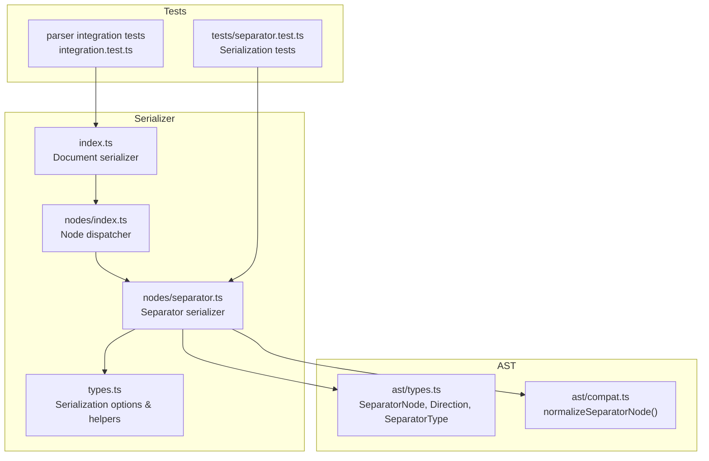
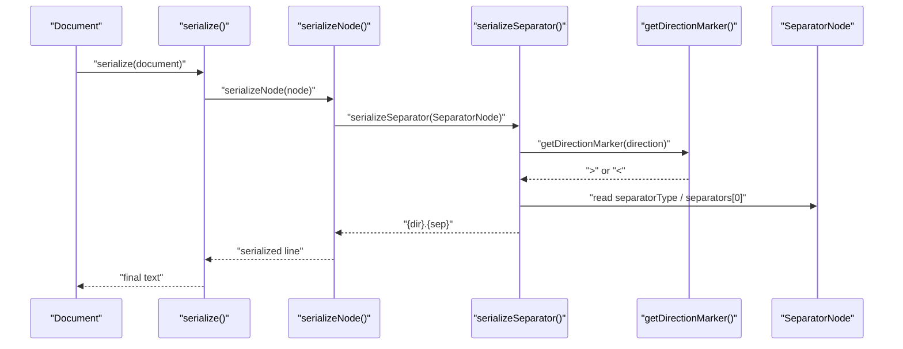
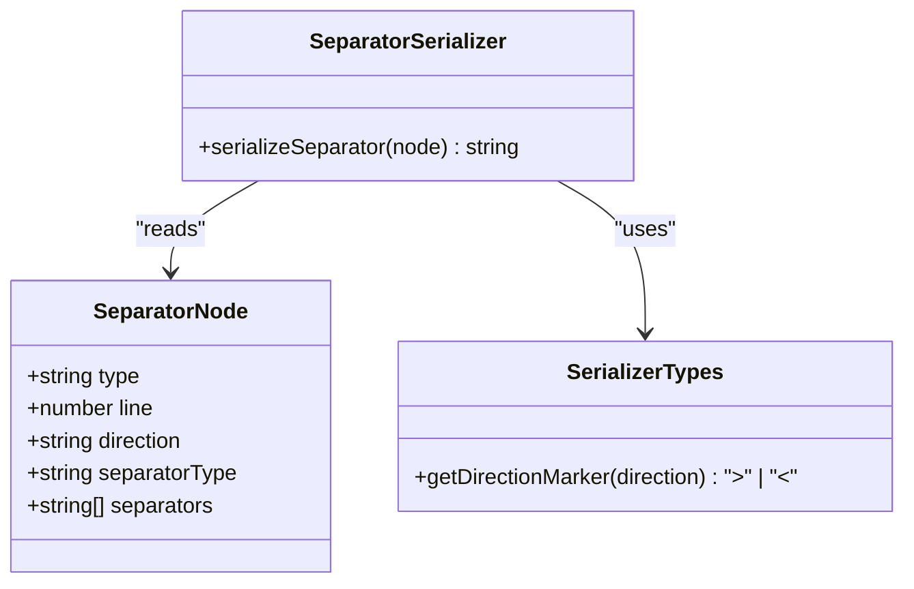
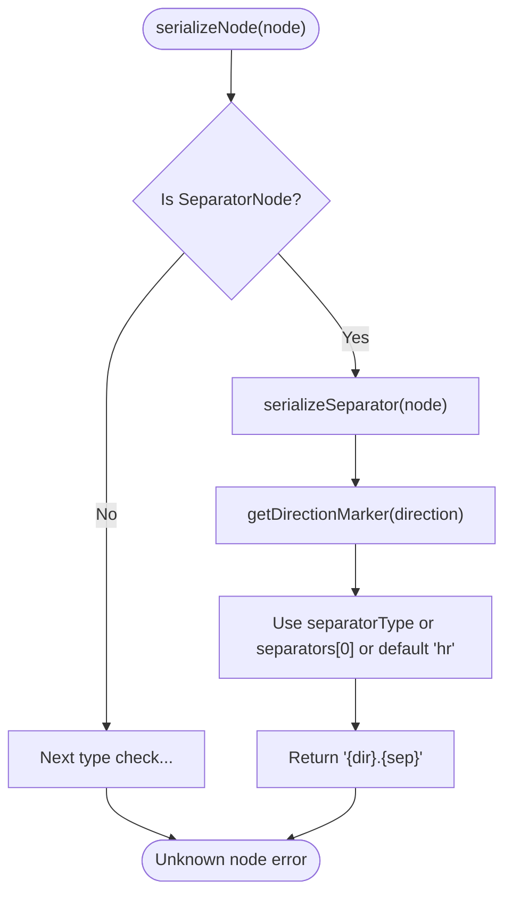
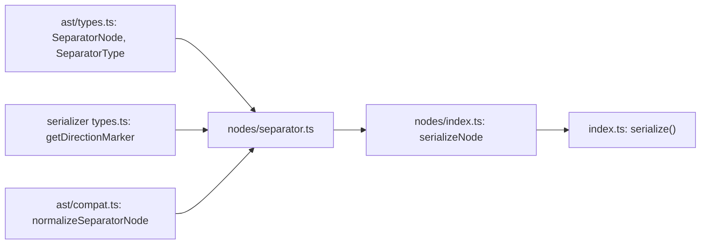

# Separator Serializer

<cite>
**Referenced Files in This Document**
- [separator.ts](file://artoon-serializer/src/nodes/separator.ts)
- [index.ts](file://artoon-serializer/src/nodes/index.ts)
- [index.ts](file://artoon-serializer/src/index.ts)
- [types.ts](file://artoon-serializer/src/types.ts)
- [types.ts](file://artoon-ast/src/types.ts)
- [compat.ts](file://artoon-ast/src/compat.ts)
- [separator.test.ts](file://artoon-serializer/tests/separator.test.ts)
- [integration.test.ts](file://artoon-parser/tests/integration.test.ts)
- [block.ts](file://artoon-serializer/src/nodes/block.ts)
- [text.ts](file://artoon-serializer/src/nodes/text.ts)
</cite>

## Table of Contents
1. [Introduction](#introduction)
2. [Project Structure](#project-structure)
3. [Core Components](#core-components)
4. [Architecture Overview](#architecture-overview)
5. [Detailed Component Analysis](#detailed-component-analysis)
6. [Dependency Analysis](#dependency-analysis)
7. [Performance Considerations](#performance-considerations)
8. [Troubleshooting Guide](#troubleshooting-guide)
9. [Conclusion](#conclusion)

## Introduction
This document explains the serialization of separator nodes in the ARTOON system. It covers the syntax and formatting rules for horizontal dividers and section breaks, how separators are represented in serialized output, and their role in document structure. It also details handling of different separator types, visual representation semantics, examples of serialization, positioning within documents, integration with surrounding content, and edge cases such as multiple consecutive separators and placement rules.

## Project Structure
The separator serialization logic is implemented in the serializer module and integrates with the AST types and compatibility layer. The key files involved are:
- Serializer node dispatcher and separator serializer
- AST types defining separator node structure
- Compatibility utilities for legacy separator formats
- Parser integration tests validating separator parsing and serialization
- Serializer tests validating serialization outputs

**Diagram sources**
- [index.ts:32-78](file://artoon-serializer/src/nodes/index.ts#L32-L78)
- [separator.ts:14-22](file://artoon-serializer/src/nodes/separator.ts#L14-L22)
- [types.ts:6-31](file://artoon-serializer/src/types.ts#L6-L31)
- [index.ts:17-59](file://artoon-serializer/src/index.ts#L17-L59)
- [types.ts:150-165](file://artoon-ast/src/types.ts#L150-L165)
- [compat.ts:106-118](file://artoon-ast/src/compat.ts#L106-L118)
- [separator.test.ts:6-51](file://artoon-serializer/tests/separator.test.ts#L6-L51)
- [integration.test.ts:204-224](file://artoon-parser/tests/integration.test.ts#L204-L224)

**Section sources**
- [index.ts:1-91](file://artoon-serializer/src/nodes/index.ts#L1-L91)
- [separator.ts:1-23](file://artoon-serializer/src/nodes/separator.ts#L1-L23)
- [types.ts:1-32](file://artoon-serializer/src/types.ts#L1-L32)
- [index.ts:1-95](file://artoon-serializer/src/index.ts#L1-L95)
- [types.ts:1-539](file://artoon-ast/src/types.ts#L1-L539)
- [compat.ts:96-125](file://artoon-ast/src/compat.ts#L96-L125)
- [separator.test.ts:1-52](file://artoon-serializer/tests/separator.test.ts#L1-L52)
- [integration.test.ts:204-224](file://artoon-parser/tests/integration.test.ts#L204-L224)

## Core Components
- Separator serializer: Converts a SeparatorNode into a compact ARTOON syntax line representing direction and separator type.
- Node dispatcher: Routes content nodes to their respective serializers; includes a dedicated branch for separators.
- AST types: Define the SeparatorNode contract, including direction, separator type, and deprecation of the legacy separators array.
- Compatibility layer: Normalizes legacy nodes with a separators array into the modern separatorType format.
- Serialization options: Control line endings, blank-line spacing, and comment preservation.

Key responsibilities:
- Serialize separators as directional markers followed by a dot and separator type.
- Support legacy separators array for backward compatibility.
- Integrate seamlessly with document serialization and node dispatching.

**Section sources**
- [separator.ts:6-22](file://artoon-serializer/src/nodes/separator.ts#L6-L22)
- [index.ts:68-70](file://artoon-serializer/src/nodes/index.ts#L68-L70)
- [types.ts:150-165](file://artoon-ast/src/types.ts#L150-L165)
- [compat.ts:106-118](file://artoon-ast/src/compat.ts#L106-L118)
- [types.ts:6-31](file://artoon-serializer/src/types.ts#L6-L31)

## Architecture Overview
The separator serialization pipeline connects the AST, serializer dispatcher, and serializer implementation, while respecting directionality and legacy compatibility.

**Diagram sources**
- [index.ts:17-59](file://artoon-serializer/src/index.ts#L17-L59)
- [index.ts:32-78](file://artoon-serializer/src/nodes/index.ts#L32-L78)
- [separator.ts:14-22](file://artoon-serializer/src/nodes/separator.ts#L14-L22)
- [types.ts:29-31](file://artoon-serializer/src/types.ts#L29-L31)
- [types.ts:150-165](file://artoon-ast/src/types.ts#L150-L165)

## Detailed Component Analysis

### Separator Syntax and Formatting Rules
- Output format: A direction marker followed by a dot and the separator type.
- Direction marker: '>' for RTL, '<' for LTR.
- Separator types: 'br' (line break), 'hr' (horizontal rule), 'wbr' (word break).
- No content follows the separator; therefore, it does not use the typical '::' content delimiter.

Behavioral notes:
- The serializer prefers the modern separatorType field; if absent, it falls back to the legacy separators array's first element.
- If neither is present, it defaults to 'hr'.

**Section sources**
- [separator.ts:6-22](file://artoon-serializer/src/nodes/separator.ts#L6-L22)
- [types.ts:29-31](file://artoon-serializer/src/types.ts#L29-L31)
- [types.ts:59-61](file://artoon-ast/src/types.ts#L59-L61)

### Serialized Representation and Document Role
- Serialized form: "{dir}.{sep}".
- Role in document structure:
  - Acts as a structural break or divider within content.
  - Integrates with blank-line spacing rules during document serialization.
  - Supports both RTL and LTR contexts via direction markers.

Integration points:
- Document serializer adds blank lines between elements when configured.
- Comments are preserved or omitted according to options; separators are unaffected by comment settings.

**Section sources**
- [index.ts:32-56](file://artoon-serializer/src/index.ts#L32-L56)
- [types.ts:6-24](file://artoon-serializer/src/types.ts#L6-L24)

### Handling Different Separator Types
- br: Line break.
- hr: Horizontal rule/divider.
- wbr: Word break (soft hyphen-like behavior).

Examples validated by tests:
- RTL line break: '>.br'
- RTL horizontal rule: '>.hr'
- LTR word break: '<.wbr'

Backward compatibility:
- Legacy nodes with separators array are normalized to use separatorType.

**Section sources**
- [separator.test.ts:7-38](file://artoon-serializer/tests/separator.test.ts#L7-L38)
- [compat.ts:106-118](file://artoon-ast/src/compat.ts#L106-L118)

### Visual Representation Semantics
- br: Typically renders as a line break in block contexts.
- hr: Typically renders as a thematic break or horizontal divider.
- wbr: Typically renders as a word-breaking opportunity without inserting visible glyphs.

Note: The serializer produces the canonical ARTOON syntax; rendering differences are handled by downstream renderers.

**Section sources**
- [separator.ts:6-10](file://artoon-serializer/src/nodes/separator.ts#L6-L10)

### Examples of Separator Serialization
- Single separator:
  - RTL line break: '>.br'
  - LTR word break: '<.wbr'
- Combined separators (multiple nodes):
  - Parser accepts sequences like '>.br;hr;br' and creates multiple SeparatorNode instances.

Positioning within documents:
- Placed among other content nodes; blank lines are inserted around separators per configuration.

Integration with surrounding content:
- Adjacent text or block nodes are separated by blank lines when enabled.
- Meta blocks are serialized before content and may be followed by a blank line depending on configuration.

**Section sources**
- [separator.test.ts:40-50](file://artoon-serializer/tests/separator.test.ts#L40-L50)
- [integration.test.ts:213-222](file://artoon-parser/tests/integration.test.ts#L213-L222)
- [index.ts:32-56](file://artoon-serializer/src/index.ts#L32-L56)

### Edge Cases and Placement Rules
- Multiple consecutive separators:
  - Each separator is serialized independently as a separate node.
  - Parser integration tests demonstrate that '>.br;hr;br' yields three distinct SeparatorNode instances.
- Placement rules:
  - Separators can appear anywhere within the document content array.
  - Blank-line spacing is applied between adjacent content nodes, including separators.
- Legacy format handling:
  - Nodes with separators array are normalized to separatorType for consistent serialization.

**Section sources**
- [integration.test.ts:213-222](file://artoon-parser/tests/integration.test.ts#L213-L222)
- [compat.ts:106-118](file://artoon-ast/src/compat.ts#L106-L118)
- [index.ts:32-56](file://artoon-serializer/src/index.ts#L32-L56)

### Class and Flow Analysis

#### Separator Serializer Implementation

**Diagram sources**
- [types.ts:150-165](file://artoon-ast/src/types.ts#L150-L165)
- [types.ts:29-31](file://artoon-serializer/src/types.ts#L29-L31)
- [separator.ts:14-22](file://artoon-serializer/src/nodes/separator.ts#L14-L22)

#### Node Dispatch Flow for Separators

**Diagram sources**
- [index.ts:32-78](file://artoon-serializer/src/nodes/index.ts#L32-L78)
- [separator.ts:14-22](file://artoon-serializer/src/nodes/separator.ts#L14-L22)
- [types.ts:29-31](file://artoon-serializer/src/types.ts#L29-L31)

## Dependency Analysis
- Separator serializer depends on:
  - AST types for SeparatorNode shape and SeparatorType enumeration.
  - Serialization helpers for direction markers.
  - Compatibility utilities for legacy nodes.
- Node dispatcher routes content to serializers; separators are handled explicitly.
- Document serializer orchestrates blank-line spacing and comment handling around separators.

**Diagram sources**
- [types.ts:150-165](file://artoon-ast/src/types.ts#L150-L165)
- [types.ts:29-31](file://artoon-serializer/src/types.ts#L29-L31)
- [compat.ts:106-118](file://artoon-ast/src/compat.ts#L106-L118)
- [separator.ts:14-22](file://artoon-serializer/src/nodes/separator.ts#L14-L22)
- [index.ts:32-78](file://artoon-serializer/src/nodes/index.ts#L32-L78)
- [index.ts:17-59](file://artoon-serializer/src/index.ts#L17-L59)

**Section sources**
- [types.ts:150-165](file://artoon-ast/src/types.ts#L150-L165)
- [types.ts:29-31](file://artoon-serializer/src/types.ts#L29-L31)
- [compat.ts:106-118](file://artoon-ast/src/compat.ts#L106-L118)
- [separator.ts:14-22](file://artoon-serializer/src/nodes/separator.ts#L14-L22)
- [index.ts:32-78](file://artoon-serializer/src/nodes/index.ts#L32-L78)
- [index.ts:17-59](file://artoon-serializer/src/index.ts#L17-L59)

## Performance Considerations
- Separator serialization is O(1) with minimal allocations.
- Direction marker lookup is constant-time.
- Backward compatibility fallback adds negligible overhead.
- Document-level blank-line insertion is linear in content length; separators count as content nodes.

## Troubleshooting Guide
Common issues and resolutions:
- Unexpected default separator:
  - Cause: Missing separatorType and empty legacy separators array.
  - Resolution: Ensure separatorType is set or provide a non-empty separators array.
- Mixed legacy/new nodes:
  - Symptom: Some nodes lack separatorType.
  - Resolution: Normalize legacy nodes using the compatibility utility before serialization.
- Incorrect direction marker:
  - Symptom: Wrong visual alignment in output.
  - Resolution: Verify node.direction is set correctly ('rtl' or 'ltr').
- Parser integration mismatch:
  - Symptom: Combined separators not parsed as multiple nodes.
  - Resolution: Confirm parser integration tests pass and that combined syntax is supported.

Validation references:
- Serialization tests confirm expected outputs for br/hr/wbr.
- Parser integration tests confirm combined separators produce multiple nodes.
- AST compatibility tests confirm normalization behavior.

**Section sources**
- [separator.test.ts:7-50](file://artoon-serializer/tests/separator.test.ts#L7-L50)
- [integration.test.ts:204-224](file://artoon-parser/tests/integration.test.ts#L204-L224)
- [compat.ts:106-118](file://artoon-ast/src/compat.ts#L106-L118)

## Conclusion
The separator serializer provides a concise, direction-aware representation of structural breaks in ARTOON documents. It supports the modern separatorType field and gracefully handles legacy nodes. Its integration with the node dispatcher and document serializer ensures consistent placement and formatting within larger documents, while tests validate expected behavior across separator types and combined usage scenarios.