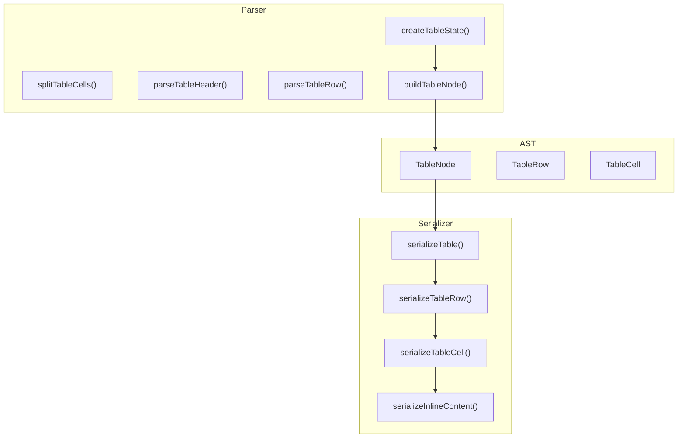
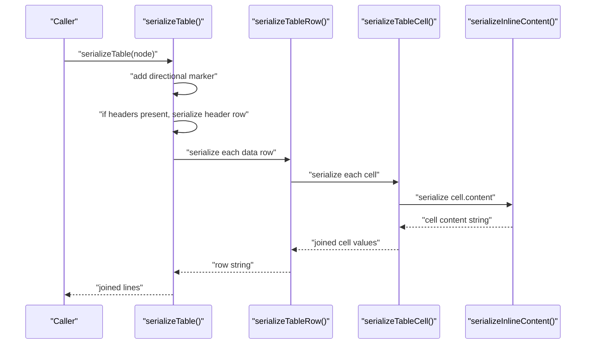
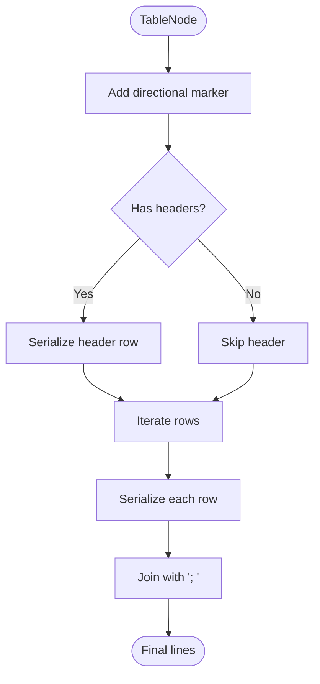
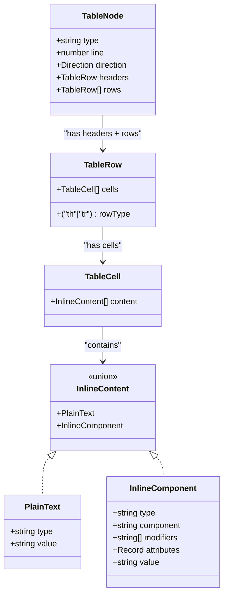
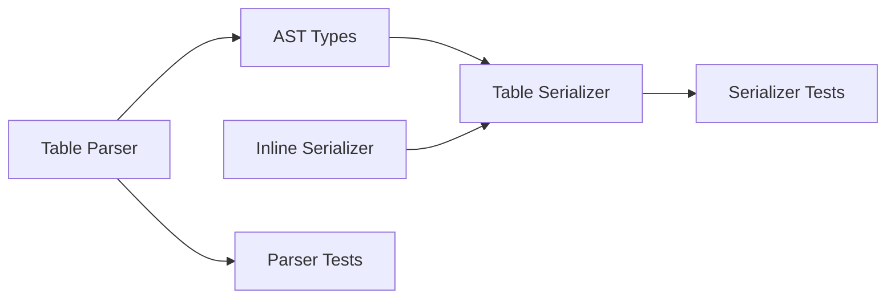

# Table Serializer

<cite>
**Referenced Files in This Document**
- [table.ts](file://artoon-serializer/src/nodes/table.ts)
- [content.ts](file://artoon-serializer/src/inline/content.ts)
- [types.ts](file://artoon-serializer/src/types.ts)
- [table.test.ts](file://artoon-serializer/tests/table.test.ts)
- [index.ts](file://artoon-parser/src/table/index.ts)
- [table.test.ts](file://artoon-parser/tests/table.test.ts)
- [types.ts](file://artoon-ast/src/types.ts)
- [05-TABLES.md](file://Core Invariants/05-TABLES.md)
</cite>

## Table of Contents
1. [Introduction](#introduction)
2. [Project Structure](#project-structure)
3. [Core Components](#core-components)
4. [Architecture Overview](#architecture-overview)
5. [Detailed Component Analysis](#detailed-component-analysis)
6. [Dependency Analysis](#dependency-analysis)
7. [Performance Considerations](#performance-considerations)
8. [Troubleshooting Guide](#troubleshooting-guide)
9. [Conclusion](#conclusion)

## Introduction
This document explains how table nodes are serialized in the ARTOON system. It covers the table syntax, structure formatting, cell separation, row handling, header management, inline content serialization inside cells, and how different formats are preserved. It also documents cell content escaping and whitespace handling, and provides examples of serializing various configurations, including empty cells, missing headers, and inline components within cells.

## Project Structure
The table serialization pipeline spans three layers:
- Parser: constructs a canonical TableNode from raw table text.
- AST: defines the canonical TableNode, TableRow, and TableCell types.
- Serializer: converts a TableNode back into ARTOON table syntax.

**Diagram sources**
- [index.ts:21-140](file://artoon-parser/src/table/index.ts#L21-L140)
- [types.ts:225-245](file://artoon-ast/src/types.ts#L225-L245)
- [table.ts:16-55](file://artoon-serializer/src/nodes/table.ts#L16-L55)
- [content.ts:8-115](file://artoon-serializer/src/inline/content.ts#L8-L115)

**Section sources**
- [index.ts:1-169](file://artoon-parser/src/table/index.ts#L1-L169)
- [types.ts:225-245](file://artoon-ast/src/types.ts#L225-L245)
- [table.ts:1-56](file://artoon-serializer/src/nodes/table.ts#L1-L56)
- [content.ts:1-115](file://artoon-serializer/src/inline/content.ts#L1-L115)

## Core Components
- Table serializer: Converts a TableNode into ARTOON syntax with directional markers, optional header row, and rows of cells.
- Inline serializer: Serializes cell content, including plain text and inline components, preserving component syntax and attributes.
- Parser utilities: Split cells respecting nested bracket contexts, validate column counts, and construct a canonical TableNode.

Key behaviors:
- Directional marker precedes the table container.
- Header row (th) is optional; if absent, the first data row determines column count.
- Cell separation uses semicolon-space delimiters.
- Whitespace around cell content is preserved via trim during parsing; serializer emits original inline content.

**Section sources**
- [table.ts:16-55](file://artoon-serializer/src/nodes/table.ts#L16-L55)
- [content.ts:8-115](file://artoon-serializer/src/inline/content.ts#L8-L115)
- [index.ts:100-127](file://artoon-parser/src/table/index.ts#L100-L127)
- [types.ts:225-245](file://artoon-ast/src/types.ts#L225-L245)

## Architecture Overview
The serialization flow for a table node:

**Diagram sources**
- [table.ts:16-55](file://artoon-serializer/src/nodes/table.ts#L16-L55)
- [content.ts:8-115](file://artoon-serializer/src/inline/content.ts#L8-L115)

## Detailed Component Analysis

### Table Serialization
- Directional marker: The serializer prepends a directional indicator derived from the node’s direction to the table container line.
- Container line: ".table::" follows the directional marker.
- Header row: If present, the header row is serialized immediately after the container line.
- Data rows: Each TableRow is serialized in order; each row begins with its row type ("th" or "tr") followed by "::" and the serialized cells.
- Cell joining: Cells are joined with "; " (semicolon-space).

Edge cases handled by the serializer:
- Empty headers: If the headers field is absent, the serializer skips the header line.
- No rows: An empty table still prints the container line and optionally the header line if present.

**Section sources**
- [table.ts:16-55](file://artoon-serializer/src/nodes/table.ts#L16-L55)

### Row Serialization
- Row type: Determined by the row’s rowType field.
- Cell serialization: Each cell’s content is serialized via the inline serializer and joined with "; ".

**Section sources**
- [table.ts:43-48](file://artoon-serializer/src/nodes/table.ts#L43-L48)

### Cell Serialization
- Cell content: Serialized using the inline serializer, which handles plain text and inline components.
- No extra wrapping: Cells are emitted as-is; the serializer does not add quotes or escape characters beyond what the inline serializer produces.

**Section sources**
- [table.ts:53-55](file://artoon-serializer/src/nodes/table.ts#L53-L55)
- [content.ts:8-115](file://artoon-serializer/src/inline/content.ts#L8-L115)

### Inline Content Serialization
- Plain text: Emits the raw value.
- Inline components: Emits bracketed syntax "[type:: value]" or "[mods+type:: params]" depending on presence of modifiers and component type.
- Component-specific formatting:
  - Links: Supports url and text attributes; emits "url; text" when text is present.
  - Images, video, audio, file, time, abbr, code: Emit attribute values separated by "; " or ";".
- Modifiers: Joined with "+" when multiple modifiers are present.

Escaping and whitespace:
- The inline serializer does not add quotes or escapes around content; it preserves the values as provided by the AST.
- Whitespace around parsed cells is trimmed during parsing; serializer emits the inline content as stored in the AST.

**Section sources**
- [content.ts:8-115](file://artoon-serializer/src/inline/content.ts#L8-L115)
- [types.ts:104-118](file://artoon-ast/src/types.ts#L104-L118)

### Parser Behavior That Impacts Serialization
- Cell splitting: Splits on ";" while respecting bracket depth to avoid splitting inside inline components.
- Column count validation: Ensures rows match the header count or the first data row’s count.
- Duplicate headers: Prevents multiple header rows.
- Empty cells: Preserves empty strings as valid cells.

These rules ensure the serializer receives a canonical TableNode with consistent structure.

**Section sources**
- [index.ts:100-127](file://artoon-parser/src/table/index.ts#L100-L127)
- [index.ts:34-94](file://artoon-parser/src/table/index.ts#L34-L94)
- [table.test.ts:15-39](file://artoon-parser/tests/table.test.ts#L15-L39)
- [table.test.ts:41-96](file://artoon-parser/tests/table.test.ts#L41-L96)

### AST Types for Tables
- TableNode: Contains direction, optional headers row, and an array of data rows.
- TableRow: Has rowType ("th" or "tr") and cells.
- TableCell: Holds an array of inline content.

These types define the contract between parser, AST, and serializer.

**Section sources**
- [types.ts:225-245](file://artoon-ast/src/types.ts#L225-L245)

## Architecture Overview
The end-to-end flow from AST to serialized syntax:

**Diagram sources**
- [table.ts:16-55](file://artoon-serializer/src/nodes/table.ts#L16-L55)

## Detailed Component Analysis

### Class Model for Table Types

**Diagram sources**
- [types.ts:225-245](file://artoon-ast/src/types.ts#L225-L245)
- [types.ts:104-118](file://artoon-ast/src/types.ts#L104-L118)

### Example: Serializing Various Configurations
- Simple table without headers:
  - Container line with directional marker.
  - One or more data rows with "tr::".
- Table with headers:
  - Optional header row with "th::" before data rows.
- Inline content in cells:
  - Modifiers and component syntax preserved.
- Empty cells:
  - Serialized as empty segments between "; ".

See tests for concrete expectations and outputs.

**Section sources**
- [table.test.ts:7-37](file://artoon-serializer/tests/table.test.ts#L7-L37)
- [table.test.ts:39-69](file://artoon-serializer/tests/table.test.ts#L39-L69)
- [table.test.ts:71-105](file://artoon-serializer/tests/table.test.ts#L71-L105)

### Edge Cases and Validation
- Duplicate headers: Parser prevents multiple header rows; serializer expects zero or one header.
- Wrong column count: Parser validates rows against header count; serializer assumes canonical structure.
- Empty cells: Parser preserves empty strings; serializer emits them as empty segments.
- Missing headers: Serializer handles missing headers gracefully by skipping the header line.

**Section sources**
- [index.ts:34-57](file://artoon-parser/src/table/index.ts#L34-L57)
- [index.ts:62-94](file://artoon-parser/src/table/index.ts#L62-L94)
- [table.test.ts:52-60](file://artoon-parser/tests/table.test.ts#L52-L60)
- [table.test.ts:77-86](file://artoon-parser/tests/table.test.ts#L77-L86)

## Dependency Analysis
- Serializer depends on:
  - AST types for TableNode, TableRow, TableCell.
  - Inline serializer for cell content.
  - Direction marker utility for directional indicators.
- Parser depends on:
  - Token stream and state to produce a canonical TableNode.
- Tests validate:
  - Correctness of serialization for simple tables, tables without headers, and inline content.
  - Correctness of parsing for cell splitting, headers, rows, and error conditions.

**Diagram sources**
- [types.ts:225-245](file://artoon-ast/src/types.ts#L225-L245)
- [table.ts:16-55](file://artoon-serializer/src/nodes/table.ts#L16-L55)
- [content.ts:8-115](file://artoon-serializer/src/inline/content.ts#L8-L115)
- [index.ts:100-127](file://artoon-parser/src/table/index.ts#L100-L127)
- [table.test.ts:1-106](file://artoon-serializer/tests/table.test.ts#L1-L106)
- [table.test.ts:1-144](file://artoon-parser/tests/table.test.ts#L1-L144)

**Section sources**
- [types.ts:225-245](file://artoon-ast/src/types.ts#L225-L245)
- [table.ts:16-55](file://artoon-serializer/src/nodes/table.ts#L16-L55)
- [content.ts:8-115](file://artoon-serializer/src/inline/content.ts#L8-L115)
- [index.ts:100-127](file://artoon-parser/src/table/index.ts#L100-L127)
- [table.test.ts:1-106](file://artoon-serializer/tests/table.test.ts#L1-L106)
- [table.test.ts:1-144](file://artoon-parser/tests/table.test.ts#L1-L144)

## Performance Considerations
- Complexity:
  - serializeTable is O(N) over the total number of cells across all rows.
  - serializeTableRow is O(M) per row, where M is the number of cells.
  - serializeInlineContent is O(K) per cell, where K is the number of inline items.
- Memory:
  - Uses arrays to accumulate lines and join at the end; consider streaming for very large tables if needed.
- Whitespace:
  - Trimming occurs during parsing; serializer avoids re-trimming to minimize overhead.

[No sources needed since this section provides general guidance]

## Troubleshooting Guide
Common issues and resolutions:
- Unexpected extra spaces or missing spaces:
  - Ensure cell content is trimmed during parsing; serializer joins with "; " so spacing is controlled by the inline serializer.
- Inline components not rendering:
  - Verify component types and attributes; serializer relies on inline serializer to emit correct bracket syntax.
- Column mismatch errors:
  - Parser enforces column count consistency; ensure header count matches all rows or rely on the first row to set the count.
- Duplicate headers:
  - Parser rejects multiple headers; remove extra header rows.

**Section sources**
- [index.ts:34-94](file://artoon-parser/src/table/index.ts#L34-L94)
- [table.test.ts:52-60](file://artoon-parser/tests/table.test.ts#L52-L60)
- [table.test.ts:77-86](file://artoon-parser/tests/table.test.ts#L77-L86)

## Conclusion
The table serializer produces deterministic ARTOON syntax with directional markers, optional headers, and properly formatted rows and cells. It delegates cell content serialization to the inline serializer, ensuring accurate representation of plain text and inline components. Parser validations guarantee structural integrity, enabling reliable round-trip conversions.