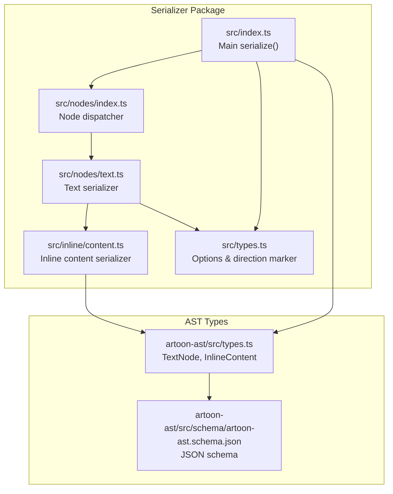
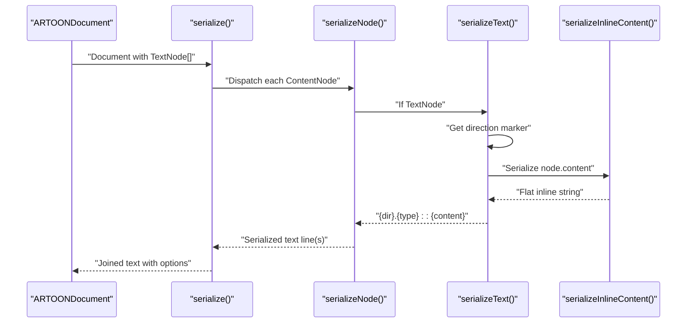
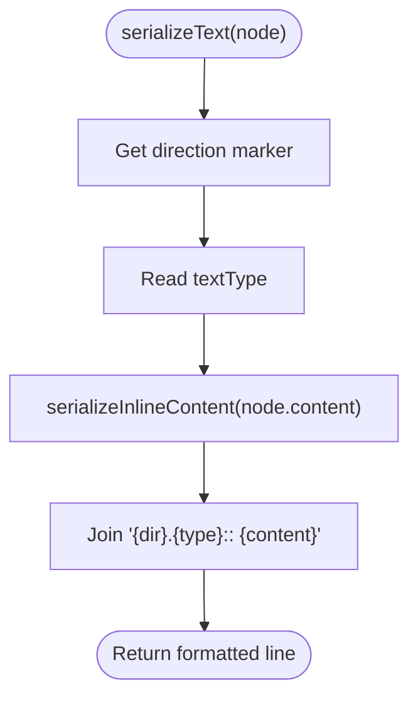
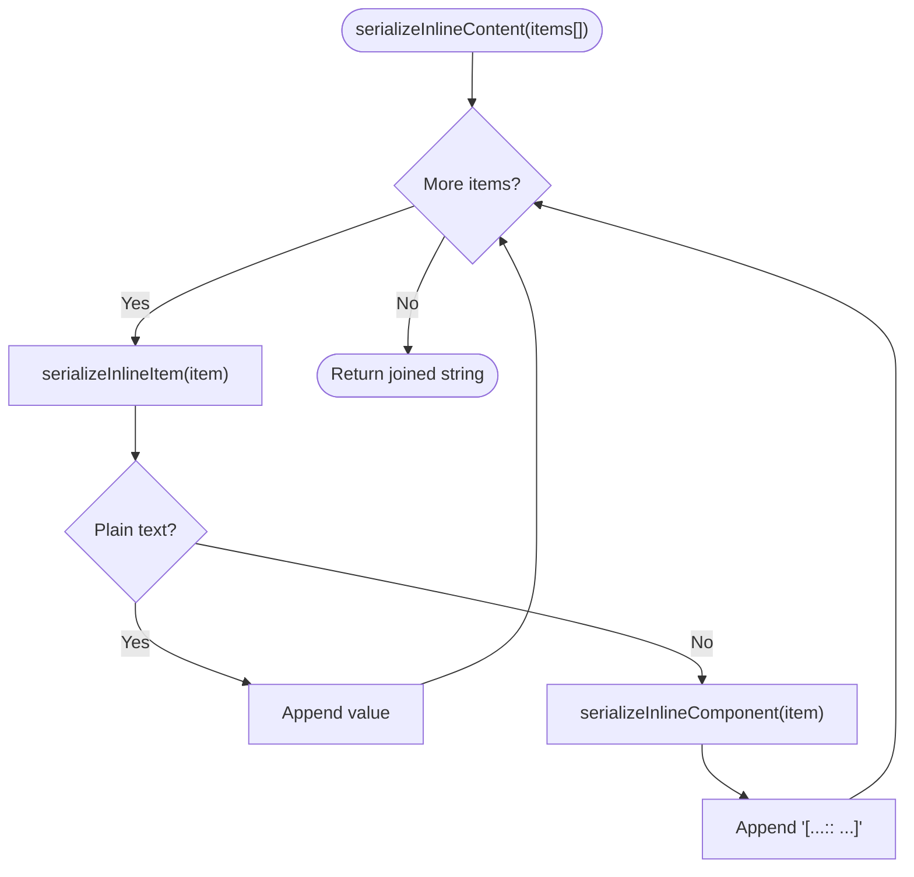
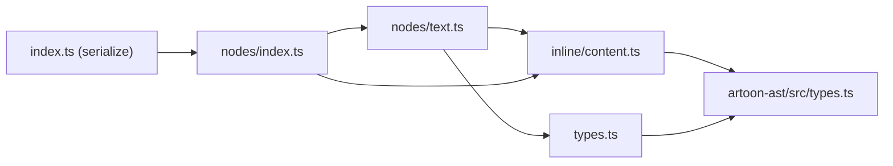

# Text Serializer

<cite>
**Referenced Files in This Document**
- [text.ts](file://artoon-serializer/src/nodes/text.ts)
- [content.ts](file://artoon-serializer/src/inline/content.ts)
- [index.ts](file://artoon-serializer/src/index.ts)
- [types.ts](file://artoon-serializer/src/types.ts)
- [index.ts](file://artoon-serializer/src/nodes/index.ts)
- [text.test.ts](file://artoon-serializer/tests/text.test.ts)
- [inline.test.ts](file://artoon-serializer/tests/inline.test.ts)
- [serialize.test.ts](file://artoon-serializer/tests/serialize.test.ts)
- [types.ts](file://artoon-ast/src/types.ts)
- [ar-toon-ast.schema.json](file://artoon-ast/src/schema/artoon-ast.schema.json)
</cite>

## Table of Contents
1. [Introduction](#introduction)
2. [Project Structure](#project-structure)
3. [Core Components](#core-components)
4. [Architecture Overview](#architecture-overview)
5. [Detailed Component Analysis](#detailed-component-analysis)
6. [Dependency Analysis](#dependency-analysis)
7. [Performance Considerations](#performance-considerations)
8. [Troubleshooting Guide](#troubleshooting-guide)
9. [Conclusion](#conclusion)

## Introduction
This document explains how text node serialization is implemented and how plain text content is preserved during serialization while maintaining formatting and content integrity. It covers:
- The text serialization format and its components
- How inline content (plain text and inline components) is processed
- Special character handling and whitespace behavior
- Integration with inline formatting and block boundaries
- Edge cases such as empty content, RTL/LTR direction, and mixed content
- Round-trip expectations and test-driven behavior

## Project Structure
The text serialization pipeline lives in the serializer package and integrates with the AST types and inline content processing.

**Diagram sources**
- [index.ts:17-59](file://artoon-serializer/src/index.ts#L17-L59)
- [index.ts:32-78](file://artoon-serializer/src/nodes/index.ts#L32-L78)
- [text.ts:12-18](file://artoon-serializer/src/nodes/text.ts#L12-L18)
- [content.ts:8-10](file://artoon-serializer/src/inline/content.ts#L8-L10)
- [types.ts:6-24](file://artoon-serializer/src/types.ts#L6-L24)
- [types.ts:132-137](file://artoon-ast/src/types.ts#L132-L137)
- [ar-toon-ast.schema.json:139-155](file://artoon-ast/src/schema/artoon-ast.schema.json#L139-L155)

**Section sources**
- [index.ts:17-59](file://artoon-serializer/src/index.ts#L17-L59)
- [index.ts:32-78](file://artoon-serializer/src/nodes/index.ts#L32-L78)
- [text.ts:12-18](file://artoon-serializer/src/nodes/text.ts#L12-L18)
- [content.ts:8-10](file://artoon-serializer/src/inline/content.ts#L8-L10)
- [types.ts:132-137](file://artoon-ast/src/types.ts#L132-L137)

## Core Components
- Text serializer: Formats a TextNode into the canonical "{dir}.{type}:: {content}" pattern, delegating inline content serialization to the inline module.
- Inline content serializer: Processes arrays of InlineContent (plain text and inline components) into a flat string, preserving formatting markers and component syntax.
- Options and direction: Provides default serialization options and converts direction to a single-character marker.

Key behaviors validated by tests:
- RTL/LTR direction markers
- Multiple text types (paragraphs, headings, quotes, preformatted)
- Inline modifiers and components
- Mixed plain text and inline components
- Comments and blank-line separation behavior

**Section sources**
- [text.ts:12-18](file://artoon-serializer/src/nodes/text.ts#L12-L18)
- [content.ts:8-10](file://artoon-serializer/src/inline/content.ts#L8-L10)
- [types.ts:6-24](file://artoon-serializer/src/types.ts#L6-L24)
- [text.test.ts:7-221](file://artoon-serializer/tests/text.test.ts#L7-L221)
- [inline.test.ts:7-190](file://artoon-serializer/tests/inline.test.ts#L7-L190)
- [serialize.test.ts:7-231](file://artoon-serializer/tests/serialize.test.ts#L7-L231)

## Architecture Overview
The serialization process converts an ARTOONDocument into a text representation. For text nodes, the serializer:
1. Determines the direction marker
2. Uses the text type
3. Serializes the inline content array
4. Assembles the final line with the canonical prefix

**Diagram sources**
- [index.ts:17-59](file://artoon-serializer/src/index.ts#L17-L59)
- [index.ts:32-78](file://artoon-serializer/src/nodes/index.ts#L32-L78)
- [text.ts:12-18](file://artoon-serializer/src/nodes/text.ts#L12-L18)
- [content.ts:8-10](file://artoon-serializer/src/inline/content.ts#L8-L10)

## Detailed Component Analysis

### Text Node Serialization
The TextNode serializer produces a deterministic line format:
- Direction marker: "<" for LTR, ">" for RTL
- Text type: "p", "t1".."t6", "q", "pre", "time", "abbr"
- Content: serialized inline content

Behavior verified by tests:
- RTL and LTR paragraphs
- Headings t1..t6
- Blockquotes and preformatted text
- Time and abbreviation line components
- Mixed Arabic and English text
- Inline modifiers and links integrated within text

**Diagram sources**
- [text.ts:12-18](file://artoon-serializer/src/nodes/text.ts#L12-L18)

**Section sources**
- [text.ts:12-18](file://artoon-serializer/src/nodes/text.ts#L12-L18)
- [text.test.ts:7-221](file://artoon-serializer/tests/text.test.ts#L7-L221)

### Inline Content Serialization
Inline content is processed item by item:
- Plain text items are emitted as-is
- Inline components are emitted using the "[modifiers+type:: value]" syntax
- Modifiers are joined with "+" when multiple are present
- Component-specific attribute formatting is applied (e.g., links use "url; text")

Behavior verified by tests:
- Single and multiple modifiers
- All supported modifier types
- Links with optional text
- Images, videos, audio, files, abbreviations, time, and inline code
- Mixed plain text and inline components
- Modifiers combined with components

**Diagram sources**
- [content.ts:8-10](file://artoon-serializer/src/inline/content.ts#L8-L10)
- [content.ts:15-21](file://artoon-serializer/src/inline/content.ts#L15-L21)
- [content.ts:26-48](file://artoon-serializer/src/inline/content.ts#L26-L48)
- [content.ts:53-114](file://artoon-serializer/src/inline/content.ts#L53-L114)

**Section sources**
- [content.ts:8-114](file://artoon-serializer/src/inline/content.ts#L8-L114)
- [inline.test.ts:7-190](file://artoon-serializer/tests/inline.test.ts#L7-L190)

### Options and Direction Handling
Serialization options control:
- Line endings
- Blank lines between elements
- Comment preservation

Direction is normalized to a single character for compactness.

**Section sources**
- [types.ts:6-24](file://artoon-serializer/src/types.ts#L6-L24)
- [types.ts:29-31](file://artoon-serializer/src/types.ts#L29-L31)
- [serialize.test.ts:7-231](file://artoon-serializer/tests/serialize.test.ts#L7-L231)

### AST Types and Contract
The AST defines TextNode and InlineContent shapes, ensuring consistent serialization across the pipeline.

- TextNode: type, textType, direction, content
- InlineContent: either plain text or inline component with modifiers and attributes

These types are reflected in the JSON schema and enforced by tests.

**Section sources**
- [types.ts:132-137](file://artoon-ast/src/types.ts#L132-L137)
- [types.ts:104-123](file://artoon-ast/src/types.ts#L104-L123)
- [ar-toon-ast.schema.json:139-155](file://artoon-ast/src/schema/artoon-ast.schema.json#L139-L155)
- [ar-toon-ast.schema.json:107-129](file://artoon-ast/src/schema/artoon-ast.schema.json#L107-L129)

## Dependency Analysis
The text serializer depends on:
- Inline content serializer for formatting-aware output
- Direction marker utility for compact direction encoding
- AST types for shape validation and schema compliance

**Diagram sources**
- [text.ts:3-5](file://artoon-serializer/src/nodes/text.ts#L3-L5)
- [content.ts](file://artoon-serializer/src/inline/content.ts#L3)
- [types.ts:4-5](file://artoon-serializer/src/types.ts#L4-L5)
- [index.ts:3-27](file://artoon-serializer/src/nodes/index.ts#L3-L27)
- [index.ts](file://artoon-serializer/src/index.ts#L7)

**Section sources**
- [text.ts:3-5](file://artoon-serializer/src/nodes/text.ts#L3-L5)
- [content.ts](file://artoon-serializer/src/inline/content.ts#L3)
- [types.ts:4-5](file://artoon-serializer/src/types.ts#L4-L5)
- [index.ts:3-27](file://artoon-serializer/src/nodes/index.ts#L3-L27)
- [index.ts](file://artoon-serializer/src/index.ts#L7)

## Performance Considerations
- Linear-time processing per TextNode: O(n) for inline content length
- Minimal allocations: string concatenation via join
- No escaping overhead for plain text; inline components are emitted with their own formatting delimiters
- Options like blankLinesBetween and preserveComments add constant-time branching but minimal cost

## Troubleshooting Guide
Common issues and resolutions:
- Unexpected output order: Verify the document’s content array order and options (blankLinesBetween, preserveComments)
- Incorrect direction marker: Ensure the TextNode direction is set to "rtl" or "ltr"
- Missing inline formatting: Confirm InlineContent items include proper modifiers and attributes
- Mixed-language text: Plain text is emitted as-is; inline components handle their own semantics
- Comments not appearing: Set preserveComments to true or remove comment nodes

Validation references:
- Document serialization behavior and options
- Inline content formatting rules
- Text node type coverage

**Section sources**
- [serialize.test.ts:7-231](file://artoon-serializer/tests/serialize.test.ts#L7-L231)
- [inline.test.ts:7-190](file://artoon-serializer/tests/inline.test.ts#L7-L190)
- [text.test.ts:7-221](file://artoon-serializer/tests/text.test.ts#L7-L221)

## Conclusion
The text serializer provides a compact, deterministic representation of textual content while preserving inline formatting and content integrity. Its design leverages a clear separation between text-level formatting and inline content processing, with robust test coverage validating behavior across RTL/LTR contexts, multiple text types, and mixed content scenarios.