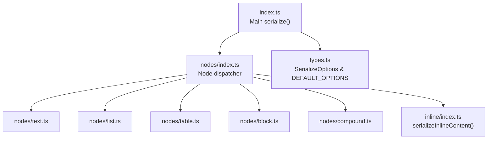
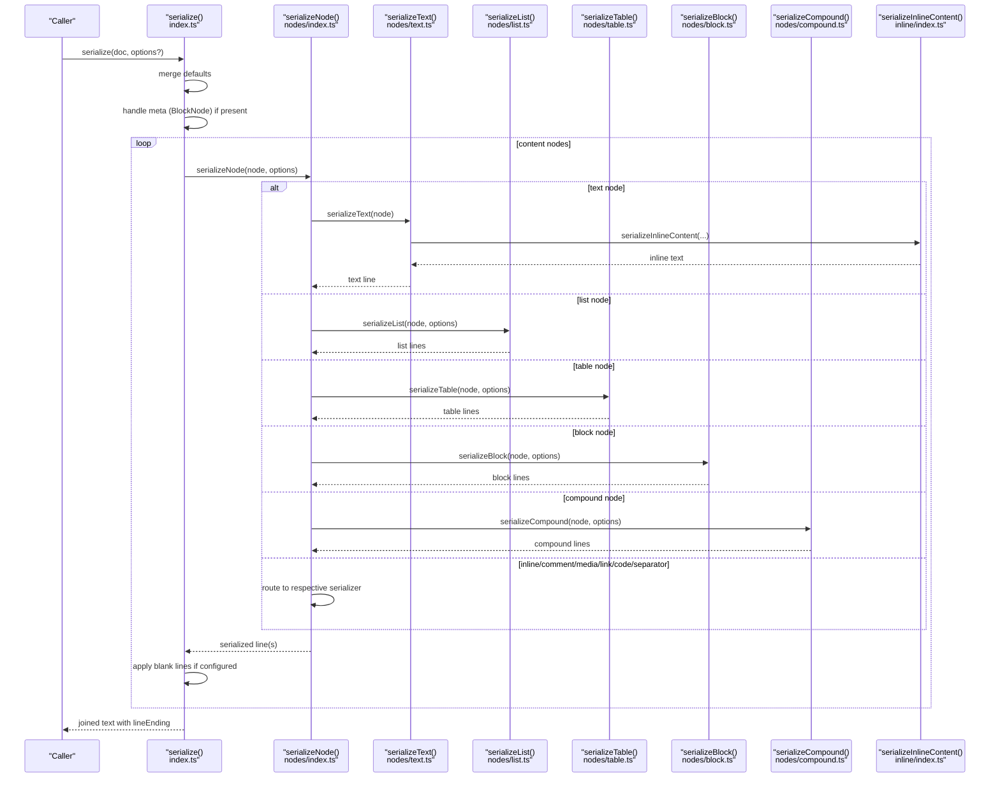
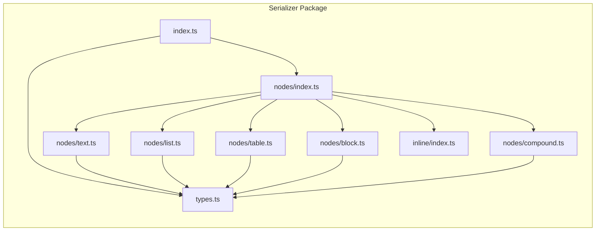

# Serialization Overview

<cite>
**Referenced Files in This Document**
- [index.ts](file://artoon-serializer/src/index.ts)
- [types.ts](file://artoon-serializer/src/types.ts)
- [nodes/index.ts](file://artoon-serializer/src/nodes/index.ts)
- [nodes/text.ts](file://artoon-serializer/src/nodes/text.ts)
- [nodes/block.ts](file://artoon-serializer/src/nodes/block.ts)
- [nodes/list.ts](file://artoon-serializer/src/nodes/list.ts)
- [nodes/table.ts](file://artoon-serializer/src/nodes/table.ts)
- [nodes/compound.ts](file://artoon-serializer/src/nodes/compound.ts)
- [inline/index.ts](file://artoon-serializer/src/inline/index.ts)
- [serialize.test.ts](file://artoon-serializer/tests/serialize.test.ts)
- [package.json](file://artoon-serializer/package.json)
</cite>

## Table of Contents
1. [Introduction](#introduction)
2. [Project Structure](#project-structure)
3. [Core Components](#core-components)
4. [Architecture Overview](#architecture-overview)
5. [Detailed Component Analysis](#detailed-component-analysis)
6. [Dependency Analysis](#dependency-analysis)
7. [Performance Considerations](#performance-considerations)
8. [Troubleshooting Guide](#troubleshooting-guide)
9. [Conclusion](#conclusion)

## Introduction
This document explains the ARTOON Serializer package and its core serialization pipeline that converts ARTOON AST nodes back into ARTOON text format. It focuses on the main serialize function, its parameters and return values, serialization options, and how the serializer interacts with AST packages. Special attention is given to differences in handling BlockNode versus DocumentMeta, along with practical examples and customization guidance.

## Project Structure
The serializer package exposes a small, focused API surface:
- Main entry exports the primary serialize function and related helpers.
- A dispatcher module routes content nodes to specialized serializers.
- Individual node serializers handle text, lists, tables, blocks, compounds, and inline content.
- Options and defaults are centralized in a dedicated types module.

**Diagram sources**
- [index.ts:17-59](file://artoon-serializer/src/index.ts#L17-L59)
- [nodes/index.ts:32-78](file://artoon-serializer/src/nodes/index.ts#L32-L78)
- [types.ts:6-24](file://artoon-serializer/src/types.ts#L6-L24)
- [inline/index.ts:1-4](file://artoon-serializer/src/inline/index.ts#L1-L4)

**Section sources**
- [index.ts:1-95](file://artoon-serializer/src/index.ts#L1-L95)
- [nodes/index.ts:1-91](file://artoon-serializer/src/nodes/index.ts#L1-L91)
- [types.ts:1-32](file://artoon-serializer/src/types.ts#L1-L32)
- [inline/index.ts:1-4](file://artoon-serializer/src/inline/index.ts#L1-L4)

## Core Components
- Main serialize function
  - Purpose: Convert an ARTOONDocument AST into ARTOON text.
  - Parameters:
    - doc: Accepts either a typed ARTOONDocument or a compatible shape with version, optional meta, and content array.
    - options: Optional SerializeOptions to control formatting and behavior.
  - Return value: A string containing the serialized ARTOON text.
  - Behavior highlights:
    - Applies default options if none provided.
    - Serializes meta (BlockNode form) first when present, optionally adding a blank line afterward depending on options.
    - Iterates content nodes, skipping comments unless preserveComments is enabled.
    - Inserts blank lines between nodes when blankLinesBetween is true.
    - Uses configured lineEnding for joining lines.

- Serialization options
  - lineEnding: Controls line endings; default is Unix-style newline.
  - blankLinesBetween: Adds blank lines between content nodes; default is true.
  - preserveComments: Includes comment nodes in output; default is true.

- Direction handling
  - getDirectionMarker maps 'rtl' to '>' and 'ltr' to '<'.
  - Direction markers are applied to most serialized constructs (text, lists, tables, compounds, and inline content).

- Relationship with AST packages
  - The serializer depends on @artoon/ast types and predicates to identify node types.
  - It handles BlockNode (from parser output) differently from DocumentMeta (AST metadata):
    - BlockNode: Serialized as a block with start/end delimiters and fields/content according to block rules.
    - DocumentMeta: Present in AST documents but not serialized as a separate block in current implementation.

**Section sources**
- [index.ts:10-59](file://artoon-serializer/src/index.ts#L10-L59)
- [types.ts:6-31](file://artoon-serializer/src/types.ts#L6-L31)
- [package.json:14-16](file://artoon-serializer/package.json#L14-L16)

## Architecture Overview
The serialization pipeline follows a dispatch pattern: the main serialize function orchestrates top-level formatting and delegates node-specific serialization to a dispatcher, which routes to specialized serializers.

**Diagram sources**
- [index.ts:17-59](file://artoon-serializer/src/index.ts#L17-L59)
- [nodes/index.ts:32-78](file://artoon-serializer/src/nodes/index.ts#L32-L78)
- [nodes/text.ts:12-18](file://artoon-serializer/src/nodes/text.ts#L12-L18)
- [nodes/list.ts:17-30](file://artoon-serializer/src/nodes/list.ts#L17-L30)
- [nodes/table.ts:16-38](file://artoon-serializer/src/nodes/table.ts#L16-L38)
- [nodes/block.ts:15-60](file://artoon-serializer/src/nodes/block.ts#L15-L60)
- [nodes/compound.ts:20-54](file://artoon-serializer/src/nodes/compound.ts#L20-L54)
- [inline/index.ts:1-4](file://artoon-serializer/src/inline/index.ts#L1-L4)

## Detailed Component Analysis

### Main serialize function
- Responsibilities:
  - Merge user-provided options with defaults.
  - Serialize meta (BlockNode) first when present, adding a blank line after if configured.
  - Iterate content nodes, skipping comments unless preserveComments is true.
  - Insert blank lines between nodes when blankLinesBetween is true.
  - Join all lines using the configured lineEnding.
- Key behaviors:
  - Handles both typed ARTOONDocument and a compatible shape with meta and content arrays.
  - Uses serializeNode for content nodes and serializeBlock for meta when applicable.

**Section sources**
- [index.ts:17-59](file://artoon-serializer/src/index.ts#L17-L59)

### Node dispatcher (serializeNode)
- Responsibilities:
  - Route content nodes to specialized serializers based on type predicates from @artoon/ast.
  - Throw an error for unknown node types.
- Supported node types:
  - Text, List, Table, Compound, Block, Media, Link, Code, Separator, Comment.

**Section sources**
- [nodes/index.ts:32-78](file://artoon-serializer/src/nodes/index.ts#L32-L78)

### Text nodes
- Output pattern: direction marker, text type, separator, and inline content.
- Direction handling: getDirectionMarker determines the leading marker based on node.direction.

**Section sources**
- [nodes/text.ts:12-18](file://artoon-serializer/src/nodes/text.ts#L12-L18)
- [types.ts:29-31](file://artoon-serializer/src/types.ts#L29-L31)

### List nodes
- Output pattern: per-item lines with depth-based dashes and item list type.
- Direction handling: applied to each item line.

**Section sources**
- [nodes/list.ts:17-59](file://artoon-serializer/src/nodes/list.ts#L17-L59)
- [types.ts:29-31](file://artoon-serializer/src/types.ts#L29-L31)

### Table nodes
- Output pattern: a container line followed by header rows and data rows.
- Cell serialization uses serializeInlineContent.

**Section sources**
- [nodes/table.ts:16-56](file://artoon-serializer/src/nodes/table.ts#L16-L56)

### Block nodes
- Output pattern: start delimiter (<blockName> or <blockName:lang>.), field lines, content (when applicable), and end delimiter (.</blockName>).
- Special cases:
  - Code blocks: emit raw content string.
  - Meta blocks: emit only fields; content is intentionally omitted.
- Direction handling: start delimiter uses direction marker when applicable.

**Section sources**
- [nodes/block.ts:15-71](file://artoon-serializer/src/nodes/block.ts#L15-L71)

### Compound nodes
- Output pattern: container lines with child elements serialized appropriately.
  - Details: summary inline content followed by content children.
  - Figure: figure container with media and caption children.

**Section sources**
- [nodes/compound.ts:20-82](file://artoon-serializer/src/nodes/compound.ts#L20-L82)

### Inline content
- Exposed via serializeInlineContent; used by text, table, and compound serializers to produce inline text.

**Section sources**
- [inline/index.ts:1-4](file://artoon-serializer/src/inline/index.ts#L1-L4)

### Examples and usage
- Basic serialization of a single paragraph with RTL direction.
- Multiple paragraphs separated by blank lines.
- Disabling blank lines between nodes.
- Skipping comments when preserveComments is false.
- Using Windows-style line endings.
- Mixed content including headings, paragraphs, separators, and LTR text.

These examples are validated by the test suite.

**Section sources**
- [serialize.test.ts:16-229](file://artoon-serializer/tests/serialize.test.ts#L16-L229)

## Dependency Analysis
- Internal dependencies:
  - index.ts depends on nodes/index.ts and types.ts.
  - nodes/index.ts depends on @artoon/ast predicates and individual node serializers.
  - nodes/* depend on types.ts for direction marker and DEFAULT_OPTIONS.
  - inline/index.ts re-exports serializeInlineContent.
- External dependencies:
  - @artoon/ast: Provides ARTOONDocument, ContentNode, and type predicates.
  - @artoon/parser: Development dependency for testing integration.

**Diagram sources**
- [index.ts:4-8](file://artoon-serializer/src/index.ts#L4-L8)
- [nodes/index.ts:3-27](file://artoon-serializer/src/nodes/index.ts#L3-L27)
- [types.ts:4-31](file://artoon-serializer/src/types.ts#L4-L31)
- [inline/index.ts:1-4](file://artoon-serializer/src/inline/index.ts#L1-L4)

**Section sources**
- [package.json:14-24](file://artoon-serializer/package.json#L14-L24)

## Performance Considerations
- The serializer builds an array of strings and joins once at the end, minimizing intermediate allocations.
- Blank lines are inserted conditionally based on options, avoiding unnecessary overhead.
- Direction marker computation is constant-time per node.
- Recommendations:
  - Prefer passing options once rather than repeatedly recomputing defaults.
  - Avoid disabling blankLinesBetween unless required for compact output.
  - Keep preserveComments enabled for fidelity; disabling may reduce output size slightly.

[No sources needed since this section provides general guidance]

## Troubleshooting Guide
- Unknown node type error:
  - Symptom: An error indicating an unknown node type during serialization.
  - Cause: A node type not handled by the dispatcher.
  - Resolution: Ensure the node conforms to supported ContentNode types or extend the dispatcher accordingly.

- Unexpected blank lines:
  - Symptom: Extra blank lines appear between nodes.
  - Cause: blankLinesBetween is true by default.
  - Resolution: Pass { blankLinesBetween: false } to suppress blank lines.

- Comments not appearing:
  - Symptom: Comment nodes are missing from output.
  - Cause: preserveComments is true by default, but may be overridden.
  - Resolution: Pass { preserveComments: true } to include comments.

- Line ending issues:
  - Symptom: Output uses unexpected newlines.
  - Cause: lineEnding option not set or differs from expected platform convention.
  - Resolution: Explicitly set { lineEnding: '\r\n' } for Windows compatibility.

- Meta block not serialized:
  - Symptom: DocumentMeta appears in AST but does not show up as a block in output.
  - Cause: DocumentMeta is not serialized as a separate block in current implementation; only BlockNode forms are handled.
  - Resolution: Ensure meta is represented as a BlockNode when needed.

**Section sources**
- [nodes/index.ts:76-78](file://artoon-serializer/src/nodes/index.ts#L76-L78)
- [index.ts:33-58](file://artoon-serializer/src/index.ts#L33-L58)
- [types.ts:20-24](file://artoon-serializer/src/types.ts#L20-L24)

## Conclusion
The ARTOON Serializer provides a concise, extensible pipeline for converting ARTOON AST documents into text. Its main serialize function centralizes formatting options while delegating node-specific rendering to specialized serializers. Direction-aware output, configurable blank lines and line endings, and selective comment preservation enable flexible customization for diverse use cases. The serializer’s design cleanly separates concerns between orchestration, dispatch, and node-specific logic, ensuring maintainability and testability.