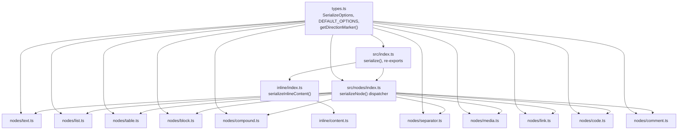
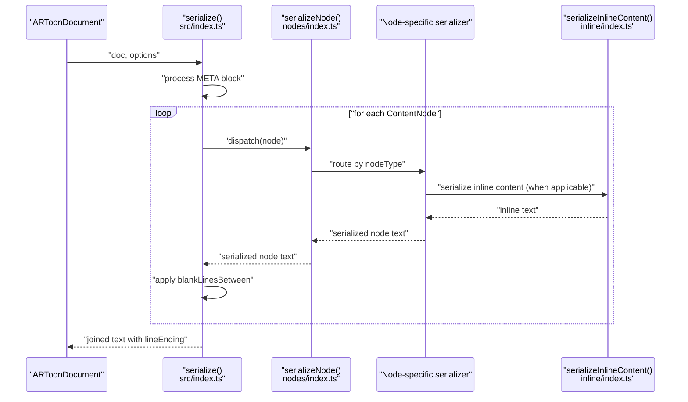

# Serializer Package

<cite>
**Referenced Files in This Document**
- [index.ts](file://artoon-serializer/src/index.ts)
- [types.ts](file://artoon-serializer/src/types.ts)
- [nodes/index.ts](file://artoon-serializer/src/nodes/index.ts)
- [nodes/block.ts](file://artoon-serializer/src/nodes/block.ts)
- [nodes/text.ts](file://artoon-serializer/src/nodes/text.ts)
- [nodes/list.ts](file://artoon-serializer/src/nodes/list.ts)
- [nodes/table.ts](file://artoon-serializer/src/nodes/table.ts)
- [nodes/compound.ts](file://artoon-serializer/src/nodes/compound.ts)
- [nodes/media.ts](file://artoon-serializer/src/nodes/media.ts)
- [nodes/link.ts](file://artoon-serializer/src/nodes/link.ts)
- [nodes/code.ts](file://artoon-serializer/src/nodes/code.ts)
- [nodes/separator.ts](file://artoon-serializer/src/nodes/separator.ts)
- [inline/index.ts](file://artoon-serializer/src/inline/index.ts)
- [inline/content.ts](file://artoon-serializer/src/inline/content.ts)
- [package.json](file://artoon-serializer/package.json)
</cite>

## Table of Contents
1. [Introduction](#introduction)
2. [Project Structure](#project-structure)
3. [Core Components](#core-components)
4. [Architecture Overview](#architecture-overview)
5. [Detailed Component Analysis](#detailed-component-analysis)
6. [Dependency Analysis](#dependency-analysis)
7. [Performance Considerations](#performance-considerations)
8. [Troubleshooting Guide](#troubleshooting-guide)
9. [Conclusion](#conclusion)
10. [Appendices](#appendices)

## Introduction
This document describes the ARTOON Serializer package, which converts an ARTOON Abstract Syntax Tree (AST) back into ARTOON text format. It explains the serialization pipeline, node serializers for blocks, code, lists, tables, comments, links, media, separators, and text, as well as inline content serialization and formatting controls. It also covers output formatting, indentation handling, line wrapping strategies, round-trip validation considerations, and the relationship with the parser and AST packages.

## Project Structure
The serializer is organized around a central dispatcher that routes content nodes to specialized serializers, and a small set of formatting utilities. Inline content is handled by a dedicated module.



**Diagram sources**
- [index.ts:17-59](file://artoon-serializer/src/index.ts#L17-L59)
- [nodes/index.ts:32-78](file://artoon-serializer/src/nodes/index.ts#L32-L78)
- [inline/index.ts](file://artoon-serializer/src/inline/index.ts)
- [inline/content.ts](file://artoon-serializer/src/inline/content.ts)
- [types.ts:6-31](file://artoon-serializer/src/types.ts#L6-L31)

**Section sources**
- [index.ts:17-59](file://artoon-serializer/src/index.ts#L17-L59)
- [nodes/index.ts:32-78](file://artoon-serializer/src/nodes/index.ts#L32-L78)
- [types.ts:6-31](file://artoon-serializer/src/types.ts#L6-L31)

## Core Components
- Central serializer: Converts an ARTOONDocument to text, handling META blocks and inter-element spacing.
- Node dispatcher: Routes nodes to the appropriate serializer based on node type.
- Node serializers: Specialized handlers for each component type (text, lists, tables, blocks, compound, media, links, code, separators, comments).
- Inline serializer: Serializes inline content arrays into formatted text.
- Formatting options: Controls line endings, blank-line separation, and comment preservation.

Key responsibilities:
- Pipeline orchestration: [serialize:17-59](file://artoon-serializer/src/index.ts#L17-L59)
- Node routing: [serializeNode:32-78](file://artoon-serializer/src/nodes/index.ts#L32-L78)
- Inline formatting: [serializeInlineContent](file://artoon-serializer/src/inline/index.ts) and [inline/content.ts](file://artoon-serializer/src/inline/content.ts)
- Formatting controls: [SerializeOptions:6-15](file://artoon-serializer/src/types.ts#L6-L15), [DEFAULT_OPTIONS:20-24](file://artoon-serializer/src/types.ts#L20-L24), [getDirectionMarker:29-31](file://artoon-serializer/src/types.ts#L29-L31)

**Section sources**
- [index.ts:17-59](file://artoon-serializer/src/index.ts#L17-L59)
- [nodes/index.ts:32-78](file://artoon-serializer/src/nodes/index.ts#L32-L78)
- [types.ts:6-31](file://artoon-serializer/src/types.ts#L6-L31)

## Architecture Overview
The serialization pipeline follows a deterministic flow:
- The top-level serializer processes the document, optionally emitting a META block, iterating content nodes, and applying blank-line spacing.
- Each content node is dispatched to a specialized serializer based on its type.
- Inline content is serialized via a dedicated module that handles marks and text runs.



**Diagram sources**
- [index.ts:17-59](file://artoon-serializer/src/index.ts#L17-L59)
- [nodes/index.ts:32-78](file://artoon-serializer/src/nodes/index.ts#L32-L78)
- [inline/index.ts](file://artoon-serializer/src/inline/index.ts)

## Detailed Component Analysis

### Central Serializer
- Purpose: Convert an ARTOONDocument to ARTOON text, handling META blocks and inter-element spacing.
- Behavior:
  - If a META block exists, serialize it first and append a blank line if configured.
  - Iterate content nodes, skipping comments unless preserved.
  - Join lines using the configured line ending.

Formatting controls:
- Blank-line separation between elements controlled by [blankLinesBetween:10-11](file://artoon-serializer/src/types.ts#L10-L11).
- Comment preservation controlled by [preserveComments:13-14](file://artoon-serializer/src/types.ts#L13-L14).
- Line ending controlled by [lineEnding:7-8](file://artoon-serializer/src/types.ts#L7-L8).

**Section sources**
- [index.ts:17-59](file://artoon-serializer/src/index.ts#L17-L59)
- [types.ts:6-24](file://artoon-serializer/src/types.ts#L6-L24)

### Node Dispatcher
- Purpose: Route content nodes to the correct serializer based on node type.
- Behavior: Uses type guards to select the appropriate serializer and throws on unknown types.

**Section sources**
- [nodes/index.ts:32-78](file://artoon-serializer/src/nodes/index.ts#L32-L78)

### Text Nodes
- Output pattern: Direction marker, text type, and inline content.
- Direction marker: Determined by [getDirectionMarker:29-31](file://artoon-serializer/src/types.ts#L29-L31).
- Inline serialization: [serializeInlineContent](file://artoon-serializer/src/inline/index.ts) is used to produce the content portion.

**Section sources**
- [nodes/text.ts:12-18](file://artoon-serializer/src/nodes/text.ts#L12-L18)
- [types.ts:29-31](file://artoon-serializer/src/types.ts#L29-L31)

### List Nodes
- Output pattern: One line per list item with depth prefixes derived from nesting level.
- Direction marker and inline content handled similarly to text nodes.
- Depth handling: Uses repeated dashes equal to nesting depth.

**Section sources**
- [nodes/list.ts:17-58](file://artoon-serializer/src/nodes/list.ts#L17-L58)

### Table Nodes
- Output pattern: A table container line followed by header rows and data rows.
- Cell serialization: Inline content per cell.

**Section sources**
- [nodes/table.ts:16-55](file://artoon-serializer/src/nodes/table.ts#L16-L55)

### Block Nodes
- Output pattern: Start line with optional language, content lines, and end line.
- Special cases:
  - Code blocks: raw content only.
  - META blocks: serialize only fields; ignore content.
  - Other blocks: serialize fields and content.

Hidden field serialization: Direction-aware hidden field lines.

**Section sources**
- [nodes/block.ts:15-70](file://artoon-serializer/src/nodes/block.ts#L15-L70)

### Compound Nodes
- Output pattern:
  - Details: summary inline text followed by child content lines.
  - Figure: figure container with child lines (media or text).
- Child serialization:
  - Media: direction-aware media lines with optional metadata.
  - Text: direction-aware text lines with role-specific prefixes.

**Section sources**
- [nodes/compound.ts:20-82](file://artoon-serializer/src/nodes/compound.ts#L20-L82)

### Media Nodes
- Output pattern: Direction-aware media type with semicolon-separated parts depending on media type.
- Variants: image (with alt/title), video/audio (with title), file (with label).

**Section sources**
- [nodes/media.ts:15-36](file://artoon-serializer/src/nodes/media.ts#L15-L36)

### Link Nodes
- Output pattern: Direction-aware link with URL and optional text.
- Modifiers: Optional modifier list rendered inside brackets.

**Section sources**
- [nodes/link.ts:12-30](file://artoon-serializer/src/nodes/link.ts#L12-L30)

### Inline Code Nodes
- Output pattern: Direction-aware inline code with optional language.

**Section sources**
- [nodes/code.ts:11-20](file://artoon-serializer/src/nodes/code.ts#L11-L20)

### Separator Nodes
- Output pattern: Direction-aware separator type without content.
- Backward compatibility: Falls back to legacy separators array if needed.

**Section sources**
- [nodes/separator.ts:14-22](file://artoon-serializer/src/nodes/separator.ts#L14-L22)

### Inline Content Serialization
- Purpose: Serialize inline content arrays into formatted text.
- Integration: Used by text, table cells, compound children, and other inline-capable nodes.

**Section sources**
- [inline/index.ts](file://artoon-serializer/src/inline/index.ts)
- [inline/content.ts](file://artoon-serializer/src/inline/content.ts)

## Dependency Analysis
- Internal dependencies:
  - [index.ts:4-8](file://artoon-serializer/src/index.ts#L4-L8) depends on AST types and re-exports node serializers.
  - [nodes/index.ts:3-27](file://artoon-serializer/src/nodes/index.ts#L3-L27) depends on AST type guards and re-exports node serializers.
  - All node serializers depend on [types.ts:29-31](file://artoon-serializer/src/types.ts#L29-L31) for direction markers.
  - Inline serializers depend on [inline/index.ts](file://artoon-serializer/src/inline/index.ts).
- External dependencies:
  - [@artoon/ast:14-16](file://artoon-serializer/package.json#L14-L16) provides AST types and node type guards.
  - [@artoon/parser:17-23](file://artoon-serializer/package.json#L17-L23) is a dev dependency for testing and integration.

```mermaid
graph LR
subgraph "Serializer"
IDX["src/index.ts"]
NIDX["src/nodes/index.ts"]
TYP["src/types.ts"]
INIDX["src/inline/index.ts"]
INCNT["src/inline/content.ts"]
end
subgraph "AST"
AST["@artoon/ast"]
end
subgraph "Parser (Dev)"
P["@artoon/parser"]
end
IDX --> NIDX
IDX --> INIDX
NIDX --> TYP
INIDX --> INCNT
NIDX --> AST
IDX --> AST
TYP --> AST
P --> AST
```

**Diagram sources**
- [index.ts:4-8](file://artoon-serializer/src/index.ts#L4-L8)
- [nodes/index.ts:3-27](file://artoon-serializer/src/nodes/index.ts#L3-L27)
- [types.ts:29-31](file://artoon-serializer/src/types.ts#L29-L31)
- [package.json:14-23](file://artoon-serializer/package.json#L14-L23)

**Section sources**
- [package.json:14-23](file://artoon-serializer/package.json#L14-L23)
- [index.ts:4-8](file://artoon-serializer/src/index.ts#L4-L8)
- [nodes/index.ts:3-27](file://artoon-serializer/src/nodes/index.ts#L3-L27)
- [types.ts:29-31](file://artoon-serializer/src/types.ts#L29-L31)

## Performance Considerations
- Minimize allocations:
  - Prefer joining pre-sized arrays and avoid intermediate concatenations.
  - Use a single join at the end of each serializer.
- Short-circuit conditions:
  - Skip comments early when not preserving them.
  - Avoid redundant checks by leveraging type guards.
- Inline content reuse:
  - Reuse direction markers and line ending constants.
- Batch operations:
  - Accumulate lines in arrays and join once per node.

[No sources needed since this section provides general guidance]

## Troubleshooting Guide
Common issues and resolutions:
- Unknown node type during serialization:
  - Symptom: Error thrown for unsupported node types.
  - Resolution: Ensure the node conforms to AST types and that all node types are covered by the dispatcher.
  - Reference: [serializeNode:76-78](file://artoon-serializer/src/nodes/index.ts#L76-L78)
- Unexpected blank lines:
  - Symptom: Extra blank lines between elements.
  - Cause: [blankLinesBetween:10-11](file://artoon-serializer/src/types.ts#L10-L11) is enabled.
  - Resolution: Disable blank line insertion if not desired.
  - Reference: [serialize:52-55](file://artoon-serializer/src/index.ts#L52-L55)
- Comments appearing in output:
  - Symptom: Comments visible in serialized text.
  - Cause: [preserveComments:13-14](file://artoon-serializer/src/types.ts#L13-L14) is enabled.
  - Resolution: Set to false to suppress comments.
  - Reference: [serialize:44-46](file://artoon-serializer/src/index.ts#L44-L46)
- Line ending mismatch:
  - Symptom: Incorrect line endings in output.
  - Cause: [lineEnding:7-8](file://artoon-serializer/src/types.ts#L7-L8) not set appropriately.
  - Resolution: Configure line ending to match target platform.
  - Reference: [serialize](file://artoon-serializer/src/index.ts#L58), [serializeNode:34-35](file://artoon-serializer/src/nodes/index.ts#L34-L35)
- META block not rendering:
  - Symptom: META block missing from output.
  - Cause: Parser may emit a BlockNode; ensure META is recognized and serialized.
  - Resolution: Verify META handling in [serialize:26-38](file://artoon-serializer/src/index.ts#L26-L38).
- Separator fallback:
  - Symptom: Unexpected separator type.
  - Cause: Legacy separators array fallback.
  - Resolution: Use [separatorType](file://artoon-serializer/src/nodes/separator.ts#L19) for explicit control.
  - Reference: [serializeSeparator:14-22](file://artoon-serializer/src/nodes/separator.ts#L14-L22)

**Section sources**
- [nodes/index.ts:76-78](file://artoon-serializer/src/nodes/index.ts#L76-L78)
- [types.ts:7-24](file://artoon-serializer/src/types.ts#L7-L24)
- [index.ts:44-58](file://artoon-serializer/src/index.ts#L44-L58)
- [nodes/separator.ts:14-22](file://artoon-serializer/src/nodes/separator.ts#L14-L22)

## Conclusion
The ARTOON Serializer package provides a robust, extensible pipeline to convert AST documents back into ARTOON text. Its modular design separates concerns across node types and inline content, while formatting options enable precise control over output characteristics. Together with the parser and AST packages, it forms a complete round-trip transformation chain suitable for editing, validation, and export scenarios.

[No sources needed since this section summarizes without analyzing specific files]

## Appendices

### Formatting Options Reference
- lineEnding: Controls line ending character(s).
- blankLinesBetween: Adds blank lines between elements.
- preserveComments: Controls whether comments appear in output.

**Section sources**
- [types.ts:6-24](file://artoon-serializer/src/types.ts#L6-L24)

### Round-Trip Validation Guidance
- Use the parser to convert ARTOON text into AST, then serialize the AST back to text.
- Compare the original and re-serialized texts for equality.
- For META blocks, ensure the META serialization path is exercised in the serializer.
- Validate inline content serialization by testing mixed inline elements.

[No sources needed since this section provides general guidance]