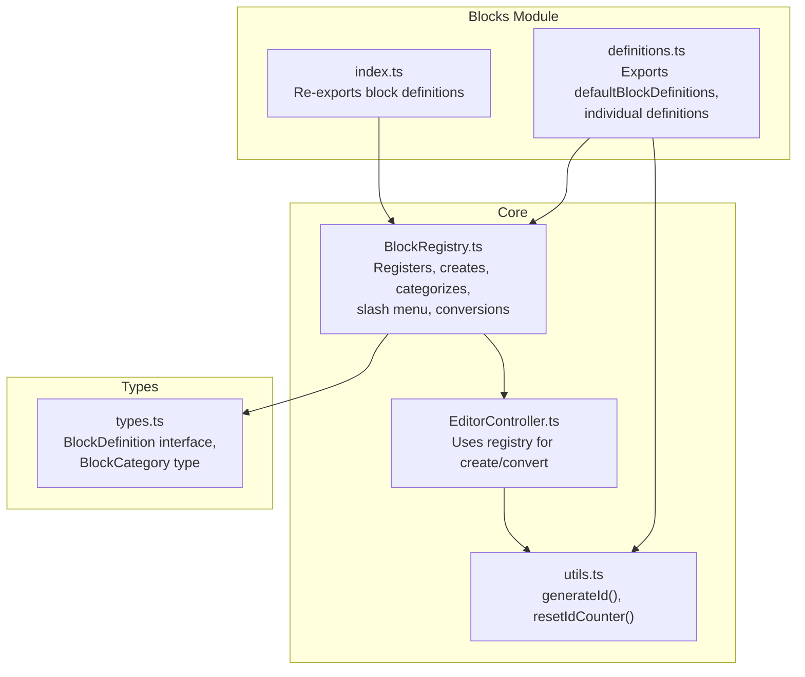
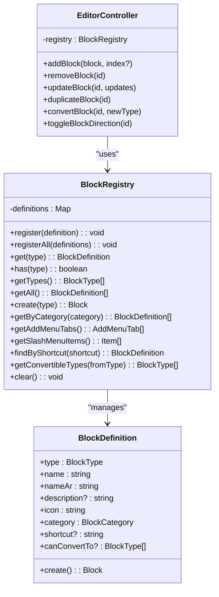
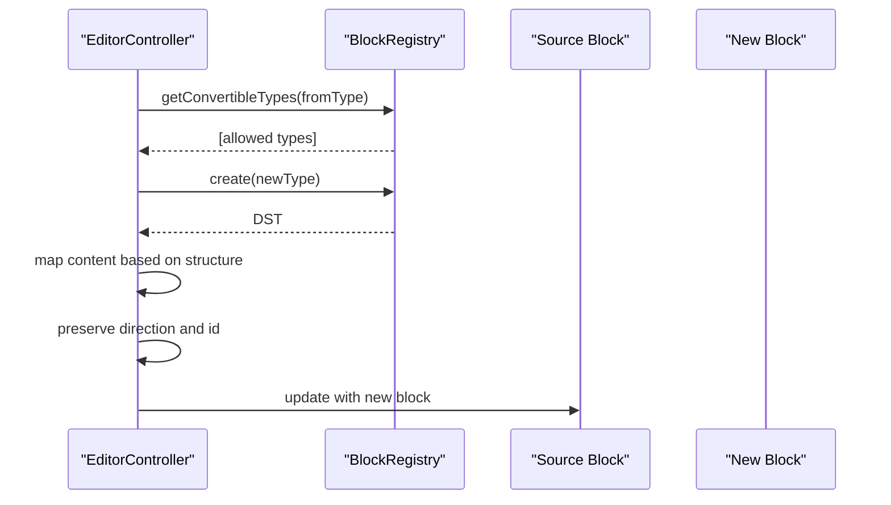
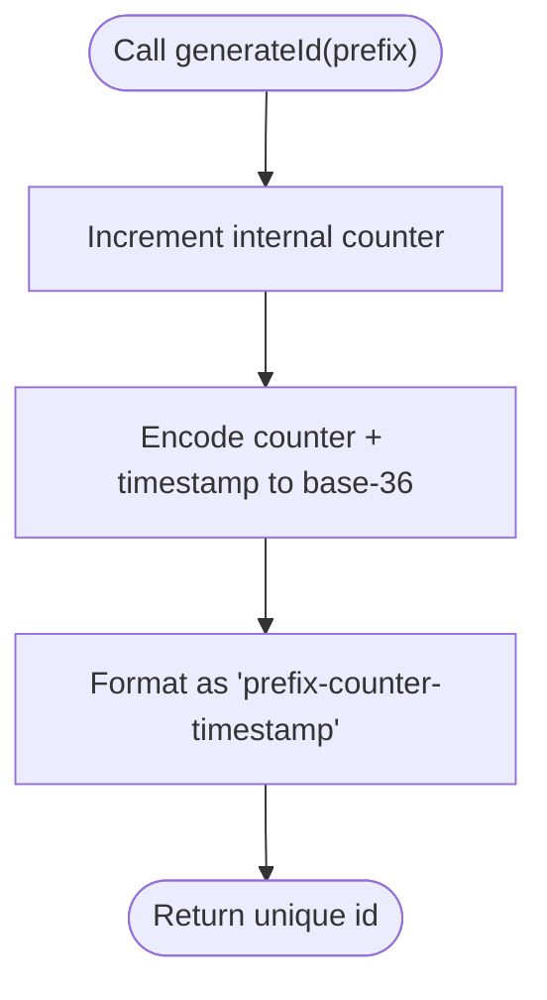
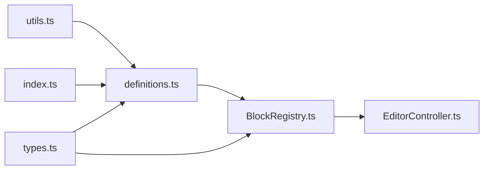

# Block Definitions

<cite>
**Referenced Files in This Document**
- [definitions.ts](file://artoon-typer/src/blocks/definitions.ts)
- [index.ts](file://artoon-typer/src/blocks/index.ts)
- [types.ts](file://artoon-typer/src/types.ts)
- [BlockRegistry.ts](file://artoon-typer/src/core/BlockRegistry.ts)
- [utils.ts](file://artoon-typer/src/core/utils.ts)
- [EditorController.ts](file://artoon-typer/src/core/EditorController.ts)
- [definitions.test.ts](file://artoon-typer/tests/blocks/definitions.test.ts)
- [all-blocks.test.ts](file://artoon-typer/tests/e2e/all-blocks.test.ts)
- [BlockRegistry.test.ts](file://artoon-typer/tests/core/BlockRegistry.test.ts)
</cite>

## Table of Contents
1. [Introduction](#introduction)
2. [Project Structure](#project-structure)
3. [Core Components](#core-components)
4. [Architecture Overview](#architecture-overview)
5. [Detailed Component Analysis](#detailed-component-analysis)
6. [Dependency Analysis](#dependency-analysis)
7. [Performance Considerations](#performance-considerations)
8. [Troubleshooting Guide](#troubleshooting-guide)
9. [Conclusion](#conclusion)

## Introduction
This document explains the ARTOON block definition system. It covers the BlockDefinition interface, the built-in block library organized by categories, the block categorization model, conversion capabilities, and the ID generation pattern. It also provides practical guidance for creating custom block definitions and extending the default block library.

## Project Structure
The block definition system lives primarily under the editor runtime module (artoon-typer). Key areas:
- Block definitions: definitions.ts exports individual block definitions and aggregates them into defaultBlockDefinitions.
- Registry: BlockRegistry manages registration, lookup, add-menu tabs, slash menu items, and conversion queries.
- Types: BlockDefinition interface and BlockCategory type.
- Utilities: generateId produces deterministic, collision-resistant IDs.
- Editor integration: EditorController uses the registry for block creation and conversion.

**Diagram sources**
- [definitions.ts:539-588](file://artoon-typer/src/blocks/definitions.ts#L539-L588)
- [index.ts:14-35](file://artoon-typer/src/blocks/index.ts#L14-L35)
- [BlockRegistry.ts:19-147](file://artoon-typer/src/core/BlockRegistry.ts#L19-L147)
- [utils.ts:10-12](file://artoon-typer/src/core/utils.ts#L10-L12)
- [EditorController.ts:19-22](file://artoon-typer/src/core/EditorController.ts#L19-L22)
- [types.ts:469-493](file://artoon-typer/src/types.ts#L469-L493)

**Section sources**
- [definitions.ts:1-589](file://artoon-typer/src/blocks/definitions.ts#L1-L589)
- [index.ts:1-53](file://artoon-typer/src/blocks/index.ts#L1-L53)
- [types.ts:469-493](file://artoon-typer/src/types.ts#L469-L493)
- [BlockRegistry.ts:1-174](file://artoon-typer/src/core/BlockRegistry.ts#L1-L174)
- [utils.ts:1-42](file://artoon-typer/src/core/utils.ts#L1-L42)
- [EditorController.ts:1-200](file://artoon-typer/src/core/EditorController.ts#L1-L200)

## Core Components
- BlockDefinition interface: Defines the contract for each block type, including type, name, description, icon, category, optional shortcut, factory create function, and optional conversion targets.
- BlockCategory: Enumerated categories for add-menu organization.
- BlockRegistry: Central service for registering definitions, creating blocks, querying categories, building add/slash menus, and resolving conversions.
- ID Generation: Deterministic IDs via generateId with prefix, counter, and timestamp encoding.

Key responsibilities:
- BlockDefinition: Encapsulates block identity and construction.
- BlockRegistry: Enforces discoverability and extensibility.
- EditorController: Uses registry for block lifecycle operations.

**Section sources**
- [types.ts:469-493](file://artoon-typer/src/types.ts#L469-L493)
- [BlockRegistry.ts:19-147](file://artoon-typer/src/core/BlockRegistry.ts#L19-L147)
- [utils.ts:10-12](file://artoon-typer/src/core/utils.ts#L10-L12)
- [EditorController.ts:218-282](file://artoon-typer/src/core/EditorController.ts#L218-L282)

## Architecture Overview
The block system follows a registry-driven architecture. Definitions are declared once and registered centrally. The registry exposes:
- Registration APIs
- Creation via create(type)
- Category filtering
- Slash menu composition
- Conversion capability queries

**Diagram sources**
- [types.ts:469-493](file://artoon-typer/src/types.ts#L469-L493)
- [BlockRegistry.ts:19-147](file://artoon-typer/src/core/BlockRegistry.ts#L19-L147)
- [EditorController.ts:218-282](file://artoon-typer/src/core/EditorController.ts#L218-L282)

## Detailed Component Analysis

### BlockDefinition Interface
The BlockDefinition interface specifies:
- type: Unique block type identifier
- name: English display name
- nameAr: Arabic display name
- description?: Optional description
- icon: Emoji or component identifier
- category: One of text, list, media, advanced
- shortcut?: Keyboard shortcut trigger
- create(): Factory that returns a fresh block instance with direction and required fields
- canConvertTo?: Optional list of compatible target types

ID generation pattern:
- Each definition’s create() uses generateId(prefix) to produce a unique block id.
- Prefixes reflect semantic block types (e.g., p, h1-h6, q, ul/ol, li, dl/di, img, video, audio, figure, file, code, table/tr/td, hr, details, time, abbr, meta, link, custom, wbr).

**Section sources**
- [types.ts:469-493](file://artoon-typer/src/types.ts#L469-L493)
- [definitions.ts:35-589](file://artoon-typer/src/blocks/definitions.ts#L35-L589)
- [utils.ts:10-12](file://artoon-typer/src/core/utils.ts#L10-L12)

### Built-in Block Library by Category

- Text blocks
  - Paragraph, Headings H1–H6, Quote, Preformatted, Line Break, Word Break
  - Categories: text
  - Shortcuts: heading shortcuts, quote, line break shortcut, code fence, divider

- List blocks
  - Bullet List, Numbered List, Definition List
  - Categories: list

- Media blocks
  - Image, Video, Audio, Figure, File, Link Block
  - Categories: media or advanced depending on phase

- Advanced blocks (Phase 2)
  - Code, Table, Divider
  - Categories: advanced

- Phase 3 blocks
  - Details, Time, Abbreviation, Metadata
  - Categories: advanced

- Phase 4 blocks
  - Link Block, Custom, Word Break
  - Categories: media/advanced/text depending on block

Total default definitions: 28.

**Section sources**
- [definitions.ts:35-589](file://artoon-typer/src/blocks/definitions.ts#L35-L589)
- [definitions.test.ts:129-161](file://artoon-typer/tests/blocks/definitions.test.ts#L129-L161)
- [all-blocks.test.ts:14-41](file://artoon-typer/tests/e2e/all-blocks.test.ts#L14-L41)

### Block Categorization System
- Categories: text, list, media, advanced
- Add menu tabs are derived from categories and populated with registered block types.
- getDefinitionsByCategory and registry.getByCategory filter definitions by category.

**Section sources**
- [types.ts:493-503](file://artoon-typer/src/types.ts#L493-L503)
- [BlockRegistry.ts:89-105](file://artoon-typer/src/core/BlockRegistry.ts#L89-L105)
- [definitions.ts:586-588](file://artoon-typer/src/blocks/definitions.ts#L586-L588)

### Conversion Capabilities (canConvertTo)
- Each definition may specify canConvertTo with compatible types.
- EditorController.convertBlock consults registry.getConvertibleTypes and enforces allowed transitions.
- Conversion preserves direction and id, and maps content appropriately across structures.

**Diagram sources**
- [EditorController.ts:218-282](file://artoon-typer/src/core/EditorController.ts#L218-L282)
- [BlockRegistry.ts:136-139](file://artoon-typer/src/core/BlockRegistry.ts#L136-L139)

**Section sources**
- [EditorController.ts:218-282](file://artoon-typer/src/core/EditorController.ts#L218-L282)
- [BlockRegistry.ts:136-139](file://artoon-typer/src/core/BlockRegistry.ts#L136-L139)
- [all-blocks.test.ts:132-147](file://artoon-typer/tests/e2e/all-blocks.test.ts#L132-L147)

### ID Generation Pattern
- generateId(prefix) produces a deterministic, collision-resistant id using an internal counter and timestamp encoding.
- Definitions’ create() pass a semantic prefix to generateId to indicate block type.
- EditorController.addBlock ensures uniqueness by regenerating ids when duplicates are detected.

**Diagram sources**
- [utils.ts:10-12](file://artoon-typer/src/core/utils.ts#L10-L12)
- [definitions.ts:42-44](file://artoon-typer/src/blocks/definitions.ts#L42-L44)
- [EditorController.ts:124-126](file://artoon-typer/src/core/EditorController.ts#L124-L126)

**Section sources**
- [utils.ts:10-12](file://artoon-typer/src/core/utils.ts#L10-L12)
- [definitions.ts:42-44](file://artoon-typer/src/blocks/definitions.ts#L42-L44)
- [EditorController.ts:124-126](file://artoon-typer/src/core/EditorController.ts#L124-L126)

### Creating Custom Block Definitions
Steps to add a custom block:
1. Define a BlockDefinition with:
   - type: unique identifier
   - name and nameAr
   - description and icon
   - category
   - shortcut (optional)
   - create(): returns a fresh block with direction and required fields
   - canConvertTo (optional)
2. Register it via BlockRegistry.register or BlockRegistry.registerAll.
3. Integrate with UI:
   - Add menu tabs are auto-generated from categories.
   - Slash menu items are derived from definitions.

Example references:
- Default definitions show the structure and patterns for each block category.
- Tests demonstrate expected properties and behaviors.

**Section sources**
- [definitions.ts:35-589](file://artoon-typer/src/blocks/definitions.ts#L35-L589)
- [BlockRegistry.ts:25-39](file://artoon-typer/src/core/BlockRegistry.ts#L25-L39)
- [BlockRegistry.test.ts:161-179](file://artoon-typer/tests/core/BlockRegistry.test.ts#L161-L179)

### Extending the Default Block Library
- Extend defaultBlockDefinitions with new entries.
- Use getDefaultRegistry to obtain the singleton and register additional definitions.
- EditorController supports custom registries via constructor configuration.

**Section sources**
- [definitions.ts:539-588](file://artoon-typer/src/blocks/definitions.ts#L539-L588)
- [BlockRegistry.ts:159-166](file://artoon-typer/src/core/BlockRegistry.ts#L159-L166)
- [EditorController.ts:69-73](file://artoon-typer/src/core/EditorController.ts#L69-L73)

## Dependency Analysis
- definitions.ts depends on utils.generateId and re-exports all definitions.
- index.ts re-exports definitions for convenient imports.
- BlockRegistry depends on types (BlockDefinition, BlockCategory, AddMenuTab) and definitions.
- EditorController depends on BlockRegistry and utils.

**Diagram sources**
- [definitions.ts:29-29](file://artoon-typer/src/blocks/definitions.ts#L29-L29)
- [index.ts:14-35](file://artoon-typer/src/blocks/index.ts#L14-L35)
- [BlockRegistry.ts:8-14](file://artoon-typer/src/core/BlockRegistry.ts#L8-L14)
- [EditorController.ts:18-22](file://artoon-typer/src/core/EditorController.ts#L18-L22)
- [types.ts:469-493](file://artoon-typer/src/types.ts#L469-L493)

**Section sources**
- [definitions.ts:1-589](file://artoon-typer/src/blocks/definitions.ts#L1-L589)
- [index.ts:1-53](file://artoon-typer/src/blocks/index.ts#L1-L53)
- [BlockRegistry.ts:1-174](file://artoon-typer/src/core/BlockRegistry.ts#L1-L174)
- [EditorController.ts:1-200](file://artoon-typer/src/core/EditorController.ts#L1-L200)
- [types.ts:469-493](file://artoon-typer/src/types.ts#L469-L493)

## Performance Considerations
- Registry lookups are O(1) via Map.
- Category filtering is O(n) over registered definitions.
- Conversion logic performs shallow structural mapping; complexity scales with item counts in lists/tables.
- ID generation is constant-time with a simple counter and timestamp encoding.

## Troubleshooting Guide
Common issues and resolutions:
- Unknown block type when creating: Ensure the type is registered via BlockRegistry.register or included in defaultBlockDefinitions.
- Duplicate IDs on insertion: EditorController.regenerate IDs automatically; avoid passing pre-existing IDs.
- Conversion not allowed: Verify canConvertTo on the source definition and check registry.getConvertibleTypes.
- Missing add-menu tabs: Confirm category membership and that definitions are registered.

Validation references:
- Registry tests cover create, getByCategory, and getTypes.
- E2E tests validate all 28 block types, categories, and shortcuts.
- Definitions tests assert Arabic names, icons, and category membership.

**Section sources**
- [BlockRegistry.test.ts:161-179](file://artoon-typer/tests/core/BlockRegistry.test.ts#L161-L179)
- [all-blocks.test.ts:14-41](file://artoon-typer/tests/e2e/all-blocks.test.ts#L14-L41)
- [definitions.test.ts:129-161](file://artoon-typer/tests/blocks/definitions.test.ts#L129-L161)

## Conclusion
The ARTOON block definition system centers on a clear BlockDefinition contract, a robust BlockRegistry for discovery and lifecycle operations, and deterministic ID generation. The categorized block library spans text, lists, media, and advanced blocks across multiple phases, with explicit conversion rules and UI integration points. Extending the system involves adding definitions and registering them through the registry, ensuring seamless integration with the editor’s creation and conversion workflows.