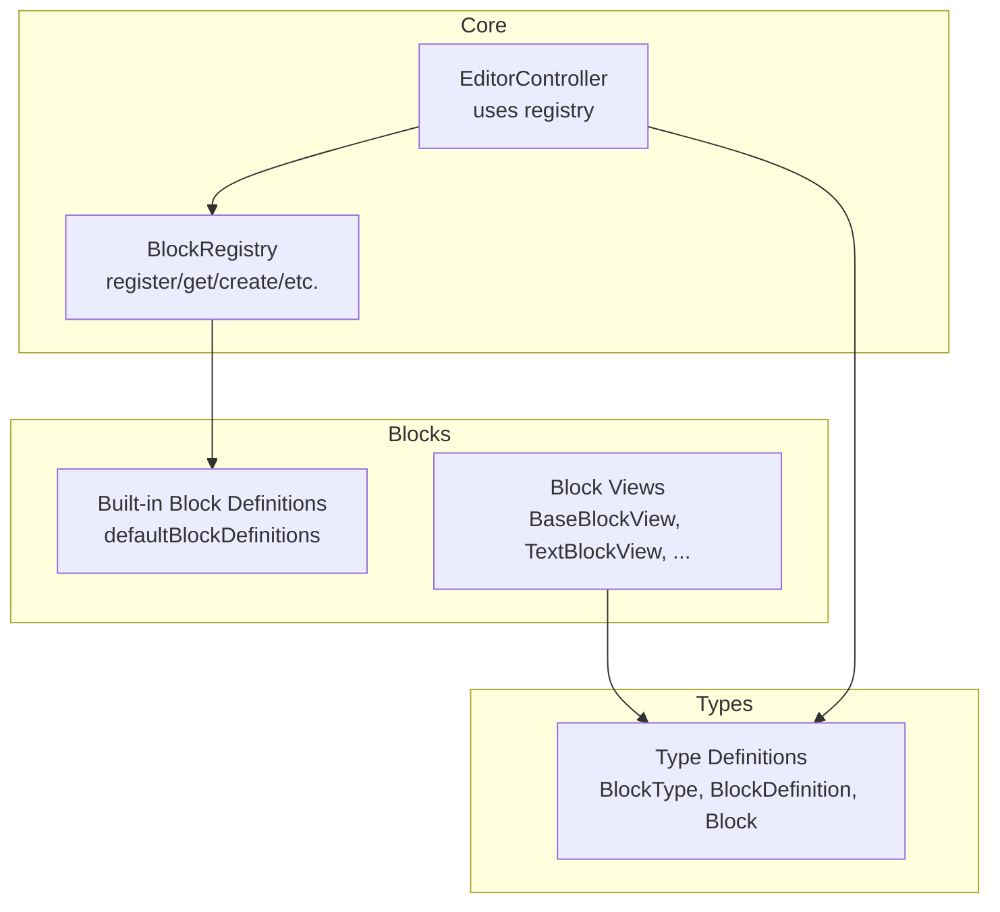
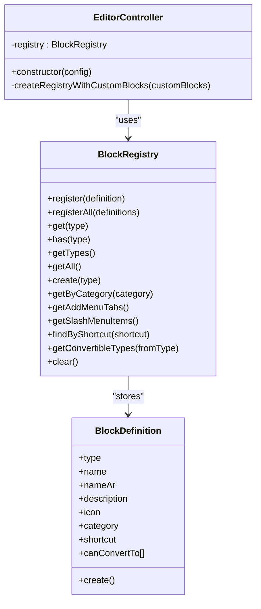
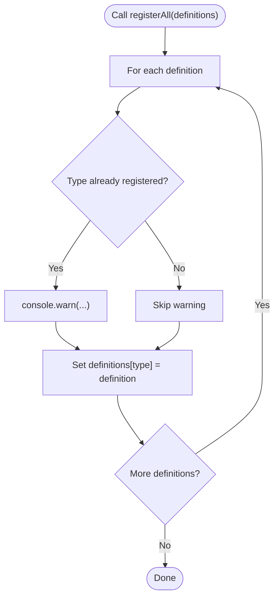
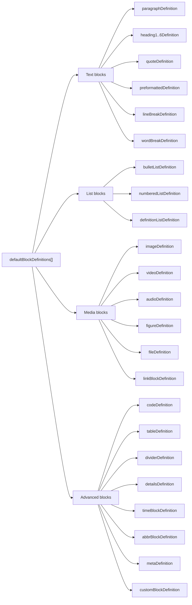
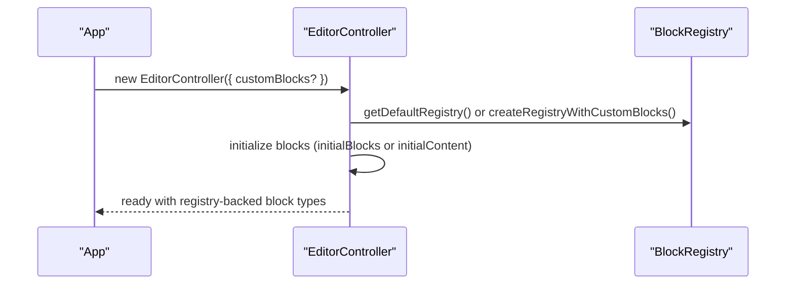
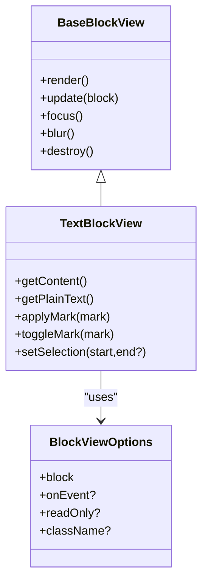
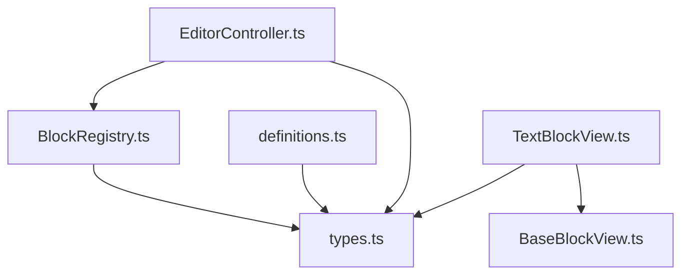

# Block Registration

<cite>
**Referenced Files in This Document**
- [BlockRegistry.ts](file://artoon-typer/src/core/BlockRegistry.ts)
- [definitions.ts](file://artoon-typer/src/blocks/definitions.ts)
- [index.ts](file://artoon-typer/src/blocks/index.ts)
- [types.ts](file://artoon-typer/src/types.ts)
- [BaseBlockView.ts](file://artoon-typer/src/blocks/views/BaseBlockView.ts)
- [TextBlockView.ts](file://artoon-typer/src/blocks/views/TextBlockView.ts)
- [BlockRegistry.test.ts](file://artoon-typer/tests/core/BlockRegistry.test.ts)
- [definitions.test.ts](file://artoon-typer/tests/blocks/definitions.test.ts)
- [EditorController.ts](file://artoon-typer/src/core/EditorController.ts)
- [index.ts (core)](file://artoon-typer/src/core/index.ts)
</cite>

## Table of Contents
1. [Introduction](#introduction)
2. [Project Structure](#project-structure)
3. [Core Components](#core-components)
4. [Architecture Overview](#architecture-overview)
5. [Detailed Component Analysis](#detailed-component-analysis)
6. [Dependency Analysis](#dependency-analysis)
7. [Performance Considerations](#performance-considerations)
8. [Troubleshooting Guide](#troubleshooting-guide)
9. [Conclusion](#conclusion)
10. [Appendices](#appendices)

## Introduction
This document explains the ARTOON block registration system with a focus on the BlockRegistry class. It covers how block definitions are declared, registered, discovered, and looked up; how built-in and custom blocks integrate; and how the registry powers the add menu and slash command features. It also describes the relationship between block definitions, view components, and the registry, and provides practical guidance for registering custom blocks, querying registry state, and handling conflicts.

## Project Structure
The block registration system spans several modules:
- Core registry and editor controller: define the registry API and editor integration
- Built-in block definitions: centralized collection of default block types
- Block view layer: view classes that render and manage block UI
- Tests: validate registry behavior and built-in definitions

**Diagram sources**
- [BlockRegistry.ts:19-174](file://artoon-typer/src/core/BlockRegistry.ts#L19-L174)
- [EditorController.ts:27-82](file://artoon-typer/src/core/EditorController.ts#L27-L82)
- [definitions.ts:539-589](file://artoon-typer/src/blocks/definitions.ts#L539-L589)
- [BaseBlockView.ts:27-205](file://artoon-typer/src/blocks/views/BaseBlockView.ts#L27-L205)
- [TextBlockView.ts:50-518](file://artoon-typer/src/blocks/views/TextBlockView.ts#L50-L518)
- [types.ts:27-66](file://artoon-typer/src/types.ts#L27-L66)

**Section sources**
- [BlockRegistry.ts:19-174](file://artoon-typer/src/core/BlockRegistry.ts#L19-L174)
- [definitions.ts:539-589](file://artoon-typer/src/blocks/definitions.ts#L539-L589)
- [types.ts:27-66](file://artoon-typer/src/types.ts#L27-L66)

## Core Components
- BlockRegistry: central registry managing block definitions, creation, lookup, and UI metadata (add menu, slash menu)
- Built-in block definitions: comprehensive catalog of default block types with category, icon, shortcut, and creation factory
- EditorController: integrates the registry to support custom block registration and editor initialization
- Block view layer: renders blocks and interacts with the registry via block types and definitions

Key responsibilities:
- Registration: register/registerAll for built-in and custom definitions
- Lookup: get, has, getTypes, getAll, getByCategory
- Creation: create from a registered definition
- Discovery: getAddMenuTabs, getSlashMenuItems, findByShortcut
- Conversion: getConvertibleTypes
- Lifecycle: clear

**Section sources**
- [BlockRegistry.ts:25-146](file://artoon-typer/src/core/BlockRegistry.ts#L25-L146)
- [definitions.ts:539-589](file://artoon-typer/src/blocks/definitions.ts#L539-L589)
- [EditorController.ts:69-73](file://artoon-typer/src/core/EditorController.ts#L69-L73)

## Architecture Overview
The registry encapsulates all block type knowledge. The editor controller optionally augments the default registry with custom definitions. Views consume block types to render appropriate UI.

**Diagram sources**
- [BlockRegistry.ts:19-174](file://artoon-typer/src/core/BlockRegistry.ts#L19-L174)
- [types.ts:469-488](file://artoon-typer/src/types.ts#L469-L488)
- [EditorController.ts:27-82](file://artoon-typer/src/core/EditorController.ts#L27-L82)

## Detailed Component Analysis

### BlockRegistry
The registry is a typed, in-memory map keyed by BlockType. It supports:
- Registration: overwrite warning when re-registering the same type
- Bulk registration: registerAll
- Lookup: get, has, getTypes, getAll
- Creation: create delegates to the registered definition’s factory
- Organization: getByCategory
- UI metadata: getAddMenuTabs, getSlashMenuItems
- Shortcuts: findByShortcut
- Conversion: getConvertibleTypes
- Cleanup: clear

**Diagram sources**
- [BlockRegistry.ts:35-39](file://artoon-typer/src/core/BlockRegistry.ts#L35-L39)
- [BlockRegistry.ts:25-29](file://artoon-typer/src/core/BlockRegistry.ts#L25-L29)

Key behaviors validated by tests:
- Overwrite behavior on repeated registration
- Correct categorization and retrieval
- Slash menu item shape and optional shortcut presence
- Shortcut lookup correctness
- Conversion type queries

**Section sources**
- [BlockRegistry.ts:25-146](file://artoon-typer/src/core/BlockRegistry.ts#L25-L146)
- [BlockRegistry.test.ts:95-107](file://artoon-typer/tests/core/BlockRegistry.test.ts#L95-L107)
- [BlockRegistry.test.ts:181-210](file://artoon-typer/tests/core/BlockRegistry.test.ts#L181-L210)
- [BlockRegistry.test.ts:237-254](file://artoon-typer/tests/core/BlockRegistry.test.ts#L237-L254)
- [BlockRegistry.test.ts:256-279](file://artoon-typer/tests/core/BlockRegistry.test.ts#L256-L279)
- [BlockRegistry.test.ts:281-299](file://artoon-typer/tests/core/BlockRegistry.test.ts#L281-L299)

### Built-in Block Definitions
The built-in definitions module exports:
- Individual definitions per block type (e.g., paragraphDefinition, heading1Definition, codeDefinition, etc.)
- defaultBlockDefinitions: ordered array of all built-ins
- Helper getters: getDefinition(type), getDefinitionsByCategory(category)

Categories and representative types:
- Text: paragraph, heading1..6, quote, preformatted, line-break, word-break
- List: bullet-list, numbered-list, definition-list
- Media: image, video, audio, figure, file, link-block
- Advanced: code, table, divider, details, time-block, abbr-block, meta, custom

**Diagram sources**
- [definitions.ts:539-589](file://artoon-typer/src/blocks/definitions.ts#L539-L589)

**Section sources**
- [definitions.ts:35-589](file://artoon-typer/src/blocks/definitions.ts#L35-L589)
- [definitions.test.ts:129-161](file://artoon-typer/tests/blocks/definitions.test.ts#L129-L161)
- [definitions.test.ts:190-238](file://artoon-typer/tests/blocks/definitions.test.ts#L190-L238)

### EditorController Integration
The editor controller integrates the registry:
- Uses getDefaultRegistry by default
- Supports customBlocks in config to augment the registry with additional definitions
- Delegates block creation and type resolution to the registry

**Diagram sources**
- [EditorController.ts:36-82](file://artoon-typer/src/core/EditorController.ts#L36-L82)
- [EditorController.ts:69-73](file://artoon-typer/src/core/EditorController.ts#L69-L73)

**Section sources**
- [EditorController.ts:36-82](file://artoon-typer/src/core/EditorController.ts#L36-L82)
- [index.ts (core):14](file://artoon-typer/src/core/index.ts#L14)

### Block Views and Relationship to Registry
Views are UI components that render and edit block content. They rely on block types and definitions:
- BaseBlockView: shared behavior for focus, direction, DOM wrappers, and events
- TextBlockView: contenteditable rendering and inline formatting for text-based blocks
- Other views exist for specialized blocks (e.g., CodeBlockView, MediaBlockView, CustomBlockView)

The registry supplies the block type and definition metadata (category, icon, shortcut) used by UI components (add menu, slash menu).

**Diagram sources**
- [BaseBlockView.ts:27-205](file://artoon-typer/src/blocks/views/BaseBlockView.ts#L27-L205)
- [TextBlockView.ts:50-518](file://artoon-typer/src/blocks/views/TextBlockView.ts#L50-L518)

**Section sources**
- [BaseBlockView.ts:27-205](file://artoon-typer/src/blocks/views/BaseBlockView.ts#L27-L205)
- [TextBlockView.ts:50-518](file://artoon-typer/src/blocks/views/TextBlockView.ts#L50-L518)

## Dependency Analysis
- BlockRegistry depends on BlockDefinition and BlockType from types
- Built-in definitions depend on BlockDefinition and Block types
- EditorController depends on BlockRegistry and uses it to create the registry instance
- Block views depend on types and BaseBlockView

**Diagram sources**
- [types.ts:27-66](file://artoon-typer/src/types.ts#L27-L66)
- [BlockRegistry.ts:8-14](file://artoon-typer/src/core/BlockRegistry.ts#L8-L14)
- [definitions.ts:7-28](file://artoon-typer/src/blocks/definitions.ts#L7-L28)
- [EditorController.ts:8-18](file://artoon-typer/src/core/EditorController.ts#L8-L18)
- [BaseBlockView.ts:8](file://artoon-typer/src/blocks/views/BaseBlockView.ts#L8)
- [TextBlockView.ts:8-12](file://artoon-typer/src/blocks/views/TextBlockView.ts#L8-L12)

**Section sources**
- [types.ts:27-66](file://artoon-typer/src/types.ts#L27-L66)
- [BlockRegistry.ts:8-14](file://artoon-typer/src/core/BlockRegistry.ts#L8-L14)
- [definitions.ts:7-28](file://artoon-typer/src/blocks/definitions.ts#L7-L28)
- [EditorController.ts:8-18](file://artoon-typer/src/core/EditorController.ts#L8-L18)
- [BaseBlockView.ts:8](file://artoon-typer/src/blocks/views/BaseBlockView.ts#L8)
- [TextBlockView.ts:8-12](file://artoon-typer/src/blocks/views/TextBlockView.ts#L8-L12)

## Performance Considerations
- Registry operations are O(1) average for map-based storage and O(n) for filtering by category
- Bulk registration via registerAll iterates the array once
- Shortcut lookup scans all definitions linearly; keep the number of definitions reasonable
- Creating blocks delegates to definition factories; ensure factories are lightweight

[No sources needed since this section provides general guidance]

## Troubleshooting Guide
Common issues and resolutions:
- Unknown block type when creating: ensure the type is registered before calling create
- Overwriting a definition unintentionally: re-registering logs a warning; verify intended behavior
- Empty add menu tabs: ensure blocks are registered in categories present in the predefined list
- Shortcut not working: confirm the definition includes the expected shortcut string
- Conversion not available: check canConvertTo on the definition

Validation references:
- Unknown type throws an error during create
- Overwrite triggers a console warning
- Category filtering returns expected subsets
- getAddMenuTabs excludes empty categories
- findByShortcut returns the correct definition
- getSlashMenuItems includes optional shortcut when present
- getConvertibleTypes returns empty for unknown or undefined conversion lists

**Section sources**
- [BlockRegistry.ts:72-78](file://artoon-typer/src/core/BlockRegistry.ts#L72-L78)
- [BlockRegistry.ts:25-29](file://artoon-typer/src/core/BlockRegistry.ts#L25-L29)
- [BlockRegistry.test.ts:169-171](file://artoon-typer/tests/core/BlockRegistry.test.ts#L169-L171)
- [BlockRegistry.test.ts:212-235](file://artoon-typer/tests/core/BlockRegistry.test.ts#L212-L235)
- [BlockRegistry.test.ts:256-279](file://artoon-typer/tests/core/BlockRegistry.test.ts#L256-L279)
- [BlockRegistry.test.ts:237-254](file://artoon-typer/tests/core/BlockRegistry.test.ts#L237-L254)
- [BlockRegistry.test.ts:281-299](file://artoon-typer/tests/core/BlockRegistry.test.ts#L281-L299)

## Conclusion
The BlockRegistry provides a robust foundation for block lifecycle management in ARTOON. It centralizes block definitions, enables dynamic registration of custom blocks, and exposes discovery APIs for UI surfaces. Together with the editor controller and block views, it forms a cohesive system for authoring, rendering, and transforming structured content.

[No sources needed since this section summarizes without analyzing specific files]

## Appendices

### How to Register Custom Blocks
- Prepare a BlockDefinition array with your custom types
- Pass customBlocks in EditorConfig to augment the default registry
- The editor will use the augmented registry for block creation and UI

References:
- [EditorController.ts:69-73](file://artoon-typer/src/core/EditorController.ts#L69-L73)
- [types.ts:424-425](file://artoon-typer/src/types.ts#L424-L425)

### How to Unregister Blocks
- Use clear to remove all definitions from the registry
- Re-register desired definitions as needed

References:
- [BlockRegistry.ts:144-146](file://artoon-typer/src/core/BlockRegistry.ts#L144-L146)

### How to Query Block Information
- get(type) retrieves a single definition
- has(type) checks existence
- getTypes() and getAll() enumerate registered types and definitions
- getByCategory(category) groups definitions by category
- getAddMenuTabs() and getSlashMenuItems() power UI menus
- findByShortcut(shortcut) resolves a shortcut to a definition
- getConvertibleTypes(fromType) lists allowed conversions

References:
- [BlockRegistry.ts:44-46](file://artoon-typer/src/core/BlockRegistry.ts#L44-L46)
- [BlockRegistry.ts:51-53](file://artoon-typer/src/core/BlockRegistry.ts#L51-L53)
- [BlockRegistry.ts:58-67](file://artoon-typer/src/core/BlockRegistry.ts#L58-L67)
- [BlockRegistry.ts:83-85](file://artoon-typer/src/core/BlockRegistry.ts#L83-L85)
- [BlockRegistry.ts:90-105](file://artoon-typer/src/core/BlockRegistry.ts#L90-L105)
- [BlockRegistry.ts:117-124](file://artoon-typer/src/core/BlockRegistry.ts#L117-L124)
- [BlockRegistry.ts:129-131](file://artoon-typer/src/core/BlockRegistry.ts#L129-L131)
- [BlockRegistry.ts:136-139](file://artoon-typer/src/core/BlockRegistry.ts#L136-L139)

### Handling Block Conflicts
- Re-registering a type logs a warning; verify whether overwrite is intended
- Prefer unique BlockType identifiers to avoid collisions
- Use clear before re-registering a curated subset

References:
- [BlockRegistry.ts:25-29](file://artoon-typer/src/core/BlockRegistry.ts#L25-L29)
- [BlockRegistry.test.ts:101-106](file://artoon-typer/tests/core/BlockRegistry.test.ts#L101-L106)

### Relationship Between Definitions, Views, and Registry
- Registry stores definitions and creates blocks
- Views render blocks and use block types for rendering decisions
- UI menus (add/slash) derive from definitions’ metadata

References:
- [BlockRegistry.ts:72-78](file://artoon-typer/src/core/BlockRegistry.ts#L72-L78)
- [TextBlockView.ts:36-45](file://artoon-typer/src/blocks/views/TextBlockView.ts#L36-L45)
- [BlockRegistry.ts:90-105](file://artoon-typer/src/core/BlockRegistry.ts#L90-L105)
- [BlockRegistry.ts:117-124](file://artoon-typer/src/core/BlockRegistry.ts#L117-L124)