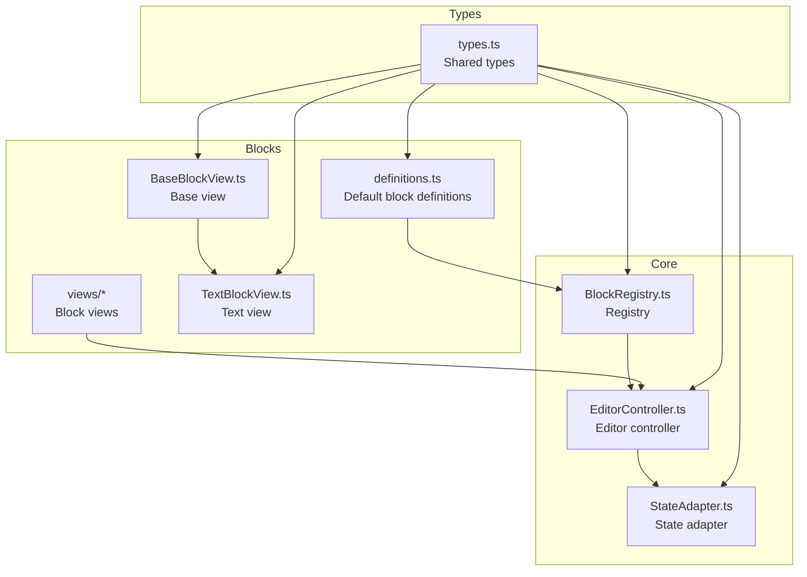
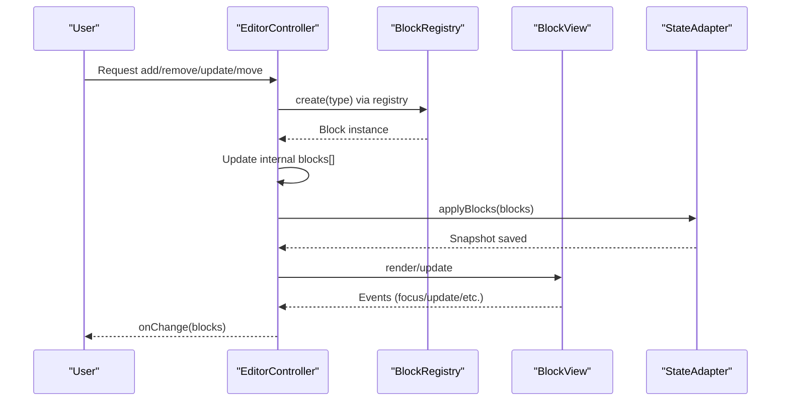
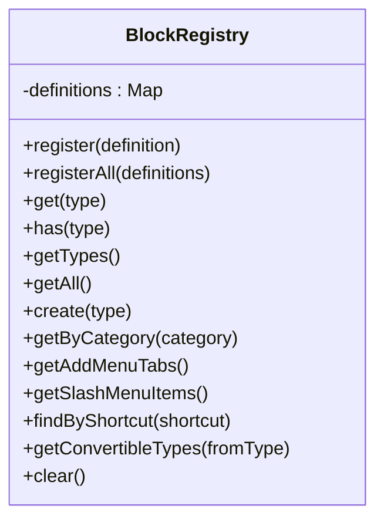
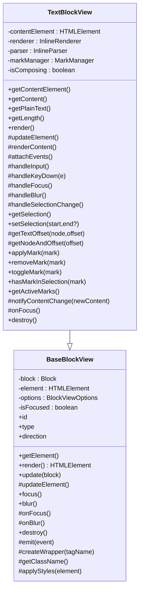
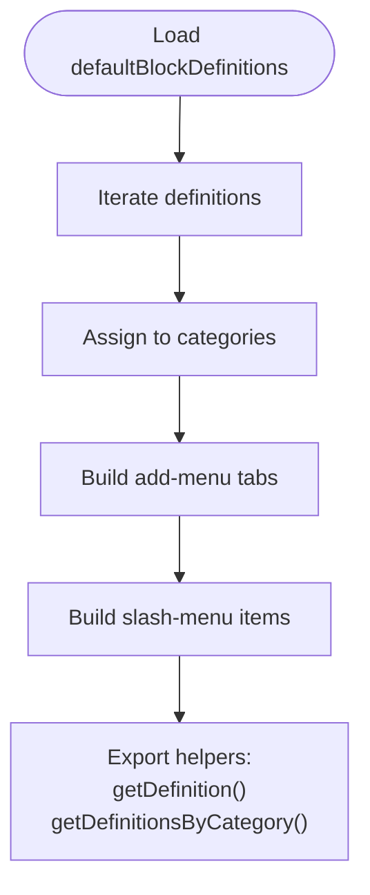
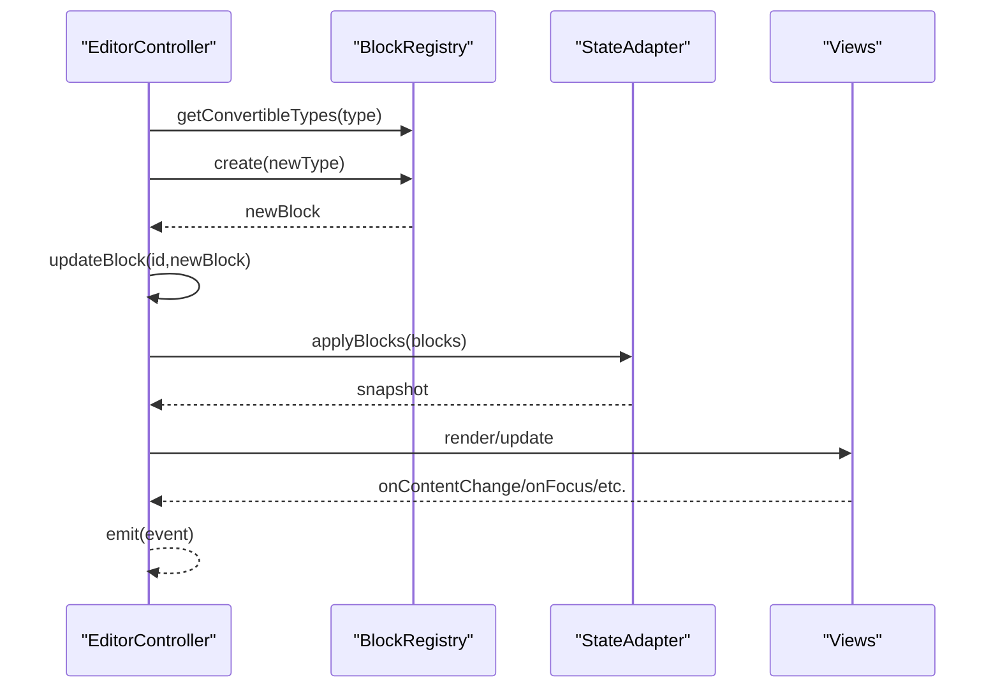
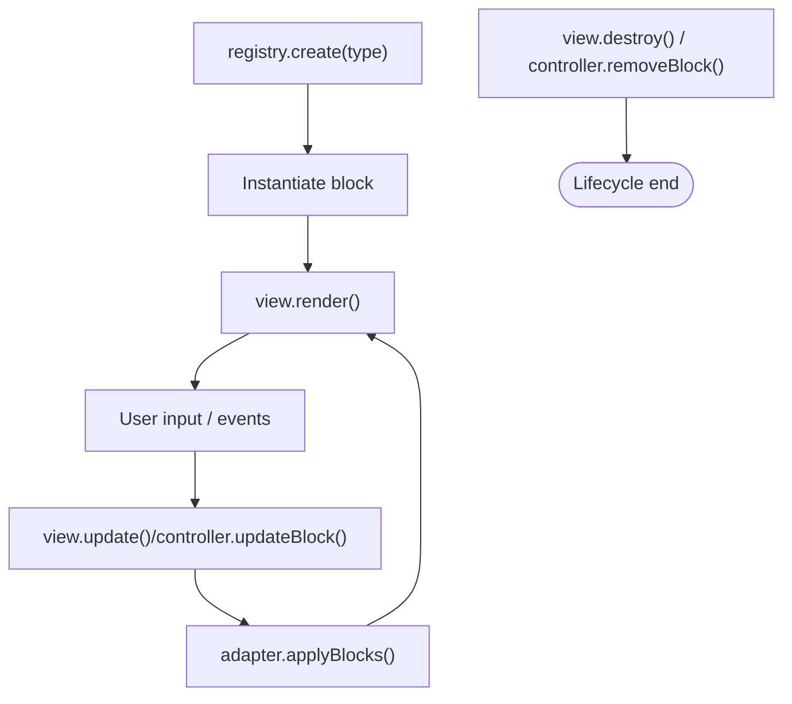
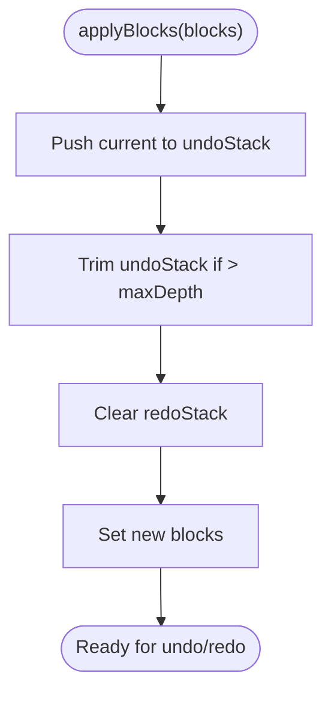
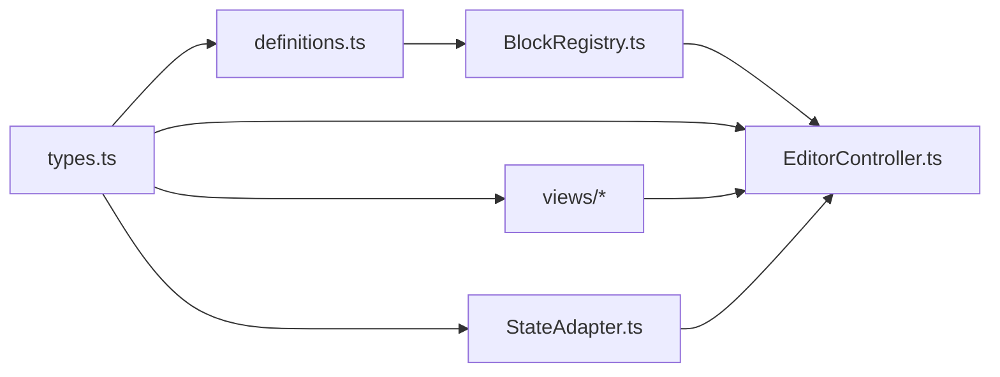

# Block System

<cite>
**Referenced Files in This Document**
- [index.ts](file://artoon-typer/src/blocks/index.ts)
- [definitions.ts](file://artoon-typer/src/blocks/definitions.ts)
- [BlockRegistry.ts](file://artoon-typer/src/core/BlockRegistry.ts)
- [EditorController.ts](file://artoon-typer/src/core/EditorController.ts)
- [BaseBlockView.ts](file://artoon-typer/src/blocks/views/BaseBlockView.ts)
- [TextBlockView.ts](file://artoon-typer/src/blocks/views/TextBlockView.ts)
- [types.ts](file://artoon-typer/src/types.ts)
- [StateAdapter.ts](file://artoon-typer/src/integration/StateAdapter.ts)
- [TextBlockView.test.ts](file://artoon-typer/tests/blocks/TextBlockView.test.ts)
- [definitions.test.ts](file://artoon-typer/tests/blocks/definitions.test.ts)
</cite>

## Table of Contents
1. [Introduction](#introduction)
2. [Project Structure](#project-structure)
3. [Core Components](#core-components)
4. [Architecture Overview](#architecture-overview)
5. [Detailed Component Analysis](#detailed-component-analysis)
6. [Dependency Analysis](#dependency-analysis)
7. [Performance Considerations](#performance-considerations)
8. [Troubleshooting Guide](#troubleshooting-guide)
9. [Conclusion](#conclusion)

## Introduction
This document explains the ARTOON block system architecture with a focus on the block registry mechanism, base block view patterns, and individual block implementations. It covers the block definition structure, view components for different block types (Text, Code, Lists, Tables, Meta, and others), inheritance hierarchy, instantiation and rendering pipeline, lifecycle management, state synchronization, and integration with the editor controller. Practical guidance is included for creating custom block types and implementing block views.

## Project Structure
The block system spans several modules:
- Block definitions: centralized in a single module exporting default definitions and helpers.
- Registry: central service managing block definitions and providing creation/conversion utilities.
- Views: base and specialized view classes for rendering and interacting with blocks.
- Editor controller: orchestrates blocks, selection, and state synchronization.
- Types: shared type definitions for blocks, views, and editor state.
- Integration: adapter bridging ARTOON-TYPER blocks and editor state/history.

**Diagram sources**
- [definitions.ts:1-589](file://artoon-typer/src/blocks/definitions.ts#L1-L589)
- [BlockRegistry.ts:1-174](file://artoon-typer/src/core/BlockRegistry.ts#L1-L174)
- [EditorController.ts:1-475](file://artoon-typer/src/core/EditorController.ts#L1-L475)
- [BaseBlockView.ts:1-205](file://artoon-typer/src/blocks/views/BaseBlockView.ts#L1-L205)
- [TextBlockView.ts:1-518](file://artoon-typer/src/blocks/views/TextBlockView.ts#L1-L518)
- [types.ts:1-654](file://artoon-typer/src/types.ts#L1-L654)
- [StateAdapter.ts:1-523](file://artoon-typer/src/integration/StateAdapter.ts#L1-L523)

**Section sources**
- [index.ts:1-53](file://artoon-typer/src/blocks/index.ts#L1-L53)
- [types.ts:1-654](file://artoon-typer/src/types.ts#L1-L654)

## Core Components
- Block definitions: define type, name, icon, category, keyboard shortcut, creation factory, and allowed conversions.
- BlockRegistry: stores definitions, resolves types, creates blocks, and exposes add-menu and slash-menu metadata.
- EditorController: manages block collection, selection, focus, history, and emits events; integrates with StateAdapter.
- BaseBlockView and specialized views: render blocks, manage DOM, handle events, and expose selection/mark APIs.
- StateAdapter: maintains undo/redo history and bridges blocks to editor state.

Key responsibilities:
- Registry: registration, lookup, creation, add-menu tabs, slash menu items, conversion types.
- Controller: block CRUD, conversion, direction toggling, focus navigation, selection management, history, event emission.
- Views: DOM creation/update, focus/blur, inline formatting, selection, and event propagation.
- Adapter: history stacks, state snapshots, and AST conversion helpers.

**Section sources**
- [definitions.ts:35-589](file://artoon-typer/src/blocks/definitions.ts#L35-L589)
- [BlockRegistry.ts:19-174](file://artoon-typer/src/core/BlockRegistry.ts#L19-L174)
- [EditorController.ts:27-475](file://artoon-typer/src/core/EditorController.ts#L27-L475)
- [BaseBlockView.ts:27-205](file://artoon-typer/src/blocks/views/BaseBlockView.ts#L27-L205)
- [TextBlockView.ts:50-518](file://artoon-typer/src/blocks/views/TextBlockView.ts#L50-L518)
- [StateAdapter.ts:52-523](file://artoon-typer/src/integration/StateAdapter.ts#L52-L523)

## Architecture Overview
The block system follows a layered architecture:
- Definitions layer: immutable block templates with factories.
- Registry layer: runtime manager for definitions and creation.
- Controller layer: orchestrates blocks, selection, and state.
- Views layer: renders and interacts with blocks.
- Adapter layer: manages history and editor state.

**Diagram sources**
- [EditorController.ts:118-195](file://artoon-typer/src/core/EditorController.ts#L118-L195)
- [BlockRegistry.ts:72-78](file://artoon-typer/src/core/BlockRegistry.ts#L72-L78)
- [StateAdapter.ts:134-148](file://artoon-typer/src/integration/StateAdapter.ts#L134-L148)

## Detailed Component Analysis

### Block Registry Mechanism
- Registration: register single or multiple definitions; overwrites existing types with a warning.
- Lookup: get by type, existence check, list all types and definitions.
- Creation: create a new block instance from a registered definition.
- Menus: derive add-menu tabs and slash-menu items from categories and definitions.
- Conversion: query allowed conversions for a block type.

**Diagram sources**
- [BlockRegistry.ts:19-174](file://artoon-typer/src/core/BlockRegistry.ts#L19-L174)

**Section sources**
- [BlockRegistry.ts:25-146](file://artoon-typer/src/core/BlockRegistry.ts#L25-L146)
- [definitions.ts:539-589](file://artoon-typer/src/blocks/definitions.ts#L539-L589)

### Base Block View Patterns
- BaseBlockView: common DOM wrapper, direction handling, focus/blur, update lifecycle, and meta-style/data application.
- TextBlockView: contenteditable wrapper, inline renderer/parser, mark manager integration, selection mapping, and keyboard shortcuts.

**Diagram sources**
- [BaseBlockView.ts:27-205](file://artoon-typer/src/blocks/views/BaseBlockView.ts#L27-L205)
- [TextBlockView.ts:50-518](file://artoon-typer/src/blocks/views/TextBlockView.ts#L50-L518)

**Section sources**
- [BaseBlockView.ts:33-203](file://artoon-typer/src/blocks/views/BaseBlockView.ts#L33-L203)
- [TextBlockView.ts:60-510](file://artoon-typer/src/blocks/views/TextBlockView.ts#L60-L510)

### Block Definition Structure and Categories
- Definition fields: type, name/nameAr, description, icon, category, shortcut, create factory, canConvertTo.
- Categories: text, list, media, advanced.
- Default definitions include text, lists, media, advanced (phase 3/4), and preformatted/line-break variants.

**Diagram sources**
- [definitions.ts:539-589](file://artoon-typer/src/blocks/definitions.ts#L539-L589)
- [BlockRegistry.ts:89-124](file://artoon-typer/src/core/BlockRegistry.ts#L89-L124)

**Section sources**
- [definitions.ts:35-589](file://artoon-typer/src/blocks/definitions.ts#L35-L589)
- [types.ts:27-67](file://artoon-typer/src/types.ts#L27-L67)

### Editor Controller Integration
- Initialization: constructs registry (default or custom), state adapter, and initializes blocks from config or importer.
- Block operations: add, remove, update, move, duplicate, convert, toggle direction.
- Focus and selection: focus block navigation, selection state management.
- History: undo/redo via adapter; onChange callback.
- Events: subscription and emission for add/remove/update/move/focus.

**Diagram sources**
- [EditorController.ts:218-282](file://artoon-typer/src/core/EditorController.ts#L218-L282)
- [StateAdapter.ts:134-148](file://artoon-typer/src/integration/StateAdapter.ts#L134-L148)

**Section sources**
- [EditorController.ts:36-67](file://artoon-typer/src/core/EditorController.ts#L36-L67)
- [EditorController.ts:118-293](file://artoon-typer/src/core/EditorController.ts#L118-L293)
- [EditorController.ts:366-422](file://artoon-typer/src/core/EditorController.ts#L366-L422)

### Block Lifecycle Management
- Creation: via registry.create() using definition.create().
- Rendering: view.render() creates DOM and attaches events.
- Updates: view.update() re-renders content; controller.updateBlock() persists changes.
- Focus: view.focus()/blur(); controller focus navigation.
- Destruction: view.destroy() removes DOM; controller may remove blocks.

**Diagram sources**
- [BlockRegistry.ts:72-78](file://artoon-typer/src/core/BlockRegistry.ts#L72-L78)
- [TextBlockView.ts:101-136](file://artoon-typer/src/blocks/views/TextBlockView.ts#L101-L136)
- [EditorController.ts:161-170](file://artoon-typer/src/core/EditorController.ts#L161-L170)
- [StateAdapter.ts:134-148](file://artoon-typer/src/integration/StateAdapter.ts#L134-L148)

**Section sources**
- [TextBlockView.ts:101-136](file://artoon-typer/src/blocks/views/TextBlockView.ts#L101-L136)
- [EditorController.ts:161-170](file://artoon-typer/src/core/EditorController.ts#L161-L170)

### State Synchronization
- History: StateAdapter maintains undo/redo stacks and trims depth.
- Snapshotting: applyBlocks saves previous state and clears redo stack on new changes.
- Conversion: blocks ↔ AST helpers for future integration.

**Diagram sources**
- [StateAdapter.ts:134-148](file://artoon-typer/src/integration/StateAdapter.ts#L134-L148)
- [StateAdapter.ts:42-47](file://artoon-typer/src/integration/StateAdapter.ts#L42-L47)

**Section sources**
- [StateAdapter.ts:52-148](file://artoon-typer/src/integration/StateAdapter.ts#L52-L148)

### Creating Custom Block Types
Steps:
1. Define a BlockDefinition with type, name, icon, category, shortcut (optional), create factory, and canConvertTo (optional).
2. Export the definition and add it to defaultBlockDefinitions.
3. Create a BlockView subclass extending BaseBlockView (or a specialized view) with render/updateElement and event handling.
4. Integrate with the registry (default or custom) and controller configuration.
5. Test with unit tests mirroring existing patterns.

References:
- Definition shape and helpers: [definitions.ts:469-488](file://artoon-typer/src/blocks/definitions.ts#L469-L488)
- Default definitions list: [definitions.ts:539-589](file://artoon-typer/src/blocks/definitions.ts#L539-L589)
- Base view pattern: [BaseBlockView.ts:27-205](file://artoon-typer/src/blocks/views/BaseBlockView.ts#L27-L205)
- Example tests for views and definitions: [TextBlockView.test.ts:1-403](file://artoon-typer/tests/blocks/TextBlockView.test.ts#L1-L403), [definitions.test.ts:1-442](file://artoon-typer/tests/blocks/definitions.test.ts#L1-L442)

**Section sources**
- [definitions.ts:469-589](file://artoon-typer/src/blocks/definitions.ts#L469-L589)
- [BaseBlockView.ts:27-205](file://artoon-typer/src/blocks/views/BaseBlockView.ts#L27-L205)
- [TextBlockView.test.ts:1-403](file://artoon-typer/tests/blocks/TextBlockView.test.ts#L1-L403)
- [definitions.test.ts:1-442](file://artoon-typer/tests/blocks/definitions.test.ts#L1-L442)

## Dependency Analysis
- Definitions depend on types and utility generation.
- Registry depends on definitions and exposes creation/conversion.
- Controller depends on Registry, StateAdapter, and types.
- Views depend on BaseBlockView and inline subsystems.
- Adapter depends on types and AST types.

**Diagram sources**
- [types.ts:1-654](file://artoon-typer/src/types.ts#L1-L654)
- [definitions.ts:1-589](file://artoon-typer/src/blocks/definitions.ts#L1-L589)
- [BlockRegistry.ts:1-174](file://artoon-typer/src/core/BlockRegistry.ts#L1-L174)
- [EditorController.ts:1-475](file://artoon-typer/src/core/EditorController.ts#L1-L475)
- [StateAdapter.ts:1-523](file://artoon-typer/src/integration/StateAdapter.ts#L1-L523)

**Section sources**
- [types.ts:1-654](file://artoon-typer/src/types.ts#L1-L654)
- [BlockRegistry.ts:1-174](file://artoon-typer/src/core/BlockRegistry.ts#L1-L174)
- [EditorController.ts:1-475](file://artoon-typer/src/core/EditorController.ts#L1-L475)
- [StateAdapter.ts:1-523](file://artoon-typer/src/integration/StateAdapter.ts#L1-L523)

## Performance Considerations
- Minimize DOM updates: batch view updates and avoid unnecessary re-renders.
- Efficient selection mapping: cache offsets and use tree walkers judiciously.
- History depth: keep undo/redo stacks bounded to limit memory usage.
- Inline parsing/rendering: reuse renderer/parser instances per view where appropriate.

## Troubleshooting Guide
Common issues and resolutions:
- Unknown block type: ensure the type is registered; registry throws on unknown types during creation.
- Conversion not allowed: verify canConvertTo includes the target type; otherwise, conversion is ignored with a warning.
- Focus/selection anomalies: confirm contentEditable state and selection boundaries; ensure proper event attachment.
- History not working: check adapter.applyBlocks() is called after block updates; ensure undo/redo stacks are not exhausted.

**Section sources**
- [BlockRegistry.ts:72-78](file://artoon-typer/src/core/BlockRegistry.ts#L72-L78)
- [EditorController.ts:222-227](file://artoon-typer/src/core/EditorController.ts#L222-L227)
- [TextBlockView.ts:158-173](file://artoon-typer/src/blocks/views/TextBlockView.ts#L158-L173)
- [StateAdapter.ts:134-148](file://artoon-typer/src/integration/StateAdapter.ts#L134-L148)

## Conclusion
The ARTOON block system provides a robust, extensible framework centered on a registry-managed definition layer, a controller-driven lifecycle, and view-based rendering with inline formatting support. The architecture cleanly separates concerns, supports custom block types, and integrates with editor state through a dedicated adapter. Following the patterns outlined here enables reliable extension and maintenance of the block ecosystem.