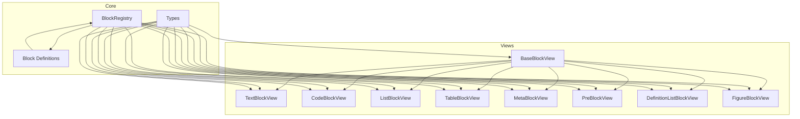
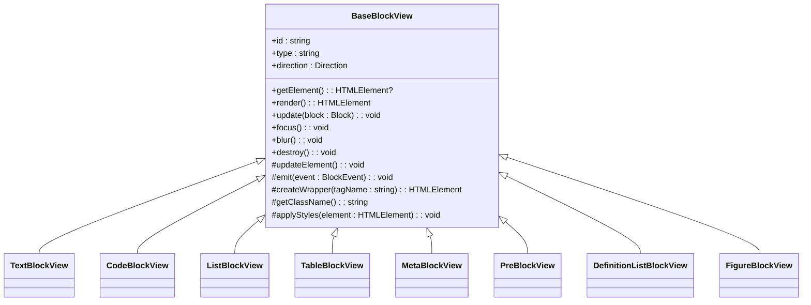
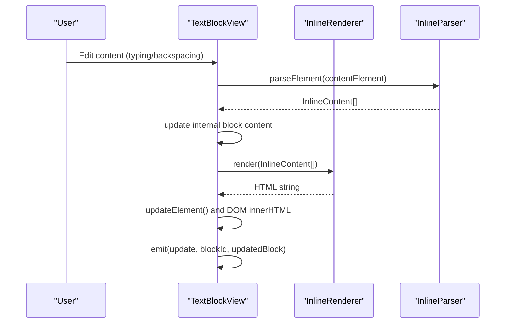
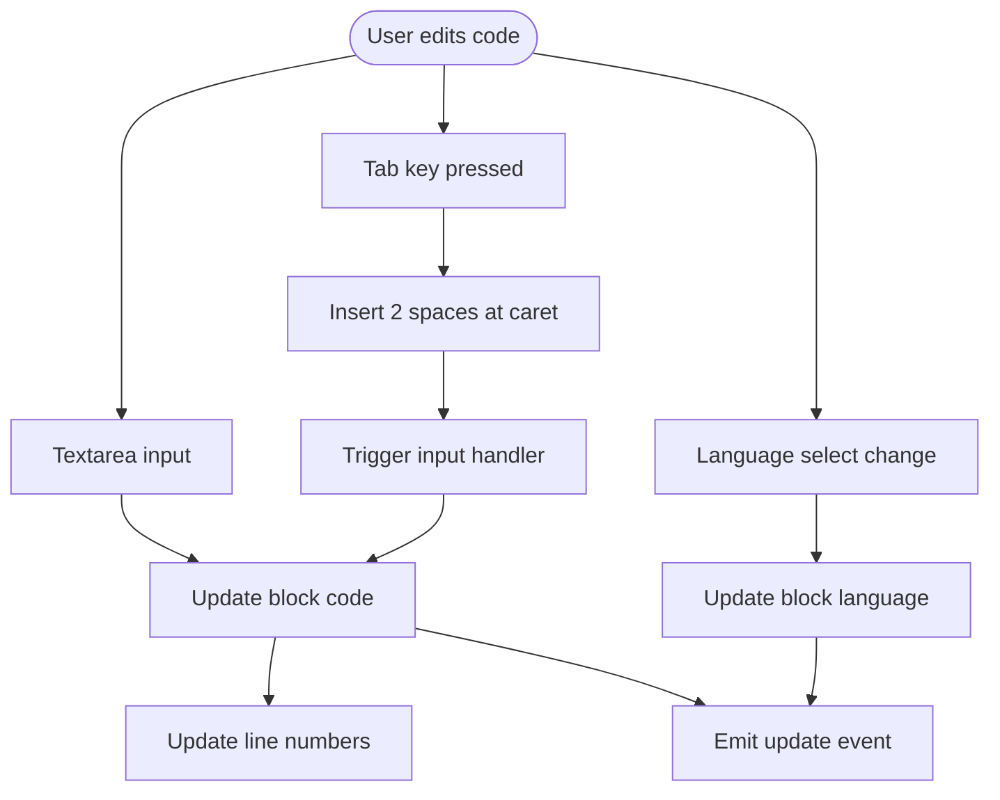
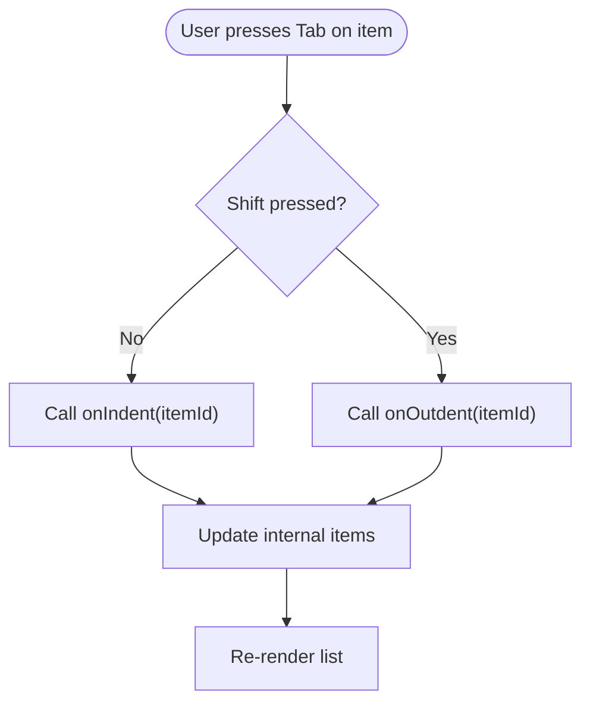
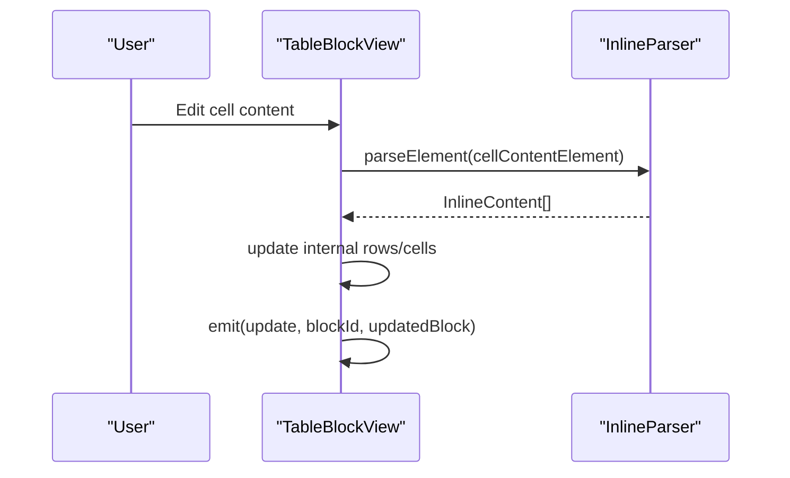
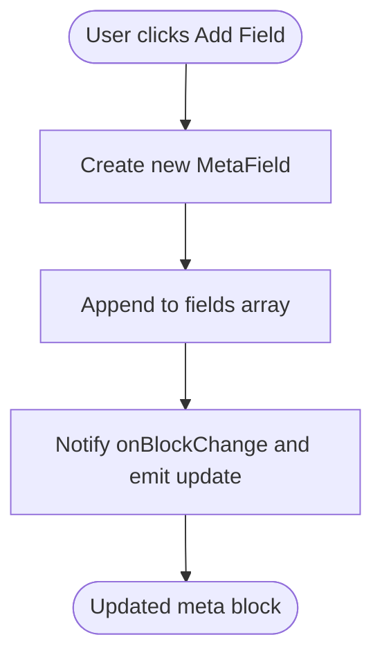
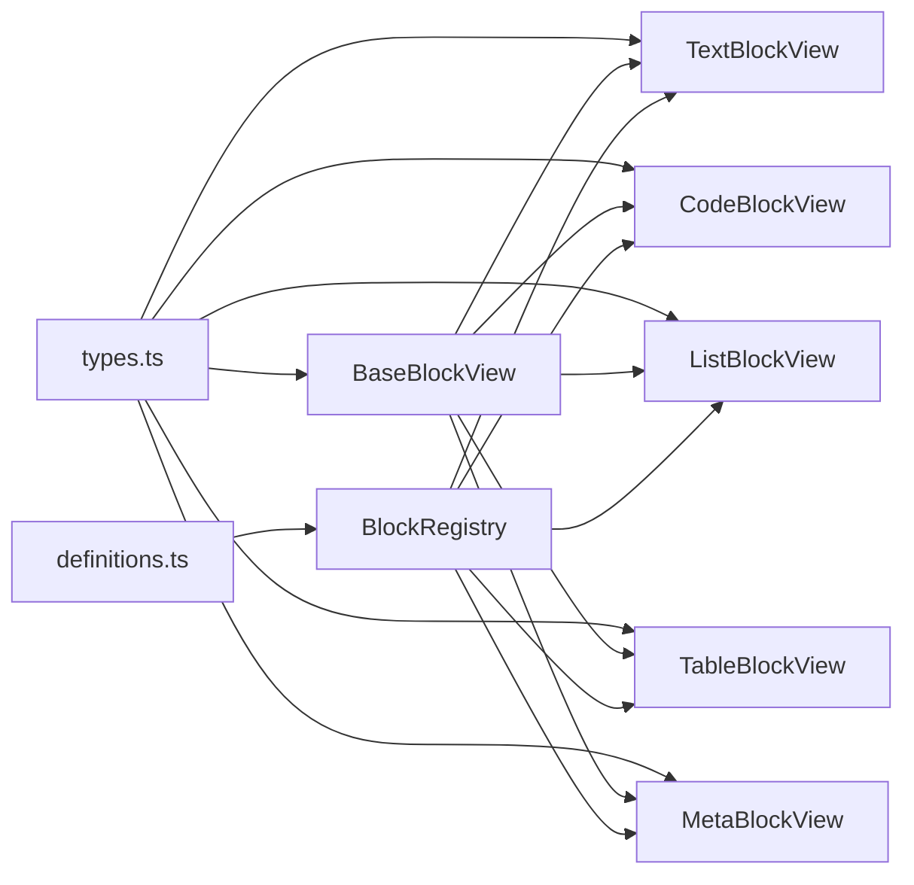

# Block Views

<cite>
**Referenced Files in This Document**
- [BaseBlockView.ts](file://artoon-typer/src/blocks/views/BaseBlockView.ts)
- [TextBlockView.ts](file://artoon-typer/src/blocks/views/TextBlockView.ts)
- [CodeBlockView.ts](file://artoon-typer/src/blocks/views/CodeBlockView.ts)
- [ListBlockView.ts](file://artoon-typer/src/blocks/views/ListBlockView.ts)
- [TableBlockView.ts](file://artoon-typer/src/blocks/views/TableBlockView.ts)
- [MetaBlockView.ts](file://artoon-typer/src/blocks/views/MetaBlockView.ts)
- [PreBlockView.ts](file://artoon-typer/src/blocks/views/PreBlockView.ts)
- [DefinitionListBlockView.ts](file://artoon-typer/src/blocks/views/DefinitionListBlockView.ts)
- [FigureBlockView.ts](file://artoon-typer/src/blocks/views/FigureBlockView.ts)
- [index.ts](file://artoon-typer/src/blocks/views/index.ts)
- [BlockRegistry.ts](file://artoon-typer/src/core/BlockRegistry.ts)
- [definitions.ts](file://artoon-typer/src/blocks/definitions.ts)
- [types.ts](file://artoon-typer/src/types.ts)
- [TextBlockView.test.ts](file://artoon-typer/tests/blocks/TextBlockView.test.ts)
- [CodeBlockView.test.ts](file://artoon-typer/tests/blocks/CodeBlockView.test.ts)
- [MetaBlockView.test.ts](file://artoon-typer/tests/blocks/MetaBlockView.test.ts)
</cite>

## Table of Contents
1. [Introduction](#introduction)
2. [Project Structure](#project-structure)
3. [Core Components](#core-components)
4. [Architecture Overview](#architecture-overview)
5. [Detailed Component Analysis](#detailed-component-analysis)
6. [Dependency Analysis](#dependency-analysis)
7. [Performance Considerations](#performance-considerations)
8. [Troubleshooting Guide](#troubleshooting-guide)
9. [Conclusion](#conclusion)
10. [Appendices](#appendices)

## Introduction
This document explains the ARTOON block view system architecture with a focus on the BaseBlockView class and its inheritance hierarchy. It documents the common view interface, lifecycle methods, rendering patterns, and state synchronization with the editor. It also covers individual block view implementations for text, code, lists, tables, and metadata, along with the view registration mechanism, DOM manipulation patterns, event handling, and practical guidance for creating custom block views.

## Project Structure
The block view system resides under the editor’s TypeScript package and is organized by feature:
- views: BaseBlockView and concrete block view implementations
- definitions: Built-in block definitions used by the registry
- BlockRegistry: Central registry for block types and creation
- types: Shared block and event types used across the system
- tests: Unit tests validating behavior and rendering

**Diagram sources**
- [BaseBlockView.ts:27-204](file://artoon-typer/src/blocks/views/BaseBlockView.ts#L27-L204)
- [TextBlockView.ts:50-517](file://artoon-typer/src/blocks/views/TextBlockView.ts#L50-L517)
- [CodeBlockView.ts:35-346](file://artoon-typer/src/blocks/views/CodeBlockView.ts#L35-L346)
- [ListBlockView.ts:34-487](file://artoon-typer/src/blocks/views/ListBlockView.ts#L34-L487)
- [TableBlockView.ts:33-410](file://artoon-typer/src/blocks/views/TableBlockView.ts#L33-L410)
- [MetaBlockView.ts:40-292](file://artoon-typer/src/blocks/views/MetaBlockView.ts#L40-L292)
- [PreBlockView.ts:30-222](file://artoon-typer/src/blocks/views/PreBlockView.ts#L30-L222)
- [DefinitionListBlockView.ts:26-248](file://artoon-typer/src/blocks/views/DefinitionListBlockView.ts#L26-L248)
- [FigureBlockView.ts:27-288](file://artoon-typer/src/blocks/views/FigureBlockView.ts#L27-L288)
- [BlockRegistry.ts:19-146](file://artoon-typer/src/core/BlockRegistry.ts#L19-L146)
- [definitions.ts:539-588](file://artoon-typer/src/blocks/definitions.ts#L539-L588)
- [types.ts:27-386](file://artoon-typer/src/types.ts#L27-L386)

**Section sources**
- [index.ts:7-31](file://artoon-typer/src/blocks/views/index.ts#L7-L31)
- [BlockRegistry.ts:19-146](file://artoon-typer/src/core/BlockRegistry.ts#L19-L146)
- [definitions.ts:539-588](file://artoon-typer/src/blocks/definitions.ts#L539-L588)
- [types.ts:27-386](file://artoon-typer/src/types.ts#L27-L386)

## Core Components
- BaseBlockView: Abstract base class defining the common view contract, lifecycle, DOM wrapper creation, and event emission.
- Concrete block views: Specialized implementations for text, code, lists, tables, metadata, preformatted text, definition lists, and figures.
- BlockRegistry: Central registry for block definitions, creation, and menu/tab generation.
- Block definitions: Default definitions for built-in blocks, including metadata and conversion capabilities.
- Types: Strongly typed block shapes, selection state, events, and block categories.

Key responsibilities:
- BaseBlockView: Manage element lifecycle, focus/blur, class/style application, and event propagation.
- Concrete views: Implement rendering, inline parsing/formatting, keyboard handling, and block-specific operations.
- Registry: Provide block creation, category filtering, and menu/tab construction.
- Types: Define shapes and contracts ensuring consistency across views and editor state.

**Section sources**
- [BaseBlockView.ts:27-204](file://artoon-typer/src/blocks/views/BaseBlockView.ts#L27-L204)
- [BlockRegistry.ts:19-146](file://artoon-typer/src/core/BlockRegistry.ts#L19-L146)
- [definitions.ts:539-588](file://artoon-typer/src/blocks/definitions.ts#L539-L588)
- [types.ts:27-386](file://artoon-typer/src/types.ts#L27-L386)

## Architecture Overview
The block view architecture follows a layered design:
- BaseBlockView defines the common interface and DOM wrapper.
- Concrete views extend BaseBlockView and implement rendering and interaction specifics.
- BlockRegistry centralizes block definitions and creation.
- Types define the shapes and contracts used by views and the editor.

**Diagram sources**
- [BaseBlockView.ts:27-204](file://artoon-typer/src/blocks/views/BaseBlockView.ts#L27-L204)
- [TextBlockView.ts:50-517](file://artoon-typer/src/blocks/views/TextBlockView.ts#L50-L517)
- [CodeBlockView.ts:35-346](file://artoon-typer/src/blocks/views/CodeBlockView.ts#L35-L346)
- [ListBlockView.ts:34-487](file://artoon-typer/src/blocks/views/ListBlockView.ts#L34-L487)
- [TableBlockView.ts:33-410](file://artoon-typer/src/blocks/views/TableBlockView.ts#L33-L410)
- [MetaBlockView.ts:40-292](file://artoon-typer/src/blocks/views/MetaBlockView.ts#L40-L292)
- [PreBlockView.ts:30-222](file://artoon-typer/src/blocks/views/PreBlockView.ts#L30-L222)
- [DefinitionListBlockView.ts:26-248](file://artoon-typer/src/blocks/views/DefinitionListBlockView.ts#L26-L248)
- [FigureBlockView.ts:27-288](file://artoon-typer/src/blocks/views/FigureBlockView.ts#L27-L288)

## Detailed Component Analysis

### BaseBlockView: Common Interface and Lifecycle
- Purpose: Provide a shared foundation for all block views.
- Key methods:
  - render(): Creates the root wrapper and returns the element.
  - update(block): Updates internal state and re-renders via updateElement().
  - focus()/blur(): Manages focused state and applies/removes CSS classes.
  - destroy(): Removes the element from the DOM.
  - createWrapper(): Builds the root element with standardized attributes and classes.
  - getClassName(): Computes CSS classes based on block type, direction, focus, read-only, and meta-provided classes.
  - applyStyles(): Applies inline styles and data attributes from block meta.
  - emit(): Propagates BlockEvent to the editor.

Lifecycle pattern:
- Construct with BlockViewOptions.
- render() builds the DOM and attaches event listeners.
- update() refreshes content and attributes.
- destroy() cleans up listeners and removes the element.

**Section sources**
- [BaseBlockView.ts:27-204](file://artoon-typer/src/blocks/views/BaseBlockView.ts#L27-L204)

### TextBlockView: Text-Based Blocks
- Scope: Paragraphs, headings, and quotes.
- Rendering: Creates a content element mapped to semantic tags (p, h1-h6, blockquote).
- Editing: contentEditable with placeholder support; tracks selection offsets and plain text length.
- Events: Handles input, keydown (Enter, Backspace, Delete, formatting shortcuts), composition events, and selection changes.
- Formatting: Uses InlineRenderer and InlineParser to convert between DOM and inline content; MarkManager for mark toggling.
- Focus: Programmatically focuses the content element; supports focusAtStart/focusAtEnd/focusAt.

**Diagram sources**
- [TextBlockView.ts:178-195](file://artoon-typer/src/blocks/views/TextBlockView.ts#L178-L195)
- [TextBlockView.ts:141-153](file://artoon-typer/src/blocks/views/TextBlockView.ts#L141-L153)

**Section sources**
- [TextBlockView.ts:50-517](file://artoon-typer/src/blocks/views/TextBlockView.ts#L50-L517)
- [TextBlockView.test.ts:172-207](file://artoon-typer/tests/blocks/TextBlockView.test.ts#L172-L207)

### CodeBlockView: Code Syntax Highlighting
- Scope: Code blocks with language selection, line numbers, and copy-to-clipboard.
- Rendering: Header with language selector and copy button; textarea for code editing.
- Events: Handles input, language change, Tab insertion (2 spaces), and scroll synchronization for line numbers.
- Focus: Focuses the textarea; supports focusAtStart/focusAtEnd.

**Diagram sources**
- [CodeBlockView.ts:208-226](file://artoon-typer/src/blocks/views/CodeBlockView.ts#L208-L226)
- [CodeBlockView.ts:231-247](file://artoon-typer/src/blocks/views/CodeBlockView.ts#L231-L247)
- [CodeBlockView.ts:252-267](file://artoon-typer/src/blocks/views/CodeBlockView.ts#L252-L267)

**Section sources**
- [CodeBlockView.ts:35-346](file://artoon-typer/src/blocks/views/CodeBlockView.ts#L35-L346)
- [CodeBlockView.test.ts:208-236](file://artoon-typer/tests/blocks/CodeBlockView.test.ts#L208-L236)

### ListBlockView: List Management
- Scope: Bullet lists and numbered lists with nested items.
- Rendering: Recursively renders nested lists; each item is contentEditable.
- Events: Handles Enter (add item), Backspace at start (remove item), Tab (indent), Shift+Tab (outdent).
- Operations: addItemAfter, removeItem, updateItemContent, indentItem, outdentItem with recursive tree traversal.

**Diagram sources**
- [ListBlockView.ts:193-232](file://artoon-typer/src/blocks/views/ListBlockView.ts#L193-L232)
- [ListBlockView.ts:334-356](file://artoon-typer/src/blocks/views/ListBlockView.ts#L334-L356)

**Section sources**
- [ListBlockView.ts:34-487](file://artoon-typer/src/blocks/views/ListBlockView.ts#L34-L487)

### TableBlockView: Table Editing
- Scope: Editable tables with rows and cells.
- Rendering: Creates thead/tbody depending on hasHeader; each cell is contentEditable.
- Events: Handles Tab navigation, Shift+Tab previous cell, Ctrl+Arrow vertical navigation.
- Operations: addRow/removeRow/addColumn/removeColumn/updateCellContent; maintains focus state.

**Diagram sources**
- [TableBlockView.ts:205-217](file://artoon-typer/src/blocks/views/TableBlockView.ts#L205-L217)

**Section sources**
- [TableBlockView.ts:33-410](file://artoon-typer/src/blocks/views/TableBlockView.ts#L33-L410)

### MetaBlockView: Metadata Handling
- Scope: Document metadata key-value pairs.
- Rendering: Header, fields grid with name/value inputs, optional delete buttons, and an add-field button.
- Suggestions: Optional datalist of predefined field names.
- Operations: addField, deleteField (ensures at least one field), updateField, getFieldByName, toJSONLD export.

**Diagram sources**
- [MetaBlockView.ts:211-220](file://artoon-typer/src/blocks/views/MetaBlockView.ts#L211-L220)
- [MetaBlockView.ts:264-274](file://artoon-typer/src/blocks/views/MetaBlockView.ts#L264-L274)

**Section sources**
- [MetaBlockView.ts:40-292](file://artoon-typer/src/blocks/views/MetaBlockView.ts#L40-L292)
- [MetaBlockView.test.ts:117-166](file://artoon-typer/tests/blocks/MetaBlockView.test.ts#L117-L166)

### Supporting Views
- PreBlockView: Preformatted text with monospace font, preserved whitespace, and paste-as-plain-text behavior.
- DefinitionListBlockView: dl/dt/dd pairs with inline formatting per term/definition.
- FigureBlockView: Media blocks with captions and optional upload area.

**Section sources**
- [PreBlockView.ts:30-222](file://artoon-typer/src/blocks/views/PreBlockView.ts#L30-L222)
- [DefinitionListBlockView.ts:26-248](file://artoon-typer/src/blocks/views/DefinitionListBlockView.ts#L26-L248)
- [FigureBlockView.ts:27-288](file://artoon-typer/src/blocks/views/FigureBlockView.ts#L27-L288)

## Dependency Analysis
- BaseBlockView depends on Block and Direction types and emits BlockEvent.
- Concrete views depend on InlineRenderer, InlineParser, and MarkManager for text formatting.
- BlockRegistry depends on BlockDefinition and exposes creation, categorization, and menu/tab APIs.
- Block definitions provide default block factories and conversion metadata.

**Diagram sources**
- [types.ts:27-386](file://artoon-typer/src/types.ts#L27-L386)
- [BaseBlockView.ts:27-204](file://artoon-typer/src/blocks/views/BaseBlockView.ts#L27-L204)
- [TextBlockView.ts:50-517](file://artoon-typer/src/blocks/views/TextBlockView.ts#L50-L517)
- [CodeBlockView.ts:35-346](file://artoon-typer/src/blocks/views/CodeBlockView.ts#L35-L346)
- [ListBlockView.ts:34-487](file://artoon-typer/src/blocks/views/ListBlockView.ts#L34-L487)
- [TableBlockView.ts:33-410](file://artoon-typer/src/blocks/views/TableBlockView.ts#L33-L410)
- [MetaBlockView.ts:40-292](file://artoon-typer/src/blocks/views/MetaBlockView.ts#L40-L292)
- [definitions.ts:539-588](file://artoon-typer/src/blocks/definitions.ts#L539-L588)
- [BlockRegistry.ts:19-146](file://artoon-typer/src/core/BlockRegistry.ts#L19-L146)

**Section sources**
- [types.ts:27-386](file://artoon-typer/src/types.ts#L27-L386)
- [BlockRegistry.ts:19-146](file://artoon-typer/src/core/BlockRegistry.ts#L19-L146)
- [definitions.ts:539-588](file://artoon-typer/src/blocks/definitions.ts#L539-L588)

## Performance Considerations
- Minimize DOM updates: Prefer targeted re-rendering (e.g., updateElement) and avoid full re-renders when unnecessary.
- Debounce/pause heavy operations during rapid input (e.g., paste or composition).
- Use efficient tree walking for selection calculations in TextBlockView.
- Avoid excessive event listener attachments; reuse handlers and detach on destroy.
- For tables and lists, batch updates to internal arrays before re-rendering.

## Troubleshooting Guide
Common issues and resolutions:
- Events not firing: Ensure render() was called and the element is attached to the DOM before simulating events in tests.
- Inline formatting not applied: Verify InlineRenderer/Parser are configured correctly and contentEditable is enabled.
- Focus not working: Confirm onFocus() is overridden appropriately and contentEditable element exists.
- Styles/data attributes missing: Check block.meta.style and block.meta.data are present and applyStyles() is invoked.
- Registry errors: Use getDefaultRegistry() to auto-register default definitions; verify block types exist before creation.

**Section sources**
- [TextBlockView.test.ts:290-320](file://artoon-typer/tests/blocks/TextBlockView.test.ts#L290-L320)
- [CodeBlockView.test.ts:208-236](file://artoon-typer/tests/blocks/CodeBlockView.test.ts#L208-L236)
- [MetaBlockView.test.ts:117-166](file://artoon-typer/tests/blocks/MetaBlockView.test.ts#L117-L166)

## Conclusion
The ARTOON block view system provides a robust, extensible foundation for rendering and editing diverse block types. BaseBlockView encapsulates common concerns, while specialized views implement domain-specific behaviors. The BlockRegistry and definitions enable easy registration and discovery of block types. Together, these components support rich editing experiences with strong typing, lifecycle safety, and clear separation of concerns.

## Appendices

### View Registration Mechanism
- BlockRegistry registers BlockDefinition instances and exposes:
  - register()/registerAll() to add definitions
  - get()/has() to retrieve definitions
  - create() to instantiate blocks
  - getByCategory(), getAddMenuTabs(), getSlashMenuItems(), findByShortcut()
  - getConvertibleTypes() and clear()

- Default definitions are auto-registered via getDefaultRegistry().

**Section sources**
- [BlockRegistry.ts:19-146](file://artoon-typer/src/core/BlockRegistry.ts#L19-L146)
- [definitions.ts:539-588](file://artoon-typer/src/blocks/definitions.ts#L539-L588)

### Creating Custom Block Views
Steps:
- Extend BaseBlockView and implement render() and updateElement().
- Attach event listeners for user interactions.
- Use createWrapper() for consistent root element attributes and classes.
- Apply styles via applyStyles() and emit() for state synchronization.
- Integrate with BlockRegistry by adding a BlockDefinition and registering it.

Patterns:
- Use InlineRenderer/InlineParser for inline content in text-like blocks.
- For complex structures (lists, tables), manage nested DOM elements and maintain selection focus.
- Respect readOnly flag and disable interactive elements when true.

**Section sources**
- [BaseBlockView.ts:27-204](file://artoon-typer/src/blocks/views/BaseBlockView.ts#L27-L204)
- [TextBlockView.ts:50-517](file://artoon-typer/src/blocks/views/TextBlockView.ts#L50-L517)
- [ListBlockView.ts:34-487](file://artoon-typer/src/blocks/views/ListBlockView.ts#L34-L487)
- [TableBlockView.ts:33-410](file://artoon-typer/src/blocks/views/TableBlockView.ts#L33-L410)
- [MetaBlockView.ts:40-292](file://artoon-typer/src/blocks/views/MetaBlockView.ts#L40-L292)