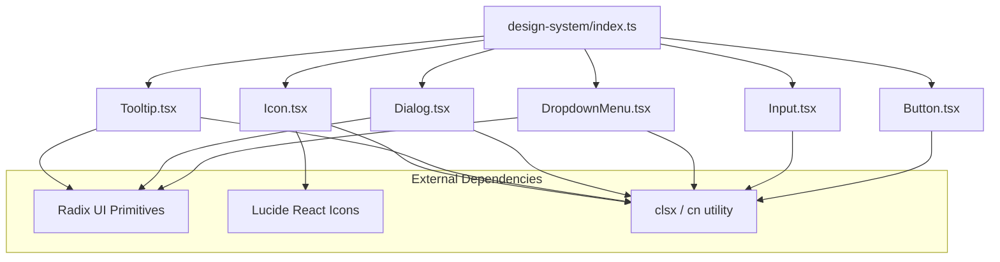
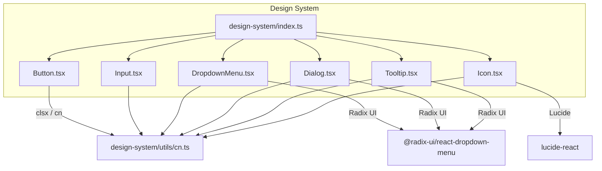
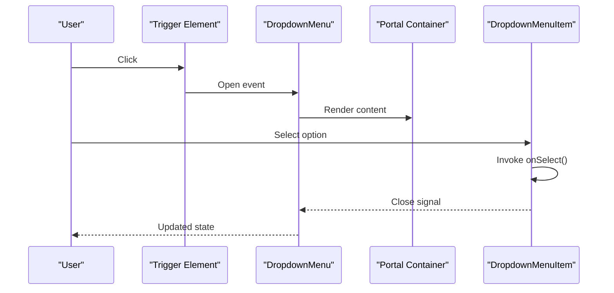
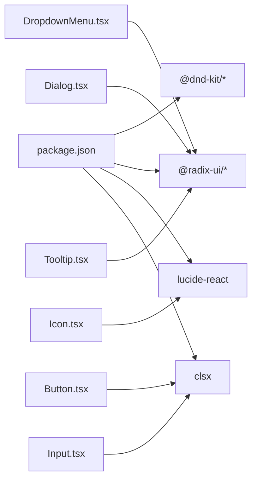

# Component Library

<cite>
**Referenced Files in This Document**
- [design-system/index.ts](file://artoon-typer/src/design-system/index.ts)
- [DropdownMenu.tsx](file://artoon-typer/src/design-system/components/DropdownMenu/DropdownMenu.tsx)
- [DropdownMenu/index.ts](file://artoon-typer/src/design-system/components/DropdownMenu/index.ts)
- [Icon.tsx](file://artoon-typer/src/design-system/components/Icon/Icon.tsx)
- [Button.tsx](file://artoon-typer/src/design-system/components/Button/Button.tsx)
- [Input.tsx](file://artoon-typer/src/design-system/components/Input/Input.tsx)
- [Tooltip.tsx](file://artoon-typer/src/design-system/components/Tooltip/Tooltip.tsx)
- [Dialog.tsx](file://artoon-typer/src/design-system/components/Dialog/Dialog.tsx)
- [package.json](file://artoon-typer/package.json)
</cite>

## Table of Contents
1. [Introduction](#introduction)
2. [Project Structure](#project-structure)
3. [Core Components](#core-components)
4. [Architecture Overview](#architecture-overview)
5. [Detailed Component Analysis](#detailed-component-analysis)
6. [Dependency Analysis](#dependency-analysis)
7. [Performance Considerations](#performance-considerations)
8. [Troubleshooting Guide](#troubleshooting-guide)
9. [Conclusion](#conclusion)

## Introduction
This document describes the ARTOON Design System component library used in the ARTOON Typer editor. It focuses on the core UI components: Button, Input, Dialog, DropdownMenu, Icon, and Tooltip. For each component, we outline props, styling options, composition patterns, accessibility features, responsive behavior, theming, and integration with the design system. The goal is to help developers use, customize, and extend these components effectively while maintaining consistency with the ARTOON design language.

## Project Structure
The design system is organized under the design-system module and exposes components via a central index. Components are grouped by feature area and export both the component and its TypeScript types. The package declares external dependencies for primitives and icons.

**Diagram sources**
- [design-system/index.ts:12-18](file://artoon-typer/src/design-system/index.ts#L12-L18)
- [DropdownMenu.tsx:1-10](file://artoon-typer/src/design-system/components/DropdownMenu/DropdownMenu.tsx#L1-L10)
- [Icon.tsx:1-10](file://artoon-typer/src/design-system/components/Icon/Icon.tsx#L1-L10)
- [Button.tsx](file://artoon-typer/src/design-system/components/Button/Button.tsx)
- [Input.tsx](file://artoon-typer/src/design-system/components/Input/Input.tsx)
- [Tooltip.tsx](file://artoon-typer/src/design-system/components/Tooltip/Tooltip.tsx)
- [Dialog.tsx](file://artoon-typer/src/design-system/components/Dialog/Dialog.tsx)
- [package.json:29-44](file://artoon-typer/package.json#L29-L44)

**Section sources**
- [design-system/index.ts:12-18](file://artoon-typer/src/design-system/index.ts#L12-L18)
- [package.json:29-44](file://artoon-typer/package.json#L29-L44)

## Core Components
This section summarizes the six components exposed by the design system and their primary responsibilities.

- Button: A styled button with consistent spacing, typography, and focus states. Supports variants, sizes, and disabled states.
- Input: A controlled text input with validation support, placeholder, and optional adornments.
- Dialog: A modal overlay built on Radix UI Dialog primitives, supporting overlays, focus trapping, and keyboard navigation.
- DropdownMenu: A menu triggered by a child element, rendering items with optional icons, shortcuts, separators, and danger actions.
- Icon: A wrapper around Lucide React icons that standardizes sizing and color, with an accessible aria-hidden flag.
- Tooltip: A lightweight popover tooltip built on Radix UI Popover primitives.

Integration pattern:
- Components are re-exported from the design-system index for easy consumption.
- Styling is applied via dedicated CSS modules and utility classes.
- Accessibility is ensured by leveraging Radix UI primitives and semantic markup.

**Section sources**
- [design-system/index.ts:12-18](file://artoon-typer/src/design-system/index.ts#L12-L18)
- [Button.tsx](file://artoon-typer/src/design-system/components/Button/Button.tsx)
- [Input.tsx](file://artoon-typer/src/design-system/components/Input/Input.tsx)
- [Dialog.tsx](file://artoon-typer/src/design-system/components/Dialog/Dialog.tsx)
- [DropdownMenu.tsx:1-10](file://artoon-typer/src/design-system/components/DropdownMenu/DropdownMenu.tsx#L1-L10)
- [Icon.tsx:1-10](file://artoon-typer/src/design-system/components/Icon/Icon.tsx#L1-L10)
- [Tooltip.tsx](file://artoon-typer/src/design-system/components/Tooltip/Tooltip.tsx)

## Architecture Overview
The design system composes React components with Radix UI primitives and Lucide icons. Styling is handled through modular CSS and a shared cn utility for conditional class merging. Consumers import components from the design system index and apply design tokens and CSS variables for theming.

**Diagram sources**
- [design-system/index.ts:6-18](file://artoon-typer/src/design-system/index.ts#L6-L18)
- [DropdownMenu.tsx:6-9](file://artoon-typer/src/design-system/components/DropdownMenu/DropdownMenu.tsx#L6-L9)
- [Icon.tsx:6-8](file://artoon-typer/src/design-system/components/Icon/Icon.tsx#L6-L8)
- [Button.tsx](file://artoon-typer/src/design-system/components/Button/Button.tsx)
- [Input.tsx](file://artoon-typer/src/design-system/components/Input/Input.tsx)
- [Tooltip.tsx](file://artoon-typer/src/design-system/components/Tooltip/Tooltip.tsx)
- [Dialog.tsx](file://artoon-typer/src/design-system/components/Dialog/Dialog.tsx)
- [package.json:34-42](file://artoon-typer/package.json#L34-L42)

## Detailed Component Analysis

### Button
- Purpose: Primary action affordance with consistent styling and focus management.
- Props:
  - variant: visual emphasis (e.g., solid, outline, ghost)
  - size: dimension scale (e.g., sm, md, lg)
  - disabled: boolean to disable interaction
  - children: node content
  - className: additional CSS class names
  - onClick: handler for click events
- Styling and Theming:
  - Uses design tokens and CSS variables for colors, spacing, and typography.
  - Supports dark/light theme via CSS custom properties.
- Accessibility:
  - Inherits native button semantics; disabled state prevents interaction.
- Composition:
  - Can be composed with Icon for icon-button variants.
- Responsive Behavior:
  - Padding and font-size adjust per size; layout remains compact across breakpoints.
- Usage Examples:
  - Primary CTA with icon
  - Secondary outline button
  - Disabled state for unavailable actions
  - Small ghost button for contextual actions

**Section sources**
- [Button.tsx](file://artoon-typer/src/design-system/components/Button/Button.tsx)

### Input
- Purpose: Text input field with validation and optional adornments.
- Props:
  - value: controlled value
  - onChange: handler for input change
  - placeholder: hint text
  - error: boolean to indicate invalid state
  - disabled: boolean to disable editing
  - leftAdornment/rightAdornment: node for icons or buttons
  - className: additional CSS class names
- Styling and Theming:
  - Uses border, background, and text color tokens; error state applies accent colors.
- Accessibility:
  - Proper labeling via associated labels; supports aria-invalid when error is true.
- Composition:
  - Often paired with Icon or Tooltip for hints.
- Responsive Behavior:
  - Width scales to container; padding adjusts for adornments.
- Usage Examples:
  - Search bar with left adornment
  - Form field with validation feedback
  - Disabled input for read-only contexts

**Section sources**
- [Input.tsx](file://artoon-typer/src/design-system/components/Input/Input.tsx)

### Dialog
- Purpose: Modal overlay for focused workflows (confirmation, forms, alerts).
- Props:
  - open: boolean controlling visibility
  - onOpenChange: callback for visibility changes
  - children: content inside the dialog
  - className: additional CSS class names
- Behavior:
  - Focus trapping and Escape key handling via Radix UI Dialog.
  - Overlay click and Escape dismiss by default.
- Accessibility:
  - Sets aria-modal and manages focus automatically.
- Styling and Theming:
  - Background overlay and content panel use design tokens.
- Composition:
  - Header/body/footer slots; often combined with Button for actions.
- Responsive Behavior:
  - Centered modal with max-width constraints; stacks vertically on small screens.
- Usage Examples:
  - Confirmation dialog with accept/deny actions
  - Settings panel in a modal
  - Alert dialog with single action

**Section sources**
- [Dialog.tsx](file://artoon-typer/src/design-system/components/Dialog/Dialog.tsx)

### DropdownMenu
- Purpose: Contextual menu triggered by a child element, commonly used for actions and settings.
- Props:
  - trigger: child element that opens the menu
  - items: array of item descriptors or separators
  - align: alignment relative to trigger (start, center, end)
  - side: placement side (top, right, bottom, left)
- Item Model:
  - id: unique identifier
  - label: display text
  - icon: optional Lucide icon node
  - shortcut: optional keyboard shortcut hint
  - disabled: disables interaction
  - danger: stylistic emphasis for destructive actions
  - onSelect: callback invoked when selected
- Behavior:
  - Uses Radix UI DropdownMenu primitives for positioning and keyboard navigation.
- Accessibility:
  - Keyboard navigation and screen reader-friendly labels.
- Styling and Theming:
  - Content panel and separators styled via CSS module.
- Composition:
  - Combine with Icon for visual cues; use separators to group related actions.
- Responsive Behavior:
  - Automatically flips or shifts position to stay within viewport.
- Usage Examples:
  - Action menu with icons and shortcuts
  - Danger zone actions with warning styling
  - Multi-column menu with separators

**Diagram sources**
- [DropdownMenu.tsx:21-51](file://artoon-typer/src/design-system/components/DropdownMenu/DropdownMenu.tsx#L21-L51)

**Section sources**
- [DropdownMenu.tsx:11-26](file://artoon-typer/src/design-system/components/DropdownMenu/DropdownMenu.tsx#L11-L26)
- [DropdownMenu.tsx:28-51](file://artoon-typer/src/design-system/components/DropdownMenu/DropdownMenu.tsx#L28-L51)
- [DropdownMenu/index.ts:1-2](file://artoon-typer/src/design-system/components/DropdownMenu/index.ts#L1-L2)

### Icon
- Purpose: Unified icon rendering layer over Lucide React icons.
- Props:
  - icon: Lucide icon component type
  - size: xs, sm, md, lg, xl mapped to pixel sizes
  - color: custom color override
  - className: additional CSS class names
- Accessibility:
  - Marks icon as aria-hidden to avoid screen reader verbosity.
- Styling and Theming:
  - Inherits text color or uses explicit color prop.
- Composition:
  - Frequently used inside Button, Input adornments, and DropdownMenu items.
- Responsive Behavior:
  - Scales consistently with surrounding text; size tokens remain stable.
- Usage Examples:
  - Small search icon in Input
  - Large close icon in Dialog header
  - Inline icon in Tooltip

**Section sources**
- [Icon.tsx:10-39](file://artoon-typer/src/design-system/components/Icon/Icon.tsx#L10-L39)

### Tooltip
- Purpose: Brief informational text on hover or focus.
- Props:
  - children: trigger element
  - content: text or node shown in the tooltip
  - side: placement side (top, right, bottom, left)
  - align: alignment relative to trigger
  - sideOffset: distance from trigger
  - className: additional CSS class names
- Behavior:
  - Uses Radix UI Popover primitives for positioning and dismissal.
- Accessibility:
  - Announces content on focus; respects pointer vs keyboard navigation.
- Styling and Theming:
  - Tooltip content uses design tokens for background and text.
- Composition:
  - Ideal for IconButton or small interactive elements.
- Responsive Behavior:
  - Adjusts position to avoid viewport clipping.
- Usage Examples:
  - Save button with save tooltip
  - Help icon with contextual guidance
  - Shortcuts hint in a compact toolbar

**Section sources**
- [Tooltip.tsx](file://artoon-typer/src/design-system/components/Tooltip/Tooltip.tsx)

## Dependency Analysis
The design system relies on external libraries for primitives and icons, and on a utility for class merging. The package manifest enumerates these dependencies.

**Diagram sources**
- [package.json:29-44](file://artoon-typer/package.json#L29-L44)
- [DropdownMenu.tsx:6-9](file://artoon-typer/src/design-system/components/DropdownMenu/DropdownMenu.tsx#L6-L9)
- [Icon.tsx:6-8](file://artoon-typer/src/design-system/components/Icon/Icon.tsx#L6-L8)
- [Button.tsx](file://artoon-typer/src/design-system/components/Button/Button.tsx)
- [Input.tsx](file://artoon-typer/src/design-system/components/Input/Input.tsx)
- [Tooltip.tsx](file://artoon-typer/src/design-system/components/Tooltip/Tooltip.tsx)
- [Dialog.tsx](file://artoon-typer/src/design-system/components/Dialog/Dialog.tsx)

**Section sources**
- [package.json:29-44](file://artoon-typer/package.json#L29-L44)

## Performance Considerations
- Prefer memoization for frequently changing props (e.g., Icon component) to reduce re-renders.
- Use lazy loading for heavy dialogs and dropdowns when appropriate.
- Keep dropdown item lists reasonably sized to avoid layout thrashing.
- Minimize deep nesting of portal-based components to reduce DOM overhead.
- Use CSS containment for large modals to improve paint performance.

## Troubleshooting Guide
- DropdownMenu does not open:
  - Ensure the trigger is a valid React node and not null.
  - Verify the portal target exists in the DOM.
- Tooltip not visible:
  - Confirm the trigger receives focus or hover.
  - Check sideOffset and side alignment to prevent clipping.
- Dialog not closing:
  - Ensure onOpenChange is wired up and open is controlled.
  - Verify Escape key and overlay click are not intercepted by parent components.
- Icon not rendering:
  - Confirm the icon prop is a Lucide icon component type.
  - Check size and color props for typos.
- Input validation feedback:
  - Use the error prop and pair with visual indicators (e.g., red borders).
  - Provide accessible labels and aria-invalid when applicable.

## Conclusion
The ARTOON Design System provides a cohesive set of UI primitives that emphasize accessibility, composability, and theme-aware styling. By leveraging Radix UI primitives and Lucide icons, components deliver consistent behavior across contexts. Developers can extend functionality through composition, theming, and CSS overrides while maintaining a predictable developer experience.