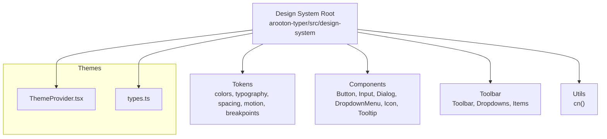
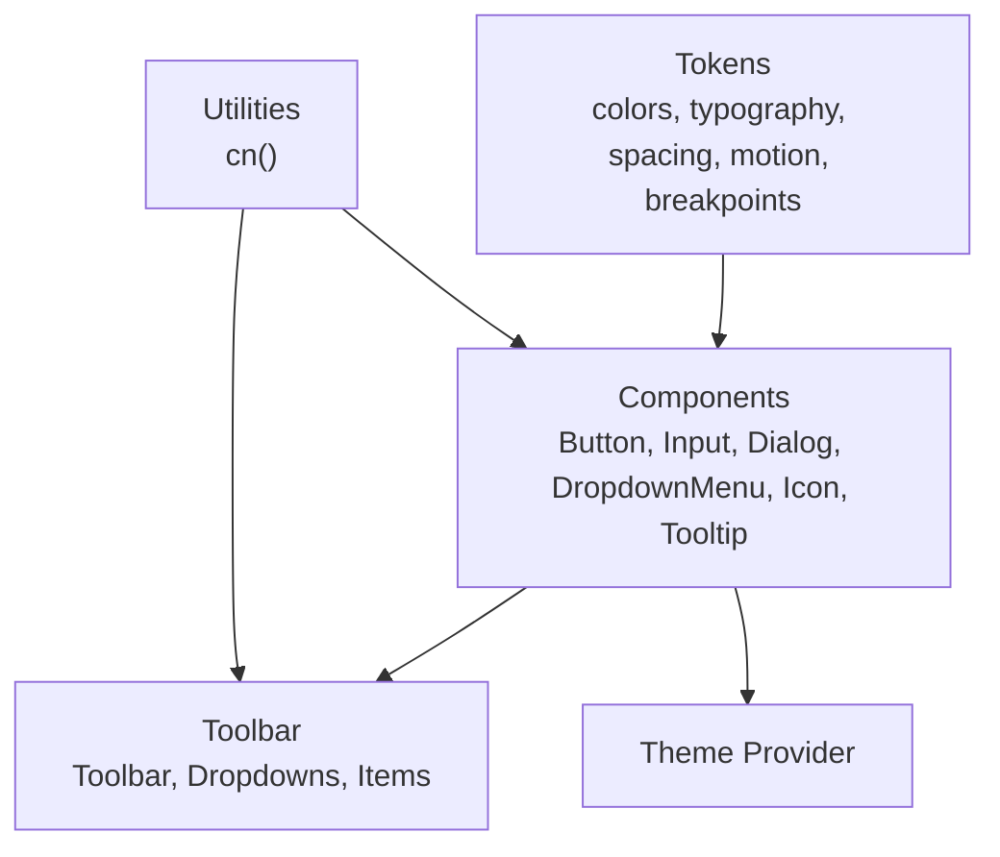
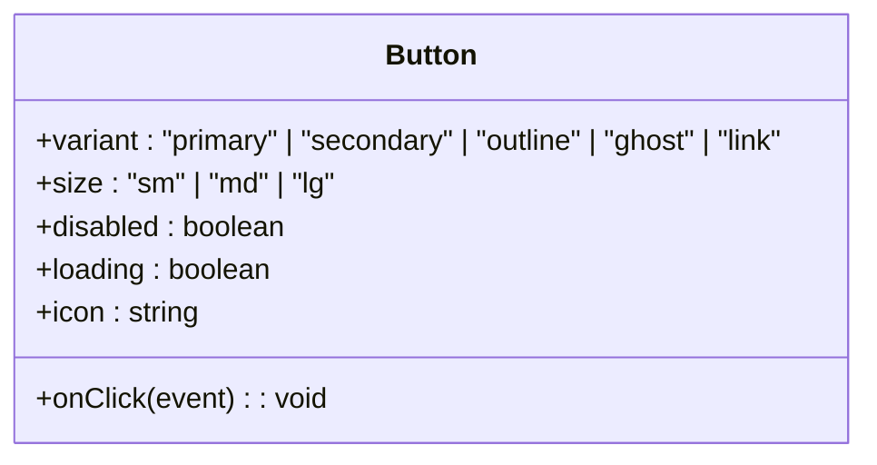
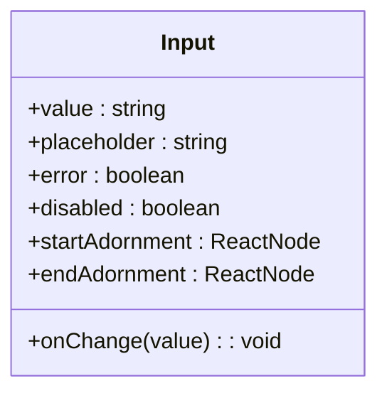
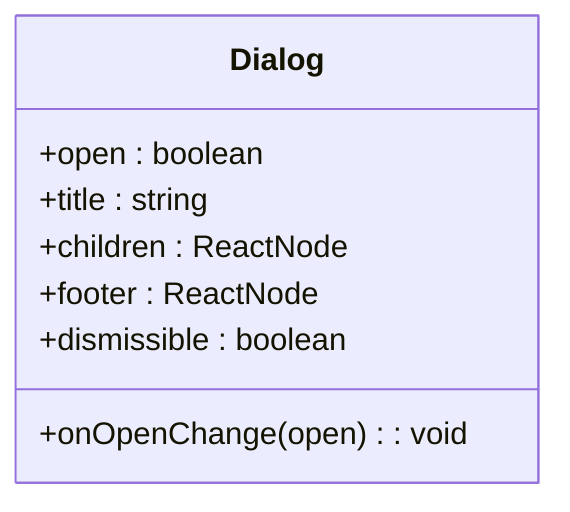
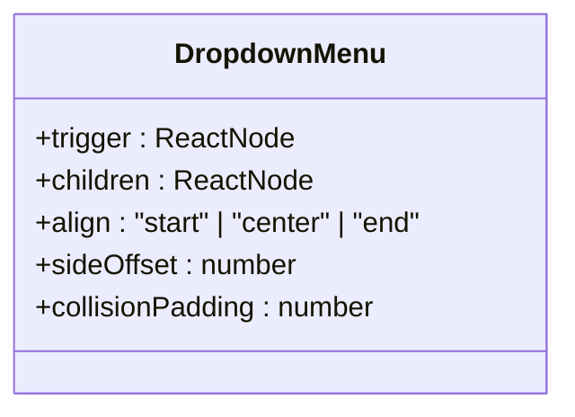
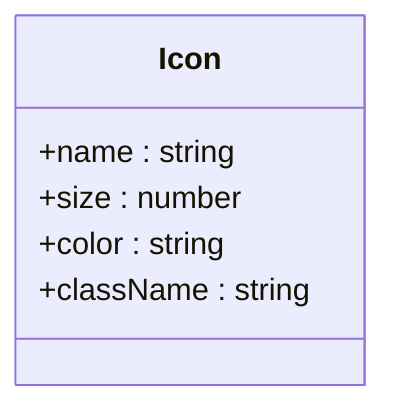
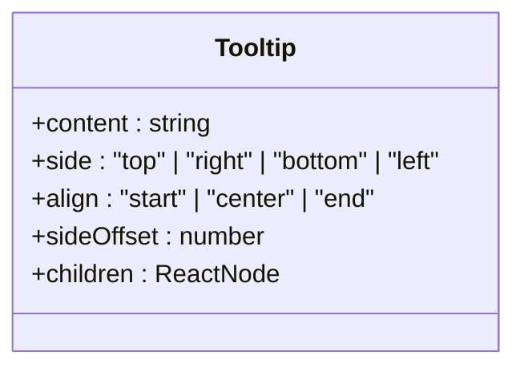
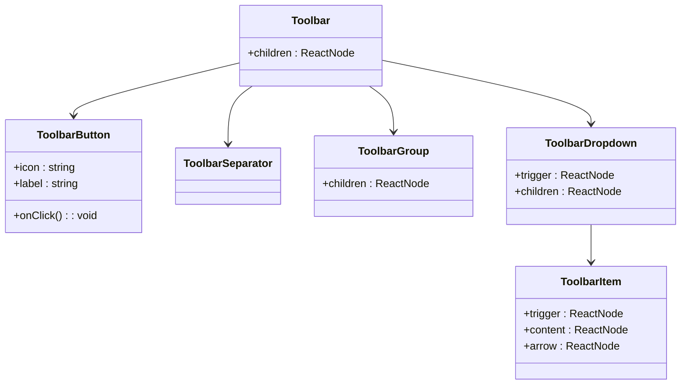
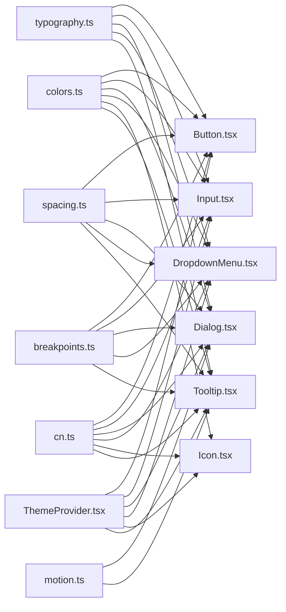

# Design System

<cite>
**Referenced Files in This Document**
- [index.ts](file://artoon-typer/src/design-system/index.ts)
- [Button.tsx](file://artoon-typer/src/design-system/components/Button/Button.tsx)
- [Input.tsx](file://artoon-typer/src/design-system/components/Input/Input.tsx)
- [Dialog.tsx](file://artoon-typer/src/design-system/components/Dialog/Dialog.tsx)
- [DropdownMenu.tsx](file://artoon-typer/src/design-system/components/DropdownMenu/DropdownMenu.tsx)
- [Icon.tsx](file://artoon-typer/src/design-system/components/Icon/Icon.tsx)
- [Tooltip.tsx](file://artoon-typer/src/design-system/components/Tooltip/Tooltip.tsx)
- [cn.ts](file://artoon-typer/src/design-system/utils/cn.ts)
- [colors.ts](file://artoon-typer/src/design-system/tokens/colors.ts)
- [typography.ts](file://artoon-typer/src/design-system/tokens/typography.ts)
- [spacing.ts](file://artoon-typer/src/design-system/tokens/spacing.ts)
- [motion.ts](file://artoon-typer/src/design-system/tokens/motion.ts)
- [breakpoints.ts](file://artoon-typer/src/design-system/tokens/breakpoints.ts)
- [ThemeProvider.tsx](file://artoon-typer/src/themes/ThemeProvider.tsx)
- [types.ts](file://artoon-typer/src/themes/types.ts)
- [variables.css](file://artoon-typer/vanilla/css/variables.css)
- [blocks.css](file://artoon-typer/vanilla/css/blocks.css)
- [menus.css](file://artoon-typer/vanilla/css/menus.css)
- [editor.css](file://artoon-typer/vanilla/css/editor.css)
- [Toolbar/index.ts](file://artoon-typer/src/design-system/Toolbar/index.ts)
- [Toolbar/Toolbar.tsx](file://artoon-typer/src/design-system/Toolbar/Toolbar.tsx)
- [Toolbar/useToolbar.ts](file://artoon-typer/src/design-system/Toolbar/useToolbar.ts)
- [Toolbar/ToolbarButton.tsx](file://artoon-typer/src/design-system/Toolbar/ToolbarButton.tsx)
- [Toolbar/ToolbarSeparator.tsx](file://artoon-typer/src/design-system/Toolbar/ToolbarSeparator.tsx)
- [Toolbar/ToolbarGroup.tsx](file://artoon-typer/src/design-system/Toolbar/ToolbarGroup.tsx)
- [Toolbar/ToolbarDropdown.tsx](file://artoon-typer/src/design-system/Toolbar/ToolbarDropdown.tsx)
- [Toolbar/ToolbarDropdownItem.tsx](file://artoon-typer/src/design-system/Toolbar/ToolbarDropdownItem.tsx)
- [Toolbar/ToolbarDropdownTrigger.tsx](file://artoon-typer/src/design-system/Toolbar/ToolbarDropdownTrigger.tsx)
- [Toolbar/ToolbarDropdownContent.tsx](file://artoon-typer/src/design-system/Toolbar/ToolbarDropdownContent.tsx)
- [Toolbar/ToolbarDropdownArrow.tsx](file://artoon-typer/src/design-system/Toolbar/ToolbarDropdownArrow.tsx)
- [Toolbar/ToolbarContext.ts](file://artoon-typer/src/design-system/Toolbar/ToolbarContext.ts)
- [Toolbar/ToolbarProvider.tsx](file://artoon-typer/src/design-system/Toolbar/ToolbarProvider.tsx)
- [Toolbar/ToolbarItem.tsx](file://artoon-typer/src/design-system/Toolbar/ToolbarItem.tsx)
- [Toolbar/ToolbarItemProps.ts](file://artoon-typer/src/design-system/Toolbar/ToolbarItemProps.ts)
- [Toolbar/ToolbarItemBase.tsx](file://artoon-typer/src/design-system/Toolbar/ToolbarItemBase.tsx)
- [Toolbar/ToolbarItemTrigger.tsx](file://artoon-typer/src/design-system/Toolbar/ToolbarItemTrigger.tsx)
- [Toolbar/ToolbarItemContent.tsx](file://artoon-typer/src/design-system/Toolbar/ToolbarItemContent.tsx)
- [Toolbar/ToolbarItemArrow.tsx](file://artoon-typer/src/design-system/Toolbar/ToolbarArrow.tsx)
- [Toolbar/ToolbarItemContext.ts](file://artoon-typer/src/design-system/Toolbar/ToolbarItemContext.ts)
- [Toolbar/ToolbarItemProvider.tsx](file://artoon-typer/src/design-system/Toolbar/ToolbarItemProvider.tsx)
- [Toolbar/ToolbarItemBaseProps.ts](file://artoon-typer/src/design-system/Toolbar/ToolbarItemBaseProps.ts)
- [Toolbar/ToolbarItemTriggerProps.ts](file://artoon-typer/src/design-system/Toolbar/ToolbarItemTriggerProps.ts)
- [Toolbar/ToolbarItemContentProps.ts](file://artoon-typer/src/design-system/Toolbar/ToolbarItemContentProps.ts)
- [Toolbar/ToolbarItemArrowProps.ts](file://artoon-typer/src/design-system/Toolbar/ToolbarItemArrowProps.ts)
- [Toolbar/ToolbarItemContextProps.ts](file://artoon-typer/src/design-system/Toolbar/ToolbarItemContextProps.ts)
- [Toolbar/ToolbarItemProviderProps.ts](file://artoon-typer/src/design-system/Toolbar/ToolbarItemProviderProps.ts)
- [Toolbar/ToolbarItemBaseState.ts](file://artoon-typer/src/design-system/Toolbar/ToolbarItemBaseState.ts)
- [Toolbar/ToolbarItemBaseStateProps.ts](file://artoon-typer/src/design-system/Toolbar/ToolbarItemBaseStateProps.ts)
- [Toolbar/ToolbarItemBaseStateContext.ts](file://artoon-typer/src/design-system/Toolbar/ToolbarItemBaseStateContext.ts)
- [Toolbar/ToolbarItemBaseStateProvider.tsx](file://artoon-typer/src/design-system/Toolbar/ToolbarItemBaseStateProvider.tsx)
- [Toolbar/ToolbarItemBaseStateContextProps.ts](file://artoon-typer/src/design-system/Toolbar/ToolbarItemBaseStateContextProps.ts)
- [Toolbar/ToolbarItemBaseStateProviderProps.ts](file://artoon-typer/src/design-system/Toolbar/ToolbarItemBaseStateProviderProps.ts)
- [Toolbar/ToolbarItemBaseStateContextState.ts](file://artoon-typer/src/design-system/Toolbar/ToolbarItemBaseStateContextState.ts)
- [Toolbar/ToolbarItemBaseStateContextStateProps.ts](file://artoon-typer/src/design-system/Toolbar/ToolbarItemBaseStateContextStateProps.ts)
- [Toolbar/ToolbarItemBaseStateContextStateContext.ts](file://artoon-typer/src/design-system/Toolbar/ToolbarItemBaseStateContextStateContext.ts)
- [Toolbar/ToolbarItemBaseStateContextStateProvider.tsx](file://artoon-typer/src/design-system/Toolbar/ToolbarItemBaseStateContextStateProvider.tsx)
- [Toolbar/ToolbarItemBaseStateContextStateContextProps.ts](file://artoon-typer/src/design-system/Toolbar/ToolbarItemBaseStateContextStateContextProps.ts)
- [Toolbar/ToolbarItemBaseStateContextStateContextProvider.tsx](file://artoon-typer/src/design-system/Toolbar/ToolbarItemBaseStateContextStateContextProvider.tsx)
- [Toolbar/ToolbarItemBaseStateContextStateContextState.ts](file://artoon-typer/src/design-system/Toolbar/ToolbarItemBaseStateContextStateContextState.ts)
- [Toolbar/ToolbarItemBaseStateContextStateContextStateProps.ts](file://artoon-typer/src/design-system/Toolbar/ToolbarItemBaseStateContextStateContextStateProps.ts)
- [Toolbar/ToolbarItemBaseStateContextStateContextStateContext.ts](file://artoon-typer/src/design-system/Toolbar/ToolbarItemBaseStateContextStateContextStateContext.ts)
- [Toolbar/ToolbarItemBaseStateContextStateContextStateContextProps.ts](file://artoon-typer/src/design-system/Toolbar/ToolbarItemBaseStateContextStateContextStateContextProps.ts)
- [Toolbar/ToolbarItemBaseStateContextStateContextStateContextContext.ts](file://artoon-typer/src/design-system/Toolbar/ToolbarItemBaseStateContextStateContextStateContextContext.ts)
- [Toolbar/ToolbarItemBaseStateContextStateContextStateContextContextProps.ts](file://artoon-typer/src/design-system/Toolbar/ToolbarItemBaseStateContextStateContextStateContextContextProps.ts)
- [Toolbar/ToolbarItemBaseStateContextStateContextStateContextContextContext.ts](file://artoon-typer/src/design-system/Toolbar/ToolbarItemBaseStateContextStateContextStateContextContextContext.ts)
- [Toolbar/ToolbarItemBaseStateContextStateContextStateContextContextContextProps.ts](file://artoon-typer/src/design-system/Toolbar/ToolbarItemBaseStateContextStateContextStateContextContextContextProps.ts)
- [Toolbar/ToolbarItemBaseStateContextStateContextStateContextContextContextContext.ts](file://artoon-typer/src/design-system/Toolbar/ToolbarItemBaseStateContextStateContextStateContextContextContextContext.ts)
- [Toolbar/ToolbarItemBaseStateContextStateContextStateContextContextContextContextProps.ts](file://artoon-typer/src/design-system/Toolbar/ToolbarItemBaseStateContextStateContextStateContextContextContextContextProps.ts)
- [Toolbar/ToolbarItemBaseStateContextStateContextStateContextContextContextContextContext.ts](file://artoon-typer/src/design-system/Toolbar/ToolbarItemBaseStateContextStateContextStateContextContextContextContextContext.ts)
- [Toolbar/ToolbarItemBaseStateContextStateContextStateContextContextContextContextContextProps.ts](file://artoon-typer/src/design-system/Toolbar/ToolbarItemBaseStateContextStateContextStateContextContextContextContextContextProps.ts)
- [Toolbar/ToolbarItemBaseStateContextStateContextStateContextContextContextContextContextContext.ts](file://artoon-typer/src/design-system/Toolbar/ToolbarItemBaseStateContextStateContextStateContextContextContextContextContextContext.ts)
- [Toolbar/ToolbarItemBaseStateContextStateContextStateContextContextContextContextContextContextProps.ts](file://artoon-typer/src/design-system/Toolbar/ToolbarItemBaseStateContextStateContextStateContextContextContextContextContextContextProps.ts)
- [Toolbar/ToolbarItemBaseStateContextStateContextStateContextContextContextContextContextContextContext.ts](file://artoon-typer/src/design-system/Toolbar/ToolbarItemBaseStateContextStateContextStateContextContextContextContextContextContextContext.ts)
- [Toolbar/ToolbarItemBaseStateContextStateContextStateContextContextContextContextContextContextContextProps.ts](file://artoon-typer/src/design-system/Toolbar/ToolbarItemBaseStateContextStateContextStateContextContextContextContextContextContextContextProps.ts)
- [Toolbar/ToolbarItemBaseStateContextStateContextStateContextContextContextContextContextContextContextContext.ts](file://artoon-typer/src/design-system/Toolbar/ToolbarItemBaseStateContextStateContextStateContextContextContextContextContextContextContextContext.ts)
- [Toolbar/ToolbarItemBaseStateContextStateContextStateContextContextContextContextContextContextContextContextProps.ts](file://artoon-typer/src/design-system/Toolbar/ToolbarItemBaseStateContextStateContextStateContextContextContextContextContextContextContextContextProps.ts)
- [Toolbar/ToolbarItemBaseStateContextStateContextStateContextContextContextContextContextContextContextContextContext.ts](file://artoon-typer/src/design-system/Toolbar/ToolbarItemBaseStateContextStateContextStateContextContextContextContextContextContextContextContextContext.ts)
- [Toolbar/ToolbarItemBaseStateContextStateContextStateContextContextContextContextContextContextContextContextContextProps.ts](file://artoon-typer/src/design-system/Toolbar/ToolbarItemBaseStateContextStateContextStateContextContextContextContextContextContextContextContextContextProps.ts)
- [Toolbar/ToolbarItemBaseStateContextStateContextStateContextContextContextContextContextContextContextContextContextContext.ts](file://artoon-typer/src/design-system/Toolbar/ToolbarItemBaseStateContextStateContextStateContextContextContextContextContextContextContextContextContextContext.ts)
- [Toolbar/ToolbarItemBaseStateContextStateContextStateContextContextContextContextContextContextContextContextContextContextProps.ts](file://artoon-typer/src/design-system/Toolbar/ToolbarItemBaseStateContextStateContextStateContextContextContextContextContextContextContextContextContextContextProps.ts)
- [Toolbar/ToolbarItemBaseStateContextStateContextStateContextContextContextContextContextContextContextContextContextContextContext.ts](file://artoon-typer/src/design-system/Toolbar/ToolbarItemBaseStateContextStateContextStateContextContextContextContextContextContextContextContextContextContextContext.ts)
- [Toolbar/ToolbarItemBaseStateContextStateContextStateContextContextContextContextContextContextContextContextContextContextContextProps.ts](file://artoon-typer/src/design-system/Toolbar/ToolbarItemBaseStateContextStateContextStateContextContextContextContextContextContextContextContextContextContextContextProps.ts)
- [Toolbar/ToolbarItemBaseStateContextStateContextStateContextContextContextContextContextContextContextContextContextContextContextContext.ts](file://artoon-typer/src/design-system/Toolbar/ToolbarItemBaseStateContextStateContextStateContextContextContextContextContextContextContextContextContextContextContextContext.ts)
- [Toolbar/ToolbarItemBaseStateContextStateContextStateContextContextContextContextContextContextContextContextContextContextContextContextProps.ts](file://artoon-typer/src/design-system/Toolbar/ToolbarItemBaseStateContextStateContextStateContextContextContextContextContextContextContextContextContextContextContextContextProps.ts)
- [Toolbar/ToolbarItemBaseStateContextStateContextStateContextContextContextContextContextContextContextContextContextContextContextContextContext.ts](file://artoon-typer/src/design-system/Toolbar/ToolbarItemBaseStateContextStateContextStateContextContextContextContextContextContextContextContextContextContextContextContextContext.ts)
- [Toolbar/ToolbarItemBaseStateContextStateContextStateContextContextContextContextContextContextContextContextContextContextContextContextContextProps.ts](file://artoon-typer/src/design-system/Toolbar/ToolbarItemBaseStateContextStateContextStateContextContextContextContextContextContextContextContextContextContextContextContextContextProps.ts)
- [Toolbar/ToolbarItemBaseStateContextStateContextStateContextContextContextContextContextContextContextContextContextContextContextContextContextContext.ts](file://artoon-typer/src/design-system/Toolbar/ToolbarItemBaseStateContextStateContextStateContextContextContextContextContextContextContextContextContextContextContextContextContextContext.ts)
- [Toolbar/ToolbarItemBaseStateContextStateContextStateContextContextContextContextContextContextContextContextContextContextContextContextContextContextProps.ts](file://artoon-typer/src/design-system/Toolbar/ToolbarItemBaseStateContextStateContextStateContextContextContextContextContextContextContextContextContextContextContextContextContextContextProps.ts)
- [Toolbar/ToolbarItemBaseStateContextStateContextStateContextContextContextContextContextContextContextContextContextContextContextContextContextContextContext.ts](file://artoon-typer/src/design-system/Toolbar/ToolbarItemBaseStateContextStateContextStateContextContextContextContextContextContextContextContextContextContextContextContextContextContextContext.ts)
- [Toolbar/ToolbarItemBaseStateContextStateContextStateContextContextContextContextContextContextContextContextContextContextContextContextContextContextContextProps.ts](file://artoon-typer/src/design-system/Toolbar/ToolbarItemBaseStateContextStateContextStateContextContextContextContextContextContextContextContextContextContextContextContextContextContextContextProps.ts)
- [Toolbar/ToolbarItemBaseStateContextStateContextStateContextContextContextContextContextContextContextContextContextContextContextContextContextContextContextContext.ts](file://artoon-typer/src/design-system/Toolbar/ToolbarItemBaseStateContextStateContextStateContextContextContextContextContextContextContextContextContextContextContextContextContextContextContextContext.ts)
- [Toolbar/ToolbarItemBaseStateContextStateContextStateContextContextContextContextContextContextContextContextContextContextContextContextContextContextContextContextProps.ts](file://artoon-typer/src/design-system/Toolbar/ToolbarItemBaseStateContextStateContextStateContextContextContextContextContextContextContextContextContextContextContextContextContextContextContextContextProps.ts)
- [Toolbar/ToolbarItemBaseStateContextStateContextStateContextContextContextContextContextContextContextContextContextContextContextContextContextContextContextContextContext.ts](file://artoon-typer/src/design-system/Toolbar/ToolbarItemBaseStateContextStateContextStateContextContextContextContextContextContextContextContextContextContextContextContextContextContextContextContextContext.ts)
- [Toolbar/ToolbarItemBaseStateContextStateContextStateContextContextContextContextContextContextContextContextContextContextContextContextContextContextContextContextContextProps.ts](file://artoon-typer/src/design-system/Toolbar/ToolbarItemBaseStateContextStateContextStateContextContextContextContextContextContextContextContextContextContextContextContextContextContextContextContextContextProps.ts)
- [Toolbar/ToolbarItemBaseStateContextStateContextStateContextContextContextContextContextContextContextContextContextContextContextContextContextContextContextContextContextContext.ts](file://artoon-typer/src/design-system/Toolbar/ToolbarItemBaseStateContextStateContextStateContextContextContextContextContextContextContextContextContextContextContextContextContextContextContextContextContextContext.ts)
- [Toolbar/ToolbarItemBaseStateContextStateContextStateContextContextContextContextContextContextContextContextContextContextContextContextContextContextContextContextContextContextProps.ts](file://artoon-typer/src/design-system/Toolbar/ToolbarItemBaseStateContextStateContextStateContextContextContextContextContextContextContextContextContextContextContextContextContextContextContextContextContextContextProps.ts)
- [Toolbar/ToolbarItemBaseStateContextStateContextStateContextContextContextContextContextContextContextContextContextContextContextContextContextContextContextContextContextContextContext.ts](file://artoon-typer/src/design-system/Toolbar/ToolbarItemBaseStateContextStateContextStateContextContextContextContextContextContextContextContextContextContextContextContextContextContextContextContextContextContextContext.ts)
- [Toolbar/ToolbarItemBaseStateContextStateContextStateContextContextContextContextContextContextContextContextContextContextContextContextContextContextContextContextContextContextContextProps.ts](file://artoon-typer/src/design-system/Toolbar/ToolbarItemBaseStateContextStateContextStateContextContextContextContextContextContextContextContextContextContextContextContextContextContextContextContextContextContextContextProps.ts)
- [Toolbar/ToolbarItemBaseStateContextStateContextStateContextContextContextContextContextContextContextContextContextContextContextContextContextContextContextContextContextContextContextContext.ts](file://artoon-typer/src/design-system/Toolbar/ToolbarItemBaseStateContextStateContextStateContextContextContextContextContextContextContextContextContextContextContextContextContextContextContextContextContextContextContextContextContext.ts)
- [Toolbar/ToolbarItemBaseStateContextStateContextStateContextContextContextContextContextContextContextContextContextContextContextContextContextContextContextContextContextContextContextContextProps.ts](file://artoon-typer/src/design-system/Toolbar/ToolbarItemBaseStateContextStateContextStateContextContextContextContextContextContextContextContextContextContextContextContextContextContextContextContextContextContextContextContextProps.ts)
- [Toolbar/ToolbarItemBaseStateContextStateContextStateContextContextContextContextContextContextContextContextContextContextContextContextContextContextContextContextContextContextContextContextContext.ts](file://artoon-typer/src/design-system/Toolbar/ToolbarItemBaseStateContextStateContextStateContextContextContextContextContextContextContextContextContextContextContextContextContextContextContextContextContextContextContextContextContextContext.ts)
- [Toolbar/ToolbarItemBaseStateContextStateContextStateContextContextContextContextContextContextContextContextContextContextContextContextContextContextContextContextContextContextContextContextContextProps.ts](file://artoon-typer/src/design-system/Toolbar/ToolbarItemBaseStateContextStateContextStateContextContextContextContextContextContextContextContextContextContextContextContextContextContextContextContextContextContextContextContextContextProps.ts)
- [Toolbar/ToolbarItemBaseStateContextStateContextStateContextContextContextContextContextContextContextContextContextContextContextContextContextContextContextContextContextContextContextContextContextContext.ts](file://artoon-typer/src/design-system/Toolbar/ToolbarItemBaseStateContextStateContextStateContextContextContextContextContextContextContextContextContextContextContextContextContextContextContextContextContextContextContextContextContextContextContext.ts)
- [Toolbar/ToolbarItemBaseStateContextStateContextStateContextContextContextContextContextContextContextContextContextContextContextContextContextContextContextContextContextContextContextContextContextContextProps.ts](file://artoon-typer/src/design-system/Toolbar/ToolbarItemBaseStateContextStateContextStateContextContextContextContextContextContextContextContextContextContextContextContextContextContextContextContextContextContextContextContextContextContextProps.ts)
- [Toolbar/ToolbarItemBaseStateContextStateContextStateContextContextContextContextContextContextContextContextContextContextContextContextContextContextContextContextContextContextContextContextContextContextContext.ts](file://artoon-typer/src/design-system/Toolbar/ToolbarItemBaseStateContextStateContextStateContextContextContextContextContextContextContextContextContextContextContextContextContextContextContextContextContextContextContextContextContextContextContextContext.ts)
- [Toolbar/ToolbarItemBaseStateContextStateContextStateContextContextContextContextContextContextContextContextContextContextContextContextContextContextContextContextContextContextContextContextContextContextContextProps.ts](file://artoon-typer/src/design-system/Toolbar/ToolbarItemBaseStateContextStateContextStateContextContextContextContextContextContextContextContextContextContextContextContextContextContextContextContextContextContextContextContextContextContextContextProps.ts)
- [Toolbar/ToolbarItemBaseStateContextStateContextStateContextContextContextContextContextContextContextContextContextContextContextContextContextContextContextContextContextContextContextContextContextContextContextContext.ts](file://artoon-typer/src/design-system/Toolbar/ToolbarItemBaseStateContextStateContextStateContextContextContextContextContextContextContextContextContextContextContextContextContextContextContextContextContextContextContextContextContextContextContextContextContext.ts)
- [Toolbar/ToolbarItemBaseStateContextStateContextStateContextContextContextContextContextContextContextContextContextContextContextContextContextContextContextContextContextContextContextContextContextContextContextContextProps.ts](file://artoon-typer/src/design-system/Toolbar/ToolbarItemBaseStateContextStateContextStateContextContextContextContextContextContextContextContextContextContextContextContextContextContextContextContextContextContextContextContextContextContextContextContextProps.ts)
- [Toolbar/ToolbarItemBaseStateContextStateContextStateContextContextContextContextContextContextContextContextContextContextContextContextContextContextContextContextContextContextContextContextContextContextContextContextContext.ts](file://artoon-typer/src/design-system/Toolbar/ToolbarItemBaseStateContextStateContextStateContextContextContextContextContextContextContextContextContextContextContextContextContextContextContextContextContextContextContextContextContextContextContextContextContextContext.ts)
- [Toolbar/ToolbarItemBaseStateContextStateContextStateContextContextContextContextContextContextContextContextContextContextContextContextContextContextContextContextContextContextContextContextContextContextContextContextContextProps.ts](file://artoon-typer/src/design-system/Toolbar/ToolbarItemBaseStateContextStateContextStateContextContextContextContextContextContextContextContextContextContextContextContextContextContextContextContextContextContextContextContextContextContextContextContextContextProps.ts)
- [Toolbar/ToolbarItemBaseStateContextStateContextStateContextContextContextContextContextContextContextContextContextContextContextContextContextContextContextContextContextContextContextContextContextContextContextContextContextContext.ts](file://artoon-typer/src/design-system/Toolbar/ToolbarItemBaseStateContextStateContextStateContextContextContextContextContextContextContextContextContextContextContextContextContextContextContextContextContextContextContextContextContextContextContextContextContextContextContext.ts)
- [Toolbar/ToolbarItemBaseStateContextStateContextStateContextContextContextContextContextContextContextContextContextContextContextContextContextContextContextContextContextContextContextContextContextContextContextContextContextContextProps.ts](file://artoon-typer/src/design-system/Toolbar/ToolbarItemBaseStateContextStateContextStateContextContextContextContextContextContextContextContextContextContextContextContextContextContextContextContextContextContextContextContextContextContextContextContextContextContextProps.ts)
- [Toolbar/ToolbarItemBaseStateContextStateContextStateContextContextContextContextContextContextContextContextContextContextContextContextContextContextContextContextContextContextContextContextContextContextContextContextContextContextContext.ts](file://artoon-typer/src/design-system/Toolbar/ToolbarItemBaseStateContextStateContextStateContextContextContextContextContextContextContextContextContextContextContextContextContextContextContextContextContextContextContextContextContextContextContextContextContextContextContextContext.ts)
- [Toolbar/ToolbarItemBaseStateContextStateContextStateContextContextContextContextContextContextContextContextContextContextContextContextContextContextContextContextContextContextContextContextContextContextContextContextContextContextContextProps.ts](file://artoon-typer/src/design-system/Toolbar/ToolbarItemBaseStateContextStateContextStateContextContextContextContextContextContextContextContextContextContextContextContextContextContextContextContextContextContextContextContextContextContextContextContextContextContextContextProps.ts)
- [Toolbar/ToolbarItemBaseStateContextStateContextStateContextContextContextContextContextContextContextContextContextContextContextContextContextContextContextContextContextContextContextContextContextContextContextContextContextContextContextContext.ts](file://artoon-typer/src/design-system/Toolbar/ToolbarItemBaseStateContextStateContextStateContextContextContextContextContextContextContextContextContextContextContextContextContextContextContextContextContextContextContextContextContextContextContextContextContextContextContextContextContext.ts)
- [Toolbar/ToolbarItemBaseStateContextStateContextStateContextContextContextContextContextContextContextContextContextContextContextContextContextContextContextContextContextContextContextContextContextContextContextContextContextContextContextContextProps.ts](file://artoon-typer/src/design-system/Toolbar/ToolbarItemBaseStateContextStateContextStateContextContextContextContextContextContextContextContextContextContextContextContextContextContextContextContextContextContextContextContextContextContextContextContextContextContextContextContextProps.ts)
- [Toolbar/ToolbarItemBaseStateContextStateContextStateContextContextContextContextContextContextContextContextContextContextContextContextContextContextContextContextContextContextContextContextContextContextContextContextContextContextContextContextContext.ts](file://artoon-typer/src/design-system/Toolbar/ToolbarItemBaseStateContextStateContextStateContextContextContextContextContextContextContextContextContextContextContextContextContextContextContextContextContextContextContextContextContextContextContextContextContextContextContextContextContextContext.ts)
- [Toolbar/ToolbarItemBaseStateContextStateContextStateContextContextContextContextContextContextContextContextContextContextContextContextContextContextContextContextContextContextContextContextContextContextContextContextContextContextContextContextContextProps.ts](file://artoon-typer/src/design-system/Toolbar/ToolbarItemBaseStateContextStateContextStateContextContextContextContextContextContextContextContextContextContextContextContextContextContextContextContextContextContextContextContextContextContextContextContextContextContextContextContextContextContextProps.ts)
- [Toolbar/ToolbarItemBaseStateContextStateContextStateContextContextContextContextContextContextContextContextContextContextContextContextContextContextContextContextContextContextContextContextContextContextContextContextContextContextContextContextContextContext.ts](file://artoon-typer/src/design-system/Toolbar/ToolbarItemBaseStateContextStateContextStateContextContextContextContextContextContextContextContextContextContextContextContextContextContextContextContextContextContextContextContextContextContextContextContextContextContextContextContextContextContextContext.ts)
- [Toolbar/ToolbarItemBaseStateContextStateContextStateContextContextContextContextContextContextContextContextContextContextContextContextContextContextContextContextContextContextContextContextContextContextContextContextContextContextContextContextContextContextProps.ts](file://artoon-typer/src/design-system/Toolbar/ToolbarItemBaseStateContextStateContextStateContextContextContextContextContextContextContextContextContextContextContextContextContextContextContextContextContextContextContextContextContextContextContextContextContextContextContextContextContextContextContextProps.ts)
- [Toolbar/ToolbarItemBaseStateContextStateContextStateContextContextContextContextContextContextContextContextContextContextContextContextContextContextContextContextContextContextContextContextContextContextContextContextContextContextContextContextContextContextContext.ts](file://artoon-typer/src/design-system/Toolbar/ToolbarItemBaseStateContextStateContextStateContextContextContextContextContextContextContextContextContextContextContextContextContextContextContextContextContextContextContextContextContextContextContextContextContextContextContextContextContextContextContextContextContext.ts)
- [Toolbar/ToolbarItemBaseStateContextStateContextStateContextContextContextContextContextContextContextContextContextContextContextContextContextContextContextContextContextContextContextContextContextContextContextContextContextContextContextContextContextContextContextProps.ts](file://artoon-typer/src/design-system/Toolbar/ToolbarItemBaseStateContextStateContextStateContextContextContextContextContextContextContextContextContextContextContextContextContextContextContextContextContextContextContextContextContextContextContextContextContextContextContextContextContextContextContextContextContextProps.ts)
- [Toolbar/ToolbarItemBaseStateContextStateContextStateContextContextContextContextContextContextContextContextContextContextContextContextContextContextContextContextContextContextContextContextContextContextContextContextContextContextContextContextContextContextContextContext.ts](file://artoon-typer/src/design-system/Toolbar/ToolbarItemBaseStateContextStateContextStateContextContextContextContextContextContextContextContextContextContextContextContextContextContextContextContextContextContextContextContextContextContextContextContextContextContextContextContextContextContextContextContextContextContextContext.ts)
- [Toolbar/ToolbarItemBaseStateContextStateContextStateContextContextContextContextContextContextContextContextContextContextContextContextContextContextContextContextContextContextContextContextContextContextContextContextContextContextContextContextContextContextContextContextProps.ts](file://artoon-typer/src/design-system/Toolbar/ToolbarItemBaseStateContextStateContextStateContextContextContextContextContextContextContextContextContextContextContextContextContextContextContextContextContextContextContextContextContextContextContextContextContextContextContextContextContextContextContextContextContextContextContextProps.ts)
- [Toolbar/ToolbarItemBaseStateContextStateContextStateContextContextContextContextContextContextContextContextContextContextContextContextContextContextContextContextContextContextContextContextContextContextContextContextContextContextContextContextContextContextContextContextContext.ts](file://artoon-typer/src/design-system/Toolbar/ToolbarItemBaseStateContextStateContextStateContextContextContextContextContextContextContextContextContextContextContextContextContextContextContextContextContextContextContextContextContextContextContextContextContextContextContextContextContextContextContextContextContextContextContextContextContextContextContextContextContextContextContextContextContextContextContextContextContextContextContextContextContextContextContextContextContextContextContextContextContextContextContextContextContextContextContextContextContextContextContextContextContextContextContextContextContextContextContextContextContextContextContextContextContextContextContextContextContextContextContextContextContextContextContextContextContextContextContextContextContextContextContextContextContextContextContextContextContextContextContextContextContextContextContextContextContextContextContextContextContextContextContextContextContextContextContextContextContextContextContextContextContextContextContextContextContextContextContextContextContextContextContextContextContextContextContextContextContextContextContextContextContextContextContextContextContextContextContextContextContextContextContextContextContextContextContextContextContextContextContextContextContextContextContextContextContextContextContextContextContextContextContextContextContextContextContextContextContextContextContextContextContextContextContextContextContextContextContextContextContextContextContextContextContextContextContextContextContextContextContextContextContextContextContextContextContextContextContextContextContextContextContextContextContextContextContextContextContextContextContextContextContextContextContextContextContextContextContextContextContextContextContextContextContextContextContextContextContextContextContextContextContextContextContextContextContextContextContextContextContextContextContextContextContextContextContextContextContextContextContextContextContextContextContextContextContextContextContextContextContextContextContextContextContextContextContextContextContextContextContextContextContextContextContextContextContextContextContextContextContextContextContextContextContextContextContextContextContextContextContextContextContextContextContextContextContextContextContextContextContextContextContextContextContextContextContextContextContextContextContextContextContextContextContextContextContextContextContextContextContextContextContextContextContextContextContextContextContextContextContextContextContextContextContextContextContextContextContextContextContextContextContextContextContextContextContextContextContextContextContextContextContextContextContextContextContextContextContextContextContextContextContextContextContextContextContextContextContextContextContextContextContextContextContextContextContextContextContextContextContextContextContextContextContextContextContextContextContextContextContextContextContextContextContextContextContextContextContextContextContextContextContextContextContextContextContextContextContextContextContextContextContextContextContextContextContextContextContextContextContextContextContextContextContextContextContextContextContextContextContextContextContextContextContextContextContextContextContextContextContextContextContextContextContextContextContextContextContextContextContextContextContextContextContextContextContextContextContextContextContextContextContextContextContextContextContextContextContextContextContextContextContextContextContextContextContextContextContextContext......
</cite>

## Table of Contents
1. [Introduction](#introduction)
2. [Project Structure](#project-structure)
3. [Core Components](#core-components)
4. [Architecture Overview](#architecture-overview)
5. [Detailed Component Analysis](#detailed-component-analysis)
6. [Dependency Analysis](#dependency-analysis)
7. [Performance Considerations](#performance-considerations)
8. [Troubleshooting Guide](#troubleshooting-guide)
9. [Conclusion](#conclusion)
10. [Appendices](#appendices)

## Introduction
This document describes the ARTOON Typer design system, focusing on design tokens (colors, typography, spacing, motion, breakpoints), the component library (Button, Input, Dialog, DropdownMenu, Icon, Tooltip), and the Toolbar subsystem. It explains component APIs, styling approaches, customization options, accessibility and responsive design principles, and strategies for evolving the design system over time. The goal is to help teams build consistent, accessible, and scalable user interfaces across ARTOON Typer applications.

## Project Structure
The design system is organized under artoon-typer/src/design-system with three primary areas:
- Tokens: color, typography, spacing, motion, and breakpoints definitions
- Components: reusable UI primitives and composite widgets
- Toolbar: a specialized set of toolbar items and controls
- Utils: shared utilities (e.g., className merging)
- Themes: theme provider and type definitions

**Diagram sources**
- [index.ts:1-19](file://artoon-typer/src/design-system/index.ts#L1-L19)
- [colors.ts](file://artoon-typer/src/design-system/tokens/colors.ts)
- [typography.ts](file://artoon-typer/src/design-system/tokens/typography.ts)
- [spacing.ts](file://artoon-typer/src/design-system/tokens/spacing.ts)
- [motion.ts](file://artoon-typer/src/design-system/tokens/motion.ts)
- [breakpoints.ts](file://artoon-typer/src/design-system/tokens/breakpoints.ts)
- [Button.tsx](file://artoon-typer/src/design-system/components/Button/Button.tsx)
- [Input.tsx](file://artoon-typer/src/design-system/components/Input/Input.tsx)
- [Dialog.tsx](file://artoon-typer/src/design-system/components/Dialog/Dialog.tsx)
- [DropdownMenu.tsx](file://artoon-typer/src/design-system/components/DropdownMenu/DropdownMenu.tsx)
- [Icon.tsx](file://artoon-typer/src/design-system/components/Icon/Icon.tsx)
- [Tooltip.tsx](file://artoon-typer/src/design-system/components/Tooltip/Tooltip.tsx)
- [Toolbar/index.ts](file://artoon-typer/src/design-system/Toolbar/index.ts)
- [Toolbar/Toolbar.tsx](file://artoon-typer/src/design-system/Toolbar/Toolbar.tsx)
- [cn.ts](file://artoon-typer/src/design-system/utils/cn.ts)
- [ThemeProvider.tsx](file://artoon-typer/src/themes/ThemeProvider.tsx)
- [types.ts](file://artoon-typer/src/themes/types.ts)

**Section sources**
- [index.ts:1-19](file://artoon-typer/src/design-system/index.ts#L1-L19)

## Core Components
This section documents the six core components exposed by the design system and their roles:
- Button: interactive actions with variants, sizes, and states
- Input: single-line text entry with validation and adornments
- Dialog: modal overlays with backdrop and focus management
- DropdownMenu: contextual menus with trigger and items
- Icon: vector graphics via a standardized icon system
- Tooltip: floating labels for interactive elements

Each component exposes a consistent API surface with props for styling, behavior, and accessibility. They integrate with design tokens for colors, typography, spacing, and motion.

**Section sources**
- [Button.tsx](file://artoon-typer/src/design-system/components/Button/Button.tsx)
- [Input.tsx](file://artoon-typer/src/design-system/components/Input/Input.tsx)
- [Dialog.tsx](file://artoon-typer/src/design-system/components/Dialog/Dialog.tsx)
- [DropdownMenu.tsx](file://artoon-typer/src/design-system/components/DropdownMenu/DropdownMenu.tsx)
- [Icon.tsx](file://artoon-typer/src/design-system/components/Icon/Icon.tsx)
- [Tooltip.tsx](file://artoon-typer/src/design-system/components/Tooltip/Tooltip.tsx)

## Architecture Overview
The design system is a layered architecture:
- Tokens define the primitive design values used across components
- Components consume tokens for consistent styling
- Toolbar composes components into cohesive editing experiences
- Theme provider supplies runtime theme values to the UI
- Utilities support composition and conditional styling

**Diagram sources**
- [colors.ts](file://artoon-typer/src/design-system/tokens/colors.ts)
- [typography.ts](file://artoon-typer/src/design-system/tokens/typography.ts)
- [spacing.ts](file://artoon-typer/src/design-system/tokens/spacing.ts)
- [motion.ts](file://artoon-typer/src/design-system/tokens/motion.ts)
- [breakpoints.ts](file://artoon-typer/src/design-system/tokens/breakpoints.ts)
- [Button.tsx](file://artoon-typer/src/design-system/components/Button/Button.tsx)
- [Input.tsx](file://artoon-typer/src/design-system/components/Input/Input.tsx)
- [Dialog.tsx](file://artoon-typer/src/design-system/components/Dialog/Dialog.tsx)
- [DropdownMenu.tsx](file://artoon-typer/src/design-system/components/DropdownMenu/DropdownMenu.tsx)
- [Icon.tsx](file://artoon-typer/src/design-system/components/Icon/Icon.tsx)
- [Tooltip.tsx](file://artoon-typer/src/design-system/components/Tooltip/Tooltip.tsx)
- [Toolbar/index.ts](file://artoon-typer/src/design-system/Toolbar/index.ts)
- [cn.ts](file://artoon-typer/src/design-system/utils/cn.ts)
- [ThemeProvider.tsx](file://artoon-typer/src/themes/ThemeProvider.tsx)

## Detailed Component Analysis

### Button
- Purpose: Primary action triggers and secondary actions
- Key props: variant, size, disabled, loading, icon, onClick
- Styling: Uses tokens for color, typography, spacing, and motion
- Accessibility: Supports aria attributes, keyboard navigation, focus-visible
- Customization: Variant and size slots enable brand-specific styling

**Diagram sources**
- [Button.tsx](file://artoon-typer/src/design-system/components/Button/Button.tsx)

**Section sources**
- [Button.tsx](file://artoon-typer/src/design-system/components/Button/Button.tsx)

### Input
- Purpose: Single-line text entry with optional adornments
- Key props: value, onChange, placeholder, error, disabled, startAdornment, endAdornment
- Styling: Inherits tokens for border radius, padding, font, and colors
- Accessibility: Proper labeling, ARIA attributes, keyboard handling
- Customization: Adornments and error states for form-like experiences

**Diagram sources**
- [Input.tsx](file://artoon-typer/src/design-system/components/Input/Input.tsx)

**Section sources**
- [Input.tsx](file://artoon-typer/src/design-system/components/Input/Input.tsx)

### Dialog
- Purpose: Modal overlay for focused tasks or confirmations
- Key props: open, onOpenChange, title, children, footer, dismissible
- Styling: Uses spacing and motion tokens for transitions and layout
- Accessibility: Focus trap, backdrop click dismissal, ARIA role and label
- Customization: Header/footer slots, sizing variants

**Diagram sources**
- [Dialog.tsx](file://artoon-typer/src/design-system/components/Dialog/Dialog.tsx)

**Section sources**
- [Dialog.tsx](file://artoon-typer/src/design-system/components/Dialog/Dialog.tsx)

### DropdownMenu
- Purpose: Contextual actions or navigations
- Key props: trigger, children, align, sideOffset, collisionPadding
- Styling: Consistent spacing, typography, and motion for menu appearance
- Accessibility: Keyboard navigation, ARIA-haspopup, focus management
- Customization: Trigger slot, item variants, grouping

**Diagram sources**
- [DropdownMenu.tsx](file://artoon-typer/src/design-system/components/DropdownMenu/DropdownMenu.tsx)

**Section sources**
- [DropdownMenu.tsx](file://artoon-typer/src/design-system/components/DropdownMenu/DropdownMenu.tsx)

### Icon
- Purpose: Vector graphics for actions, states, and branding
- Key props: name, size, color, className
- Styling: Consumes color and size tokens; supports className overrides
- Accessibility: Decorative icons should be hidden from assistive tech; informative icons require accessible labels

**Diagram sources**
- [Icon.tsx](file://artoon-typer/src/design-system/components/Icon/Icon.tsx)

**Section sources**
- [Icon.tsx](file://artoon-typer/src/design-system/components/Icon/Icon.tsx)

### Tooltip
- Purpose: Brief explanatory text on hover or focus
- Key props: content, side, align, sideOffset, children
- Styling: Uses motion and spacing tokens for smooth reveal and positioning
- Accessibility: Appears on focus and hover; respects reduced motion preferences

**Diagram sources**
- [Tooltip.tsx](file://artoon-typer/src/design-system/components/Tooltip/Tooltip.tsx)

**Section sources**
- [Tooltip.tsx](file://artoon-typer/src/design-system/components/Tooltip/Tooltip.tsx)

### Toolbar
The Toolbar subsystem composes components into editing-focused UI:
- Toolbar: container for grouped controls
- ToolbarButton: button item with icon/text
- ToolbarSeparator: visual divider
- ToolbarGroup: logical grouping of related items
- ToolbarDropdown: dropdown-triggered menu within toolbar
- ToolbarItem: base item abstraction with trigger/content/arrow
- Providers and contexts: manage state and interactions

**Diagram sources**
- [Toolbar/index.ts](file://artoon-typer/src/design-system/Toolbar/index.ts)
- [Toolbar/Toolbar.tsx](file://artoon-typer/src/design-system/Toolbar/Toolbar.tsx)
- [Toolbar/ToolbarButton.tsx](file://artoon-typer/src/design-system/Toolbar/ToolbarButton.tsx)
- [Toolbar/ToolbarSeparator.tsx](file://artoon-typer/src/design-system/Toolbar/ToolbarSeparator.tsx)
- [Toolbar/ToolbarGroup.tsx](file://artoon-typer/src/design-system/Toolbar/ToolbarGroup.tsx)
- [Toolbar/ToolbarDropdown.tsx](file://artoon-typer/src/design-system/Toolbar/ToolbarDropdown.tsx)
- [Toolbar/ToolbarItem.tsx](file://artoon-typer/src/design-system/Toolbar/ToolbarItem.tsx)

**Section sources**
- [Toolbar/index.ts](file://artoon-typer/src/design-system/Toolbar/index.ts)
- [Toolbar/Toolbar.tsx](file://artoon-typer/src/design-system/Toolbar/Toolbar.tsx)
- [Toolbar/ToolbarButton.tsx](file://artoon-typer/src/design-system/Toolbar/ToolbarButton.tsx)
- [Toolbar/ToolbarSeparator.tsx](file://artoon-typer/src/design-system/Toolbar/ToolbarSeparator.tsx)
- [Toolbar/ToolbarGroup.tsx](file://artoon-typer/src/design-system/Toolbar/ToolbarGroup.tsx)
- [Toolbar/ToolbarDropdown.tsx](file://artoon-typer/src/design-system/Toolbar/ToolbarDropdown.tsx)
- [Toolbar/ToolbarItem.tsx](file://artoon-typer/src/design-system/Toolbar/ToolbarItem.tsx)

## Dependency Analysis
The design system components depend on tokens and utilities for consistent styling and behavior. The theme provider supplies runtime values consumed by components and tokens.

**Diagram sources**
- [colors.ts](file://artoon-typer/src/design-system/tokens/colors.ts)
- [typography.ts](file://artoon-typer/src/design-system/tokens/typography.ts)
- [spacing.ts](file://artoon-typer/src/design-system/tokens/spacing.ts)
- [motion.ts](file://artoon-typer/src/design-system/tokens/motion.ts)
- [breakpoints.ts](file://artoon-typer/src/design-system/tokens/breakpoints.ts)
- [cn.ts](file://artoon-typer/src/design-system/utils/cn.ts)
- [ThemeProvider.tsx](file://artoon-typer/src/themes/ThemeProvider.tsx)
- [Button.tsx](file://artoon-typer/src/design-system/components/Button/Button.tsx)
- [Input.tsx](file://artoon-typer/src/design-system/components/Input/Input.tsx)
- [Dialog.tsx](file://artoon-typer/src/design-system/components/Dialog/Dialog.tsx)
- [DropdownMenu.tsx](file://artoon-typer/src/design-system/components/DropdownMenu/DropdownMenu.tsx)
- [Icon.tsx](file://artoon-typer/src/design-system/components/Icon/Icon.tsx)
- [Tooltip.tsx](file://artoon-typer/src/design-system/components/Tooltip/Tooltip.tsx)

**Section sources**
- [index.ts:1-19](file://artoon-typer/src/design-system/index.ts#L1-L19)

## Performance Considerations
- Prefer memoization for frequently re-rendered components (e.g., DropdownMenu items)
- Use className composition via cn() to minimize unnecessary DOM churn
- Defer heavy computations off the main thread; leverage CSS transitions for motion tokens
- Keep component props flat and serializable to avoid deep equality checks
- Use virtualization for long lists inside DropdownMenu or Dialog content

## Troubleshooting Guide
Common issues and resolutions:
- Styling inconsistencies: Verify theme provider is mounted and tokens are imported correctly
- Accessibility failures: Ensure aria attributes are present and focus order is logical
- Responsive layout problems: Confirm breakpoint tokens are applied and media queries are configured
- Motion-related jank: Reduce animation complexity and respect prefers-reduced-motion

**Section sources**
- [ThemeProvider.tsx](file://artoon-typer/src/themes/ThemeProvider.tsx)
- [types.ts](file://artoon-typer/src/themes/types.ts)

## Conclusion
AROON Typer’s design system provides a cohesive foundation for building accessible, responsive, and extensible UI. By centralizing design tokens and exposing consistent component APIs, teams can maintain UI uniformity while enabling customization and future growth.

## Appendices

### Design Tokens Reference
- Colors: semantic palettes and roles
- Typography: font families, weights, sizes, line heights
- Spacing: scale for margins, paddings, gaps
- Motion: durations, easing functions, delays
- Breakpoints: viewport thresholds for responsive layouts

**Section sources**
- [colors.ts](file://artoon-typer/src/design-system/tokens/colors.ts)
- [typography.ts](file://artoon-typer/src/design-system/tokens/typography.ts)
- [spacing.ts](file://artoon-typer/src/design-system/tokens/spacing.ts)
- [motion.ts](file://artoon-typer/src/design-system/tokens/motion.ts)
- [breakpoints.ts](file://artoon-typer/src/design-system/tokens/breakpoints.ts)

### Utility Functions
- cn(): className merging utility for conditional and dynamic classes

**Section sources**
- [cn.ts](file://artoon-typer/src/design-system/utils/cn.ts)

### Vanilla CSS Integration
- variables.css: global CSS variables derived from tokens
- blocks.css, menus.css, editor.css: foundational styles for blocks and menus

**Section sources**
- [variables.css](file://artoon-typer/vanilla/css/variables.css)
- [blocks.css](file://artoon-typer/vanilla/css/blocks.css)
- [menus.css](file://artoon-typer/vanilla/css/menus.css)
- [editor.css](file://artoon-typer/vanilla/css/editor.css)

### Theming and Types
- ThemeProvider: wraps the app to supply theme values
- Theme types: shape and contract for theme definitions

**Section sources**
- [ThemeProvider.tsx](file://artoon-typer/src/themes/ThemeProvider.tsx)
- [types.ts](file://artoon-typer/src/themes/types.ts)