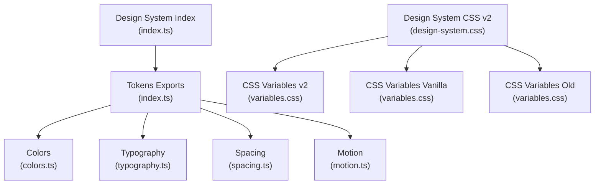
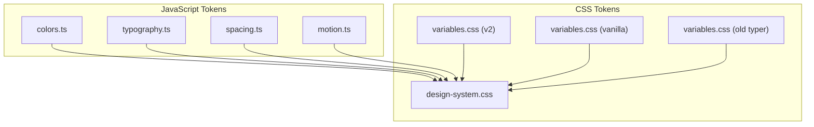
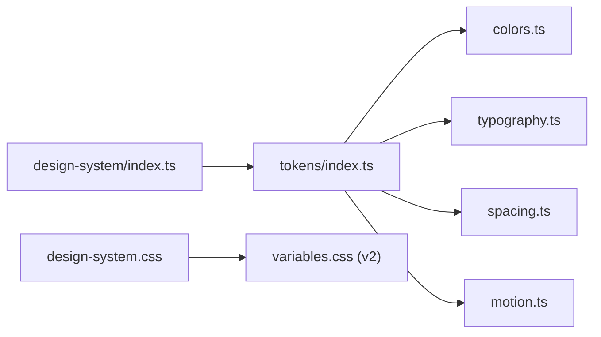

# Design Tokens

<cite>
**Referenced Files in This Document**
- [index.ts](file://artoon-typer/src/design-system/index.ts)
- [colors.ts](file://artoon-typer/src/design-system/tokens/colors.ts)
- [typography.ts](file://artoon-typer/src/design-system/tokens/typography.ts)
- [spacing.ts](file://artoon-typer/src/design-system/tokens/spacing.ts)
- [motion.ts](file://artoon-typer/src/design-system/tokens/motion.ts)
- [variables.css](file://artoon-typer/src/ui/styles/v2/variables.css)
- [design-system.css](file://artoon-typer/src/ui/styles/v2/design-system.css)
- [variables.css](file://artoon-typer/vanilla/css/variables.css)
- [variables.css](file://artoon-typer/src/ui/styles/variables.css)
</cite>

## Table of Contents
1. [Introduction](#introduction)
2. [Project Structure](#project-structure)
3. [Core Components](#core-components)
4. [Architecture Overview](#architecture-overview)
5. [Detailed Component Analysis](#detailed-component-analysis)
6. [Dependency Analysis](#dependency-analysis)
7. [Performance Considerations](#performance-considerations)
8. [Troubleshooting Guide](#troubleshooting-guide)
9. [Conclusion](#conclusion)

## Introduction
This document describes the ARTOON design tokens system used across the ARTOON-TYPER application. It covers the color palette (primary, secondary, neutral, and semantic colors), typography tokens (font families, sizes, weights, line heights, and spacing), spacing tokens for margins and padding, motion tokens (animation durations, easing functions, and transitions), and guidelines for token usage, accessibility, and consistency.

## Project Structure
The design tokens are organized into two complementary systems:
- JavaScript tokens: centralized TypeScript modules exporting color, typography, spacing, and motion tokens.
- CSS variables: theme-aware design tokens for light/dark modes and component sizing.

**Diagram sources**
- [index.ts:1-19](file://artoon-typer/src/design-system/index.ts#L1-L19)
- [colors.ts:1-76](file://artoon-typer/src/design-system/tokens/colors.ts#L1-L76)
- [typography.ts:1-57](file://artoon-typer/src/design-system/tokens/typography.ts#L1-L57)
- [spacing.ts:1-42](file://artoon-typer/src/design-system/tokens/spacing.ts#L1-L42)
- [motion.ts:1-30](file://artoon-typer/src/design-system/tokens/motion.ts#L1-L30)
- [variables.css:1-160](file://artoon-typer/src/ui/styles/v2/variables.css#L1-L160)
- [design-system.css:1-502](file://artoon-typer/src/ui/styles/v2/design-system.css#L1-L502)
- [variables.css:1-73](file://artoon-typer/vanilla/css/variables.css#L1-L73)
- [variables.css:1-60](file://artoon-typer/src/ui/styles/variables.css#L1-L60)

**Section sources**
- [index.ts:1-19](file://artoon-typer/src/design-system/index.ts#L1-L19)

## Core Components
- Colors: Semantic color system with primary, secondary, neutral, and semantic palettes (success, warning, error, info).
- Typography: Font families, sizes, weights, line heights, and letter spacing.
- Spacing: Consistent spacing scale with base unit equivalents and border radius tokens.
- Motion: Animation durations and easing functions.

**Section sources**
- [colors.ts:1-76](file://artoon-typer/src/design-system/tokens/colors.ts#L1-L76)
- [typography.ts:1-57](file://artoon-typer/src/design-system/tokens/typography.ts#L1-L57)
- [spacing.ts:1-42](file://artoon-typer/src/design-system/tokens/spacing.ts#L1-L42)
- [motion.ts:1-30](file://artoon-typer/src/design-system/tokens/motion.ts#L1-L30)

## Architecture Overview
The design tokens are exported centrally and consumed either via JavaScript runtime or CSS variables. The CSS-based system supports light and dark themes and includes component-level tokens and accessibility enhancements.

**Diagram sources**
- [colors.ts:1-76](file://artoon-typer/src/design-system/tokens/colors.ts#L1-L76)
- [typography.ts:1-57](file://artoon-typer/src/design-system/tokens/typography.ts#L1-L57)
- [spacing.ts:1-42](file://artoon-typer/src/design-system/tokens/spacing.ts#L1-L42)
- [motion.ts:1-30](file://artoon-typer/src/design-system/tokens/motion.ts#L1-L30)
- [design-system.css:1-502](file://artoon-typer/src/ui/styles/v2/design-system.css#L1-L502)
- [variables.css:1-160](file://artoon-typer/src/ui/styles/v2/variables.css#L1-L160)
- [variables.css:1-73](file://artoon-typer/vanilla/css/variables.css#L1-L73)
- [variables.css:1-60](file://artoon-typer/src/ui/styles/variables.css#L1-L60)

## Detailed Component Analysis

### Colors
- Primary palette: A blue-based palette with 50–900 shades suitable for branding and interactive states.
- Secondary palette: A teal-based palette for complementary actions and accents.
- Neutral palette: A grayscale scale from 0 (white) to 950 (near-black) for surfaces and text.
- Semantic colors: success, warning, error, and info with light, main, and dark variants for feedback and status.

Usage guidelines:
- Prefer semantic colors for actionable feedback (success, warning, error, info).
- Use neutral grays for backgrounds, borders, and text hierarchy.
- Apply primary palette for main CTAs and brand-consistent highlights.

Accessibility considerations:
- Ensure sufficient contrast ratios against backgrounds for text and interactive elements.
- Maintain readable text on semantic backgrounds using appropriate shade levels.

**Section sources**
- [colors.ts:6-72](file://artoon-typer/src/design-system/tokens/colors.ts#L6-L72)
- [design-system.css:127-253](file://artoon-typer/src/ui/styles/v2/design-system.css#L127-L253)

### Typography
- Font families: Sans-serif, Arabic-localized, and monospace sets for UI and code contexts.
- Font sizes: xs to 5xl scales mapped to rem units for scalable, accessible typography.
- Weights: normal, medium, semibold, bold for hierarchy and emphasis.
- Line heights: none to loose scales for readability tuning.
- Letter spacing: tighter to wide for typographic refinement.

Usage guidelines:
- Use larger sizes and semibold/bold for headings; progressively smaller sizes for body text.
- Adjust line height and letter spacing for long-form content and code blocks.
- Maintain consistent font family assignments per content type (UI vs. content/editor).

**Section sources**
- [typography.ts:6-52](file://artoon-typer/src/design-system/tokens/typography.ts#L6-L52)
- [design-system.css:259-295](file://artoon-typer/src/ui/styles/v2/design-system.css#L259-L295)

### Spacing
- Spacing scale: Built on a base unit with fractional increments and common multiples for consistent gutters and layouts.
- Border radius: Small to full radii for rounded corners across components.

Usage guidelines:
- Use the spacing scale for margins, padding, gaps, and component sizing to maintain rhythm.
- Align grid-based spacing with typography scales for visual harmony.

**Section sources**
- [spacing.ts:6-39](file://artoon-typer/src/design-system/tokens/spacing.ts#L6-L39)
- [design-system.css:366-380](file://artoon-typer/src/ui/styles/v2/design-system.css#L366-L380)
- [design-system.css:386-394](file://artoon-typer/src/ui/styles/v2/design-system.css#L386-L394)

### Motion
- Durations: 75ms to 1000ms for micro-interactions and transitions.
- Easing functions: linear, in, out, inOut, and bounce for varied motion qualities.

Usage guidelines:
- Keep micro-interactions fast (75–200ms) and meaningful transitions slower but snappy (300–500ms).
- Use easing to guide attention and imply weight (e.g., bounce for playful feedback).

**Section sources**
- [motion.ts:6-27](file://artoon-typer/src/design-system/tokens/motion.ts#L6-L27)
- [design-system.css:400-412](file://artoon-typer/src/ui/styles/v2/design-system.css#L400-L412)

### CSS Variables and Themes
- Light and dark themes: Separate variable sets for backgrounds, text, borders, overlays, and shadows.
- Component tokens: Button, input, card, focus ring sizing and spacing.
- Accessibility: Focus-visible outlines, reduced motion support, and high contrast adjustments.

Usage guidelines:
- Apply data-theme attributes or root classes to switch themes consistently.
- Combine CSS variables with JavaScript tokens for dynamic theming and component props.

**Section sources**
- [variables.css:6-103](file://artoon-typer/src/ui/styles/v2/variables.css#L6-L103)
- [design-system.css:182-253](file://artoon-typer/src/ui/styles/v2/design-system.css#L182-L253)
- [design-system.css:418-438](file://artoon-typer/src/ui/styles/v2/design-system.css#L418-L438)
- [design-system.css:444-466](file://artoon-typer/src/ui/styles/v2/design-system.css#L444-L466)

## Dependency Analysis
The design system index re-exports tokens for easy consumption. CSS-based tokens depend on the central design system CSS for theme-aware values and component tokens.

**Diagram sources**
- [index.ts:6-10](file://artoon-typer/src/design-system/index.ts#L6-L10)
- [colors.ts:1-76](file://artoon-typer/src/design-system/tokens/colors.ts#L1-L76)
- [typography.ts:1-57](file://artoon-typer/src/design-system/tokens/typography.ts#L1-L57)
- [spacing.ts:1-42](file://artoon-typer/src/design-system/tokens/spacing.ts#L1-L42)
- [motion.ts:1-30](file://artoon-typer/src/design-system/tokens/motion.ts#L1-L30)
- [design-system.css:1-502](file://artoon-typer/src/ui/styles/v2/design-system.css#L1-L502)
- [variables.css:1-160](file://artoon-typer/src/ui/styles/v2/variables.css#L1-L160)

**Section sources**
- [index.ts:6-10](file://artoon-typer/src/design-system/index.ts#L6-L10)

## Performance Considerations
- Prefer CSS variables for theme switching to avoid costly reflows and repaints.
- Use component tokens to minimize cascade specificity and improve rendering predictability.
- Limit animation durations and easing complexity for low-powered devices.

## Troubleshooting Guide
Common issues and resolutions:
- Theme mismatch: Ensure the correct data-theme attribute or root class is applied to activate dark/light variables.
- Contrast problems: Verify text color against background using semantic or neutral shades.
- Motion fatigue: Respect reduced motion preferences by checking prefers-reduced-motion media queries.
- Inconsistent spacing: Align paddings and margins to the spacing scale to prevent visual jitter.

**Section sources**
- [design-system.css:449-458](file://artoon-typer/src/ui/styles/v2/design-system.css#L449-L458)
- [design-system.css:460-466](file://artoon-typer/src/ui/styles/v2/design-system.css#L460-L466)

## Conclusion
ARTOON’s design tokens provide a cohesive, theme-aware foundation for color, typography, spacing, and motion. By aligning component implementations with these tokens—both in JavaScript and CSS—you can ensure consistent experiences across light and dark themes while supporting accessibility and performance.