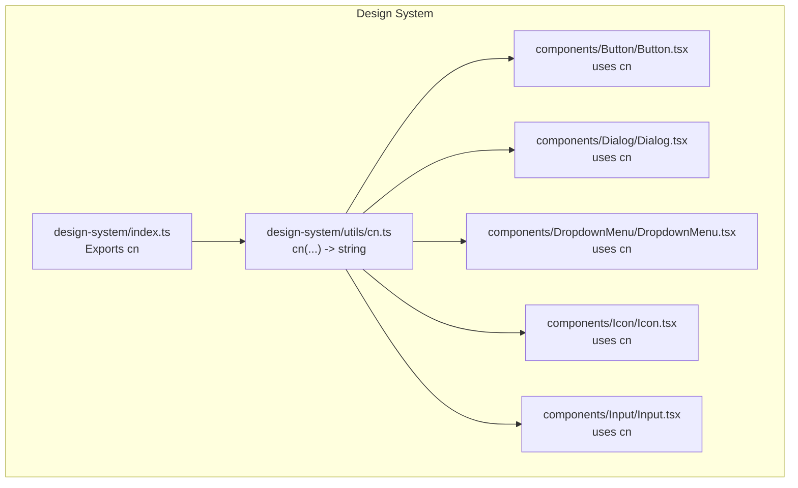
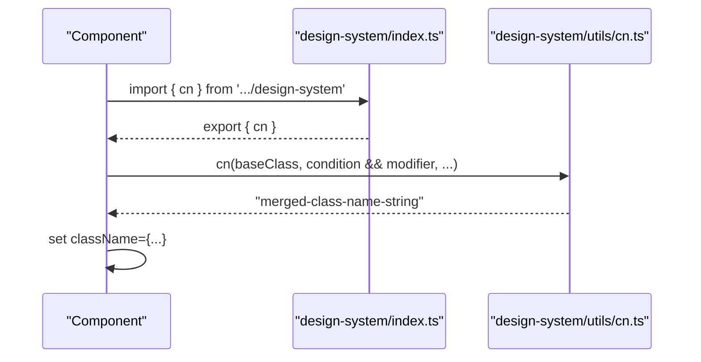
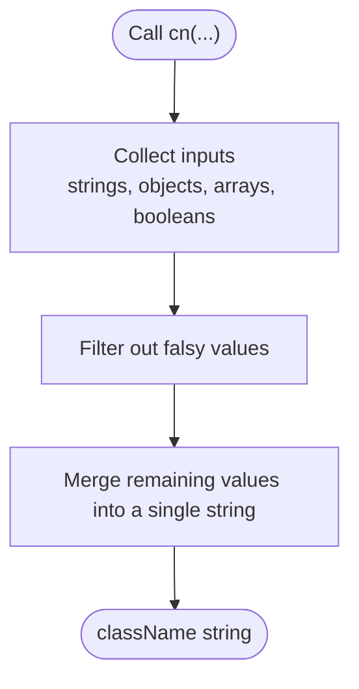
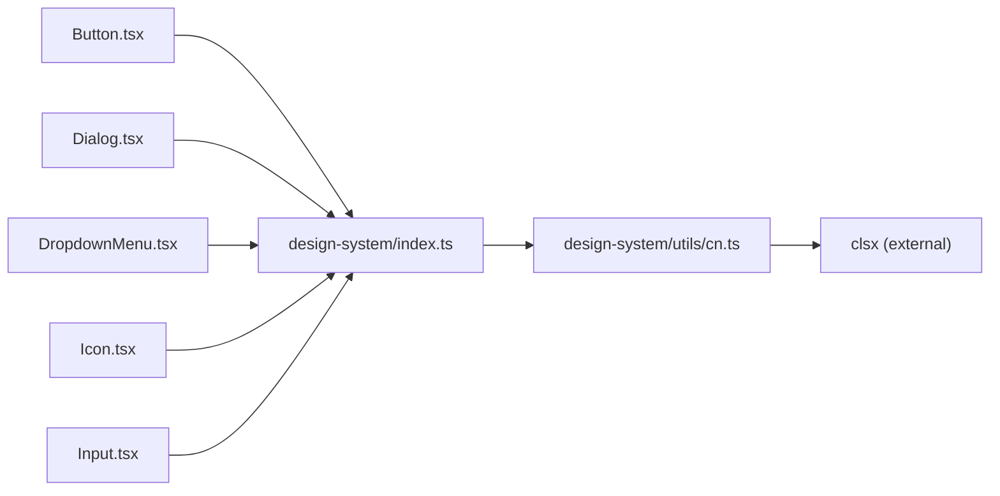

# Utility Helpers

<cite>
**Referenced Files in This Document**
- [cn.ts](file://artoon-typer/src/design-system/utils/cn.ts)
- [index.ts](file://artoon-typer/src/design-system/index.ts)
- [Button.tsx](file://artoon-typer/src/design-system/components/Button/Button.tsx)
- [Dialog.tsx](file://artoon-typer/src/design-system/components/Dialog/Dialog.tsx)
- [DropdownMenu.tsx](file://artoon-typer/src/design-system/components/DropdownMenu/DropdownMenu.tsx)
- [Icon.tsx](file://artoon-typer/src/design-system/components/Icon/Icon.tsx)
- [Input.tsx](file://artoon-typer/src/design-system/components/Input/Input.tsx)
</cite>

## Table of Contents
1. [Introduction](#introduction)
2. [Project Structure](#project-structure)
3. [Core Components](#core-components)
4. [Architecture Overview](#architecture-overview)
5. [Detailed Component Analysis](#detailed-component-analysis)
6. [Dependency Analysis](#dependency-analysis)
7. [Performance Considerations](#performance-considerations)
8. [Troubleshooting Guide](#troubleshooting-guide)
9. [Conclusion](#conclusion)

## Introduction
This document explains the utility helpers in the ARTOON design system, with a focus on the cn utility function for conditional class name concatenation. It covers how cn integrates into the design system, typical usage patterns for combining conditional classes, handling falsy values, and creating dynamic styling based on component props. Practical examples demonstrate usage with built-in design system components and custom styling scenarios. Finally, it provides performance considerations and best practices for managing class names efficiently in React applications.

## Project Structure
The cn utility is part of the design system's shared utilities and is exported via the design system index for global availability. Components across the design system import cn to merge base classes with conditional modifiers.

**Diagram sources**
- [index.ts:9-10](file://artoon-typer/src/design-system/index.ts#L9-L10)
- [cn.ts:8-10](file://artoon-typer/src/design-system/utils/cn.ts#L8-L10)
- [Button.tsx:38](file://artoon-typer/src/design-system/components/Button/Button.tsx#L38)
- [Dialog.tsx:34](file://artoon-typer/src/design-system/components/Dialog/Dialog.tsx#L34)
- [DropdownMenu.tsx:59](file://artoon-typer/src/design-system/components/DropdownMenu/DropdownMenu.tsx#L59)
- [Icon.tsx:33](file://artoon-typer/src/design-system/components/Icon/Icon.tsx#L33)
- [Input.tsx:40](file://artoon-typer/src/design-system/components/Input/Input.tsx#L40)
- [Input.tsx:48](file://artoon-typer/src/design-system/components/Input/Input.tsx#L48)

**Section sources**
- [index.ts:1-19](file://artoon-typer/src/design-system/index.ts#L1-L19)
- [cn.ts:1-11](file://artoon-typer/src/design-system/utils/cn.ts#L1-L11)

## Core Components
- cn utility function: A thin wrapper around clsx that accepts a variadic list of class inputs and returns a single concatenated string. It supports conditional classes, objects, arrays, and template literal classes. See [cn.ts:8-10](file://artoon-typer/src/design-system/utils/cn.ts#L8-L10).
- Export surface: The design system re-exports cn from its index for convenient consumption across components. See [index.ts:9-10](file://artoon-typer/src/design-system/index.ts#L9-L10).

Key characteristics:
- Accepts any number of inputs of type ClassValue.
- Delegates to clsx for robust conditional class resolution.
- Returns a single string suitable for React's className prop.

**Section sources**
- [cn.ts:1-11](file://artoon-typer/src/design-system/utils/cn.ts#L1-L11)
- [index.ts:9-10](file://artoon-typer/src/design-system/index.ts#L9-L10)

## Architecture Overview
The cn utility sits in the design system's shared utilities layer and is consumed by all design system components. This creates a centralized pattern for merging classes consistently across the system.

**Diagram sources**
- [index.ts:9-10](file://artoon-typer/src/design-system/index.ts#L9-L10)
- [cn.ts:8-10](file://artoon-typer/src/design-system/utils/cn.ts#L8-L10)

## Detailed Component Analysis
This section demonstrates how cn is used across design system components to combine base classes with conditional modifiers and dynamic props.

### Conditional Classes and Falsy Values
- cn resolves conditional classes by truthiness. Only inputs that evaluate to true contribute to the final class string.
- Falsy values (null, undefined, false) are ignored, while truthy values (strings, objects, arrays) are processed.

Example usage patterns visible in components:
- Base class plus optional modifier: see [Input.tsx:40](file://artoon-typer/src/design-system/components/Input/Input.tsx#L40).
- Size-based variant class: see [Dialog.tsx:34](file://artoon-typer/src/design-system/components/Dialog/Dialog.tsx#L34).
- Error state modifier: see [Input.tsx:48](file://artoon-typer/src/design-system/components/Input/Input.tsx#L48).
- Prop-driven variants: see [Button.tsx:38](file://artoon-typer/src/design-system/components/Button/Button.tsx#L38).
- Optional wrapper classes: see [DropdownMenu.tsx:59](file://artoon-typer/src/design-system/components/DropdownMenu/DropdownMenu.tsx#L59).

**Diagram sources**
- [cn.ts:8-10](file://artoon-typer/src/design-system/utils/cn.ts#L8-L10)

**Section sources**
- [Input.tsx:40](file://artoon-typer/src/design-system/components/Input/Input.tsx#L40)
- [Input.tsx:48](file://artoon-typer/src/design-system/components/Input/Input.tsx#L48)
- [Dialog.tsx:34](file://artoon-typer/src/design-system/components/Dialog/Dialog.tsx#L34)
- [Button.tsx:38](file://artoon-typer/src/design-system/components/Button/Button.tsx#L38)
- [DropdownMenu.tsx:59](file://artoon-typer/src/design-system/components/DropdownMenu/DropdownMenu.tsx#L59)
- [Icon.tsx:33](file://artoon-typer/src/design-system/components/Icon/Icon.tsx#L33)

### Dynamic Styling Based on Props
- cn enables dynamic styling by passing props directly into class inputs. For example, size, error, disabled, loading, and other component props can drive conditional classes.
- This keeps styling declarative and colocated with component logic.

Examples:
- Size variants: [Dialog.tsx:34](file://artoon-typer/src/design-system/components/Dialog/Dialog.tsx#L34)
- State-based variants: [Input.tsx:48](file://artoon-typer/src/design-system/components/Input/Input.tsx#L48)
- Boolean flags: [Button.tsx:38](file://artoon-typer/src/design-system/components/Button/Button.tsx#L38), [DropdownMenu.tsx:59](file://artoon-typer/src/design-system/components/DropdownMenu/DropdownMenu.tsx#L59)

**Section sources**
- [Dialog.tsx:34](file://artoon-typer/src/design-system/components/Dialog/Dialog.tsx#L34)
- [Input.tsx:48](file://artoon-typer/src/design-system/components/Input/Input.tsx#L48)
- [Button.tsx:38](file://artoon-typer/src/design-system/components/Button/Button.tsx#L38)
- [DropdownMenu.tsx:59](file://artoon-typer/src/design-system/components/DropdownMenu/DropdownMenu.tsx#L59)

### Practical Examples
- Combining base and optional wrappers:
  - Example path: [Input.tsx:40](file://artoon-typer/src/design-system/components/Input/Input.tsx#L40)
- Applying size-based variants:
  - Example path: [Dialog.tsx:34](file://artoon-typer/src/design-system/components/Dialog/Dialog.tsx#L34)
- Conditional error styling:
  - Example path: [Input.tsx:48](file://artoon-typer/src/design-system/components/Input/Input.tsx#L48)
- Prop-driven modifiers:
  - Example path: [Button.tsx:38](file://artoon-typer/src/design-system/components/Button/Button.tsx#L38)
- Optional container wrappers:
  - Example path: [DropdownMenu.tsx:59](file://artoon-typer/src/design-system/components/DropdownMenu/DropdownMenu.tsx#L59)
- Simple base class composition:
  - Example path: [Icon.tsx:33](file://artoon-typer/src/design-system/components/Icon/Icon.tsx#L33)

**Section sources**
- [Input.tsx:40](file://artoon-typer/src/design-system/components/Input/Input.tsx#L40)
- [Input.tsx:48](file://artoon-typer/src/design-system/components/Input/Input.tsx#L48)
- [Dialog.tsx:34](file://artoon-typer/src/design-system/components/Dialog/Dialog.tsx#L34)
- [Button.tsx:38](file://artoon-typer/src/design-system/components/Button/Button.tsx#L38)
- [DropdownMenu.tsx:59](file://artoon-typer/src/design-system/components/DropdownMenu/DropdownMenu.tsx#L59)
- [Icon.tsx:33](file://artoon-typer/src/design-system/components/Icon/Icon.tsx#L33)

## Dependency Analysis
The cn utility depends on clsx for class name resolution. Components depend on cn via the design system index.

**Diagram sources**
- [cn.ts:6](file://artoon-typer/src/design-system/utils/cn.ts#L6)
- [index.ts:9-10](file://artoon-typer/src/design-system/index.ts#L9-L10)
- [Button.tsx:38](file://artoon-typer/src/design-system/components/Button/Button.tsx#L38)
- [Dialog.tsx:34](file://artoon-typer/src/design-system/components/Dialog/Dialog.tsx#L34)
- [DropdownMenu.tsx:59](file://artoon-typer/src/design-system/components/DropdownMenu/DropdownMenu.tsx#L59)
- [Icon.tsx:33](file://artoon-typer/src/design-system/components/Icon/Icon.tsx#L33)
- [Input.tsx:40](file://artoon-typer/src/design-system/components/Input/Input.tsx#L40)

**Section sources**
- [cn.ts:6](file://artoon-typer/src/design-system/utils/cn.ts#L6)
- [index.ts:9-10](file://artoon-typer/src/design-system/index.ts#L9-L10)

## Performance Considerations
- Prefer passing props directly to cn rather than precomputing strings. This leverages clsx’s optimized resolution and avoids unnecessary intermediate allocations.
- Keep the number of inputs reasonable to minimize string concatenation overhead.
- Avoid recomputing the same class string on every render by memoizing derived values when inputs are expensive to compute.
- Use variant classes judiciously to avoid bloated class strings; favor a small set of well-defined variants.

## Troubleshooting Guide
Common issues and resolutions:
- Unexpected empty className:
  - Cause: All inputs are falsy.
  - Resolution: Ensure at least one base class is always present.
- Duplicate or conflicting classes:
  - Cause: Overlapping conditional classes.
  - Resolution: Review conditional logic and ensure mutually exclusive branches.
- Runtime errors with invalid inputs:
  - Cause: Passing unsupported types.
  - Resolution: Validate inputs before calling cn; clsx expects ClassValue-compatible inputs.

## Conclusion
The cn utility provides a concise, reliable way to compose class names in the ARTOON design system. By leveraging clsx under the hood, it supports conditional classes, objects, arrays, and template literals seamlessly. Components consistently use cn to combine base classes with prop-driven variants, ensuring predictable styling and maintainable code. Following the best practices outlined here will help you build efficient, readable, and scalable class composition patterns across your React application.