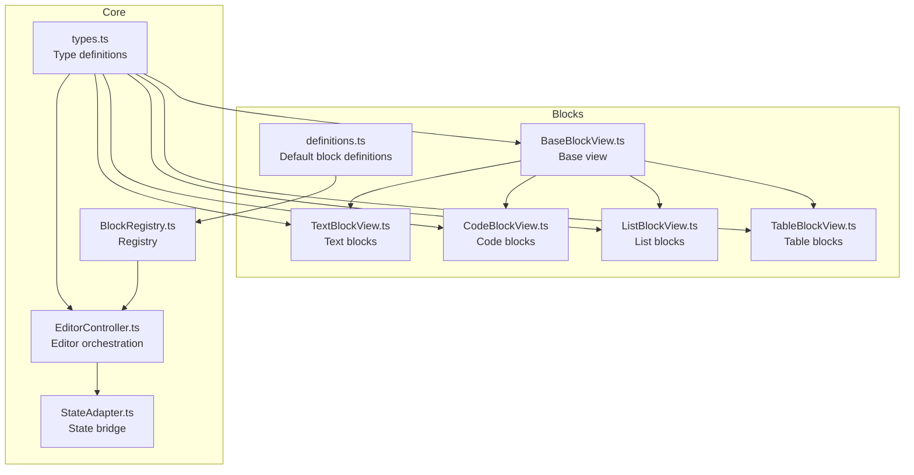
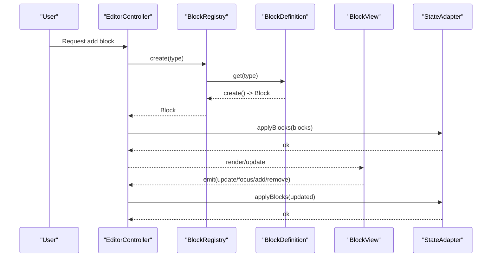
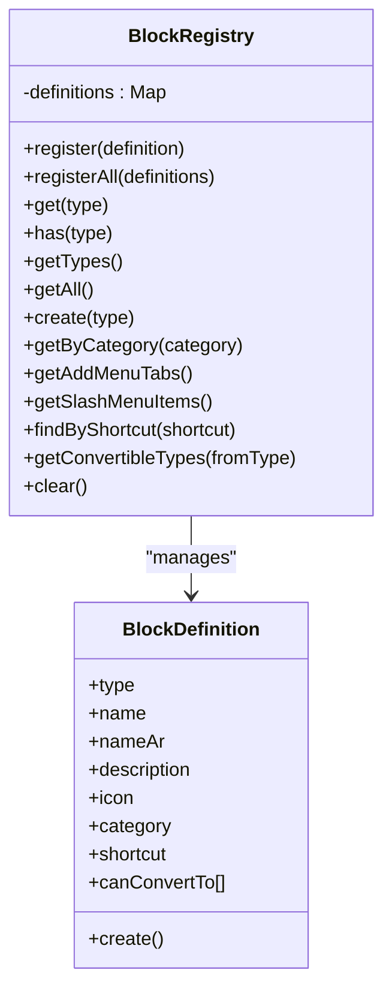
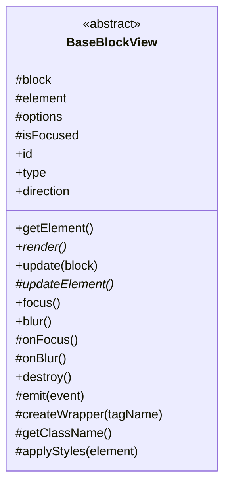
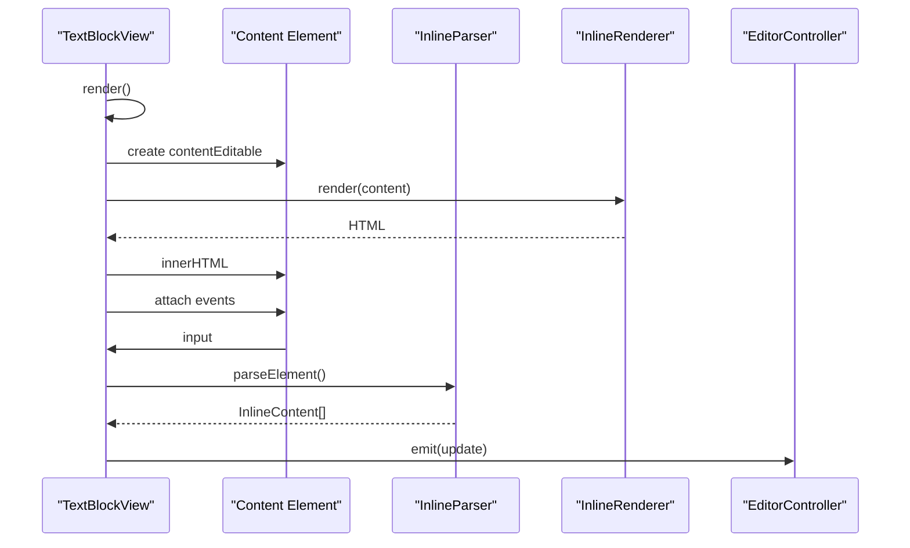
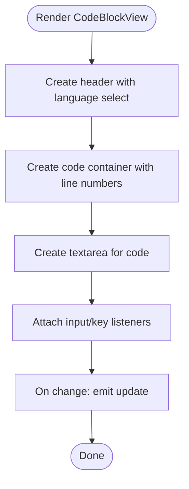
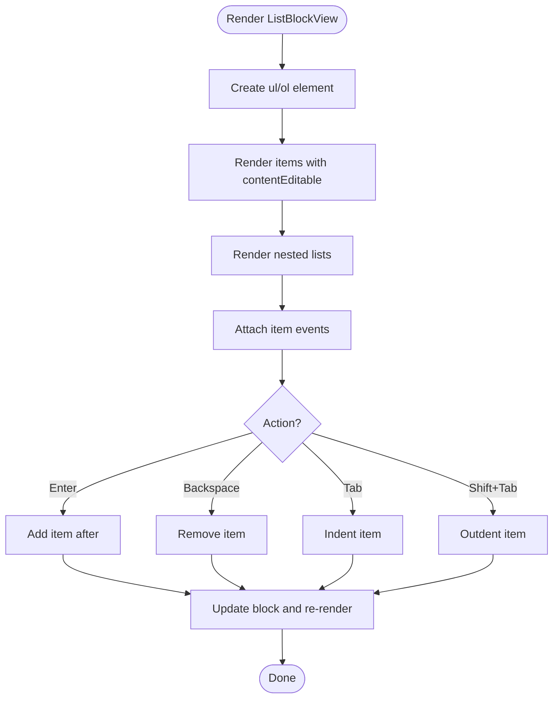
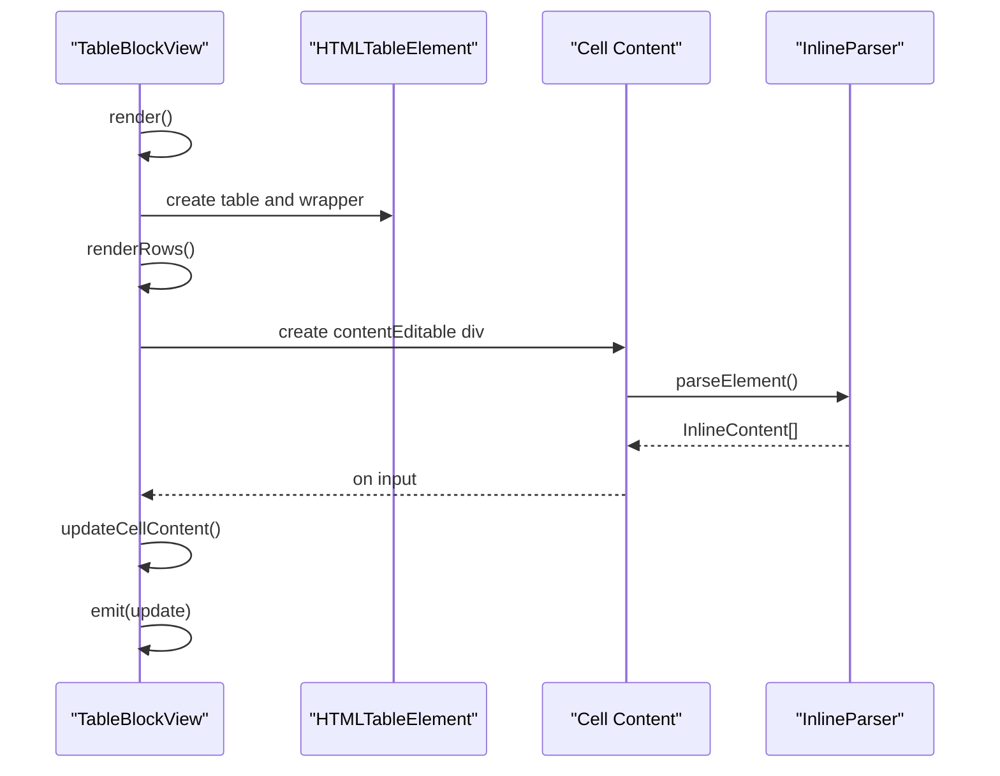
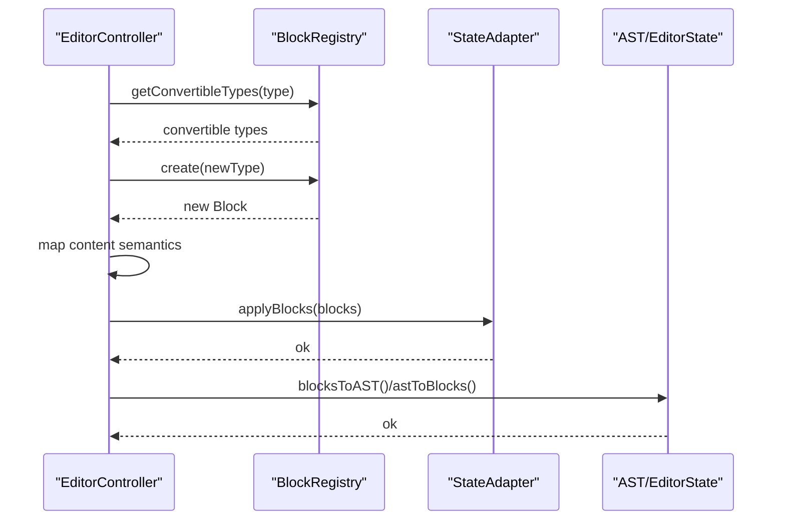
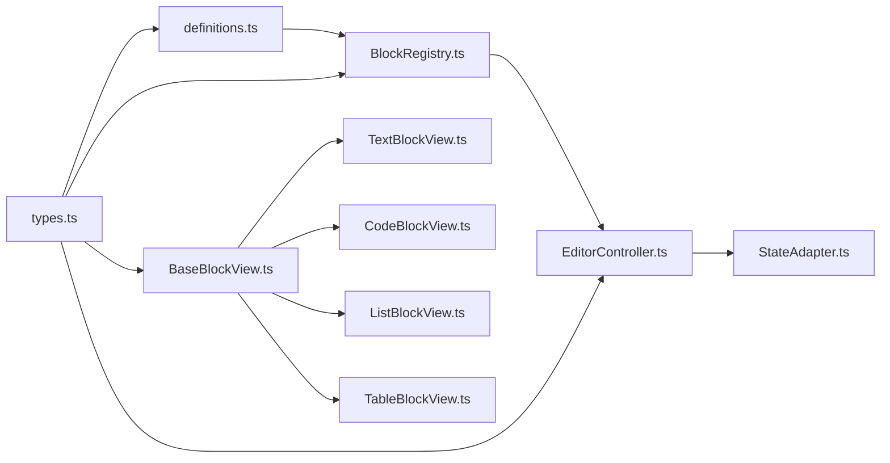

# Block System

<cite>
**Referenced Files in This Document**
- [index.ts](file://artoon-typer/src/blocks/index.ts)
- [definitions.ts](file://artoon-typer/src/blocks/definitions.ts)
- [BlockRegistry.ts](file://artoon-typer/src/core/BlockRegistry.ts)
- [BaseBlockView.ts](file://artoon-typer/src/blocks/views/BaseBlockView.ts)
- [TextBlockView.ts](file://artoon-typer/src/blocks/views/TextBlockView.ts)
- [CodeBlockView.ts](file://artoon-typer/src/blocks/views/CodeBlockView.ts)
- [ListBlockView.ts](file://artoon-typer/src/blocks/views/ListBlockView.ts)
- [TableBlockView.ts](file://artoon-typer/src/blocks/views/TableBlockView.ts)
- [types.ts](file://artoon-typer/src/types.ts)
- [EditorController.ts](file://artoon-typer/src/core/EditorController.ts)
- [StateAdapter.ts](file://artoon-typer/src/integration/StateAdapter.ts)
</cite>

## Table of Contents
1. [Introduction](#introduction)
2. [Project Structure](#project-structure)
3. [Core Components](#core-components)
4. [Architecture Overview](#architecture-overview)
5. [Detailed Component Analysis](#detailed-component-analysis)
6. [Dependency Analysis](#dependency-analysis)
7. [Performance Considerations](#performance-considerations)
8. [Troubleshooting Guide](#troubleshooting-guide)
9. [Conclusion](#conclusion)

## Introduction
This document explains the ARTOON Typer block system architecture. It covers the block registry mechanism, base block view patterns, and individual block implementations. It documents the block lifecycle from registration to rendering, including creation, formatting, and destruction phases. It also details the block view hierarchy with BaseBlockView as the foundation and specialized views such as TextBlockView, CodeBlockView, ListBlockView, and TableBlockView. Finally, it describes block registration, type definitions, dynamic loading, serialization, validation, and integration with the editor state.

## Project Structure
The block system is organized around:
- Block definitions: centralized in a module exporting default definitions and helpers.
- Registry: a singleton managing block type registration and lookup.
- Views: a hierarchy of view classes per block type, inheriting from BaseBlockView.
- Editor controller: orchestrates blocks, selection, and state.
- Integration: bridges Typer blocks to the AST and editor state.

**Diagram sources**
- [definitions.ts:539-588](file://artoon-typer/src/blocks/definitions.ts#L539-L588)
- [BlockRegistry.ts:19-146](file://artoon-typer/src/core/BlockRegistry.ts#L19-L146)
- [BaseBlockView.ts:27-204](file://artoon-typer/src/blocks/views/BaseBlockView.ts#L27-L204)
- [TextBlockView.ts:50-517](file://artoon-typer/src/blocks/views/TextBlockView.ts#L50-L517)
- [CodeBlockView.ts:35-346](file://artoon-typer/src/blocks/views/CodeBlockView.ts#L35-L346)
- [ListBlockView.ts:34-487](file://artoon-typer/src/blocks/views/ListBlockView.ts#L34-L487)
- [TableBlockView.ts:33-410](file://artoon-typer/src/blocks/views/TableBlockView.ts#L33-L410)
- [types.ts:27-386](file://artoon-typer/src/types.ts#L27-L386)
- [EditorController.ts:27-474](file://artoon-typer/src/core/EditorController.ts#L27-L474)
- [StateAdapter.ts:52-522](file://artoon-typer/src/integration/StateAdapter.ts#L52-L522)

**Section sources**
- [index.ts:14-53](file://artoon-typer/src/blocks/index.ts#L14-L53)
- [definitions.ts:539-588](file://artoon-typer/src/blocks/definitions.ts#L539-L588)
- [BlockRegistry.ts:19-146](file://artoon-typer/src/core/BlockRegistry.ts#L19-L146)
- [types.ts:27-386](file://artoon-typer/src/types.ts#L27-L386)

## Core Components
- Block definitions: define type, name, icon, category, keyboard shortcuts, and creation factory for each block type. They are aggregated into a default list and retrievable by type or category.
- Block registry: central registry that registers definitions, creates blocks, and exposes menus and conversion info.
- Base block view: shared behavior for DOM creation, focus/blur, event emission, and style application.
- Specialized views: TextBlockView, CodeBlockView, ListBlockView, TableBlockView implement rendering, editing, and interaction specifics.
- Editor controller: manages blocks, selection, undo/redo, and conversion between block and AST/editor-state representations via StateAdapter.
- Types: strongly-typed block shapes, categories, events, selection, and command interfaces.

**Section sources**
- [definitions.ts:35-588](file://artoon-typer/src/blocks/definitions.ts#L35-L588)
- [BlockRegistry.ts:19-146](file://artoon-typer/src/core/BlockRegistry.ts#L19-L146)
- [BaseBlockView.ts:27-204](file://artoon-typer/src/blocks/views/BaseBlockView.ts#L27-L204)
- [TextBlockView.ts:50-517](file://artoon-typer/src/blocks/views/TextBlockView.ts#L50-L517)
- [CodeBlockView.ts:35-346](file://artoon-typer/src/blocks/views/CodeBlockView.ts#L35-L346)
- [ListBlockView.ts:34-487](file://artoon-typer/src/blocks/views/ListBlockView.ts#L34-L487)
- [TableBlockView.ts:33-410](file://artoon-typer/src/blocks/views/TableBlockView.ts#L33-L410)
- [types.ts:27-386](file://artoon-typer/src/types.ts#L27-L386)
- [EditorController.ts:27-474](file://artoon-typer/src/core/EditorController.ts#L27-L474)
- [StateAdapter.ts:52-522](file://artoon-typer/src/integration/StateAdapter.ts#L52-L522)

## Architecture Overview
The block system follows a layered architecture:
- Definitions layer: declares block capabilities and creation factories.
- Registry layer: manages definitions and exposes creation/conversion/menus.
- View layer: renders and edits blocks, emitting events to the controller.
- Controller layer: orchestrates block operations, selection, and state persistence.
- Integration layer: converts between Typer blocks and AST/editor-state.

**Diagram sources**
- [BlockRegistry.ts:72-78](file://artoon-typer/src/core/BlockRegistry.ts#L72-L78)
- [definitions.ts:35-48](file://artoon-typer/src/blocks/definitions.ts#L35-L48)
- [EditorController.ts:118-131](file://artoon-typer/src/core/EditorController.ts#L118-L131)
- [StateAdapter.ts:134-148](file://artoon-typer/src/integration/StateAdapter.ts#L134-L148)
- [BaseBlockView.ts:135-139](file://artoon-typer/src/blocks/views/BaseBlockView.ts#L135-L139)

## Detailed Component Analysis

### Block Registry and Definitions
- Registry responsibilities:
  - Register single or multiple definitions.
  - Retrieve definitions by type and check existence.
  - Provide block creation via definition factory.
  - Group definitions by category for UI tabs.
  - Expose slash menu items and conversion targets.
  - Find definitions by keyboard shortcut.
- Definitions:
  - Provide type, name, icon, category, optional shortcut, and create() factory.
  - Aggregated into a default list and retrievable by type/category.

**Diagram sources**
- [BlockRegistry.ts:19-146](file://artoon-typer/src/core/BlockRegistry.ts#L19-L146)
- [definitions.ts:469-488](file://artoon-typer/src/blocks/definitions.ts#L469-L488)

**Section sources**
- [BlockRegistry.ts:19-146](file://artoon-typer/src/core/BlockRegistry.ts#L19-L146)
- [definitions.ts:539-588](file://artoon-typer/src/blocks/definitions.ts#L539-L588)

### Base Block View Pattern
- Shared responsibilities:
  - Hold block data and DOM element.
  - Render wrapper with data attributes and direction.
  - Manage focus/blur and emit events.
  - Apply meta styles/data attributes.
  - Provide destroy lifecycle.
- Subclasses override render and updateElement to implement block-specific rendering.

**Diagram sources**
- [BaseBlockView.ts:27-204](file://artoon-typer/src/blocks/views/BaseBlockView.ts#L27-L204)

**Section sources**
- [BaseBlockView.ts:27-204](file://artoon-typer/src/blocks/views/BaseBlockView.ts#L27-L204)

### Text Block View
- Purpose: renders and edits text-based blocks (paragraph, headings, quote).
- Features:
  - ContentEditable wrapper with placeholder.
  - Inline parsing/rendering and selection tracking.
  - Formatting shortcuts (bold, italic, underline) via marks.
  - Event handling for input, keydown, composition, focus, blur.
  - Emits update/focus events to controller.

**Diagram sources**
- [TextBlockView.ts:101-125](file://artoon-typer/src/blocks/views/TextBlockView.ts#L101-L125)
- [TextBlockView.ts:178-195](file://artoon-typer/src/blocks/views/TextBlockView.ts#L178-L195)

**Section sources**
- [TextBlockView.ts:50-517](file://artoon-typer/src/blocks/views/TextBlockView.ts#L50-L517)

### Code Block View
- Purpose: renders code blocks with language selection, line numbers, and copy-to-clipboard.
- Features:
  - Textarea for code editing.
  - Language dropdown with default language list.
  - Line number synchronization.
  - Tab insertion for indentation.
  - Emits update events on code/language changes.

**Diagram sources**
- [CodeBlockView.ts:72-100](file://artoon-typer/src/blocks/views/CodeBlockView.ts#L72-L100)
- [CodeBlockView.ts:208-226](file://artoon-typer/src/blocks/views/CodeBlockView.ts#L208-L226)

**Section sources**
- [CodeBlockView.ts:35-346](file://artoon-typer/src/blocks/views/CodeBlockView.ts#L35-L346)

### List Block View
- Purpose: renders ordered/unordered lists with nested items and indentation controls.
- Features:
  - Renders nested lists recursively.
  - Handles item input, adding/removing items, and indentation/outdentation.
  - Tracks focused item and supports navigation.

**Diagram sources**
- [ListBlockView.ts:83-99](file://artoon-typer/src/blocks/views/ListBlockView.ts#L83-L99)
- [ListBlockView.ts:194-232](file://artoon-typer/src/blocks/views/ListBlockView.ts#L194-L232)

**Section sources**
- [ListBlockView.ts:34-487](file://artoon-typer/src/blocks/views/ListBlockView.ts#L34-L487)

### Table Block View
- Purpose: renders editable tables with row/column operations and cell navigation.
- Features:
  - Renders thead/tbody depending on header flag.
  - Cell contentEditable with inline parsing.
  - Navigation via Tab/Shift+Tab and Ctrl+Arrows.
  - Add/remove rows and columns.

**Diagram sources**
- [TableBlockView.ts:79-101](file://artoon-typer/src/blocks/views/TableBlockView.ts#L79-L101)
- [TableBlockView.ts:205-217](file://artoon-typer/src/blocks/views/TableBlockView.ts#L205-L217)

**Section sources**
- [TableBlockView.ts:33-410](file://artoon-typer/src/blocks/views/TableBlockView.ts#L33-L410)

### Editor Controller and State Integration
- Responsibilities:
  - Initialize with default or custom blocks, or parse initial ARTOON content.
  - Manage block CRUD, conversion, duplication, movement, and direction toggling.
  - Maintain selection and focus state.
  - Integrate with StateAdapter for undo/redo and AST conversion.
- Conversion logic:
  - Cross-type conversions preserve content semantics (text ↔ list).
  - Direction and id are preserved during conversion.

**Diagram sources**
- [EditorController.ts:218-282](file://artoon-typer/src/core/EditorController.ts#L218-L282)
- [StateAdapter.ts:214-223](file://artoon-typer/src/integration/StateAdapter.ts#L214-L223)
- [StateAdapter.ts:374-403](file://artoon-typer/src/integration/StateAdapter.ts#L374-L403)

**Section sources**
- [EditorController.ts:27-474](file://artoon-typer/src/core/EditorController.ts#L27-L474)
- [StateAdapter.ts:52-522](file://artoon-typer/src/integration/StateAdapter.ts#L52-L522)

## Dependency Analysis
- Definitions depend on types and utilities to generate IDs.
- Registry depends on definitions and exposes creation/conversion/menus.
- Views depend on BaseBlockView and inline renderer/parser for text-like blocks.
- EditorController depends on Registry, StateAdapter, and types.
- StateAdapter depends on types and AST interfaces for conversion.

**Diagram sources**
- [types.ts:27-386](file://artoon-typer/src/types.ts#L27-L386)
- [definitions.ts:29-28](file://artoon-typer/src/blocks/definitions.ts#L29-L28)
- [BlockRegistry.ts:8-14](file://artoon-typer/src/core/BlockRegistry.ts#L8-L14)
- [EditorController.ts:8-22](file://artoon-typer/src/core/EditorController.ts#L8-L22)
- [StateAdapter.ts:11-38](file://artoon-typer/src/integration/StateAdapter.ts#L11-L38)
- [BaseBlockView.ts:8-9](file://artoon-typer/src/blocks/views/BaseBlockView.ts#L8-L9)
- [TextBlockView.ts:8-12](file://artoon-typer/src/blocks/views/TextBlockView.ts#L8-L12)
- [CodeBlockView.ts:7-8](file://artoon-typer/src/blocks/views/CodeBlockView.ts#L7-L8)
- [ListBlockView.ts:8-12](file://artoon-typer/src/blocks/views/ListBlockView.ts#L8-L12)
- [TableBlockView.ts:7-11](file://artoon-typer/src/blocks/views/TableBlockView.ts#L7-L11)

**Section sources**
- [types.ts:27-386](file://artoon-typer/src/types.ts#L27-L386)
- [BlockRegistry.ts:19-146](file://artoon-typer/src/core/BlockRegistry.ts#L19-L146)
- [EditorController.ts:27-474](file://artoon-typer/src/core/EditorController.ts#L27-L474)
- [StateAdapter.ts:52-522](file://artoon-typer/src/integration/StateAdapter.ts#L52-L522)

## Performance Considerations
- Rendering:
  - TextBlockView uses an inline renderer/parser; avoid excessive re-renders by batching content updates and using efficient DOM updates.
  - CodeBlockView maintains line numbers; keep line counts reasonable to prevent heavy DOM updates.
- Selection:
  - TextBlockView computes offsets via tree walking; cache positions when possible and minimize frequent recalculations.
- Lists and Tables:
  - Recursive rendering of nested lists and table cells can be expensive; consider virtualization or partial updates for large structures.
- Registry:
  - Map-based lookups are O(1); keep the registry lean and avoid frequent re-registration.

## Troubleshooting Guide
- Unknown block type:
  - Symptom: attempting to create a block throws an error.
  - Cause: missing registration.
  - Fix: ensure the block definition is registered via the registry.
  - Section sources
    - [BlockRegistry.ts:72-78](file://artoon-typer/src/core/BlockRegistry.ts#L72-L78)
- Conversion not allowed:
  - Symptom: convertBlock does nothing or logs a warning.
  - Cause: target type not in canConvertTo.
  - Fix: verify the conversion matrix in the definition and registry.
  - Section sources
    - [EditorController.ts:218-227](file://artoon-typer/src/core/EditorController.ts#L218-L227)
    - [BlockRegistry.ts:136-139](file://artoon-typer/src/core/BlockRegistry.ts#L136-L139)
- Focus/selection issues:
  - Symptom: focus not applied or selection not tracked.
  - Cause: missing or incorrect event wiring.
  - Fix: ensure focus/blur and selectionchange listeners are attached in the view.
  - Section sources
    - [TextBlockView.ts:158-173](file://artoon-typer/src/blocks/views/TextBlockView.ts#L158-L173)
    - [TextBlockView.ts:256-270](file://artoon-typer/src/blocks/views/TextBlockView.ts#L256-L270)
- Undo/redo not working:
  - Symptom: no state changes recorded.
  - Cause: StateAdapter history stacks empty or not updated.
  - Fix: ensure applyBlocks is called after block changes; verify history depth and trimming.
  - Section sources
    - [StateAdapter.ts:134-148](file://artoon-typer/src/integration/StateAdapter.ts#L134-L148)
    - [StateAdapter.ts:90-129](file://artoon-typer/src/integration/StateAdapter.ts#L90-L129)

## Conclusion
The ARTOON Typer block system provides a robust, extensible framework:
- Definitions and registry enable dynamic block loading and conversion.
- BaseBlockView and specialized views encapsulate rendering and interaction.
- EditorController coordinates block operations and integrates with state and AST.
- Extensibility is achieved by registering new definitions and views, preserving editor state through StateAdapter, and leveraging the conversion matrix for seamless transformations.