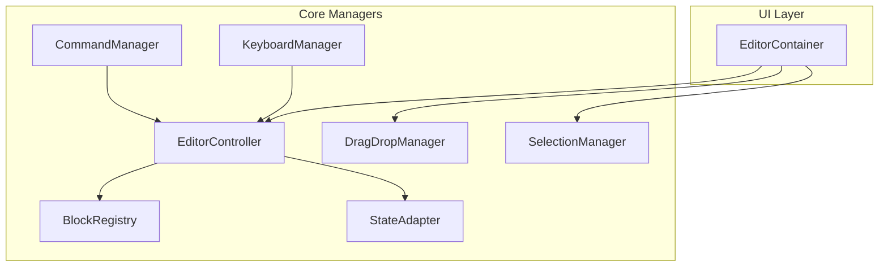
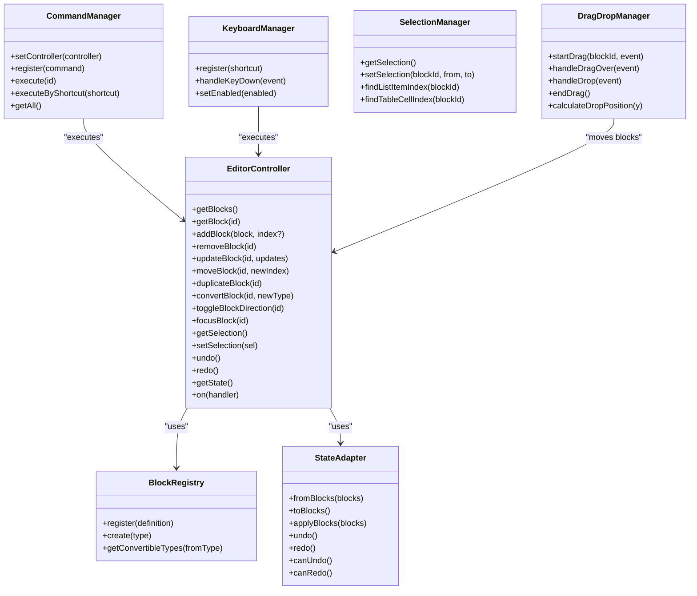
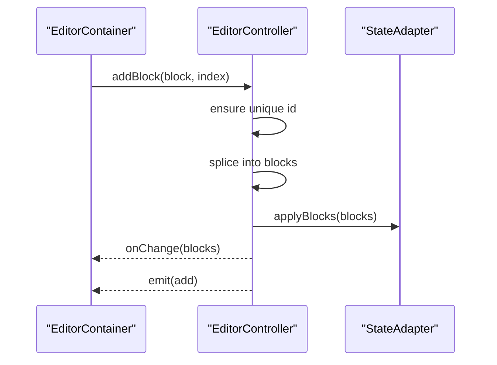
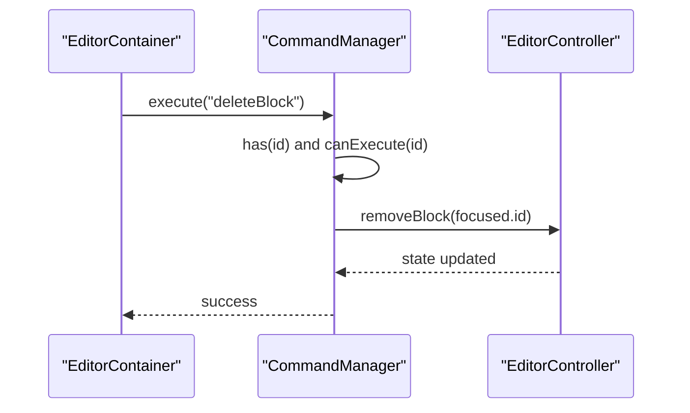
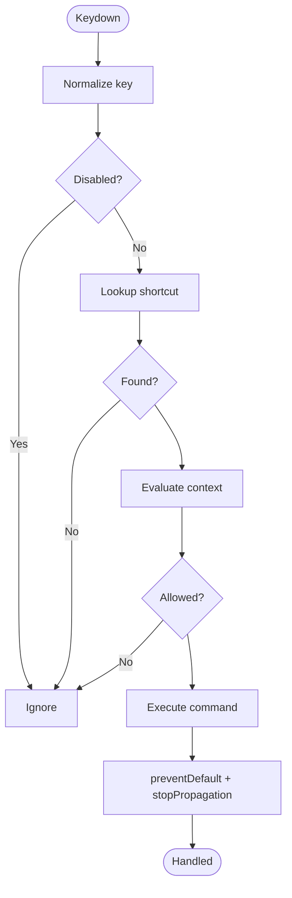
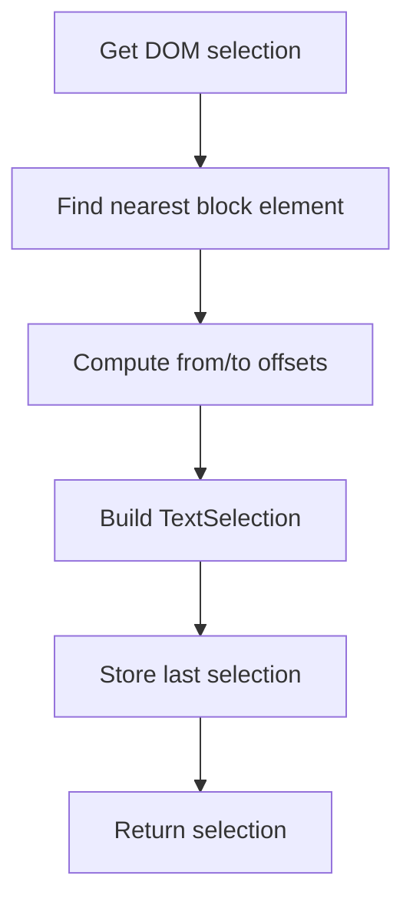
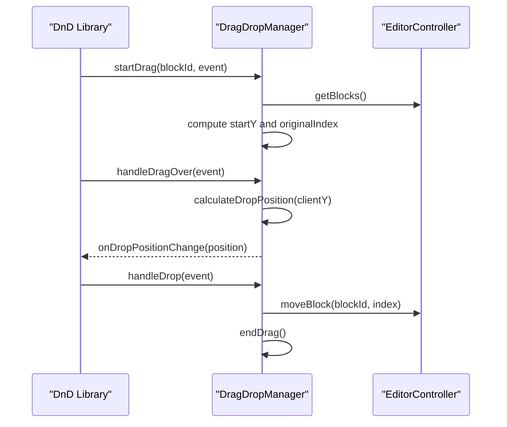
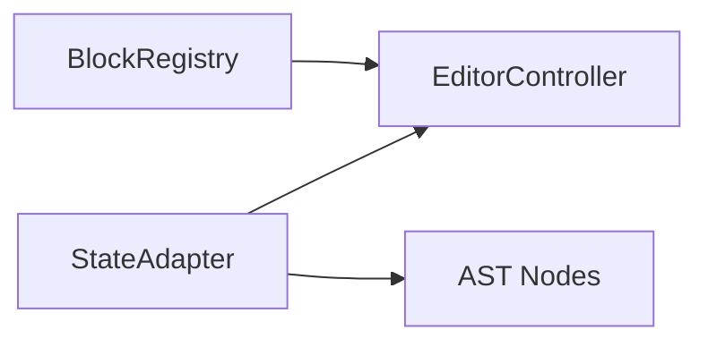
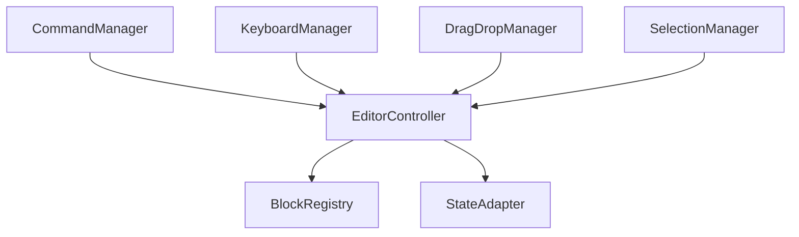

# Core Managers

<cite>
**Referenced Files in This Document**
- [EditorController.ts](file://artoon-typer/src/core/EditorController.ts)
- [CommandManager.ts](file://artoon-typer/src/core/CommandManager.ts)
- [KeyboardManager.ts](file://artoon-typer/src/core/KeyboardManager.ts)
- [SelectionManager.ts](file://artoon-typer/src/core/SelectionManager.ts)
- [DragDropManager.ts](file://artoon-typer/src/core/DragDropManager.ts)
- [BlockRegistry.ts](file://artoon-typer/src/core/BlockRegistry.ts)
- [StateAdapter.ts](file://artoon-typer/src/integration/StateAdapter.ts)
- [types.ts](file://artoon-typer/src/types.ts)
- [EditorContainer.tsx](file://artoon-typer/src/ui/components/EditorContainer.tsx)
- [index.ts](file://artoon-typer/src/core/index.ts)
</cite>

## Table of Contents
1. [Introduction](#introduction)
2. [Project Structure](#project-structure)
3. [Core Components](#core-components)
4. [Architecture Overview](#architecture-overview)
5. [Detailed Component Analysis](#detailed-component-analysis)
6. [Dependency Analysis](#dependency-analysis)
7. [Performance Considerations](#performance-considerations)
8. [Troubleshooting Guide](#troubleshooting-guide)
9. [Conclusion](#conclusion)

## Introduction
This document explains the core manager classes that orchestrate the ARTOON Typer Editor:
- EditorController: central orchestrator managing blocks, selection, focus, and history via a state adapter.
- CommandManager: registers and executes editor commands, including built-in commands for undo/redo and block operations.
- KeyboardManager: handles keyboard shortcuts and commands for formatting, editing, navigation, and block operations.
- SelectionManager: manages text selection within blocks and provides utilities to resolve selections in complex structures (lists, tables).
- DragDropManager: supports drag-and-drop reordering of blocks with mouse and touch, integrating with external libraries for advanced UX.

It also covers interdependencies, initialization order, communication patterns, error handling, state synchronization, and performance considerations.

## Project Structure
The core managers live under artoon-typer/src/core and integrate with UI components under artoon-typer/src/ui/components. The EditorController composes a BlockRegistry and a StateAdapter to manage blocks and history. The UI layer (EditorContainer) exposes operations that delegate to the EditorController and integrates with DragDropManager and SelectionManager.

**Diagram sources**
- [EditorController.ts:27-67](file://artoon-typer/src/core/EditorController.ts#L27-L67)
- [CommandManager.ts:16-25](file://artoon-typer/src/core/CommandManager.ts#L16-L25)
- [KeyboardManager.ts:65-85](file://artoon-typer/src/core/KeyboardManager.ts#L65-L85)
- [SelectionManager.ts:15-20](file://artoon-typer/src/core/SelectionManager.ts#L15-L20)
- [DragDropManager.ts:53-68](file://artoon-typer/src/core/DragDropManager.ts#L53-L68)
- [BlockRegistry.ts:19-20](file://artoon-typer/src/core/BlockRegistry.ts#L19-L20)
- [StateAdapter.ts:52-56](file://artoon-typer/src/integration/StateAdapter.ts#L52-L56)
- [EditorContainer.tsx:60-104](file://artoon-typer/src/ui/components/EditorContainer.tsx#L60-L104)

**Section sources**
- [EditorController.ts:27-67](file://artoon-typer/src/core/EditorController.ts#L27-L67)
- [CommandManager.ts:16-25](file://artoon-typer/src/core/CommandManager.ts#L16-L25)
- [KeyboardManager.ts:65-85](file://artoon-typer/src/core/KeyboardManager.ts#L65-L85)
- [SelectionManager.ts:15-20](file://artoon-typer/src/core/SelectionManager.ts#L15-L20)
- [DragDropManager.ts:53-68](file://artoon-typer/src/core/DragDropManager.ts#L53-L68)
- [BlockRegistry.ts:19-20](file://artoon-typer/src/core/BlockRegistry.ts#L19-L20)
- [StateAdapter.ts:52-56](file://artoon-typer/src/integration/StateAdapter.ts#L52-L56)
- [EditorContainer.tsx:60-104](file://artoon-typer/src/ui/components/EditorContainer.tsx#L60-L104)

## Core Components
- EditorController
  - Manages blocks, selection, focus, and history.
  - Initializes BlockRegistry and StateAdapter, and optionally parses initial content.
  - Emits block events and notifies onChange callbacks.
  - Coordinates block operations (add/update/remove/move/duplicate/convert) and direction toggles.
- CommandManager
  - Registers and executes commands; includes built-in commands for undo/redo and block operations.
  - Validates availability of EditorController and checks canExecute conditions.
- KeyboardManager
  - Normalizes key combinations and evaluates shortcut contexts (e.g., hasSelection, inBlock, atBlockStart).
  - Executes keyboard commands for formatting, splitting/merging blocks, and block operations.
- SelectionManager
  - Extracts and sets DOM selections mapped to block IDs and offsets.
  - Provides utilities to locate selections within list items and table cells.
- DragDropManager
  - Computes drop positions based on client Y and block bounding boxes.
  - Integrates with external drag-and-drop libraries to move blocks and emits state changes.

**Section sources**
- [EditorController.ts:27-475](file://artoon-typer/src/core/EditorController.ts#L27-L475)
- [CommandManager.ts:16-304](file://artoon-typer/src/core/CommandManager.ts#L16-L304)
- [KeyboardManager.ts:65-680](file://artoon-typer/src/core/KeyboardManager.ts#L65-L680)
- [SelectionManager.ts:15-322](file://artoon-typer/src/core/SelectionManager.ts#L15-L322)
- [DragDropManager.ts:53-328](file://artoon-typer/src/core/DragDropManager.ts#L53-L328)

## Architecture Overview
The EditorController acts as the central orchestrator. It depends on:
- BlockRegistry for block type definitions and conversions.
- StateAdapter for history and serialization to/from AST-like structures.
- UI components (EditorContainer) for rendering and user interaction.

CommandManager and KeyboardManager depend on EditorController to perform operations. SelectionManager is used by KeyboardManager and UI components to resolve selections. DragDropManager interacts with EditorController to reorder blocks.

**Diagram sources**
- [EditorController.ts:27-475](file://artoon-typer/src/core/EditorController.ts#L27-L475)
- [BlockRegistry.ts:19-174](file://artoon-typer/src/core/BlockRegistry.ts#L19-L174)
- [StateAdapter.ts:52-523](file://artoon-typer/src/integration/StateAdapter.ts#L52-L523)
- [CommandManager.ts:16-304](file://artoon-typer/src/core/CommandManager.ts#L16-L304)
- [KeyboardManager.ts:65-680](file://artoon-typer/src/core/KeyboardManager.ts#L65-L680)
- [SelectionManager.ts:15-322](file://artoon-typer/src/core/SelectionManager.ts#L15-L322)
- [DragDropManager.ts:53-328](file://artoon-typer/src/core/DragDropManager.ts#L53-L328)

## Detailed Component Analysis

### EditorController
- Responsibilities
  - Manage block lifecycle: add, remove, update, move, duplicate, convert.
  - Track focused block and selection state.
  - Provide undo/redo via StateAdapter and notify onChange.
  - Emit block events to subscribers.
- Initialization
  - Creates BlockRegistry (default or custom) and StateAdapter.
  - Parses initialContent using ARTOONImporter or initializes with default paragraph.
- Interactions
  - Delegates block conversion to BlockRegistry.
  - Persists state changes to StateAdapter and triggers onChange.
  - Emits events for add/remove/update/move/focus.

**Diagram sources**
- [EditorController.ts:120-131](file://artoon-typer/src/core/EditorController.ts#L120-L131)
- [StateAdapter.ts:134-148](file://artoon-typer/src/integration/StateAdapter.ts#L134-L148)

**Section sources**
- [EditorController.ts:27-475](file://artoon-typer/src/core/EditorController.ts#L27-L475)
- [StateAdapter.ts:52-148](file://artoon-typer/src/integration/StateAdapter.ts#L52-L148)

### CommandManager
- Responsibilities
  - Centralized command registry and execution.
  - Built-in commands: undo, redo, deleteBlock, duplicateBlock, moveBlockUp/Down, toggleDirection.
  - Validates controller presence and canExecute conditions before executing.
- Integration
  - Exposed via core index; used by UI to trigger actions.

**Diagram sources**
- [CommandManager.ts:100-123](file://artoon-typer/src/core/CommandManager.ts#L100-L123)
- [CommandManager.ts:178-189](file://artoon-typer/src/core/CommandManager.ts#L178-L189)
- [EditorController.ts:136-156](file://artoon-typer/src/core/EditorController.ts#L136-L156)

**Section sources**
- [CommandManager.ts:16-304](file://artoon-typer/src/core/CommandManager.ts#L16-L304)
- [index.ts:15-26](file://artoon-typer/src/core/index.ts#L15-L26)

### KeyboardManager
- Responsibilities
  - Normalizes keys and evaluates context (always, hasSelection, inBlock, atBlockStart, inList, emptyBlock).
  - Provides keyboard commands for formatting, splitting/merging blocks, and block operations.
  - Executes commands against EditorController and prevents default browser behavior when handled.
- Implementation highlights
  - Default shortcuts include formatting (Ctrl+B/I/U/S/H), history (Ctrl+Z/Y), block conversions (Ctrl+Alt+0..3), Enter/Backspace overrides, duplication, and move-up/down.
  - Uses SelectionManager to resolve selection state for split/merge logic.

**Diagram sources**
- [KeyboardManager.ts:133-162](file://artoon-typer/src/core/KeyboardManager.ts#L133-L162)
- [KeyboardManager.ts:390-424](file://artoon-typer/src/core/KeyboardManager.ts#L390-L424)

**Section sources**
- [KeyboardManager.ts:65-680](file://artoon-typer/src/core/KeyboardManager.ts#L65-L680)
- [SelectionManager.ts:15-322](file://artoon-typer/src/core/SelectionManager.ts#L15-L322)

### SelectionManager
- Responsibilities
  - Resolve DOM selection to a structured TextSelection with blockId and offsets.
  - Set programmatic selections and compute positions within complex structures (lists, tables).
- Usage
  - Used by KeyboardManager for split/merge decisions and by UI components for caret placement.

**Diagram sources**
- [SelectionManager.ts:21-64](file://artoon-typer/src/core/SelectionManager.ts#L21-L64)
- [SelectionManager.ts:196-237](file://artoon-typer/src/core/SelectionManager.ts#L196-L237)

**Section sources**
- [SelectionManager.ts:15-322](file://artoon-typer/src/core/SelectionManager.ts#L15-L322)

### DragDropManager
- Responsibilities
  - Determine drop positions based on client Y and block bounding boxes.
  - Move blocks via EditorController and notify callbacks for drag lifecycle.
- Integration
  - UI uses external drag-and-drop library; DragDropManager coordinates with EditorController to finalize moves.

**Diagram sources**
- [DragDropManager.ts:101-194](file://artoon-typer/src/core/DragDropManager.ts#L101-L194)
- [DragDropManager.ts:221-242](file://artoon-typer/src/core/DragDropManager.ts#L221-L242)

**Section sources**
- [DragDropManager.ts:53-328](file://artoon-typer/src/core/DragDropManager.ts#L53-L328)
- [EditorContainer.tsx:122-144](file://artoon-typer/src/ui/components/EditorContainer.tsx#L122-L144)

### BlockRegistry and StateAdapter
- BlockRegistry
  - Centralizes block definitions, categories, and conversion capabilities.
  - Provides default block definitions and conversion matrices.
- StateAdapter
  - Manages a simple history stack for undo/redo.
  - Converts between internal Block[] and AST-like content nodes (planned integration path).

**Diagram sources**
- [BlockRegistry.ts:19-174](file://artoon-typer/src/core/BlockRegistry.ts#L19-L174)
- [StateAdapter.ts:52-523](file://artoon-typer/src/integration/StateAdapter.ts#L52-L523)
- [EditorController.ts:27-67](file://artoon-typer/src/core/EditorController.ts#L27-L67)

**Section sources**
- [BlockRegistry.ts:19-174](file://artoon-typer/src/core/BlockRegistry.ts#L19-L174)
- [StateAdapter.ts:52-523](file://artoon-typer/src/integration/StateAdapter.ts#L52-L523)

## Dependency Analysis
- Coupling and Cohesion
  - EditorController has high cohesion around block/state management and low coupling to UI via events and onChange.
  - CommandManager and KeyboardManager depend on EditorControllerInterface, enabling decoupled command execution.
  - SelectionManager and DragDropManager are utility-focused and depend on DOM APIs and EditorController respectively.
- External Dependencies
  - UI layer integrates with a drag-and-drop library for advanced UX; DragDropManager coordinates with EditorController to finalize moves.
- Potential Circular Dependencies
  - None observed among core managers; UI components depend on core managers, not vice versa.

**Diagram sources**
- [EditorController.ts:27-67](file://artoon-typer/src/core/EditorController.ts#L27-L67)
- [CommandManager.ts:16-25](file://artoon-typer/src/core/CommandManager.ts#L16-L25)
- [KeyboardManager.ts:65-85](file://artoon-typer/src/core/KeyboardManager.ts#L65-L85)
- [DragDropManager.ts:53-68](file://artoon-typer/src/core/DragDropManager.ts#L53-L68)
- [SelectionManager.ts:15-20](file://artoon-typer/src/core/SelectionManager.ts#L15-L20)

**Section sources**
- [EditorController.ts:27-67](file://artoon-typer/src/core/EditorController.ts#L27-L67)
- [CommandManager.ts:16-25](file://artoon-typer/src/core/CommandManager.ts#L16-L25)
- [KeyboardManager.ts:65-85](file://artoon-typer/src/core/KeyboardManager.ts#L65-L85)
- [SelectionManager.ts:15-20](file://artoon-typer/src/core/SelectionManager.ts#L15-L20)
- [DragDropManager.ts:53-68](file://artoon-typer/src/core/DragDropManager.ts#L53-L68)

## Performance Considerations
- State Synchronization
  - EditorController clones blocks before returning them to avoid mutation leaks; deepClone is used for safety but can be expensive for large documents. Consider shallow copies where safe and deepClone only when necessary.
- History Management
  - StateAdapter maintains a bounded undo stack; ensure maxDepth is tuned for typical document sizes to balance memory and responsiveness.
- DOM Operations
  - KeyboardManager and SelectionManager operate on DOM selections; minimize frequent reflows by batching updates and deferring selection restoration.
- Drag-and-Drop
  - DragDropManager computes drop positions per move; cache bounding rectangles when possible and throttle handleDragOver to reduce layout thrashing.

[No sources needed since this section provides general guidance]

## Troubleshooting Guide
- Commands fail to execute
  - Verify CommandManager has a controller set and the command exists; check canExecute conditions.
- Keyboard shortcuts not working
  - Confirm shortcuts are not disabled and context evaluation passes; ensure KeyboardManager is enabled.
- Selection issues
  - SelectionManager requires a block element with a data-block-id; ensure rendering assigns correct attributes and that selections remain within editor boundaries.
- Drag-and-drop not moving blocks
  - Ensure DragDropManager receives a valid container and that EditorController.moveBlock is invoked with the computed index.
- Undo/Redo not available
  - Confirm StateAdapter has entries on the stacks and that EditorController.saveState is called after operations.

**Section sources**
- [CommandManager.ts:100-123](file://artoon-typer/src/core/CommandManager.ts#L100-L123)
- [KeyboardManager.ts:133-162](file://artoon-typer/src/core/KeyboardManager.ts#L133-L162)
- [SelectionManager.ts:21-64](file://artoon-typer/src/core/SelectionManager.ts#L21-L64)
- [DragDropManager.ts:101-194](file://artoon-typer/src/core/DragDropManager.ts#L101-L194)
- [StateAdapter.ts:104-129](file://artoon-typer/src/integration/StateAdapter.ts#L104-L129)

## Conclusion
The ARTOON Typer Editor’s core managers form a cohesive, modular system:
- EditorController orchestrates blocks, selection, focus, and history.
- CommandManager and KeyboardManager provide flexible command execution and keyboard-driven editing.
- SelectionManager and DragDropManager enable precise selection handling and intuitive reordering.
- BlockRegistry and StateAdapter encapsulate block definitions and state persistence.

Initialization order is straightforward: create BlockRegistry and StateAdapter, initialize EditorController with either initialBlocks or initialContent, then wire UI components to call EditorController operations. Communication relies on events, callbacks, and direct method invocations, keeping the system maintainable and extensible.