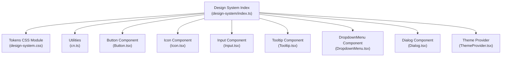
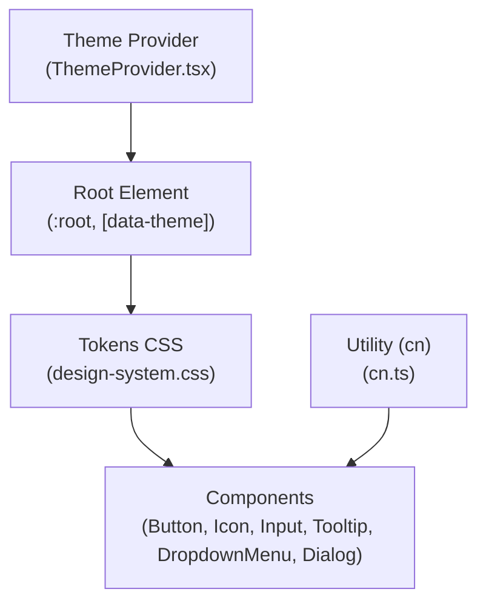
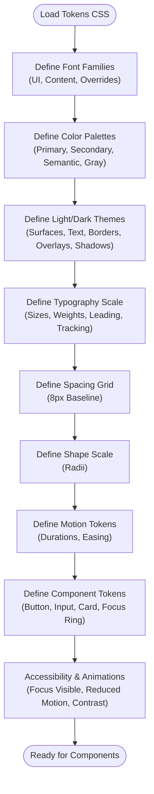
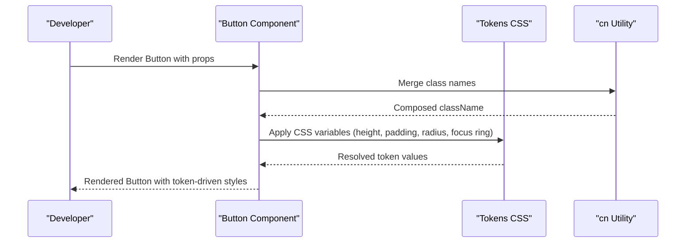
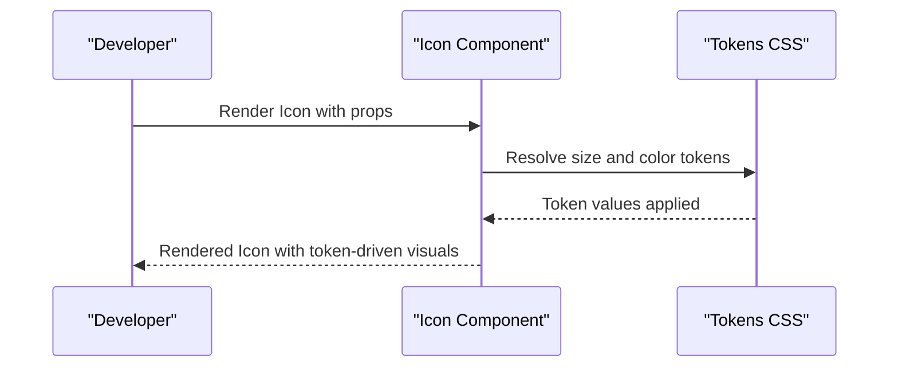
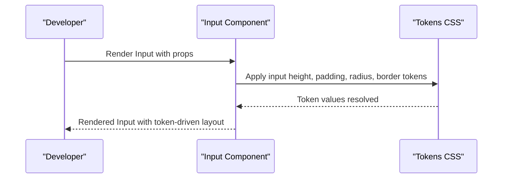
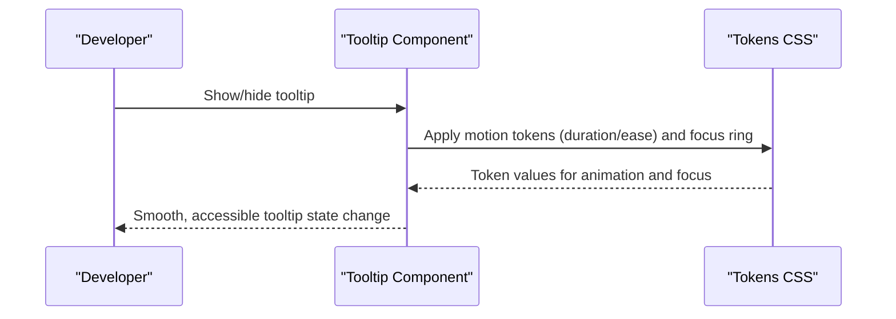
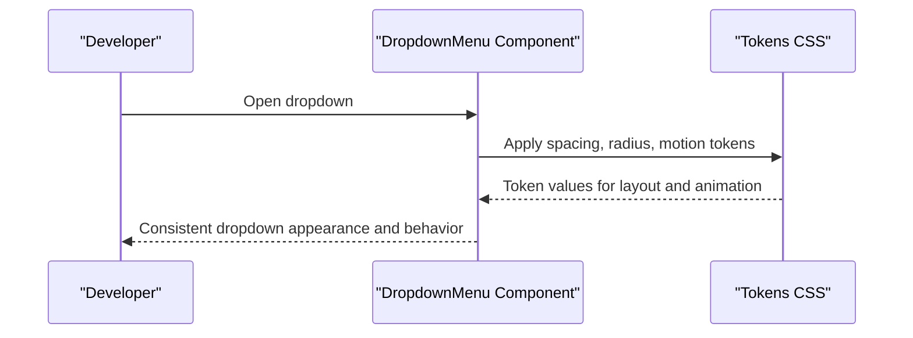
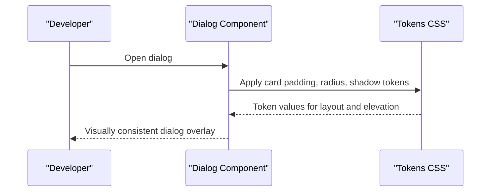
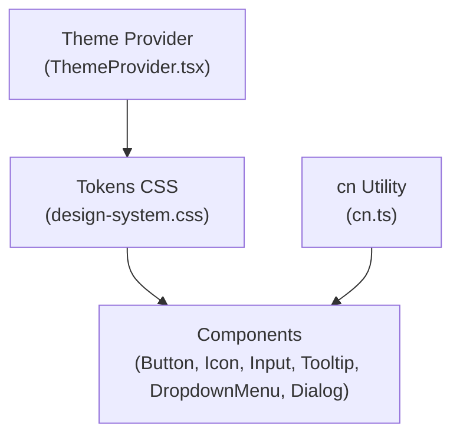

# Design System

<cite>
**Referenced Files in This Document**
- [design-system/index.ts](file://artoon-typer/src/design-system/index.ts)
- [design-system.css](file://artoon-typer/src/ui/styles/v2/design-system.css)
- [Button.tsx](file://artoon-typer/src/design-system/components/Button/Button.tsx)
- [Icon.tsx](file://artoon-typer/src/design-system/components/Icon/Icon.tsx)
- [Input.tsx](file://artoon-typer/src/design-system/components/Input/Input.tsx)
- [Tooltip.tsx](file://artoon-typer/src/design-system/components/Tooltip/Tooltip.tsx)
- [DropdownMenu.tsx](file://artoon-typer/src/design-system/components/DropdownMenu/DropdownMenu.tsx)
- [Dialog.tsx](file://artoon-typer/src/design-system/components/Dialog/Dialog.tsx)
- [ThemeProvider.tsx](file://artoon-typer/src/themes/ThemeProvider.tsx)
- [types.ts](file://artoon-typer/src/themes/types.ts)
- [cn.ts](file://artoon-typer/src/design-system/utils/cn.ts)
</cite>

## Table of Contents
1. [Introduction](#introduction)
2. [Project Structure](#project-structure)
3. [Core Components](#core-components)
4. [Architecture Overview](#architecture-overview)
5. [Detailed Component Analysis](#detailed-component-analysis)
6. [Dependency Analysis](#dependency-analysis)
7. [Performance Considerations](#performance-considerations)
8. [Troubleshooting Guide](#troubleshooting-guide)
9. [Conclusion](#conclusion)
10. [Appendices](#appendices)

## Introduction
This document describes the ARTOON Typer design system foundation, focusing on design tokens (colors, typography, spacing, shapes, motion), the component library built on top of them, and the strategy for evolving and extending the system. It explains how CSS variables map to tokens, how components consume tokens, and how themes integrate with the system. Practical guidance is included for using tokens in custom components, adding new tokens, and maintaining consistency across the editor.

## Project Structure
The design system is organized around a central index that re-exports tokens, utilities, and components. The primary token definitions live in a dedicated CSS module that defines fonts, resets, color palettes, typography scales, spacing grid, shapes, motion, component tokens, accessibility, and animations.

**Diagram sources**
- [design-system/index.ts:1-19](file://artoon-typer/src/design-system/index.ts#L1-L19)
- [design-system.css:1-502](file://artoon-typer/src/ui/styles/v2/design-system.css#L1-L502)
- [Button.tsx](file://artoon-typer/src/design-system/components/Button/Button.tsx)
- [Icon.tsx](file://artoon-typer/src/design-system/components/Icon/Icon.tsx)
- [Input.tsx](file://artoon-typer/src/design-system/components/Input/Input.tsx)
- [Tooltip.tsx](file://artoon-typer/src/design-system/components/Tooltip/Tooltip.tsx)
- [DropdownMenu.tsx](file://artoon-typer/src/design-system/components/DropdownMenu/DropdownMenu.tsx)
- [Dialog.tsx](file://artoon-typer/src/design-system/components/Dialog/Dialog.tsx)
- [ThemeProvider.tsx](file://artoon-typer/src/themes/ThemeProvider.tsx)

**Section sources**
- [design-system/index.ts:1-19](file://artoon-typer/src/design-system/index.ts#L1-L19)

## Core Components
The design system exposes a curated set of UI primitives and composite components that consume tokens via CSS variables. These include Button, Icon, Input, Tooltip, DropdownMenu, and Dialog. Utilities like cn help compose conditional class names consistently.

Key exports:
- Tokens: centralized CSS variables for colors, typography, spacing, shapes, motion, and component tokens
- Utilities: cn for merging class names
- Components: Button, Icon, Input, Tooltip, DropdownMenu, Dialog

Usage pattern:
- Components read tokens from CSS variables defined in the tokens CSS module
- Themes switch token values via data attributes on the root element
- Utilities like cn ensure consistent composition of component classes

**Section sources**
- [design-system/index.ts:6-19](file://artoon-typer/src/design-system/index.ts#L6-L19)
- [cn.ts](file://artoon-typer/src/design-system/utils/cn.ts)

## Architecture Overview
The design system architecture centers on CSS variables as the single source of truth for design tokens. Components consume these variables, while themes dynamically alter token values. Accessibility and motion preferences are handled through media queries and CSS variables.

**Diagram sources**
- [design-system.css:10-253](file://artoon-typer/src/ui/styles/v2/design-system.css#L10-L253)
- [Button.tsx](file://artoon-typer/src/design-system/components/Button/Button.tsx)
- [Icon.tsx](file://artoon-typer/src/design-system/components/Icon/Icon.tsx)
- [Input.tsx](file://artoon-typer/src/design-system/components/Input/Input.tsx)
- [Tooltip.tsx](file://artoon-typer/src/design-system/components/Tooltip/Tooltip.tsx)
- [DropdownMenu.tsx](file://artoon-typer/src/design-system/components/DropdownMenu/DropdownMenu.tsx)
- [Dialog.tsx](file://artoon-typer/src/design-system/components/Dialog/Dialog.tsx)
- [ThemeProvider.tsx](file://artoon-typer/src/themes/ThemeProvider.tsx)

## Detailed Component Analysis

### Token Hierarchy and CSS Variable Mapping
The tokens CSS module defines a structured hierarchy:
- Fonts: UI and content families, with per-font overrides via data attributes
- Base reset and base styles
- Color system: primary, secondary, semantic, and neutral grays
- Light and dark themes: surface, text, borders, interactive overlays, and shadows
- Typography scale: sizes, weights, line heights, and letter spacing
- Spacing grid: 8px baseline units
- Shapes: border radii
- Motion: durations and easing curves
- Component tokens: button/input/card/focus ring sizing
- Accessibility: focus-visible and reduced motion/contrast handling
- Animations: reusable keyframes and classes

**Diagram sources**
- [design-system.css:10-458](file://artoon-typer/src/ui/styles/v2/design-system.css#L10-L458)

**Section sources**
- [design-system.css:10-458](file://artoon-typer/src/ui/styles/v2/design-system.css#L10-L458)

### Button Component
The Button component consumes tokens for height, padding, radius, and focus ring. It composes classes conditionally using the cn utility and applies typography and spacing tokens for consistent sizing and layout.

**Diagram sources**
- [Button.tsx](file://artoon-typer/src/design-system/components/Button/Button.tsx)
- [design-system.css:418-438](file://artoon-typer/src/ui/styles/v2/design-system.css#L418-L438)
- [cn.ts](file://artoon-typer/src/design-system/utils/cn.ts)

**Section sources**
- [Button.tsx](file://artoon-typer/src/design-system/components/Button/Button.tsx)
- [design-system.css:418-438](file://artoon-typer/src/ui/styles/v2/design-system.css#L418-L438)
- [cn.ts](file://artoon-typer/src/design-system/utils/cn.ts)

### Icon Component
The Icon component uses tokens for size and color, ensuring icons remain visually consistent with the overall design system. It reads color and sizing tokens from the CSS variables.

**Diagram sources**
- [Icon.tsx](file://artoon-typer/src/design-system/components/Icon/Icon.tsx)
- [design-system.css:127-180](file://artoon-typer/src/ui/styles/v2/design-system.css#L127-L180)

**Section sources**
- [Icon.tsx](file://artoon-typer/src/design-system/components/Icon/Icon.tsx)
- [design-system.css:127-180](file://artoon-typer/src/ui/styles/v2/design-system.css#L127-L180)

### Input Component
The Input component leverages component tokens for height, padding, radius, and border, aligning form controls with the broader design system.

**Diagram sources**
- [Input.tsx](file://artoon-typer/src/design-system/components/Input/Input.tsx)
- [design-system.css:427-431](file://artoon-typer/src/ui/styles/v2/design-system.css#L427-L431)

**Section sources**
- [Input.tsx](file://artoon-typer/src/design-system/components/Input/Input.tsx)
- [design-system.css:427-431](file://artoon-typer/src/ui/styles/v2/design-system.css#L427-L431)

### Tooltip Component
The Tooltip component uses motion tokens for transitions and accessibility tokens for focus behavior, ensuring smooth and inclusive interactions.

**Diagram sources**
- [Tooltip.tsx](file://artoon-typer/src/design-system/components/Tooltip/Tooltip.tsx)
- [design-system.css:400-412](file://artoon-typer/src/ui/styles/v2/design-system.css#L400-L412)
- [design-system.css:444-447](file://artoon-typer/src/ui/styles/v2/design-system.css#L444-L447)

**Section sources**
- [Tooltip.tsx](file://artoon-typer/src/design-system/components/Tooltip/Tooltip.tsx)
- [design-system.css:400-412](file://artoon-typer/src/ui/styles/v2/design-system.css#L400-L412)
- [design-system.css:444-447](file://artoon-typer/src/ui/styles/v2/design-system.css#L444-L447)

### DropdownMenu Component
DropdownMenu composes tokens for spacing, shape, and motion to maintain consistent menu behavior across themes.

**Diagram sources**
- [DropdownMenu.tsx](file://artoon-typer/src/design-system/components/DropdownMenu/DropdownMenu.tsx)
- [design-system.css:366-380](file://artoon-typer/src/ui/styles/v2/design-system.css#L366-L380)
- [design-system.css:386-394](file://artoon-typer/src/ui/styles/v2/design-system.css#L386-L394)
- [design-system.css:400-412](file://artoon-typer/src/ui/styles/v2/design-system.css#L400-L412)

**Section sources**
- [DropdownMenu.tsx](file://artoon-typer/src/design-system/components/DropdownMenu/DropdownMenu.tsx)
- [design-system.css:366-394](file://artoon-typer/src/ui/styles/v2/design-system.css#L366-L394)
- [design-system.css:400-412](file://artoon-typer/src/ui/styles/v2/design-system.css#L400-L412)

### Dialog Component
Dialog integrates component tokens for padding, radius, and shadow, ensuring modals align with the design system’s card-like presentation.

**Diagram sources**
- [Dialog.tsx](file://artoon-typer/src/design-system/components/Dialog/Dialog.tsx)
- [design-system.css:432-434](file://artoon-typer/src/ui/styles/v2/design-system.css#L432-L434)

**Section sources**
- [Dialog.tsx](file://artoon-typer/src/design-system/components/Dialog/Dialog.tsx)
- [design-system.css:432-434](file://artoon-typer/src/ui/styles/v2/design-system.css#L432-L434)

## Dependency Analysis
The design system’s dependency chain is straightforward: components depend on CSS variables defined in the tokens CSS module, utilities support class composition, and the Theme Provider switches token values globally.

**Diagram sources**
- [design-system.css:10-253](file://artoon-typer/src/ui/styles/v2/design-system.css#L10-L253)
- [cn.ts](file://artoon-typer/src/design-system/utils/cn.ts)
- [Button.tsx](file://artoon-typer/src/design-system/components/Button/Button.tsx)
- [Icon.tsx](file://artoon-typer/src/design-system/components/Icon/Icon.tsx)
- [Input.tsx](file://artoon-typer/src/design-system/components/Input/Input.tsx)
- [Tooltip.tsx](file://artoon-typer/src/design-system/components/Tooltip/Tooltip.tsx)
- [DropdownMenu.tsx](file://artoon-typer/src/design-system/components/DropdownMenu/DropdownMenu.tsx)
- [Dialog.tsx](file://artoon-typer/src/design-system/components/Dialog/Dialog.tsx)
- [ThemeProvider.tsx](file://artoon-typer/src/themes/ThemeProvider.tsx)

**Section sources**
- [design-system.css:10-253](file://artoon-typer/src/ui/styles/v2/design-system.css#L10-L253)
- [cn.ts](file://artoon-typer/src/design-system/utils/cn.ts)
- [ThemeProvider.tsx](file://artoon-typer/src/themes/ThemeProvider.tsx)

## Performance Considerations
- CSS variables enable efficient theme switching without JavaScript, reducing layout thrash.
- Animations and transitions leverage hardware-accelerated properties where possible.
- Reduced motion and high contrast media queries ensure accessibility and performance parity across devices.
- Using a shared tokens CSS module minimizes duplication and improves cacheability.

## Troubleshooting Guide
Common issues and resolutions:
- Tokens not applying: verify the tokens CSS is loaded before component styles and that the root element has the correct theme attribute.
- Theme switching not taking effect: ensure the Theme Provider updates the root data attribute and that tokens are scoped to :root or [data-theme].
- Accessibility focus ring missing: confirm :focus-visible styles are present and not overridden by component-specific styles.
- Motion causing discomfort: rely on reduced-motion media query behavior; avoid overriding animation durations in components.

**Section sources**
- [design-system.css:444-458](file://artoon-typer/src/ui/styles/v2/design-system.css#L444-L458)
- [design-system.css:460-466](file://artoon-typer/src/ui/styles/v2/design-system.css#L460-L466)

## Conclusion
The ARTOON Typer design system is built on a robust, CSS-variable-driven token layer that ensures consistency across components and themes. By composing tokens in components and exposing a simple Theme Provider, the system remains extensible, testable, and aligned with accessibility guidelines. Following the patterns outlined here will help maintain design system integrity as the editor evolves.

## Appendices

### Design Token Hierarchy Reference
- Fonts: UI and content families with per-font overrides
- Color: primary, secondary, semantic, and neutral grays; light/dark theme variants
- Typography: sizes, weights, line heights, and letter spacing
- Spacing: 8px baseline grid
- Shapes: border radii scale
- Motion: durations and easing curves
- Component tokens: button, input, card, focus ring
- Accessibility: focus-visible, reduced motion, high contrast
- Animations: reusable keyframes and classes

**Section sources**
- [design-system.css:10-458](file://artoon-typer/src/ui/styles/v2/design-system.css#L10-L458)

### Theme Integration Strategy
- Use a Theme Provider to toggle a data attribute on the root element.
- Define theme-specific token values under the root and theme selector.
- Keep component styles agnostic of theme by consuming CSS variables.

**Section sources**
- [ThemeProvider.tsx](file://artoon-typer/src/themes/ThemeProvider.tsx)
- [types.ts](file://artoon-typer/src/themes/types.ts)
- [design-system.css:182-253](file://artoon-typer/src/ui/styles/v2/design-system.css#L182-L253)

### Extensibility and Testing Approaches
- Extensibility: add new tokens to the tokens CSS module; export new components that consume tokens; update Theme Provider if new theme variants are introduced.
- Testing: snapshot tests for rendered components to ensure token-driven styles remain consistent; visual regression tests for theme switching; accessibility tests for focus and motion preferences.

[No sources needed since this section provides general guidance]