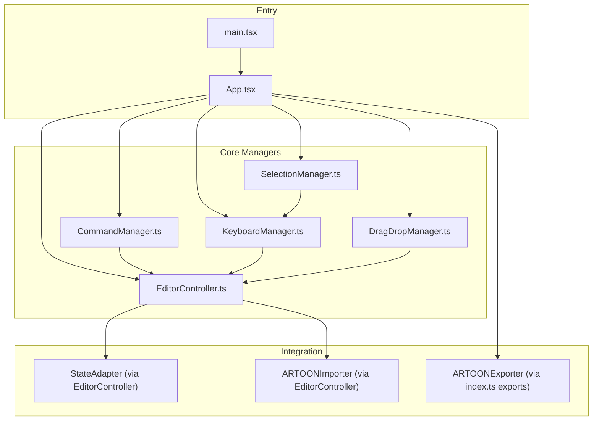
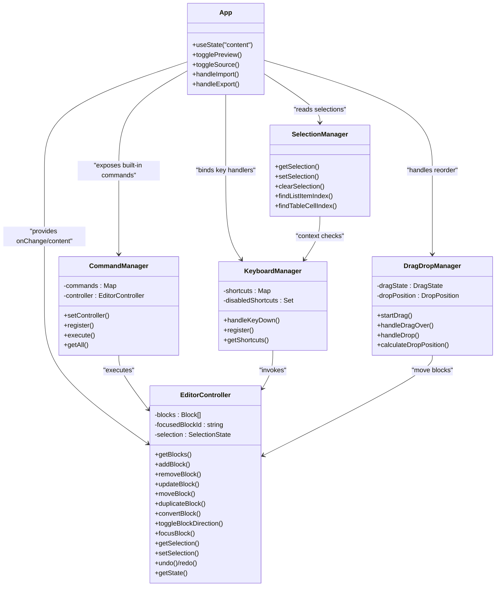
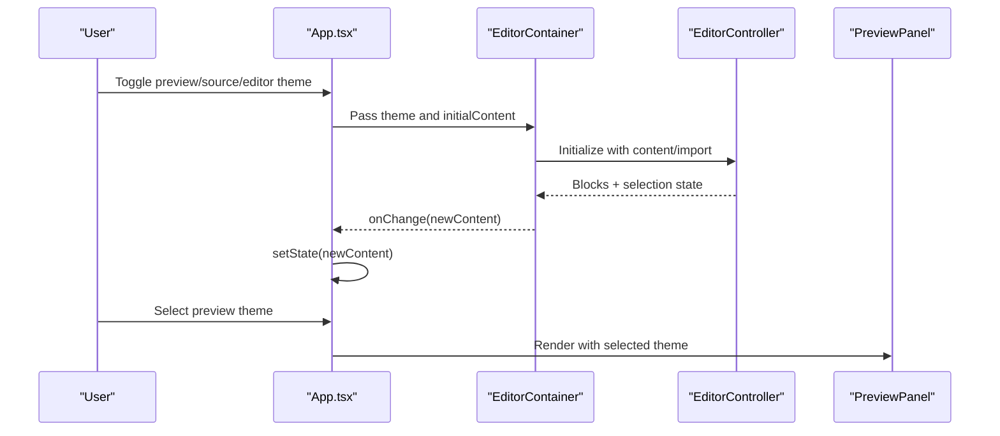
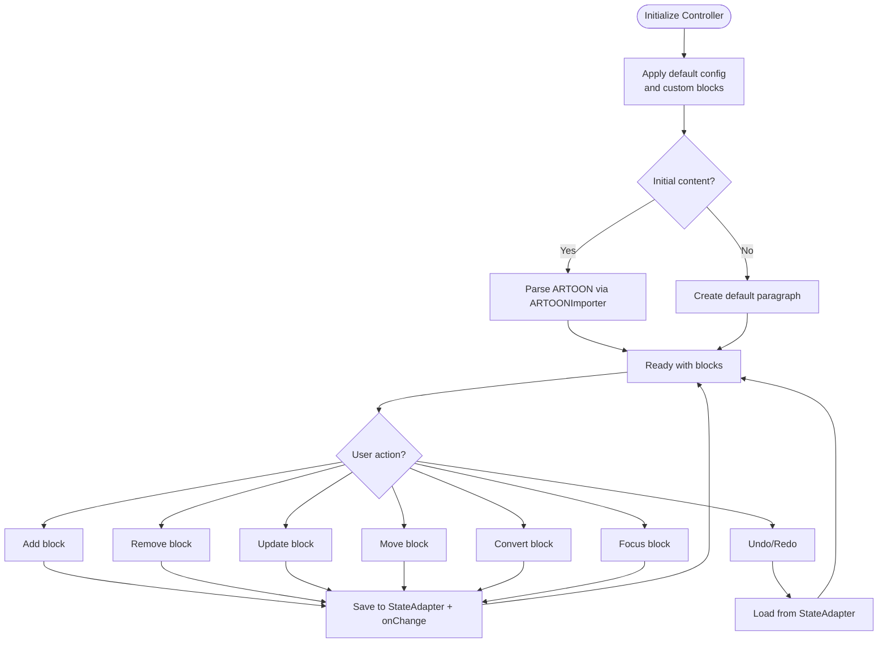
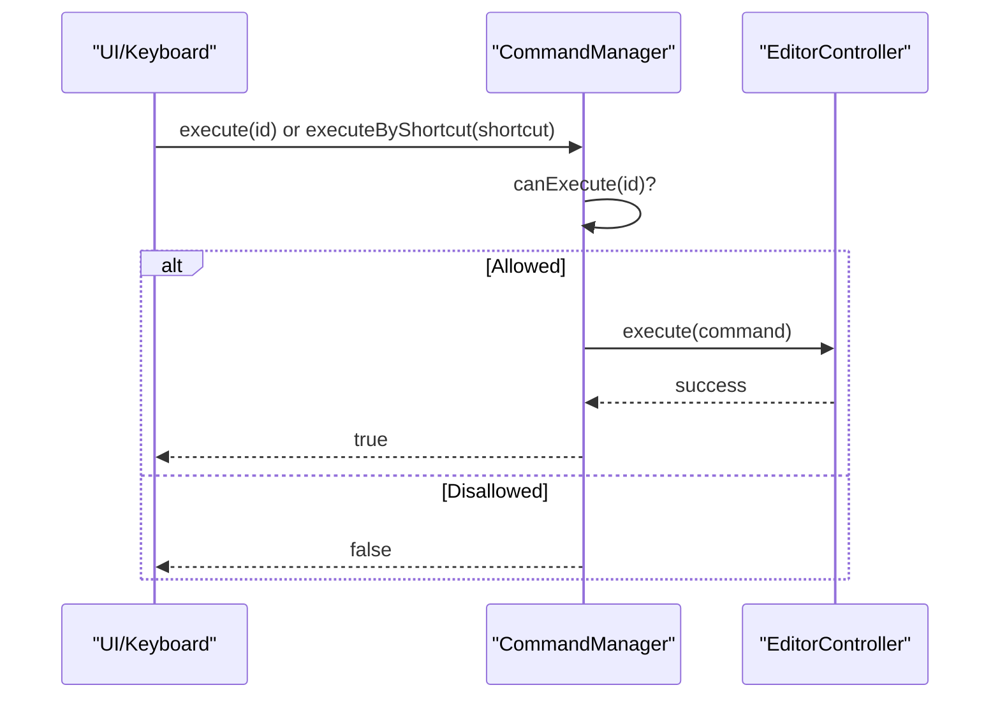
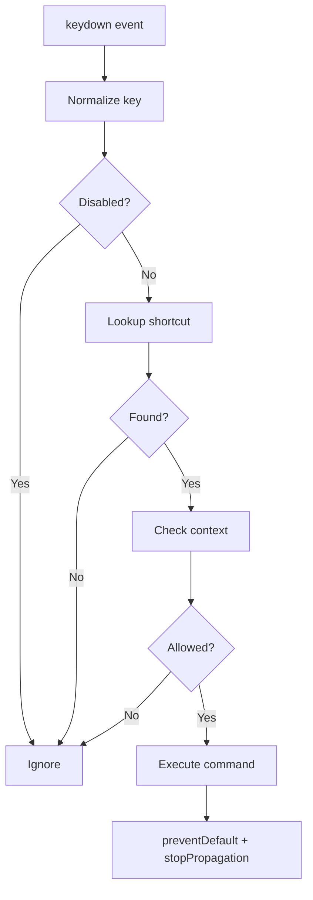
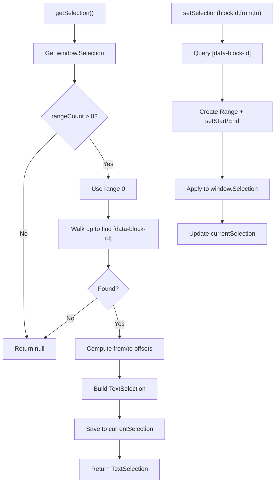
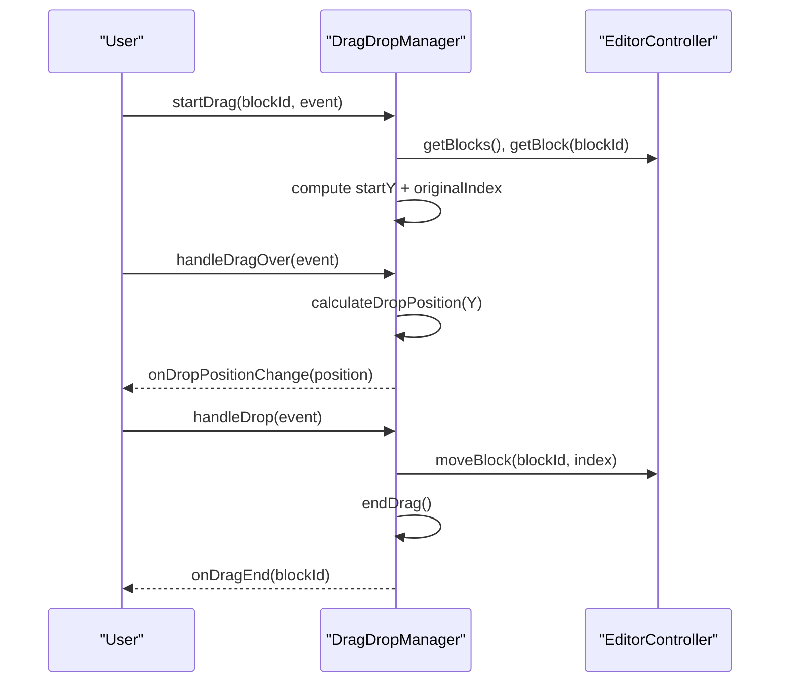
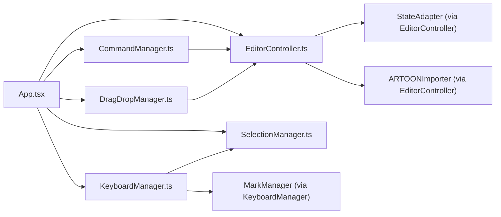

# Editor Architecture

<cite>
**Referenced Files in This Document**
- [App.tsx](file://artoon-typer/src/App.tsx)
- [main.tsx](file://artoon-typer/src/main.tsx)
- [index.ts](file://artoon-typer/src/index.ts)
- [EditorController.ts](file://artoon-typer/src/core/EditorController.ts)
- [CommandManager.ts](file://artoon-typer/src/core/CommandManager.ts)
- [KeyboardManager.ts](file://artoon-typer/src/core/KeyboardManager.ts)
- [SelectionManager.ts](file://artoon-typer/src/core/SelectionManager.ts)
- [DragDropManager.ts](file://artoon-typer/src/core/DragDropManager.ts)
</cite>

## Table of Contents
1. [Introduction](#introduction)
2. [Project Structure](#project-structure)
3. [Core Components](#core-components)
4. [Architecture Overview](#architecture-overview)
5. [Detailed Component Analysis](#detailed-component-analysis)
6. [Dependency Analysis](#dependency-analysis)
7. [Performance Considerations](#performance-considerations)
8. [Troubleshooting Guide](#troubleshooting-guide)
9. [Conclusion](#conclusion)

## Introduction
This document explains the ARTOON Typer Editor architecture, a React-based block editor for the ARTOON format. It focuses on the main App component, the dual theme system (editor and preview), and the core manager classes that orchestrate user interactions: EditorController, CommandManager, KeyboardManager, SelectionManager, and DragDropManager. The document also covers the application lifecycle, state management patterns, and component communication, with practical examples of manager interactions and the overall editor workflow.

## Project Structure
The editor is organized around a clear separation of concerns:
- Entry point initializes the React app and mounts the root component.
- App composes the UI, integrates the dual theme system, and wires editors and panels.
- Core managers encapsulate editor logic and orchestration.
- Integration modules connect parsing, rendering, and state adaptation.
- UI components expose hooks and reusable building blocks.

**Diagram sources**
- [main.tsx:13-21](file://artoon-typer/src/main.tsx#L13-L21)
- [App.tsx:463-472](file://artoon-typer/src/App.tsx#L463-L472)
- [EditorController.ts:19-67](file://artoon-typer/src/core/EditorController.ts#L19-L67)
- [CommandManager.ts:16-25](file://artoon-typer/src/core/CommandManager.ts#L16-L25)
- [KeyboardManager.ts:65-85](file://artoon-typer/src/core/KeyboardManager.ts#L65-L85)
- [SelectionManager.ts:15-64](file://artoon-typer/src/core/SelectionManager.ts#L15-L64)
- [DragDropManager.ts:53-68](file://artoon-typer/src/core/DragDropManager.ts#L53-L68)

**Section sources**
- [main.tsx:1-22](file://artoon-typer/src/main.tsx#L1-L22)
- [App.tsx:1-475](file://artoon-typer/src/App.tsx#L1-L475)
- [index.ts:75-116](file://artoon-typer/src/index.ts#L75-L116)

## Core Components
- App: Hosts the dual theme system, controls visibility of editor, preview, and source panes, and delegates content changes to the controller.
- EditorController: Central state holder for blocks, selection, and focus; integrates with StateAdapter for history and ARTOONImporter for content parsing.
- CommandManager: Registers and executes commands; exposes built-in commands for undo/redo, block duplication/move, and deletion.
- KeyboardManager: Normalizes key combinations, evaluates context, and executes keyboard commands; integrates with SelectionManager and MarkManager.
- SelectionManager: Reads and sets DOM selections, resolves block IDs, and computes character offsets for precise inline editing.
- DragDropManager: Computes drop zones during drag/reorder, invokes controller moves, and provides preview text/icons.

**Section sources**
- [App.tsx:71-205](file://artoon-typer/src/App.tsx#L71-L205)
- [EditorController.ts:27-67](file://artoon-typer/src/core/EditorController.ts#L27-L67)
- [CommandManager.ts:16-140](file://artoon-typer/src/core/CommandManager.ts#L16-L140)
- [KeyboardManager.ts:65-162](file://artoon-typer/src/core/KeyboardManager.ts#L65-L162)
- [SelectionManager.ts:15-116](file://artoon-typer/src/core/SelectionManager.ts#L15-L116)
- [DragDropManager.ts:53-96](file://artoon-typer/src/core/DragDropManager.ts#L53-L96)

## Architecture Overview
The editor follows a layered architecture:
- UI Layer: App and UI components manage layout, theming, and user actions.
- Orchestration Layer: EditorController coordinates state and block operations.
- Interaction Layer: CommandManager and KeyboardManager translate user intents into controller actions.
- Selection Layer: SelectionManager provides precise text selection semantics.
- Drag Layer: DragDropManager enables block reordering via drag-and-drop.
- Integration Layer: StateAdapter and ARTOONImporter/Exporter bridge editor state with external formats.

**Diagram sources**
- [App.tsx:71-205](file://artoon-typer/src/App.tsx#L71-L205)
- [EditorController.ts:27-467](file://artoon-typer/src/core/EditorController.ts#L27-L467)
- [CommandManager.ts:16-140](file://artoon-typer/src/core/CommandManager.ts#L16-L140)
- [KeyboardManager.ts:65-425](file://artoon-typer/src/core/KeyboardManager.ts#L65-L425)
- [SelectionManager.ts:15-321](file://artoon-typer/src/core/SelectionManager.ts#L15-L321)
- [DragDropManager.ts:53-316](file://artoon-typer/src/core/DragDropManager.ts#L53-L316)

## Detailed Component Analysis

### App Component and Dual Theme System
- Dual Theme System:
  - Editor Theme: Light/Dark toggle controlled by the ThemeProvider and exposed via useTheme hook.
  - Preview Theme: Selector for presentation themes (Minimal, Blog, Documentation, Academic).
- Layout:
  - Header controls theme, direction, import/export, and toggles for preview/source panes.
  - EditorContainer renders the block editor with initial content and theme.
  - PreviewPanel renders the HTML preview using the selected preview theme.
  - Source pane displays raw ARTOON content with apply button to sync back to the editor.
- Lifecycle:
  - Initializes with sample content and manages content state updates via handleChange.
  - Handles file import/export using browser APIs.

**Diagram sources**
- [App.tsx:71-205](file://artoon-typer/src/App.tsx#L71-L205)
- [EditorController.ts:36-67](file://artoon-typer/src/core/EditorController.ts#L36-L67)

**Section sources**
- [App.tsx:71-205](file://artoon-typer/src/App.tsx#L71-L205)

### EditorController: Central Orchestrator
- Responsibilities:
  - Manages block array, focused block, and selection state.
  - Converts between ARTOON content and internal blocks via ARTOONImporter.
  - Integrates with StateAdapter for undo/redo history and onChange callbacks.
  - Exposes CRUD operations for blocks and selection management.
- Patterns:
  - Immutable-like updates via deepClone and replace semantics.
  - Event emission for block add/remove/move/update/focus.
  - Registry-driven block creation/conversion.

**Diagram sources**
- [EditorController.ts:36-67](file://artoon-typer/src/core/EditorController.ts#L36-L67)
- [EditorController.ts:120-195](file://artoon-typer/src/core/EditorController.ts#L120-L195)
- [EditorController.ts:366-397](file://artoon-typer/src/core/EditorController.ts#L366-L397)

**Section sources**
- [EditorController.ts:27-467](file://artoon-typer/src/core/EditorController.ts#L27-L467)

### CommandManager: User Interaction Routing
- Responsibilities:
  - Registers and retrieves commands by ID or shortcut.
  - Validates execution eligibility via canExecute.
  - Executes commands against the EditorController.
- Built-in Commands:
  - Undo/Redo, Delete Block, Duplicate Block, Move Block Up/Down, Toggle Direction.

**Diagram sources**
- [CommandManager.ts:96-132](file://artoon-typer/src/core/CommandManager.ts#L96-L132)
- [CommandManager.ts:149-208](file://artoon-typer/src/core/CommandManager.ts#L149-L208)

**Section sources**
- [CommandManager.ts:16-140](file://artoon-typer/src/core/CommandManager.ts#L16-L140)
- [CommandManager.ts:284-292](file://artoon-typer/src/core/CommandManager.ts#L284-L292)

### KeyboardManager: Keyboard Shortcuts and Context
- Responsibilities:
  - Normalizes key combinations and registers default shortcuts.
  - Evaluates context (e.g., hasSelection, inBlock, atBlockStart, emptyBlock).
  - Executes keyboard commands and prevents default browser behavior when handled.
- Integration:
  - Uses SelectionManager for context checks.
  - Leverages MarkManager for inline formatting (placeholder in current implementation).

**Diagram sources**
- [KeyboardManager.ts:133-162](file://artoon-typer/src/core/KeyboardManager.ts#L133-L162)
- [KeyboardManager.ts:346-385](file://artoon-typer/src/core/KeyboardManager.ts#L346-L385)
- [KeyboardManager.ts:390-424](file://artoon-typer/src/core/KeyboardManager.ts#L390-L424)

**Section sources**
- [KeyboardManager.ts:65-425](file://artoon-typer/src/core/KeyboardManager.ts#L65-L425)

### SelectionManager: Text Selection Semantics
- Responsibilities:
  - Extracts current DOM selection and maps it to a block with character offsets.
  - Sets programmatic selections and clears them.
  - Locates list items and table cells within a block for specialized operations.
- Complexity:
  - Offset computation traverses DOM nodes; worst-case proportional to visible text nodes in a block.

**Diagram sources**
- [SelectionManager.ts:21-64](file://artoon-typer/src/core/SelectionManager.ts#L21-L64)
- [SelectionManager.ts:69-93](file://artoon-typer/src/core/SelectionManager.ts#L69-L93)

**Section sources**
- [SelectionManager.ts:15-321](file://artoon-typer/src/core/SelectionManager.ts#L15-L321)

### DragDropManager: Block Reordering
- Responsibilities:
  - Tracks drag state and calculates drop positions based on mouse/touch Y-coordinates.
  - Moves blocks via EditorController when drop occurs.
  - Emits drag start/end and drop-position-change callbacks.
- Preview:
  - Generates preview text/icons for drag feedback.

**Diagram sources**
- [DragDropManager.ts:101-132](file://artoon-typer/src/core/DragDropManager.ts#L101-L132)
- [DragDropManager.ts:137-165](file://artoon-typer/src/core/DragDropManager.ts#L137-L165)
- [DragDropManager.ts:170-194](file://artoon-typer/src/core/DragDropManager.ts#L170-L194)
- [DragDropManager.ts:221-242](file://artoon-typer/src/core/DragDropManager.ts#L221-L242)

**Section sources**
- [DragDropManager.ts:53-316](file://artoon-typer/src/core/DragDropManager.ts#L53-L316)

## Dependency Analysis
- App depends on:
  - ThemeProvider/useTheme for dual theme state.
  - EditorContainer for editing, PreviewPanel for rendering, and hooks for UI behaviors.
- EditorController depends on:
  - BlockRegistry (imported locally) and StateAdapter for history.
  - ARTOONImporter for parsing initial content.
- CommandManager depends on EditorController for execution.
- KeyboardManager depends on SelectionManager and MarkManager for context and formatting.
- DragDropManager depends on EditorController for block movement.

**Diagram sources**
- [App.tsx:11-20](file://artoon-typer/src/App.tsx#L11-L20)
- [EditorController.ts:19-22](file://artoon-typer/src/core/EditorController.ts#L19-L22)
- [CommandManager.ts:16-25](file://artoon-typer/src/core/CommandManager.ts#L16-L25)
- [KeyboardManager.ts:8-11](file://artoon-typer/src/core/KeyboardManager.ts#L8-L11)
- [SelectionManager.ts:15-64](file://artoon-typer/src/core/SelectionManager.ts#L15-L64)
- [DragDropManager.ts:53-68](file://artoon-typer/src/core/DragDropManager.ts#L53-L68)

**Section sources**
- [index.ts:75-116](file://artoon-typer/src/index.ts#L75-L116)

## Performance Considerations
- Rendering:
  - Keep block arrays reasonably sized; avoid frequent full re-renders by updating only changed blocks.
  - Use keys on block containers to help React reconcile efficiently.
- Selection:
  - Minimize repeated DOM queries; cache block elements when possible.
- Drag and Drop:
  - Debounce drop-position calculations if handling very large documents.
- History:
  - Batch operations when possible to reduce StateAdapter snapshots.

## Troubleshooting Guide
- Keyboard shortcuts not working:
  - Verify shortcuts are not disabled and context conditions are met.
  - Ensure KeyboardManager is enabled and handleKeyDown is attached to the editor’s keydown listener.
- Drag and drop does nothing:
  - Confirm DragDropManager is initialized with a valid controller and container.
  - Check that drop positions differ from original index before invoking move.
- Undo/Redo not available:
  - Ensure StateAdapter is properly initialized and blocks are saved after operations.
- Selection issues:
  - Validate that block elements carry data-block-id attributes and that offsets map to text nodes.

**Section sources**
- [KeyboardManager.ts:133-162](file://artoon-typer/src/core/KeyboardManager.ts#L133-L162)
- [DragDropManager.ts:170-194](file://artoon-typer/src/core/DragDropManager.ts#L170-L194)
- [SelectionManager.ts:21-64](file://artoon-typer/src/core/SelectionManager.ts#L21-L64)
- [EditorController.ts:419-422](file://artoon-typer/src/core/EditorController.ts#L419-L422)

## Conclusion
The ARTOON Typer Editor employs a modular, manager-driven architecture. App orchestrates the UI and dual theme system, while EditorController centralizes state and block operations. CommandManager and KeyboardManager translate user intent into actions, SelectionManager ensures precise text selection semantics, and DragDropManager enables intuitive block reordering. Together, these components deliver a responsive, extensible block editor with robust state management and clear separation of concerns.