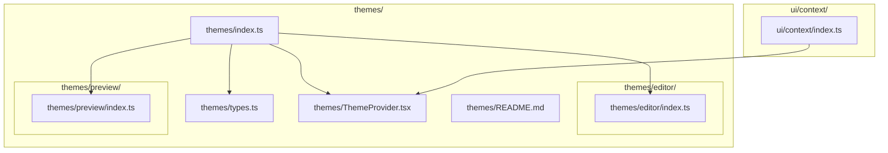
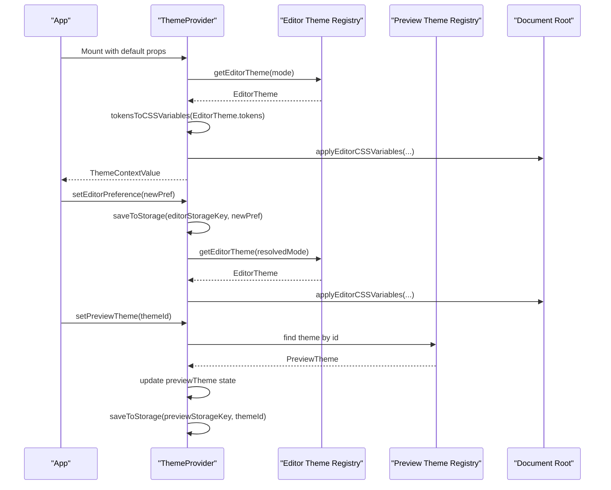
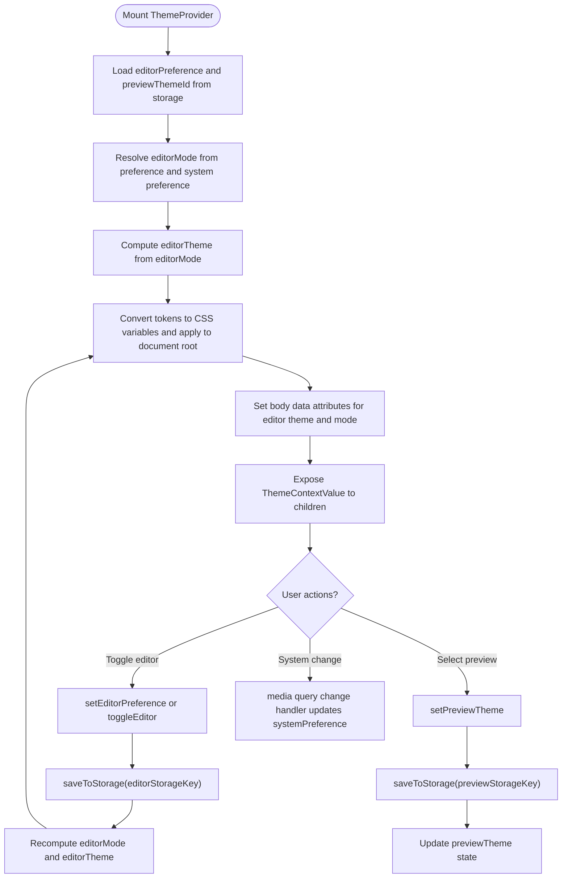
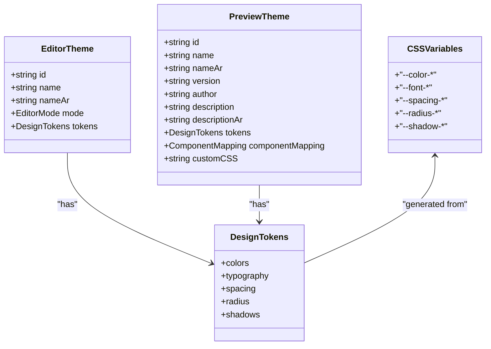
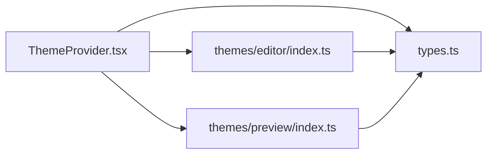

# Theme System

<cite>
**Referenced Files in This Document**
- [ThemeProvider.tsx](file://artoon-typer/src/themes/ThemeProvider.tsx)
- [types.ts](file://artoon-typer/src/themes/types.ts)
- [index.ts (themes)](file://artoon-typer/src/themes/index.ts)
- [README.md (themes)](file://artoon-typer/src/themes/README.md)
- [index.ts (themes/editor)](file://artoon-typer/src/themes/editor/index.ts)
- [index.ts (themes/preview)](file://artoon-typer/src/themes/preview/index.ts)
- [index.ts (ui/context)](file://artoon-typer/src/ui/context/index.ts)
</cite>

## Table of Contents
1. [Introduction](#introduction)
2. [Project Structure](#project-structure)
3. [Core Components](#core-components)
4. [Architecture Overview](#architecture-overview)
5. [Detailed Component Analysis](#detailed-component-analysis)
6. [Dependency Analysis](#dependency-analysis)
7. [Performance Considerations](#performance-considerations)
8. [Troubleshooting Guide](#troubleshooting-guide)
9. [Conclusion](#conclusion)
10. [Appendices](#appendices)

## Introduction
This document explains the dual theme system in ARTOON Typer Editor. It covers the ThemeProvider component that manages both editor and preview themes, the dual theme architecture (light/dark editor themes and preview theme selection among Minimal, Blog, Documentation, Academic), theme switching mechanisms, CSS variable management, and the design token system. It also details theme provider implementation, theme context management, persistence, and practical guidance for creating custom themes, modifying design tokens, and extending the theme system. Finally, it addresses performance optimization, CSS-in-JS patterns, and responsive theme behavior across screen sizes.

## Project Structure
The theme system is organized under the themes module with clear separation between editor and preview themes, a central provider, and shared types. The UI re-exports the provider and hook for convenient consumption.

**Diagram sources**
- [index.ts (themes):1-40](file://artoon-typer/src/themes/index.ts#L1-L40)
- [ThemeProvider.tsx:1-268](file://artoon-typer/src/themes/ThemeProvider.tsx#L1-L268)
- [types.ts:1-383](file://artoon-typer/src/themes/types.ts#L1-L383)
- [README.md (themes):1-366](file://artoon-typer/src/themes/README.md#L1-L366)
- [index.ts (themes/editor):1-20](file://artoon-typer/src/themes/editor/index.ts#L1-L20)
- [index.ts (themes/preview):1-39](file://artoon-typer/src/themes/preview/index.ts#L1-L39)
- [index.ts (ui/context):1-13](file://artoon-typer/src/ui/context/index.ts#L1-L13)

**Section sources**
- [index.ts (themes):1-40](file://artoon-typer/src/themes/index.ts#L1-L40)
- [README.md (themes):11-30](file://artoon-typer/src/themes/README.md#L11-L30)

## Core Components
- ThemeProvider: Central React context provider managing dual theme state, applying CSS variables, and persisting preferences.
- Theme types and design tokens: Strongly typed definitions for editor and preview themes, component mappings, and CSS variables derived from tokens.
- Editor theme registry: Provides light/dark themes and resolution by mode.
- Preview theme registry: Exposes built-in themes and utilities for theme selection and defaults.
- UI context re-export: Makes ThemeProvider and useTheme available via ui/context.

Key responsibilities:
- Dual theme orchestration: Editor preference (light/dark/system) and preview theme selection.
- Persistence: Uses localStorage keys to remember user preferences.
- CSS variable injection: Converts design tokens to CSS variables and applies them to the document root.
- Context exposure: Provides a stable ThemeContextValue to descendant components.

**Section sources**
- [ThemeProvider.tsx:106-250](file://artoon-typer/src/themes/ThemeProvider.tsx#L106-L250)
- [types.ts:14-112](file://artoon-typer/src/themes/types.ts#L14-L112)
- [index.ts (themes/editor):14-19](file://artoon-typer/src/themes/editor/index.ts#L14-L19)
- [index.ts (themes/preview):18-39](file://artoon-typer/src/themes/preview/index.ts#L18-L39)
- [index.ts (ui/context):7-11](file://artoon-typer/src/ui/context/index.ts#L7-L11)

## Architecture Overview
The dual theme system separates concerns:
- Editor themes: Light/Dark modes for the editing interface.
- Preview themes: Content presentation themes (Minimal, Blog, Documentation, Academic).

The ThemeProvider resolves the effective editor mode from user preference and system preference, computes CSS variables from design tokens, and injects them into the document root. It also exposes APIs to switch themes and persist selections.

**Diagram sources**
- [ThemeProvider.tsx:106-250](file://artoon-typer/src/themes/ThemeProvider.tsx#L106-L250)
- [index.ts (themes/editor):14-19](file://artoon-typer/src/themes/editor/index.ts#L14-L19)
- [index.ts (themes/preview):18-39](file://artoon-typer/src/themes/preview/index.ts#L18-L39)
- [types.ts:314-382](file://artoon-typer/src/themes/types.ts#L314-L382)

## Detailed Component Analysis

### ThemeProvider Component
The ThemeProvider encapsulates:
- Editor theme state: preference, resolved mode, and theme object.
- Preview theme state: current theme and available themes.
- System preference listener: tracks OS-level color scheme changes.
- CSS variable application: injects computed CSS variables into document root.
- Persistence: reads/writes preferences to localStorage.

Notable behaviors:
- System preference detection via matchMedia.
- Memoized computations for editorMode and previewTheme to avoid unnecessary re-renders.
- Body attributes for editor theme identity and mode.
- Custom preview theme override capability.

**Diagram sources**
- [ThemeProvider.tsx:106-250](file://artoon-typer/src/themes/ThemeProvider.tsx#L106-L250)

**Section sources**
- [ThemeProvider.tsx:106-250](file://artoon-typer/src/themes/ThemeProvider.tsx#L106-L250)

### Theme Types and Design Tokens
Design tokens define semantic values for colors, typography, spacing, radius, and shadows. The system converts tokens to CSS variables for runtime application.

Highlights:
- Strongly typed tokens and CSS variables.
- tokensToCSSVariables maps tokens to CSS variable names.
- PreviewTheme supports optional component mapping and custom CSS.

**Diagram sources**
- [types.ts:14-112](file://artoon-typer/src/themes/types.ts#L14-L112)
- [types.ts:154-163](file://artoon-typer/src/themes/types.ts#L154-L163)
- [types.ts:172-190](file://artoon-typer/src/themes/types.ts#L172-L190)
- [types.ts:243-309](file://artoon-typer/src/themes/types.ts#L243-L309)
- [types.ts:314-382](file://artoon-typer/src/themes/types.ts#L314-L382)

**Section sources**
- [types.ts:14-112](file://artoon-typer/src/themes/types.ts#L14-L112)
- [types.ts:154-163](file://artoon-typer/src/themes/types.ts#L154-L163)
- [types.ts:172-190](file://artoon-typer/src/themes/types.ts#L172-L190)
- [types.ts:243-309](file://artoon-typer/src/themes/types.ts#L243-L309)
- [types.ts:314-382](file://artoon-typer/src/themes/types.ts#L314-L382)

### Editor Theme Registry
The editor registry exports light and dark themes and resolves the active theme based on the resolved editor mode.

Key points:
- getEditorTheme(mode) returns the appropriate theme object.
- Modes are light or dark.

**Section sources**
- [index.ts (themes/editor):7-19](file://artoon-typer/src/themes/editor/index.ts#L7-L19)

### Preview Theme Registry
The preview registry exports built-in themes and utilities:
- Exports minimal, blog, documentation, and academic themes.
- previewThemes array for enumeration.
- getPreviewTheme(id) lookup.
- defaultPreviewTheme constant.

**Section sources**
- [index.ts (themes/preview):7-39](file://artoon-typer/src/themes/preview/index.ts#L7-L39)

### Theme Context and UI Exposure
The UI context re-exports ThemeProvider and useTheme for easy consumption by components.

**Section sources**
- [index.ts (ui/context):7-11](file://artoon-typer/src/ui/context/index.ts#L7-L11)

## Dependency Analysis
The ThemeProvider depends on:
- Theme types and conversion utilities.
- Editor theme resolution.
- Preview theme collection and defaults.

**Diagram sources**
- [ThemeProvider.tsx:11-22](file://artoon-typer/src/themes/ThemeProvider.tsx#L11-L22)
- [types.ts:1-383](file://artoon-typer/src/themes/types.ts#L1-L383)
- [index.ts (themes/editor):10-19](file://artoon-typer/src/themes/editor/index.ts#L10-L19)
- [index.ts (themes/preview):12-33](file://artoon-typer/src/themes/preview/index.ts#L12-L33)

**Section sources**
- [ThemeProvider.tsx:11-22](file://artoon-typer/src/themes/ThemeProvider.tsx#L11-L22)
- [index.ts (themes/editor):10-19](file://artoon-typer/src/themes/editor/index.ts#L10-L19)
- [index.ts (themes/preview):12-33](file://artoon-typer/src/themes/preview/index.ts#L12-L33)

## Performance Considerations
- Memoization: The provider uses useMemo for computed values (editorMode, editorTheme, previewTheme) to prevent unnecessary re-computations and re-applications of CSS variables.
- Efficient CSS variable updates: CSS variables are applied once per theme change and attributes are set only when theme changes occur.
- System preference listener: Media query listeners are attached once and cleaned up on unmount to avoid leaks.
- LocalStorage I/O: Storage operations are performed only on explicit user actions or mount/unmount, minimizing overhead.
- CSS-in-JS pattern: Using CSS variables avoids costly style recalculations compared to dynamic class toggling and enables rapid theme switching.

[No sources needed since this section provides general guidance]

## Troubleshooting Guide
Common issues and resolutions:
- useTheme outside provider: The useTheme hook throws an error if called outside ThemeProvider. Ensure the provider wraps the application or the component tree.
- No effect after switching themes: Verify that CSS variables are being applied to the document root and that body attributes reflect the current editor theme and mode.
- Preferences not persisting: Confirm localStorage keys exist and are readable; handle exceptions during storage operations.
- System preference not updating: Ensure media query listeners are supported and attached; fallbacks are included for legacy environments.

**Section sources**
- [ThemeProvider.tsx:256-267](file://artoon-typer/src/themes/ThemeProvider.tsx#L256-L267)
- [ThemeProvider.tsx:63-72](file://artoon-typer/src/themes/ThemeProvider.tsx#L63-L72)
- [ThemeProvider.tsx:182-201](file://artoon-typer/src/themes/ThemeProvider.tsx#L182-L201)
- [ThemeProvider.tsx:77-100](file://artoon-typer/src/themes/ThemeProvider.tsx#L77-L100)

## Conclusion
The ARTOON Typer Editor’s dual theme system cleanly separates editor interface themes from content presentation themes, enabling flexible combinations and extensibility. The ThemeProvider centralizes state, persistence, and CSS variable application, while the design token model ensures consistent theming across components. With memoization, efficient CSS-in-JS patterns, and robust persistence, the system delivers responsive and performant theme switching across screen sizes and user preferences.

[No sources needed since this section summarizes without analyzing specific files]

## Appendices

### Theme Switching Mechanisms
- Editor switching: Toggle between light and dark modes or follow system preference. The resolved mode determines the active editor theme.
- Preview switching: Choose among Minimal, Blog, Documentation, Academic themes or set a custom preview theme.

**Section sources**
- [ThemeProvider.tsx:140-148](file://artoon-typer/src/themes/ThemeProvider.tsx#L140-L148)
- [ThemeProvider.tsx:171-175](file://artoon-typer/src/themes/ThemeProvider.tsx#L171-L175)
- [README.md (themes):112-169](file://artoon-typer/src/themes/README.md#L112-L169)

### CSS Variable Management
- Design tokens are converted to CSS variables and applied to documentElement.
- Body receives data attributes reflecting the current editor theme and mode for targeted styling.

**Section sources**
- [types.ts:314-382](file://artoon-typer/src/themes/types.ts#L314-L382)
- [ThemeProvider.tsx:63-72](file://artoon-typer/src/themes/ThemeProvider.tsx#L63-L72)
- [ThemeProvider.tsx:211-215](file://artoon-typer/src/themes/ThemeProvider.tsx#L211-L215)

### Design Token System
- Semantic tokens for colors, typography, spacing, radius, and shadows.
- Preview themes can include custom CSS for advanced styling.

**Section sources**
- [types.ts:18-112](file://artoon-typer/src/themes/types.ts#L18-L112)
- [types.ts:182-190](file://artoon-typer/src/themes/types.ts#L182-L190)

### Theme Persistence
- Editor preference persisted under a configurable key.
- Preview theme persisted under a separate configurable key.

**Section sources**
- [ThemeProvider.tsx:77-100](file://artoon-typer/src/themes/ThemeProvider.tsx#L77-L100)
- [ThemeProvider.tsx:140-143](file://artoon-typer/src/themes/ThemeProvider.tsx#L140-L143)
- [ThemeProvider.tsx:171-175](file://artoon-typer/src/themes/ThemeProvider.tsx#L171-L175)

### Creating Custom Themes
- Define a PreviewTheme with tokens and optional customCSS.
- Use setCustomPreviewTheme to apply the custom theme.
- Register the theme in the preview registry if exposing it globally.

**Section sources**
- [README.md (themes):173-218](file://artoon-typer/src/themes/README.md#L173-L218)
- [types.ts:172-190](file://artoon-typer/src/themes/types.ts#L172-L190)

### Extending the Theme System
- Add new editor themes via the editor registry.
- Add new preview themes via the preview registry and export them.
- Extend design tokens and CSS variables as needed.

**Section sources**
- [index.ts (themes/editor):7-19](file://artoon-typer/src/themes/editor/index.ts#L7-L19)
- [index.ts (themes/preview):7-39](file://artoon-typer/src/themes/preview/index.ts#L7-L39)
- [types.ts:14-112](file://artoon-typer/src/themes/types.ts#L14-L112)

### Responsive Theme Behavior
- System preference detection adapts the editor theme automatically.
- Preview themes can include responsive custom CSS for optimal viewing across devices.

**Section sources**
- [ThemeProvider.tsx:53-58](file://artoon-typer/src/themes/ThemeProvider.tsx#L53-L58)
- [ThemeProvider.tsx:182-201](file://artoon-typer/src/themes/ThemeProvider.tsx#L182-L201)
- [types.ts:188-190](file://artoon-typer/src/themes/types.ts#L188-L190)