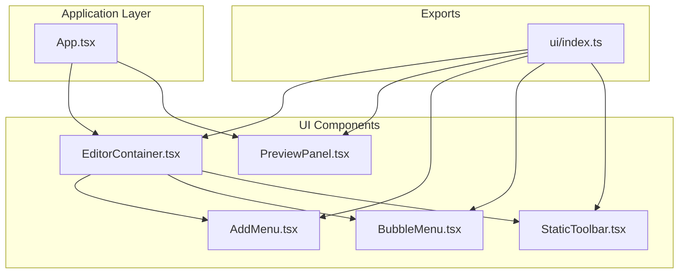
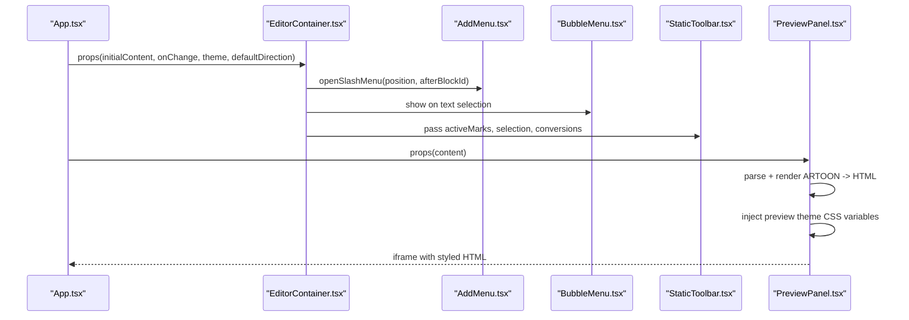
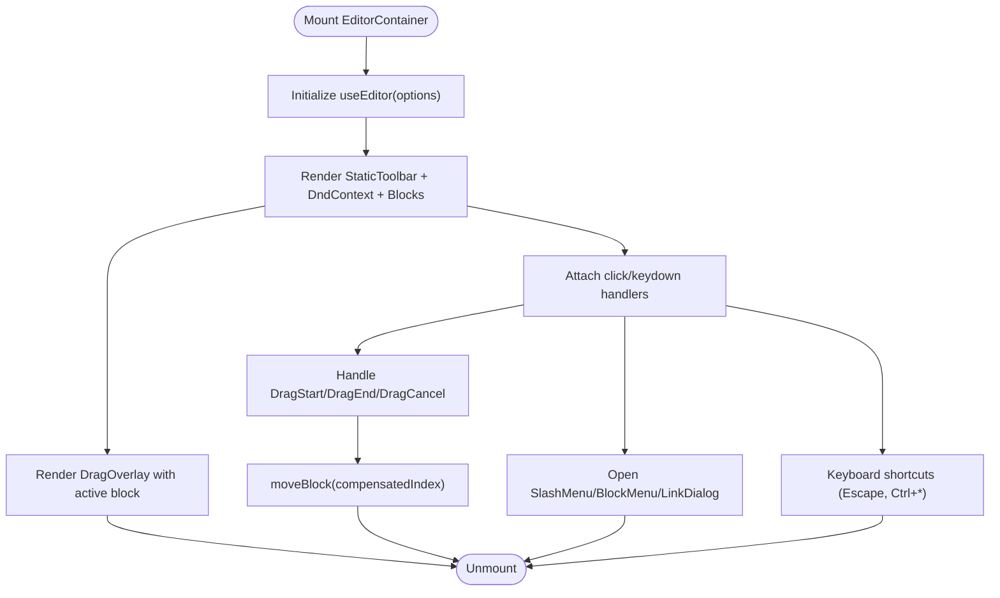
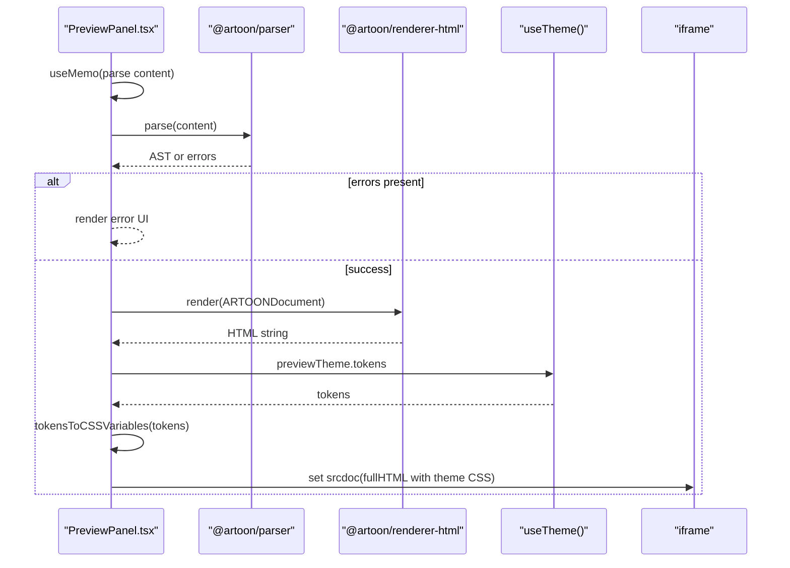
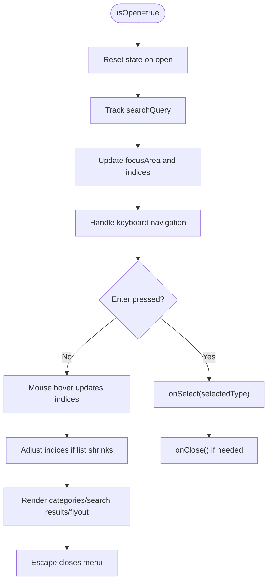
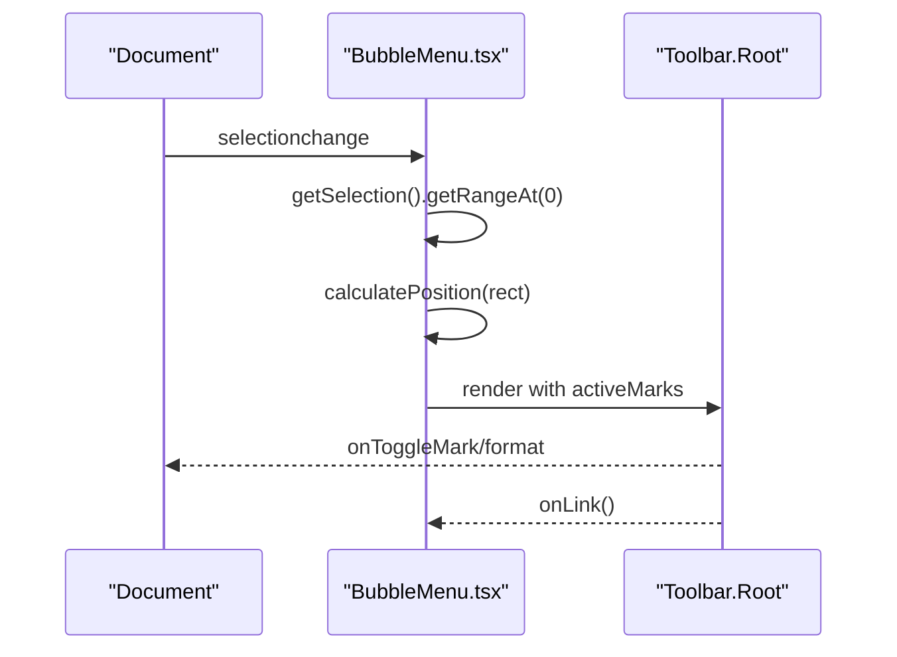
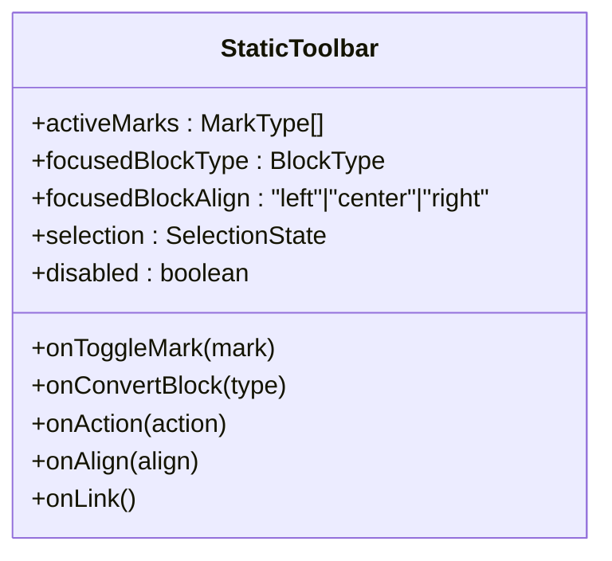
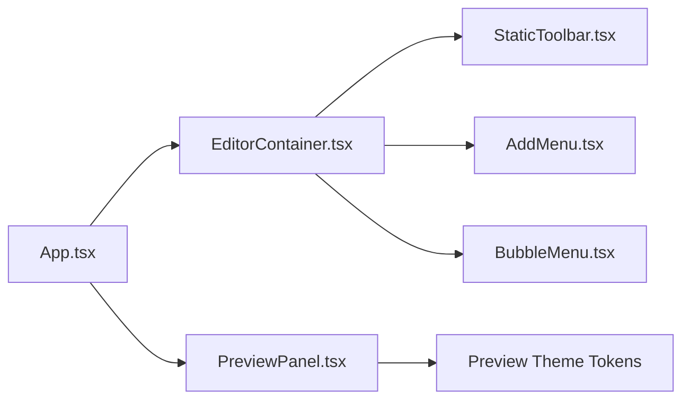
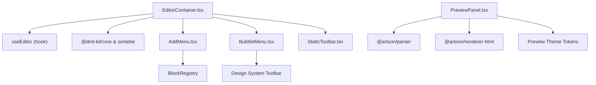

# UI Components

<cite>
**Referenced Files in This Document**
- [App.tsx](file://artoon-typer/src/App.tsx)
- [EditorContainer.tsx](file://artoon-typer/src/ui/components/EditorContainer.tsx)
- [PreviewPanel.tsx](file://artoon-typer/src/ui/components/PreviewPanel.tsx)
- [AddMenu.tsx](file://artoon-typer/src/ui/components/AddMenu.tsx)
- [BubbleMenu.tsx](file://artoon-typer/src/ui/components/BubbleMenu.tsx)
- [StaticToolbar.tsx](file://artoon-typer/src/ui/components/StaticToolbar.tsx)
- [ui/index.ts](file://artoon-typer/src/ui/index.ts)
</cite>

## Table of Contents
1. [Introduction](#introduction)
2. [Project Structure](#project-structure)
3. [Core Components](#core-components)
4. [Architecture Overview](#architecture-overview)
5. [Detailed Component Analysis](#detailed-component-analysis)
6. [Dependency Analysis](#dependency-analysis)
7. [Performance Considerations](#performance-considerations)
8. [Troubleshooting Guide](#troubleshooting-guide)
9. [Conclusion](#conclusion)
10. [Appendices](#appendices)

## Introduction
This document describes the ARTOON Typer UI component architecture with a focus on the main container EditorContainer, the PreviewPanel for HTML rendering, and interactive components AddMenu, BubbleMenu, and StaticToolbar. It explains component composition patterns, prop interfaces, event handling, lifecycle, state management integration, styling approaches using CSS modules and design system tokens, and provides guidance for customization, extending components, creating new UI components, accessibility, responsive design, and testing strategies.

## Project Structure
The UI layer is organized under the artoon-typer package. Key entry points and module exports are defined in the UI index, while the main application composes containers and panels.

**Diagram sources**
- [App.tsx:16-18](file://artoon-typer/src/App.tsx#L16-L18)
- [EditorContainer.tsx:13-18](file://artoon-typer/src/ui/components/EditorContainer.tsx#L13-L18)
- [PreviewPanel.tsx:17-19](file://artoon-typer/src/ui/components/PreviewPanel.tsx#L17-L19)
- [AddMenu.tsx:10](file://artoon-typer/src/ui/components/AddMenu.tsx#L10)
- [BubbleMenu.tsx:12](file://artoon-typer/src/ui/components/BubbleMenu.tsx#L12)
- [StaticToolbar.tsx:3](file://artoon-typer/src/ui/components/StaticToolbar.tsx#L3)
- [ui/index.ts:7-14](file://artoon-typer/src/ui/index.ts#L7-L14)

**Section sources**
- [App.tsx:16-18](file://artoon-typer/src/App.tsx#L16-L18)
- [ui/index.ts:7-14](file://artoon-typer/src/ui/index.ts#L7-L14)

## Core Components
- EditorContainer: Main container managing blocks, menus, drag-and-drop, and keyboard shortcuts. Integrates with useEditor hook and renders BlockWrapper and BlockRenderer for each block. Composes AddMenu, BubbleMenu, ContextMenu, LinkDialog, StaticToolbar, and StatusBar.
- PreviewPanel: Renders ARTOON content as HTML using the parser and renderer, applies preview theme tokens via CSS variables, and provides export/copy actions.
- AddMenu: Dynamic block insertion menu with category tabs, search, and keyboard navigation.
- BubbleMenu: Floating formatting toolbar appearing on text selection with active mark tracking.
- StaticToolbar: Persistent toolbar for formatting and block actions aligned with the focused block.

**Section sources**
- [EditorContainer.tsx:47-104](file://artoon-typer/src/ui/components/EditorContainer.tsx#L47-L104)
- [PreviewPanel.tsx:21-32](file://artoon-typer/src/ui/components/PreviewPanel.tsx#L21-L32)
- [AddMenu.tsx:12-24](file://artoon-typer/src/ui/components/AddMenu.tsx#L12-L24)
- [BubbleMenu.tsx:17-39](file://artoon-typer/src/ui/components/BubbleMenu.tsx#L17-L39)
- [StaticToolbar.tsx:12-38](file://artoon-typer/src/ui/components/StaticToolbar.tsx#L12-L38)

## Architecture Overview
The application composes EditorContainer and PreviewPanel within App. EditorContainer orchestrates menus and block rendering, while PreviewPanel consumes ARTOON content and renders themed HTML in an iframe.

**Diagram sources**
- [App.tsx:150-182](file://artoon-typer/src/App.tsx#L150-L182)
- [EditorContainer.tsx:244-381](file://artoon-typer/src/ui/components/EditorContainer.tsx#L244-L381)
- [PreviewPanel.tsx:31-85](file://artoon-typer/src/ui/components/PreviewPanel.tsx#L31-L85)

## Detailed Component Analysis

### EditorContainer
- Composition: Renders StaticToolbar, DndContext with SortableContext, BlockWrapper/BlockRenderer per block, AddMenu, BubbleMenu, LinkDialog, ContextMenu, and StatusBar.
- Props: Extends UseEditorOptions with className, theme, placeholder, defaultDirection, and optional callbacks for theme/direction toggles.
- Lifecycle: Initializes editor via useEditor, sets up drag sensors, handles drag start/end/cancel, clicks outside to close menus, keyboard shortcuts for Escape, Ctrl+B/I/U/K, and Escape to close dialogs.
- State management: Delegates editor state and operations to useEditor; manages activeId for drag overlay, focusedBlockId, and selectionPosition.
- Styling: Applies theme class, direction, and read-only attributes; integrates design system tokens via ThemeProvider.

**Diagram sources**
- [EditorContainer.tsx:60-104](file://artoon-typer/src/ui/components/EditorContainer.tsx#L60-L104)
- [EditorContainer.tsx:122-148](file://artoon-typer/src/ui/components/EditorContainer.tsx#L122-L148)
- [EditorContainer.tsx:171-207](file://artoon-typer/src/ui/components/EditorContainer.tsx#L171-L207)
- [EditorContainer.tsx:244-381](file://artoon-typer/src/ui/components/EditorContainer.tsx#L244-L381)

**Section sources**
- [EditorContainer.tsx:47-104](file://artoon-typer/src/ui/components/EditorContainer.tsx#L47-L104)
- [EditorContainer.tsx:122-148](file://artoon-typer/src/ui/components/EditorContainer.tsx#L122-L148)
- [EditorContainer.tsx:171-207](file://artoon-typer/src/ui/components/EditorContainer.tsx#L171-L207)
- [EditorContainer.tsx:244-381](file://artoon-typer/src/ui/components/EditorContainer.tsx#L244-L381)

### PreviewPanel
- Purpose: Renders ARTOON content as HTML with a selected preview theme and provides export/copy actions.
- Props: content (required), className (optional).
- Processing: Parses ARTOON to AST, filters meta blocks, renders to HTML, generates CSS variables from preview theme tokens, and injects CSS into an iframe.
- Error handling: Displays structured error messages when parsing fails.
- Styling: Uses tokensToCSSVariables to convert preview theme tokens into CSS variables and applies typography, lists, code, blockquote, tables, images, and custom block styles.

**Diagram sources**
- [PreviewPanel.tsx:31-85](file://artoon-typer/src/ui/components/PreviewPanel.tsx#L31-L85)
- [PreviewPanel.tsx:87-336](file://artoon-typer/src/ui/components/PreviewPanel.tsx#L87-L336)
- [PreviewPanel.tsx:338-354](file://artoon-typer/src/ui/components/PreviewPanel.tsx#L338-L354)
- [PreviewPanel.tsx:357-361](file://artoon-typer/src/ui/components/PreviewPanel.tsx#L357-L361)

**Section sources**
- [PreviewPanel.tsx:21-32](file://artoon-typer/src/ui/components/PreviewPanel.tsx#L21-L32)
- [PreviewPanel.tsx:31-85](file://artoon-typer/src/ui/components/PreviewPanel.tsx#L31-L85)
- [PreviewPanel.tsx:87-336](file://artoon-typer/src/ui/components/PreviewPanel.tsx#L87-L336)
- [PreviewPanel.tsx:338-361](file://artoon-typer/src/ui/components/PreviewPanel.tsx#L338-L361)

### AddMenu
- Purpose: Provides a searchable, categorized menu to insert new blocks.
- Props: isOpen, position, onSelect, onClose.
- Behavior: Maintains state for search query, active category, selected block index, and focus area (category vs block). Implements keyboard navigation (arrow keys, enter, escape) and dynamic bounds checking for RTL layout.
- Data: Builds tabs from BlockRegistry and maps block definitions to icons and labels.

**Diagram sources**
- [AddMenu.tsx:93-156](file://artoon-typer/src/ui/components/AddMenu.tsx#L93-L156)
- [AddMenu.tsx:158-182](file://artoon-typer/src/ui/components/AddMenu.tsx#L158-L182)
- [AddMenu.tsx:186-273](file://artoon-typer/src/ui/components/AddMenu.tsx#L186-L273)
- [AddMenu.tsx:300-445](file://artoon-typer/src/ui/components/AddMenu.tsx#L300-L445)

**Section sources**
- [AddMenu.tsx:12-24](file://artoon-typer/src/ui/components/AddMenu.tsx#L12-L24)
- [AddMenu.tsx:93-156](file://artoon-typer/src/ui/components/AddMenu.tsx#L93-L156)
- [AddMenu.tsx:158-182](file://artoon-typer/src/ui/components/AddMenu.tsx#L158-L182)
- [AddMenu.tsx:186-273](file://artoon-typer/src/ui/components/AddMenu.tsx#L186-L273)
- [AddMenu.tsx:300-445](file://artoon-typer/src/ui/components/AddMenu.tsx#L300-L445)

### BubbleMenu
- Purpose: Floating formatting toolbar that appears above text selections with active mark indicators.
- Props: onFormat, onLink, activeMarks, disabled.
- Behavior: Calculates optimal position near selection, hides on collapsed selection, and supports format toggling and link actions.

**Diagram sources**
- [BubbleMenu.tsx:75-112](file://artoon-typer/src/ui/components/BubbleMenu.tsx#L75-L112)
- [BubbleMenu.tsx:131-170](file://artoon-typer/src/ui/components/BubbleMenu.tsx#L131-L170)

**Section sources**
- [BubbleMenu.tsx:17-39](file://artoon-typer/src/ui/components/BubbleMenu.tsx#L17-L39)
- [BubbleMenu.tsx:75-112](file://artoon-typer/src/ui/components/BubbleMenu.tsx#L75-L112)
- [BubbleMenu.tsx:131-170](file://artoon-typer/src/ui/components/BubbleMenu.tsx#L131-L170)

### StaticToolbar
- Purpose: Persistent toolbar offering formatting, inline elements, alignment, lists, headings conversion, and undo/redo actions.
- Props: activeMarks, focusedBlockType, focusedBlockAlign, selection, onToggleMark, onConvertBlock, onAction, onAlign, onLink, disabled.
- Behavior: Delegates actions to design system Toolbar components and exposes a select for converting headings.

**Diagram sources**
- [StaticToolbar.tsx:12-38](file://artoon-typer/src/ui/components/StaticToolbar.tsx#L12-L38)

**Section sources**
- [StaticToolbar.tsx:12-38](file://artoon-typer/src/ui/components/StaticToolbar.tsx#L12-L38)

### Conceptual Overview
- Component composition follows a container pattern: App composes EditorContainer and PreviewPanel; EditorContainer composes menus and block renderers.
- State is centralized via useEditor and ThemeProvider; components receive props and callbacks to operate on shared state.
- Styling leverages design system tokens and CSS modules for scoped styles; PreviewPanel injects theme CSS variables into an iframe.

[No sources needed since this diagram shows conceptual workflow, not actual code structure]

[No sources needed since this section doesn't analyze specific source files]

## Dependency Analysis
- EditorContainer depends on useEditor for state and operations, @dnd-kit for drag-and-drop, and renders BlockWrapper/BlockRenderer.
- PreviewPanel depends on @artoon/parser and @artoon/renderer-html for content transformation and uses ThemeProvider’s previewTheme tokens.
- AddMenu depends on BlockRegistry for dynamic tabs and icons; BubbleMenu depends on design system Toolbar.
- UI index re-exports components, hooks, and context for external consumption.

**Diagram sources**
- [EditorContainer.tsx:10-41](file://artoon-typer/src/ui/components/EditorContainer.tsx#L10-L41)
- [PreviewPanel.tsx:13-19](file://artoon-typer/src/ui/components/PreviewPanel.tsx#L13-L19)
- [AddMenu.tsx:1-10](file://artoon-typer/src/ui/components/AddMenu.tsx#L1-L10)
- [BubbleMenu.tsx:12](file://artoon-typer/src/ui/components/BubbleMenu.tsx#L12)
- [ui/index.ts:7-14](file://artoon-typer/src/ui/index.ts#L7-L14)

**Section sources**
- [EditorContainer.tsx:10-41](file://artoon-typer/src/ui/components/EditorContainer.tsx#L10-L41)
- [PreviewPanel.tsx:13-19](file://artoon-typer/src/ui/components/PreviewPanel.tsx#L13-L19)
- [AddMenu.tsx:1-10](file://artoon-typer/src/ui/components/AddMenu.tsx#L1-L10)
- [BubbleMenu.tsx:12](file://artoon-typer/src/ui/components/BubbleMenu.tsx#L12)
- [ui/index.ts:7-14](file://artoon-typer/src/ui/index.ts#L7-L14)

## Performance Considerations
- Memoization: EditorContainer uses useMemo for blockIds and activeBlock to avoid unnecessary re-renders. PreviewPanel memoizes parsed HTML and generated theme CSS.
- Drag-and-drop: Uses restrictToVerticalAxis and restrictToWindowEdges to constrain movement and improve UX. Drop animation side effects are configured for smooth transitions.
- Rendering: PreviewPanel injects HTML into an iframe to isolate styles and prevent layout thrashing.
- Keyboard handling: Debounced via requestAnimationFrame in BubbleMenu to compute positions smoothly.

[No sources needed since this section provides general guidance]

## Troubleshooting Guide
- Menus not closing: Ensure click-outside handlers and Escape key bindings are attached and menus expose isOpen and onClose props.
- Drag-and-drop conflicts: Verify sensor activation constraints and that menus are closed on drag start.
- Preview errors: PreviewPanel displays structured error messages when parsing fails; check parseResult.errors and content validity.
- Theme mismatch: Confirm preview theme tokens are applied via tokensToCSSVariables and that iframe sandbox allows styles.

**Section sources**
- [EditorContainer.tsx:171-184](file://artoon-typer/src/ui/components/EditorContainer.tsx#L171-L184)
- [EditorContainer.tsx:122-127](file://artoon-typer/src/ui/components/EditorContainer.tsx#L122-L127)
- [PreviewPanel.tsx:40-51](file://artoon-typer/src/ui/components/PreviewPanel.tsx#L40-L51)
- [PreviewPanel.tsx:87-93](file://artoon-typer/src/ui/components/PreviewPanel.tsx#L87-L93)

## Conclusion
The ARTOON Typer UI architecture centers around EditorContainer as the orchestration hub, integrating menus and block rendering, and PreviewPanel for theme-aware HTML previews. Components are designed with clear props, lifecycle hooks, and state delegation, enabling customization and extension. Styling relies on design system tokens and CSS modules, while robust error handling and keyboard support enhance usability.

[No sources needed since this section summarizes without analyzing specific files]

## Appendices

### Accessibility Considerations
- Roles and labels: BubbleMenu sets role="toolbar" and aria-label for screen readers.
- Keyboard navigation: AddMenu implements arrow keys, Enter, and Escape for discoverability.
- Focus management: Proper indices and focusArea updates keep keyboard users oriented.

**Section sources**
- [BubbleMenu.tsx:141-143](file://artoon-typer/src/ui/components/BubbleMenu.tsx#L141-L143)
- [AddMenu.tsx:186-273](file://artoon-typer/src/ui/components/AddMenu.tsx#L186-L273)

### Responsive Design Patterns
- PreviewPanel iframe adapts to container sizing and uses CSS variables for spacing and typography.
- EditorContainer applies directionality via dir attribute and theme classes for layout adjustments.

**Section sources**
- [PreviewPanel.tsx:422-466](file://artoon-typer/src/ui/components/PreviewPanel.tsx#L422-L466)
- [EditorContainer.tsx:239-243](file://artoon-typer/src/ui/components/EditorContainer.tsx#L239-L243)

### Component Testing Strategies
- Unit tests for UI components validate rendering, prop-driven behavior, and event callbacks.
- Example tests include EditorContainer, AddMenu, BlockRenderer, BlockWrapper, ContextMenu, EditorContainer, InlineToolbar, and useEditor/useKeyboard hooks.

**Section sources**
- [App.tsx:133-145](file://artoon-typer/src/App.tsx#L133-L145)
- [ui/index.ts:7-14](file://artoon-typer/src/ui/index.ts#L7-L14)