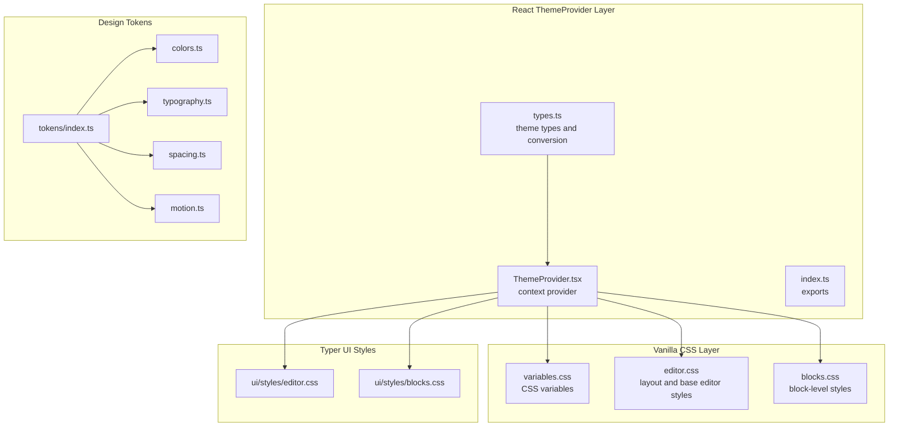
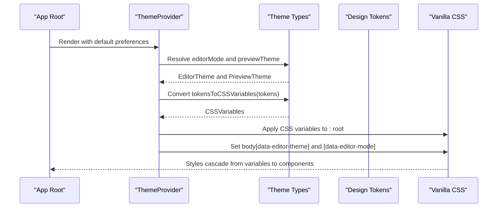
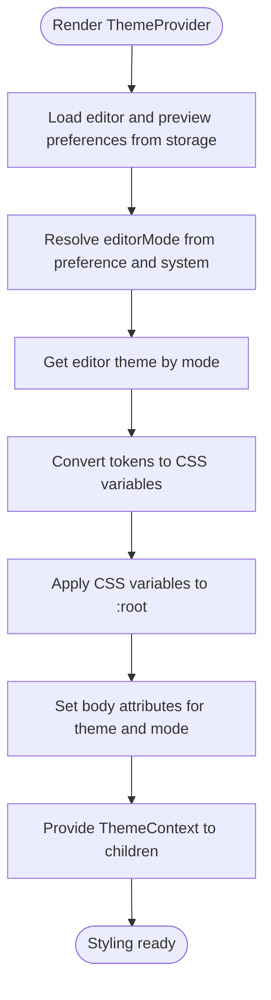
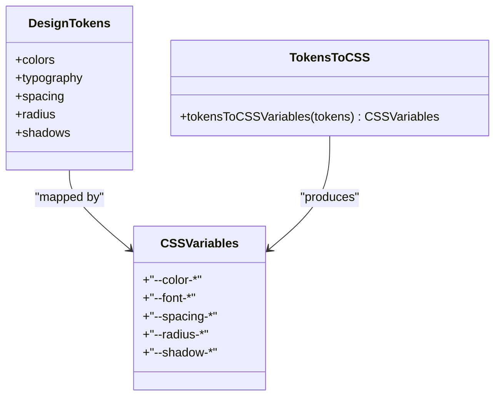
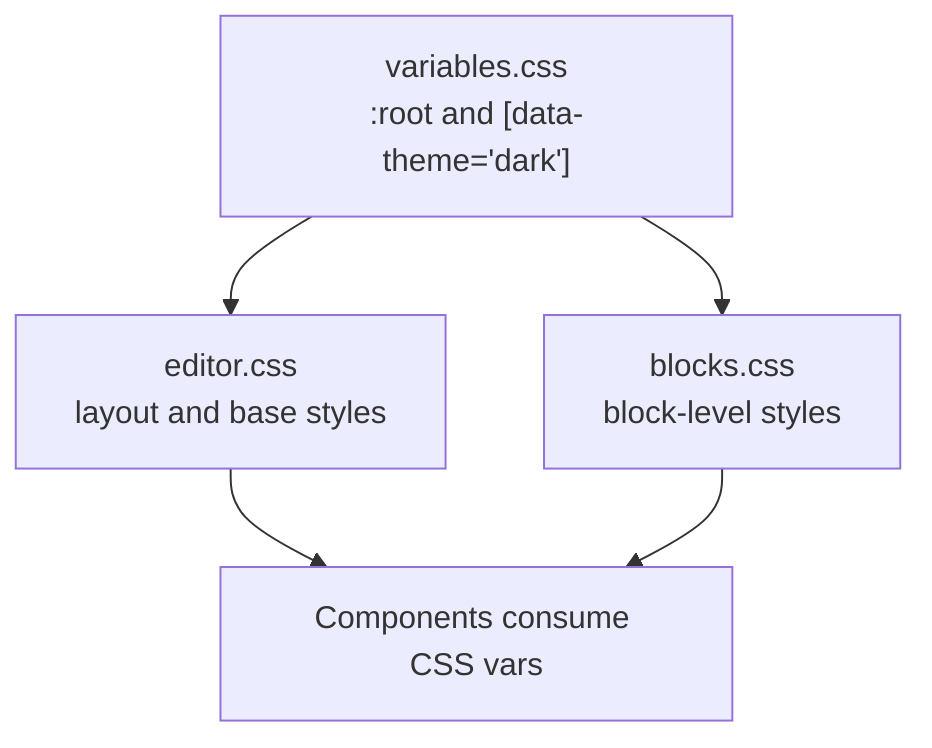
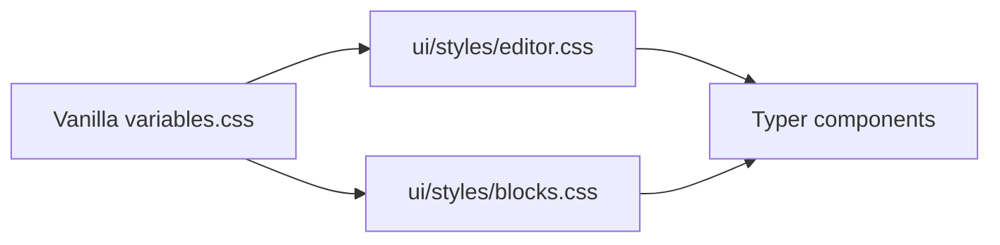
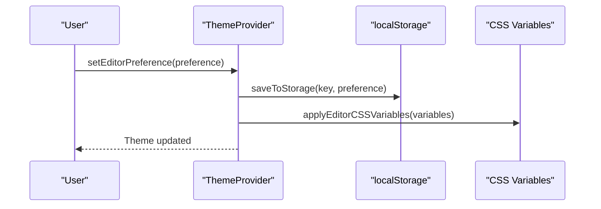
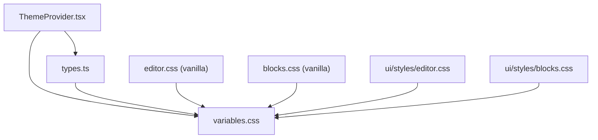

# Styling Approach

<cite>
**Referenced Files in This Document**
- [ThemeProvider.tsx](file://artoon-typer/src/themes/ThemeProvider.tsx)
- [types.ts](file://artoon-typer/src/themes/types.ts)
- [index.ts](file://artoon-typer/src/themes/index.ts)
- [variables.css](file://artoon-typer/vanilla/css/variables.css)
- [editor.css](file://artoon-typer/vanilla/css/editor.css)
- [blocks.css](file://artoon-typer/vanilla/css/blocks.css)
- [index.ts](file://artoon-typer/src/design-system/tokens/index.ts)
- [colors.ts](file://artoon-typer/src/design-system/tokens/colors.ts)
- [typography.ts](file://artoon-typer/src/design-system/tokens/typography.ts)
- [spacing.ts](file://artoon-typer/src/design-system/tokens/spacing.ts)
- [motion.ts](file://artoon-typer/src/design-system/tokens/motion.ts)
- [blocks.css](file://artoon-typer/src/ui/styles/blocks.css)
- [editor.css](file://artoon-typer/src/ui/styles/editor.css)
</cite>

## Table of Contents
1. [Introduction](#introduction)
2. [Project Structure](#project-structure)
3. [Core Components](#core-components)
4. [Architecture Overview](#architecture-overview)
5. [Detailed Component Analysis](#detailed-component-analysis)
6. [Dependency Analysis](#dependency-analysis)
7. [Performance Considerations](#performance-considerations)
8. [Troubleshooting Guide](#troubleshooting-guide)
9. [Conclusion](#conclusion)

## Introduction
This document explains the ARTOON Typer styling approach and methodology. It covers the CSS architecture, variable-based theming, and modular styling system. It documents the cascade of styles from global variables to component-specific styles, block styling patterns, editor layout styles, and theme-specific styling. It also provides guidance on custom styling, overriding default styles, maintaining consistency across themes, CSS-in-JS considerations, performance optimization, and maintainability strategies.

## Project Structure
The styling system is organized into two complementary layers:
- Vanilla CSS layer for baseline editor and block styles, using CSS variables for theming.
- React-based ThemeProvider layer that manages dual themes (editor and preview) and injects CSS variables into the document root.

**Diagram sources**
- [ThemeProvider.tsx:1-268](file://artoon-typer/src/themes/ThemeProvider.tsx#L1-L268)
- [types.ts:1-383](file://artoon-typer/src/themes/types.ts#L1-L383)
- [index.ts:1-40](file://artoon-typer/src/themes/index.ts#L1-L40)
- [variables.css:1-73](file://artoon-typer/vanilla/css/variables.css#L1-L73)
- [editor.css:1-219](file://artoon-typer/vanilla/css/editor.css#L1-L219)
- [blocks.css:1-357](file://artoon-typer/vanilla/css/blocks.css#L1-L357)
- [index.ts:1-10](file://artoon-typer/src/design-system/tokens/index.ts#L1-L10)
- [colors.ts:1-76](file://artoon-typer/src/design-system/tokens/colors.ts#L1-L76)
- [typography.ts:1-57](file://artoon-typer/src/design-system/tokens/typography.ts#L1-L57)
- [spacing.ts:1-43](file://artoon-typer/src/design-system/tokens/spacing.ts#L1-L43)
- [motion.ts:1-31](file://artoon-typer/src/design-system/tokens/motion.ts#L1-L31)
- [editor.css:1-389](file://artoon-typer/src/ui/styles/editor.css#L1-L389)
- [blocks.css:1-286](file://artoon-typer/src/ui/styles/blocks.css#L1-L286)

**Section sources**
- [ThemeProvider.tsx:1-268](file://artoon-typer/src/themes/ThemeProvider.tsx#L1-L268)
- [types.ts:1-383](file://artoon-typer/src/themes/types.ts#L1-L383)
- [index.ts:1-40](file://artoon-typer/src/themes/index.ts#L1-L40)
- [variables.css:1-73](file://artoon-typer/vanilla/css/variables.css#L1-L73)
- [editor.css:1-219](file://artoon-typer/vanilla/css/editor.css#L1-L219)
- [blocks.css:1-357](file://artoon-typer/vanilla/css/blocks.css#L1-L357)
- [index.ts:1-10](file://artoon-typer/src/design-system/tokens/index.ts#L1-L10)
- [colors.ts:1-76](file://artoon-typer/src/design-system/tokens/colors.ts#L1-L76)
- [typography.ts:1-57](file://artoon-typer/src/design-system/tokens/typography.ts#L1-L57)
- [spacing.ts:1-43](file://artoon-typer/src/design-system/tokens/spacing.ts#L1-L43)
- [motion.ts:1-31](file://artoon-typer/src/design-system/tokens/motion.ts#L1-L31)
- [editor.css:1-389](file://artoon-typer/src/ui/styles/editor.css#L1-L389)
- [blocks.css:1-286](file://artoon-typer/src/ui/styles/blocks.css#L1-L286)

## Core Components
- ThemeProvider: Manages editor and preview themes, resolves preferences, persists selections, and injects CSS variables into the document root. It also toggles editor theme attributes on the body element.
- Theme types: Define DesignTokens, EditorTheme, PreviewTheme, and CSSVariables, plus a conversion function from tokens to CSS variables.
- Vanilla CSS variables: Provide baseline color, spacing, typography, radius, shadow, transition, and z-index variables for light/dark modes.
- Editor and block styles: Provide layout, component, and block-level styling with CSS variable usage for consistency.
- Design tokens: Centralized semantic tokens for colors, typography, spacing, and motion, exported via a single index.

Key responsibilities:
- Dual theme system: Editor themes (light/dark) and preview themes (minimal/blog/documentation/academic).
- Variable-based theming: Tokens mapped to CSS variables and injected at runtime.
- Modular styling: Separate concerns for layout, blocks, and components; optional Typer UI overrides.

**Section sources**
- [ThemeProvider.tsx:106-250](file://artoon-typer/src/themes/ThemeProvider.tsx#L106-L250)
- [types.ts:18-112](file://artoon-typer/src/themes/types.ts#L18-L112)
- [types.ts:243-310](file://artoon-typer/src/themes/types.ts#L243-L310)
- [types.ts:314-382](file://artoon-typer/src/themes/types.ts#L314-L382)
- [variables.css:5-73](file://artoon-typer/vanilla/css/variables.css#L5-L73)
- [editor.css:12-23](file://artoon-typer/vanilla/css/editor.css#L12-L23)
- [blocks.css:5-18](file://artoon-typer/vanilla/css/blocks.css#L5-L18)
- [index.ts:1-10](file://artoon-typer/src/design-system/tokens/index.ts#L1-L10)

## Architecture Overview
The styling architecture follows a cascading pattern:
- Design tokens define semantic values.
- Theme types convert tokens to CSS variables.
- ThemeProvider injects CSS variables into :root and sets body attributes for theme-aware selectors.
- Vanilla CSS consumes CSS variables for base editor and block styles.
- Optional Typer UI styles override or complement vanilla styles with additional variables and selectors.

**Diagram sources**
- [ThemeProvider.tsx:106-216](file://artoon-typer/src/themes/ThemeProvider.tsx#L106-L216)
- [types.ts:314-382](file://artoon-typer/src/themes/types.ts#L314-L382)
- [variables.css:5-73](file://artoon-typer/vanilla/css/variables.css#L5-L73)

**Section sources**
- [ThemeProvider.tsx:106-216](file://artoon-typer/src/themes/ThemeProvider.tsx#L106-L216)
- [types.ts:314-382](file://artoon-typer/src/themes/types.ts#L314-L382)
- [variables.css:5-73](file://artoon-typer/vanilla/css/variables.css#L5-L73)

## Detailed Component Analysis

### ThemeProvider and Dual Theme System
- Responsibilities:
  - Manage editor preference (light/dark/system) and resolve effective mode.
  - Persist preferences to storage and react to system preference changes.
  - Inject CSS variables derived from editor theme tokens into the document root.
  - Provide context for editor and preview themes, including switching and custom preview themes.
- Key behaviors:
  - Uses tokensToCSSVariables to map semantic tokens to CSS variables.
  - Applies attributes to the body element for theme-aware CSS targeting.
  - Supports custom preview themes and theme persistence.

**Diagram sources**
- [ThemeProvider.tsx:106-250](file://artoon-typer/src/themes/ThemeProvider.tsx#L106-L250)
- [types.ts:314-382](file://artoon-typer/src/themes/types.ts#L314-L382)

**Section sources**
- [ThemeProvider.tsx:106-250](file://artoon-typer/src/themes/ThemeProvider.tsx#L106-L250)
- [types.ts:199-234](file://artoon-typer/src/themes/types.ts#L199-L234)

### Design Tokens and CSS Variables
- Design tokens:
  - Colors: semantic scales for primary, neutral, success, warning, error, info.
  - Typography: font families, sizes, weights, line heights, letter spacing.
  - Spacing and radius: consistent scale units.
  - Motion: durations and easing functions.
- CSS variables:
  - tokensToCSSVariables maps tokens to CSS variable names for seamless consumption in CSS.
- Vanilla variables:
  - variables.css defines :root variables and a dark theme variant using [data-theme="dark"].

**Diagram sources**
- [types.ts:18-112](file://artoon-typer/src/themes/types.ts#L18-L112)
- [types.ts:243-310](file://artoon-typer/src/themes/types.ts#L243-L310)
- [types.ts:314-382](file://artoon-typer/src/themes/types.ts#L314-L382)
- [colors.ts:6-76](file://artoon-typer/src/design-system/tokens/colors.ts#L6-L76)
- [typography.ts:6-57](file://artoon-typer/src/design-system/tokens/typography.ts#L6-L57)
- [spacing.ts:6-43](file://artoon-typer/src/design-system/tokens/spacing.ts#L6-L43)
- [motion.ts:6-31](file://artoon-typer/src/design-system/tokens/motion.ts#L6-L31)
- [variables.css:5-73](file://artoon-typer/vanilla/css/variables.css#L5-L73)

**Section sources**
- [types.ts:18-112](file://artoon-typer/src/themes/types.ts#L18-L112)
- [types.ts:243-310](file://artoon-typer/src/themes/types.ts#L243-L310)
- [types.ts:314-382](file://artoon-typer/src/themes/types.ts#L314-L382)
- [colors.ts:6-76](file://artoon-typer/src/design-system/tokens/colors.ts#L6-L76)
- [typography.ts:6-57](file://artoon-typer/src/design-system/tokens/typography.ts#L6-L57)
- [spacing.ts:6-43](file://artoon-typer/src/design-system/tokens/spacing.ts#L6-L43)
- [motion.ts:6-31](file://artoon-typer/src/design-system/tokens/motion.ts#L6-L31)
- [variables.css:5-73](file://artoon-typer/vanilla/css/variables.css#L5-L73)

### Vanilla CSS: Global Variables, Editor Layout, and Block Styles
- Global variables:
  - Provide baseline CSS variables for colors, spacing, typography, radius, shadows, transitions, and z-index.
  - Dark theme variant uses [data-theme="dark"] to override variables.
- Editor layout:
  - App container, header, main area, editor wrapper, source panel, footer, and status bar.
  - Uses CSS variables for consistent spacing, colors, and typography.
- Block styles:
  - Base block structure, handle, dragging state, drop indicators, and block-specific styles for headings, quotes, lists, code, tables, media, dividers, and inline formatting.
  - Includes RTL/LTR handling and placeholder styling.

**Diagram sources**
- [variables.css:5-73](file://artoon-typer/vanilla/css/variables.css#L5-L73)
- [editor.css:12-219](file://artoon-typer/vanilla/css/editor.css#L12-L219)
- [blocks.css:5-357](file://artoon-typer/vanilla/css/blocks.css#L5-L357)

**Section sources**
- [variables.css:5-73](file://artoon-typer/vanilla/css/variables.css#L5-L73)
- [editor.css:12-219](file://artoon-typer/vanilla/css/editor.css#L12-L219)
- [blocks.css:5-357](file://artoon-typer/vanilla/css/blocks.css#L5-L357)

### Typer UI Styles: Overrides and Enhancements
- Editor styles:
  - Extend the vanilla layout with Typer-specific variables and selectors.
  - Include drag-and-drop visual indicators, block controls, separators, and responsive adjustments.
- Block styles:
  - Provide Typer-specific block-level styles, including list depth styling, code block enhancements, table alignment, media placeholders, and inline formatting.

**Diagram sources**
- [editor.css:1-389](file://artoon-typer/src/ui/styles/editor.css#L1-L389)
- [blocks.css:1-286](file://artoon-typer/src/ui/styles/blocks.css#L1-L286)
- [variables.css:5-73](file://artoon-typer/vanilla/css/variables.css#L5-L73)

**Section sources**
- [editor.css:16-389](file://artoon-typer/src/ui/styles/editor.css#L16-L389)
- [blocks.css:1-286](file://artoon-typer/src/ui/styles/blocks.css#L1-L286)

### Theme Switching and Persistence
- Editor preference:
  - Stored and restored from local storage; supports system preference detection and change events.
- Preview theme:
  - Selectable among predefined themes or custom; persisted separately.

**Diagram sources**
- [ThemeProvider.tsx:139-148](file://artoon-typer/src/themes/ThemeProvider.tsx#L139-L148)
- [ThemeProvider.tsx:77-100](file://artoon-typer/src/themes/ThemeProvider.tsx#L77-L100)
- [ThemeProvider.tsx:207-216](file://artoon-typer/src/themes/ThemeProvider.tsx#L207-L216)

**Section sources**
- [ThemeProvider.tsx:77-100](file://artoon-typer/src/themes/ThemeProvider.tsx#L77-L100)
- [ThemeProvider.tsx:119-148](file://artoon-typer/src/themes/ThemeProvider.tsx#L119-L148)
- [ThemeProvider.tsx:182-201](file://artoon-typer/src/themes/ThemeProvider.tsx#L182-L201)
- [ThemeProvider.tsx:207-216](file://artoon-typer/src/themes/ThemeProvider.tsx#L207-L216)

## Dependency Analysis
- ThemeProvider depends on:
  - Theme types for EditorTheme and PreviewTheme definitions.
  - tokensToCSSVariables to produce CSS variables from tokens.
  - Local storage utilities for persistence.
- Vanilla CSS depends on:
  - variables.css for CSS variables.
  - Body attributes set by ThemeProvider for theme-aware selectors.
- Typer UI styles depend on:
  - Vanilla variables.css via @import in editor.css.
  - ThemeProvider for CSS variable injection.

**Diagram sources**
- [ThemeProvider.tsx:106-250](file://artoon-typer/src/themes/ThemeProvider.tsx#L106-L250)
- [types.ts:314-382](file://artoon-typer/src/themes/types.ts#L314-L382)
- [variables.css:5-73](file://artoon-typer/vanilla/css/variables.css#L5-L73)
- [editor.css:7](file://artoon-typer/src/ui/styles/editor.css#L7)
- [blocks.css:1-286](file://artoon-typer/src/ui/styles/blocks.css#L1-L286)

**Section sources**
- [ThemeProvider.tsx:106-250](file://artoon-typer/src/themes/ThemeProvider.tsx#L106-L250)
- [types.ts:314-382](file://artoon-typer/src/themes/types.ts#L314-L382)
- [variables.css:5-73](file://artoon-typer/vanilla/css/variables.css#L5-L73)
- [editor.css:7](file://artoon-typer/src/ui/styles/editor.css#L7)

## Performance Considerations
- CSS variable injection:
  - Apply variables once per theme change; avoid frequent reflows by batching updates.
- Selector specificity:
  - Prefer scoped selectors and avoid overly deep nesting to reduce style recalculation.
- Animations and transitions:
  - Use transform and opacity for animations; leverage motion tokens for consistent timing.
- Media queries:
  - Minimize responsive rules and cache computed values where possible.
- Bundle size:
  - Keep theme variants minimal; share common styles and variables across editor and preview.

[No sources needed since this section provides general guidance]

## Troubleshooting Guide
- Theme not applying:
  - Verify ThemeProvider is wrapping the app and attributes are set on the body element.
  - Confirm CSS variables are present in :root after theme resolution.
- Variables missing:
  - Ensure tokensToCSSVariables is invoked and applied to documentElement.
  - Check for typos in CSS variable names.
- Dark/light mismatch:
  - Validate system preference listener and editor preference state.
- RTL/LTR issues:
  - Confirm block and content direction classes are applied and contenteditable directions are respected.
- Custom preview theme not taking effect:
  - Ensure setCustomPreviewTheme is called and the theme is not overridden by ID selection.

**Section sources**
- [ThemeProvider.tsx:207-216](file://artoon-typer/src/themes/ThemeProvider.tsx#L207-L216)
- [ThemeProvider.tsx:182-201](file://artoon-typer/src/themes/ThemeProvider.tsx#L182-L201)
- [editor.css:244-289](file://artoon-typer/src/ui/styles/editor.css#L244-L289)

## Conclusion
AROON Typer employs a robust, variable-driven styling architecture with a dual theme system. Design tokens feed into CSS variables managed by ThemeProvider, which injects them into the document root and applies body attributes for theme-aware CSS. Vanilla CSS provides baseline editor and block styles, while Typer UI styles offer targeted overrides and enhancements. This approach ensures consistency, scalability, and maintainability across themes and components.