# Editor Themes

<cite>
**Referenced Files in This Document**
- [README.md](file://artoon-typer/src/themes/README.md)
- [types.ts](file://artoon-typer/src/themes/types.ts)
- [ThemeProvider.tsx](file://artoon-typer/src/themes/ThemeProvider.tsx)
- [index.ts](file://artoon-typer/src/themes/index.ts)
- [editor/index.ts](file://artoon-typer/src/themes/editor/index.ts)
- [light.ts](file://artoon-typer/src/themes/editor/light.ts)
- [dark.ts](file://artoon-typer/src/themes/editor/dark.ts)
- [preview/index.ts](file://artoon-typer/src/themes/preview/index.ts)
- [minimal.ts](file://artoon-typer/src/themes/preview/minimal.ts)
- [blog.ts](file://artoon-typer/src/themes/preview/blog.ts)
- [variables.css](file://artoon-typer/src/ui/styles/variables.css)
- [editor.css](file://artoon-typer/src/ui/styles/editor.css)
- [themes/light.css](file://artoon-typer/src/ui/styles/themes/light.css)
- [themes/index.css](file://artoon-typer/src/ui/styles/themes/index.css)
</cite>

## Table of Contents
1. [Introduction](#introduction)
2. [Project Structure](#project-structure)
3. [Core Components](#core-components)
4. [Architecture Overview](#architecture-overview)
5. [Detailed Component Analysis](#detailed-component-analysis)
6. [Dependency Analysis](#dependency-analysis)
7. [Performance Considerations](#performance-considerations)
8. [Troubleshooting Guide](#troubleshooting-guide)
9. [Conclusion](#conclusion)
10. [Appendices](#appendices)

## Introduction
This document explains the ARTOON Typer editor theme system. It covers:
- Dual theme architecture: editor themes (light/dark) and preview themes (minimal, blog, documentation, academic)
- Color, typography, and spacing tokens
- System preference detection and theme switching
- CSS variable application and persistence
- How themes affect the editor interface
- Examples for customizing tokens, creating new themes, and integrating with editor mode and system preferences

## Project Structure
The theme system is organized under the themes package with clear separation between editor and preview themes, TypeScript types, and a React context provider. UI styles leverage CSS variables and theme-specific layers.

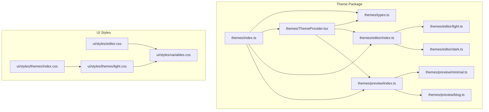

**Diagram sources**
- [index.ts:1-40](file://artoon-typer/src/themes/index.ts#L1-L40)
- [types.ts:1-383](file://artoon-typer/src/themes/types.ts#L1-L383)
- [ThemeProvider.tsx:1-268](file://artoon-typer/src/themes/ThemeProvider.tsx#L1-L268)
- [editor/index.ts:1-20](file://artoon-typer/src/themes/editor/index.ts#L1-L20)
- [preview/index.ts:1-39](file://artoon-typer/src/themes/preview/index.ts#L1-L39)
- [light.ts:1-102](file://artoon-typer/src/themes/editor/light.ts#L1-L102)
- [dark.ts:1-102](file://artoon-typer/src/themes/editor/dark.ts#L1-L102)
- [minimal.ts:1-176](file://artoon-typer/src/themes/preview/minimal.ts#L1-L176)
- [blog.ts:1-254](file://artoon-typer/src/themes/preview/blog.ts#L1-L254)
- [variables.css:1-60](file://artoon-typer/src/ui/styles/variables.css#L1-L60)
- [editor.css:1-389](file://artoon-typer/src/ui/styles/editor.css#L1-L389)
- [themes/light.css:1-36](file://artoon-typer/src/ui/styles/themes/light.css#L1-L36)
- [themes/index.css](file://artoon-typer/src/ui/styles/themes/index.css)

**Section sources**
- [README.md:1-366](file://artoon-typer/src/themes/README.md#L1-L366)
- [index.ts:1-40](file://artoon-typer/src/themes/index.ts#L1-L40)

## Core Components
- Design tokens: semantic color, typography, spacing, radius, and shadow tokens define consistent values across themes.
- Editor themes: light and dark modes with distinct token sets for the editor interface.
- Preview themes: content presentation themes (minimal, blog, documentation, academic) with optional custom CSS.
- ThemeProvider: React context provider managing editor/preview theme state, system preference detection, and CSS variable injection.
- CSS variables: tokens are converted to CSS variables and applied to the document root for the editor; UI styles consume CSS variables.

**Section sources**
- [types.ts:18-112](file://artoon-typer/src/themes/types.ts#L18-L112)
- [light.ts:9-102](file://artoon-typer/src/themes/editor/light.ts#L9-L102)
- [dark.ts:9-102](file://artoon-typer/src/themes/editor/dark.ts#L9-L102)
- [minimal.ts:10-176](file://artoon-typer/src/themes/preview/minimal.ts#L10-L176)
- [blog.ts:10-254](file://artoon-typer/src/themes/preview/blog.ts#L10-L254)
- [ThemeProvider.tsx:106-250](file://artoon-typer/src/themes/ThemeProvider.tsx#L106-L250)
- [types.ts:314-382](file://artoon-typer/src/themes/types.ts#L314-L382)

## Architecture Overview
The theme system follows a dual-theme model:
- Editor theme controls the editor UI (light/dark)
- Preview theme controls content rendering (minimal/blog/documentation/academic)
- ThemeProvider resolves editor mode from user preference and system preference, converts tokens to CSS variables, and applies them to the document root
- UI styles consume CSS variables for consistent theming

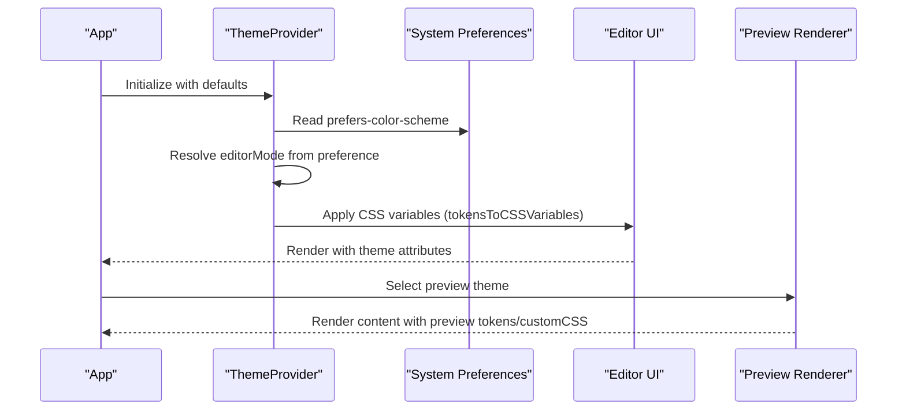

**Diagram sources**
- [ThemeProvider.tsx:106-250](file://artoon-typer/src/themes/ThemeProvider.tsx#L106-L250)
- [types.ts:314-382](file://artoon-typer/src/themes/types.ts#L314-L382)
- [editor/index.ts:17-19](file://artoon-typer/src/themes/editor/index.ts#L17-L19)
- [preview/index.ts:21-39](file://artoon-typer/src/themes/preview/index.ts#L21-L39)

## Detailed Component Analysis

### Theme Types and Tokens
Design tokens define semantic values for colors, typography, spacing, radius, and shadows. They are converted to CSS variables for runtime application.

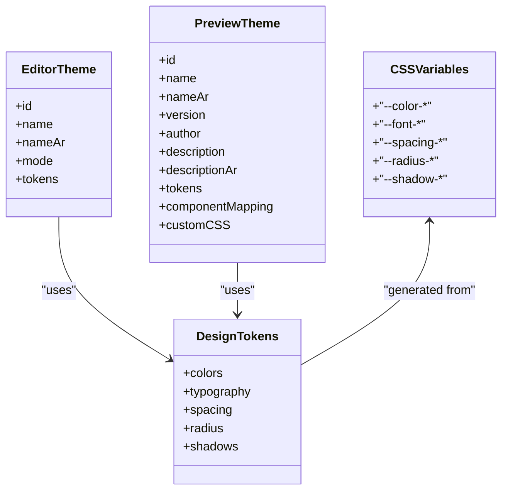

**Diagram sources**
- [types.ts:18-112](file://artoon-typer/src/themes/types.ts#L18-L112)
- [types.ts:154-163](file://artoon-typer/src/themes/types.ts#L154-L163)
- [types.ts:172-190](file://artoon-typer/src/themes/types.ts#L172-L190)
- [types.ts:243-309](file://artoon-typer/src/themes/types.ts#L243-L309)

**Section sources**
- [types.ts:18-112](file://artoon-typer/src/themes/types.ts#L18-L112)
- [types.ts:154-190](file://artoon-typer/src/themes/types.ts#L154-L190)
- [types.ts:314-382](file://artoon-typer/src/themes/types.ts#L314-L382)

### Editor Themes: Light and Dark
- Light theme: designed for daytime use with bright backgrounds and neutral text.
- Dark theme: optimized for low-light environments with deep backgrounds and muted accents.
- Both define complete token sets for colors, typography, spacing, radius, and shadows.

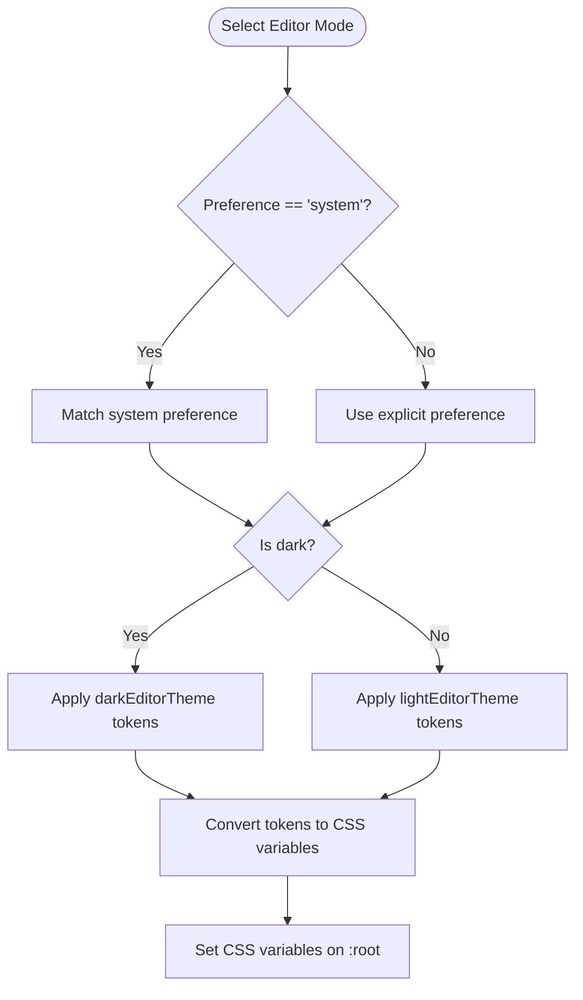

**Diagram sources**
- [ThemeProvider.tsx:127-137](file://artoon-typer/src/themes/ThemeProvider.tsx#L127-L137)
- [editor/index.ts:17-19](file://artoon-typer/src/themes/editor/index.ts#L17-L19)
- [light.ts:9-102](file://artoon-typer/src/themes/editor/light.ts#L9-L102)
- [dark.ts:9-102](file://artoon-typer/src/themes/editor/dark.ts#L9-L102)
- [types.ts:314-382](file://artoon-typer/src/themes/types.ts#L314-L382)

**Section sources**
- [light.ts:9-102](file://artoon-typer/src/themes/editor/light.ts#L9-L102)
- [dark.ts:9-102](file://artoon-typer/src/themes/editor/dark.ts#L9-L102)
- [editor/index.ts:17-19](file://artoon-typer/src/themes/editor/index.ts#L17-L19)

### Preview Themes: Minimal and Blog
- Minimal theme: clean baseline with subtle borders and spacing, suitable for focused reading.
- Blog theme: warm serif typography, comfortable line heights, and enhanced code/readability styling.
- Both include tokens and optional custom CSS for advanced styling.

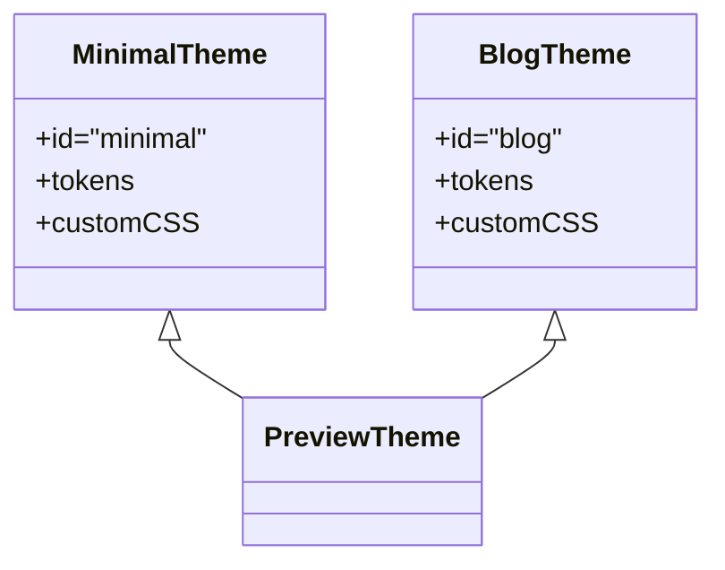

**Diagram sources**
- [minimal.ts:10-176](file://artoon-typer/src/themes/preview/minimal.ts#L10-L176)
- [blog.ts:10-254](file://artoon-typer/src/themes/preview/blog.ts#L10-L254)

**Section sources**
- [minimal.ts:10-176](file://artoon-typer/src/themes/preview/minimal.ts#L10-L176)
- [blog.ts:10-254](file://artoon-typer/src/themes/preview/blog.ts#L10-L254)

### ThemeProvider: State, Resolution, Persistence, and Application
- Manages editor preference and preview theme selection
- Resolves effective editor mode from user preference and system preference
- Applies CSS variables to the document root and adds theme attributes to the body
- Persists preferences to localStorage with configurable keys
- Subscribes to system preference changes via media query listeners

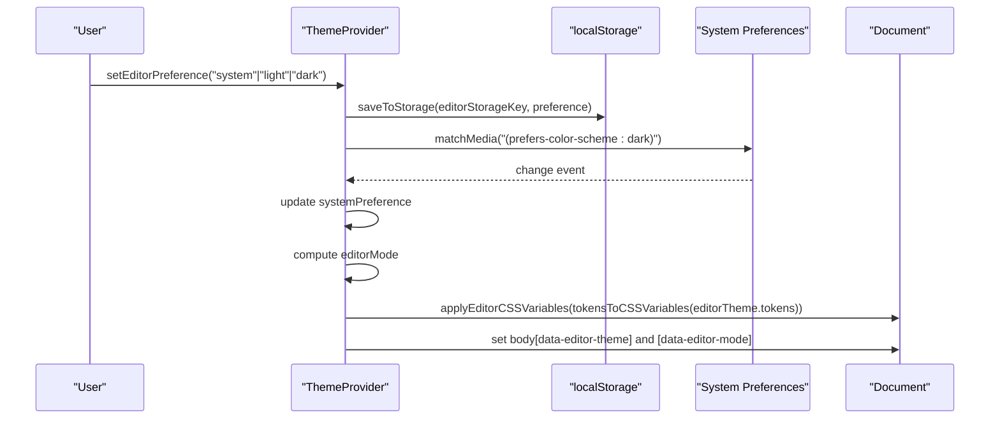

**Diagram sources**
- [ThemeProvider.tsx:106-250](file://artoon-typer/src/themes/ThemeProvider.tsx#L106-L250)
- [types.ts:314-382](file://artoon-typer/src/themes/types.ts#L314-L382)

**Section sources**
- [ThemeProvider.tsx:106-250](file://artoon-typer/src/themes/ThemeProvider.tsx#L106-L250)

### CSS Variable Application and Editor UI Integration
- Tokens are converted to CSS variables and applied to the document root for the editor
- UI styles consume CSS variables for consistent theming across components
- Theme-specific layers (e.g., light.css) override base variables for additional editor styling

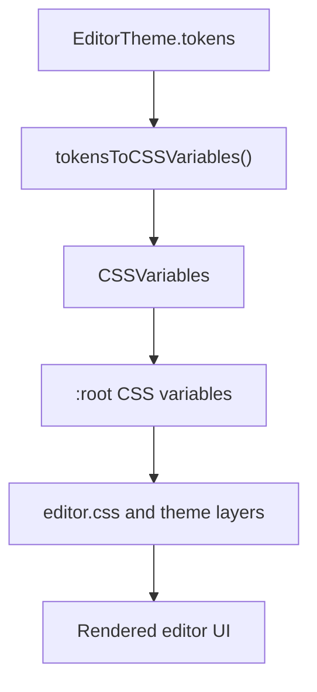

**Diagram sources**
- [types.ts:314-382](file://artoon-typer/src/themes/types.ts#L314-L382)
- [editor.css:1-389](file://artoon-typer/src/ui/styles/editor.css#L1-L389)
- [themes/light.css:1-36](file://artoon-typer/src/ui/styles/themes/light.css#L1-L36)
- [variables.css:1-60](file://artoon-typer/src/ui/styles/variables.css#L1-L60)

**Section sources**
- [types.ts:314-382](file://artoon-typer/src/themes/types.ts#L314-L382)
- [editor.css:1-389](file://artoon-typer/src/ui/styles/editor.css#L1-L389)
- [themes/light.css:1-36](file://artoon-typer/src/ui/styles/themes/light.css#L1-L36)
- [variables.css:1-60](file://artoon-typer/src/ui/styles/variables.css#L1-L60)

### Theme Switching Mechanism
- Editor switching toggles between light and dark modes
- Preview theme switching selects among built-in themes or a custom theme
- System preference mode follows OS-level theme automatically

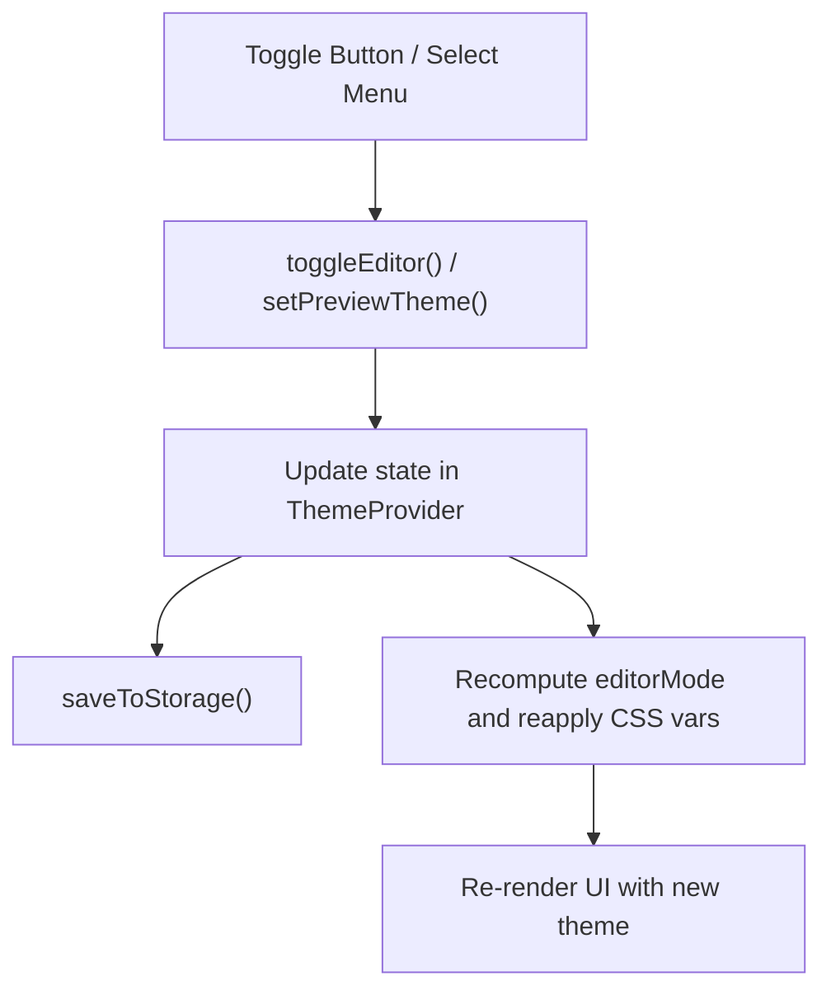

**Diagram sources**
- [ThemeProvider.tsx:146-175](file://artoon-typer/src/themes/ThemeProvider.tsx#L146-L175)
- [ThemeProvider.tsx:207-216](file://artoon-typer/src/themes/ThemeProvider.tsx#L207-L216)

**Section sources**
- [ThemeProvider.tsx:146-175](file://artoon-typer/src/themes/ThemeProvider.tsx#L146-L175)
- [ThemeProvider.tsx:207-216](file://artoon-typer/src/themes/ThemeProvider.tsx#L207-L216)

### Creating New Editor Themes
Steps to add a new editor theme:
- Define a new EditorTheme object with a unique id, metadata, and a complete tokens set
- Export the theme from the editor index
- Optionally, add a theme-specific CSS layer for additional editor UI overrides

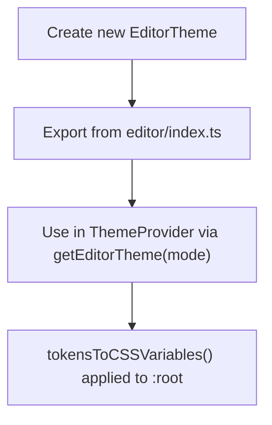

**Diagram sources**
- [editor/index.ts:7-19](file://artoon-typer/src/themes/editor/index.ts#L7-L19)
- [types.ts:314-382](file://artoon-typer/src/themes/types.ts#L314-L382)

**Section sources**
- [editor/index.ts:7-19](file://artoon-typer/src/themes/editor/index.ts#L7-L19)
- [types.ts:314-382](file://artoon-typer/src/themes/types.ts#L314-L382)

### Creating New Preview Themes
Steps to add a new preview theme:
- Define a new PreviewTheme with id, metadata, tokens, and optional customCSS
- Export the theme from the preview index
- Add the theme to the previewThemes array and defaultPreviewTheme if desired

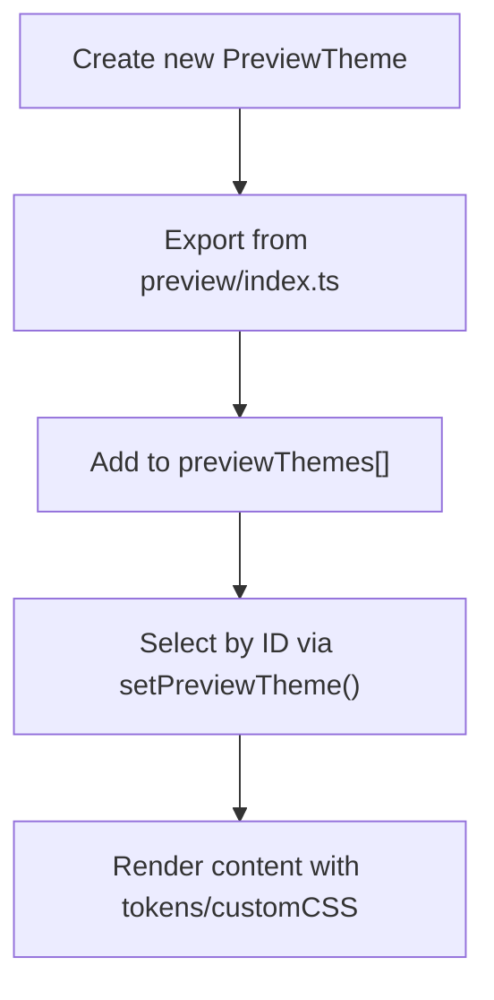

**Diagram sources**
- [preview/index.ts:21-39](file://artoon-typer/src/themes/preview/index.ts#L21-L39)

**Section sources**
- [preview/index.ts:21-39](file://artoon-typer/src/themes/preview/index.ts#L21-L39)

### Understanding Relationship Between Editor Mode and System Preferences
- Editor preference supports three modes: light, dark, or system
- System mode listens to OS-level theme changes and updates automatically
- The resolved editorMode determines which editor theme is active

**Section sources**
- [ThemeProvider.tsx:127-137](file://artoon-typer/src/themes/ThemeProvider.tsx#L127-L137)
- [ThemeProvider.tsx:182-201](file://artoon-typer/src/themes/ThemeProvider.tsx#L182-L201)

### Theme Persistence in localStorage
- Editor preference persists under a configurable key
- Preview theme selection persists under a configurable key
- On initialization, preferences are loaded from storage if present

**Section sources**
- [ThemeProvider.tsx:77-100](file://artoon-typer/src/themes/ThemeProvider.tsx#L77-L100)
- [ThemeProvider.tsx:119-121](file://artoon-typer/src/themes/ThemeProvider.tsx#L119-L121)
- [ThemeProvider.tsx:155-157](file://artoon-typer/src/themes/ThemeProvider.tsx#L155-L157)
- [ThemeProvider.tsx:140-143](file://artoon-typer/src/themes/ThemeProvider.tsx#L140-L143)
- [ThemeProvider.tsx:171-175](file://artoon-typer/src/themes/ThemeProvider.tsx#L171-L175)

### Browser Compatibility Considerations
- Uses modern media query event listeners with legacy fallbacks
- Applies CSS variables to the document root for broad browser support
- UI styles rely on standard CSS features; ensure target browsers support CSS variables and media queries

**Section sources**
- [ThemeProvider.tsx:192-200](file://artoon-typer/src/themes/ThemeProvider.tsx#L192-L200)
- [types.ts:314-382](file://artoon-typer/src/themes/types.ts#L314-L382)

## Dependency Analysis
The theme system exhibits clear separation of concerns:
- types.ts defines shared interfaces and conversion utilities
- ThemeProvider orchestrates state, persistence, and application
- editor/index.ts and preview/index.ts expose theme collections and getters
- UI styles depend on CSS variables produced by ThemeProvider

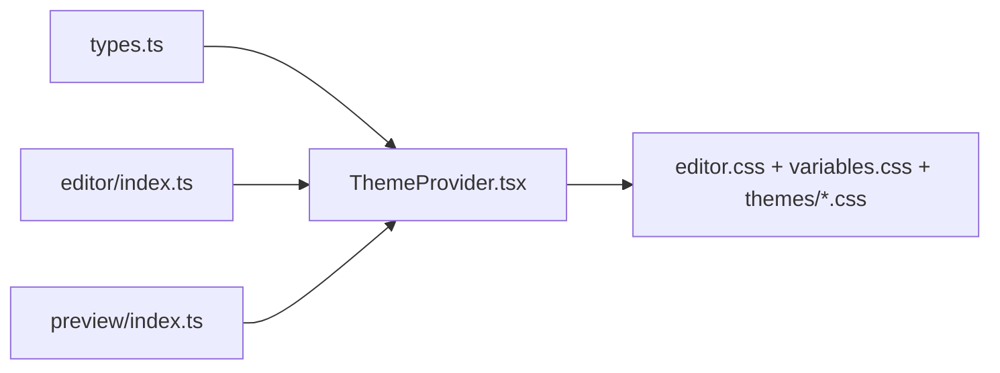

**Diagram sources**
- [types.ts:1-383](file://artoon-typer/src/themes/types.ts#L1-L383)
- [ThemeProvider.tsx:1-268](file://artoon-typer/src/themes/ThemeProvider.tsx#L1-L268)
- [editor/index.ts:1-20](file://artoon-typer/src/themes/editor/index.ts#L1-L20)
- [preview/index.ts:1-39](file://artoon-typer/src/themes/preview/index.ts#L1-L39)
- [editor.css:1-389](file://artoon-typer/src/ui/styles/editor.css#L1-L389)
- [variables.css:1-60](file://artoon-typer/src/ui/styles/variables.css#L1-L60)
- [themes/light.css:1-36](file://artoon-typer/src/ui/styles/themes/light.css#L1-L36)

**Section sources**
- [index.ts:9-39](file://artoon-typer/src/themes/index.ts#L9-L39)
- [ThemeProvider.tsx:1-268](file://artoon-typer/src/themes/ThemeProvider.tsx#L1-L268)

## Performance Considerations
- CSS variable application occurs when the editor theme changes; keep token sets concise to minimize reflows
- Avoid excessive customCSS in preview themes to prevent heavy rendering
- Prefer semantic tokens over hard-coded values to reduce maintenance overhead

## Troubleshooting Guide
Common issues and resolutions:
- Theme not applying: verify that ThemeProvider wraps the app and that CSS variables are being set on the document root
- System preference not updating: ensure media query listeners are attached and that the editor preference is set to system
- Preview theme not changing: confirm the preview theme ID exists in previewThemes and that setPreviewTheme is called with the correct ID
- Persistence failures: check localStorage availability and permissions; the provider handles parsing and saving with safe guards

**Section sources**
- [ThemeProvider.tsx:182-201](file://artoon-typer/src/themes/ThemeProvider.tsx#L182-L201)
- [ThemeProvider.tsx:77-100](file://artoon-typer/src/themes/ThemeProvider.tsx#L77-L100)
- [preview/index.ts:21-39](file://artoon-typer/src/themes/preview/index.ts#L21-L39)

## Conclusion
The ARTOON Typer theme system provides a robust, extensible foundation for editor and preview theming. By leveraging design tokens, CSS variables, and a React context provider, it ensures consistent, maintainable theming across the editor interface and content presentation. The dual-theme model, system preference integration, and persistence mechanisms deliver a seamless user experience with room for customization and future expansion.

## Appendices

### Quick Reference: Theme Tokens
- Colors: primary, secondary, success, warning, error, text (primary, secondary, tertiary, disabled), background (primary, secondary, tertiary, hover, active), border (default, hover, focus)
- Typography: fontFamily (heading, body, code), fontSize (xs, sm, base, lg, xl, 2xl, 3xl, 4xl), fontWeight (normal, medium, semibold, bold), lineHeight (tight, normal, relaxed)
- Spacing: xs, sm, md, lg, xl, 2xl, 3xl
- Radius: sm, md, lg, full
- Shadows: sm, md, lg, xl

**Section sources**
- [types.ts:18-112](file://artoon-typer/src/themes/types.ts#L18-L112)