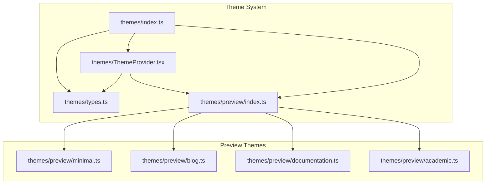
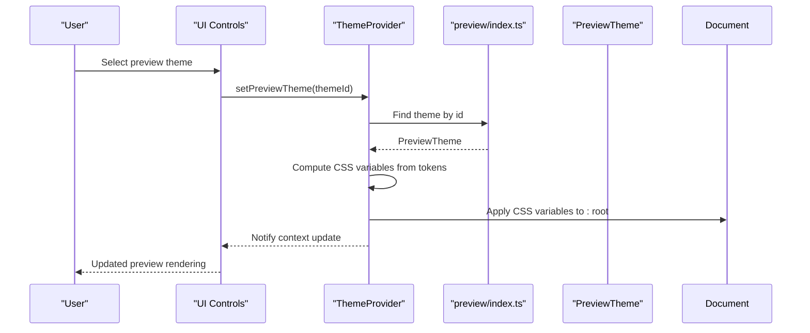
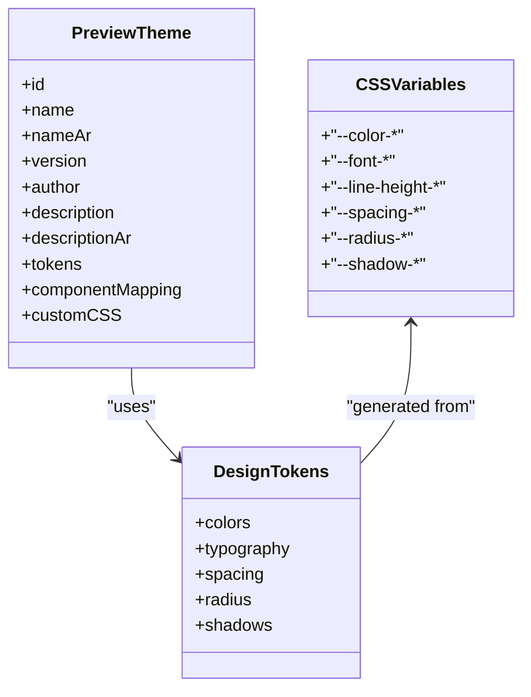
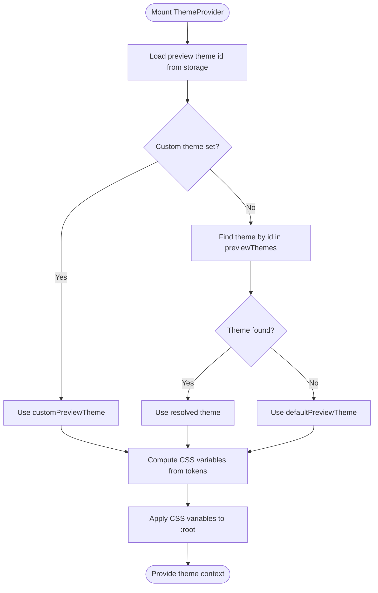
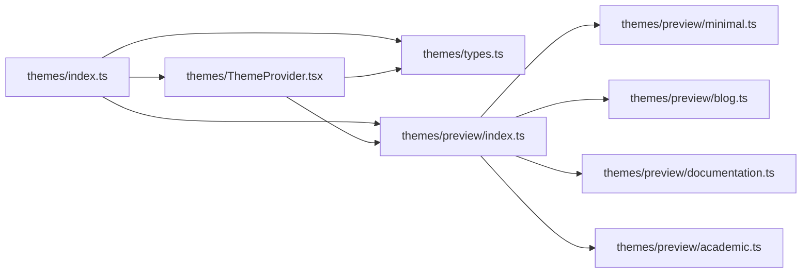

# Preview Themes

<cite>
**Referenced Files in This Document**
- [index.ts](file://artoon-typer/src/themes/index.ts)
- [types.ts](file://artoon-typer/src/themes/types.ts)
- [ThemeProvider.tsx](file://artoon-typer/src/themes/ThemeProvider.tsx)
- [preview/index.ts](file://artoon-typer/src/themes/preview/index.ts)
- [minimal.ts](file://artoon-typer/src/themes/preview/minimal.ts)
- [blog.ts](file://artoon-typer/src/themes/preview/blog.ts)
- [documentation.ts](file://artoon-typer/src/themes/preview/documentation.ts)
- [academic.ts](file://artoon-typer/src/themes/preview/academic.ts)
- [PREVIEW-GUIDE.md](file://artoon-typer/PREVIEW-GUIDE.md)
</cite>

## Table of Contents
1. [Introduction](#introduction)
2. [Project Structure](#project-structure)
3. [Core Components](#core-components)
4. [Architecture Overview](#architecture-overview)
5. [Detailed Component Analysis](#detailed-component-analysis)
6. [Dependency Analysis](#dependency-analysis)
7. [Performance Considerations](#performance-considerations)
8. [Troubleshooting Guide](#troubleshooting-guide)
9. [Conclusion](#conclusion)

## Introduction
This document explains the ARTOON Typer preview theme system. It covers the four built-in preview themes—minimal, blog, documentation, and academic—detailing their design philosophies, intended use cases, and how they affect content rendering. It also documents the theme structure (design tokens, CSS variable mappings, component styling, and layout configurations), and provides practical guidance for switching themes, customizing appearance, and creating custom preview themes. Finally, it describes how preview themes interact with the editor’s content display.

## Project Structure
The preview theme system is part of the artoon-typer module and is organized around a dual-theme architecture:
- A shared type system defines design tokens and theme contracts.
- A ThemeProvider manages editor and preview theme state, applies CSS variables, and persists preferences.
- Preview themes are defined as separate modules exporting a PreviewTheme object with tokens and optional custom CSS.

**Diagram sources**
- [index.ts:1-40](file://artoon-typer/src/themes/index.ts#L1-L40)
- [types.ts:1-383](file://artoon-typer/src/themes/types.ts#L1-L383)
- [ThemeProvider.tsx:1-268](file://artoon-typer/src/themes/ThemeProvider.tsx#L1-L268)
- [preview/index.ts:1-39](file://artoon-typer/src/themes/preview/index.ts#L1-L39)
- [minimal.ts:1-176](file://artoon-typer/src/themes/preview/minimal.ts#L1-L176)
- [blog.ts:1-254](file://artoon-typer/src/themes/preview/blog.ts#L1-L254)
- [documentation.ts:1-295](file://artoon-typer/src/themes/preview/documentation.ts#L1-L295)
- [academic.ts:1-319](file://artoon-typer/src/themes/preview/academic.ts#L1-L319)

**Section sources**
- [index.ts:1-40](file://artoon-typer/src/themes/index.ts#L1-L40)
- [preview/index.ts:1-39](file://artoon-typer/src/themes/preview/index.ts#L1-L39)

## Core Components
- PreviewTheme contract: Defines metadata, design tokens, optional component mapping, and optional custom CSS.
- Preview theme registry: Aggregates all preview themes and exposes lookup and default selection.
- ThemeProvider: Manages current preview theme, applies CSS variables to the document root, persists user preferences, and exposes APIs to switch themes.

Key responsibilities:
- PreviewTheme: Encapsulates visual identity and layout rules for content presentation.
- previewThemes and defaultPreviewTheme: Provide the built-in theme collection and fallback.
- ThemeProvider: Applies tokens via CSS variables, tracks user-selected theme, and persists selections.

**Section sources**
- [types.ts:169-190](file://artoon-typer/src/themes/types.ts#L169-L190)
- [preview/index.ts:18-39](file://artoon-typer/src/themes/preview/index.ts#L18-L39)
- [ThemeProvider.tsx:106-250](file://artoon-typer/src/themes/ThemeProvider.tsx#L106-L250)

## Architecture Overview
The preview theme system converts design tokens into CSS variables and applies them to the document root. The ThemeProvider resolves the active preview theme (either a built-in theme or a custom theme) and injects the resulting CSS variables. Preview themes may also supply custom CSS to further refine component rendering.

**Diagram sources**
- [ThemeProvider.tsx:170-175](file://artoon-typer/src/themes/ThemeProvider.tsx#L170-L175)
- [preview/index.ts:21-33](file://artoon-typer/src/themes/preview/index.ts#L21-L33)
- [types.ts:314-382](file://artoon-typer/src/themes/types.ts#L314-L382)

## Detailed Component Analysis

### Preview Theme Contracts and Tokens
PreviewTheme extends the shared DesignTokens model, adding metadata and optional customization capabilities:
- Metadata: id, name, localized name, version, author, description.
- Design tokens: colors, typography, spacing, radius, shadows.
- Optional overrides: componentMapping, customCSS.

Design tokens are mapped to CSS variables via tokensToCSSVariables, which ensures consistent application across the preview surface.

**Diagram sources**
- [types.ts:18-112](file://artoon-typer/src/themes/types.ts#L18-L112)
- [types.ts:169-190](file://artoon-typer/src/themes/types.ts#L169-L190)
- [types.ts:243-309](file://artoon-typer/src/themes/types.ts#L243-L309)
- [types.ts:314-382](file://artoon-typer/src/themes/types.ts#L314-L382)

**Section sources**
- [types.ts:169-190](file://artoon-typer/src/themes/types.ts#L169-L190)
- [types.ts:314-382](file://artoon-typer/src/themes/types.ts#L314-L382)

### Preview Theme Registry and Defaults
The preview registry exports:
- Individual theme constants: minimalTheme, blogTheme, documentationTheme, academicTheme.
- previewThemes array: ordered collection of all built-in themes.
- getPreviewTheme(id): lookup by id.
- defaultPreviewTheme: fallback theme.

This enables ThemeProvider to resolve the active preview theme deterministically.

**Section sources**
- [preview/index.ts:7-39](file://artoon-typer/src/themes/preview/index.ts#L7-L39)

### ThemeProvider Behavior for Preview Themes
- Loads persisted preview theme id from storage or falls back to default.
- Resolves active preview theme from previewThemes or a user-provided custom theme.
- Computes CSS variables from tokens and applies them to the document root.
- Exposes setPreviewTheme and setCustomPreviewTheme to switch themes at runtime.

**Diagram sources**
- [ThemeProvider.tsx:154-175](file://artoon-typer/src/themes/ThemeProvider.tsx#L154-L175)
- [ThemeProvider.tsx:207-216](file://artoon-typer/src/themes/ThemeProvider.tsx#L207-L216)
- [preview/index.ts:21-39](file://artoon-typer/src/themes/preview/index.ts#L21-L39)

**Section sources**
- [ThemeProvider.tsx:106-250](file://artoon-typer/src/themes/ThemeProvider.tsx#L106-L250)

### Built-in Preview Themes

#### Minimal Theme
- Philosophy: Clean and minimal styling for distraction-free reading.
- Typography: Sans-serif headings/body with monospace code.
- Layout: Centered content with modest spacing; subtle borders and neutral backgrounds.
- Notable styling: Basic code block and table styling; minimal shadows.

Use cases: Short-form content, quick reads, focused writing sessions.

**Section sources**
- [minimal.ts:10-176](file://artoon-typer/src/themes/preview/minimal.ts#L10-L176)

#### Blog Theme
- Philosophy: Warm, readable typography ideal for long-form posts and articles.
- Typography: Serif headings, modern sans-serif body, monospace code.
- Layout: Wider content width with generous line heights and spacing; soft shadows; hover effects on interactive elements.
- Notable styling: Distinct heading sizes, link underlines with transitions, dark-themed code blocks, bordered tables with hover states.

Use cases: Personal blogs, newsletters, long-form articles.

**Section sources**
- [blog.ts:10-254](file://artoon-typer/src/themes/preview/blog.ts#L10-L254)

#### Documentation Theme
- Philosophy: Professional, hierarchical presentation for technical documentation.
- Typography: Modern sans-serif headings/body; Fira Code for code; tight line heights for density.
- Layout: Wider content area; clear section dividers; robust code blocks; striped table rows; info/warning/error boxes.
- Notable styling: Subtle borders, elevated shadows, bordered code blocks, bordered tables with alternating row colors.

Use cases: API docs, tutorials, manuals, technical specs.

**Section sources**
- [documentation.ts:10-295](file://artoon-typer/src/themes/preview/documentation.ts#L10-L295)

#### Academic Theme
- Philosophy: Formal, scholarly presentation for academic papers and research.
- Typography: Traditional serif family for headings/body; Courier-based monospace; high line heights; justified text.
- Layout: Centered headings, paragraph indents, formal borders, footnotes support, abstract box, caption styling.
- Notable styling: No rounded corners; formal borders; footnote and footnotes containers; abstract container; centered headings.

Use cases: Research papers, theses, formal reports.

**Section sources**
- [academic.ts:10-319](file://artoon-typer/src/themes/preview/academic.ts#L10-L319)

### How Preview Themes Affect Rendering
- CSS variable injection: tokensToCSSVariables maps semantic tokens to CSS variables applied to the document root, ensuring consistent color, typography, spacing, and shadow scales across the preview.
- Component styling: Each theme’s customCSS augments default HTML rendering for ARTOON components (headings, paragraphs, links, code blocks, quotes, lists, tables, images).
- Visual hierarchy: Fonts, sizes, weights, and line heights vary per theme to emphasize content structure and readability.
- Layout constraints: Max widths and margins are tuned to optimize readability for each use case.

**Section sources**
- [types.ts:314-382](file://artoon-typer/src/themes/types.ts#L314-L382)
- [minimal.ts:105-174](file://artoon-typer/src/themes/preview/minimal.ts#L105-L174)
- [blog.ts:105-252](file://artoon-typer/src/themes/preview/blog.ts#L105-L252)
- [documentation.ts:105-293](file://artoon-typer/src/themes/preview/documentation.ts#L105-L293)
- [academic.ts:105-318](file://artoon-typer/src/themes/preview/academic.ts#L105-L318)

### Switching Between Preview Themes
- Use the ThemeProvider’s setPreviewTheme(themeId) to switch among built-in themes by id.
- Persisted selection is stored in local storage keyed by the preview storage key.
- The preview panel updates immediately to reflect the new theme’s CSS variables and custom styling.

Practical steps:
- Invoke setPreviewTheme with one of: "minimal", "blog", "documentation", "academic".
- Confirm the change visually in the preview panel.

**Section sources**
- [ThemeProvider.tsx:170-175](file://artoon-typer/src/themes/ThemeProvider.tsx#L170-L175)
- [preview/index.ts:21-33](file://artoon-typer/src/themes/preview/index.ts#L21-L33)

### Customizing Theme Appearance
- Override tokens: Provide a custom PreviewTheme with modified colors, typography, spacing, radius, or shadows.
- Extend customCSS: Add or refine component styling for headings, lists, tables, code blocks, and more.
- Combine approaches: Adjust tokens for global consistency and customCSS for component-specific tweaks.

Notes:
- Custom themes bypass the built-in theme registry until explicitly set.
- ThemeProvider supports setCustomPreviewTheme to apply a custom theme object.

**Section sources**
- [types.ts:169-190](file://artoon-typer/src/themes/types.ts#L169-L190)
- [ThemeProvider.tsx:159-175](file://artoon-typer/src/themes/ThemeProvider.tsx#L159-L175)

### Creating Custom Preview Themes
Steps:
1. Define a PreviewTheme object with:
   - id and metadata
   - tokens (colors, typography, spacing, radius, shadows)
   - optional componentMapping and/or customCSS
2. Provide it to ThemeProvider via setCustomPreviewTheme or register it alongside built-ins.
3. Apply the theme using setPreviewTheme or setCustomPreviewTheme.

Benefits:
- Tailor visual identity to brand guidelines or domain needs.
- Keep typography and spacing consistent across content.
- Enhance readability and accessibility through thoughtful token choices.

**Section sources**
- [types.ts:169-190](file://artoon-typer/src/themes/types.ts#L169-L190)
- [ThemeProvider.tsx:159-175](file://artoon-typer/src/themes/ThemeProvider.tsx#L159-L175)

### Interaction With Editor Content Display
- The preview panel renders transformed ARTOON content with the active preview theme applied.
- Theme changes take effect immediately because CSS variables are injected into the document root and customCSS is applied to the preview iframe/document.
- Errors and warnings appear styled according to the current theme’s color palette.

**Section sources**
- [PREVIEW-GUIDE.md:1-133](file://artoon-typer/PREVIEW-GUIDE.md#L1-L133)
- [ThemeProvider.tsx:207-216](file://artoon-typer/src/themes/ThemeProvider.tsx#L207-L216)

## Dependency Analysis
The preview theme system exhibits low coupling and high cohesion:
- themes/index.ts centralizes exports and re-exports from preview and editor subsystems.
- preview/index.ts depends on individual theme modules but exposes a unified registry.
- ThemeProvider depends on preview/index.ts and types.ts, applying tokens to the DOM.

**Diagram sources**
- [index.ts:26-35](file://artoon-typer/src/themes/index.ts#L26-L35)
- [preview/index.ts:1-39](file://artoon-typer/src/themes/preview/index.ts#L1-L39)
- [ThemeProvider.tsx:21-22](file://artoon-typer/src/themes/ThemeProvider.tsx#L21-L22)

**Section sources**
- [index.ts:1-40](file://artoon-typer/src/themes/index.ts#L1-L40)
- [preview/index.ts:1-39](file://artoon-typer/src/themes/preview/index.ts#L1-L39)
- [ThemeProvider.tsx:1-268](file://artoon-typer/src/themes/ThemeProvider.tsx#L1-L268)

## Performance Considerations
- CSS variable application is O(n) with respect to the number of token keys; negligible overhead.
- CustomCSS is applied once during theme activation; keep selectors efficient to avoid layout thrashing.
- Prefer token-driven styling to reduce duplication and maintain consistency across themes.

## Troubleshooting Guide
Common issues and resolutions:
- Preview panel does not show:
  - Ensure the preview toggle is enabled and the preview panel is visible.
  - Check browser console for errors.
- Preview does not update after switching themes:
  - Verify setPreviewTheme was called with a valid id.
  - Refresh the page if necessary to reapply CSS variables.
- Theme styles not applied:
  - Confirm tokens are properly converted to CSS variables and applied to the document root.
  - Review customCSS for selector conflicts or specificity issues.

**Section sources**
- [PREVIEW-GUIDE.md:112-126](file://artoon-typer/PREVIEW-GUIDE.md#L112-L126)
- [ThemeProvider.tsx:207-216](file://artoon-typer/src/themes/ThemeProvider.tsx#L207-L216)

## Conclusion
ARTOON Typer’s preview theme system provides a flexible, token-driven approach to content presentation. The four built-in themes—minimal, blog, documentation, and academic—each target distinct use cases while sharing a consistent design foundation. Through ThemeProvider, users can switch themes instantly, and developers can customize or extend themes to meet specialized needs. By combining design tokens with optional custom CSS, the system balances consistency and flexibility for diverse content scenarios.