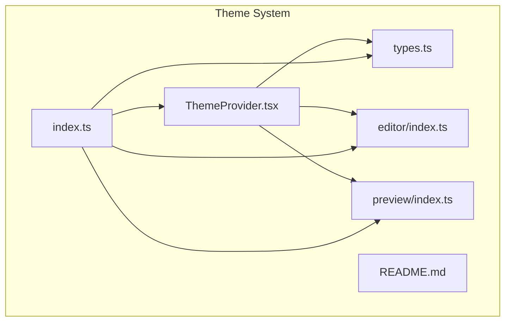
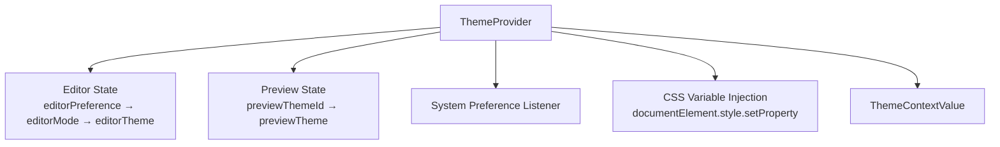
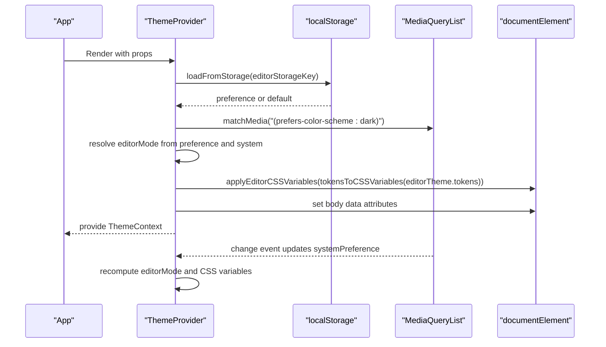
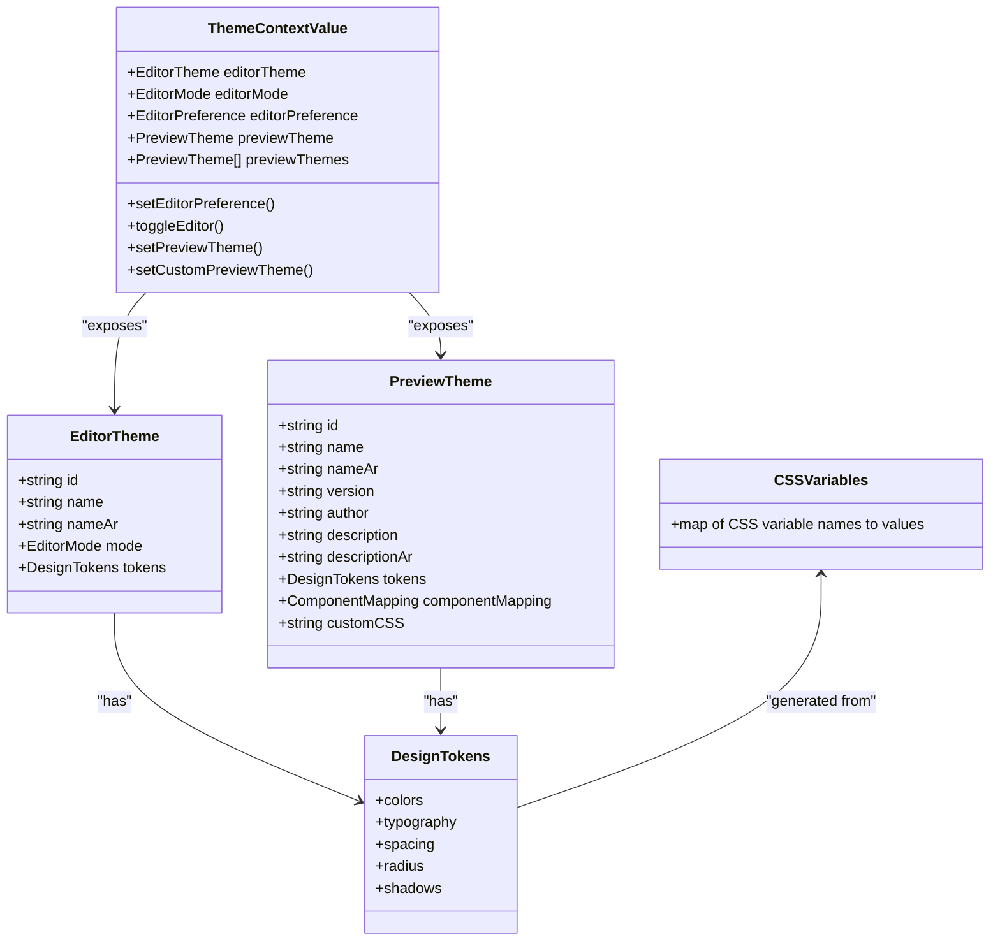
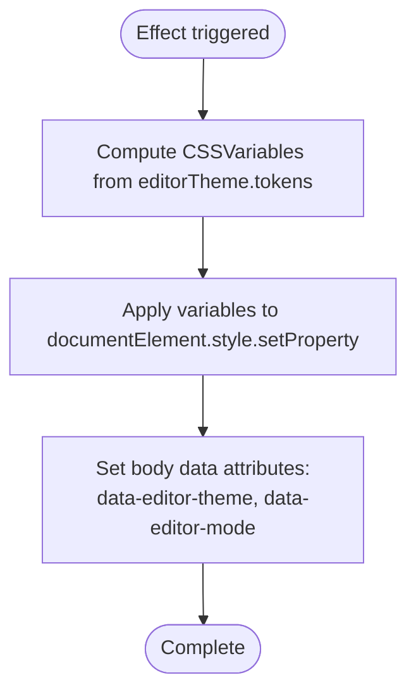
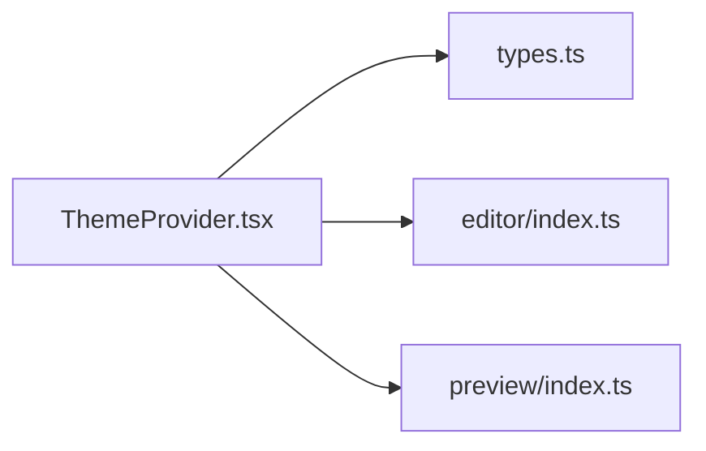

# Theme Provider Component

<cite>
**Referenced Files in This Document**
- [ThemeProvider.tsx](file://artoon-typer/src/themes/ThemeProvider.tsx)
- [types.ts](file://artoon-typer/src/themes/types.ts)
- [index.ts](file://artoon-typer/src/themes/index.ts)
- [README.md](file://artoon-typer/src/themes/README.md)
- [editor/index.ts](file://artoon-typer/src/themes/editor/index.ts)
- [preview/index.ts](file://artoon-typer/src/themes/preview/index.ts)
</cite>

## Table of Contents
1. [Introduction](#introduction)
2. [Project Structure](#project-structure)
3. [Core Components](#core-components)
4. [Architecture Overview](#architecture-overview)
5. [Detailed Component Analysis](#detailed-component-analysis)
6. [Dependency Analysis](#dependency-analysis)
7. [Performance Considerations](#performance-considerations)
8. [Troubleshooting Guide](#troubleshooting-guide)
9. [Conclusion](#conclusion)
10. [Appendices](#appendices)

## Introduction
This document provides comprehensive documentation for the ThemeProvider component, the central hub of the ARTOON Typer dual theme system. The system separates concerns between:
- Editor Theme: Light/Dark mode for the editing interface
- Preview Theme: Content presentation themes (Minimal, Blog, Documentation, Academic)

The ThemeProvider manages both systems concurrently, persists user preferences, detects system preferences, injects CSS variables into the document root, and exposes a React context for theme-aware components.

## Project Structure
The theme system resides under artoon-typer/src/themes and consists of:
- Provider and context: ThemeProvider.tsx
- Type definitions and utilities: types.ts
- Exports and re-exports: index.ts
- Editor theme registry: editor/index.ts
- Preview theme registry: preview/index.ts
- Documentation: README.md

**Diagram sources**
- [ThemeProvider.tsx:1-268](file://artoon-typer/src/themes/ThemeProvider.tsx#L1-L268)
- [types.ts:1-383](file://artoon-typer/src/themes/types.ts#L1-L383)
- [index.ts:1-40](file://artoon-typer/src/themes/index.ts#L1-L40)
- [editor/index.ts:1-20](file://artoon-typer/src/themes/editor/index.ts#L1-L20)
- [preview/index.ts:1-39](file://artoon-typer/src/themes/preview/index.ts#L1-L39)

**Section sources**
- [ThemeProvider.tsx:1-268](file://artoon-typer/src/themes/ThemeProvider.tsx#L1-L268)
- [types.ts:1-383](file://artoon-typer/src/themes/types.ts#L1-L383)
- [index.ts:1-40](file://artoon-typer/src/themes/index.ts#L1-L40)
- [README.md:1-366](file://artoon-typer/src/themes/README.md#L1-L366)

## Core Components
- ThemeProvider: React context provider that manages dual theme state, system preference detection, and CSS variable injection.
- useTheme: Hook to consume the theme context.
- Theme types: Design tokens, CSS variables, editor/preview theme interfaces, and context contract.
- Editor theme registry: Provides light/dark themes and resolution by mode.
- Preview theme registry: Provides built-in preview themes and utilities.

Key responsibilities:
- Dual state management: editorPreference, editorMode, previewThemeId, customPreviewTheme
- Persistence: localStorage-backed storage keys for both editor and preview
- System preference: automatic detection via prefers-color-scheme media query
- CSS variable injection: converts design tokens to CSS variables and applies to document root
- Context propagation: exposes a single ThemeContextValue contract

**Section sources**
- [ThemeProvider.tsx:106-250](file://artoon-typer/src/themes/ThemeProvider.tsx#L106-L250)
- [types.ts:199-234](file://artoon-typer/src/themes/types.ts#L199-L234)
- [editor/index.ts:14-19](file://artoon-typer/src/themes/editor/index.ts#L14-L19)
- [preview/index.ts:21-38](file://artoon-typer/src/themes/preview/index.ts#L21-L38)

## Architecture Overview
The ThemeProvider composes two subsystems:
- Editor Theme subsystem: resolves editorMode from user preference and system preference, selects an EditorTheme, and injects CSS variables into the document root.
- Preview Theme subsystem: tracks current previewThemeId, supports custom preview themes, and exposes available previewThemes.

**Diagram sources**
- [ThemeProvider.tsx:106-250](file://artoon-typer/src/themes/ThemeProvider.tsx#L106-L250)

## Detailed Component Analysis

### ThemeProvider Component
The ThemeProvider is a React component that:
- Accepts props for default preferences and storage keys
- Manages editor and preview theme state independently
- Subscribes to system preference changes
- Applies CSS variables to the document root
- Exposes a context value for downstream components

Props:
- defaultEditorPreference: 'light' | 'dark' | 'system'
- defaultPreviewThemeId: string (default: 'minimal')
- editorStorageKey: string (default: 'artoon-editor-preference')
- previewStorageKey: string (default: 'artoon-preview-theme')

Behavior highlights:
- Loads persisted preferences from localStorage on mount
- Resolves editorMode from preference and system preference
- Converts editorTheme tokens to CSS variables and applies to documentElement
- Adds data attributes to document.body for editor theme and mode
- Exposes setters for both editor and preview themes

**Diagram sources**
- [ThemeProvider.tsx:106-250](file://artoon-typer/src/themes/ThemeProvider.tsx#L106-L250)

**Section sources**
- [ThemeProvider.tsx:34-44](file://artoon-typer/src/themes/ThemeProvider.tsx#L34-L44)
- [ThemeProvider.tsx:106-250](file://artoon-typer/src/themes/ThemeProvider.tsx#L106-L250)
- [ThemeProvider.tsx:50-100](file://artoon-typer/src/themes/ThemeProvider.tsx#L50-L100)

### Theme Types and Utilities
The types module defines:
- DesignTokens: semantic color scales, typography, spacing, radius, and shadows
- EditorTheme and PreviewTheme: metadata plus DesignTokens
- ThemeContextValue: the contract exposed by the provider
- CSSVariables: typed mapping of token keys to CSS variable names
- tokensToCSSVariables: conversion function from DesignTokens to CSSVariables

**Diagram sources**
- [types.ts:18-112](file://artoon-typer/src/themes/types.ts#L18-L112)
- [types.ts:154-163](file://artoon-typer/src/themes/types.ts#L154-L163)
- [types.ts:172-190](file://artoon-typer/src/themes/types.ts#L172-L190)
- [types.ts:199-234](file://artoon-typer/src/themes/types.ts#L199-L234)
- [types.ts:243-309](file://artoon-typer/src/themes/types.ts#L243-L309)
- [types.ts:314-382](file://artoon-typer/src/themes/types.ts#L314-L382)

**Section sources**
- [types.ts:18-112](file://artoon-typer/src/themes/types.ts#L18-L112)
- [types.ts:154-163](file://artoon-typer/src/themes/types.ts#L154-L163)
- [types.ts:172-190](file://artoon-typer/src/themes/types.ts#L172-L190)
- [types.ts:199-234](file://artoon-typer/src/themes/types.ts#L199-L234)
- [types.ts:314-382](file://artoon-typer/src/themes/types.ts#L314-L382)

### Editor Theme Registry
The editor registry exports:
- lightEditorTheme and darkEditorTheme
- getEditorTheme(mode) resolver

It binds the EditorMode to a concrete EditorTheme.

**Section sources**
- [editor/index.ts:7-19](file://artoon-typer/src/themes/editor/index.ts#L7-L19)

### Preview Theme Registry
The preview registry exports:
- minimalTheme, blogTheme, documentationTheme, academicTheme
- previewThemes array
- getPreviewTheme(id) lookup
- defaultPreviewTheme

It provides the built-in preview themes and utilities.

**Section sources**
- [preview/index.ts:7-38](file://artoon-typer/src/themes/preview/index.ts#L7-L38)

### CSS Variable Injection Flow
The ThemeProvider converts editor theme tokens to CSS variables and applies them to the document root. It also sets data attributes on the body element to reflect the active editor theme and mode.

**Diagram sources**
- [ThemeProvider.tsx:207-216](file://artoon-typer/src/themes/ThemeProvider.tsx#L207-L216)
- [types.ts:314-382](file://artoon-typer/src/themes/types.ts#L314-L382)

**Section sources**
- [ThemeProvider.tsx:63-72](file://artoon-typer/src/themes/ThemeProvider.tsx#L63-L72)
- [ThemeProvider.tsx:207-216](file://artoon-typer/src/themes/ThemeProvider.tsx#L207-L216)

### Using ThemeProvider in Applications
Basic usage involves wrapping your application with ThemeProvider and consuming the context via useTheme.

Examples:
- Wrapping the app with default preferences
- Accessing editorMode, toggling editor theme
- Selecting preview themes from previewThemes
- Creating and applying a custom preview theme

These examples are documented in the theme README and demonstrate practical integration patterns.

**Section sources**
- [README.md:154-169](file://artoon-typer/src/themes/README.md#L154-L169)
- [README.md:116-152](file://artoon-typer/src/themes/README.md#L116-L152)
- [README.md:173-218](file://artoon-typer/src/themes/README.md#L173-L218)

## Dependency Analysis
The ThemeProvider depends on:
- Theme types for typing and conversion
- Editor theme registry for theme resolution
- Preview theme registry for theme enumeration and lookup
- Browser APIs for system preference and CSS variable application

**Diagram sources**
- [ThemeProvider.tsx:11-22](file://artoon-typer/src/themes/ThemeProvider.tsx#L11-L22)
- [types.ts:10-19](file://artoon-typer/src/themes/types.ts#L10-L19)
- [editor/index.ts:10-12](file://artoon-typer/src/themes/editor/index.ts#L10-L12)
- [preview/index.ts:12-16](file://artoon-typer/src/themes/preview/index.ts#L12-L16)

**Section sources**
- [ThemeProvider.tsx:11-22](file://artoon-typer/src/themes/ThemeProvider.tsx#L11-L22)
- [index.ts:9-38](file://artoon-typer/src/themes/index.ts#L9-L38)

## Performance Considerations
- Memoization: Uses useMemo for computed values (editorMode, editorTheme, previewTheme) to avoid unnecessary re-renders.
- Callback memoization: useCallback for setters to keep referential equality stable.
- CSS variable updates: Applied only when editorTheme or editorMode change, minimizing DOM writes.
- System preference listener: Cleaned up on unmount to prevent memory leaks.
- Storage operations: Encapsulated with try/catch to avoid blocking renders.

Recommendations:
- Keep the number of components subscribed to ThemeContext reasonable.
- Prefer toggling editorMode over frequent theme switches for preview.
- Avoid excessive custom preview theme mutations; batch updates when possible.

**Section sources**
- [ThemeProvider.tsx:127-137](file://artoon-typer/src/themes/ThemeProvider.tsx#L127-L137)
- [ThemeProvider.tsx:163-168](file://artoon-typer/src/themes/ThemeProvider.tsx#L163-L168)
- [ThemeProvider.tsx:235-243](file://artoon-typer/src/themes/ThemeProvider.tsx#L235-L243)
- [ThemeProvider.tsx:140-148](file://artoon-typer/src/themes/ThemeProvider.tsx#L140-L148)
- [ThemeProvider.tsx:171-175](file://artoon-typer/src/themes/ThemeProvider.tsx#L171-L175)

## Troubleshooting Guide
Common issues and resolutions:
- useTheme outside provider: Throws an error indicating useTheme must be used within ThemeProvider. Ensure your component tree is wrapped.
- Storage failures: loadFromStorage/saveToStorage handle exceptions and fall back to defaults. Check browser storage availability.
- No CSS variables applied: Verify the effect runs and that tokensToCSSVariables produces expected keys.
- System preference not updating: Confirm media query listener is attached and cleaned up properly.

**Section sources**
- [ThemeProvider.tsx:259-267](file://artoon-typer/src/themes/ThemeProvider.tsx#L259-L267)
- [ThemeProvider.tsx:77-100](file://artoon-typer/src/themes/ThemeProvider.tsx#L77-L100)
- [ThemeProvider.tsx:207-216](file://artoon-typer/src/themes/ThemeProvider.tsx#L207-L216)
- [ThemeProvider.tsx:182-201](file://artoon-typer/src/themes/ThemeProvider.tsx#L182-L201)

## Conclusion
The ThemeProvider delivers a robust, dual-theme system that cleanly separates editor and preview concerns. It offers flexible persistence, system preference awareness, and efficient CSS variable injection. The typed contracts and exported utilities enable predictable integration and extensibility for both built-in and custom themes.

## Appendices

### Props Reference
- defaultEditorPreference: 'light' | 'dark' | 'system'
- defaultPreviewThemeId: string
- editorStorageKey: string
- previewStorageKey: string

Defaults:
- defaultEditorPreference: 'system'
- defaultPreviewThemeId: 'minimal'
- editorStorageKey: 'artoon-editor-preference'
- previewStorageKey: 'artoon-preview-theme'

**Section sources**
- [ThemeProvider.tsx:34-44](file://artoon-typer/src/themes/ThemeProvider.tsx#L34-L44)
- [ThemeProvider.tsx:108-112](file://artoon-typer/src/themes/ThemeProvider.tsx#L108-L112)

### Persistence Keys
- Editor preference: 'artoon-editor-preference'
- Preview theme: 'artoon-preview-theme'

**Section sources**
- [ThemeProvider.tsx:110-111](file://artoon-typer/src/themes/ThemeProvider.tsx#L110-L111)
- [ThemeProvider.tsx:112-113](file://artoon-typer/src/themes/ThemeProvider.tsx#L112-L113)
- [README.md:274-275](file://artoon-typer/src/themes/README.md#L274-L275)

### Built-in Preview Themes
- minimalTheme
- blogTheme
- documentationTheme
- academicTheme

**Section sources**
- [preview/index.ts:7-26](file://artoon-typer/src/themes/preview/index.ts#L7-L26)