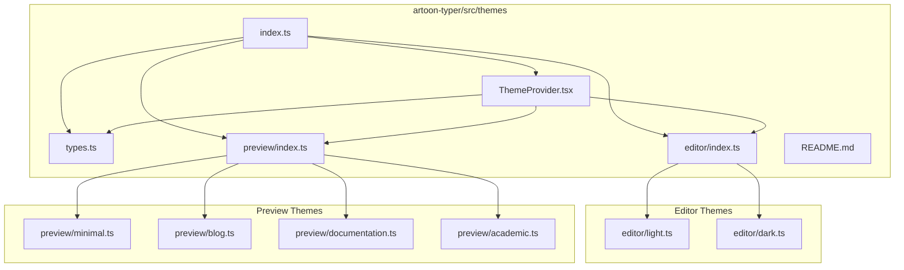
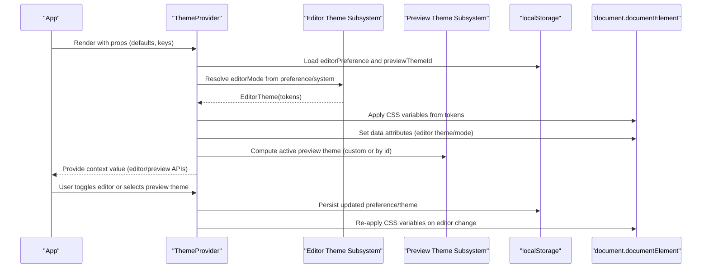
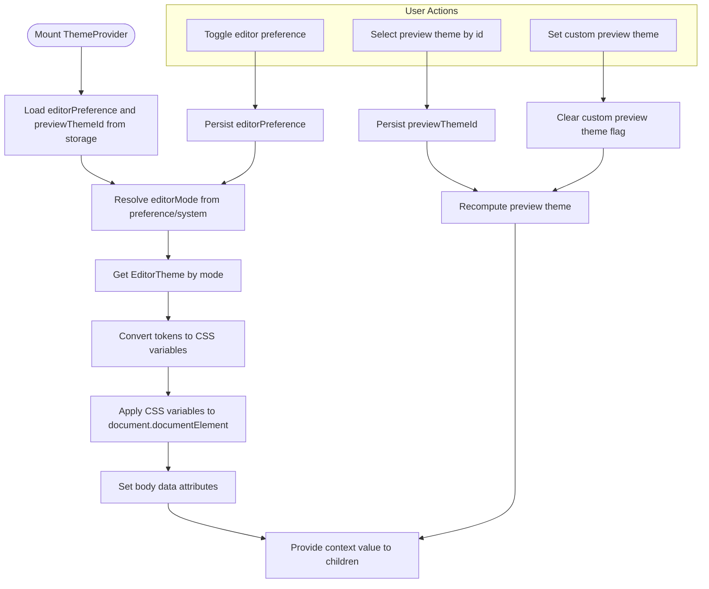
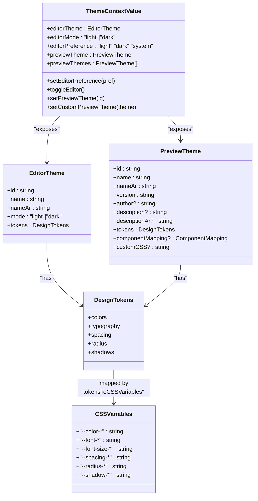
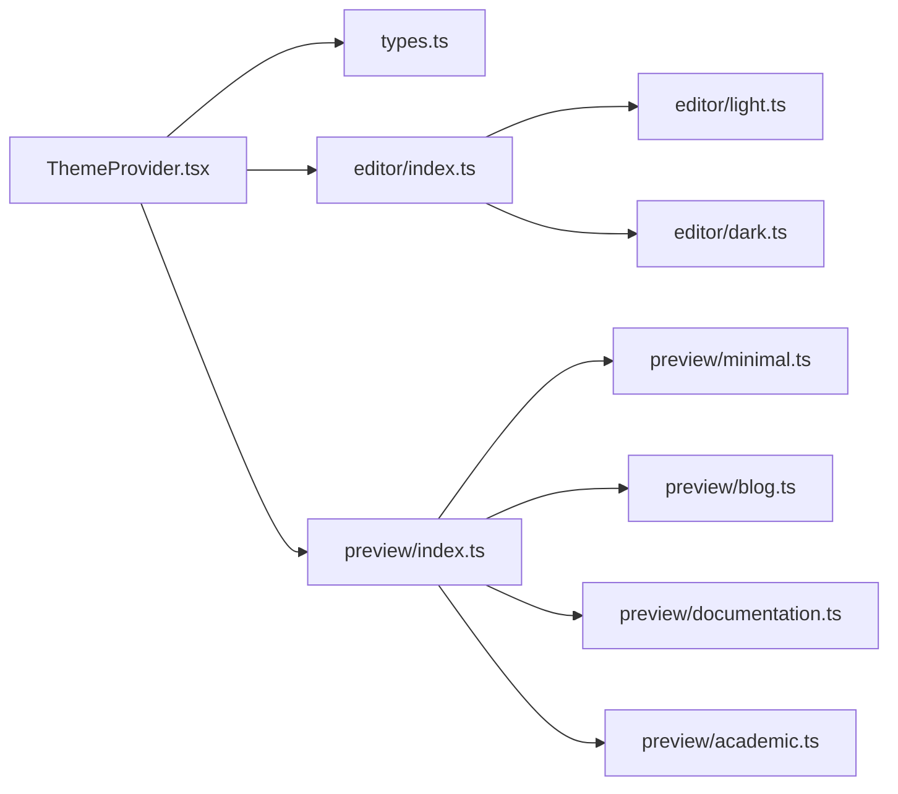

# Theme System

<cite>
**Referenced Files in This Document**
- [ThemeProvider.tsx](file://artoon-typer/src/themes/ThemeProvider.tsx)
- [index.ts](file://artoon-typer/src/themes/index.ts)
- [types.ts](file://artoon-typer/src/themes/types.ts)
- [README.md](file://artoon-typer/src/themes/README.md)
- [editor/index.ts](file://artoon-typer/src/themes/editor/index.ts)
- [preview/index.ts](file://artoon-typer/src/themes/preview/index.ts)
</cite>

## Table of Contents
1. [Introduction](#introduction)
2. [Project Structure](#project-structure)
3. [Core Components](#core-components)
4. [Architecture Overview](#architecture-overview)
5. [Detailed Component Analysis](#detailed-component-analysis)
6. [Dependency Analysis](#dependency-analysis)
7. [Performance Considerations](#performance-considerations)
8. [Troubleshooting Guide](#troubleshooting-guide)
9. [Conclusion](#conclusion)
10. [Appendices](#appendices)

## Introduction
This document explains the ARTOON Typer dual theme system used in the artoon-typer package. The system separates concerns into two orthogonal layers:
- Editor themes: light/dark modes for the editing interface
- Preview themes: content presentation themes (minimal, blog, documentation, academic)

It documents the ThemeProvider component, theme switching mechanisms, CSS variable-based theming, theme structure, token definitions, color schemes, typography systems, and practical guidance for creating custom themes, modifying existing ones, and building theme-aware components. It also covers persistence, browser compatibility, and performance considerations for theme switching.

## Project Structure
The theme system resides under artoon-typer/src/themes and is organized into:
- Shared types and utilities
- Editor themes (light/dark)
- Preview themes (minimal/blog/documentation/academic)
- Provider and exports

**Diagram sources**
- [ThemeProvider.tsx](file://artoon-typer/src/themes/ThemeProvider.tsx)
- [types.ts](file://artoon-typer/src/themes/types.ts)
- [index.ts](file://artoon-typer/src/themes/index.ts)
- [editor/index.ts](file://artoon-typer/src/themes/editor/index.ts)
- [preview/index.ts](file://artoon-typer/src/themes/preview/index.ts)

**Section sources**
- [README.md](file://artoon-typer/src/themes/README.md)
- [index.ts](file://artoon-typer/src/themes/index.ts)

## Core Components
- ThemeProvider: React context provider that manages both editor and preview themes, applies CSS variables to the document root, persists preferences, and exposes a concise API via useTheme.
- Theme types: Strongly typed definitions for design tokens, editor/preview themes, context shape, and CSS variable mapping.
- Editor theme registry: Provides light/dark themes and resolution by mode.
- Preview theme registry: Exposes built-in themes, a collection, and lookup by ID.

Key responsibilities:
- Dual theme state management
- System preference detection and change listening
- CSS variable injection for the editor interface
- Persistence via localStorage
- Theme-aware rendering via context

**Section sources**
- [ThemeProvider.tsx](file://artoon-typer/src/themes/ThemeProvider.tsx)
- [types.ts](file://artoon-typer/src/themes/types.ts)
- [editor/index.ts](file://artoon-typer/src/themes/editor/index.ts)
- [preview/index.ts](file://artoon-typer/src/themes/preview/index.ts)

## Architecture Overview
The ThemeProvider composes two subsystems:
- Editor theme subsystem: resolves the active editor theme from user preference and system preference, converts tokens to CSS variables, and injects them into the document root. It also sets data attributes on the body element to reflect the current editor theme and mode.
- Preview theme subsystem: selects the active preview theme from persisted storage or a custom override, and exposes APIs to switch themes.

**Diagram sources**
- [ThemeProvider.tsx](file://artoon-typer/src/themes/ThemeProvider.tsx)

## Detailed Component Analysis

### ThemeProvider Component
Responsibilities:
- Manage editor preference and mode, including system preference detection and change listeners
- Manage preview theme selection and custom overrides
- Convert design tokens to CSS variables and apply them to the document root
- Persist preferences to localStorage
- Expose a compact API via useTheme

Behavior highlights:
- Editor preference lifecycle: load from storage, update state, persist updates
- System preference listener: modern addEventListener and legacy addListener fallback
- CSS variable application: tokensToCSSVariables applied on mount and when editor theme changes
- Body attributes: data-editor-theme and data-editor-mode for downstream styling and debugging
- Preview theme lifecycle: load from storage, support custom theme override, clear override when selecting a built-in theme

**Diagram sources**
- [ThemeProvider.tsx](file://artoon-typer/src/themes/ThemeProvider.tsx)

**Section sources**
- [ThemeProvider.tsx](file://artoon-typer/src/themes/ThemeProvider.tsx)

### Theme Types and Design Tokens
Design tokens define semantic color scales, typography scales, spacing, border radius, and shadows. They are mapped to CSS variables for runtime application.

Token categories:
- Colors: primary, secondary, success, warning, error; text palettes; background palettes; border palettes
- Typography: font families (heading/body/code), font sizes (xs to 4xl), font weights (normal to bold), line heights (tight to relaxed)
- Spacing: xs to 3xl
- Radius: small to full
- Shadows: small to extra-large

CSS variable mapping:
- Color tokens map to --color-* variables
- Typography tokens map to --font-* and --font-size-* variables
- Spacing tokens map to --spacing-* variables
- Radius tokens map to --radius-* variables
- Shadow tokens map to --shadow-* variables

**Diagram sources**
- [types.ts](file://artoon-typer/src/themes/types.ts)

**Section sources**
- [types.ts](file://artoon-typer/src/themes/types.ts)

### Editor Themes
- Resolution: getEditorTheme(mode) returns either the dark or light editor theme based on the resolved mode.
- Modes: light and dark are provided; the system preference can resolve to either.

Integration points:
- ThemeProvider resolves the active editor theme and triggers CSS variable application.
- Body attributes reflect the current editor theme and mode.

**Section sources**
- [editor/index.ts](file://artoon-typer/src/themes/editor/index.ts)
- [ThemeProvider.tsx](file://artoon-typer/src/themes/ThemeProvider.tsx)

### Preview Themes
- Built-ins: minimal, blog, documentation, academic.
- Registry: previewThemes array and getPreviewTheme(id) lookup.
- Defaults: defaultPreviewTheme is minimal.
- Overrides: setCustomPreviewTheme allows applying a user-defined theme until cleared.

Usage:
- Exposed via ThemeProvider’s context value for UI controls and rendering.

**Section sources**
- [preview/index.ts](file://artoon-typer/src/themes/preview/index.ts)
- [ThemeProvider.tsx](file://artoon-typer/src/themes/ThemeProvider.tsx)

### Theme Switching Mechanisms
- Editor switching:
  - setEditorPreference updates the preference and persists it
  - toggleEditor flips between light and dark when preference is not “system”
  - System preference listener updates the resolved mode when the OS changes
- Preview switching:
  - setPreviewTheme updates the preview theme ID and clears custom overrides
  - setCustomPreviewTheme applies a custom theme object until a built-in theme is selected again

Persistence:
- Editor preference stored under editorStorageKey (default: artoon-editor-preference)
- Preview theme stored under previewStorageKey (default: artoon-preview-theme)

Browser compatibility:
- Uses modern addEventListener for media query change events
- Falls back to legacy addListener/removeListener for older browsers

**Section sources**
- [ThemeProvider.tsx](file://artoon-typer/src/themes/ThemeProvider.tsx)

### CSS Variable-Based Theming
- tokensToCSSVariables converts a DesignTokens object into a strongly-typed CSSVariables object
- ThemeProvider applies these variables to document.documentElement.style.setProperty
- Body receives data attributes for editor theme and mode to enable targeted styling

Practical impact:
- Rapid theme switching without re-rendering components
- Consistent design system across the editor UI
- Easy customization via custom preview themes with optional customCSS

**Section sources**
- [types.ts](file://artoon-typer/src/themes/types.ts)
- [ThemeProvider.tsx](file://artoon-typer/src/themes/ThemeProvider.tsx)

### Creating Custom Themes
Steps:
- Define a PreviewTheme object with id, name/nameAr, version, optional metadata, and tokens
- Optionally supply customCSS for global or scoped styling
- Use setCustomPreviewTheme to apply the theme
- Use setPreviewTheme to switch back to a built-in theme

Guidelines:
- Keep tokens aligned with the DesignTokens schema
- Prefer semantic tokens for maintainability
- Use customCSS sparingly and scope selectors carefully

**Section sources**
- [README.md](file://artoon-typer/src/themes/README.md)
- [types.ts](file://artoon-typer/src/themes/types.ts)
- [ThemeProvider.tsx](file://artoon-typer/src/themes/ThemeProvider.tsx)

### Modifying Existing Themes
Options:
- Override preview themes by setting a custom theme via setCustomPreviewTheme
- Adjust editor tokens to tweak the editor UI palette and typography
- Provide a custom CSS layer on top of the injected variables

Notes:
- Editor theme changes trigger CSS variable re-application
- Preview theme changes update the active theme object; customCSS is applied accordingly

**Section sources**
- [ThemeProvider.tsx](file://artoon-typer/src/themes/ThemeProvider.tsx)
- [types.ts](file://artoon-typer/src/themes/types.ts)

### Implementing Theme-Aware Components
Recommended pattern:
- Use useTheme to access editorMode, editorTheme, toggleEditor, setEditorPreference, previewTheme, previewThemes, setPreviewTheme, and setCustomPreviewTheme
- Build UI controls (buttons, selects) around these APIs
- Use data attributes set by ThemeProvider (data-editor-theme, data-editor-mode) for CSS targeting if needed

Example references:
- UI controls for toggling editor and selecting preview themes
- Displaying theme metadata (names, versions)

**Section sources**
- [ThemeProvider.tsx](file://artoon-typer/src/themes/ThemeProvider.tsx)
- [README.md](file://artoon-typer/src/themes/README.md)

## Dependency Analysis
The ThemeProvider depends on:
- Theme types for type safety and CSS variable mapping
- Editor theme registry for resolving the active editor theme
- Preview theme registry for managing preview themes and defaults

**Diagram sources**
- [ThemeProvider.tsx](file://artoon-typer/src/themes/ThemeProvider.tsx)
- [types.ts](file://artoon-typer/src/themes/types.ts)
- [editor/index.ts](file://artoon-typer/src/themes/editor/index.ts)
- [preview/index.ts](file://artoon-typer/src/themes/preview/index.ts)

**Section sources**
- [index.ts](file://artoon-typer/src/themes/index.ts)
- [editor/index.ts](file://artoon-typer/src/themes/editor/index.ts)
- [preview/index.ts](file://artoon-typer/src/themes/preview/index.ts)

## Performance Considerations
- CSS variable application is O(n) with respect to the number of token entries; the token set is bounded and small, so overhead is negligible
- useEffect runs only when editorTheme or editorMode change, minimizing unnecessary work
- Media query listener is attached once and cleaned up on unmount
- LocalStorage access is synchronous but infrequent; batching updates reduces thrash
- Custom preview themes avoid re-rendering by updating the theme object reference rather than remounting components

Recommendations:
- Avoid frequent theme toggling in tight loops
- Prefer setEditorPreference and setPreviewTheme over manual DOM manipulation
- Keep customCSS minimal and scoped to reduce cascade complexity

[No sources needed since this section provides general guidance]

## Troubleshooting Guide
Common issues and resolutions:
- Theme does not switch on OS change:
  - Verify media query listener is active and not blocked by polyfills
  - Confirm the editor preference is set to “system”
- CSS variables not applied:
  - Ensure tokensToCSSVariables is invoked and applied to document.documentElement
  - Check for exceptions during localStorage access
- Theme preference not persisting:
  - Confirm storage keys are correct and localStorage is available
  - Verify saveToStorage is called after state updates
- Preview theme not changing:
  - Ensure setPreviewTheme is called with a valid theme ID
  - Clear custom preview theme if previously set

**Section sources**
- [ThemeProvider.tsx](file://artoon-typer/src/themes/ThemeProvider.tsx)

## Conclusion
The ARTOON Typer theme system cleanly separates editor and preview concerns, enabling flexible combinations of light/dark editing interfaces with diverse content presentation themes. Its design-token–driven architecture, CSS variable application, and React context API deliver a robust, extensible, and performant theming solution suitable for a wide range of use cases.

[No sources needed since this section summarizes without analyzing specific files]

## Appendices

### API Surface Summary
- ThemeProvider props: defaultEditorPreference, defaultPreviewThemeId, editorStorageKey, previewStorageKey
- useTheme returns:
  - Editor: editorTheme, editorMode, editorPreference, setEditorPreference, toggleEditor
  - Preview: previewTheme, previewThemes, setPreviewTheme, setCustomPreviewTheme

**Section sources**
- [ThemeProvider.tsx](file://artoon-typer/src/themes/ThemeProvider.tsx)
- [README.md](file://artoon-typer/src/themes/README.md)