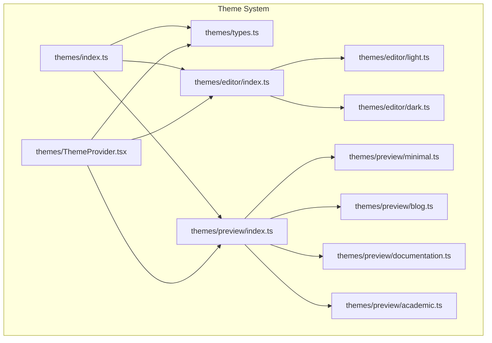
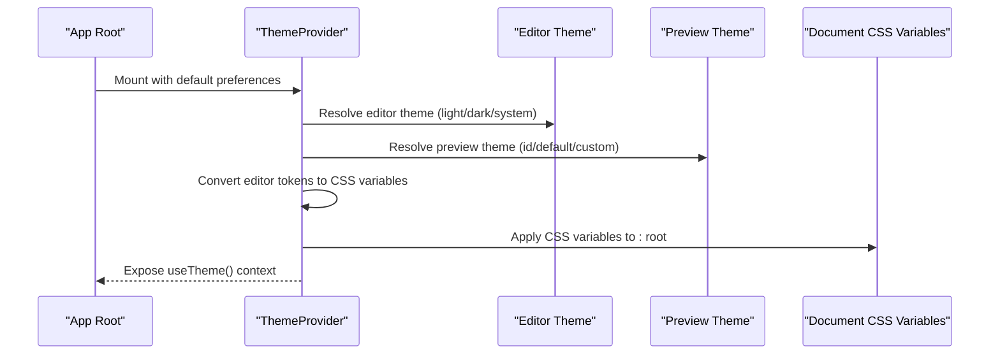
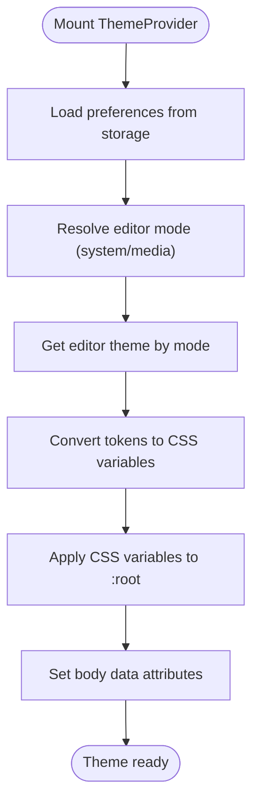
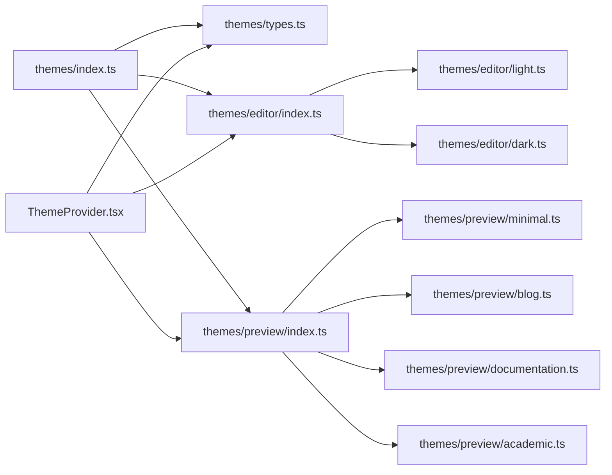

# Theme Tokens and Variables

<cite>
**Referenced Files in This Document**
- [index.ts](file://artoon-typer/src/themes/index.ts)
- [types.ts](file://artoon-typer/src/themes/types.ts)
- [ThemeProvider.tsx](file://artoon-typer/src/themes/ThemeProvider.tsx)
- [index.ts](file://artoon-typer/src/themes/editor/index.ts)
- [light.ts](file://artoon-typer/src/themes/editor/light.ts)
- [dark.ts](file://artoon-typer/src/themes/editor/dark.ts)
- [index.ts](file://artoon-typer/src/themes/preview/index.ts)
- [minimal.ts](file://artoon-typer/src/themes/preview/minimal.ts)
- [blog.ts](file://artoon-typer/src/themes/preview/blog.ts)
- [documentation.ts](file://artoon-typer/src/themes/preview/documentation.ts)
- [academic.ts](file://artoon-typer/src/themes/preview/academic.ts)
</cite>

## Table of Contents
1. [Introduction](#introduction)
2. [Project Structure](#project-structure)
3. [Core Components](#core-components)
4. [Architecture Overview](#architecture-overview)
5. [Detailed Component Analysis](#detailed-component-analysis)
6. [Dependency Analysis](#dependency-analysis)
7. [Performance Considerations](#performance-considerations)
8. [Troubleshooting Guide](#troubleshooting-guide)
9. [Conclusion](#conclusion)
10. [Appendices](#appendices)

## Introduction
This document explains the ARTOON Typer theme token system. It covers the design token architecture (color, typography, spacing, radius, and shadows), naming conventions, value structures, and how tokens are converted to CSS variables and applied across the application. It also provides guidance on creating custom tokens, extending existing token sets, maintaining design consistency across themes, and best practices for theme token management. Finally, it clarifies the relationship between tokens and theme customization.

## Project Structure
The theme system is organized around a dual-theme architecture:
- Editor themes: Light and Dark modes for the editing interface
- Preview themes: Content presentation themes (Minimal, Blog, Documentation, Academic)

Key entry points and modules:
- Theme exports and re-exports for editor and preview themes
- Type definitions for tokens, themes, and CSS variables
- Theme provider that resolves preferences, applies CSS variables, and exposes theme-aware hooks
- Theme-specific token sets for editor and preview

**Diagram sources**
- [index.ts:1-40](file://artoon-typer/src/themes/index.ts#L1-L40)
- [types.ts:1-383](file://artoon-typer/src/themes/types.ts#L1-L383)
- [ThemeProvider.tsx:1-268](file://artoon-typer/src/themes/ThemeProvider.tsx#L1-L268)
- [index.ts:1-20](file://artoon-typer/src/themes/editor/index.ts#L1-L20)
- [light.ts](file://artoon-typer/src/themes/editor/light.ts)
- [dark.ts](file://artoon-typer/src/themes/editor/dark.ts)
- [index.ts:1-39](file://artoon-typer/src/themes/preview/index.ts#L1-L39)
- [minimal.ts](file://artoon-typer/src/themes/preview/minimal.ts)
- [blog.ts](file://artoon-typer/src/themes/preview/blog.ts)
- [documentation.ts](file://artoon-typer/src/themes/preview/documentation.ts)
- [academic.ts](file://artoon-typer/src/themes/preview/academic.ts)

**Section sources**
- [index.ts:1-40](file://artoon-typer/src/themes/index.ts#L1-L40)
- [types.ts:1-383](file://artoon-typer/src/themes/types.ts#L1-L383)

## Core Components
- DesignTokens: The semantic token model that defines color palettes, typography scales, spacing units, corner radii, and shadow presets.
- CSSVariables: A strongly typed mapping of token keys to CSS variable names used to inject runtime values into the document root.
- ThemeProvider: React context provider that manages editor and preview theme state, persists preferences, listens to system changes, converts tokens to CSS variables, and exposes a theme-aware hook.
- Editor themes: Light and dark themes that resolve the active editor theme based on user preference and system setting.
- Preview themes: A collection of content presentation themes with optional component mappings and custom CSS.

**Section sources**
- [types.ts:17-112](file://artoon-typer/src/themes/types.ts#L17-L112)
- [types.ts:243-309](file://artoon-typer/src/themes/types.ts#L243-L309)
- [ThemeProvider.tsx:106-250](file://artoon-typer/src/themes/ThemeProvider.tsx#L106-L250)
- [index.ts:14-19](file://artoon-typer/src/themes/editor/index.ts#L14-L19)
- [index.ts:18-38](file://artoon-typer/src/themes/preview/index.ts#L18-L38)

## Architecture Overview
The theme system follows a design-token-first approach:
- Tokens define semantic values for colors, typography, spacing, radius, and shadows.
- Tokens are converted to CSS variables via a deterministic mapping function.
- The ThemeProvider computes the active editor theme, converts its tokens to CSS variables, and applies them to the document root.
- The provider also manages preview themes and exposes a context for consumers to read and update theme preferences.

**Diagram sources**
- [ThemeProvider.tsx:106-216](file://artoon-typer/src/themes/ThemeProvider.tsx#L106-L216)
- [types.ts:314-382](file://artoon-typer/src/themes/types.ts#L314-L382)
- [index.ts:17-18](file://artoon-typer/src/themes/editor/index.ts#L17-L18)
- [index.ts:163-168](file://artoon-typer/src/themes/preview/index.ts#L163-L168)

## Detailed Component Analysis

### Design Tokens Model
DesignTokens organizes values into:
- Colors: semantic hues (primary, secondary, success, warning, error), text variants (primary, secondary, tertiary, disabled), background variants (primary, secondary, tertiary, hover, active), and border variants (default, hover, focus).
- Typography: font families (heading, body, code), font sizes (xs to 4xl), font weights (normal, medium, semibold, bold), and line heights (tight, normal, relaxed).
- Spacing: units (xs, sm, md, lg, xl, 2xl, 3xl).
- Radius: corner radii (sm, md, lg, full).
- Shadows: preset elevations (sm, md, lg, xl).

Naming conventions:
- Keys use camelCase for nested groups and kebab-case for numeric scale keys (e.g., "2xl", "3xl").
- Values are strings for colors and sizes, and numbers for numeric weights and line heights.

Inheritance patterns:
- There is no explicit inheritance between tokens in the current model. Consumers should reference the appropriate semantic group directly.

Complexity and performance:
- Token conversion to CSS variables is O(n) with n equal to the number of token entries.
- Applying CSS variables to the document root is O(n) per update.

**Section sources**
- [types.ts:17-112](file://artoon-typer/src/themes/types.ts#L17-L112)

### CSS Variables Mapping
tokensToCSSVariables maps DesignTokens to a strongly typed CSSVariables interface. The mapping preserves semantic meaning while standardizing CSS variable names:
- Color tokens map to "--color-*" variables.
- Typography tokens map to "--font-*" and "--font-size-*" variables.
- Spacing, radius, and shadows map to "--spacing-*", "--radius-*", and "--shadow-*" respectively.

This ensures consistent consumption of tokens via CSS custom properties.

**Section sources**
- [types.ts:314-382](file://artoon-typer/src/themes/types.ts#L314-L382)

### ThemeProvider Behavior
Responsibilities:
- Persist and manage editor preference (light, dark, system) and preview theme selection.
- Resolve editor mode from preference and system media query.
- Convert editor tokens to CSS variables and apply them to the document root (:root).
- Add data attributes to the body to reflect the active editor theme and mode.
- Provide a context value for consumers to read and update theme preferences.

System preference listener:
- Subscribes to system color-scheme changes and updates internal state accordingly.

Persistence:
- Uses localStorage to persist preferences under configurable keys.

Error handling:
- Gracefully handles missing or corrupted storage by falling back to defaults and logging warnings.

**Section sources**
- [ThemeProvider.tsx:106-216](file://artoon-typer/src/themes/ThemeProvider.tsx#L106-L216)
- [ThemeProvider.tsx:182-201](file://artoon-typer/src/themes/ThemeProvider.tsx#L182-L201)
- [ThemeProvider.tsx:77-100](file://artoon-typer/src/themes/ThemeProvider.tsx#L77-L100)

### Editor Themes
Resolution:
- The editor theme is resolved from the current mode (light or dark). When preference is "system", the mode follows the system preference.

Exports:
- lightEditorTheme and darkEditorTheme are exported and consumed by getEditorTheme.

Extensibility:
- To add a new editor theme, define a new theme object implementing EditorTheme and export it, then update getEditorTheme to select it based on mode.

**Section sources**
- [index.ts:14-19](file://artoon-typer/src/themes/editor/index.ts#L14-L19)
- [light.ts](file://artoon-typer/src/themes/editor/light.ts)
- [dark.ts](file://artoon-typer/src/themes/editor/dark.ts)

### Preview Themes
Collection and selection:
- previewThemes enumerates available preview themes.
- getPreviewTheme finds a theme by ID.
- defaultPreviewTheme provides a fallback.

Extensibility:
- To add a new preview theme, define a new theme object implementing PreviewTheme (including tokens and optional componentMapping/customCSS), export it, add it to previewThemes, and expose a getter if needed.

**Section sources**
- [index.ts:18-38](file://artoon-typer/src/themes/preview/index.ts#L18-L38)
- [minimal.ts](file://artoon-typer/src/themes/preview/minimal.ts)
- [blog.ts](file://artoon-typer/src/themes/preview/blog.ts)
- [documentation.ts](file://artoon-typer/src/themes/preview/documentation.ts)
- [academic.ts](file://artoon-typer/src/themes/preview/academic.ts)

### Token Application Flow

**Diagram sources**
- [ThemeProvider.tsx:119-137](file://artoon-typer/src/themes/ThemeProvider.tsx#L119-L137)
- [ThemeProvider.tsx:207-216](file://artoon-typer/src/themes/ThemeProvider.tsx#L207-L216)
- [types.ts:314-382](file://artoon-typer/src/themes/types.ts#L314-L382)

## Dependency Analysis
The theme system exhibits clear separation of concerns:
- themes/index.ts re-exports types, token conversion, editor and preview theme collections, and the provider.
- ThemeProvider depends on types.ts for type safety and on editor/preview modules for theme instances.
- Editor and preview index modules depend on their respective theme files.

**Diagram sources**
- [index.ts:1-40](file://artoon-typer/src/themes/index.ts#L1-L40)
- [types.ts:1-383](file://artoon-typer/src/themes/types.ts#L1-L383)
- [ThemeProvider.tsx:1-268](file://artoon-typer/src/themes/ThemeProvider.tsx#L1-L268)
- [index.ts:1-20](file://artoon-typer/src/themes/editor/index.ts#L1-L20)
- [index.ts:1-39](file://artoon-typer/src/themes/preview/index.ts#L1-L39)

**Section sources**
- [index.ts:1-40](file://artoon-typer/src/themes/index.ts#L1-L40)
- [ThemeProvider.tsx:106-250](file://artoon-typer/src/themes/ThemeProvider.tsx#L106-L250)

## Performance Considerations
- CSS variable application is O(n) per update; batching updates (as done here via a single effect) minimizes reflows.
- Using useMemo for derived values (editorMode, editorTheme, previewTheme) avoids unnecessary recalculations.
- Persisting preferences reduces redundant reads from storage and improves startup performance.
- Avoid excessive re-renders by passing memoized callbacks (setEditorPreference, setPreviewTheme) from the provider.

## Troubleshooting Guide
Common issues and resolutions:
- Missing CSS variables: Verify that ThemeProvider is mounted and that tokensToCSSVariables is invoked and applied to the document root.
- Incorrect theme mode: Confirm editor preference resolution and system media query listener are active.
- Persistence failures: Check localStorage availability and permissions; the provider logs warnings on failures and falls back to defaults.
- Preview theme not applying: Ensure the preview theme ID exists in previewThemes or a custom theme is set via setCustomPreviewTheme.

**Section sources**
- [ThemeProvider.tsx:63-72](file://artoon-typer/src/themes/ThemeProvider.tsx#L63-L72)
- [ThemeProvider.tsx:182-201](file://artoon-typer/src/themes/ThemeProvider.tsx#L182-L201)
- [ThemeProvider.tsx:77-100](file://artoon-typer/src/themes/ThemeProvider.tsx#L77-L100)

## Conclusion
The ARTOON Typer theme token system provides a robust, design-token-first foundation for consistent theming across the editor and preview experiences. By centralizing token definitions, converting them to CSS variables, and managing preferences through a provider, the system enables maintainable, extensible themes. Following the naming conventions and patterns outlined here ensures predictable behavior and easy customization.

## Appendices

### Creating Custom Tokens
Steps:
- Define new semantic categories or variants within DesignTokens if needed.
- Add corresponding CSS variables in CSSVariables.
- Extend tokensToCSSVariables to map new tokens to CSS variables.
- Export a new theme object implementing EditorTheme or PreviewTheme with the updated tokens.
- Integrate the new theme into the theme resolution logic (getEditorTheme or previewThemes).

Best practices:
- Keep token names semantic and consistent across themes.
- Prefer numeric values for weights and line heights to simplify CSS usage.
- Group related tokens (e.g., text/background/border) for readability.

**Section sources**
- [types.ts:17-112](file://artoon-typer/src/themes/types.ts#L17-L112)
- [types.ts:243-309](file://artoon-typer/src/themes/types.ts#L243-L309)
- [types.ts:314-382](file://artoon-typer/src/themes/types.ts#L314-L382)

### Extending Existing Token Sets
- For editor themes: add a new theme object and update getEditorTheme to select it based on mode.
- For preview themes: add a new theme object to previewThemes and export it; optionally provide a getter.

Maintaining consistency:
- Reuse tokens across themes to preserve visual coherence.
- Use the same naming conventions and value types to avoid mismatches.

**Section sources**
- [index.ts:14-19](file://artoon-typer/src/themes/editor/index.ts#L14-L19)
- [index.ts:18-38](file://artoon-typer/src/themes/preview/index.ts#L18-L38)

### Accessibility Considerations
- Ensure sufficient color contrast ratios for text and interactive elements against backgrounds.
- Provide adequate spacing for readable line lengths and comfortable reading.
- Use consistent typography scales and line heights to improve readability.
- Test themes across light and dark modes to verify legibility.

### Token Documentation Standards
- Document each token’s semantic meaning, intended use, and acceptable values.
- Maintain a changelog for token modifications to track breaking changes.
- Provide examples of CSS usage and component integration.

### Relationship Between Tokens and Theme Customization
- Tokens define the palette and scales; themes compose tokens into coherent experiences.
- Custom themes should reference tokens rather than hardcoding values to preserve consistency and ease of maintenance.