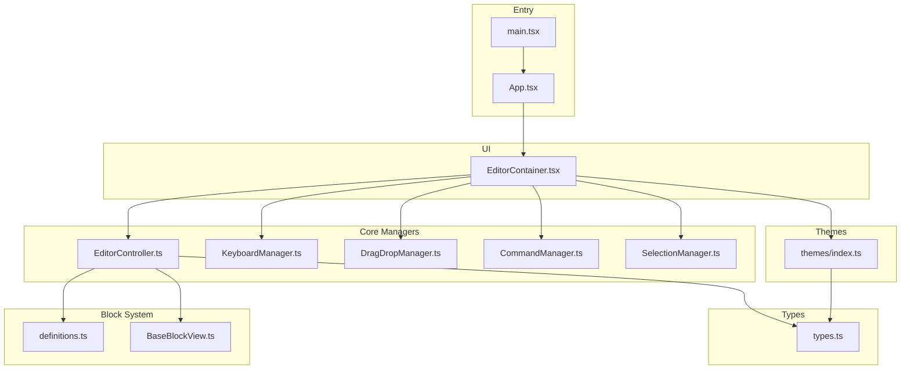
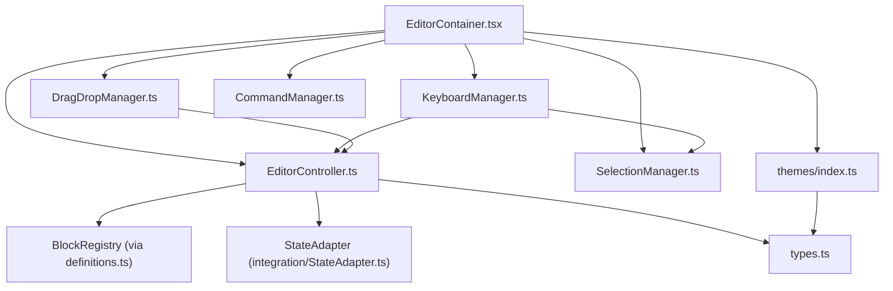
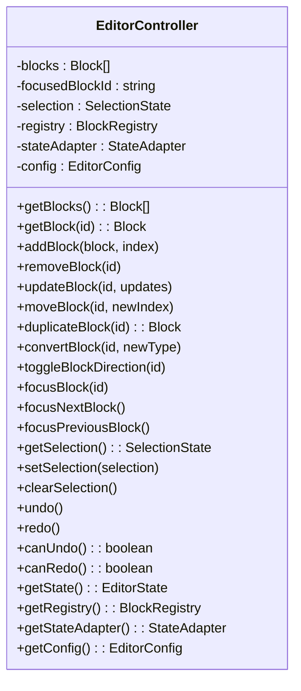
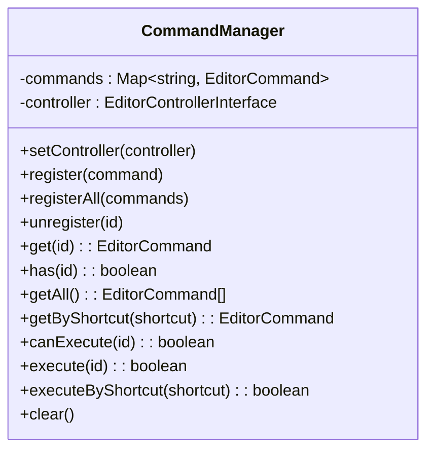
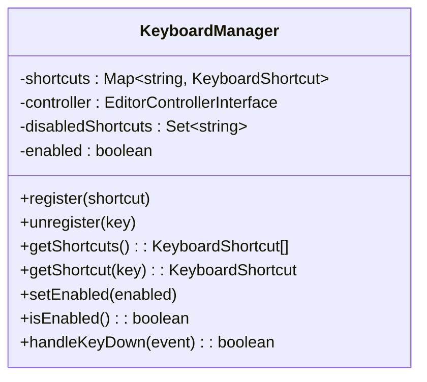
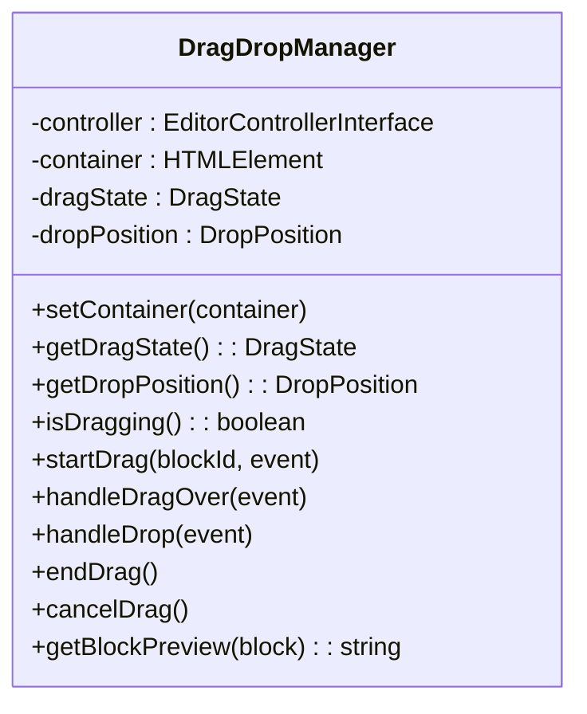
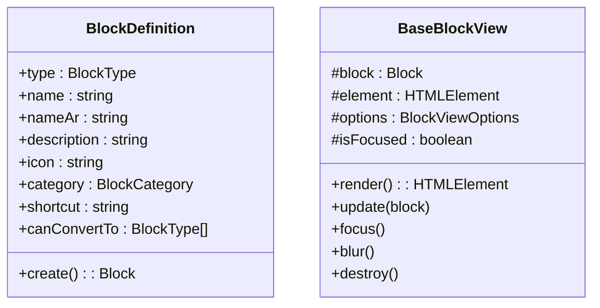
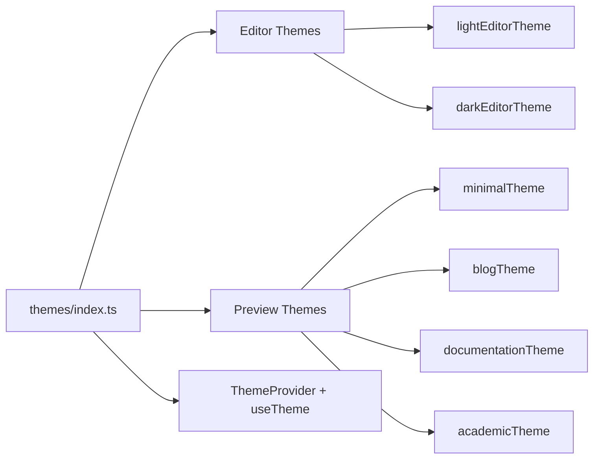
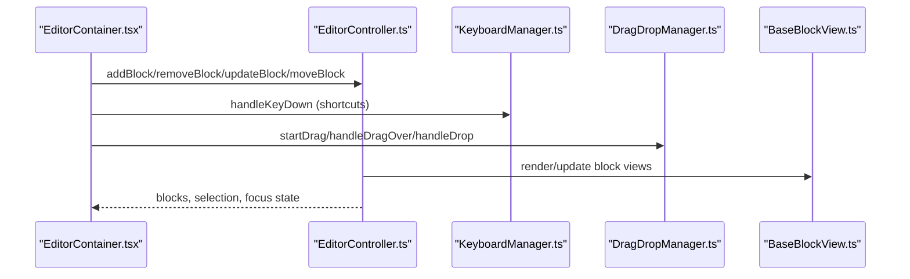
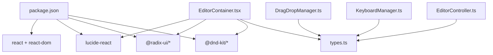

# Typer Editor Package

<cite>
**Referenced Files in This Document**
- [package.json](file://artoon-typer/package.json)
- [index.ts](file://artoon-typer/src/index.ts)
- [App.tsx](file://artoon-typer/src/App.tsx)
- [main.tsx](file://artoon-typer/src/main.tsx)
- [EditorController.ts](file://artoon-typer/src/core/EditorController.ts)
- [CommandManager.ts](file://artoon-typer/src/core/CommandManager.ts)
- [KeyboardManager.ts](file://artoon-typer/src/core/KeyboardManager.ts)
- [SelectionManager.ts](file://artoon-typer/src/core/SelectionManager.ts)
- [DragDropManager.ts](file://artoon-typer/src/core/DragDropManager.ts)
- [definitions.ts](file://artoon-typer/src/blocks/definitions.ts)
- [BaseBlockView.ts](file://artoon-typer/src/blocks/views/BaseBlockView.ts)
- [EditorContainer.tsx](file://artoon-typer/src/ui/components/EditorContainer.tsx)
- [index.ts (themes)](file://artoon-typer/src/themes/index.ts)
- [types.ts](file://artoon-typer/src/types.ts)
</cite>

## Table of Contents
1. [Introduction](#introduction)
2. [Project Structure](#project-structure)
3. [Core Components](#core-components)
4. [Architecture Overview](#architecture-overview)
5. [Detailed Component Analysis](#detailed-component-analysis)
6. [Dependency Analysis](#dependency-analysis)
7. [Performance Considerations](#performance-considerations)
8. [Troubleshooting Guide](#troubleshooting-guide)
9. [Conclusion](#conclusion)
10. [Appendices](#appendices)

## Introduction
The ARTOON-TYPER package is a React-based, block-oriented rich text editor tailored for the ARTOON format. It emphasizes native RTL support, a dual theme system (editor interface and content preview), and a modular architecture centered around a core set of managers: EditorController, CommandManager, KeyboardManager, SelectionManager, and DragDropManager. The system integrates tightly with the ARTOON AST for inline semantics and supports a comprehensive block registry and a design system-driven UI.

## Project Structure
The package is organized into cohesive layers:
- Core managers: EditorController, CommandManager, KeyboardManager, SelectionManager, DragDropManager
- Block system: definitions and view abstractions
- UI components: EditorContainer and related React components
- Themes: dual theme system exports
- Types: shared type definitions and AST integration
- Entry points: index.ts exports, App.tsx demo, and main.tsx bootstrapping



**Diagram sources**
- [main.tsx:1-22](file://artoon-typer/src/main.tsx#L1-L22)
- [App.tsx:1-475](file://artoon-typer/src/App.tsx#L1-L475)
- [EditorController.ts:1-475](file://artoon-typer/src/core/EditorController.ts#L1-L475)
- [CommandManager.ts:1-304](file://artoon-typer/src/core/CommandManager.ts#L1-L304)
- [KeyboardManager.ts:1-680](file://artoon-typer/src/core/KeyboardManager.ts#L1-L680)
- [SelectionManager.ts:1-322](file://artoon-typer/src/core/SelectionManager.ts#L1-L322)
- [DragDropManager.ts:1-328](file://artoon-typer/src/core/DragDropManager.ts#L1-L328)
- [definitions.ts:1-589](file://artoon-typer/src/blocks/definitions.ts#L1-L589)
- [BaseBlockView.ts:1-205](file://artoon-typer/src/blocks/views/BaseBlockView.ts#L1-L205)
- [EditorContainer.tsx:1-387](file://artoon-typer/src/ui/components/EditorContainer.tsx#L1-L387)
- [index.ts (themes):1-40](file://artoon-typer/src/themes/index.ts#L1-L40)
- [types.ts:1-654](file://artoon-typer/src/types.ts#L1-L654)

**Section sources**
- [package.json:1-66](file://artoon-typer/package.json#L1-L66)
- [index.ts:1-270](file://artoon-typer/src/index.ts#L1-L270)
- [main.tsx:1-22](file://artoon-typer/src/main.tsx#L1-L22)
- [App.tsx:1-475](file://artoon-typer/src/App.tsx#L1-L475)

## Core Components
This section outlines the central managers and their responsibilities:
- EditorController: orchestrates blocks, selection, focus, history, and events; coordinates with StateAdapter and BlockRegistry
- CommandManager: registers and executes commands; includes built-in commands for undo/redo and block operations
- KeyboardManager: handles keyboard shortcuts with context-aware activation; delegates actions to controller and selection manager
- SelectionManager: resolves DOM selections to block offsets and vice versa; supports list and table context
- DragDropManager: manages drag-and-drop reordering via @dnd-kit; calculates drop positions and updates controller

Key integration points:
- EditorController depends on BlockRegistry and StateAdapter for block lifecycle and history
- EditorContainer composes these managers and exposes them to UI components
- KeyboardManager relies on SelectionManager and MarkManager for inline operations
- DragDropManager integrates with @dnd-kit for smooth UX

**Section sources**
- [EditorController.ts:1-475](file://artoon-typer/src/core/EditorController.ts#L1-L475)
- [CommandManager.ts:1-304](file://artoon-typer/src/core/CommandManager.ts#L1-L304)
- [KeyboardManager.ts:1-680](file://artoon-typer/src/core/KeyboardManager.ts#L1-L680)
- [SelectionManager.ts:1-322](file://artoon-typer/src/core/SelectionManager.ts#L1-L322)
- [DragDropManager.ts:1-328](file://artoon-typer/src/core/DragDropManager.ts#L1-L328)

## Architecture Overview
The editor follows a layered architecture:
- Presentation Layer: React components (EditorContainer, menus, toolbars)
- Control Layer: EditorController and managers coordinating behavior
- Data Layer: Block registry, state adapter, and AST-compatible inline content
- Integration Layer: ARTOON importer/exporter adapters and renderer bridges



**Diagram sources**
- [EditorContainer.tsx:1-387](file://artoon-typer/src/ui/components/EditorContainer.tsx#L1-L387)
- [EditorController.ts:1-475](file://artoon-typer/src/core/EditorController.ts#L1-L475)
- [KeyboardManager.ts:1-680](file://artoon-typer/src/core/KeyboardManager.ts#L1-L680)
- [SelectionManager.ts:1-322](file://artoon-typer/src/core/SelectionManager.ts#L1-L322)
- [DragDropManager.ts:1-328](file://artoon-typer/src/core/DragDropManager.ts#L1-L328)
- [definitions.ts:1-589](file://artoon-typer/src/blocks/definitions.ts#L1-L589)
- [index.ts (themes):1-40](file://artoon-typer/src/themes/index.ts#L1-L40)
- [types.ts:1-654](file://artoon-typer/src/types.ts#L1-L654)

## Detailed Component Analysis

### EditorController
Responsibilities:
- Manage block collection, focus, and selection
- Provide CRUD operations and block conversion
- Integrate with StateAdapter for history and onChange callbacks
- Emit block events to subscribers

Notable behaviors:
- Converts blocks with cross-type mapping (e.g., text ↔ list)
- Ensures at least one block remains after removal
- Preserves direction and id during conversion



**Diagram sources**
- [EditorController.ts:1-475](file://artoon-typer/src/core/EditorController.ts#L1-L475)

**Section sources**
- [EditorController.ts:1-475](file://artoon-typer/src/core/EditorController.ts#L1-L475)

### CommandManager
Responsibilities:
- Centralized command registration and execution
- Built-in commands for undo/redo, block duplication/move, and direction toggle
- Validation via canExecute checks



**Diagram sources**
- [CommandManager.ts:1-304](file://artoon-typer/src/core/CommandManager.ts#L1-L304)

**Section sources**
- [CommandManager.ts:1-304](file://artoon-typer/src/core/CommandManager.ts#L1-L304)

### KeyboardManager
Responsibilities:
- Define keyboard shortcuts with contextual activation
- Handle formatting, block conversion, splitting/merging, and block operations
- Normalize keys and evaluate context (selection presence, block boundaries, list/table contexts)



**Diagram sources**
- [KeyboardManager.ts:1-680](file://artoon-typer/src/core/KeyboardManager.ts#L1-L680)

**Section sources**
- [KeyboardManager.ts:1-680](file://artoon-typer/src/core/KeyboardManager.ts#L1-L680)

### SelectionManager
Responsibilities:
- Resolve DOM selection to block offsets and manage cursor positions
- Set programmatic selections and clear them
- Locate list items and table cells within a block for precise operations

```mermaid
classDiagram
class SelectionManager {
-currentSelection : TextSelection
+getSelection() : TextSelection
+setSelection(blockId, from, to)
+hasSelection() : boolean
+clearSelection()
+getLastSelection() : TextSelection
+findListItemIndex(blockId) : number
+findTableCellIndex(blockId) : {rowIndex, cellIndex}
}
```

**Diagram sources**
- [SelectionManager.ts:1-322](file://artoon-typer/src/core/SelectionManager.ts#L1-L322)

**Section sources**
- [SelectionManager.ts:1-322](file://artoon-typer/src/core/SelectionManager.ts#L1-L322)

### DragDropManager
Responsibilities:
- Track drag state and compute drop positions
- Integrate with @dnd-kit for pointer and keyboard sensors
- Update controller on drop and provide drag previews



**Diagram sources**
- [DragDropManager.ts:1-328](file://artoon-typer/src/core/DragDropManager.ts#L1-L328)

**Section sources**
- [DragDropManager.ts:1-328](file://artoon-typer/src/core/DragDropManager.ts#L1-L328)

### Block Registry and View Components
- Block definitions: comprehensive catalog of built-in block types with categories, shortcuts, and conversion capabilities
- BaseBlockView: abstract base for block views handling direction, focus, and DOM wrappers



**Diagram sources**
- [definitions.ts:1-589](file://artoon-typer/src/blocks/definitions.ts#L1-L589)
- [BaseBlockView.ts:1-205](file://artoon-typer/src/blocks/views/BaseBlockView.ts#L1-L205)

**Section sources**
- [definitions.ts:1-589](file://artoon-typer/src/blocks/definitions.ts#L1-L589)
- [BaseBlockView.ts:1-205](file://artoon-typer/src/blocks/views/BaseBlockView.ts#L1-L205)

### Theme System and Dual Modes
The theme system provides:
- Editor themes: light/dark mode for the editor interface
- Preview themes: content presentation themes (minimal, blog, documentation, academic)
- Provider and hook for theme preferences and preview theme selection



**Diagram sources**
- [index.ts (themes):1-40](file://artoon-typer/src/themes/index.ts#L1-L40)

**Section sources**
- [index.ts (themes):1-40](file://artoon-typer/src/themes/index.ts#L1-L40)

### UI Component Library and Rendering Pipeline
- EditorContainer composes menus, toolbars, and block rendering; integrates @dnd-kit for drag-and-drop
- Menus and toolbars are controlled via state managed by EditorContainer and exposed hooks
- Rendering pipeline leverages block views and inline content compatible with ARTOON AST



**Diagram sources**
- [EditorContainer.tsx:1-387](file://artoon-typer/src/ui/components/EditorContainer.tsx#L1-L387)
- [EditorController.ts:1-475](file://artoon-typer/src/core/EditorController.ts#L1-L475)
- [KeyboardManager.ts:1-680](file://artoon-typer/src/core/KeyboardManager.ts#L1-L680)
- [DragDropManager.ts:1-328](file://artoon-typer/src/core/DragDropManager.ts#L1-L328)
- [BaseBlockView.ts:1-205](file://artoon-typer/src/blocks/views/BaseBlockView.ts#L1-L205)

**Section sources**
- [EditorContainer.tsx:1-387](file://artoon-typer/src/ui/components/EditorContainer.tsx#L1-L387)

## Dependency Analysis
External dependencies include @dnd-kit for drag-and-drop, Radix UI components for dialogs and popovers, and Lucide React for icons. Internally, the editor integrates with ARTOON AST types for inline content and uses a state adapter for history.



**Diagram sources**
- [package.json:1-66](file://artoon-typer/package.json#L1-L66)
- [EditorController.ts:1-475](file://artoon-typer/src/core/EditorController.ts#L1-L475)
- [KeyboardManager.ts:1-680](file://artoon-typer/src/core/KeyboardManager.ts#L1-L680)
- [DragDropManager.ts:1-328](file://artoon-typer/src/core/DragDropManager.ts#L1-L328)
- [EditorContainer.tsx:1-387](file://artoon-typer/src/ui/components/EditorContainer.tsx#L1-L387)
- [types.ts:1-654](file://artoon-typer/src/types.ts#L1-L654)

**Section sources**
- [package.json:1-66](file://artoon-typer/package.json#L1-L66)

## Performance Considerations
- Minimize re-renders by leveraging memoization in EditorContainer and block rendering
- Use @dnd-kit’s optimized sensors and drop animation side effects
- Keep inline content structures shallow to reduce traversal costs
- Debounce heavy operations like content parsing and theme switching
- Prefer immutable updates and batch block operations when possible

## Troubleshooting Guide
Common issues and resolutions:
- Keyboard shortcuts not firing: verify KeyboardManager.isEnabled and context checks; confirm shortcuts are not disabled
- Drag-and-drop misalignment: ensure container bounding boxes are accurate and adjust drop position calculations
- Selection errors: validate SelectionManager offsets and element boundaries; confirm block elements carry data-block-id
- History not updating: ensure StateAdapter.applyBlocks is invoked after block mutations
- Theme inconsistencies: verify ThemeProvider props and CSS variable application

**Section sources**
- [KeyboardManager.ts:1-680](file://artoon-typer/src/core/KeyboardManager.ts#L1-L680)
- [DragDropManager.ts:1-328](file://artoon-typer/src/core/DragDropManager.ts#L1-L328)
- [SelectionManager.ts:1-322](file://artoon-typer/src/core/SelectionManager.ts#L1-L322)
- [EditorController.ts:1-475](file://artoon-typer/src/core/EditorController.ts#L1-L475)
- [index.ts (themes):1-40](file://artoon-typer/src/themes/index.ts#L1-L40)

## Conclusion
AROON-TYPER delivers a robust, extensible block editor with a strong foundation in React and TypeScript. Its dual theme system, comprehensive block registry, and integrated managers enable rich editing experiences with native RTL support. The architecture supports extension through custom blocks, commands, and themes, while maintaining compatibility with the ARTOON AST for seamless import/export and rendering.

## Appendices

### Examples and Integration Patterns
- Custom block development:
  - Define a BlockDefinition with create and canConvertTo fields
  - Implement a view class extending BaseBlockView
  - Register the definition via EditorController’s registry
  - Reference: [definitions.ts:1-589](file://artoon-typer/src/blocks/definitions.ts#L1-L589), [BaseBlockView.ts:1-205](file://artoon-typer/src/blocks/views/BaseBlockView.ts#L1-L205)

- Theme creation:
  - Extend preview themes or define editor themes using tokens
  - Use ThemeProvider to set defaults and expose useTheme for consumers
  - Reference: [index.ts (themes):1-40](file://artoon-typer/src/themes/index.ts#L1-L40)

- Editor integration:
  - Mount App or EditorContainer with initial content or blocks
  - Configure default direction, theme, and read-only mode
  - Reference: [App.tsx:1-475](file://artoon-typer/src/App.tsx#L1-L475), [EditorContainer.tsx:1-387](file://artoon-typer/src/ui/components/EditorContainer.tsx#L1-L387)

- State management and rendering pipeline:
  - Use EditorController.getState and onChange for external state synchronization
  - Leverage inline content types from @artoon/ast for formatting
  - Reference: [types.ts:1-654](file://artoon-typer/src/types.ts#L1-L654), [EditorController.ts:1-475](file://artoon-typer/src/core/EditorController.ts#L1-L475)