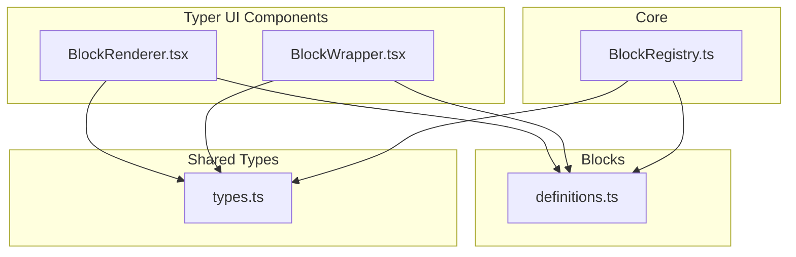
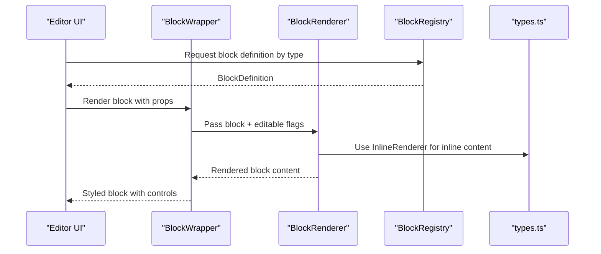
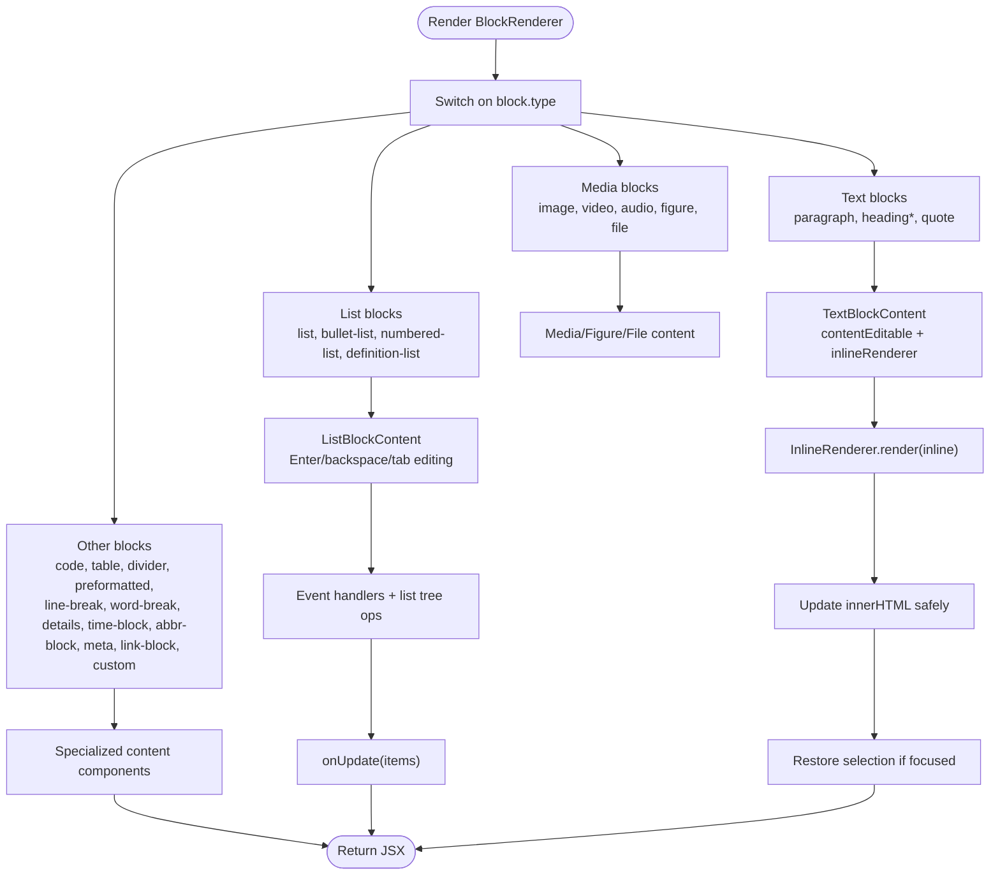
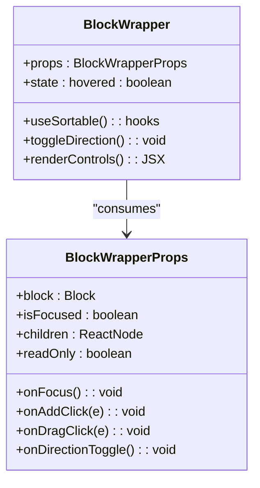
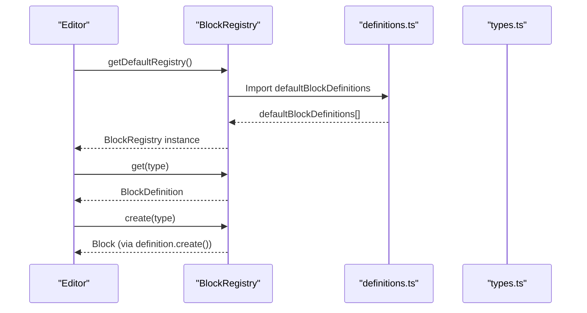
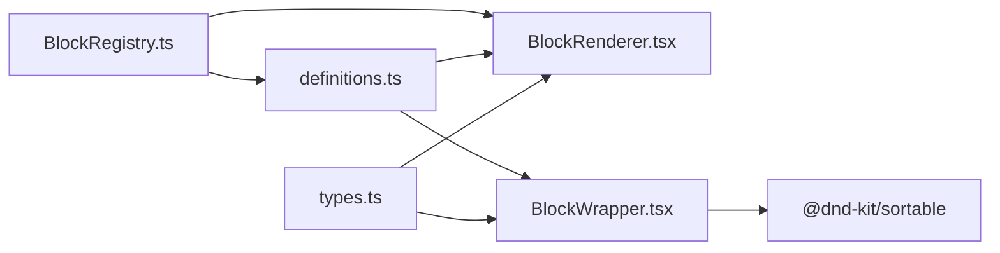

# Block Rendering Components

<cite>
**Referenced Files in This Document**
- [BlockRenderer.tsx](file://artoon-typer/src/ui/components/BlockRenderer.tsx)
- [BlockWrapper.tsx](file://artoon-typer/src/ui/components/BlockWrapper.tsx)
- [BlockRegistry.ts](file://artoon-typer/src/core/BlockRegistry.ts)
- [definitions.ts](file://artoon-typer/src/blocks/definitions.ts)
- [types.ts](file://artoon-typer/src/types.ts)
- [BlockRenderer.test.ts](file://artoon-typer/tests/ui/BlockRenderer.test.ts)
- [BlockWrapper.test.ts](file://artoon-typer/tests/ui/BlockWrapper.test.ts)
</cite>

## Table of Contents
1. [Introduction](#introduction)
2. [Project Structure](#project-structure)
3. [Core Components](#core-components)
4. [Architecture Overview](#architecture-overview)
5. [Detailed Component Analysis](#detailed-component-analysis)
6. [Dependency Analysis](#dependency-analysis)
7. [Performance Considerations](#performance-considerations)
8. [Troubleshooting Guide](#troubleshooting-guide)
9. [Conclusion](#conclusion)

## Introduction
This document explains the ARTOON Typer block rendering system with a focus on two core UI components:
- BlockRenderer: Converts AST-backed block data into React elements and manages inline content rendering and editing for each block type.
- BlockWrapper: Provides block-level styling, focus management, direction toggling, and integrates drag-and-drop reordering.

It covers the rendering pipeline, node-to-component mapping, dynamic component loading, performance optimizations, styling approaches, focus and selection handling, and integration with the block registry. Practical examples and debugging techniques are included for custom block rendering and wrapper customization.

## Project Structure
The rendering system lives under the Typer UI components module and integrates with the core registry and shared types.

**Diagram sources**
- [BlockRenderer.tsx:1-213](file://artoon-typer/src/ui/components/BlockRenderer.tsx#L1-L213)
- [BlockWrapper.tsx:1-177](file://artoon-typer/src/ui/components/BlockWrapper.tsx#L1-L177)
- [BlockRegistry.ts:1-174](file://artoon-typer/src/core/BlockRegistry.ts#L1-L174)
- [definitions.ts:1-589](file://artoon-typer/src/blocks/definitions.ts#L1-L589)
- [types.ts:1-654](file://artoon-typer/src/types.ts#L1-L654)

**Section sources**
- [BlockRenderer.tsx:1-213](file://artoon-typer/src/ui/components/BlockRenderer.tsx#L1-L213)
- [BlockWrapper.tsx:1-177](file://artoon-typer/src/ui/components/BlockWrapper.tsx#L1-L177)
- [BlockRegistry.ts:1-174](file://artoon-typer/src/core/BlockRegistry.ts#L1-L174)
- [definitions.ts:1-589](file://artoon-typer/src/blocks/definitions.ts#L1-L589)
- [types.ts:1-654](file://artoon-typer/src/types.ts#L1-L654)

## Core Components
- BlockRenderer: A switch-based renderer that maps each block type to a specialized content component. It handles inline content rendering via InlineRenderer, manages contentEditable for text-like blocks, and coordinates list editing behaviors.
- BlockWrapper: A wrapper that adds block controls (drag handle, direction toggle, add button), applies focus/focused states, and integrates with @dnd-kit for drag-and-drop reordering.

Key responsibilities:
- BlockRenderer
  - Type dispatch to specialized content components
  - Inline content rendering and updates
  - Editing lifecycle for text and code blocks
  - List editing (Enter/backspace/tab navigation, splitting, merging)
- BlockWrapper
  - Hover/focus states and control visibility
  - Direction toggling and text direction propagation
  - Drag handle integration via useSortable
  - Read-only gating and accessibility attributes

**Section sources**
- [BlockRenderer.tsx:51-213](file://artoon-typer/src/ui/components/BlockRenderer.tsx#L51-L213)
- [BlockWrapper.tsx:33-177](file://artoon-typer/src/ui/components/BlockWrapper.tsx#L33-L177)

## Architecture Overview
The rendering pipeline connects block definitions, the registry, and UI components.

**Diagram sources**
- [BlockRenderer.tsx:48-49](file://artoon-typer/src/ui/components/BlockRenderer.tsx#L48-L49)
- [BlockWrapper.tsx:33-177](file://artoon-typer/src/ui/components/BlockWrapper.tsx#L33-L177)
- [BlockRegistry.ts:159-166](file://artoon-typer/src/core/BlockRegistry.ts#L159-L166)
- [types.ts:10-18](file://artoon-typer/src/types.ts#L10-L18)

## Detailed Component Analysis

### BlockRenderer: Rendering Pipeline and Node-to-Component Mapping
BlockRenderer performs a type-driven dispatch to specialized content components. It leverages InlineRenderer to convert inline content arrays into HTML for text-like blocks and manages editing events.

Rendering highlights:
- Inline content rendering: Uses a shared InlineRenderer instance to produce HTML for text-like blocks and injects it into contentEditable containers.
- Selection preservation: Temporarily disables input handlers during innerHTML updates and restores selection offsets when the element regains focus.
- List editing: Implements Enter/backspace splitting, double Enter exit behavior, Tab/Shift+Tab indentation, smart arrow navigation, and context menu actions for changing list types per item.
- Code block editing: Provides language selection, copy-to-clipboard, and Tab indentation support.

Performance optimizations:
- Conditional innerHTML updates: Only re-render when the computed HTML differs from the current content.
- Minimal reflows: Uses refs and direct DOM manipulation for inline content updates.
- Event handler memoization: Uses useCallback for input and key handlers to avoid unnecessary re-renders.

**Diagram sources**
- [BlockRenderer.tsx:51-213](file://artoon-typer/src/ui/components/BlockRenderer.tsx#L51-L213)
- [BlockRenderer.tsx:224-336](file://artoon-typer/src/ui/components/BlockRenderer.tsx#L224-L336)
- [BlockRenderer.tsx:350-698](file://artoon-typer/src/ui/components/BlockRenderer.tsx#L350-L698)
- [BlockRenderer.tsx:709-784](file://artoon-typer/src/ui/components/BlockRenderer.tsx#L709-L784)

**Section sources**
- [BlockRenderer.tsx:48-213](file://artoon-typer/src/ui/components/BlockRenderer.tsx#L48-L213)
- [BlockRenderer.tsx:224-336](file://artoon-typer/src/ui/components/BlockRenderer.tsx#L224-L336)
- [BlockRenderer.tsx:350-698](file://artoon-typer/src/ui/components/BlockRenderer.tsx#L350-L698)
- [BlockRenderer.tsx:709-784](file://artoon-typer/src/ui/components/BlockRenderer.tsx#L709-L784)

### BlockWrapper: Styling, Focus States, and Drag-and-Drop
BlockWrapper encapsulates block-level presentation and interactions. It applies directional styling, focus states, and integrates with @dnd-kit for smooth drag-and-drop reordering.

Focus and selection handling:
- Focus state: Adds focused classes when the block is focused, enabling visual feedback and control visibility.
- Control visibility: Controls fade in on hover, focus, or drag, controlled by opacity transitions.
- Direction handling: Applies RTL/LTR directionality and exposes a direction toggle action.

Drag-and-drop integration:
- Uses useSortable from @dnd-kit to enable draggable reordering.
- Applies smooth transforms and shadows during drag, with reduced opacity for ghost effect.
- Disables dragging in read-only mode and sets appropriate cursor states.

Accessibility:
- Proper aria-labels and titles for controls.
- Disabled states for read-only contexts.

**Diagram sources**
- [BlockWrapper.tsx:33-177](file://artoon-typer/src/ui/components/BlockWrapper.tsx#L33-L177)

**Section sources**
- [BlockWrapper.tsx:33-177](file://artoon-typer/src/ui/components/BlockWrapper.tsx#L33-L177)

### Integration with the Block Registry and Definitions
The rendering system relies on BlockRegistry and definitions to resolve block capabilities and metadata.

Key behaviors:
- Automatic registration of default block definitions on first access.
- Lookup by type, category, and slash menu items.
- Convertible types for block conversion workflows.

**Diagram sources**
- [BlockRegistry.ts:159-166](file://artoon-typer/src/core/BlockRegistry.ts#L159-L166)
- [BlockRegistry.ts:149-150](file://artoon-typer/src/core/BlockRegistry.ts#L149-L150)
- [definitions.ts:539-589](file://artoon-typer/src/blocks/definitions.ts#L539-L589)

**Section sources**
- [BlockRegistry.ts:159-166](file://artoon-typer/src/core/BlockRegistry.ts#L159-L166)
- [BlockRegistry.ts:149-150](file://artoon-typer/src/core/BlockRegistry.ts#L149-L150)
- [definitions.ts:539-589](file://artoon-typer/src/blocks/definitions.ts#L539-L589)

## Dependency Analysis
The rendering system depends on shared types, inline rendering utilities, and block definitions. BlockWrapper depends on @dnd-kit for drag-and-drop.

**Diagram sources**
- [BlockRenderer.tsx:8-18](file://artoon-typer/src/ui/components/BlockRenderer.tsx#L8-L18)
- [BlockWrapper.tsx:8-11](file://artoon-typer/src/ui/components/BlockWrapper.tsx#L8-L11)
- [BlockRegistry.ts:149-150](file://artoon-typer/src/core/BlockRegistry.ts#L149-L150)
- [definitions.ts:1-29](file://artoon-typer/src/blocks/definitions.ts#L1-L29)
- [types.ts:10-18](file://artoon-typer/src/types.ts#L10-L18)

**Section sources**
- [BlockRenderer.tsx:8-18](file://artoon-typer/src/ui/components/BlockRenderer.tsx#L8-L18)
- [BlockWrapper.tsx:8-11](file://artoon-typer/src/ui/components/BlockWrapper.tsx#L8-L11)
- [BlockRegistry.ts:149-150](file://artoon-typer/src/core/BlockRegistry.ts#L149-L150)
- [definitions.ts:1-29](file://artoon-typer/src/blocks/definitions.ts#L1-L29)
- [types.ts:10-18](file://artoon-typer/src/types.ts#L10-L18)

## Performance Considerations
- Inline content updates
  - Avoid unnecessary DOM writes by comparing computed HTML before updating innerHTML.
  - Temporarily disable input handlers during updates to prevent re-parsing loops.
  - Restore selection precisely after updates to maintain typing continuity.
- List editing
  - Use immutable-like transformations via helper functions to compute updated item trees efficiently.
  - Debounce or guard rapid Enter presses to avoid accidental splits.
- Drag-and-drop
  - Apply CSS transforms and transitions for smooth animations; avoid heavy computations in drag handlers.
  - Disable dragging in read-only mode to prevent unnecessary overhead.
- Rendering boundaries
  - Keep contentEditable areas minimal and scoped to inline content to reduce reconciliation costs.
  - Prefer direct DOM manipulation for inline content updates rather than full component re-renders.

[No sources needed since this section provides general guidance]

## Troubleshooting Guide
Common rendering issues and debugging techniques:

- Inline content not updating
  - Verify that the block’s inline content array is being passed correctly to InlineRenderer.
  - Check that the contentEditable div’s innerHTML is being updated only when the computed HTML changes.
  - Confirm selection restoration logic runs when the element regains focus.

- List editing anomalies
  - Ensure list tree operations are applied consistently and that item IDs are stable.
  - Validate Enter/backspace shortcuts and Tab/Shift+Tab indentation logic.
  - Test double Enter exit behavior and splitting logic around caret positions.

- Drag-and-drop not working
  - Confirm that useSortable is attached to the wrapper’s ref and that the block ID is unique.
  - Check read-only mode disabling dragging and cursor states.
  - Inspect transform and shadow styles applied during drag.

- Focus and control visibility
  - Ensure isFocused prop is correctly propagated and that hover/focus states toggle control opacity.
  - Verify direction toggle updates block direction and reflects in UI.

- Tests to consult
  - UI component tests for BlockRenderer and BlockWrapper provide coverage of rendering, editing, and interaction flows.

**Section sources**
- [BlockRenderer.test.ts](file://artoon-typer/tests/ui/BlockRenderer.test.ts)
- [BlockWrapper.test.ts](file://artoon-typer/tests/ui/BlockWrapper.test.ts)

## Conclusion
The ARTOON Typer block rendering system cleanly separates concerns between block-level wrappers and content-specific renderers. BlockRenderer focuses on accurate inline content rendering and editing behaviors, while BlockWrapper manages styling, focus, direction, and drag-and-drop. Together with the BlockRegistry and definitions, they form a robust, extensible rendering pipeline suitable for custom block development and advanced editing scenarios.