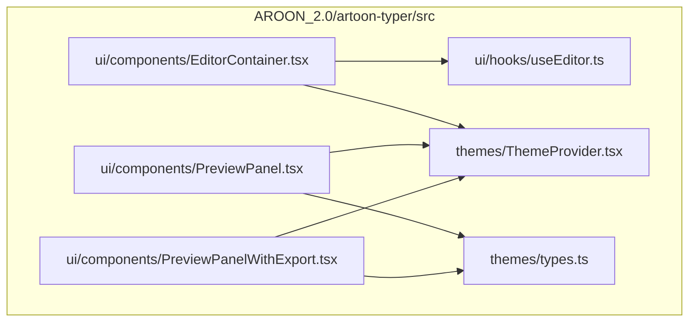
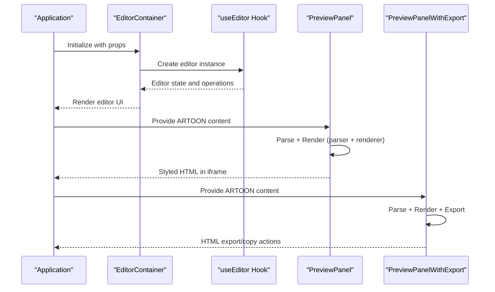
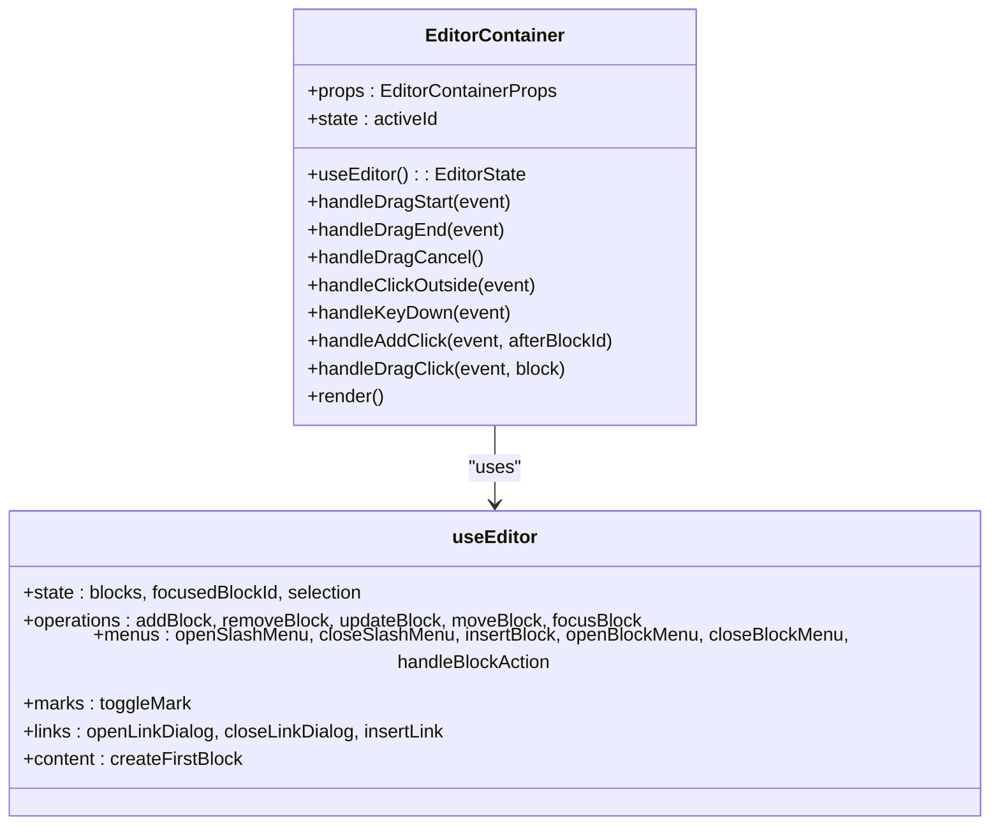
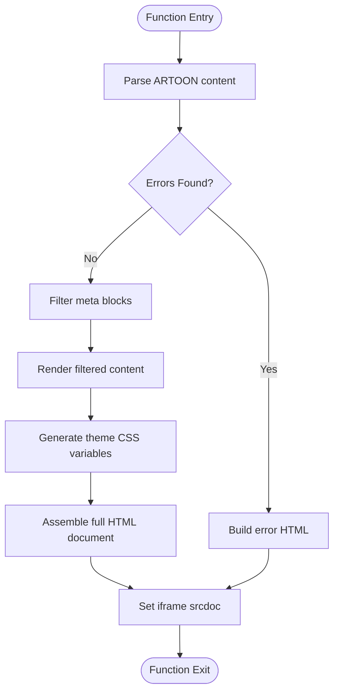
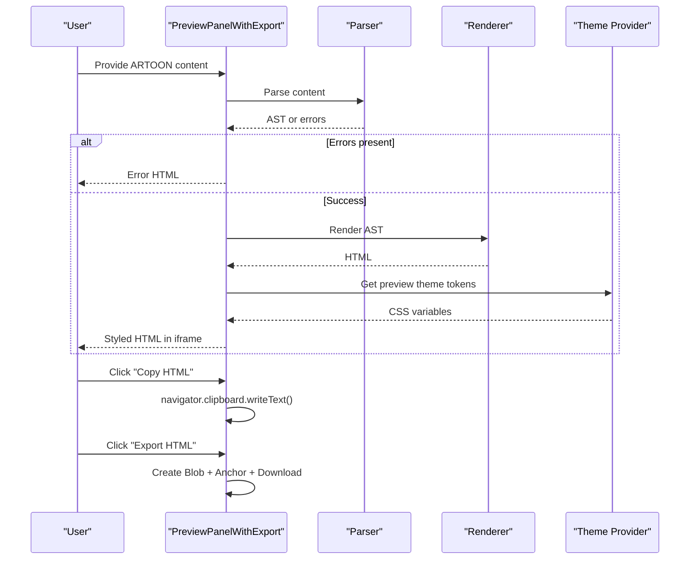
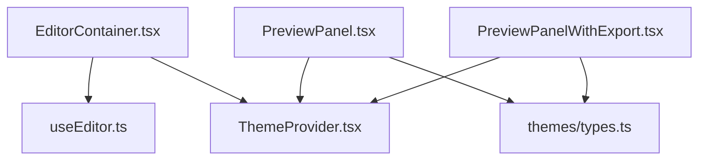

# Container Components

<cite>
**Referenced Files in This Document**
- [EditorContainer.tsx](file://artoon-typer/src/ui/components/EditorContainer.tsx)
- [PreviewPanel.tsx](file://artoon-typer/src/ui/components/PreviewPanel.tsx)
- [PreviewPanelWithExport.tsx](file://artoon-typer/src/ui/components/PreviewPanelWithExport.tsx)
- [useEditor.ts](file://artoon-typer/src/ui/hooks/useEditor.ts)
- [ThemeProvider.tsx](file://artoon-typer/src/themes/ThemeProvider.tsx)
- [tokensToCSSVariables.ts](file://artoon-typer/src/themes/types.ts)
- [EditorContainer.test.ts](file://artoon-typer/tests/ui/EditorContainer.test.ts)
</cite>

## Table of Contents
1. [Introduction](#introduction)
2. [Project Structure](#project-structure)
3. [Core Components](#core-components)
4. [Architecture Overview](#architecture-overview)
5. [Detailed Component Analysis](#detailed-component-analysis)
6. [Dependency Analysis](#dependency-analysis)
7. [Performance Considerations](#performance-considerations)
8. [Troubleshooting Guide](#troubleshooting-guide)
9. [Conclusion](#conclusion)

## Introduction
This document provides comprehensive technical documentation for the ARTOON Typer container components, focusing on the EditorContainer as the main application wrapper and the PreviewPanel family for document rendering and display modes. It explains component initialization, configuration options, state management, event handling, styling approaches, and integration with the broader editor architecture. Practical usage scenarios, customization patterns, and export capabilities are included to help developers integrate and extend these components effectively.

## Project Structure
The container components reside in the ARTOON Typer package under the UI components directory. They integrate with the editor state system via a dedicated hook and leverage theme management for rendering previews with consistent design tokens.

**Diagram sources**
- [EditorContainer.tsx:1-387](file://artoon-typer/src/ui/components/EditorContainer.tsx#L1-L387)
- [PreviewPanel.tsx:1-470](file://artoon-typer/src/ui/components/PreviewPanel.tsx#L1-L470)
- [PreviewPanelWithExport.tsx:1-151](file://artoon-typer/src/ui/components/PreviewPanelWithExport.tsx#L1-L151)
- [useEditor.ts](file://artoon-typer/src/ui/hooks/useEditor.ts)
- [ThemeProvider.tsx](file://artoon-typer/src/themes/ThemeProvider.tsx)
- [tokensToCSSVariables.ts](file://artoon-typer/src/themes/types.ts)

**Section sources**
- [EditorContainer.tsx:1-387](file://artoon-typer/src/ui/components/EditorContainer.tsx#L1-L387)
- [PreviewPanel.tsx:1-470](file://artoon-typer/src/ui/components/PreviewPanel.tsx#L1-L470)
- [PreviewPanelWithExport.tsx:1-151](file://artoon-typer/src/ui/components/PreviewPanelWithExport.tsx#L1-L151)

## Core Components
This section introduces the primary container components and their roles within the ARTOON Typer ecosystem.

- EditorContainer: The main application wrapper that orchestrates editing UI, menus, toolbars, and drag-and-drop interactions. It integrates with the editor state system and exposes configuration options for theme, direction, and callbacks.
- PreviewPanel: Renders ARTOON content as styled HTML within an iframe using preview theme tokens. It filters metadata blocks and applies comprehensive CSS rules derived from theme tokens.
- PreviewPanelWithExport: Extends the preview panel with export and copy-to-clipboard functionality for generated HTML.

**Section sources**
- [EditorContainer.tsx:47-54](file://artoon-typer/src/ui/components/EditorContainer.tsx#L47-L54)
- [PreviewPanel.tsx:21-26](file://artoon-typer/src/ui/components/PreviewPanel.tsx#L21-L26)
- [PreviewPanelWithExport.tsx:16-19](file://artoon-typer/src/ui/components/PreviewPanelWithExport.tsx#L16-L19)

## Architecture Overview
The container components operate within a layered architecture:
- EditorContainer depends on the editor state hook to manage blocks, selections, and operations. It composes UI elements (menus, toolbars, dialogs) and integrates drag-and-drop via dnd-kit.
- PreviewPanel and PreviewPanelWithExport rely on the parser and renderer packages to convert ARTOON source into HTML and apply preview theme tokens for consistent styling.

**Diagram sources**
- [EditorContainer.tsx:60-104](file://artoon-typer/src/ui/components/EditorContainer.tsx#L60-L104)
- [PreviewPanel.tsx:36-85](file://artoon-typer/src/ui/components/PreviewPanel.tsx#L36-L85)
- [PreviewPanelWithExport.tsx:26-125](file://artoon-typer/src/ui/components/PreviewPanelWithExport.tsx#L26-L125)

## Detailed Component Analysis

### EditorContainer
EditorContainer serves as the primary application wrapper for the ARTOON editor. It initializes the editor state, manages menus and toolbars, and coordinates drag-and-drop interactions.

- Props and configuration:
  - className: Optional CSS class for the root container.
  - theme: Editor theme selection ('light' | 'dark').
  - placeholder: Initial placeholder text for empty state.
  - defaultDirection: Document direction ('rtl' | 'ltr').
  - onThemeToggle/onDirectionToggle: Callbacks for theme/direction changes.
  - Additional editor options passed through UseEditorOptions.

- State management:
  - Uses local state for drag-and-drop active item tracking.
  - Leverages editor state from the useEditor hook for blocks, selection, menus, and operations.

- Integration with editor state system:
  - Imports and uses the useEditor hook to obtain editor state and operations.
  - Exposes operations such as addBlock, removeBlock, updateBlock, moveBlock, focusBlock, toggleBlockDirection, insertBlock, openSlashMenu, openBlockMenu, handleBlockAction, toggleMark, openLinkDialog, closeLinkDialog, insertLink, and createFirstBlock.

- Event handling:
  - Click-outside handlers to close menus.
  - Keyboard shortcuts for escape, bold, italic, underline, and link insertion.
  - Drag-and-drop handlers for sorting blocks with compensation for index shifts.

- Rendering:
  - Composes StaticToolbar, main editor area, StatusBar, AddMenu, BubbleMenu, LinkDialog, and ContextMenu.
  - Integrates dnd-kit for drag-and-drop with a ghost overlay for visual feedback.

**Diagram sources**
- [EditorContainer.tsx:60-104](file://artoon-typer/src/ui/components/EditorContainer.tsx#L60-L104)
- [useEditor.ts](file://artoon-typer/src/ui/hooks/useEditor.ts)

**Section sources**
- [EditorContainer.tsx:47-54](file://artoon-typer/src/ui/components/EditorContainer.tsx#L47-L54)
- [EditorContainer.tsx:60-104](file://artoon-typer/src/ui/components/EditorContainer.tsx#L60-L104)
- [EditorContainer.tsx:106-167](file://artoon-typer/src/ui/components/EditorContainer.tsx#L106-L167)
- [EditorContainer.tsx:168-207](file://artoon-typer/src/ui/components/EditorContainer.tsx#L168-L207)
- [EditorContainer.tsx:236-384](file://artoon-typer/src/ui/components/EditorContainer.tsx#L236-L384)

### PreviewPanel
PreviewPanel renders ARTOON content as styled HTML inside an iframe using preview theme tokens. It filters metadata blocks and applies comprehensive CSS rules derived from theme tokens.

- Props:
  - content: ARTOON source content to preview.
  - className: Optional CSS class name.

- Processing logic:
  - Parses ARTOON content and checks for parsing errors.
  - Filters out meta blocks from preview rendering.
  - Renders the filtered content using the HTML renderer.
  - Generates theme-specific CSS variables and applies base typography, lists, code blocks, blockquotes, tables, images, marks, and custom block styles.

- Styling approach:
  - Converts preview theme tokens to CSS variables.
  - Applies RTL directionality and responsive spacing.
  - Includes custom CSS from the preview theme.

- Rendering:
  - Creates a full HTML document with embedded theme CSS.
  - Updates the iframe's srcdoc with the generated HTML.

**Diagram sources**
- [PreviewPanel.tsx:36-85](file://artoon-typer/src/ui/components/PreviewPanel.tsx#L36-L85)
- [PreviewPanel.tsx:88-336](file://artoon-typer/src/ui/components/PreviewPanel.tsx#L88-L336)
- [PreviewPanel.tsx:339-354](file://artoon-typer/src/ui/components/PreviewPanel.tsx#L339-L354)
- [PreviewPanel.tsx:357-361](file://artoon-typer/src/ui/components/PreviewPanel.tsx#L357-L361)

**Section sources**
- [PreviewPanel.tsx:21-26](file://artoon-typer/src/ui/components/PreviewPanel.tsx#L21-L26)
- [PreviewPanel.tsx:36-85](file://artoon-typer/src/ui/components/PreviewPanel.tsx#L36-L85)
- [PreviewPanel.tsx:88-336](file://artoon-typer/src/ui/components/PreviewPanel.tsx#L88-L336)
- [PreviewPanel.tsx:339-354](file://artoon-typer/src/ui/components/PreviewPanel.tsx#L339-L354)
- [PreviewPanel.tsx:357-361](file://artoon-typer/src/ui/components/PreviewPanel.tsx#L357-L361)

### PreviewPanelWithExport
PreviewPanelWithExport extends PreviewPanel with export and copy-to-clipboard functionality for the rendered HTML.

- Props:
  - content: ARTOON source content to preview.
  - className: Optional CSS class name.

- Processing logic:
  - Same parsing and rendering pipeline as PreviewPanel.
  - Generates full HTML document with theme CSS.

- Export features:
  - Copy HTML to clipboard using the Clipboard API.
  - Export HTML as a downloadable file using Blob and anchor element.

- Rendering:
  - Provides toolbar buttons for copy and export actions.
  - Updates the iframe's srcdoc with the generated HTML.

**Diagram sources**
- [PreviewPanelWithExport.tsx:26-125](file://artoon-typer/src/ui/components/PreviewPanelWithExport.tsx#L26-L125)
- [PreviewPanelWithExport.tsx:120-125](file://artoon-typer/src/ui/components/PreviewPanelWithExport.tsx#L120-L125)
- [PreviewPanelWithExport.tsx:364-378](file://artoon-typer/src/ui/components/PreviewPanelWithExport.tsx#L364-L378)
- [PreviewPanelWithExport.tsx:381-391](file://artoon-typer/src/ui/components/PreviewPanelWithExport.tsx#L381-L391)

**Section sources**
- [PreviewPanelWithExport.tsx:16-19](file://artoon-typer/src/ui/components/PreviewPanelWithExport.tsx#L16-L19)
- [PreviewPanelWithExport.tsx:26-125](file://artoon-typer/src/ui/components/PreviewPanelWithExport.tsx#L26-L125)
- [PreviewPanelWithExport.tsx:364-391](file://artoon-typer/src/ui/components/PreviewPanelWithExport.tsx#L364-L391)

## Dependency Analysis
The container components depend on shared systems for state management, theming, and rendering.

**Diagram sources**
- [EditorContainer.tsx:9-20](file://artoon-typer/src/ui/components/EditorContainer.tsx#L9-L20)
- [PreviewPanel.tsx:12-19](file://artoon-typer/src/ui/components/PreviewPanel.tsx#L12-L19)
- [PreviewPanelWithExport.tsx:7-14](file://artoon-typer/src/ui/components/PreviewPanelWithExport.tsx#L7-L14)
- [useEditor.ts](file://artoon-typer/src/ui/hooks/useEditor.ts)
- [ThemeProvider.tsx](file://artoon-typer/src/themes/ThemeProvider.tsx)
- [tokensToCSSVariables.ts](file://artoon-typer/src/themes/types.ts)

**Section sources**
- [EditorContainer.tsx:9-20](file://artoon-typer/src/ui/components/EditorContainer.tsx#L9-L20)
- [PreviewPanel.tsx:12-19](file://artoon-typer/src/ui/components/PreviewPanel.tsx#L12-L19)
- [PreviewPanelWithExport.tsx:7-14](file://artoon-typer/src/ui/components/PreviewPanelWithExport.tsx#L7-L14)

## Performance Considerations
- Memoization:
  - Both PreviewPanel and PreviewPanelWithExport use useMemo to avoid unnecessary re-parsing and re-rendering when content remains unchanged.
- Theme CSS generation:
  - Theme CSS is memoized to prevent redundant style recomputation during preview updates.
- Drag-and-drop:
  - EditorContainer uses dnd-kit with optimized sensors and drop animation side effects to minimize layout thrashing.
- Rendering strategy:
  - Preview panels update iframe srcdoc rather than manipulating DOM directly, reducing reflows and improving stability.

[No sources needed since this section provides general guidance]

## Troubleshooting Guide
- Empty state placeholder:
  - If the editor has no blocks, a placeholder is displayed and clicking it creates the first block.
- Error handling in preview:
  - PreviewPanel displays parsing errors in a styled error block and logs stack traces for debugging.
- Export failures:
  - Copy and export actions include fallback alerts for clipboard and download failures.
- Menu and dialog conflicts:
  - Click-outside handlers and Escape key support ensure menus and dialogs close predictably.

**Section sources**
- [EditorContainer.tsx:339-343](file://artoon-typer/src/ui/components/EditorContainer.tsx#L339-L343)
- [PreviewPanel.tsx:75-84](file://artoon-typer/src/ui/components/PreviewPanel.tsx#L75-L84)
- [PreviewPanelWithExport.tsx:381-391](file://artoon-typer/src/ui/components/PreviewPanelWithExport.tsx#L381-L391)

## Conclusion
The EditorContainer and PreviewPanel family form the backbone of the ARTOON Typer UI. EditorContainer orchestrates editing interactions and integrates with the editor state system, while PreviewPanel and PreviewPanelWithExport deliver robust, theme-aware rendering with optional export capabilities. Together, they provide a scalable foundation for building ARTOON-based authoring experiences with consistent styling, reliable state management, and extensible functionality.