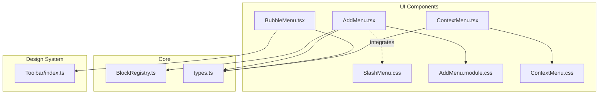
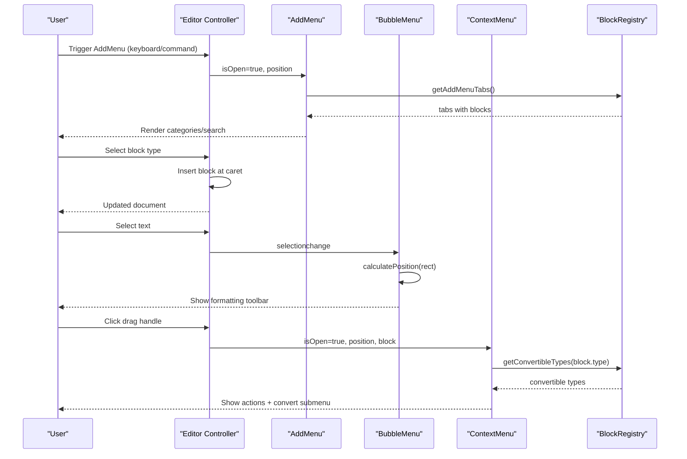
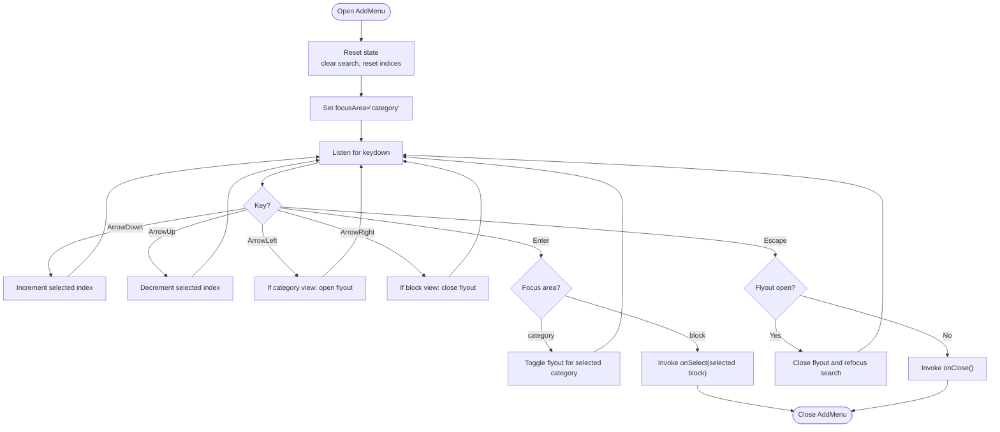
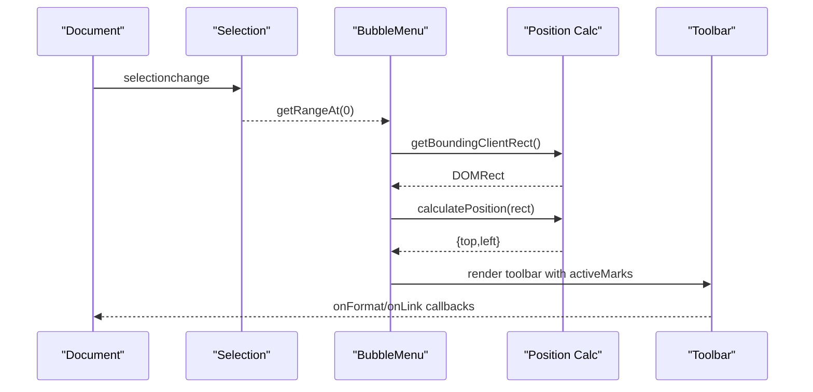
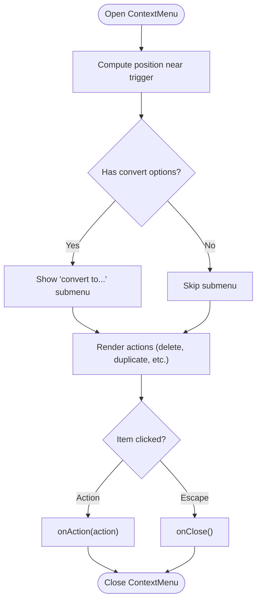
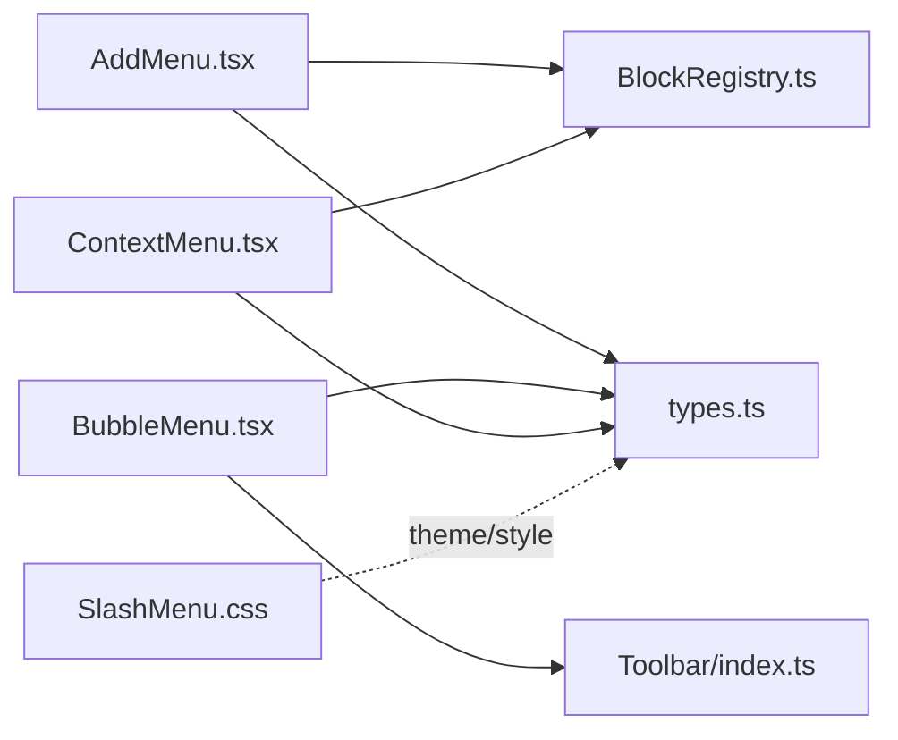

# Interactive Menus

<cite>
**Referenced Files in This Document**
- [AddMenu.tsx](file://artoon-typer/src/ui/components/AddMenu.tsx)
- [AddMenu.module.css](file://artoon-typer/src/ui/components/AddMenu.module.css)
- [BubbleMenu.tsx](file://artoon-typer/src/ui/components/BubbleMenu.tsx)
- [ContextMenu.tsx](file://artoon-typer/src/ui/components/ContextMenu.tsx)
- [ContextMenu.css](file://artoon-typer/src/ui/components/ContextMenu.css)
- [SlashMenu.css](file://artoon-typer/src/ui/components/SlashMenu.css)
- [types.ts](file://artoon-typer/src/types.ts)
- [BlockRegistry.ts](file://artoon-typer/src/core/BlockRegistry.ts)
- [Toolbar/index.ts](file://artoon-typer/src/design-system/Toolbar/index.ts)
</cite>

## Table of Contents
1. [Introduction](#introduction)
2. [Project Structure](#project-structure)
3. [Core Components](#core-components)
4. [Architecture Overview](#architecture-overview)
5. [Detailed Component Analysis](#detailed-component-analysis)
6. [Dependency Analysis](#dependency-analysis)
7. [Performance Considerations](#performance-considerations)
8. [Troubleshooting Guide](#troubleshooting-guide)
9. [Conclusion](#conclusion)
10. [Appendices](#appendices)

## Introduction
This document describes the ARTOON Typer interactive menu system with a focus on four UI components:
- AddMenu: block insertion menu triggered by keyboard or toolbar, offering categorized block selection and a search experience.
- BubbleMenu: floating contextual formatting toolbar that appears on text selection with active state tracking and smooth animations.
- ContextMenu: block-level right-click or drag-handle menu providing actions and conversion options.
- SlashMenu: command palette-style menu integrated with the block registry for dynamic block insertion.

It covers positioning logic, trigger conditions, menu item configuration, event handling, styling and animations, keyboard navigation, accessibility, customization, integration with block types, and responsive behavior.

## Project Structure
The interactive menus live under the UI components layer and integrate with the design system and core editor types.

**Diagram sources**
- [AddMenu.tsx:1-449](file://artoon-typer/src/ui/components/AddMenu.tsx#L1-L449)
- [BubbleMenu.tsx:1-174](file://artoon-typer/src/ui/components/BubbleMenu.tsx#L1-L174)
- [ContextMenu.tsx:1-264](file://artoon-typer/src/ui/components/ContextMenu.tsx#L1-L264)
- [SlashMenu.css:1-291](file://artoon-typer/src/ui/components/SlashMenu.css#L1-L291)
- [AddMenu.module.css](file://artoon-typer/src/ui/components/AddMenu.module.css)
- [BlockRegistry.ts:1-174](file://artoon-typer/src/core/BlockRegistry.ts#L1-L174)
- [types.ts:1-654](file://artoon-typer/src/types.ts#L1-L654)
- [Toolbar/index.ts:1-18](file://artoon-typer/src/design-system/Toolbar/index.ts#L1-L18)

**Section sources**
- [AddMenu.tsx:1-449](file://artoon-typer/src/ui/components/AddMenu.tsx#L1-L449)
- [BubbleMenu.tsx:1-174](file://artoon-typer/src/ui/components/BubbleMenu.tsx#L1-L174)
- [ContextMenu.tsx:1-264](file://artoon-typer/src/ui/components/ContextMenu.tsx#L1-L264)
- [SlashMenu.css:1-291](file://artoon-typer/src/ui/components/SlashMenu.css#L1-L291)
- [AddMenu.module.css](file://artoon-typer/src/ui/components/AddMenu.module.css)
- [ContextMenu.css](file://artoon-typer/src/ui/components/ContextMenu.css)
- [BlockRegistry.ts:1-174](file://artoon-typer/src/core/BlockRegistry.ts#L1-L174)
- [types.ts:1-654](file://artoon-typer/src/types.ts#L1-L654)
- [Toolbar/index.ts:1-18](file://artoon-typer/src/design-system/Toolbar/index.ts#L1-L18)

## Core Components
- AddMenu: Presents categorized tabs and a search bar to select block types. Handles keyboard navigation, RTL layout, and dynamic flyout panels. Integrates with the block registry for tabs and icons.
- BubbleMenu: Appears above text selections with formatting buttons and a link action. Calculates position with viewport-aware placement and smooth animation via requestAnimationFrame.
- ContextMenu: Opens near a block’s drag handle with actions (delete, duplicate, cut/copy, move) and a dynamic “convert to” submenu derived from the block registry.
- SlashMenu: A glass-like command palette styled with CSS variables and animations; integrates with the block registry for items and supports RTL.

Key shared types and registry:
- BlockType, BlockDefinition, BlockCategory, AddMenuTab, MarkType, MenuPosition are defined centrally and used across menus.
- BlockRegistry supplies dynamic tabs and conversion options.

**Section sources**
- [AddMenu.tsx:12-17](file://artoon-typer/src/ui/components/AddMenu.tsx#L12-L17)
- [BubbleMenu.tsx:17-39](file://artoon-typer/src/ui/components/BubbleMenu.tsx#L17-L39)
- [ContextMenu.tsx:19-25](file://artoon-typer/src/ui/components/ContextMenu.tsx#L19-L25)
- [types.ts:27-66](file://artoon-typer/src/types.ts#L27-L66)
- [types.ts:469-503](file://artoon-typer/src/types.ts#L469-L503)
- [types.ts](file://artoon-typer/src/types.ts#L551)
- [types.ts:627-630](file://artoon-typer/src/types.ts#L627-L630)
- [BlockRegistry.ts:89-105](file://artoon-typer/src/core/BlockRegistry.ts#L89-L105)
- [BlockRegistry.ts:134-139](file://artoon-typer/src/core/BlockRegistry.ts#L134-L139)

## Architecture Overview
Menus are coordinated by the editor controller and rely on:
- BlockRegistry for dynamic block definitions and categories.
- Core types for block and mark semantics.
- Design system Toolbar for BubbleMenu formatting controls.

**Diagram sources**
- [AddMenu.tsx:93-277](file://artoon-typer/src/ui/components/AddMenu.tsx#L93-L277)
- [BubbleMenu.tsx:75-112](file://artoon-typer/src/ui/components/BubbleMenu.tsx#L75-L112)
- [ContextMenu.tsx:140-186](file://artoon-typer/src/ui/components/ContextMenu.tsx#L140-L186)
- [BlockRegistry.ts:89-105](file://artoon-typer/src/core/BlockRegistry.ts#L89-L105)
- [BlockRegistry.ts:134-139](file://artoon-typer/src/core/BlockRegistry.ts#L134-L139)

## Detailed Component Analysis

### AddMenu
Purpose:
- Provide a categorized and searchable block insertion experience with keyboard navigation and RTL support.

Key behaviors:
- Dynamic tabs from BlockRegistry categories excluding an “advanced” category.
- Search flattens categories and filters by name/description.
- Keyboard navigation:
  - ArrowUp/ArrowDown to move within categories or blocks.
  - ArrowLeft opens a category’s flyout; ArrowRight closes it.
  - Enter toggles category flyout or selects a block.
  - Escape closes flyout or the entire menu.
- Positioning:
  - Centers horizontally on the trigger position.
  - Adjusts to avoid clipping off-screen, including a secondary flyout width to the left.
- Accessibility:
  - Focus tracking between categories and blocks.
  - Input focus management on open.
  - RTL direction enforced.

Styling and animations:
- Compact layout with fixed width/height estimates.
- Module CSS applied for layout and hover states.

Integration:
- onSelect(type) callback invoked with a BlockType.
- onClose() callback to dismiss the menu.

Customization:
- Tabs and icons derive from BlockRegistry entries.
- Categories and labels are localized via registry-provided Arabic labels.

Responsive behavior:
- Horizontal centering with viewport bounds.
- Vertical adjustment to keep menu on screen.

**Section sources**
- [AddMenu.tsx:68-91](file://artoon-typer/src/ui/components/AddMenu.tsx#L68-L91)
- [AddMenu.tsx:117-138](file://artoon-typer/src/ui/components/AddMenu.tsx#L117-L138)
- [AddMenu.tsx:186-273](file://artoon-typer/src/ui/components/AddMenu.tsx#L186-L273)
- [AddMenu.tsx:279-296](file://artoon-typer/src/ui/components/AddMenu.tsx#L279-L296)
- [AddMenu.tsx:300-317](file://artoon-typer/src/ui/components/AddMenu.tsx#L300-L317)
- [AddMenu.tsx:341-379](file://artoon-typer/src/ui/components/AddMenu.tsx#L341-L379)
- [AddMenu.tsx:382-410](file://artoon-typer/src/ui/components/AddMenu.tsx#L382-L410)
- [AddMenu.tsx:415-442](file://artoon-typer/src/ui/components/AddMenu.tsx#L415-L442)
- [BlockRegistry.ts:89-105](file://artoon-typer/src/core/BlockRegistry.ts#L89-L105)
- [types.ts](file://artoon-typer/src/types.ts#L493)

**Diagram sources**
- [AddMenu.tsx:144-156](file://artoon-typer/src/ui/components/AddMenu.tsx#L144-L156)
- [AddMenu.tsx:186-273](file://artoon-typer/src/ui/components/AddMenu.tsx#L186-L273)
- [AddMenu.tsx:235-267](file://artoon-typer/src/ui/components/AddMenu.tsx#L235-L267)

### BubbleMenu
Purpose:
- Floating formatting toolbar appearing above text selections with active mark tracking.

Key behaviors:
- Tracks selection changes using selectionchange and requestAnimationFrame for smoothness.
- Calculates position centered above selection with viewport-aware adjustments.
- Shows below selection if insufficient space above.
- Renders formatting controls via the design system Toolbar.

Styling and animations:
- Uses CSS variables and theme-aware backgrounds.
- Smooth fade-in animation and absolute positioning.

Accessibility:
- Role="toolbar" and aria-label for screen readers.
- Keyboard-safe interactions (prevents text selection interference).

Integration:
- onFormat(format) callback toggles marks.
- onLink() callback handles link insertion.
- activeMarks prop reflects current selection state.

**Section sources**
- [BubbleMenu.tsx:49-70](file://artoon-typer/src/ui/components/BubbleMenu.tsx#L49-L70)
- [BubbleMenu.tsx:75-112](file://artoon-typer/src/ui/components/BubbleMenu.tsx#L75-L112)
- [BubbleMenu.tsx:131-170](file://artoon-typer/src/ui/components/BubbleMenu.tsx#L131-L170)
- [Toolbar/index.ts:7-12](file://artoon-typer/src/design-system/Toolbar/index.ts#L7-L12)
- [types.ts](file://artoon-typer/src/types.ts#L551)

**Diagram sources**
- [BubbleMenu.tsx:75-112](file://artoon-typer/src/ui/components/BubbleMenu.tsx#L75-L112)
- [BubbleMenu.tsx:145-168](file://artoon-typer/src/ui/components/BubbleMenu.tsx#L145-L168)

### ContextMenu
Purpose:
- Block-level actions menu triggered by the drag handle, including delete, duplicate, cut/copy, move up/down, and convert-to options.

Key behaviors:
- Calculates position near the trigger point, preferring to stay on-screen.
- Converts options depend on the current block type using registry-provided conversion types.
- Submenu for “convert to…” with mouse-enter/leave triggers.

Styling and animations:
- CSS module defines visibility and hover states.
- RTL-friendly layout with directional overrides.

Accessibility:
- Escape key closes the menu.
- Keyboard-safe click handling.

Integration:
- onAction(action) callback receives BlockAction events.
- onClose() callback to dismiss.

**Section sources**
- [ContextMenu.tsx:140-186](file://artoon-typer/src/ui/components/ContextMenu.tsx#L140-L186)
- [ContextMenu.tsx:188-260](file://artoon-typer/src/ui/components/ContextMenu.tsx#L188-L260)
- [BlockRegistry.ts:134-139](file://artoon-typer/src/core/BlockRegistry.ts#L134-L139)
- [types.ts:27-66](file://artoon-typer/src/types.ts#L27-L66)

**Diagram sources**
- [ContextMenu.tsx:140-186](file://artoon-typer/src/ui/components/ContextMenu.tsx#L140-L186)
- [ContextMenu.tsx:188-260](file://artoon-typer/src/ui/components/ContextMenu.tsx#L188-L260)

### SlashMenu
Purpose:
- Command palette-style menu for quick block insertion, styled with a glassmorphic theme and animations.

Key behaviors:
- Uses CSS variables and theme-aware styles.
- RTL direction enforced for proper alignment.
- Animations for entrance.

Integration:
- Integrates with the block registry for items and shortcuts.
- Designed to complement AddMenu and keyboard-driven workflows.

**Section sources**
- [SlashMenu.css:1-291](file://artoon-typer/src/ui/components/SlashMenu.css#L1-L291)
- [BlockRegistry.ts:108-124](file://artoon-typer/src/core/BlockRegistry.ts#L108-L124)

## Dependency Analysis
- AddMenu depends on BlockRegistry for tabs and icons, and on types for BlockType and BlockCategory.
- BubbleMenu depends on the design system Toolbar and types for MarkType.
- ContextMenu depends on BlockRegistry for conversion options and types for BlockType.
- All menus share MenuPosition and block-related types.

**Diagram sources**
- [AddMenu.tsx:1-10](file://artoon-typer/src/ui/components/AddMenu.tsx#L1-L10)
- [BubbleMenu.tsx:1-16](file://artoon-typer/src/ui/components/BubbleMenu.tsx#L1-L16)
- [ContextMenu.tsx:1-17](file://artoon-typer/src/ui/components/ContextMenu.tsx#L1-L17)
- [SlashMenu.css:1-25](file://artoon-typer/src/ui/components/SlashMenu.css#L1-L25)
- [BlockRegistry.ts:1-174](file://artoon-typer/src/core/BlockRegistry.ts#L1-L174)
- [types.ts:1-654](file://artoon-typer/src/types.ts#L1-L654)
- [Toolbar/index.ts:1-18](file://artoon-typer/src/design-system/Toolbar/index.ts#L1-L18)

**Section sources**
- [AddMenu.tsx:1-10](file://artoon-typer/src/ui/components/AddMenu.tsx#L1-L10)
- [BubbleMenu.tsx:1-16](file://artoon-typer/src/ui/components/BubbleMenu.tsx#L1-L16)
- [ContextMenu.tsx:1-17](file://artoon-typer/src/ui/components/ContextMenu.tsx#L1-L17)
- [SlashMenu.css:1-25](file://artoon-typer/src/ui/components/SlashMenu.css#L1-L25)
- [BlockRegistry.ts:1-174](file://artoon-typer/src/core/BlockRegistry.ts#L1-L174)
- [types.ts:1-654](file://artoon-typer/src/types.ts#L1-L654)
- [Toolbar/index.ts:1-18](file://artoon-typer/src/design-system/Toolbar/index.ts#L1-L18)

## Performance Considerations
- AddMenu uses useMemo for search results and active blocks to avoid recomputation on every render.
- BubbleMenu leverages requestAnimationFrame to batch DOM measurements and updates for smooth positioning.
- ContextMenu computes positions once per open and avoids unnecessary reflows.
- CSS animations and transitions are hardware-accelerated where possible (e.g., transform/opacity).

[No sources needed since this section provides general guidance]

## Troubleshooting Guide
Common issues and resolutions:
- Menu not appearing:
  - Verify isOpen prop is true and position is set.
  - Ensure selection is not collapsed for BubbleMenu.
- Off-screen menus:
  - AddMenu and ContextMenu adjust position to stay within viewport; check window dimensions and z-index.
- Keyboard navigation not working:
  - Confirm keydown listeners are attached while isOpen is true.
  - Ensure focusArea and selected indices are updated correctly.
- RTL layout issues:
  - AddMenu enforces RTL direction; confirm CSS direction and text-align properties.
- Accessibility:
  - BubbleMenu sets role and aria-label; ensure assistive tech receives focus cues.

**Section sources**
- [AddMenu.tsx:144-156](file://artoon-typer/src/ui/components/AddMenu.tsx#L144-L156)
- [AddMenu.tsx:186-273](file://artoon-typer/src/ui/components/AddMenu.tsx#L186-L273)
- [BubbleMenu.tsx:75-112](file://artoon-typer/src/ui/components/BubbleMenu.tsx#L75-L112)
- [BubbleMenu.tsx:131-170](file://artoon-typer/src/ui/components/BubbleMenu.tsx#L131-L170)
- [ContextMenu.tsx:140-186](file://artoon-typer/src/ui/components/ContextMenu.tsx#L140-L186)

## Conclusion
The ARTOON Typer interactive menu system provides a cohesive, accessible, and extensible editing experience. AddMenu offers a powerful, searchable block insertion workflow; BubbleMenu delivers precise inline formatting; ContextMenu enables block-level actions and conversions; and SlashMenu complements the palette with a modern, theme-aware UI. Together, they integrate tightly with the block registry and core types to support customization and responsive behavior across screen sizes.

[No sources needed since this section summarizes without analyzing specific files]

## Appendices

### Menu Item Configuration and Trigger Conditions
- AddMenu:
  - Trigger: keyboard/command; position supplied by editor.
  - Items: derived from BlockRegistry tabs; icons mapped by block type.
  - Search: filters by name/description; clears category focus.
- BubbleMenu:
  - Trigger: selectionchange with non-collapsed selection.
  - Items: formatting buttons via design system Toolbar.
- ContextMenu:
  - Trigger: drag handle click; position near block.
  - Items: static actions plus dynamic “convert to…” options.
- SlashMenu:
  - Trigger: command palette activation; integrates with registry items.

**Section sources**
- [AddMenu.tsx:68-91](file://artoon-typer/src/ui/components/AddMenu.tsx#L68-L91)
- [AddMenu.tsx:117-138](file://artoon-typer/src/ui/components/AddMenu.tsx#L117-L138)
- [BubbleMenu.tsx:75-112](file://artoon-typer/src/ui/components/BubbleMenu.tsx#L75-L112)
- [ContextMenu.tsx:140-186](file://artoon-typer/src/ui/components/ContextMenu.tsx#L140-L186)
- [BlockRegistry.ts:108-124](file://artoon-typer/src/core/BlockRegistry.ts#L108-L124)

### Styling Approaches and Animation Effects
- AddMenu: module CSS for layout and hover states; RTL direction enforced.
- BubbleMenu: theme-aware backgrounds and smooth fade-in animation.
- ContextMenu: CSS module for visibility and hover states; RTL-friendly layout.
- SlashMenu: glassmorphism theme with backdrop-filter and custom animations.

**Section sources**
- [AddMenu.module.css](file://artoon-typer/src/ui/components/AddMenu.module.css)
- [BubbleMenu.tsx:131-170](file://artoon-typer/src/ui/components/BubbleMenu.tsx#L131-L170)
- [ContextMenu.css](file://artoon-typer/src/ui/components/ContextMenu.css)
- [SlashMenu.css:1-291](file://artoon-typer/src/ui/components/SlashMenu.css#L1-L291)

### Keyboard Navigation Support
- AddMenu: arrow keys, enter, escape with focus-area awareness.
- BubbleMenu: relies on editor keyboard handling; menu remains passive.
- ContextMenu: escape to close; actions triggered via clicks.

**Section sources**
- [AddMenu.tsx:186-273](file://artoon-typer/src/ui/components/AddMenu.tsx#L186-L273)
- [ContextMenu.tsx:145-156](file://artoon-typer/src/ui/components/ContextMenu.tsx#L145-L156)

### Accessibility Features
- BubbleMenu: role="toolbar", aria-label, prevents text selection interference.
- AddMenu: focus management and keyboard-only operation.
- ContextMenu: escape-to-close and clear labeling.

**Section sources**
- [BubbleMenu.tsx:141-143](file://artoon-typer/src/ui/components/BubbleMenu.tsx#L141-L143)
- [AddMenu.tsx:144-156](file://artoon-typer/src/ui/components/AddMenu.tsx#L144-L156)
- [ContextMenu.tsx:145-156](file://artoon-typer/src/ui/components/ContextMenu.tsx#L145-L156)

### Examples of Menu Customization
- AddMenu:
  - Customize categories and labels via BlockRegistry tabs.
  - Extend icons by mapping block types to icons.
- ContextMenu:
  - Add new BlockAction types and map to menu items.
  - Dynamically compute convert options from BlockRegistry.
- SlashMenu:
  - Integrate new block types via BlockRegistry items.

**Section sources**
- [BlockRegistry.ts:89-105](file://artoon-typer/src/core/BlockRegistry.ts#L89-L105)
- [BlockRegistry.ts:108-124](file://artoon-typer/src/core/BlockRegistry.ts#L108-L124)
- [BlockRegistry.ts:134-139](file://artoon-typer/src/core/BlockRegistry.ts#L134-L139)
- [types.ts](file://artoon-typer/src/types.ts#L493)

### Responsive Behavior
- AddMenu: centers on trigger and adjusts for viewport; accounts for flyout width.
- BubbleMenu: calculates above/below placement based on selection rect.
- ContextMenu: prefers left-aligned placement when near right edge.

**Section sources**
- [AddMenu.tsx:279-296](file://artoon-typer/src/ui/components/AddMenu.tsx#L279-L296)
- [BubbleMenu.tsx:49-70](file://artoon-typer/src/ui/components/BubbleMenu.tsx#L49-L70)
- [ContextMenu.tsx:171-184](file://artoon-typer/src/ui/components/ContextMenu.tsx#L171-L184)