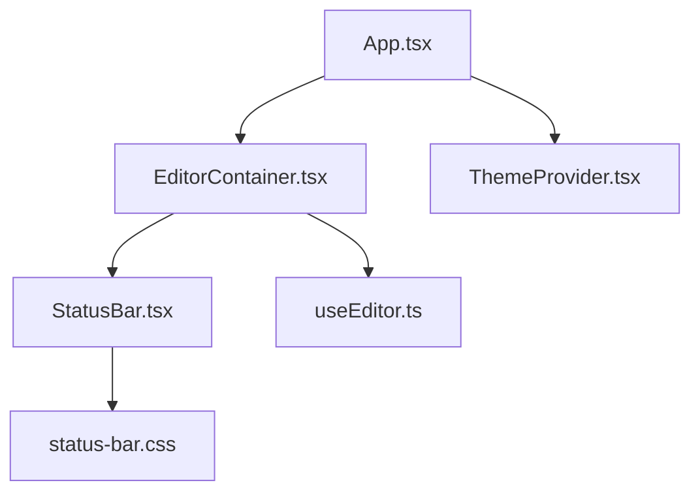
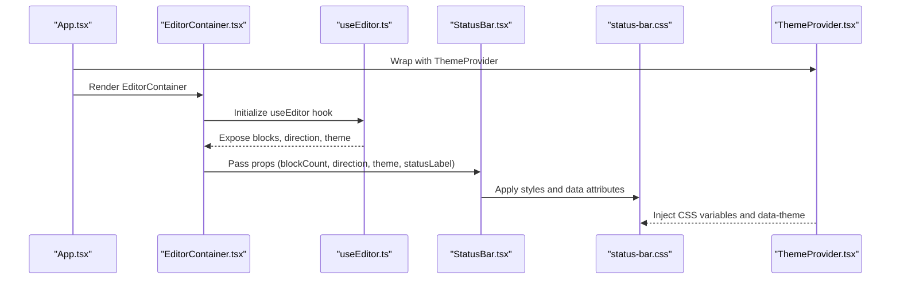
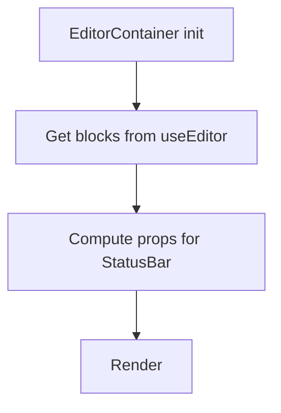
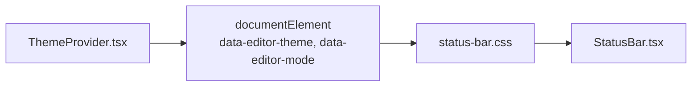
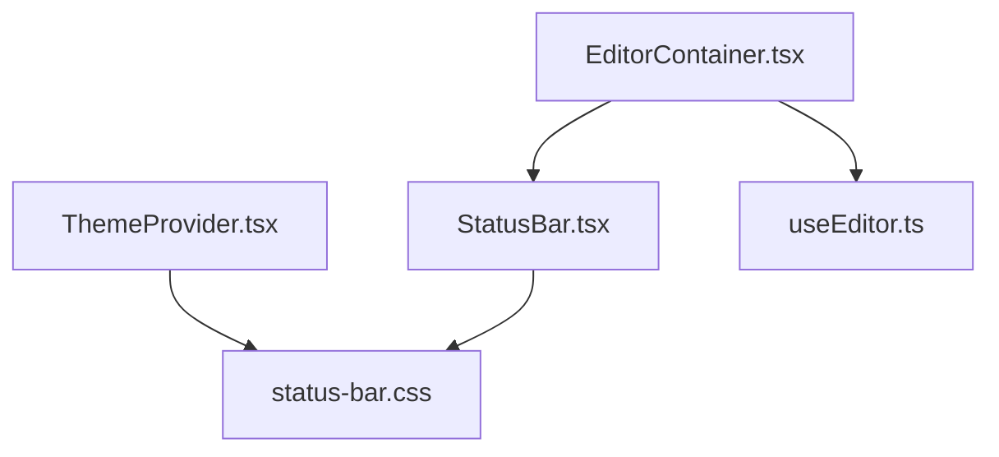

# Status Bar Component

<cite>
**Referenced Files in This Document**
- [StatusBar.tsx](file://artoon-typer/src/ui/components/StatusBar.tsx)
- [status-bar.css](file://artoon-typer/src/ui/styles/v2/status-bar.css)
- [EditorContainer.tsx](file://artoon-typer/src/ui/components/EditorContainer.tsx)
- [App.tsx](file://artoon-typer/src/App.tsx)
- [useEditor.ts](file://artoon-typer/src/ui/hooks/useEditor.ts)
- [ThemeProvider.tsx](file://artoon-typer/src/themes/ThemeProvider.tsx)
</cite>

## Table of Contents
1. [Introduction](#introduction)
2. [Project Structure](#project-structure)
3. [Core Components](#core-components)
4. [Architecture Overview](#architecture-overview)
5. [Detailed Component Analysis](#detailed-component-analysis)
6. [Dependency Analysis](#dependency-analysis)
7. [Performance Considerations](#performance-considerations)
8. [Troubleshooting Guide](#troubleshooting-guide)
9. [Conclusion](#conclusion)

## Introduction
The Status Bar component displays contextual information at the bottom of the editor, including:
- Save status indicator
- Document metrics (block count)
- Direction indicator (RTL/LTR)
- Theme indicator (Light/Dark)

It integrates with the editor’s state via the EditorContainer and responds to theme changes through the ThemeProvider. The component is styled using a dedicated stylesheet and adapts responsively for small screens.

## Project Structure
The Status Bar lives within the ARTOON Typer UI layer and is composed of:
- A React functional component that renders status items
- A CSS module that defines layout, hover states, separators, and responsive behavior
- Integration points inside the EditorContainer and App shell

**Diagram sources**
- [App.tsx:1-475](file://artoon-typer/src/App.tsx#L1-L475)
- [EditorContainer.tsx:1-387](file://artoon-typer/src/ui/components/EditorContainer.tsx#L1-L387)
- [StatusBar.tsx:1-36](file://artoon-typer/src/ui/components/StatusBar.tsx#L1-L36)
- [status-bar.css:1-117](file://artoon-typer/src/ui/styles/v2/status-bar.css#L1-L117)
- [useEditor.ts:1-400](file://artoon-typer/src/ui/hooks/useEditor.ts#L1-L400)
- [ThemeProvider.tsx:1-268](file://artoon-typer/src/themes/ThemeProvider.tsx#L1-L268)

**Section sources**
- [App.tsx:1-475](file://artoon-typer/src/App.tsx#L1-L475)
- [EditorContainer.tsx:1-387](file://artoon-typer/src/ui/components/EditorContainer.tsx#L1-L387)
- [StatusBar.tsx:1-36](file://artoon-typer/src/ui/components/StatusBar.tsx#L1-L36)
- [status-bar.css:1-117](file://artoon-typer/src/ui/styles/v2/status-bar.css#L1-L117)
- [useEditor.ts:1-400](file://artoon-typer/src/ui/hooks/useEditor.ts#L1-L400)
- [ThemeProvider.tsx:1-268](file://artoon-typer/src/themes/ThemeProvider.tsx#L1-L268)

## Core Components
- StatusBar React component
  - Props: blockCount, direction, theme, statusLabel
  - Renders left-side items (save status and block count) and right-side items (direction and theme)
- Status bar stylesheet
  - Defines layout, hover effects, active state, separators, and responsive breakpoints
- Integration
  - EditorContainer passes computed props to StatusBar
  - ThemeProvider supplies theme mode for styling and data attributes

**Section sources**
- [StatusBar.tsx:3-36](file://artoon-typer/src/ui/components/StatusBar.tsx#L3-L36)
- [status-bar.css:5-117](file://artoon-typer/src/ui/styles/v2/status-bar.css#L5-L117)
- [EditorContainer.tsx:345-350](file://artoon-typer/src/ui/components/EditorContainer.tsx#L345-L350)

## Architecture Overview
The Status Bar participates in a unidirectional data flow:
- EditorContainer orchestrates editor state and passes props to StatusBar
- ThemeProvider injects CSS variables and data attributes affecting the status bar visuals
- Stylesheet reacts to data attributes and media queries for responsive behavior

**Diagram sources**
- [App.tsx:463-472](file://artoon-typer/src/App.tsx#L463-L472)
- [EditorContainer.tsx:60-104](file://artoon-typer/src/ui/components/EditorContainer.tsx#L60-L104)
- [useEditor.ts:170-263](file://artoon-typer/src/ui/hooks/useEditor.ts#L170-L263)
- [StatusBar.tsx:10-35](file://artoon-typer/src/ui/components/StatusBar.tsx#L10-L35)
- [status-bar.css:5-117](file://artoon-typer/src/ui/styles/v2/status-bar.css#L5-L117)
- [ThemeProvider.tsx:207-216](file://artoon-typer/src/themes/ThemeProvider.tsx#L207-L216)

## Detailed Component Analysis

### StatusBar Component
Responsibilities:
- Render left-side items: save status and block count
- Render right-side items: direction and theme indicators
- Accept optional statusLabel for localization

Props:
- blockCount: number of blocks in the document
- direction: 'rtl' | 'ltr'
- theme: 'light' | 'dark'
- statusLabel: optional string for save status text

Rendering pattern:
- Left group: status indicator + localized status text; block counter with pluralization
- Right group: directional icon/text; theme icon/text

Accessibility considerations:
- The component does not include explicit ARIA roles or live regions for dynamic updates. To improve accessibility for screen readers, consider adding an aria-live region around the status area and labeling icons with appropriate ARIA attributes.

Styling approach:
- Uses modular CSS classes (.status-bar, .status-bar__item, .status-bar__item--active)
- Leverages CSS variables for colors and spacing
- Applies data attributes for theme-aware indicators

Responsive behavior:
- Wraps items on small screens
- Hides text labels below a certain viewport width while keeping icons
- Adjusts padding and separator visibility for compact layouts

**Section sources**
- [StatusBar.tsx:3-36](file://artoon-typer/src/ui/components/StatusBar.tsx#L3-L36)
- [status-bar.css:5-117](file://artoon-typer/src/ui/styles/v2/status-bar.css#L5-L117)

### Integration with EditorContainer
- EditorContainer obtains blocks from useEditor and passes blockCount to StatusBar
- Direction and theme are passed from EditorContainer props
- StatusBar is rendered at the bottom of the editor layout

**Diagram sources**
- [EditorContainer.tsx:60-104](file://artoon-typer/src/ui/components/EditorContainer.tsx#L60-L104)
- [EditorContainer.tsx:345-350](file://artoon-typer/src/ui/components/EditorContainer.tsx#L345-L350)

**Section sources**
- [EditorContainer.tsx:60-104](file://artoon-typer/src/ui/components/EditorContainer.tsx#L60-L104)
- [EditorContainer.tsx:345-350](file://artoon-typer/src/ui/components/EditorContainer.tsx#L345-L350)

### Theme Integration and Styling
- ThemeProvider applies CSS variables and sets data attributes on the document root
- The status bar stylesheet reads data-theme and data-direction to adjust indicator colors
- Icons reflect theme-appropriate glyphs (sun/moon vs. icons for direction)

**Diagram sources**
- [ThemeProvider.tsx:207-216](file://artoon-typer/src/themes/ThemeProvider.tsx#L207-L216)
- [status-bar.css:73-89](file://artoon-typer/src/ui/styles/v2/status-bar.css#L73-L89)
- [StatusBar.tsx:24-31](file://artoon-typer/src/ui/components/StatusBar.tsx#L24-L31)

**Section sources**
- [ThemeProvider.tsx:207-216](file://artoon-typer/src/themes/ThemeProvider.tsx#L207-L216)
- [status-bar.css:73-89](file://artoon-typer/src/ui/styles/v2/status-bar.css#L73-L89)
- [StatusBar.tsx:24-31](file://artoon-typer/src/ui/components/StatusBar.tsx#L24-L31)

### Layout System and Information Display Logic
Layout:
- Flex container with left/right groups
- Items include an icon and text label
- Active state highlights the current indicator

Information display:
- Save status: localized label via statusLabel prop
- Block count: derived from EditorContainer’s blocks
- Direction: derived from EditorContainer’s defaultDirection
- Theme: derived from EditorContainer’s theme prop

Update mechanisms:
- StatusBar receives props from EditorContainer
- No internal subscriptions; updates occur when EditorContainer re-renders with new props

Customization options:
- statusLabel allows localization
- ThemeProvider controls theme-dependent visuals via CSS variables and data attributes
- CSS classes enable easy overrides for branding or layout adjustments

**Section sources**
- [EditorContainer.tsx:345-350](file://artoon-typer/src/ui/components/EditorContainer.tsx#L345-L350)
- [StatusBar.tsx:10-35](file://artoon-typer/src/ui/components/StatusBar.tsx#L10-L35)
- [status-bar.css:5-117](file://artoon-typer/src/ui/styles/v2/status-bar.css#L5-L117)

### Accessibility Features
Current state:
- No explicit ARIA roles or live regions
- Icons lack alt text

Recommended enhancements:
- Add an aria-live region around the status area for dynamic updates
- Provide aria-labels for icons representing direction and theme
- Ensure sufficient color contrast for indicators under both light and dark themes

[No sources needed since this section provides general guidance]

## Dependency Analysis
The Status Bar depends on:
- EditorContainer for props (blockCount, direction, theme)
- ThemeProvider for theme-related CSS variables and data attributes
- Local stylesheet for layout and responsive behavior

**Diagram sources**
- [EditorContainer.tsx:18-18](file://artoon-typer/src/ui/components/EditorContainer.tsx#L18-L18)
- [StatusBar.tsx:10-35](file://artoon-typer/src/ui/components/StatusBar.tsx#L10-L35)
- [status-bar.css:5-117](file://artoon-typer/src/ui/styles/v2/status-bar.css#L5-L117)
- [useEditor.ts:170-263](file://artoon-typer/src/ui/hooks/useEditor.ts#L170-L263)
- [ThemeProvider.tsx:207-216](file://artoon-typer/src/themes/ThemeProvider.tsx#L207-L216)

**Section sources**
- [EditorContainer.tsx:18-18](file://artoon-typer/src/ui/components/EditorContainer.tsx#L18-L18)
- [StatusBar.tsx:10-35](file://artoon-typer/src/ui/components/StatusBar.tsx#L10-L35)
- [status-bar.css:5-117](file://artoon-typer/src/ui/styles/v2/status-bar.css#L5-L117)
- [useEditor.ts:170-263](file://artoon-typer/src/ui/hooks/useEditor.ts#L170-L263)
- [ThemeProvider.tsx:207-216](file://artoon-typer/src/themes/ThemeProvider.tsx#L207-L216)

## Performance Considerations
- The Status Bar is lightweight and re-renders passively when props change
- Avoid unnecessary re-computation of props upstream; rely on EditorContainer’s memoization
- Keep statusLabel static or memoized to prevent re-renders when unchanged

[No sources needed since this section provides general guidance]

## Troubleshooting Guide
Common issues and resolutions:
- Theme indicators not updating
  - Ensure ThemeProvider is wrapping the app and applying CSS variables
  - Verify data attributes are present on the document root
- Direction indicator not visible
  - Confirm defaultDirection is passed to EditorContainer and StatusBar
  - Check that the stylesheet targets data-direction selectors
- Status label not localized
  - Provide statusLabel prop with desired text
  - Ensure the component re-renders when the label changes

**Section sources**
- [ThemeProvider.tsx:207-216](file://artoon-typer/src/themes/ThemeProvider.tsx#L207-L216)
- [status-bar.css:73-89](file://artoon-typer/src/ui/styles/v2/status-bar.css#L73-L89)
- [EditorContainer.tsx:345-350](file://artoon-typer/src/ui/components/EditorContainer.tsx#L345-L350)
- [StatusBar.tsx:10-17](file://artoon-typer/src/ui/components/StatusBar.tsx#L10-L17)

## Conclusion
The Status Bar component provides essential editor context with a clean, modular design. It integrates seamlessly with the editor state and theme system, and its responsive stylesheet ensures usability across devices. Extending the component with accessibility features and customizable indicators would further enhance the user experience.