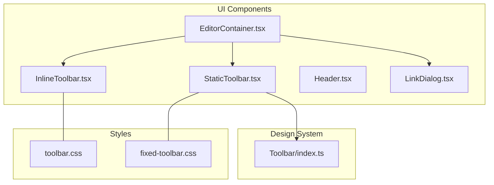
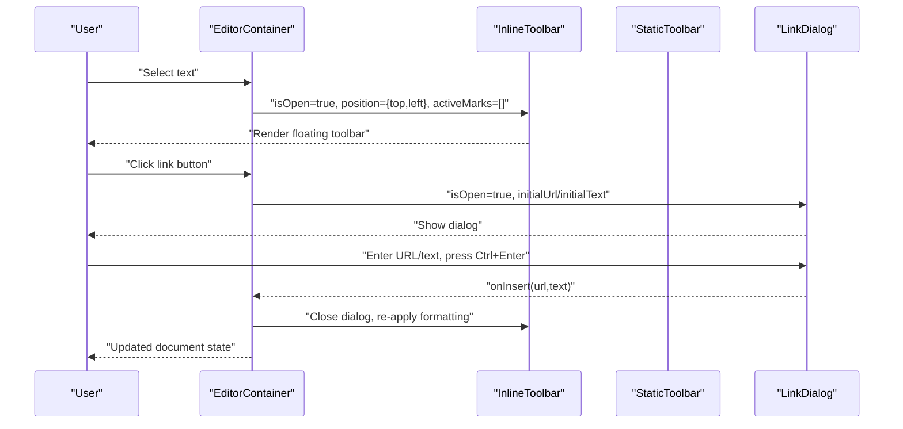
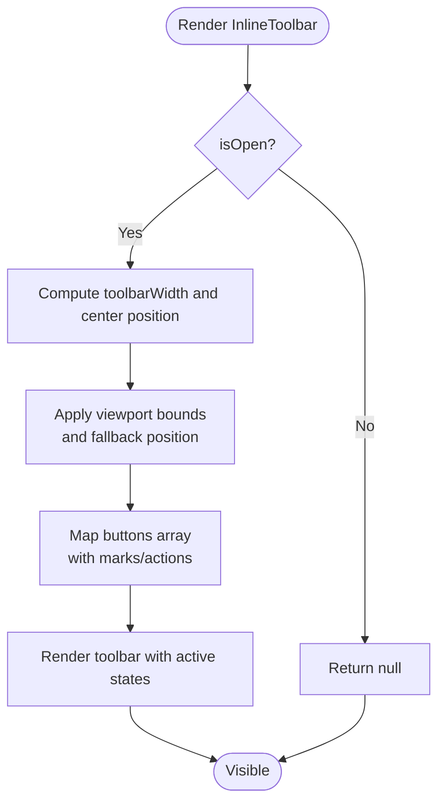
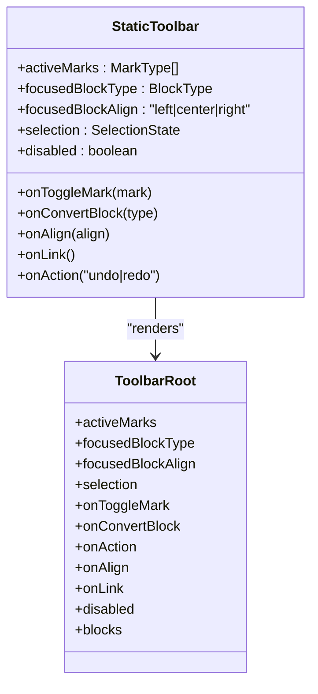
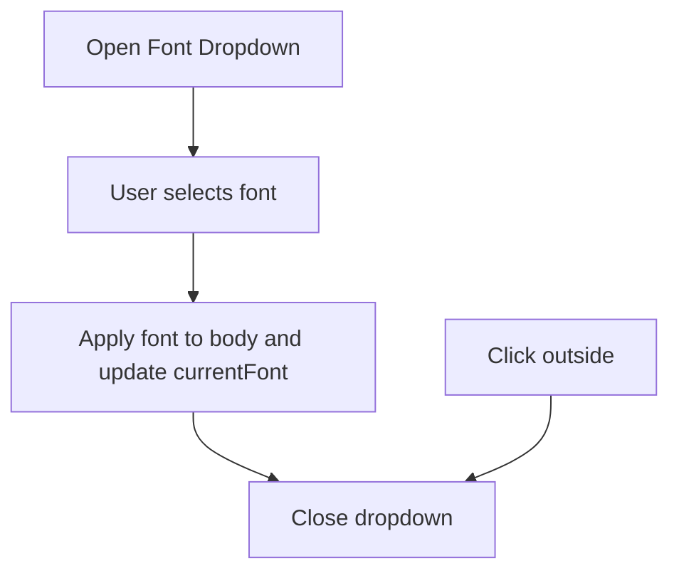
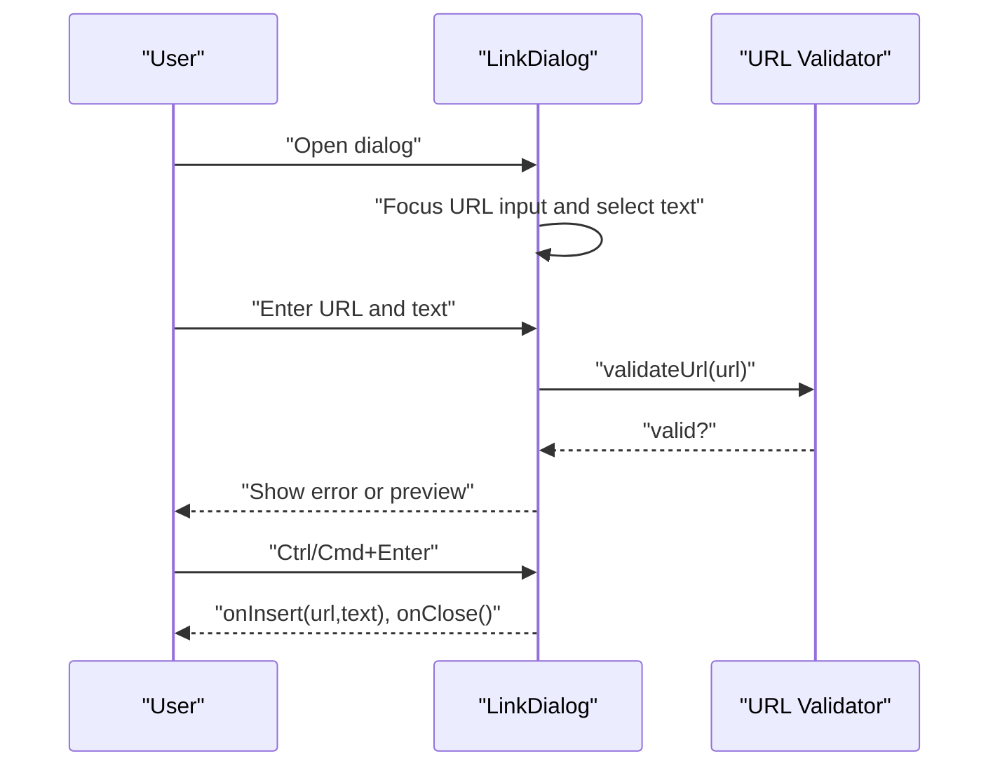
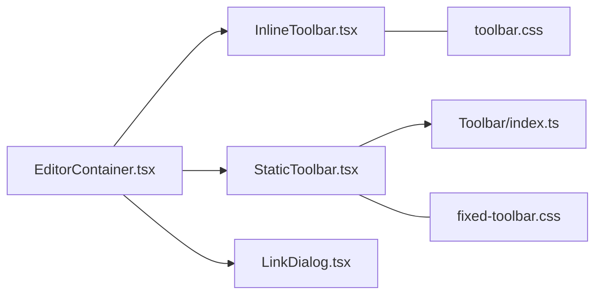

# Toolbar Components

<cite>
**Referenced Files in This Document**
- [InlineToolbar.tsx](file://artoon-typer/src/ui/components/InlineToolbar.tsx)
- [StaticToolbar.tsx](file://artoon-typer/src/ui/components/StaticToolbar.tsx)
- [Header.tsx](file://artoon-typer/src/ui/components/Header.tsx)
- [LinkDialog.tsx](file://artoon-typer/src/ui/components/LinkDialog.tsx)
- [EditorContainer.tsx](file://artoon-typer/src/ui/components/EditorContainer.tsx)
- [Toolbar/index.ts](file://artoon-typer/src/design-system/Toolbar/index.ts)
- [toolbar.css](file://artoon-typer/src/ui/styles/v2/toolbar.css)
- [fixed-toolbar.css](file://artoon-typer/src/ui/styles/v2/fixed-toolbar.css)
- [types.ts](file://artoon-typer/src/types.ts)
</cite>

## Table of Contents
1. [Introduction](#introduction)
2. [Project Structure](#project-structure)
3. [Core Components](#core-components)
4. [Architecture Overview](#architecture-overview)
5. [Detailed Component Analysis](#detailed-component-analysis)
6. [Dependency Analysis](#dependency-analysis)
7. [Performance Considerations](#performance-considerations)
8. [Troubleshooting Guide](#troubleshooting-guide)
9. [Conclusion](#conclusion)
10. [Appendices](#appendices)

## Introduction
This document describes the ARTOON Typer toolbar system, focusing on four UI components:
- InlineToolbar: floating toolbar for quick inline formatting when text is selected
- StaticToolbar: fixed-formatting options integrated into the editor UI
- Header: document title and metadata area with theme, direction, and export/import controls
- LinkDialog: modal dialog for inserting or editing links with ARTOON syntax support

It covers toolbar positioning logic, button configuration, state synchronization with editor selections, keyboard shortcuts, styling and responsive behavior, accessibility considerations, and integration with the block system. Practical examples demonstrate customization, conditional visibility, and mobile-friendly adaptations.

## Project Structure
The toolbar components live under the UI components and design system directories, with dedicated CSS for inline and fixed toolbars. The EditorContainer orchestrates toolbar visibility and dialog state.

**Diagram sources**
- [EditorContainer.tsx](file://artoon-typer/src/ui/components/EditorContainer.tsx)
- [InlineToolbar.tsx](file://artoon-typer/src/ui/components/InlineToolbar.tsx)
- [StaticToolbar.tsx](file://artoon-typer/src/ui/components/StaticToolbar.tsx)
- [LinkDialog.tsx](file://artoon-typer/src/ui/components/LinkDialog.tsx)
- [Toolbar/index.ts](file://artoon-typer/src/design-system/Toolbar/index.ts)
- [toolbar.css](file://artoon-typer/src/ui/styles/v2/toolbar.css)
- [fixed-toolbar.css](file://artoon-typer/src/ui/styles/v2/fixed-toolbar.css)

**Section sources**
- [EditorContainer.tsx](file://artoon-typer/src/ui/components/EditorContainer.tsx)
- [InlineToolbar.tsx](file://artoon-typer/src/ui/components/InlineToolbar.tsx)
- [StaticToolbar.tsx](file://artoon-typer/src/ui/components/StaticToolbar.tsx)
- [LinkDialog.tsx](file://artoon-typer/src/ui/components/LinkDialog.tsx)
- [Toolbar/index.ts](file://artoon-typer/src/design-system/Toolbar/index.ts)
- [toolbar.css](file://artoon-typer/src/ui/styles/v2/toolbar.css)
- [fixed-toolbar.css](file://artoon-typer/src/ui/styles/v2/fixed-toolbar.css)

## Core Components
- InlineToolbar: renders a floating toolbar positioned near the selection, with formatting buttons and optional actions (insert link/code). It computes viewport-safe placement and toggles active states based on current marks.
- StaticToolbar: a fixed toolbar integrated into the editor UI, exposing formatting groups (basic, inline elements, alignment, lists, headings) and actions (undo/redo). It delegates rendering to the design-system Toolbar components.
- Header: provides document-level controls (theme toggle, direction toggle, import/export, source/preview toggles) and a font selector dropdown with global application.
- LinkDialog: a modal dialog for inserting or editing links with ARTOON syntax, including URL validation, error messaging, and keyboard shortcuts.

**Section sources**
- [InlineToolbar.tsx](file://artoon-typer/src/ui/components/InlineToolbar.tsx)
- [StaticToolbar.tsx](file://artoon-typer/src/ui/components/StaticToolbar.tsx)
- [Header.tsx](file://artoon-typer/src/ui/components/Header.tsx)
- [LinkDialog.tsx](file://artoon-typer/src/ui/components/LinkDialog.tsx)

## Architecture Overview
The editor orchestrates toolbar visibility and dialog state. The StaticToolbar composes the design-system Toolbar primitives, while InlineToolbar positions itself relative to the selection rectangle. LinkDialog is conditionally rendered by the editor container.

**Diagram sources**
- [EditorContainer.tsx](file://artoon-typer/src/ui/components/EditorContainer.tsx)
- [InlineToolbar.tsx](file://artoon-typer/src/ui/components/InlineToolbar.tsx)
- [StaticToolbar.tsx](file://artoon-typer/src/ui/components/StaticToolbar.tsx)
- [LinkDialog.tsx](file://artoon-typer/src/ui/components/LinkDialog.tsx)

## Detailed Component Analysis

### InlineToolbar
- Purpose: Floating toolbar that appears when text is selected, offering inline formatting and actions.
- Positioning logic:
  - Computes centered horizontal position relative to the selection midpoint.
  - Adjusts vertical position above or below the selection depending on viewport bounds.
  - Ensures minimum margins from viewport edges.
- Button configuration:
  - Defines a list of buttons with ids, icons, optional marks, and tooltips.
  - Supports actions (insert link/code) and toggles marks via callbacks.
- State synchronization:
  - Receives activeMarks and toggles formatting accordingly.
  - Uses props isOpen and position to control visibility and placement.
- Accessibility and UX:
  - Uses title attributes for tooltips.
  - Applies active class for visual feedback.
- Styling:
  - Uses toolbar.css for base styles, transitions, and active states.

**Diagram sources**
- [InlineToolbar.tsx](file://artoon-typer/src/ui/components/InlineToolbar.tsx)
- [toolbar.css](file://artoon-typer/src/ui/styles/v2/toolbar.css)

**Section sources**
- [InlineToolbar.tsx](file://artoon-typer/src/ui/components/InlineToolbar.tsx)
- [toolbar.css](file://artoon-typer/src/ui/styles/v2/toolbar.css)

### StaticToolbar
- Purpose: Fixed toolbar integrated into the editor UI, providing formatting groups and actions.
- Composition:
  - Imports Toolbar primitives from the design system and composes groups with conditional visibility.
  - Exposes formatting buttons for marks, inline elements, alignment, lists, headings, and undo/redo.
- Conditional visibility:
  - Groups declare showIf conditions (e.g., caret or text-selection vs block-selection).
- State synchronization:
  - Receives activeMarks, focusedBlockType, and focusedBlockAlign to reflect current selection/block context.
  - Delegates actions to callbacks for toggling marks, converting blocks, aligning, linking, and undo/redo.
- Styling:
  - Uses fixed-toolbar.css for fixed positioning, responsive adjustments, and RTL support.

**Diagram sources**
- [StaticToolbar.tsx](file://artoon-typer/src/ui/components/StaticToolbar.tsx)
- [Toolbar/index.ts](file://artoon-typer/src/design-system/Toolbar/index.ts)
- [fixed-toolbar.css](file://artoon-typer/src/ui/styles/v2/fixed-toolbar.css)

**Section sources**
- [StaticToolbar.tsx](file://artoon-typer/src/ui/components/StaticToolbar.tsx)
- [Toolbar/index.ts](file://artoon-typer/src/design-system/Toolbar/index.ts)
- [fixed-toolbar.css](file://artoon-typer/src/ui/styles/v2/fixed-toolbar.css)

### Header
- Purpose: Document-level UI for theme switching, direction toggling, import/export, source/preview toggles, and font selection.
- Features:
  - Font selector dropdown applies a global font family and badge to the document body.
  - Action buttons for import/export, source/preview toggles, and theme switch.
- Interaction:
  - Handles click-outside to close dropdowns.
  - Reflects current state (e.g., active preview/source) with button styling.

**Diagram sources**
- [Header.tsx](file://artoon-typer/src/ui/components/Header.tsx)

**Section sources**
- [Header.tsx](file://artoon-typer/src/ui/components/Header.tsx)

### LinkDialog
- Purpose: Modal dialog for inserting or editing links with ARTOON syntax support.
- Behavior:
  - Validates URLs (including protocol normalization), enforces non-empty text, and shows error messages.
  - Supports keyboard shortcuts: Ctrl/Cmd+Enter to insert, Escape to cancel.
  - Focuses URL input on open and selects text for quick editing.
- Accessibility:
  - Role="dialog", aria-modal, aria-labelledby for screen readers.
  - Clear labels and hints for inputs and actions.
- Styling:
  - Uses scoped inline styles for backdrop, dialog, inputs, and buttons with theme-aware CSS variables.

**Diagram sources**
- [LinkDialog.tsx](file://artoon-typer/src/ui/components/LinkDialog.tsx)

**Section sources**
- [LinkDialog.tsx](file://artoon-typer/src/ui/components/LinkDialog.tsx)

## Dependency Analysis
- EditorContainer integrates and coordinates:
  - InlineToolbar visibility and position
  - StaticToolbar props and actions
  - LinkDialog open/close and insertion callback
- StaticToolbar depends on the design-system Toolbar primitives exported via Toolbar/index.ts.
- InlineToolbar and StaticToolbar share common CSS for consistent button styles and active states.
- LinkDialog is self-contained but interacts with EditorContainer via callbacks.

**Diagram sources**
- [EditorContainer.tsx](file://artoon-typer/src/ui/components/EditorContainer.tsx)
- [InlineToolbar.tsx](file://artoon-typer/src/ui/components/InlineToolbar.tsx)
- [StaticToolbar.tsx](file://artoon-typer/src/ui/components/StaticToolbar.tsx)
- [LinkDialog.tsx](file://artoon-typer/src/ui/components/LinkDialog.tsx)
- [Toolbar/index.ts](file://artoon-typer/src/design-system/Toolbar/index.ts)
- [toolbar.css](file://artoon-typer/src/ui/styles/v2/toolbar.css)
- [fixed-toolbar.css](file://artoon-typer/src/ui/styles/v2/fixed-toolbar.css)

**Section sources**
- [EditorContainer.tsx](file://artoon-typer/src/ui/components/EditorContainer.tsx)
- [Toolbar/index.ts](file://artoon-typer/src/design-system/Toolbar/index.ts)
- [toolbar.css](file://artoon-typer/src/ui/styles/v2/toolbar.css)
- [fixed-toolbar.css](file://artoon-typer/src/ui/styles/v2/fixed-toolbar.css)

## Performance Considerations
- InlineToolbar recomputes position on each render; memoize position calculations and avoid unnecessary re-renders by passing stable refs for activeMarks and callbacks.
- StaticToolbar groups should minimize DOM nodes; prefer compact group layouts and lazy rendering for heavy sections.
- LinkDialog uses local state and validation callbacks; keep validation logic efficient and avoid heavy synchronous work on input changes.
- CSS transitions are applied to toolbar elements; ensure smooth performance by limiting expensive effects and using hardware-accelerated properties.

## Troubleshooting Guide
- InlineToolbar not appearing:
  - Verify isOpen prop and that selection is not collapsed.
  - Confirm position coordinates are valid and within viewport bounds.
- Buttons not toggling formatting:
  - Ensure onToggleMark receives the correct mark identifiers and activeMarks reflects current selection.
- LinkDialog validation errors:
  - Check URL normalization and ensure non-empty text is provided.
  - Review error messages and confirm keyboard shortcuts are not intercepted by other handlers.
- StaticToolbar visibility issues:
  - Confirm showIf conditions match current selection state (caret vs block-selection).
  - Verify focusedBlockType and focusedBlockAlign are synchronized with the editor’s selection.

**Section sources**
- [InlineToolbar.tsx](file://artoon-typer/src/ui/components/InlineToolbar.tsx)
- [StaticToolbar.tsx](file://artoon-typer/src/ui/components/StaticToolbar.tsx)
- [LinkDialog.tsx](file://artoon-typer/src/ui/components/LinkDialog.tsx)

## Conclusion
The ARTOON Typer toolbar system combines a floating InlineToolbar for quick inline formatting, a fixed StaticToolbar for broader editor actions, a Header for document-level controls, and a LinkDialog for ARTOON-compliant link insertion. Together, they provide a cohesive, accessible, and responsive editing experience, integrating tightly with the block system and editor state.

## Appendices

### Toolbar Positioning Logic
- InlineToolbar centers horizontally around the selection midpoint and adjusts vertically to stay within viewport bounds, falling back to a position below the selection if the above position would clip.

**Section sources**
- [InlineToolbar.tsx](file://artoon-typer/src/ui/components/InlineToolbar.tsx)

### Button Configuration and State Synchronization
- InlineToolbar buttons define marks or actions; active state is derived from activeMarks.
- StaticToolbar groups expose showIf conditions and delegate actions to callbacks; marks and block types are mapped via shared type definitions.

**Section sources**
- [InlineToolbar.tsx](file://artoon-typer/src/ui/components/InlineToolbar.tsx)
- [StaticToolbar.tsx](file://artoon-typer/src/ui/components/StaticToolbar.tsx)
- [types.ts](file://artoon-typer/src/types.ts)

### Keyboard Shortcuts
- InlineToolbar tooltips include shortcuts (e.g., Ctrl+B, Ctrl+I, Ctrl+U, Ctrl+K).
- LinkDialog supports Ctrl/Cmd+Enter to insert and Escape to cancel.

**Section sources**
- [InlineToolbar.tsx](file://artoon-typer/src/ui/components/InlineToolbar.tsx)
- [LinkDialog.tsx](file://artoon-typer/src/ui/components/LinkDialog.tsx)

### Styling Approaches and Responsive Behavior
- InlineToolbar uses toolbar.css for base styles, transitions, and active states.
- StaticToolbar uses fixed-toolbar.css for fixed positioning, responsive breakpoints, RTL support, and button states.
- Both leverage CSS variables for theme-aware colors and spacing.

**Section sources**
- [toolbar.css](file://artoon-typer/src/ui/styles/v2/toolbar.css)
- [fixed-toolbar.css](file://artoon-typer/src/ui/styles/v2/fixed-toolbar.css)

### Accessibility Considerations
- LinkDialog sets role="dialog", aria-modal, aria-labelledby, and uses labels and error roles for assistive technologies.
- Buttons include title attributes for tooltips; ensure sufficient contrast and focus states.

**Section sources**
- [LinkDialog.tsx](file://artoon-typer/src/ui/components/LinkDialog.tsx)
- [toolbar.css](file://artoon-typer/src/ui/styles/v2/toolbar.css)
- [fixed-toolbar.css](file://artoon-typer/src/ui/styles/v2/fixed-toolbar.css)

### Integration with the Block System
- StaticToolbar exposes block conversion and alignment actions; these integrate with the editor’s block registry and selection model.
- InlineToolbar toggles marks that map to ARTOON modifiers via shared type definitions.

**Section sources**
- [StaticToolbar.tsx](file://artoon-typer/src/ui/components/StaticToolbar.tsx)
- [types.ts](file://artoon-typer/src/types.ts)

### Examples: Customization, Conditional Visibility, Mobile Adaptations
- Customize InlineToolbar buttons by extending the buttons array with new marks or actions.
- Control StaticToolbar visibility per group using showIf conditions aligned with selection states.
- Enhance mobile responsiveness by adjusting fixed-toolbar.css breakpoints and button sizes.

**Section sources**
- [StaticToolbar.tsx](file://artoon-typer/src/ui/components/StaticToolbar.tsx)
- [fixed-toolbar.css](file://artoon-typer/src/ui/styles/v2/fixed-toolbar.css)