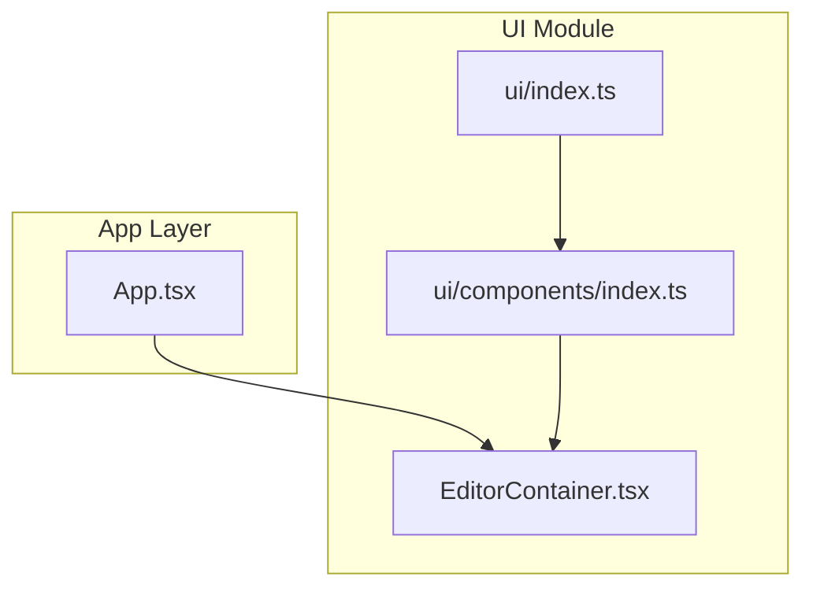
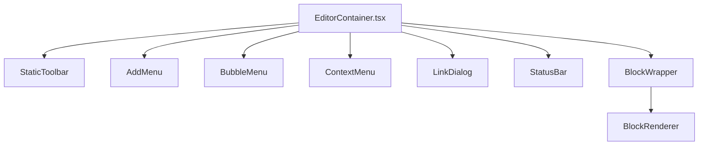
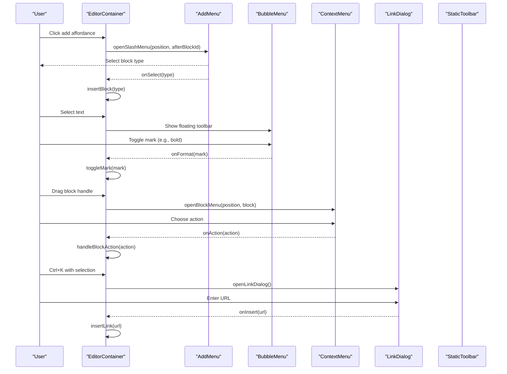
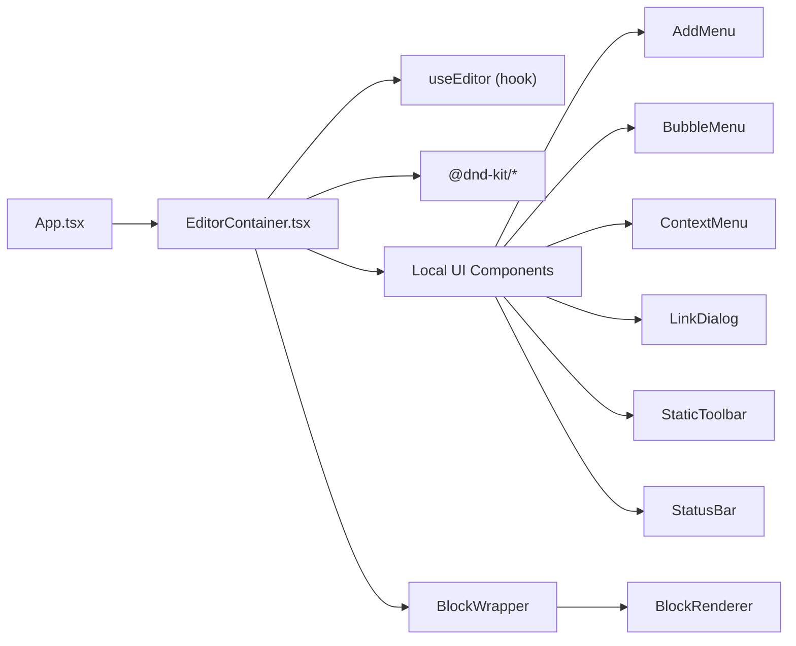

# UI Components

<cite>
**Referenced Files in This Document**
- [App.tsx](file://artoon-typer/src/App.tsx)
- [EditorContainer.tsx](file://artoon-typer/src/ui/components/EditorContainer.tsx)
- [index.ts](file://artoon-typer/src/ui/components/index.ts)
- [index.ts](file://artoon-typer/src/ui/index.ts)
- [EditorContainer.test.ts](file://artoon-typer/tests/ui/EditorContainer.test.ts)
- [AddMenu.test.ts](file://artoon-typer/tests/ui/AddMenu.test.ts)
- [ContextMenu.test.ts](file://artoon-typer/tests/ui/ContextMenu.test.ts)
- [InlineToolbar.test.ts](file://artoon-typer/tests/ui/InlineToolbar.test.ts)
</cite>

## Table of Contents
1. [Introduction](#introduction)
2. [Project Structure](#project-structure)
3. [Core Components](#core-components)
4. [Architecture Overview](#architecture-overview)
5. [Detailed Component Analysis](#detailed-component-analysis)
6. [Dependency Analysis](#dependency-analysis)
7. [Performance Considerations](#performance-considerations)
8. [Troubleshooting Guide](#troubleshooting-guide)
9. [Conclusion](#conclusion)
10. [Appendices](#appendices)

## Introduction
This document describes the ARTOON Typer UI component library, focusing on the main containers and interactive UI elements that power the block-based editor. It covers EditorContainer and PreviewPanel, interactive components such as AddMenu, BubbleMenu, ContextMenu, and InlineToolbar, and StatusBar. It also explains component props, events, styling approaches, integration patterns, accessibility, keyboard navigation, cross-browser compatibility, and how components compose with the block system.

## Project Structure
The UI module exports components, hooks, context, and styles. The main application integrates EditorContainer and PreviewPanel, and wires up menus and toolbars through EditorContainer.

**Diagram sources**
- [App.tsx:16-18](file://artoon-typer/src/App.tsx#L16-L18)
- [index.ts:1-18](file://artoon-typer/src/ui/index.ts#L1-L18)
- [index.ts:1-24](file://artoon-typer/src/ui/components/index.ts#L1-L24)
- [EditorContainer.tsx:1-387](file://artoon-typer/src/ui/components/EditorContainer.tsx#L1-L387)

**Section sources**
- [index.ts:1-18](file://artoon-typer/src/ui/index.ts#L1-L18)
- [index.ts:1-24](file://artoon-typer/src/ui/components/index.ts#L1-L24)
- [App.tsx:16-18](file://artoon-typer/src/App.tsx#L16-L18)

## Core Components
- EditorContainer: Main container that renders blocks, manages menus/toolbars, and orchestrates drag-and-drop via @dnd-kit. It exposes props for theme, placeholder, default direction, and callbacks for theme/direction toggles. It composes StaticToolbar, AddMenu, BubbleMenu, LinkDialog, ContextMenu, and StatusBar.
- PreviewPanel: Renders the current ARTOON content according to the selected preview theme. It is integrated in the App shell alongside EditorContainer.
- AddMenu: Slash menu triggered by clicking the add affordance or typing “/” to insert new blocks.
- BubbleMenu: Floating formatting menu that appears when text is selected.
- ContextMenu: Block-level actions menu activated by dragging handles or context triggers.
- InlineToolbar: Inline formatting toolbar (present in the UI inventory and tests).
- StatusBar: Editor status bar showing block count, theme, and direction.

Integration highlights:
- App.tsx wires EditorContainer with initial content, theme, and handlers for import/export, preview/source toggles, and theme switching.
- EditorContainer composes menus and toolbars and delegates block rendering to BlockWrapper and BlockRenderer.

**Section sources**
- [EditorContainer.tsx:47-54](file://artoon-typer/src/ui/components/EditorContainer.tsx#L47-L54)
- [EditorContainer.tsx:244-382](file://artoon-typer/src/ui/components/EditorContainer.tsx#L244-L382)
- [App.tsx:150-184](file://artoon-typer/src/App.tsx#L150-L184)

## Architecture Overview
The UI architecture centers around EditorContainer, which coordinates:
- Menus and toolbars
- Drag-and-drop reordering
- Block rendering and updates
- Status reporting

**Diagram sources**
- [EditorContainer.tsx:13-18](file://artoon-typer/src/ui/components/EditorContainer.tsx#L13-L18)
- [EditorContainer.tsx:276-320](file://artoon-typer/src/ui/components/EditorContainer.tsx#L276-L320)

## Detailed Component Analysis

### EditorContainer
- Purpose: Hosts the editor UI, renders blocks, manages menus/toolbars, and integrates drag-and-drop.
- Props:
  - className: Optional container class.
  - theme: Editor theme mode (light/dark).
  - placeholder: Initial placeholder text.
  - defaultDirection: Default text direction (rtl/ltr).
  - onThemeToggle/onDirectionToggle: Callbacks for theme/direction changes.
  - Additional editor options passed to useEditor.
- Events and callbacks:
  - Menu open/close: openSlashMenu, closeSlashMenu, openBlockMenu, closeBlockMenu, openLinkDialog, closeLinkDialog.
  - Formatting: toggleMark.
  - Block operations: addBlock, removeBlock, updateBlock, moveBlock, focusBlock, toggleBlockDirection, convertBlock.
  - Selection and positioning: hasTextSelection, selectionPosition.
- Composition:
  - Uses DndContext with SortableContext and DragOverlay for drag-and-drop.
  - Renders StaticToolbar, AddMenu, BubbleMenu, LinkDialog, ContextMenu, and StatusBar.
  - Delegates block rendering to BlockWrapper and BlockRenderer.
- Accessibility and keyboard:
  - Closes menus on Escape.
  - Supports Ctrl+B/I/U/K for formatting and link insertion.
  - Drag-and-drop supports keyboard sensors.
- Styling:
  - Applies theme classes and direction attributes.
  - Uses placeholder area to create the first block.

**Diagram sources**
- [EditorContainer.tsx:210-223](file://artoon-typer/src/ui/components/EditorContainer.tsx#L210-L223)
- [EditorContainer.tsx:188-207](file://artoon-typer/src/ui/components/EditorContainer.tsx#L188-L207)
- [EditorContainer.tsx:354-381](file://artoon-typer/src/ui/components/EditorContainer.tsx#L354-L381)

**Section sources**
- [EditorContainer.tsx:47-54](file://artoon-typer/src/ui/components/EditorContainer.tsx#L47-L54)
- [EditorContainer.tsx:106-167](file://artoon-typer/src/ui/components/EditorContainer.tsx#L106-L167)
- [EditorContainer.tsx:170-207](file://artoon-typer/src/ui/components/EditorContainer.tsx#L170-L207)
- [EditorContainer.tsx:236-382](file://artoon-typer/src/ui/components/EditorContainer.tsx#L236-L382)

### PreviewPanel
- Purpose: Renders the current ARTOON content into HTML using the selected preview theme.
- Integration: Toggled in App.tsx; displays a theme selector and renders content via the preview renderer pipeline.
- Props: Receives content string; no explicit props exported in the referenced file.
- Usage pattern: Controlled visibility via App state; content is re-rendered when contentKey changes.

**Section sources**
- [App.tsx:160-184](file://artoon-typer/src/App.tsx#L160-L184)

### AddMenu
- Purpose: Provides a searchable menu to insert new blocks after a given block.
- Trigger: Opened by clicking the add affordance or pressing “/” near a block.
- Props: isOpen, position, onSelect, onClose.
- Behavior: Closes when clicking outside the menu or pressing Escape.

**Section sources**
- [EditorContainer.tsx:354-359](file://artoon-typer/src/ui/components/EditorContainer.tsx#L354-L359)

### BubbleMenu
- Purpose: Floating toolbar for inline formatting when text is selected.
- Props: onFormat, onLink, activeMarks, disabled.
- Behavior: Appears near the selection; supports toggling marks and opening link dialog.

**Section sources**
- [EditorContainer.tsx:361-366](file://artoon-typer/src/ui/components/EditorContainer.tsx#L361-L366)

### ContextMenu
- Purpose: Block-level actions menu (e.g., delete, convert, move).
- Trigger: Activated by dragging the block handle or context trigger near a block.
- Props: isOpen, position, block, onAction, onClose.
- Behavior: Closes when clicking outside the menu or pressing Escape.

**Section sources**
- [EditorContainer.tsx:375-381](file://artoon-typer/src/ui/components/EditorContainer.tsx#L375-L381)

### InlineToolbar
- Purpose: Inline formatting toolbar (e.g., bold, italic, underline).
- Inventory presence: Exported in UI components index and tested in isolation.
- Integration: Typically rendered within block views or via BubbleMenu.

**Section sources**
- [index.ts:19-21](file://artoon-typer/src/ui/components/index.ts#L19-L21)
- [InlineToolbar.test.ts](file://artoon-typer/tests/ui/InlineToolbar.test.ts)

### StatusBar
- Purpose: Reports editor status (e.g., block count, theme, direction).
- Props: blockCount, theme, direction.
- Placement: Rendered below the editor content inside EditorContainer.

**Section sources**
- [EditorContainer.tsx:346-350](file://artoon-typer/src/ui/components/EditorContainer.tsx#L346-L350)

### BlockWrapper and BlockRenderer
- BlockWrapper: Adds focus handling, add affordances, drag handles, and direction toggles around each block.
- BlockRenderer: Renders the block’s content based on its type and meta, emitting updates and split events.

**Section sources**
- [EditorContainer.tsx:276-320](file://artoon-typer/src/ui/components/EditorContainer.tsx#L276-L320)

## Dependency Analysis
- EditorContainer depends on:
  - useEditor hook for editor state and operations.
  - @dnd-kit for drag-and-drop orchestration.
  - Local UI components (AddMenu, BubbleMenu, ContextMenu, LinkDialog, StaticToolbar, StatusBar).
  - BlockWrapper and BlockRenderer for block rendering.
- App.tsx depends on EditorContainer and PreviewPanel to assemble the editing experience.

**Diagram sources**
- [App.tsx:16-18](file://artoon-typer/src/App.tsx#L16-L18)
- [EditorContainer.tsx:10-18](file://artoon-typer/src/ui/components/EditorContainer.tsx#L10-L18)
- [EditorContainer.tsx:264-337](file://artoon-typer/src/ui/components/EditorContainer.tsx#L264-L337)

**Section sources**
- [App.tsx:16-18](file://artoon-typer/src/App.tsx#L16-L18)
- [EditorContainer.tsx:10-18](file://artoon-typer/src/ui/components/EditorContainer.tsx#L10-L18)

## Performance Considerations
- Drag-and-drop:
  - Uses @dnd-kit with vertical sorting strategy and window edge restrictions to keep interactions smooth.
  - Drag overlay uses a minimal rendering approach to avoid heavy computations during drag.
- Rendering:
  - Memoized block IDs and focused block lookup reduce unnecessary re-renders.
  - Conditional rendering of menus and dialogs prevents extra DOM nodes when closed.
- Keyboard shortcuts:
  - Short-circuit conditions (e.g., Escape) minimize work when closing menus.

**Section sources**
- [EditorContainer.tsx:106-167](file://artoon-typer/src/ui/components/EditorContainer.tsx#L106-L167)
- [EditorContainer.tsx:168-207](file://artoon-typer/src/ui/components/EditorContainer.tsx#L168-L207)
- [EditorContainer.tsx:264-337](file://artoon-typer/src/ui/components/EditorContainer.tsx#L264-L337)

## Troubleshooting Guide
- Menus not closing:
  - Ensure click-outside listeners are attached and Escape key handling is active.
- Drag-and-drop conflicts:
  - Verify sensors are configured and modifiers applied to constrain movement.
- Formatting not applying:
  - Confirm toggleMark is invoked from BubbleMenu and StaticToolbar.
- Preview not updating:
  - Ensure contentKey is incremented after editing the raw ARTOON source so the preview re-renders.

**Section sources**
- [EditorContainer.tsx:170-184](file://artoon-typer/src/ui/components/EditorContainer.tsx#L170-L184)
- [EditorContainer.tsx:186-207](file://artoon-typer/src/ui/components/EditorContainer.tsx#L186-L207)
- [EditorContainer.tsx:264-337](file://artoon-typer/src/ui/components/EditorContainer.tsx#L264-L337)
- [App.tsx:186-204](file://artoon-typer/src/App.tsx#L186-L204)

## Conclusion
The ARTOON Typer UI component library centers on EditorContainer, which composes menus, toolbars, and the block rendering system while integrating robust drag-and-drop and keyboard-driven workflows. PreviewPanel complements the editing experience by rendering content under selectable themes. The components are designed for extensibility, accessibility, and performance, with clear separation of concerns and straightforward integration patterns.

## Appendices

### Component Prop Reference Summary
- EditorContainer
  - Props: className, theme, placeholder, defaultDirection, onThemeToggle, onDirectionToggle, plus useEditor options.
  - Events: Menu open/close, formatting toggles, block operations, selection and positioning.
- AddMenu
  - Props: isOpen, position, onSelect, onClose.
- BubbleMenu
  - Props: onFormat, onLink, activeMarks, disabled.
- ContextMenu
  - Props: isOpen, position, block, onAction, onClose.
- InlineToolbar
  - Present in inventory and tests; typically receives formatting callbacks and selection state.
- StatusBar
  - Props: blockCount, theme, direction.
- PreviewPanel
  - Receives content; integrated in App with theme selector.

**Section sources**
- [EditorContainer.tsx:47-54](file://artoon-typer/src/ui/components/EditorContainer.tsx#L47-L54)
- [EditorContainer.tsx:354-381](file://artoon-typer/src/ui/components/EditorContainer.tsx#L354-L381)
- [index.ts:19-21](file://artoon-typer/src/ui/components/index.ts#L19-L21)
- [EditorContainer.tsx:346-350](file://artoon-typer/src/ui/components/EditorContainer.tsx#L346-L350)
- [App.tsx:160-184](file://artoon-typer/src/App.tsx#L160-L184)

### Accessibility and Keyboard Navigation
- Menus close on Escape.
- Keyboard shortcuts for formatting (Ctrl+B/I/U) and link insertion (Ctrl+K).
- Drag-and-drop supports keyboard sensors for accessibility.

**Section sources**
- [EditorContainer.tsx:188-207](file://artoon-typer/src/ui/components/EditorContainer.tsx#L188-L207)

### Cross-Browser Compatibility
- Uses standard DOM APIs and @dnd-kit for cross-device support.
- Avoids browser-specific APIs; relies on React and CSS custom properties for theming.

**Section sources**
- [EditorContainer.tsx:264-337](file://artoon-typer/src/ui/components/EditorContainer.tsx#L264-L337)

### Integration Patterns
- App.tsx demonstrates:
  - Passing initial content and handlers to EditorContainer.
  - Toggling preview/source panels.
  - Managing theme and direction preferences.
- Tests validate component behavior independently.

**Section sources**
- [App.tsx:88-127](file://artoon-typer/src/App.tsx#L88-L127)
- [EditorContainer.test.ts](file://artoon-typer/tests/ui/EditorContainer.test.ts)
- [AddMenu.test.ts](file://artoon-typer/tests/ui/AddMenu.test.ts)
- [ContextMenu.test.ts](file://artoon-typer/tests/ui/ContextMenu.test.ts)
- [InlineToolbar.test.ts](file://artoon-typer/tests/ui/InlineToolbar.test.ts)