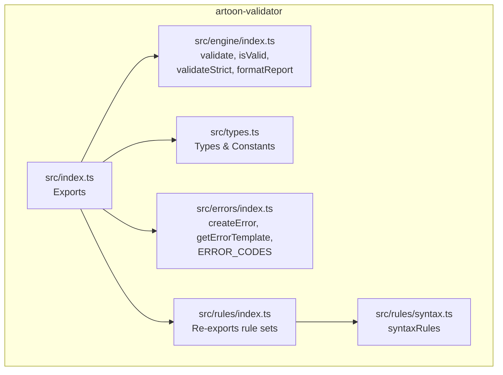
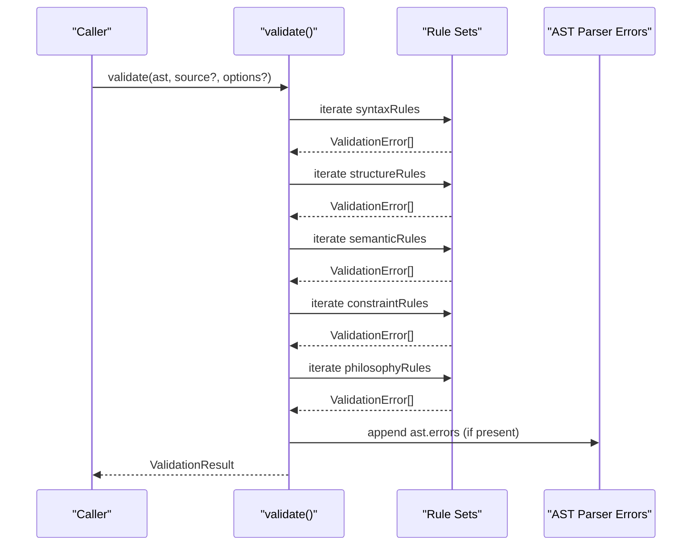
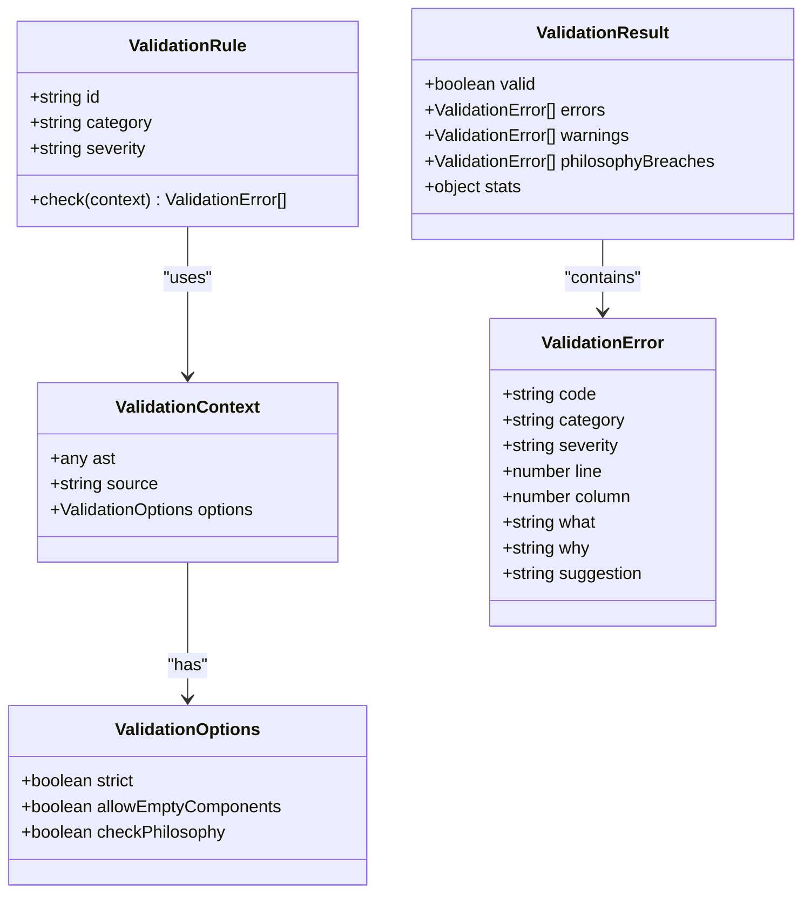
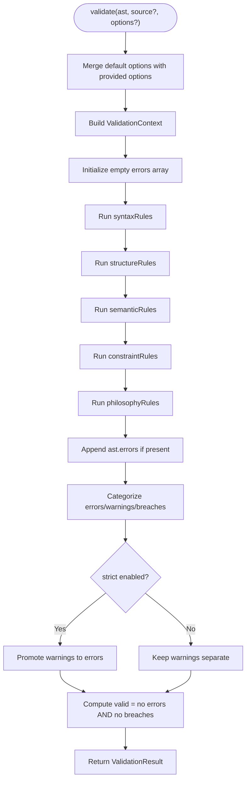
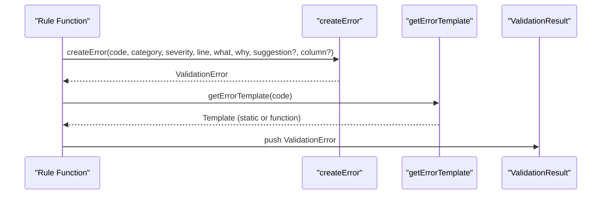
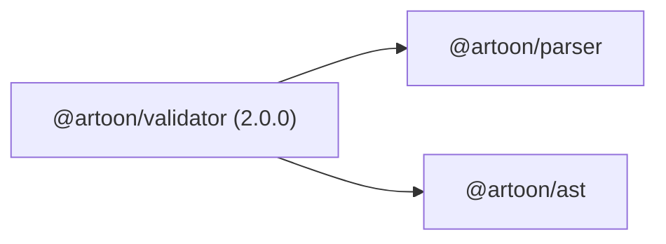

# API Reference

<cite>
**Referenced Files in This Document**
- [index.ts](file://artoon-validator/src/index.ts)
- [engine/index.ts](file://artoon-validator/src/engine/index.ts)
- [types.ts](file://artoon-validator/src/types.ts)
- [errors/index.ts](file://artoon-validator/src/errors/index.ts)
- [rules/index.ts](file://artoon-validator/src/rules/index.ts)
- [rules/syntax.ts](file://artoon-validator/src/rules/syntax.ts)
- [package.json](file://artoon-validator/package.json)
- [README.md](file://artoon-validator/README.md)
- [integration.test.ts](file://artoon-validator/tests/integration.test.ts)
- [rules.test.ts](file://artoon-validator/tests/rules.test.ts)
</cite>

## Table of Contents
1. [Introduction](#introduction)
2. [Project Structure](#project-structure)
3. [Core Components](#core-components)
4. [Architecture Overview](#architecture-overview)
5. [Detailed Component Analysis](#detailed-component-analysis)
6. [Dependency Analysis](#dependency-analysis)
7. [Performance Considerations](#performance-considerations)
8. [Troubleshooting Guide](#troubleshooting-guide)
9. [Conclusion](#conclusion)
10. [Appendices](#appendices)

## Introduction
This document provides a comprehensive API reference for the ARTOON Validator package. It covers exported functions for validation and reporting, rule categories for customization, and utility functions for error handling. It also documents TypeScript types, error codes, and integration patterns with ARTOON packages such as @artoon/parser and @artoon/ast.

## Project Structure
The ARTOON Validator package exposes a small, focused API surface:
- Engine exports: validate, isValid, validateStrict, formatReport
- Rule exports: syntaxRules, structureRules, semanticRules, constraintRules, philosophyRules
- Error utilities: createError, getErrorTemplate, ERROR_CODES
- Version export: VERSION

**Diagram sources**
- [index.ts:1-30](file://artoon-validator/src/index.ts#L1-L30)
- [engine/index.ts:1-178](file://artoon-validator/src/engine/index.ts#L1-L178)
- [types.ts:1-167](file://artoon-validator/src/types.ts#L1-L167)
- [errors/index.ts:1-80](file://artoon-validator/src/errors/index.ts#L1-L80)
- [rules/index.ts:1-15](file://artoon-validator/src/rules/index.ts#L1-L15)
- [rules/syntax.ts:1-127](file://artoon-validator/src/rules/syntax.ts#L1-L127)

**Section sources**
- [index.ts:1-30](file://artoon-validator/src/index.ts#L1-L30)
- [README.md:1-137](file://artoon-validator/README.md#L1-L137)

## Core Components
- validate(ast, source?, options?): Validates an AST against all rule categories and returns a structured result.
- isValid(ast, source?): Returns a boolean indicating whether the document is valid.
- validateStrict(ast, source?): Throws if validation fails; otherwise returns void.
- formatReport(result): Produces a human-readable validation report.
- Rule sets: syntaxRules, structureRules, semanticRules, constraintRules, philosophyRules
- Error utilities: createError, getErrorTemplate, ERROR_CODES
- Version: VERSION

**Section sources**
- [engine/index.ts:27-178](file://artoon-validator/src/engine/index.ts#L27-L178)
- [index.ts:6-29](file://artoon-validator/src/index.ts#L6-L29)
- [errors/index.ts:8-80](file://artoon-validator/src/errors/index.ts#L8-L80)
- [types.ts:76-106](file://artoon-validator/src/types.ts#L76-L106)

## Architecture Overview
The validator composes five rule categories and integrates with parser/AST outputs. The engine merges rule errors, parser errors, and philosophy checks into a single result.

**Diagram sources**
- [engine/index.ts:27-100](file://artoon-validator/src/engine/index.ts#L27-L100)
- [rules/index.ts:3-7](file://artoon-validator/src/rules/index.ts#L3-L7)

## Detailed Component Analysis

### validate(ast, source?, options?)
- Purpose: Runs all validation categories against the AST and produces a comprehensive result.
- Parameters:
  - ast: AST object compatible with ARTOONDocument or generic object. When an AST produced by @artoon/parser/@artoon/ast is used, it may include parser errors attached to the AST.
  - source?: Original source string used to compute line/column positions for syntax-related checks.
  - options: ValidationOptions (see below).
- Returns: ValidationResult containing validity, categorized errors, and statistics.
- Behavior:
  - Merges parser errors from ast.errors into the result set.
  - Filters philosophyBreaches separately; strict mode elevates warnings to errors.
- Options:
  - strict?: Treat warnings as errors.
  - allowEmptyComponents?: Controls whether empty component warnings are emitted.
  - checkPhilosophy?: Enables/disables philosophy rule checks.
- Error conditions:
  - No explicit thrown exceptions; returns a failing ValidationResult when errors exist.
- Usage example:
  - See integration tests invoking validate with parsed and transformed AST and source text.

**Section sources**
- [engine/index.ts:27-100](file://artoon-validator/src/engine/index.ts#L27-L100)
- [types.ts:67-71](file://artoon-validator/src/types.ts#L67-L71)
- [integration.test.ts:9-30](file://artoon-validator/tests/integration.test.ts#L9-L30)

### isValid(ast, source?)
- Purpose: Lightweight boolean check for quick validation.
- Parameters:
  - ast: AST object.
  - source?: Optional original source string.
- Returns: boolean indicating validity.
- Behavior: Delegates to validate and returns the valid flag.
- Usage example:
  - See integration tests using isValid for concise checks.

**Section sources**
- [engine/index.ts:105-108](file://artoon-validator/src/engine/index.ts#L105-L108)
- [integration.test.ts:43-52](file://artoon-validator/tests/integration.test.ts#L43-L52)

### validateStrict(ast, source?)
- Purpose: Fail-fast validation that throws on failure.
- Parameters:
  - ast: AST object.
  - source?: Optional original source string.
- Returns: void on success.
- Behavior:
  - Calls validate with strict: true.
  - Throws an aggregated error message if validation fails.
- Error conditions:
  - Throws when result.valid is false.
- Usage example:
  - See integration tests asserting validateStrict throws on philosophy breaches.

**Section sources**
- [engine/index.ts:113-124](file://artoon-validator/src/engine/index.ts#L113-L124)
- [integration.test.ts:54-60](file://artoon-validator/tests/integration.test.ts#L54-L60)

### formatReport(result)
- Purpose: Generates a human-readable summary of validation outcomes.
- Parameters:
  - result: ValidationResult from validate.
- Returns: Formatted string report.
- Behavior:
  - Includes validity status, counts, and categorized sections for philosophy breaches, errors, and warnings.
  - Adds explanatory “Why” and optional “Fix” suggestions where available.
- Usage example:
  - See integration tests verifying presence of expected sections in the report.

**Section sources**
- [engine/index.ts:129-177](file://artoon-validator/src/engine/index.ts#L129-L177)
- [integration.test.ts:78-101](file://artoon-validator/tests/integration.test.ts#L78-L101)

### Rule Exports
- syntaxRules: Array of syntax validators (e.g., spacing after separators, unclosed brackets).
- structureRules: Array of structural validators (e.g., unclosed blocks, nesting rules).
- semanticRules: Array of semantic validators (e.g., modifier applicability, required attributes).
- constraintRules: Array of constraint validators (e.g., inline lists, nested inline).
- philosophyRules: Array of philosophy validators (e.g., presentation/behavior leaks).

These arrays are re-exported from src/rules/index.ts and consumed by the engine.

**Section sources**
- [rules/index.ts:3-7](file://artoon-validator/src/rules/index.ts#L3-L7)
- [rules/syntax.ts:122-126](file://artoon-validator/src/rules/syntax.ts#L122-L126)
- [README.md:59-89](file://artoon-validator/README.md#L59-L89)

### Utility Exports
- createError(code, category, severity, line, what, why, suggestion?, column?): Constructs a ValidationError object.
- getErrorTemplate(code): Retrieves a template for a given error code; templates may be static strings or functions accepting parameters.
- ERROR_CODES: Enumerated constants for all validation error categories and codes.

Usage patterns:
- createError is used internally by rule functions to produce ValidationError entries.
- getErrorTemplate is used to derive localized “what”, “why”, and “suggestion”.

**Section sources**
- [errors/index.ts:8-79](file://artoon-validator/src/errors/index.ts#L8-L79)
- [types.ts:76-106](file://artoon-validator/src/types.ts#L76-L106)

### TypeScript Types and Interfaces
Key types and constants:
- Severity: 'error' | 'warning' | 'philosophy'
- ErrorCategory: 'syntax' | 'structure' | 'semantic' | 'constraint' | 'philosophy'
- ValidationError: code, category, severity, line, column?, what, why, suggestion?
- ValidationResult: valid, errors[], warnings[], philosophyBreaches[], stats
- ValidationOptions: strict?, allowEmptyComponents?, checkPhilosophy?
- ValidationContext: ast, source?, options
- ValidationRule: id, category, severity, check(context): ValidationError[]
- Constants:
  - ERROR_CODES (SYN001–SYN004, STR001–STR005, SEM001–SEM005, CON001–CON003, PHI001–PHI003)
  - MODIFIER_ACCEPTING, NO_MODIFIER, VALID_MODIFIERS
  - REQUIRED_ATTRIBUTES, OPTIONAL_ATTRIBUTES
  - PRESENTATION_KEYWORDS, BEHAVIOR_KEYWORDS

These types define the contract for rules, errors, and configuration.

**Section sources**
- [types.ts:8-167](file://artoon-validator/src/types.ts#L8-L167)

### Generic Type Parameters
- ValidationRule.check accepts ValidationContext and returns ValidationError[].
- ERROR_MESSAGES may return either a static template object or a function template for dynamic “what”/“suggestion”.

**Section sources**
- [types.ts:48-62](file://artoon-validator/src/types.ts#L48-L62)
- [errors/index.ts:33-69](file://artoon-validator/src/errors/index.ts#L33-L69)

### Integration Patterns
- Typical pipeline:
  - Parse source with @artoon/parser
  - Transform parse result to AST with @artoon/ast
  - Validate AST with @artoon/validator
  - Optionally format report with formatReport
- Example references:
  - Integration tests demonstrate the full pipeline and options usage.

**Section sources**
- [integration.test.ts:3-5](file://artoon-validator/tests/integration.test.ts#L3-L5)
- [README.md:13-45](file://artoon-validator/README.md#L13-L45)

## Architecture Overview

**Diagram sources**
- [types.ts:18-62](file://artoon-validator/src/types.ts#L18-L62)

## Detailed Component Analysis

### validate Function Flow

**Diagram sources**
- [engine/index.ts:27-100](file://artoon-validator/src/engine/index.ts#L27-L100)

### Error Creation and Templates

**Diagram sources**
- [errors/index.ts:8-79](file://artoon-validator/src/errors/index.ts#L8-L79)
- [engine/index.ts:58-72](file://artoon-validator/src/engine/index.ts#L58-L72)

## Dependency Analysis
- Internal dependencies:
  - engine/index.ts depends on types.ts for interfaces and ERROR_CODES.
  - engine/index.ts imports rule sets from src/rules/*.
  - errors/index.ts depends on types.ts for ValidationError and ERROR_CODES.
- External dependencies:
  - @artoon/parser and @artoon/ast are declared in package.json.
- Version:
  - Package version is 2.0.0; VERSION constant is 1.0.0 in src/index.ts.

**Diagram sources**
- [package.json:14-17](file://artoon-validator/package.json#L14-L17)

**Section sources**
- [package.json:14-25](file://artoon-validator/package.json#L14-L25)
- [index.ts:29](file://artoon-validator/src/index.ts#L29)

## Performance Considerations
- validate iterates through all rule categories and all rules linearly with respect to the number of rules; complexity is O(Rules).
- For large documents, consider disabling philosophy checks via options.checkPhilosophy if not needed.
- Strict mode adds minimal overhead by promoting warnings to errors.

[No sources needed since this section provides general guidance]

## Troubleshooting Guide
Common issues and resolutions:
- Philosophy Breach (PHI001/PHI002/PHI003): Remove presentation or behavior keywords from content; philosophy rules are enforced by philosophyRules.
- Empty Component Warning: Provide meaningful content or adjust options.allowEmptyComponents.
- Parser Errors: When using AST from @artoon/parser/@artoon/ast, parser errors are automatically included; resolve underlying parsing issues first.

**Section sources**
- [engine/index.ts:58-72](file://artoon-validator/src/engine/index.ts#L58-L72)
- [integration.test.ts:154-179](file://artoon-validator/tests/integration.test.ts#L154-L179)
- [README.md:85-89](file://artoon-validator/README.md#L85-L89)

## Conclusion
The ARTOON Validator package offers a compact, extensible validation API that integrates seamlessly with @artoon/parser and @artoon/ast. Its rule categories and utilities enable robust linting and philosophy enforcement, while the engine’s options provide flexibility for different workflows.

[No sources needed since this section summarizes without analyzing specific files]

## Appendices

### API Summary Table
- Functions
  - validate(ast, source?, options?): Validates and returns ValidationResult.
  - isValid(ast, source?): Boolean shortcut.
  - validateStrict(ast, source?): Throws on failure.
  - formatReport(result): Human-readable report.
- Rule Sets
  - syntaxRules, structureRules, semanticRules, constraintRules, philosophyRules
- Utilities
  - createError, getErrorTemplate, ERROR_CODES
- Version
  - VERSION

**Section sources**
- [engine/index.ts:27-178](file://artoon-validator/src/engine/index.ts#L27-L178)
- [index.ts:6-29](file://artoon-validator/src/index.ts#L6-L29)
- [errors/index.ts:8-79](file://artoon-validator/src/errors/index.ts#L8-L79)
- [types.ts:76-106](file://artoon-validator/src/types.ts#L76-L106)
- [index.ts:29](file://artoon-validator/src/index.ts#L29)

### TypeScript Type Definitions
- Severity, ErrorCategory, ValidationError, ValidationResult, ValidationRule, ValidationContext, ValidationOptions
- ERROR_CODES, modifier acceptance lists, required/optional attributes, philosophy keyword sets

**Section sources**
- [types.ts:8-167](file://artoon-validator/src/types.ts#L8-L167)

### Compatibility and Integration Notes
- Depends on @artoon/parser and @artoon/ast.
- Version 2.0.0 of @artoon/validator aligns with ARTOON v2.0 AST and parser APIs.

**Section sources**
- [package.json:14-17](file://artoon-validator/package.json#L14-L17)
- [README.md:13-45](file://artoon-validator/README.md#L13-L45)