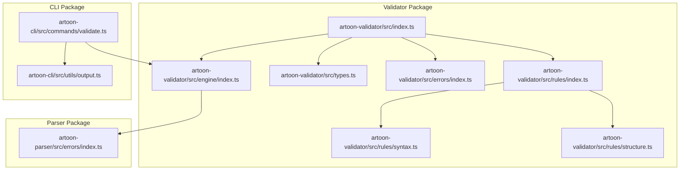
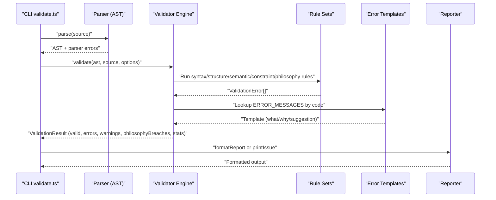
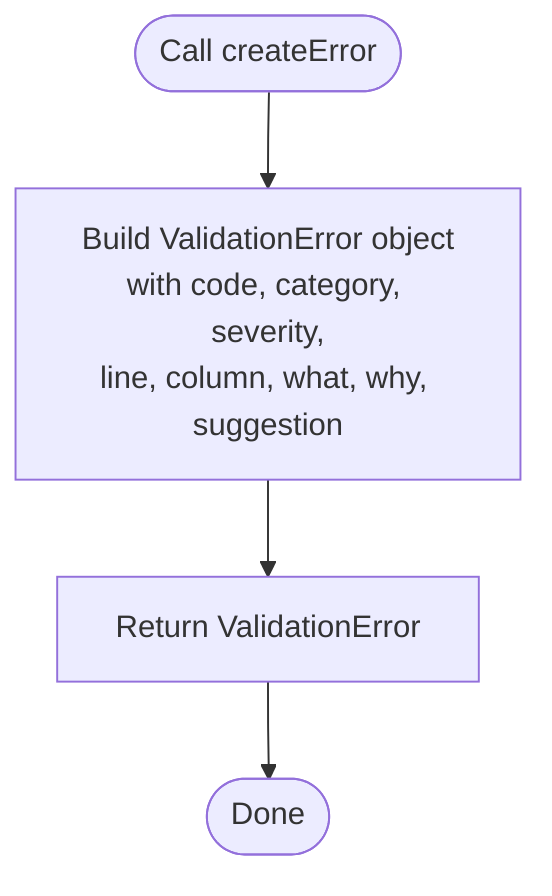
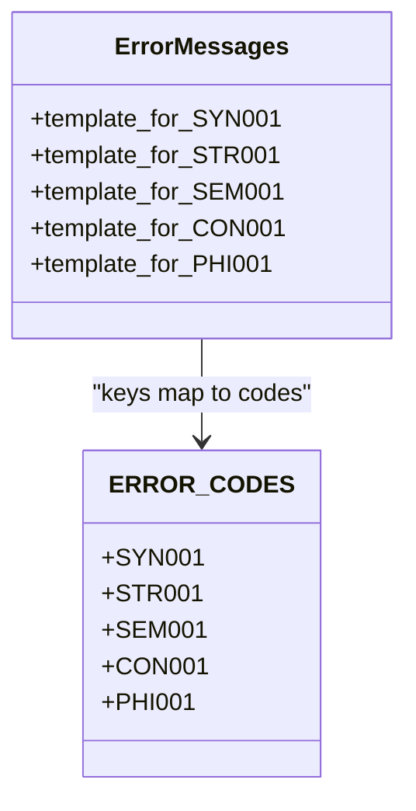
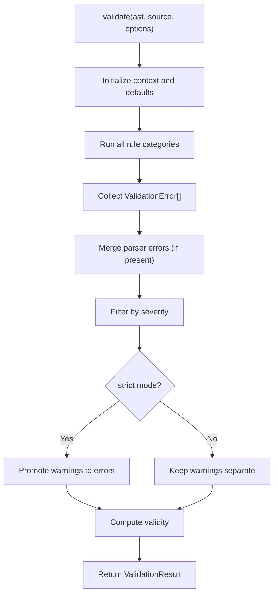
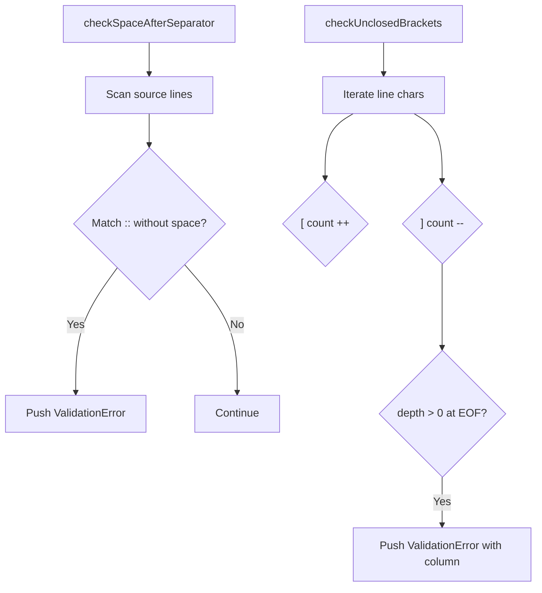
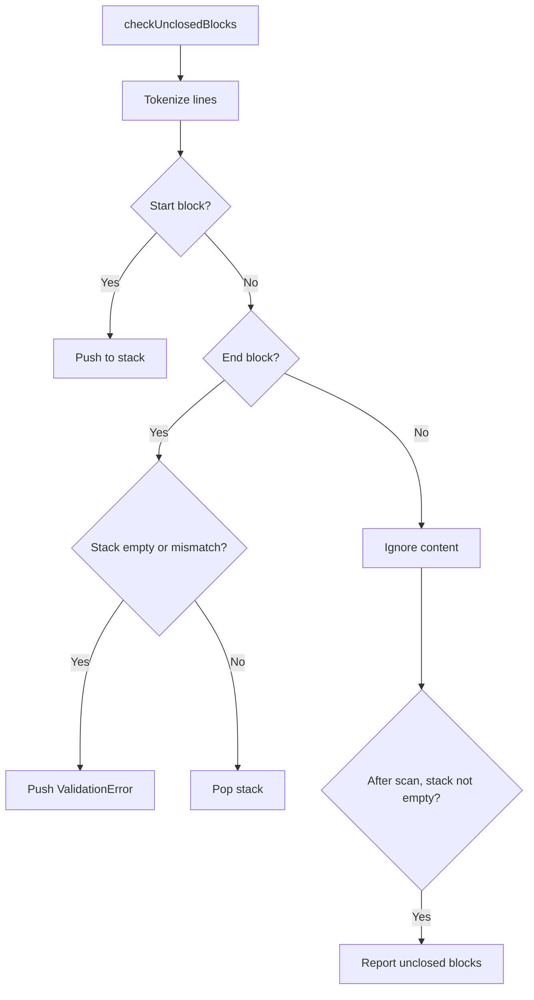
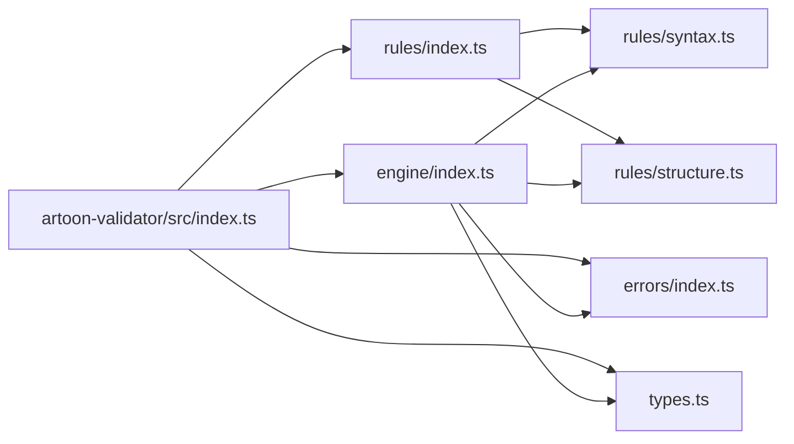

# Error Handling and Reporting

<cite>
**Referenced Files in This Document**
- [index.ts](file://artoon-validator/src/index.ts)
- [types.ts](file://artoon-validator/src/types.ts)
- [errors/index.ts](file://artoon-validator/src/errors/index.ts)
- [engine/index.ts](file://artoon-validator/src/engine/index.ts)
- [rules/index.ts](file://artoon-validator/src/rules/index.ts)
- [rules/syntax.ts](file://artoon-validator/src/rules/syntax.ts)
- [rules/structure.ts](file://artoon-validator/src/rules/structure.ts)
- [CLI validate command](file://artoon-cli/src/commands/validate.ts)
- [CLI output formatter](file://artoon-cli/src/utils/output.ts)
- [Parser error handler](file://artoon-parser/src/errors/index.ts)
</cite>

## Table of Contents
1. [Introduction](#introduction)
2. [Project Structure](#project-structure)
3. [Core Components](#core-components)
4. [Architecture Overview](#architecture-overview)
5. [Detailed Component Analysis](#detailed-component-analysis)
6. [Dependency Analysis](#dependency-analysis)
7. [Performance Considerations](#performance-considerations)
8. [Troubleshooting Guide](#troubleshooting-guide)
9. [Conclusion](#conclusion)

## Introduction
This document describes the ARTOON validation error handling system. It covers error creation utilities, standardized error templates, error code catalogs, classification and severity semantics, diagnostic message generation, and integration with validation reports. It also explains how validation errors relate to AST node locations and provides practical examples for custom error creation, filtering, and debugging techniques.

## Project Structure
The validation system spans several packages:
- artoon-validator: Central validation engine, rule sets, and error utilities
- artoon-cli: Command-line integration that consumes validation results and formats output
- artoon-parser: Parser that produces structured parse errors, which the validator aggregates into the final report
- artoon-ast: Shared AST types consumed by the validator

**Diagram sources**
- [index.ts:1-30](file://artoon-validator/src/index.ts#L1-L30)
- [engine/index.ts:1-178](file://artoon-validator/src/engine/index.ts#L1-L178)
- [types.ts:1-167](file://artoon-validator/src/types.ts#L1-L167)
- [errors/index.ts:1-80](file://artoon-validator/src/errors/index.ts#L1-L80)
- [rules/index.ts:1-15](file://artoon-validator/src/rules/index.ts#L1-L15)
- [rules/syntax.ts:1-127](file://artoon-validator/src/rules/syntax.ts#L1-L127)
- [rules/structure.ts:1-195](file://artoon-validator/src/rules/structure.ts#L1-L195)
- [CLI validate command:49-92](file://artoon-cli/src/commands/validate.ts#L49-L92)
- [CLI output formatter:1-51](file://artoon-cli/src/utils/output.ts#L1-L51)
- [Parser error handler:1-153](file://artoon-parser/src/errors/index.ts#L1-L153)

**Section sources**
- [index.ts:1-30](file://artoon-validator/src/index.ts#L1-L30)
- [engine/index.ts:1-178](file://artoon-validator/src/engine/index.ts#L1-L178)
- [CLI validate command:49-92](file://artoon-cli/src/commands/validate.ts#L49-L92)

## Core Components
- Error model and severity: The system defines a structured ValidationError with fields for code, category, severity, location (line/column), and human-readable diagnostics (what, why, suggestion). Severity supports three levels: error, warning, and philosophy.
- Error creation utilities: A factory function creates ValidationError instances with consistent structure and optional column positioning.
- Standardized error templates: A registry maps error codes to template objects containing localized what/why/suggestion messages, with support for parameterized templates.
- Error code catalog: A centralized ERROR_CODES object enumerates canonical codes across syntax, structure, semantic, constraint, and philosophy categories.
- Validation engine: Orchestrates rule execution, merges parser errors, categorizes results, and produces a consolidated report with statistics.
- CLI integration: Transforms validation results into user-friendly console output and respects strict mode behavior.

**Section sources**
- [types.ts:15-43](file://artoon-validator/src/types.ts#L15-L43)
- [errors/index.ts:8-28](file://artoon-validator/src/errors/index.ts#L8-L28)
- [errors/index.ts:33-69](file://artoon-validator/src/errors/index.ts#L33-L69)
- [types.ts:76-106](file://artoon-validator/src/types.ts#L76-L106)
- [engine/index.ts:27-100](file://artoon-validator/src/engine/index.ts#L27-L100)
- [CLI output formatter:32-51](file://artoon-cli/src/utils/output.ts#L32-L51)

## Architecture Overview
The validation pipeline integrates parsing, rule evaluation, and reporting:

**Diagram sources**
- [CLI validate command:55-92](file://artoon-cli/src/commands/validate.ts#L55-L92)
- [engine/index.ts:27-100](file://artoon-validator/src/engine/index.ts#L27-L100)
- [rules/index.ts:1-15](file://artoon-validator/src/rules/index.ts#L1-L15)
- [errors/index.ts:74-76](file://artoon-validator/src/errors/index.ts#L74-L76)
- [engine/index.ts:129-177](file://artoon-validator/src/engine/index.ts#L129-L177)

## Detailed Component Analysis

### Error Model and Severity Semantics
- Severity levels:
  - error: Blocks parsing, prevents rendering, must fix
  - warning: Allows parsing, may cause issues, should fix
  - philosophy: Allows parsing, violates ARTOON philosophy, optional fix
- Categories:
  - syntax: Source-level formatting and token-level issues
  - structure: Block and nesting correctness
  - semantic: Component and attribute validity
  - constraint: Structural constraints (e.g., inline-only contexts)
  - philosophy: Principle violations (presentation/behavior leakage)

**Section sources**
- [types.ts:6-13](file://artoon-validator/src/types.ts#L6-L13)
- [types.ts:67-71](file://artoon-validator/src/types.ts#L67-L71)
- [EDITOR-UI-DEVELOPMENT-PLAN/.../04-ERROR-HANDLING-VALIDATION.md:61-77](file://EDITOR-UI-DEVELOPMENT-PLAN/dev-docs/04-ERROR-HANDLING-VALIDATION.md#L61-L77)

### Error Creation Utilities
- Factory function: createError accepts code, category, severity, line, what, why, optional suggestion, and optional column, returning a ValidationError.
- Template lookup: getErrorTemplate retrieves a template by code for generating localized diagnostics.

**Diagram sources**
- [errors/index.ts:8-28](file://artoon-validator/src/errors/index.ts#L8-L28)

**Section sources**
- [errors/index.ts:8-28](file://artoon-validator/src/errors/index.ts#L8-L28)
- [errors/index.ts:74-76](file://artoon-validator/src/errors/index.ts#L74-L76)

### Error Code Catalog
- Syntax: MISSING_SPACE_AFTER_SEPARATOR, UNCLOSED_BRACKET, INVALID_DIRECTION_MARKER, MALFORMED_COMPONENT
- Structure: UNCLOSED_BLOCK, MISMATCHED_BLOCK_NAME, ORPHAN_LIST_ITEM, INVALID_NESTING, EMPTY_COMPOUND
- Semantic: MODIFIER_ON_NON_TEXT, INVALID_ATTRIBUTE, MISSING_REQUIRED_ATTRIBUTE, UNKNOWN_COMPONENT, INVALID_MODIFIER
- Constraint: INLINE_LIST, NESTED_INLINE, EMPTY_COMPONENT
- Philosophy: PRESENTATION_LEAK, BEHAVIOR_LEAK, SEMANTIC_VIOLATION

**Section sources**
- [types.ts:76-106](file://artoon-validator/src/types.ts#L76-L106)

### Standardized Error Templates
- Templates define what, why, and suggestion for each code. Some templates are parameterized (e.g., accept arguments for dynamic content).
- The template registry is keyed by ERROR_CODES entries.

**Diagram sources**
- [errors/index.ts:33-69](file://artoon-validator/src/errors/index.ts#L33-L69)
- [types.ts:76-106](file://artoon-validator/src/types.ts#L76-L106)

**Section sources**
- [errors/index.ts:33-69](file://artoon-validator/src/errors/index.ts#L33-L69)

### Validation Engine and Reporting
- Execution flow:
  - Merge parser errors into the validation result set
  - Categorize by severity into errors, warnings, and philosophyBreaches
  - In strict mode, warnings are elevated to errors
  - Compute validity based on remaining errors and philosophy breaches
- Report formatting:
  - Human-readable summary with counts
  - Sections for philosophy breaches, errors, and warnings
  - Includes why and suggested fixes when available

**Diagram sources**
- [engine/index.ts:27-100](file://artoon-validator/src/engine/index.ts#L27-L100)

**Section sources**
- [engine/index.ts:27-100](file://artoon-validator/src/engine/index.ts#L27-L100)
- [engine/index.ts:129-177](file://artoon-validator/src/engine/index.ts#L129-L177)

### Rule Categories and Examples

#### Syntax Rules
- Space after separator: Detects missing spaces after :: in source lines.
- Unclosed brackets: Tracks bracket depth in inline content and reports unclosed [.
- Direction markers: Validates directional markers outside block content.

**Diagram sources**
- [rules/syntax.ts:8-34](file://artoon-validator/src/rules/syntax.ts#L8-L34)
- [rules/syntax.ts:39-75](file://artoon-validator/src/rules/syntax.ts#L39-L75)

**Section sources**
- [rules/syntax.ts:1-127](file://artoon-validator/src/rules/syntax.ts#L1-L127)

#### Structure Rules
- Unclosed blocks: Uses a stack to track opening/closing block names and reports mismatches and orphans.
- List nesting: Enforces single-level jumps in nested lists.
- Empty compounds: Recursively checks compound components for child content.

**Diagram sources**
- [rules/structure.ts:8-75](file://artoon-validator/src/rules/structure.ts#L8-L75)

**Section sources**
- [rules/structure.ts:1-195](file://artoon-validator/src/rules/structure.ts#L1-L195)

### Relationship Between Validation Errors and AST Node Locations
- Parser errors embedded in the AST are merged into the validation result with their original line/column positions.
- Rule-based validations compute line numbers from the source text and, where applicable, column indices for precise highlighting.

**Section sources**
- [engine/index.ts:58-72](file://artoon-validator/src/engine/index.ts#L58-L72)
- [rules/syntax.ts:13-31](file://artoon-validator/src/rules/syntax.ts#L13-L31)
- [rules/structure.ts:13-72](file://artoon-validator/src/rules/structure.ts#L13-L72)

### Error Reporting Format and Diagnostic Generation
- The validator’s formatReport method generates a human-readable report with:
  - Summary validity
  - Statistics counters
  - Sections for philosophy breaches, errors, and warnings
  - Detailed why and suggestions when available
- CLI output formatter converts validation issues into colored console messages with severity prefixes and optional line metadata.

**Section sources**
- [engine/index.ts:129-177](file://artoon-validator/src/engine/index.ts#L129-L177)
- [CLI output formatter:32-51](file://artoon-cli/src/utils/output.ts#L32-L51)

### Integration with Validation Reports
- The CLI validate command transforms ValidationResult into a flat list of issues for console output, respecting strict mode behavior (promoting warnings to errors).

**Section sources**
- [CLI validate command:55-92](file://artoon-cli/src/commands/validate.ts#L55-L92)

## Dependency Analysis
The validator exports a cohesive API surface and composes rule sets and error utilities:

**Diagram sources**
- [index.ts:1-30](file://artoon-validator/src/index.ts#L1-L30)
- [engine/index.ts:1-178](file://artoon-validator/src/engine/index.ts#L1-L178)
- [rules/index.ts:1-15](file://artoon-validator/src/rules/index.ts#L1-L15)

**Section sources**
- [index.ts:1-30](file://artoon-validator/src/index.ts#L1-L30)
- [rules/index.ts:1-15](file://artoon-validator/src/rules/index.ts#L1-L15)

## Performance Considerations
- Source scanning rules iterate line-by-line and character-by-character; ensure inputs are reasonably sized to avoid excessive memory churn.
- Template lookups are O(1) via object property access.
- Strict mode adds minimal overhead by merging arrays rather than reprocessing.

## Troubleshooting Guide
- Custom error creation:
  - Use createError to produce ValidationError entries with appropriate category and severity.
  - Reference ERROR_CODES for canonical codes; supply localized what/why/suggestion or use getErrorTemplate to resolve templates.
- Error filtering:
  - Access result.errors, result.warnings, and result.philosophyBreaches separately for targeted handling.
  - In strict mode, warnings are promoted to errors; adjust options accordingly.
- Debugging techniques:
  - Enable checkPhilosophy to surface principle violations.
  - Use formatReport for a quick human-readable summary.
  - Inspect ValidationError fields (code, line, column, what, why, suggestion) to pinpoint issues.
  - Leverage parser errors merged into the result for deeper context.

**Section sources**
- [errors/index.ts:8-28](file://artoon-validator/src/errors/index.ts#L8-L28)
- [errors/index.ts:74-76](file://artoon-validator/src/errors/index.ts#L74-L76)
- [engine/index.ts:18-22](file://artoon-validator/src/engine/index.ts#L18-L22)
- [engine/index.ts:129-177](file://artoon-validator/src/engine/index.ts#L129-L177)

## Conclusion
The ARTOON validation system provides a robust, extensible framework for detecting and reporting errors across syntax, structure, semantics, constraints, and philosophy. Its standardized error model, centralized code catalog, and template-driven diagnostics enable consistent, actionable feedback. Integration with the CLI and parser ensures end-to-end validation visibility, while strict mode and categorized outputs support flexible workflows from development to production.