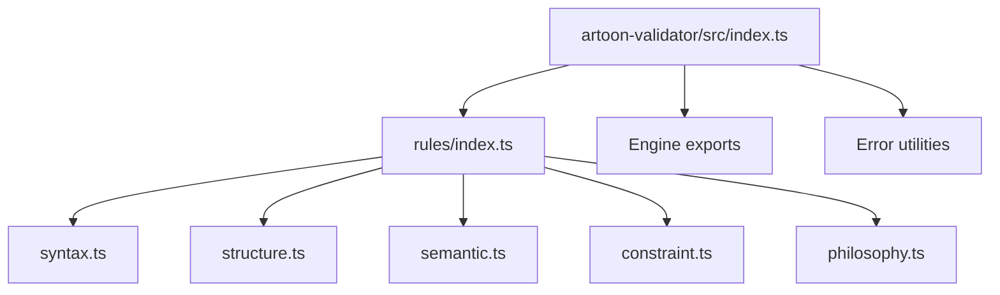
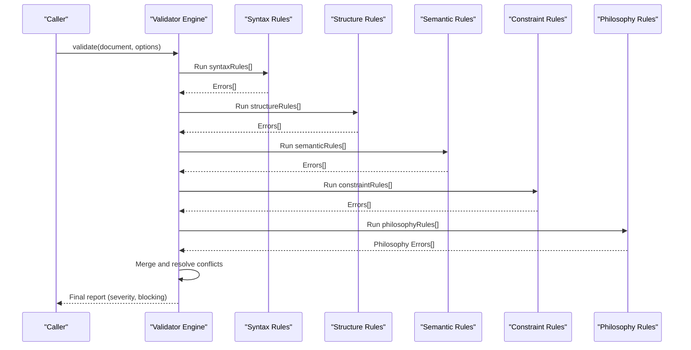
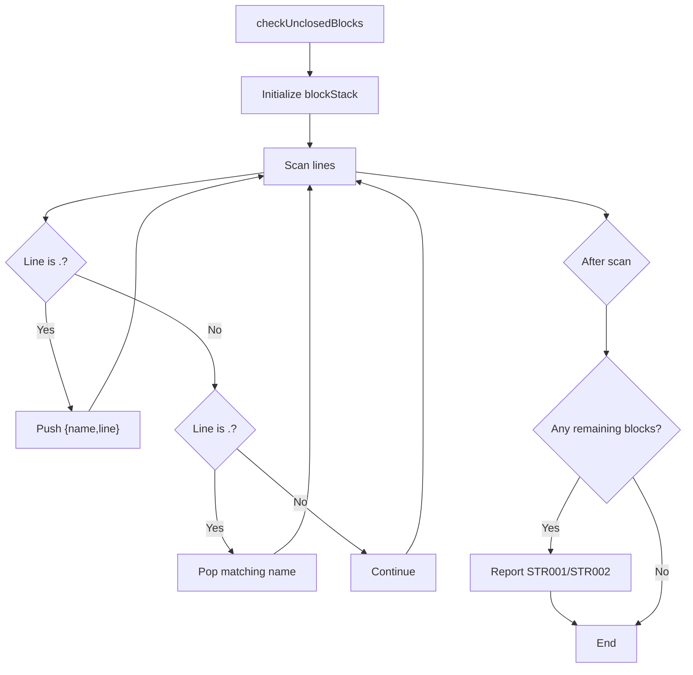
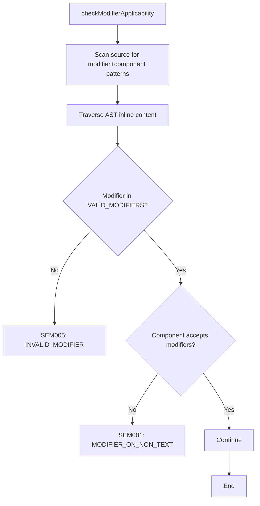
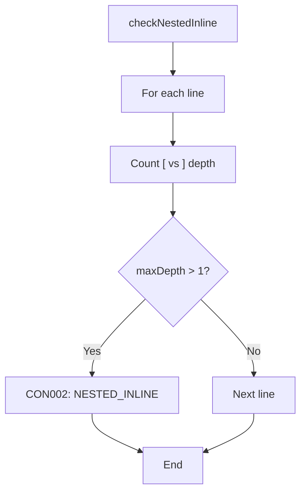
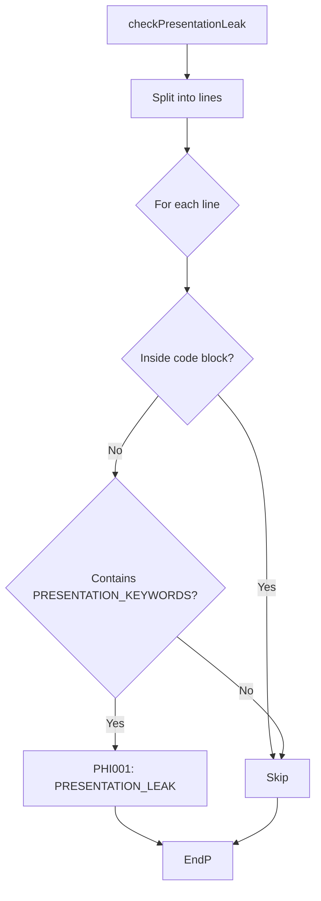
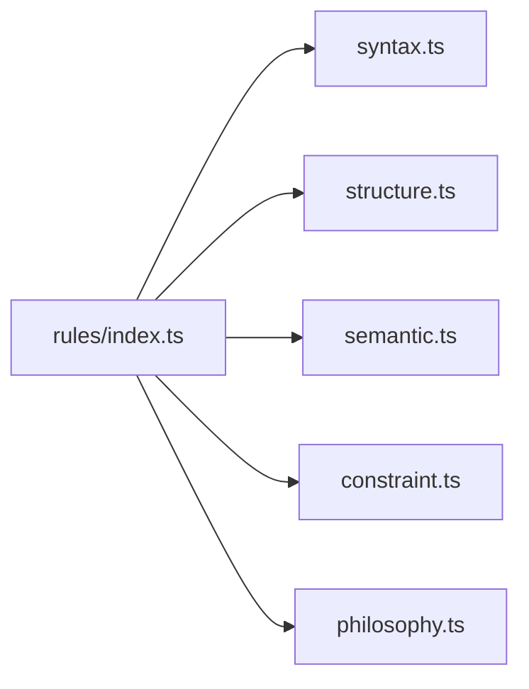

# Rule Categories

<cite>
**Referenced Files in This Document**
- [index.ts](file://artoon-validator/src/index.ts)
- [rules/index.ts](file://artoon-validator/src/rules/index.ts)
- [syntax.ts](file://artoon-validator/src/rules/syntax.ts)
- [structure.ts](file://artoon-validator/src/rules/structure.ts)
- [semantic.ts](file://artoon-validator/src/rules/semantic.ts)
- [constraint.ts](file://artoon-validator/src/rules/constraint.ts)
- [philosophy.ts](file://artoon-validator/src/rules/philosophy.ts)
- [04-RULE-CATEGORIES.md](file://_ARCHIVE/module-analyses/artoon-validator-inventory/04-RULE-CATEGORIES.md)
- [05-ERROR-CODES.md](file://_ARCHIVE/module-analyses/artoon-validator-inventory/05-ERROR-CODES.md)
</cite>

## Table of Contents
1. [Introduction](#introduction)
2. [Project Structure](#project-structure)
3. [Core Components](#core-components)
4. [Architecture Overview](#architecture-overview)
5. [Detailed Component Analysis](#detailed-component-analysis)
6. [Dependency Analysis](#dependency-analysis)
7. [Performance Considerations](#performance-considerations)
8. [Troubleshooting Guide](#troubleshooting-guide)
9. [Conclusion](#conclusion)

## Introduction
This document explains the five ARTOON validation rule categories and how they are implemented in the validator module. It covers:
- Rule categories: syntax, structure, semantic, constraint, and philosophy
- Rule types, validation criteria, and error codes
- Rule definition patterns and composition techniques
- Rule evaluation order, dependencies, and conflict resolution strategies
- Guidance for composing rules and developing custom rules

## Project Structure
The validator module exposes a single entry point that re-exports the engine, rule sets, and error utilities. Each category is implemented as a dedicated rule module and aggregated via a central index.



**Diagram sources**
- [index.ts:1-30](file://artoon-validator/src/index.ts#L1-L30)
- [rules/index.ts:1-15](file://artoon-validator/src/rules/index.ts#L1-L15)

**Section sources**
- [index.ts:1-30](file://artoon-validator/src/index.ts#L1-L30)
- [rules/index.ts:1-15](file://artoon-validator/src/rules/index.ts#L1-L15)

## Core Components
- Engine exports: validate, isValid, validateStrict, formatReport
- Rule sets: syntaxRules, structureRules, semanticRules, constraintRules, philosophyRules
- Error utilities: createError, getErrorTemplate, ERROR_CODES

These are exported from the main entry point and organized per category in the rules directory.

**Section sources**
- [index.ts:6-24](file://artoon-validator/src/index.ts#L6-L24)
- [rules/index.ts:3-7](file://artoon-validator/src/rules/index.ts#L3-L7)

## Architecture Overview
The validator evaluates documents across five categories in a fixed order. Philosophy rules are treated as a special “always-blocking” layer that overrides severity for philosophy breaches.



**Diagram sources**
- [index.ts:6-12](file://artoon-validator/src/index.ts#L6-L12)
- [rules/index.ts:3-7](file://artoon-validator/src/rules/index.ts#L3-L7)
- [04-RULE-CATEGORIES.md:168-193](file://_ARCHIVE/module-analyses/artoon-validator-inventory/04-RULE-CATEGORIES.md#L168-L193)

## Detailed Component Analysis

### Syntax Rules
Purpose: Ensure tokens are correctly formatted.

- Rule types and criteria:
  - checkSpaceAfterSeparator: Validates spacing after :: in inline components.
  - checkUnclosedBrackets: Detects unclosed [ ... ] brackets on the same line.
  - checkDirectionMarkers: Validates directional markers outside block contexts and list/table rows.

- Error codes:
  - SYN001, SYN002, SYN003, SYN004

- Examples and severity:
  - Examples are provided in the inventory documentation.
  - Default severity: error; blocks validity.

- Implementation pattern:
  - Each rule is a pure function taking ValidationContext and returning ValidationError[].
  - Uses line-by-line scanning and regex checks.

```mermaid
flowchart TD
Start(["checkSpaceAfterSeparator"]) --> Split["Split source into lines"]
Split --> Loop{"For each line"}
Loop --> |Match "::" followed by non-space| PushErr["Push SYN001"]
Loop --> |No match| Next["Next line"]
PushErr --> End(["Return errors"])
Next --> End
```

**Diagram sources**
- [syntax.ts:8-34](file://artoon-validator/src/rules/syntax.ts#L8-L34)

**Section sources**
- [syntax.ts:1-127](file://artoon-validator/src/rules/syntax.ts#L1-L127)
- [04-RULE-CATEGORIES.md:32-48](file://_ARCHIVE/module-analyses/artoon-validator-inventory/04-RULE-CATEGORIES.md#L32-L48)
- [05-ERROR-CODES.md:31-39](file://_ARCHIVE/module-analyses/artoon-validator-inventory/05-ERROR-CODES.md#L31-L39)

### Structure Rules
Purpose: Ensure document structure is valid.

- Rule types and criteria:
  - checkUnclosedBlocks: Tracks block stack and reports mismatched or unclosed blocks.
  - checkListNesting: Prevents skipping list nesting levels.
  - checkEmptyCompounds: Warns about compounds with no children.

- Error codes:
  - STR001, STR002, STR003, STR004, STR005

- Examples and severity:
  - Examples and severity matrix are documented in the inventory.
  - Default severity: error; STR005 is warning.

- Implementation pattern:
  - Uses AST traversal for compound checks.
  - Uses stateful scanning for block and list nesting.



**Diagram sources**
- [structure.ts:8-75](file://artoon-validator/src/rules/structure.ts#L8-L75)

**Section sources**
- [structure.ts:1-195](file://artoon-validator/src/rules/structure.ts#L1-L195)
- [04-RULE-CATEGORIES.md:51-76](file://_ARCHIVE/module-analyses/artoon-validator-inventory/04-RULE-CATEGORIES.md#L51-L76)
- [05-ERROR-CODES.md:64-72](file://_ARCHIVE/module-analyses/artoon-validator-inventory/05-ERROR-CODES.md#L64-L72)

### Semantic Rules
Purpose: Ensure components are used correctly.

- Rule types and criteria:
  - checkModifierApplicability: Validates modifiers are only applied to acceptable components and that modifiers are valid.
  - checkRequiredAttributes: Ensures required attributes exist for specific components.

- Error codes:
  - SEM001, SEM002, SEM003, SEM004, SEM005

- Examples and severity:
  - Examples and modifier acceptance lists are documented.
  - Default severity: error; SEM004 is warning.

- Implementation pattern:
  - Scans source for modifier+component patterns and AST for inline content.
  - Traverses AST to validate attributes on media/link/text nodes.



**Diagram sources**
- [semantic.ts:17-132](file://artoon-validator/src/rules/semantic.ts#L17-L132)

**Section sources**
- [semantic.ts:1-254](file://artoon-validator/src/rules/semantic.ts#L1-L254)
- [04-RULE-CATEGORIES.md:79-96](file://_ARCHIVE/module-analyses/artoon-validator-inventory/04-RULE-CATEGORIES.md#L79-L96)
- [05-ERROR-CODES.md:123-132](file://_ARCHIVE/module-analyses/artoon-validator-inventory/05-ERROR-CODES.md#L123-L132)

### Constraint Rules
Purpose: Prevent anti-patterns.

- Rule types and criteria:
  - checkInlineLists: Prohibits list items inside inline content.
  - checkNestedInline: Prohibits nested [...] constructs.
  - checkEmptyComponents: Warns about empty components unless disabled.

- Error codes:
  - CON001, CON002, CON003

- Examples and severity:
  - Examples and severity matrix are documented.
  - Default severity: error or warning depending on rule.

- Implementation pattern:
  - Uses regex scanning for inline patterns.
  - Uses depth counters for nested constructs.



**Diagram sources**
- [constraint.ts:38-75](file://artoon-validator/src/rules/constraint.ts#L38-L75)

**Section sources**
- [constraint.ts:1-117](file://artoon-validator/src/rules/constraint.ts#L1-L117)
- [04-RULE-CATEGORIES.md:112-129](file://_ARCHIVE/module-analyses/artoon-validator-inventory/04-RULE-CATEGORIES.md#L112-L129)
- [05-ERROR-CODES.md:163-170](file://_ARCHIVE/module-analyses/artoon-validator-inventory/05-ERROR-CODES.md#L163-L170)

### Philosophy Rules
Purpose: Enforce ARTOON’s core principle: “WHAT, not HOW.”

- Rule types and criteria:
  - checkPresentationLeak: Flags presentation keywords outside code blocks.
  - checkBehaviorLeak: Flags behavior keywords outside code blocks.
  - checkSemanticViolation: Warns on suspicious semantic misuse (e.g., very short headings).

- Error codes:
  - PHI001, PHI002, PHI003

- Examples and severity:
  - Examples and keyword lists are documented.
  - Philosophy breaches are ALWAYS blocking regardless of severity.

- Implementation pattern:
  - Scans source for forbidden keywords with code-block guards.
  - Uses AST to detect misuse of headings and other semantic constructs.



**Diagram sources**
- [philosophy.ts:15-45](file://artoon-validator/src/rules/philosophy.ts#L15-L45)

**Section sources**
- [philosophy.ts:1-158](file://artoon-validator/src/rules/philosophy.ts#L1-L158)
- [04-RULE-CATEGORIES.md:132-164](file://_ARCHIVE/module-analyses/artoon-validator-inventory/04-RULE-CATEGORIES.md#L132-L164)
- [05-ERROR-CODES.md:197-204](file://_ARCHIVE/module-analyses/artoon-validator-inventory/05-ERROR-CODES.md#L197-L204)

## Dependency Analysis
- Composition:
  - Each category exports a named array of rule functions.
  - The central index re-exports all categories for consumption.
- Evaluation order:
  - The engine invokes rules in the order: syntax → structure → semantic → constraint → philosophy.
- Conflict resolution:
  - Philosophy rules override severity for philosophy breaches, making them always blocking.



**Diagram sources**
- [rules/index.ts:3-7](file://artoon-validator/src/rules/index.ts#L3-L7)

**Section sources**
- [rules/index.ts:1-15](file://artoon-validator/src/rules/index.ts#L1-L15)
- [04-RULE-CATEGORIES.md:168-193](file://_ARCHIVE/module-analyses/artoon-validator-inventory/04-RULE-CATEGORIES.md#L168-L193)

## Performance Considerations
- Complexity:
  - Syntax and constraint rules operate in O(L) over the number of lines.
  - Structure and semantic rules traverse the AST; complexity depends on node count.
  - Philosophy rules scan the source and guard against false positives with code-block detection.
- Recommendations:
  - Prefer early exits and minimal regex work where possible.
  - Avoid repeated AST traversals by composing rules that share context.
  - Consider caching computed metadata (e.g., component type maps) if extending.

## Troubleshooting Guide
- Error codes and descriptions:
  - Refer to the error code inventory for detailed explanations, severity, and fixes.
- Common issues:
  - Missing spaces after :: lead to SYN001.
  - Unclosed brackets cause SYN002.
  - Mismatched or unclosed blocks cause STR001/STR002.
  - Invalid list nesting causes STR004.
  - Modifiers on non-text components cause SEM001; invalid modifiers cause SEM005.
  - Inline lists and nested inline constructs cause CON001/CON002.
  - Presentation and behavior keywords trigger PHI001/PHI002; suspicious headings trigger PHI003.
- Resolution tips:
  - Fix formatting errors first (SYN).
  - Ensure balanced blocks and correct nesting (STR).
  - Apply modifiers only to acceptable components (SEM).
  - Avoid anti-patterns (CON).
  - Respect philosophy: describe “what” without “how” (PHI).

**Section sources**
- [05-ERROR-CODES.md:31-281](file://_ARCHIVE/module-analyses/artoon-validator-inventory/05-ERROR-CODES.md#L31-L281)

## Conclusion
The ARTOON validator enforces five rule categories that progressively refine document quality:
- Syntax ensures token correctness.
- Structure ensures document coherence.
- Semantic ensures proper component usage.
- Constraint prevents anti-patterns.
- Philosophy enforces ARTOON’s core principle and is always blocking.

By following the documented patterns and leveraging the provided rule sets, developers can compose robust validations and extend the system with custom rules while maintaining consistency and clarity.