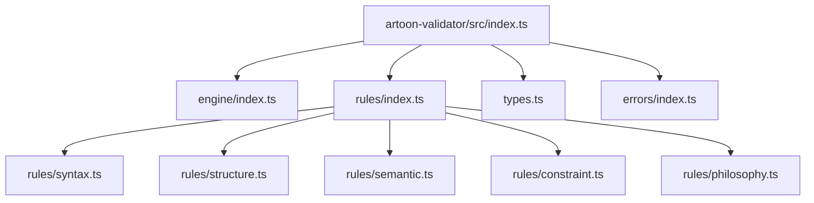
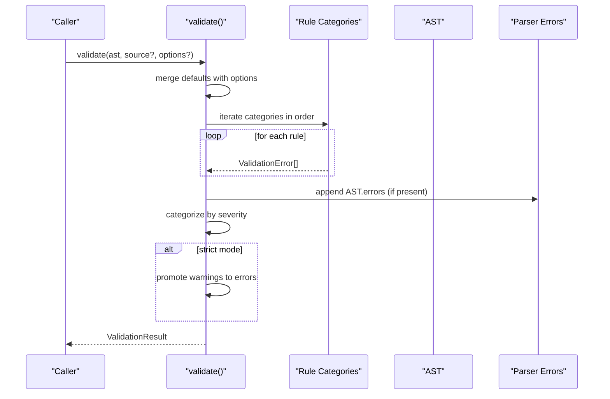
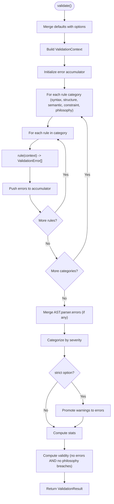
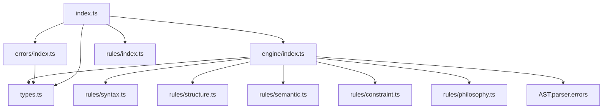

# Validation Engine

<cite>
**Referenced Files in This Document**
- [index.ts](file://artoon-validator/src/index.ts)
- [types.ts](file://artoon-validator/src/types.ts)
- [engine/index.ts](file://artoon-validator/src/engine/index.ts)
- [rules/index.ts](file://artoon-validator/src/rules/index.ts)
- [rules/syntax.ts](file://artoon-validator/src/rules/syntax.ts)
- [rules/structure.ts](file://artoon-validator/src/rules/structure.ts)
- [rules/semantic.ts](file://artoon-validator/src/rules/semantic.ts)
- [rules/constraint.ts](file://artoon-validator/src/rules/constraint.ts)
- [rules/philosophy.ts](file://artoon-validator/src/rules/philosophy.ts)
- [errors/index.ts](file://artoon-validator/src/errors/index.ts)
</cite>

## Table of Contents
1. [Introduction](#introduction)
2. [Project Structure](#project-structure)
3. [Core Components](#core-components)
4. [Architecture Overview](#architecture-overview)
5. [Detailed Component Analysis](#detailed-component-analysis)
6. [Dependency Analysis](#dependency-analysis)
7. [Performance Considerations](#performance-considerations)
8. [Troubleshooting Guide](#troubleshooting-guide)
9. [Conclusion](#conclusion)
10. [Appendices](#appendices)

## Introduction
This document describes the ARTOON Validation Engine, focusing on the validation pipeline and its public API: validate(), isValid(), validateStrict(), and formatReport(). It explains how validation runs across rule categories, how results are aggregated and categorized, and how reports are produced. It also covers validation levels (basic, strict, philosophy-aware), error aggregation mechanisms, and integration patterns with the parsing pipeline. Finally, it documents extensibility points and custom validation configuration options.

## Project Structure
The validation engine resides in the artoon-validator package. The main entry exports the engine functions and rule sets, while internal modules define types, rule categories, and error utilities.

**Diagram sources**
- [index.ts:1-30](file://artoon-validator/src/index.ts#L1-L30)
- [engine/index.ts:1-178](file://artoon-validator/src/engine/index.ts#L1-L178)
- [rules/index.ts:1-15](file://artoon-validator/src/rules/index.ts#L1-L15)
- [rules/syntax.ts:1-127](file://artoon-validator/src/rules/syntax.ts#L1-L127)
- [rules/structure.ts:1-195](file://artoon-validator/src/rules/structure.ts#L1-L195)
- [rules/semantic.ts:1-254](file://artoon-validator/src/rules/semantic.ts#L1-L254)
- [rules/constraint.ts:1-117](file://artoon-validator/src/rules/constraint.ts#L1-L117)
- [rules/philosophy.ts:1-158](file://artoon-validator/src/rules/philosophy.ts#L1-L158)
- [types.ts:1-167](file://artoon-validator/src/types.ts#L1-L167)
- [errors/index.ts:1-80](file://artoon-validator/src/errors/index.ts#L1-L80)

**Section sources**
- [index.ts:1-30](file://artoon-validator/src/index.ts#L1-L30)

## Core Components
- Public API:
  - validate(ast, source?, options?): Executes all rule categories against the AST and source, aggregates results, and returns a structured ValidationResult.
  - isValid(ast, source?): Returns a boolean indicating whether the document is valid.
  - validateStrict(ast, source?): Runs validation in strict mode and throws if there are any errors or philosophy breaches.
  - formatReport(result): Produces a human-readable summary of validation outcomes.
- Rule categories:
  - syntaxRules: Source-based checks for spacing, bracket balance, and direction markers.
  - structureRules: AST and source-based checks for block closure, list nesting, and empty compounds.
  - semanticRules: AST and source-based checks for modifier applicability and required attributes.
  - constraintRules: Anti-pattern checks for inline lists, nested inline constructs, and empty components.
  - philosophyRules: Philosophy-driven checks for presentation/behavior leaks and semantic misuse.
- Types and utilities:
  - ValidationError, ValidationResult, ValidationContext, ValidationOptions define the shape of validation data.
  - ERROR_CODES enumerates canonical error identifiers.
  - createError and getErrorTemplate support constructing and templating errors.
  - Rule interface defines a composable validation unit.

**Section sources**
- [engine/index.ts:27-178](file://artoon-validator/src/engine/index.ts#L27-L178)
- [rules/index.ts:1-15](file://artoon-validator/src/rules/index.ts#L1-L15)
- [rules/syntax.ts:122-127](file://artoon-validator/src/rules/syntax.ts#L122-L127)
- [rules/structure.ts:190-195](file://artoon-validator/src/rules/structure.ts#L190-L195)
- [rules/semantic.ts:250-254](file://artoon-validator/src/rules/semantic.ts#L250-L254)
- [rules/constraint.ts:112-117](file://artoon-validator/src/rules/constraint.ts#L112-L117)
- [rules/philosophy.ts:153-158](file://artoon-validator/src/rules/philosophy.ts#L153-L158)
- [types.ts:18-167](file://artoon-validator/src/types.ts#L18-L167)
- [errors/index.ts:8-80](file://artoon-validator/src/errors/index.ts#L8-L80)

## Architecture Overview
The engine orchestrates validation across five categories in a deterministic order. Each category is a collection of rule functions that take a ValidationContext and return arrays of ValidationError entries. Parser errors are merged into the validation results. Results are categorized by severity and optionally elevated to errors under strict mode. A formatted report groups philosophy breaches, errors, and warnings.

**Diagram sources**
- [engine/index.ts:27-100](file://artoon-validator/src/engine/index.ts#L27-L100)

## Detailed Component Analysis

### Validation Pipeline and Execution Flow
- Input composition:
  - ValidationContext includes AST, optional source text, and ValidationOptions.
  - Options default to strict=false, allowEmptyComponents=false, checkPhilosophy=true.
- Rule application order:
  - The engine iterates categories in this fixed order: syntax, structure, semantic, constraint, philosophy.
  - Within each category, rules are executed sequentially.
- Result processing:
  - Aggregation collects all errors.
  - Categorization splits into errors, warnings, and philosophy breaches.
  - Strict mode elevates warnings to errors.
  - Validity is determined by absence of errors and philosophy breaches.
  - Statistics summarize totals and counts.

**Diagram sources**
- [engine/index.ts:27-100](file://artoon-validator/src/engine/index.ts#L27-L100)

**Section sources**
- [engine/index.ts:18-100](file://artoon-validator/src/engine/index.ts#L18-L100)
- [types.ts:67-71](file://artoon-validator/src/types.ts#L67-L71)

### Public API Functions

#### validate(ast, source?, options?)
- Purpose: Full validation pass returning a detailed result.
- Behavior:
  - Merges options with defaults.
  - Iterates rule categories and rules.
  - Appends parser errors from AST.
  - Categorizes and computes stats.
  - Applies strict mode if requested.
- Output: ValidationResult with valid flag, categorized errors, and stats.

**Section sources**
- [engine/index.ts:27-100](file://artoon-validator/src/engine/index.ts#L27-L100)

#### isValid(ast, source?)
- Purpose: Fast boolean check.
- Behavior: Delegates to validate() and returns valid.

**Section sources**
- [engine/index.ts:105-108](file://artoon-validator/src/engine/index.ts#L105-L108)

#### validateStrict(ast, source?)
- Purpose: Fail-fast validation.
- Behavior: Invokes validate() with strict=true; throws if result is invalid.

**Section sources**
- [engine/index.ts:113-124](file://artoon-validator/src/engine/index.ts#L113-L124)

#### formatReport(result)
- Purpose: Human-readable summary.
- Behavior: Prints validity, statistics, and grouped sections for philosophy breaches, errors, and warnings.

**Section sources**
- [engine/index.ts:129-177](file://artoon-validator/src/engine/index.ts#L129-L177)

### Validation Levels and Behavior
- Basic validation:
  - Default behavior of validate().
  - Warnings are separate from errors.
- Strict validation:
  - Enforced via validateStrict() or passing strict: true.
  - Warnings are elevated to errors; philosophy breaches remain critical.
- Philosophy-aware:
  - Philosophy rules are included by default (checkPhilosophy: true).
  - Can be disabled via options to skip philosophy checks.

**Section sources**
- [engine/index.ts:18-22](file://artoon-validator/src/engine/index.ts#L18-L22)
- [engine/index.ts:80-83](file://artoon-validator/src/engine/index.ts#L80-L83)
- [rules/philosophy.ts:19-19](file://artoon-validator/src/rules/philosophy.ts#L19-L19)

### Error Aggregation and Reporting
- Aggregation:
  - All rule outputs are concatenated.
  - Parser errors are appended with a dedicated code and mapped fields.
- Categorization:
  - Errors, warnings, philosophy breaches separated.
- Stats:
  - totalIssues, errorCount, warningCount, breachCount computed.
- Reporting:
  - formatReport() prints a structured summary with severity-specific sections.

**Section sources**
- [engine/index.ts:58-100](file://artoon-validator/src/engine/index.ts#L58-L100)
- [engine/index.ts:129-177](file://artoon-validator/src/engine/index.ts#L129-L177)

### Rule Categories and Examples

#### Syntax Rules
- checkSpaceAfterSeparator: Detects missing spaces after :: in source text.
- checkUnclosedBrackets: Ensures balanced brackets [] per line.
- checkDirectionMarkers: Validates directional markers outside block contexts.

**Section sources**
- [rules/syntax.ts:8-127](file://artoon-validator/src/rules/syntax.ts#L8-L127)

#### Structure Rules
- checkUnclosedBlocks: Tracks block stack and reports mismatches and unclosed blocks.
- checkListNesting: Prevents skipping list nesting levels.
- checkEmptyCompounds: Warns about empty compound components in AST.

**Section sources**
- [rules/structure.ts:8-195](file://artoon-validator/src/rules/structure.ts#L8-L195)

#### Semantic Rules
- checkModifierApplicability: Validates modifier applicability to text-like components and rejects invalid modifiers.
- checkRequiredAttributes: Enforces required attributes for media/link/text nodes.

**Section sources**
- [rules/semantic.ts:17-254](file://artoon-validator/src/rules/semantic.ts#L17-L254)

#### Constraint Rules
- checkInlineLists: Prohibits inline lists.
- checkNestedInline: Prohibits nested inline constructs.
- checkEmptyComponents: Warns about empty components unless allowEmptyComponents is enabled.

**Section sources**
- [rules/constraint.ts:8-117](file://artoon-validator/src/rules/constraint.ts#L8-L117)

#### Philosophy Rules
- checkPresentationLeak: Flags presentation-related keywords outside code blocks.
- checkBehaviorLeak: Flags behavior-related keywords outside code blocks.
- checkSemanticViolation: Warns on suspicious semantic misuse (e.g., very short headings).

**Section sources**
- [rules/philosophy.ts:15-158](file://artoon-validator/src/rules/philosophy.ts#L15-L158)

### Extensibility and Custom Configuration
- Adding custom rules:
  - Define a function implementing ValidationRule.check(context) returning ValidationError[].
  - Append to an existing category array or create a new category.
- Custom rule categories:
  - Export a new array of rules and re-export from rules/index.ts.
- Validation options:
  - strict: Treat warnings as errors.
  - allowEmptyComponents: Permit empty components without warnings.
  - checkPhilosophy: Toggle philosophy checks.

**Section sources**
- [types.ts:48-62](file://artoon-validator/src/types.ts#L48-L62)
- [rules/index.ts:1-15](file://artoon-validator/src/rules/index.ts#L1-L15)
- [engine/index.ts:18-22](file://artoon-validator/src/engine/index.ts#L18-L22)

## Dependency Analysis
The engine depends on rule categories and types, and integrates AST parser errors. Rules depend on shared types and constants.

**Diagram sources**
- [engine/index.ts:3-13](file://artoon-validator/src/engine/index.ts#L3-L13)
- [rules/index.ts:1-15](file://artoon-validator/src/rules/index.ts#L1-L15)
- [types.ts:1-167](file://artoon-validator/src/types.ts#L1-L167)
- [errors/index.ts:1-80](file://artoon-validator/src/errors/index.ts#L1-L80)
- [index.ts:1-30](file://artoon-validator/src/index.ts#L1-L30)

**Section sources**
- [engine/index.ts:3-13](file://artoon-validator/src/engine/index.ts#L3-L13)
- [rules/index.ts:1-15](file://artoon-validator/src/rules/index.ts#L1-L15)
- [types.ts:1-167](file://artoon-validator/src/types.ts#L1-L167)
- [errors/index.ts:1-80](file://artoon-validator/src/errors/index.ts#L1-L80)
- [index.ts:1-30](file://artoon-validator/src/index.ts#L1-L30)

## Performance Considerations
- Complexity:
  - validate() iterates all rules and categories; time complexity scales linearly with the number of rules and the size of the source/AST.
  - Source-based rules scan lines; AST-based rules traverse content recursively.
- Optimization opportunities:
  - Short-circuit on philosophy breaches if early termination is desired (not currently implemented).
  - Memoize or precompute expensive checks (e.g., repeated regex scans) if needed.
  - Parallelize independent rule checks only if rules are truly independent and thread-safe.
- Practical tips:
  - Disable philosophy checks via options if not needed.
  - Avoid passing very large source texts when AST is sufficient.
  - Use isValid() for quick checks; reserve validate() for detailed reporting.

[No sources needed since this section provides general guidance]

## Troubleshooting Guide
- Philosophy breaches are critical:
  - Philosophy rules are always checked by default; disable via options if temporarily needed.
- Strict mode failures:
  - validateStrict() throws on any error or philosophy breach; enable strict via options or use validateStrict().
- Empty components:
  - Empty components produce warnings unless allowEmptyComponents is set.
- Parser errors:
  - AST.parser.errors are automatically included; ensure parsing succeeded before validating.
- Error templates and creation:
  - Use createError() and getErrorTemplate() to standardize error construction and messaging.

**Section sources**
- [engine/index.ts:58-83](file://artoon-validator/src/engine/index.ts#L58-L83)
- [engine/index.ts:113-124](file://artoon-validator/src/engine/index.ts#L113-L124)
- [errors/index.ts:8-80](file://artoon-validator/src/errors/index.ts#L8-L80)

## Conclusion
The ARTOON Validation Engine provides a robust, extensible framework for validating ARTOON documents. Its deterministic pipeline, clear categorization of issues, and strict-mode enforcement make it suitable for both development feedback and CI gating. Philosophy-driven checks ensure adherence to ARTOON’s design principles, while configurable options allow adaptation to project needs.

[No sources needed since this section summarizes without analyzing specific files]

## Appendices

### Programmatic Usage Patterns
- Basic validation:
  - Call validate(ast, source, options) and inspect result.valid and result.stats.
- Quick pass:
  - Call isValid(ast, source) for a boolean outcome.
- Fail-fast:
  - Call validateStrict(ast, source) to throw on any issue.
- Reporting:
  - Use formatReport(result) to print a human-readable summary.

**Section sources**
- [engine/index.ts:27-178](file://artoon-validator/src/engine/index.ts#L27-L178)

### Validation Levels Reference
- Basic: Default validate(); warnings separate from errors.
- Strict: validateStrict() or strict: true; warnings treated as errors.
- Philosophy-aware: Enabled by default; philosophy rules enforced.

**Section sources**
- [engine/index.ts:18-22](file://artoon-validator/src/engine/index.ts#L18-L22)
- [engine/index.ts:80-83](file://artoon-validator/src/engine/index.ts#L80-L83)
- [rules/philosophy.ts:19-19](file://artoon-validator/src/rules/philosophy.ts#L19-L19)