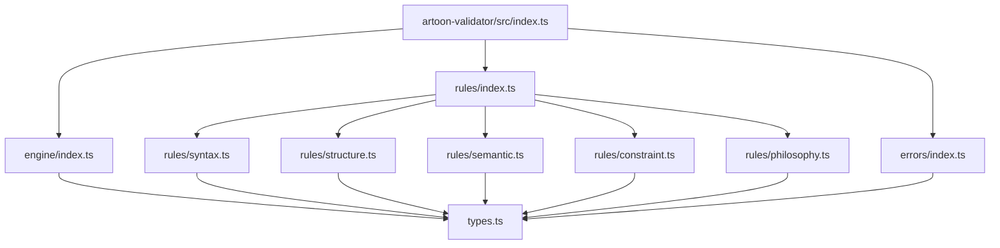
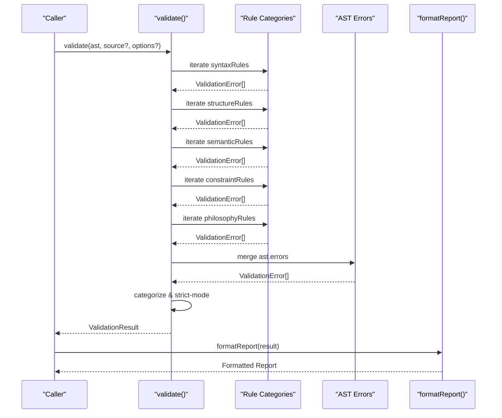
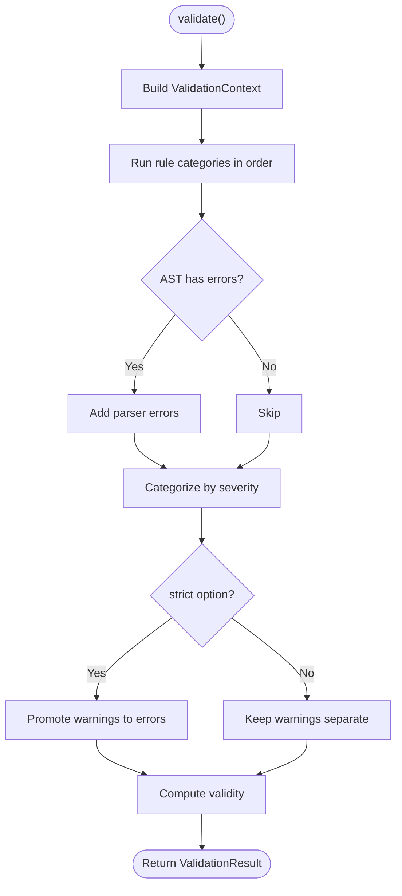
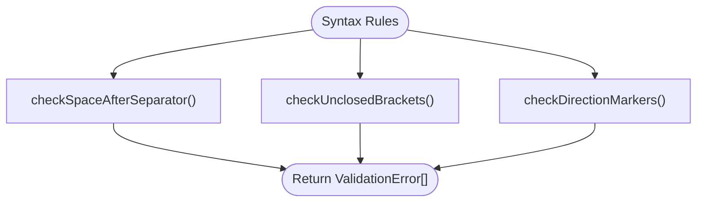
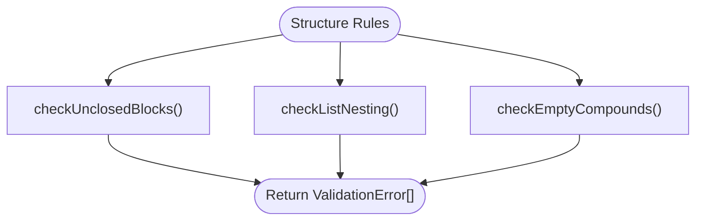
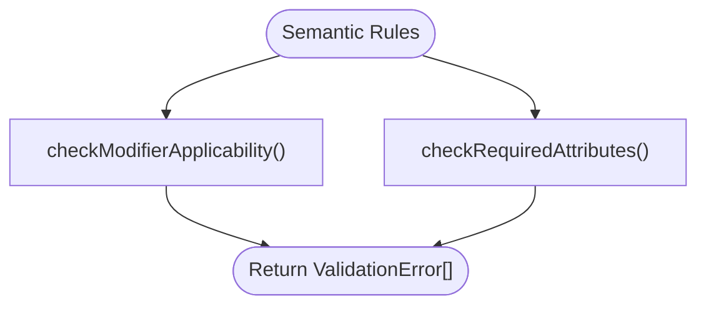
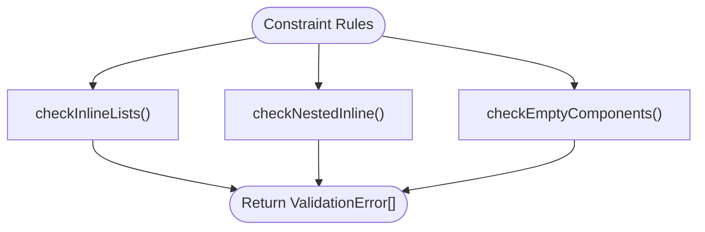
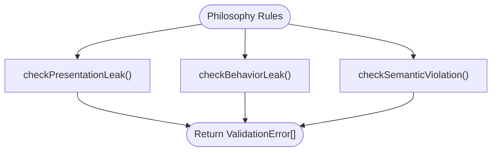
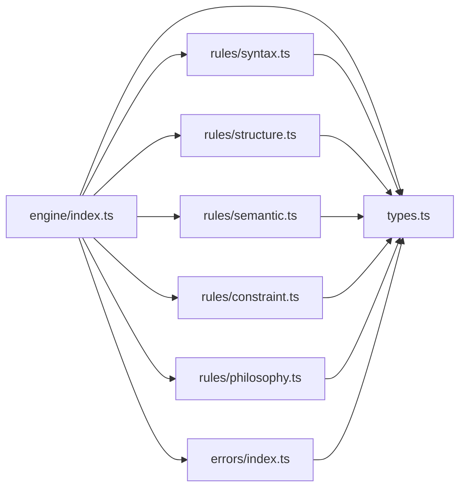

# Validator Package

<cite>
**Referenced Files in This Document**
- [index.ts](file://artoon-validator/src/index.ts)
- [types.ts](file://artoon-validator/src/types.ts)
- [engine/index.ts](file://artoon-validator/src/engine/index.ts)
- [rules/index.ts](file://artoon-validator/src/rules/index.ts)
- [rules/syntax.ts](file://artoon-validator/src/rules/syntax.ts)
- [rules/structure.ts](file://artoon-validator/src/rules/structure.ts)
- [rules/semantic.ts](file://artoon-validator/src/rules/semantic.ts)
- [rules/constraint.ts](file://artoon-validator/src/rules/constraint.ts)
- [rules/philosophy.ts](file://artoon-validator/src/rules/philosophy.ts)
- [errors/index.ts](file://artoon-validator/src/errors/index.ts)
</cite>

## Table of Contents
1. [Introduction](#introduction)
2. [Project Structure](#project-structure)
3. [Core Components](#core-components)
4. [Architecture Overview](#architecture-overview)
5. [Detailed Component Analysis](#detailed-component-analysis)
6. [Dependency Analysis](#dependency-analysis)
7. [Performance Considerations](#performance-considerations)
8. [Troubleshooting Guide](#troubleshooting-guide)
9. [Conclusion](#conclusion)
10. [Appendices](#appendices)

## Introduction
The ARTOON Validator package provides a robust validation engine for ARTOON documents. It evaluates documents against five rule categories—syntax, structure, semantic, constraint, and philosophy—to ensure correctness, consistency, and adherence to ARTOON’s design philosophy. The engine integrates with the AST produced by the parser and supports configurable validation levels, comprehensive error reporting, and extensible rule creation.

## Project Structure
The validator package is organized around a central engine, categorized rule sets, shared types, and error utilities. Exports from the main entry point expose the validation API, rule collections, and error helpers.

**Diagram sources**
- [index.ts:1-30](file://artoon-validator/src/index.ts#L1-L30)
- [engine/index.ts:1-178](file://artoon-validator/src/engine/index.ts#L1-L178)
- [rules/index.ts:1-15](file://artoon-validator/src/rules/index.ts#L1-L15)
- [rules/syntax.ts:1-127](file://artoon-validator/src/rules/syntax.ts#L1-L127)
- [rules/structure.ts:1-195](file://artoon-validator/src/rules/structure.ts#L1-L195)
- [rules/semantic.ts:1-254](file://artoon-validator/src/rules/semantic.ts#L1-L254)
- [rules/constraint.ts:1-117](file://artoon-validator/src/rules/constraint.ts#L1-L117)
- [rules/philosophy.ts:1-158](file://artoon-validator/src/rules/philosophy.ts#L1-L158)
- [errors/index.ts:1-80](file://artoon-validator/src/errors/index.ts#L1-L80)
- [types.ts:1-167](file://artoon-validator/src/types.ts#L1-L167)

**Section sources**
- [index.ts:1-30](file://artoon-validator/src/index.ts#L1-L30)
- [rules/index.ts:1-15](file://artoon-validator/src/rules/index.ts#L1-L15)

## Core Components
- Validation Engine: Orchestrates rule execution, merges parser errors, categorizes results, and computes validity.
- Rule Categories: Syntax, structure, semantic, constraint, and philosophy rules grouped under dedicated modules.
- Types and Contracts: Shared interfaces for validation context, options, results, and error definitions.
- Error Utilities: Helpers to create standardized errors and templates for diagnostics.

Key exports include validation functions, rule collections, and error utilities for integration and customization.

**Section sources**
- [engine/index.ts:27-124](file://artoon-validator/src/engine/index.ts#L27-L124)
- [types.ts:18-71](file://artoon-validator/src/types.ts#L18-L71)
- [errors/index.ts:8-28](file://artoon-validator/src/errors/index.ts#L8-L28)
- [index.ts:7-24](file://artoon-validator/src/index.ts#L7-L24)

## Architecture Overview
The validation pipeline runs through the engine, invoking each rule category in order. Parser errors are merged into the validation result. Results are categorized by severity and optionally elevated to errors in strict mode.

**Diagram sources**
- [engine/index.ts:27-100](file://artoon-validator/src/engine/index.ts#L27-L100)
- [engine/index.ts:129-177](file://artoon-validator/src/engine/index.ts#L129-L177)

**Section sources**
- [engine/index.ts:27-100](file://artoon-validator/src/engine/index.ts#L27-L100)
- [engine/index.ts:129-177](file://artoon-validator/src/engine/index.ts#L129-L177)

## Detailed Component Analysis

### Validation Engine
Responsibilities:
- Merge parser errors into validation results.
- Categorize errors into errors, warnings, and philosophy breaches.
- Apply strict mode to treat warnings as errors.
- Compute validity based on error counts.

Validation functions:
- validate: Full validation returning a structured result.
- isValid: Quick boolean check.
- validateStrict: Throws on failure in strict mode.
- formatReport: Human-readable summary.

**Diagram sources**
- [engine/index.ts:27-100](file://artoon-validator/src/engine/index.ts#L27-L100)

**Section sources**
- [engine/index.ts:27-100](file://artoon-validator/src/engine/index.ts#L27-L100)
- [engine/index.ts:105-124](file://artoon-validator/src/engine/index.ts#L105-L124)
- [engine/index.ts:129-177](file://artoon-validator/src/engine/index.ts#L129-L177)

### Rule Categories

#### Syntax Rules
Checks:
- Space after separator.
- Unclosed brackets in inline content.
- Direction markers outside block contexts.

**Diagram sources**
- [rules/syntax.ts:8-34](file://artoon-validator/src/rules/syntax.ts#L8-L34)
- [rules/syntax.ts:39-75](file://artoon-validator/src/rules/syntax.ts#L39-L75)
- [rules/syntax.ts:80-117](file://artoon-validator/src/rules/syntax.ts#L80-L117)

**Section sources**
- [rules/syntax.ts:1-127](file://artoon-validator/src/rules/syntax.ts#L1-L127)

#### Structure Rules
Checks:
- Unclosed blocks and mismatched block names.
- Invalid list nesting (level jumps).
- Empty compound components.

**Diagram sources**
- [rules/structure.ts:8-75](file://artoon-validator/src/rules/structure.ts#L8-L75)
- [rules/structure.ts:80-129](file://artoon-validator/src/rules/structure.ts#L80-L129)
- [rules/structure.ts:134-185](file://artoon-validator/src/rules/structure.ts#L134-L185)

**Section sources**
- [rules/structure.ts:1-195](file://artoon-validator/src/rules/structure.ts#L1-L195)

#### Semantic Rules
Checks:
- Modifiers applied to non-text components.
- Invalid modifiers.
- Missing required attributes on inline/media/link nodes.

**Diagram sources**
- [rules/semantic.ts:17-132](file://artoon-validator/src/rules/semantic.ts#L17-L132)
- [rules/semantic.ts:137-245](file://artoon-validator/src/rules/semantic.ts#L137-L245)

**Section sources**
- [rules/semantic.ts:1-254](file://artoon-validator/src/rules/semantic.ts#L1-L254)

#### Constraint Rules
Checks:
- Inline lists (anti-pattern).
- Nested inline components (anti-pattern).
- Empty components (with opt-out via options).

**Diagram sources**
- [rules/constraint.ts:8-33](file://artoon-validator/src/rules/constraint.ts#L8-L33)
- [rules/constraint.ts:38-75](file://artoon-validator/src/rules/constraint.ts#L38-L75)
- [rules/constraint.ts:80-107](file://artoon-validator/src/rules/constraint.ts#L80-L107)

**Section sources**
- [rules/constraint.ts:1-117](file://artoon-validator/src/rules/constraint.ts#L1-L117)

#### Philosophy Rules
Checks:
- Presentation leaks (keywords).
- Behavior leaks (keywords).
- Semantic misuse (e.g., very short headings).

**Diagram sources**
- [rules/philosophy.ts:15-45](file://artoon-validator/src/rules/philosophy.ts#L15-L45)
- [rules/philosophy.ts:50-80](file://artoon-validator/src/rules/philosophy.ts#L50-L80)
- [rules/philosophy.ts:85-132](file://artoon-validator/src/rules/philosophy.ts#L85-L132)

**Section sources**
- [rules/philosophy.ts:1-158](file://artoon-validator/src/rules/philosophy.ts#L1-L158)

### Types and Contracts
Defines:
- Severity levels: error, warning, philosophy.
- Categories: syntax, structure, semantic, constraint, philosophy.
- Validation error shape with code, category, severity, position, and messages.
- Validation result with aggregated counts and categorized arrays.
- Validation context with AST, optional source, and options.
- Validation options: strict mode, empty component allowance, philosophy checks toggle.
- Error codes and constants for modifiers, attributes, and philosophy keywords.

These types unify the engine and rules into a cohesive contract.

**Section sources**
- [types.ts:6-106](file://artoon-validator/src/types.ts#L6-L106)
- [types.ts:108-167](file://artoon-validator/src/types.ts#L108-L167)

### Error Utilities
Provides:
- createError: Construct a standardized validation error.
- ERROR_MESSAGES: Templates keyed by error codes for localized messages.
- getErrorTemplate: Retrieve template for a given code.
- Re-export of ERROR_CODES for consistent usage.

**Section sources**
- [errors/index.ts:8-28](file://artoon-validator/src/errors/index.ts#L8-L28)
- [errors/index.ts:33-76](file://artoon-validator/src/errors/index.ts#L33-L76)
- [errors/index.ts:79-80](file://artoon-validator/src/errors/index.ts#L79-L80)

## Dependency Analysis
The engine depends on rule categories and types, while rules depend on types and constants. Error utilities depend on types and error codes. The engine also merges parser errors from the AST.

**Diagram sources**
- [engine/index.ts:3-13](file://artoon-validator/src/engine/index.ts#L3-L13)
- [rules/index.ts:3-7](file://artoon-validator/src/rules/index.ts#L3-L7)
- [errors/index.ts:3-4](file://artoon-validator/src/errors/index.ts#L3-L4)
- [types.ts:3-106](file://artoon-validator/src/types.ts#L3-L106)

**Section sources**
- [engine/index.ts:3-13](file://artoon-validator/src/engine/index.ts#L3-L13)
- [rules/index.ts:3-7](file://artoon-validator/src/rules/index.ts#L3-L7)
- [errors/index.ts:3-4](file://artoon-validator/src/errors/index.ts#L3-L4)

## Performance Considerations
- Complexity:
  - Syntax and constraint rules operate primarily on source text with linear scans per line.
  - Structure rules scan source and maintain stacks for block matching and list depth.
  - Semantic and philosophy rules traverse the AST; complexity scales with node count.
- Optimization opportunities:
  - Memoize repeated keyword checks in philosophy rules.
  - Short-circuit rule evaluation when philosophy checks are disabled.
  - Parallelize independent rule evaluations if needed (not currently implemented).
- Practical tips:
  - Prefer streaming or chunked processing for very large documents.
  - Disable philosophy checks when validating machine-generated content.

[No sources needed since this section provides general guidance]

## Troubleshooting Guide
Common scenarios and resolutions:
- Philosophy Breach Detected:
  - Cause: Presentation or behavior keywords found outside code blocks.
  - Action: Remove style/behavior indicators; rely on renderer/theme for presentation.
- Strict Mode Failures:
  - Cause: Warnings elevated to errors.
  - Action: Enable strict only when required; otherwise adjust rules or suppress warnings.
- Parser Errors Mixed In:
  - Cause: AST contains parsing errors.
  - Action: Review reported lines and suggestions; fix syntax before running validator.
- Empty Components:
  - Cause: Components declared but no content provided.
  - Action: Add meaningful content or remove the component declaration.

Diagnostic utilities:
- Use formatReport to produce a human-readable summary.
- Inspect ValidationResult for categorized arrays and statistics.

**Section sources**
- [engine/index.ts:58-72](file://artoon-validator/src/engine/index.ts#L58-L72)
- [engine/index.ts:129-177](file://artoon-validator/src/engine/index.ts#L129-L177)
- [errors/index.ts:33-76](file://artoon-validator/src/errors/index.ts#L33-L76)

## Conclusion
The ARTOON Validator package offers a modular, extensible validation framework that aligns with ARTOON’s syntax, structure, semantics, constraints, and philosophy. Its engine integrates seamlessly with the AST and parser, supports configurable validation levels, and provides rich diagnostics. Developers can extend validation by adding new rules within existing categories or by contributing new categories.

[No sources needed since this section summarizes without analyzing specific files]

## Appendices

### Validation Levels and Options
- strict: Treat warnings as errors.
- allowEmptyComponents: Permit empty component declarations.
- checkPhilosophy: Toggle philosophy checks.

**Section sources**
- [types.ts:67-71](file://artoon-validator/src/types.ts#L67-L71)

### Error Codes and Categories
- Syntax: Missing space after separator, unclosed bracket, invalid direction marker, malformed component.
- Structure: Unclosed block, mismatched block name, orphan list item, invalid nesting, empty compound.
- Semantic: Modifier on non-text, invalid attribute, missing required attribute, unknown component, invalid modifier.
- Constraint: Inline list, nested inline, empty component.
- Philosophy: Presentation leak, behavior leak, semantic violation.

**Section sources**
- [types.ts:76-106](file://artoon-validator/src/types.ts#L76-L106)

### Rule Evaluation Mechanism
- Each rule receives a ValidationContext and returns an array of ValidationError entries.
- Rules are executed in a fixed order: syntax → structure → semantic → constraint → philosophy.
- Philosophy rules are severity “philosophy” and are not elevated by strict mode.

**Section sources**
- [types.ts:48-62](file://artoon-validator/src/types.ts#L48-L62)
- [engine/index.ts:43-56](file://artoon-validator/src/engine/index.ts#L43-L56)
- [engine/index.ts:74-83](file://artoon-validator/src/engine/index.ts#L74-L83)
- [rules/philosophy.ts:15-45](file://artoon-validator/src/rules/philosophy.ts#L15-L45)

### Extending the Validator
- Add a new rule function exporting to the appropriate category index.
- Export the rule collection from rules/index.ts.
- Import and register the new collection in the engine if needed.
- Define a new error code and template in types.ts and errors/index.ts respectively.

**Section sources**
- [rules/index.ts:3-7](file://artoon-validator/src/rules/index.ts#L3-L7)
- [engine/index.ts:9-13](file://artoon-validator/src/engine/index.ts#L9-L13)
- [types.ts:76-106](file://artoon-validator/src/types.ts#L76-L106)
- [errors/index.ts:33-76](file://artoon-validator/src/errors/index.ts#L33-L76)

### Integration with Parser and AST
- The engine merges parser errors from ast.errors into the validation result.
- AST traversal in semantic and philosophy rules ensures deep validation beyond syntax.

**Section sources**
- [engine/index.ts:58-72](file://artoon-validator/src/engine/index.ts#L58-L72)
- [rules/semantic.ts:137-245](file://artoon-validator/src/rules/semantic.ts#L137-L245)
- [rules/philosophy.ts:85-132](file://artoon-validator/src/rules/philosophy.ts#L85-L132)