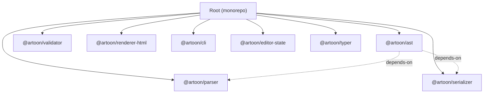
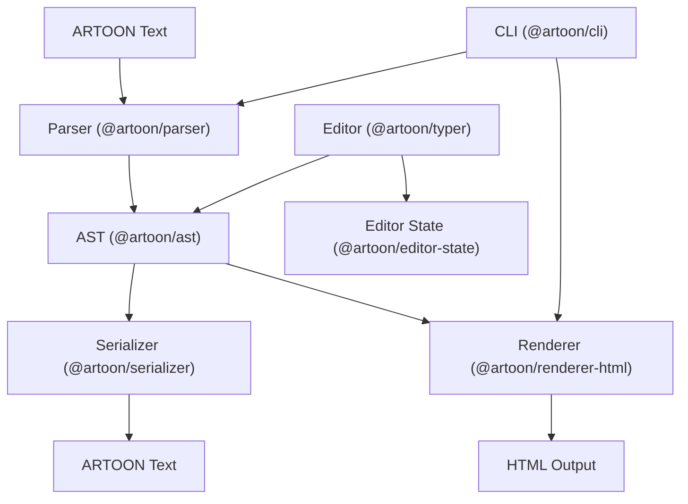
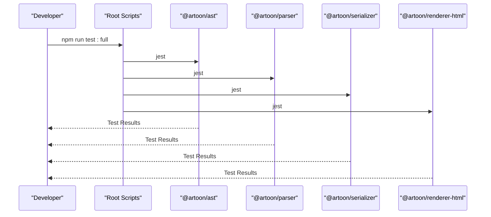
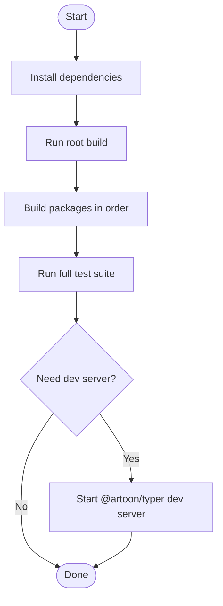
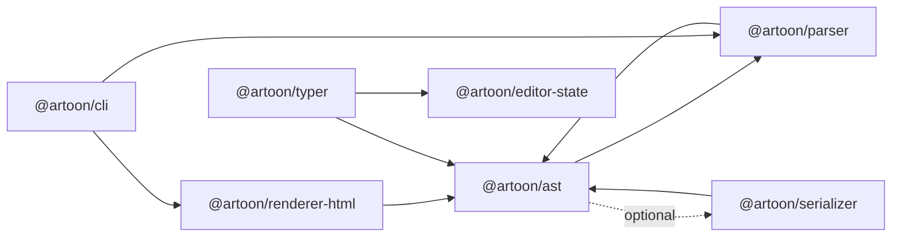

# Development Guide

<cite>
**Referenced Files in This Document**
- [package.json](file://package.json)
- [jest.config.js](file://jest.config.js)
- [README.md](file://README.md)
- [artoon-ast/package.json](file://artoon-ast/package.json)
- [artoon-ast/jest.config.js](file://artoon-ast/jest.config.js)
- [artoon-ast/tsconfig.json](file://artoon-ast/tsconfig.json)
- [artoon-parser/package.json](file://artoon-parser/package.json)
- [artoon-parser/jest.config.js](file://artoon-parser/jest.config.js)
- [artoon-parser/tsconfig.json](file://artoon-parser/tsconfig.json)
- [artoon-serializer/tsconfig.json](file://artoon-serializer/tsconfig.json)
- [artoon-typer/vite.config.ts](file://artoon-typer/vite.config.ts)
- [artoon-typer/vitest.config.ts](file://artoon-typer/vitest.config.ts)
- [artoon-typer/package.json](file://artoon-typer/package.json)
</cite>

## Table of Contents
1. [Introduction](#introduction)
2. [Project Structure](#project-structure)
3. [Core Components](#core-components)
4. [Architecture Overview](#architecture-overview)
5. [Detailed Component Analysis](#detailed-component-analysis)
6. [Dependency Analysis](#dependency-analysis)
7. [Performance Considerations](#performance-considerations)
8. [Troubleshooting Guide](#troubleshooting-guide)
9. [Conclusion](#conclusion)
10. [Appendices](#appendices)

## Introduction
This development guide explains how to contribute to ARTOON 2.0. It covers environment setup, monorepo structure, build and test systems, coding standards, TypeScript configuration, linting, testing strategies, release and publishing, debugging, performance profiling, and troubleshooting. The guide references concrete configuration files and package manifests to keep instructions precise and reproducible.

## Project Structure
ARTOON 2.0 is a monorepo managed with npm workspaces. The root orchestrates builds and tests across packages, while each package defines its own TypeScript configuration, Jest/Vitest setup, and scripts. The editor package (@artoon/typer) uses Vite and Vitest for development and testing.

**Diagram sources**
- [package.json:6-16](file://package.json#L6-L16)
- [artoon-ast/package.json:14-16](file://artoon-ast/package.json#L14-L16)

Key characteristics:
- Workspaces defined at the root enable cross-package scripts and dependency management.
- Each package compiles TypeScript to dist and runs tests via Jest or Vitest.
- The editor package (@artoon/typer) supports both library and app builds via Vite.

**Section sources**
- [package.json:6-16](file://package.json#L6-L16)
- [README.md:77-89](file://README.md#L77-L89)

## Core Components
This section outlines the core packages and their roles, build/test scripts, and configuration highlights.

- @artoon/ast: Canonical AST with compatibility layer; depends on @artoon/parser.
- @artoon/parser: Parses ARTOON to AST; outputs InlineContent[] directly.
- @artoon/serializer: Serializes AST back to ARTOON text.
- @artoon/renderer-html: Renders AST to HTML.
- @artoon/validator: Validates ARTOON content (in progress).
- @artoon/editor-state: Editor state management (in progress).
- @artoon/typer: Block-based rich text editor (in progress).
- @artoon/cli: Command-line utilities.

Build and test scripts:
- Root-level scripts run workspaces-wide builds/tests and per-package commands.
- Jest presets and module name mapping are configured at the root for cross-package imports.
- @artoon/typer uses Vite for dev server and Vitest for unit/e2e tests.

**Section sources**
- [README.md:77-89](file://README.md#L77-L89)
- [package.json:17-32](file://package.json#L17-L32)
- [jest.config.js:7-13](file://jest.config.js#L7-L13)
- [artoon-ast/package.json:7-11](file://artoon-ast/package.json#L7-L11)
- [artoon-parser/package.json:7-11](file://artoon-parser/package.json#L7-L11)
- [artoon-typer/package.json:20-28](file://artoon-typer/package.json#L20-L28)

## Architecture Overview
The ARTOON pipeline transforms ARTOON text into an AST, serializes it, and renders it to HTML. The editor integrates with the AST and state management to provide a block-based editing experience.

**Diagram sources**
- [README.md:22-44](file://README.md#L22-L44)
- [artoon-ast/package.json:14-16](file://artoon-ast/package.json#L14-L16)

## Detailed Component Analysis

### TypeScript Configuration and Coding Standards
- Target and module settings: ES2020 with commonjs for libraries; moduleResolution node for parser.
- Strictness: Enabled across packages; serializer adds stricter null checks and implicit return checks.
- Output: dist folder; declaration files enabled; skipLibCheck for faster builds.
- Root tsconfig shared by packages via module name mapping in Jest/Vitest.

Recommendations:
- Keep target/module consistent across packages.
- Prefer strict compiler options for type safety.
- Use skipLibCheck judiciously for faster builds when appropriate.

**Section sources**
- [artoon-ast/tsconfig.json:1-18](file://artoon-ast/tsconfig.json#L1-L18)
- [artoon-parser/tsconfig.json:1-19](file://artoon-parser/tsconfig.json#L1-L19)
- [artoon-serializer/tsconfig.json:1-27](file://artoon-serializer/tsconfig.json#L1-L27)

### Testing Frameworks and Strategies
- Jest at root: ts-jest preset, Node environment, module name mapping for internal packages, coverage collection from src.
- Package-specific Jest configs: focused coverage and reporters.
- Vitest for @artoon/typer: jsdom environment, global setup, coverage reporting, aliases for internal packages.

Unit and integration patterns:
- Unit tests: isolated functions/classes under tests/*.test.ts.
- Integration tests: cross-package scenarios (e.g., parser -> serializer -> renderer).
- Editor e2e tests: comprehensive UI behavior under @artoon/typer/tests/e2e.

**Diagram sources**
- [package.json:20-29](file://package.json#L20-L29)
- [jest.config.js:1-33](file://jest.config.js#L1-L33)

**Section sources**
- [jest.config.js:1-33](file://jest.config.js#L1-L33)
- [artoon-ast/jest.config.js:1-16](file://artoon-ast/jest.config.js#L1-L16)
- [artoon-parser/jest.config.js:1-16](file://artoon-parser/jest.config.js#L1-L16)
- [artoon-typer/vitest.config.ts:1-29](file://artoon-typer/vitest.config.ts#L1-L29)

### Build System and Development Workflows
- Root scripts:
  - build: runs build across workspaces.
  - build:core: builds core packages in order.
  - test: runs tests across workspaces; per-package selectors for targeted runs.
  - test:full: comprehensive test suite.
  - test:migration: contract tests followed by full suite.
  - clean: removes dist and node_modules recursively.
- @artoon/typer:
  - dev: Vite dev server with React plugin and aliases.
  - build: TypeScript compile plus Vite build (library or app modes).
  - test/test:watch/test:coverage: Vitest-driven testing.
  - lint/typecheck: ESLint and tsc checks.

**Diagram sources**
- [package.json:17-32](file://package.json#L17-L32)
- [artoon-typer/vite.config.ts:1-53](file://artoon-typer/vite.config.ts#L1-L53)
- [artoon-typer/package.json:20-28](file://artoon-typer/package.json#L20-L28)

**Section sources**
- [package.json:17-32](file://package.json#L17-L32)
- [artoon-typer/vite.config.ts:1-53](file://artoon-typer/vite.config.ts#L1-L53)
- [artoon-typer/package.json:20-28](file://artoon-typer/package.json#L20-L28)

### Contribution Guidelines and Pull Request Process
- Reporting issues and suggesting features: use GitHub Issues.
- Submitting pull requests: use GitHub Pull Requests.
- Improving documentation: edit repository docs and examples.

Guidelines:
- Keep PRs focused and small.
- Include tests and update docs when changing behavior.
- Follow existing code style and TypeScript strictness.

**Section sources**
- [README.md:223-231](file://README.md#L223-L231)

### Code Review Procedures
- Automated checks: TypeScript compilation, linting, and tests must pass.
- Human review: maintainers assess correctness, performance, and adherence to standards.
- Contracts and integration tests: ensure cross-package compatibility.

[No sources needed since this section provides general guidance]

### Release Process, Versioning, and Publishing
- Versioning: packages are versioned at 2.0.0; align versions across workspaces during releases.
- Publishing: follow NPM publishing guide referenced in the repository.
- Release artifacts: build dist outputs and ensure coverage reports are generated.

**Section sources**
- [README.md:102](file://README.md#L102)

## Dependency Analysis
Package-level dependencies and relationships:

**Diagram sources**
- [artoon-ast/package.json:14-16](file://artoon-ast/package.json#L14-L16)

Observations:
- @artoon/ast depends on @artoon/parser for compatibility.
- @artoon/typer integrates with @artoon/ast and @artoon/editor-state for editor functionality.
- CLI consumes parser and renderer for command-line operations.

**Section sources**
- [artoon-ast/package.json:14-16](file://artoon-ast/package.json#L14-L16)

## Performance Considerations
- Use V8 coverage provider in Vitest for accurate coverage metrics.
- Prefer incremental builds and watch mode during development.
- Keep skipLibCheck enabled selectively to reduce type-check overhead.
- Run targeted tests during development cycles to accelerate feedback loops.

[No sources needed since this section provides general guidance]

## Troubleshooting Guide
Common development issues and resolutions:

- Module resolution failures:
  - Ensure module name mapping in Jest/Vitest matches package source paths.
  - Verify package.json main/types entries point to compiled outputs.
- Build errors:
  - Confirm TypeScript targets and module settings are consistent across packages.
  - Check for missing devDependencies in individual packages.
- Test failures:
  - Run package-specific tests to isolate issues.
  - Use watch mode for faster iteration.
- Editor dev server issues:
  - Verify Vite aliases match internal package paths.
  - Check BUILD_LIB environment variable for library vs app mode.

**Section sources**
- [jest.config.js:7-13](file://jest.config.js#L7-L13)
- [artoon-typer/vite.config.ts:7-15](file://artoon-typer/vite.config.ts#L7-L15)
- [artoon-typer/vitest.config.ts:6-15](file://artoon-typer/vitest.config.ts#L6-L15)

## Conclusion
ARTOON 2.0 provides a robust, modular architecture with clear separation of concerns across parsing, serialization, rendering, and editing. The monorepo setup, TypeScript configurations, and testing frameworks enable efficient development and reliable releases. By following the workflows and standards outlined here, contributors can quickly become productive and maintain high-quality code.

## Appendices

### Appendix A: Environment Setup Checklist
- Install Node.js and npm.
- Clone the repository and install dependencies at the root.
- Run root build to compile all packages.
- Use package-specific scripts for targeted development.

**Section sources**
- [package.json:6-16](file://package.json#L6-L16)

### Appendix B: Example Commands
- Build all packages: npm run build
- Run full test suite: npm run test:full
- Test a specific package: npm run test:parser
- Start editor dev server: cd artoon-typer && npm run dev
- Run Vitest with coverage: npm run test:coverage

**Section sources**
- [package.json:17-32](file://package.json#L17-L32)
- [artoon-typer/package.json:20-28](file://artoon-typer/package.json#L20-L28)